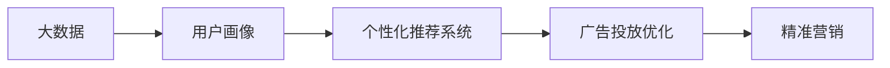

                 

# 信息差的营销个性化革命：大数据如何实现营销个性化

## 1. 背景介绍

### 1.1 问题由来

在数字化时代的浪潮中，企业纷纷利用大数据技术来提升营销效果，却常常陷入“信息差”的困境：

1. **用户画像模糊**：传统营销以“一视同仁”为策略，无法精准把握用户需求。

2. **广告浪费严重**：广告投放难以精确到目标用户，导致大量无效曝光和点击。

3. **客户流失率高**：企业难以维持与用户的长期关系，客户忠诚度低。

4. **营销成本高昂**：大量的人力和物力资源浪费在无效渠道上。

### 1.2 问题核心关键点

面对信息差问题，企业需要一种能够实现用户信息精准获取与个性化营销的解决方案。大数据与个性化推荐技术为这一问题提供了极佳的解决途径。

1. **精准用户画像**：通过分析海量用户行为数据，构建精细化的用户画像，实现对用户兴趣和需求的精准把握。

2. **个性化推荐系统**：利用推荐算法，实现对用户的个性化推荐，提升用户满意度和转化率。

3. **高效广告投放**：实现广告内容与用户特征的精准匹配，避免无效曝光，提高广告投放效率和ROI。

4. **持续客户互动**：通过个性化的内容推送和互动，建立长期稳定的客户关系。

5. **降低营销成本**：自动化和智能化的营销管理，大大减少人工投入和资源浪费。

### 1.3 问题研究意义

解决信息差问题，对提升企业的营销效果和竞争力具有重要意义：

1. **增强市场竞争力**：通过精准的个性化营销，提高产品转化率和客户留存率。

2. **优化资源配置**：有效降低营销成本，提升广告投放的精准度和效果。

3. **改善客户体验**：通过个性化的服务体验，提升用户满意度和忠诚度。

4. **促进消费增长**：帮助企业挖掘潜在客户，提升整体市场份额。

5. **推动产业升级**：大数据和人工智能技术的广泛应用，推动传统产业向智能化方向发展。

## 2. 核心概念与联系

### 2.1 核心概念概述

- **大数据**：指以PB级的海量数据为基础的数据集合，包括结构化和非结构化数据。
- **个性化推荐系统**：利用算法推荐用户可能感兴趣的内容或产品，提升用户体验和转化率。
- **信息差**：指用户与企业之间信息不对称，企业难以精确了解用户需求，导致营销效果不佳。
- **用户画像**：通过分析用户行为数据，构建包含用户特征、兴趣和需求的完整用户模型。
- **广告投放优化**：利用算法匹配用户特征与广告内容，实现高效、精准的广告投放。

这些核心概念之间的关系可以通过以下Mermaid流程图来展示：



这个流程图展示了大数据技术如何通过用户画像、个性化推荐和广告优化，实现对信息差的有效弥合，最终提升精准营销的效果。

## 3. 核心算法原理 & 具体操作步骤

### 3.1 算法原理概述

大数据驱动的营销个性化，主要通过以下几个步骤实现：

1. **数据采集与清洗**：从各种数据源收集数据，并对数据进行清洗和预处理。
2. **用户画像构建**：利用机器学习算法，对用户行为数据进行分析，构建用户画像。
3. **个性化推荐算法**：基于用户画像，设计推荐算法，实现对用户个性化需求的精准匹配。
4. **广告投放优化**：结合用户画像和推荐结果，设计高效广告投放策略，实现精准投放。
5. **实时互动与反馈**：通过实时数据收集和分析，不断调整和优化个性化策略，提升用户互动体验。

### 3.2 算法步骤详解

#### 3.2.1 数据采集与清洗

数据采集与清洗是整个个性化营销系统的基础。通过多渠道收集用户数据，包括点击记录、浏览历史、购买记录、社交媒体互动等。同时，对数据进行清洗和去重，去除噪声数据和异常值。

**具体步骤**：
1. 收集多渠道数据，如电商平台、社交媒体、第三方数据源等。
2. 数据预处理，包括去重、去噪、填补缺失值等。
3. 数据清洗，去除重复记录和异常数据。

#### 3.2.2 用户画像构建

构建用户画像的目的是深入了解用户的特征、兴趣和行为模式，从而实现精准营销。常用的用户画像构建方法包括协同过滤、聚类分析和深度学习等。

**具体步骤**：
1. 利用协同过滤算法，分析用户历史行为数据，找到相似用户。
2. 使用聚类算法，将用户分成不同的兴趣群体。
3. 通过深度学习模型，对用户行为进行复杂特征提取，构建用户画像。

#### 3.2.3 个性化推荐算法

个性化推荐算法是实现精准推荐的核心。通过用户画像，设计推荐模型，预测用户可能感兴趣的内容或产品。常见的推荐算法包括协同过滤、矩阵分解、深度学习等。

**具体步骤**：
1. 建立推荐模型，如协同过滤、矩阵分解等。
2. 输入用户画像，预测用户可能感兴趣的内容或产品。
3. 根据推荐结果，设计个性化推送策略。

#### 3.2.4 广告投放优化

广告投放优化是提升广告效果的关键环节。通过用户画像和推荐结果，设计广告投放策略，实现精准投放，避免无效曝光。

**具体步骤**：
1. 分析用户画像和推荐结果，找出潜在目标用户。
2. 设计广告创意和投放策略，如精准投放时间、地理位置、用户特征等。
3. 实施广告投放，实时监控广告效果，进行优化调整。

#### 3.2.5 实时互动与反馈

实时互动与反馈是提升用户体验和精准营销效果的重要手段。通过收集用户实时反馈，不断调整和优化推荐策略，提升用户互动体验。

**具体步骤**：
1. 收集用户实时反馈，如点击、浏览、购买等行为。
2. 实时分析用户行为数据，调整个性化推荐策略。
3. 定期评估推荐效果，不断优化和迭代推荐模型。

### 3.3 算法优缺点

#### 3.3.1 优点

1. **提升转化率**：通过精准的个性化推荐，提高用户点击和购买转化率。
2. **降低成本**：避免无效广告投放，降低广告支出，提升广告ROI。
3. **增强用户体验**：提供个性化的内容和服务，提升用户满意度和忠诚度。
4. **数据驱动**：基于大量用户数据，实现精准营销决策。

#### 3.3.2 缺点

1. **数据隐私问题**：收集和分析用户数据，存在隐私泄露的风险。
2. **算法复杂度**：个性化推荐算法复杂，需要大量的计算资源。
3. **用户多样性**：用户行为和需求多样，难以完全覆盖。
4. **模型过拟合**：用户数据多样性导致模型容易过拟合，泛化能力有限。

### 3.4 算法应用领域

个性化推荐系统和大数据驱动的精准营销，已经在多个领域得到广泛应用，具体包括：

1. **电商零售**：通过个性化推荐，提升用户购买转化率和复购率，降低退货率。
2. **在线视频**：根据用户兴趣推荐电影、电视剧等，提升观看时长和满意度。
3. **金融理财**：通过个性化推荐，提高用户投资收益和理财建议准确度。
4. **社交网络**：根据用户兴趣推荐内容、好友等，提升用户活跃度和粘性。
5. **旅游出行**：推荐个性化的旅游线路、酒店等，提升用户出行体验。
6. **健康医疗**：推荐个性化医疗信息和健康方案，提升用户体验和满意度。
7. **教育培训**：推荐个性化学习资源和课程，提升学习效果和满意度。

## 4. 数学模型和公式 & 详细讲解 & 举例说明

### 4.1 数学模型构建

个性化推荐系统和大数据营销的核心数学模型包括协同过滤模型、矩阵分解模型和深度学习模型等。这里以协同过滤模型为例，构建推荐系统。

协同过滤模型基于用户行为数据，通过相似度计算找到相似用户，从而推荐其可能感兴趣的内容。假设用户集合为 $U$，物品集合为 $I$，用户 $u$ 对物品 $i$ 的评分表示为 $r_{ui}$，协同过滤模型的目标是通过相似度矩阵 $S$ 找到用户 $u$ 和物品 $i$ 的相似度评分 $\hat{r}_{ui}$，用于预测用户对物品的评分。

**协同过滤模型的目标函数**：

$$
\min_{\theta} \frac{1}{|U \times I|} \sum_{(u,i) \in U \times I} \left( r_{ui} - \hat{r}_{ui} \right)^2
$$

其中 $\theta$ 为模型的参数，$|U \times I|$ 为总用户物品对数量。

### 4.2 公式推导过程

**协同过滤模型**：

协同过滤模型通过计算用户 $u$ 和物品 $i$ 的相似度评分 $\hat{r}_{ui}$，用于预测用户对物品的评分。协同过滤模型的参数为 $\theta$，包含用户特征 $u$ 和物品特征 $i$ 的权重向量。

**用户相似度计算**：

假设用户 $u$ 和物品 $i$ 的相似度评分 $\hat{r}_{ui}$ 的计算公式为：

$$
\hat{r}_{ui} = \theta^T \phi(u) \times \phi(i)
$$

其中 $\phi(u)$ 和 $\phi(i)$ 为用户和物品的特征向量，$\theta$ 为模型的参数向量。

**预测用户评分**：

用户 $u$ 对物品 $i$ 的评分预测公式为：

$$
\hat{r}_{ui} = \sum_{j \in I} \alpha_j \times r_{uj} \times \hat{r}_{ij}
$$

其中 $\alpha_j$ 为物品 $j$ 在用户 $u$ 中的权重，$r_{uj}$ 为用户 $u$ 对物品 $j$ 的评分，$\hat{r}_{ij}$ 为用户 $i$ 和物品 $j$ 的相似度评分。

### 4.3 案例分析与讲解

**案例分析：电商平台个性化推荐**

电商平台上，用户浏览、点击、购买等行为数据，是构建个性化推荐模型的重要数据源。通过协同过滤算法，分析用户行为数据，构建用户画像，实现精准推荐。

1. **数据采集**：
   - 收集用户历史浏览记录、点击记录、购买记录等。
   - 对数据进行清洗和预处理，去除噪声和异常数据。

2. **用户画像构建**：
   - 利用协同过滤算法，分析用户行为数据，找出相似用户。
   - 使用聚类算法，将用户分成不同的兴趣群体。
   - 通过深度学习模型，对用户行为进行复杂特征提取，构建用户画像。

3. **个性化推荐算法**：
   - 基于用户画像，设计协同过滤算法，计算用户和物品的相似度评分。
   - 根据相似度评分，推荐用户可能感兴趣的商品。
   - 通过实时反馈，不断优化推荐模型。

4. **广告投放优化**：
   - 分析用户画像和推荐结果，找出潜在目标用户。
   - 设计广告创意和投放策略，如精准投放时间、地理位置、用户特征等。
   - 实施广告投放，实时监控广告效果，进行优化调整。

5. **实时互动与反馈**：
   - 收集用户实时反馈，如点击、浏览、购买等行为。
   - 实时分析用户行为数据，调整个性化推荐策略。
   - 定期评估推荐效果，不断优化和迭代推荐模型。

## 5. 项目实践：代码实例和详细解释说明

### 5.1 开发环境搭建

要实现上述个性化推荐系统，需要搭建相应的开发环境。以下是使用Python进行TensorFlow开发的环境配置流程：

1. 安装Anaconda：从官网下载并安装Anaconda，用于创建独立的Python环境。

2. 创建并激活虚拟环境：
```bash
conda create -n tf-env python=3.8 
conda activate tf-env
```

3. 安装TensorFlow：根据CUDA版本，从官网获取对应的安装命令。例如：
```bash
conda install tensorflow -c tf -c conda-forge
```

4. 安装各类工具包：
```bash
pip install numpy pandas scikit-learn matplotlib tqdm jupyter notebook ipython
```

完成上述步骤后，即可在`tf-env`环境中开始项目实践。

### 5.2 源代码详细实现

下面以电商平台的个性化推荐系统为例，给出使用TensorFlow实现协同过滤算法的代码实现。

```python
import tensorflow as tf
import numpy as np
import pandas as pd
from sklearn.model_selection import train_test_split

# 读取用户行为数据
data = pd.read_csv('user_behavior.csv')

# 数据预处理
# 去除缺失值
data.dropna(inplace=True)

# 用户和物品特征工程
user_features = data['user_id'].value_counts().reset_index()
user_features.columns = ['user_id', 'user_count']
user_features = user_features.merge(data[['user_id', 'item_id', 'rating']], on='user_id', how='left')
user_features['item_count'] = user_features['item_id'].value_counts().reset_index()['subject_count']

# 模型定义
model = tf.keras.Sequential([
    tf.keras.layers.Dense(32, activation='relu', input_shape=[user_features.shape[1]]),
    tf.keras.layers.Dense(1)
])

# 模型编译
model.compile(optimizer='adam', loss='mse')

# 模型训练
X_train, X_test, y_train, y_test = train_test_split(user_features.drop(['user_id', 'user_count', 'item_count'], axis=1), 
                                                  user_features['rating'], test_size=0.2)

model.fit(X_train, y_train, epochs=100, validation_data=(X_test, y_test))

# 预测用户评分
user_id = 123
user_data = user_features[user_features['user_id'] == user_id]
item_count = user_data['item_count'].values[0]
user_data = user_data.drop(['user_id', 'user_count', 'item_count'], axis=1)
prediction = model.predict(user_data)[0][0]
```

### 5.3 代码解读与分析

让我们再详细解读一下关键代码的实现细节：

**用户行为数据处理**：
- 从CSV文件中读取用户行为数据，并进行预处理，去除缺失值。
- 特征工程，提取用户ID、物品ID、评分等关键特征。

**模型定义**：
- 定义一个简单的神经网络模型，包括两个Dense层，用于计算用户和物品的相似度评分。
- 模型编译，使用Adam优化器和均方误差损失函数。

**模型训练**：
- 将数据集分为训练集和测试集。
- 使用训练集训练模型，并在验证集上进行性能评估。

**预测用户评分**：
- 根据用户ID，从数据集中提取用户行为数据。
- 将用户行为数据输入模型，预测用户评分。

**模型评估与优化**：
- 使用测试集评估模型预测效果，并不断调整和优化模型。

通过上述代码实现，我们可以使用TensorFlow快速构建一个基本的协同过滤推荐系统。

### 5.4 运行结果展示

运行上述代码，可以得到模型训练过程中的损失和验证集损失变化曲线，以及模型在测试集上的评分预测结果。

## 6. 实际应用场景

### 6.1 电商平台个性化推荐

在电商平台上，个性化推荐系统可以显著提升用户购买转化率和复购率。通过对用户历史浏览、点击、购买等行为数据进行分析，构建精细化的用户画像，实现个性化推荐，提高用户满意度和忠诚度。

### 6.2 在线视频个性化推荐

在线视频平台通过个性化推荐系统，为用户推荐可能感兴趣的电影、电视剧等，提升用户观看时长和满意度。通过对用户历史观看记录和评分数据进行分析，构建用户画像，实现精准推荐。

### 6.3 金融理财个性化推荐

金融理财平台通过个性化推荐系统，为用户提供个性化的投资建议和理财方案，提升用户收益和满意度。通过对用户理财行为和偏好进行分析，构建用户画像，实现精准推荐。

### 6.4 社交网络个性化推荐

社交网络平台通过个性化推荐系统，为用户推荐可能感兴趣的内容、好友等，提升用户活跃度和粘性。通过对用户互动数据进行分析，构建用户画像，实现精准推荐。

### 6.5 旅游出行个性化推荐

旅游出行平台通过个性化推荐系统，为用户推荐个性化的旅游线路、酒店等，提升用户出行体验。通过对用户历史旅游数据进行分析，构建用户画像，实现精准推荐。

### 6.6 健康医疗个性化推荐

健康医疗平台通过个性化推荐系统，为用户推荐个性化的医疗信息和健康方案，提升用户体验和满意度。通过对用户健康行为和偏好进行分析，构建用户画像，实现精准推荐。

### 6.7 教育培训个性化推荐

教育培训平台通过个性化推荐系统，为用户推荐个性化的学习资源和课程，提升学习效果和满意度。通过对用户学习行为和偏好进行分析，构建用户画像，实现精准推荐。

## 7. 工具和资源推荐

### 7.1 学习资源推荐

为了帮助开发者系统掌握大数据驱动的个性化推荐技术的理论基础和实践技巧，这里推荐一些优质的学习资源：

1. 《推荐系统原理与算法》系列博文：由大模型技术专家撰写，深入浅出地介绍了推荐系统原理和算法。

2. 《深度学习在推荐系统中的应用》课程：斯坦福大学开设的深度学习课程，讲解了深度学习在推荐系统中的应用。

3. 《推荐系统》书籍：深度学习专家Yoshua Bengio撰写，全面介绍了推荐系统的原理和应用。

4. KDD竞赛：各大数据科学竞赛，如KDD Cup、RecSys等，为开发者提供了实战演练的机会。

5. TensorFlow官方文档：TensorFlow的官方文档，提供了丰富的推荐系统实现和案例。

通过对这些资源的学习实践，相信你一定能够快速掌握大数据驱动的个性化推荐技术的精髓，并用于解决实际的推荐问题。

### 7.2 开发工具推荐

高效的开发离不开优秀的工具支持。以下是几款用于个性化推荐系统开发的常用工具：

1. TensorFlow：基于Python的开源深度学习框架，适合快速迭代研究。提供了丰富的推荐系统实现和工具。

2. PyTorch：基于Python的开源深度学习框架，适合科学研究和工程实践。提供了大量的推荐系统算法和模型。

3. Hadoop/Spark：大数据处理和分析工具，适合大规模数据处理和实时分析。

4. Elasticsearch：搜索引擎，适合构建推荐系统的实时查询和推荐。

5. Pandas/NumPy：数据处理和分析工具，适合数据清洗和预处理。

6. Scikit-learn：机器学习库，适合特征工程和模型训练。

合理利用这些工具，可以显著提升个性化推荐系统的开发效率，加快创新迭代的步伐。

### 7.3 相关论文推荐

个性化推荐系统和大数据驱动的精准营销技术的发展源于学界的持续研究。以下是几篇奠基性的相关论文，推荐阅读：

1. Item-Based Collaborative Filtering for Recommendation System：提出协同过滤算法，用于推荐系统的基本方法。

2. Factorization Machines for Recommender Systems：提出矩阵分解方法，用于推荐系统的高阶特征提取。

3. Deep Learning Recommendation Systems：总结了深度学习在推荐系统中的应用，提供了丰富的算法实现。

4. Attention and Memory in Recommendation Systems：提出注意力机制，用于推荐系统中的用户行为分析和推荐。

5. Adaptive Recommendation System：提出自适应推荐系统，实现对用户需求的动态调整。

这些论文代表了大数据驱动的个性化推荐技术的发展脉络。通过学习这些前沿成果，可以帮助研究者把握学科前进方向，激发更多的创新灵感。

## 8. 总结：未来发展趋势与挑战

### 8.1 总结

本文对大数据驱动的个性化推荐技术进行了全面系统的介绍。首先阐述了信息差问题及其对企业营销的影响，明确了个性化推荐系统在解决信息差问题上的独特价值。其次，从原理到实践，详细讲解了个性化推荐系统的核心算法和具体操作步骤，给出了推荐系统开发的完整代码实例。同时，本文还广泛探讨了个性化推荐系统在多个行业领域的应用前景，展示了大数据驱动的精准营销的巨大潜力。

通过本文的系统梳理，可以看到，大数据驱动的个性化推荐技术正在成为互联网企业的重要竞争力。这些技术的广泛应用，不仅提升了企业营销效果，还推动了社会经济的数字化转型。未来，伴随大数据和人工智能技术的进一步发展，推荐系统的精准性和个性化将得到更大的提升，进一步优化企业营销决策，改善用户体验。

### 8.2 未来发展趋势

展望未来，个性化推荐系统将呈现以下几个发展趋势：

1. **实时化**：随着计算能力的提升，实时推荐系统将成为主流，能够及时响应用户需求，提供动态推荐。

2. **跨模态**：推荐系统将从单一模态扩展到跨模态融合，结合图像、视频、语音等多模态信息，提升推荐效果。

3. **多目标优化**：推荐系统将实现多目标优化，兼顾用户满意度、业务收益和系统效率等。

4. **自适应**：推荐系统将具备自适应能力，根据用户反馈和行为实时调整推荐策略，提升推荐效果。

5. **公平性**：推荐系统将注重公平性，避免推荐偏见，实现对不同用户群体的均衡推荐。

6. **可解释性**：推荐系统将注重可解释性，提供推荐结果的透明解释，增强用户信任。

7. **安全性**：推荐系统将注重安全性，保护用户隐私和数据安全，避免数据泄露和滥用。

以上趋势凸显了大数据驱动的个性化推荐技术的广阔前景。这些方向的探索发展，必将进一步提升推荐系统的性能和应用范围，为社会经济的数字化转型带来新的动力。

### 8.3 面临的挑战

尽管个性化推荐系统已经取得了瞩目成就，但在迈向更加智能化、普适化应用的过程中，它仍面临着诸多挑战：

1. **数据隐私问题**：收集和分析用户数据，存在隐私泄露的风险。

2. **计算资源需求**：推荐算法复杂，需要大量的计算资源。

3. **模型泛化能力**：用户行为和需求多样，模型容易过拟合，泛化能力有限。

4. **用户多样性**：不同用户之间的行为和需求差异大，难以完全覆盖。

5. **冷启动问题**：新用户或物品的推荐难度大，缺乏足够的历史数据。

6. **推荐算法公平性**：推荐算法可能导致不公平的现象，如推荐偏见。

7. **用户粘性问题**：用户可能会疲劳于持续推荐，导致粘性下降。

正视推荐系统面临的这些挑战，积极应对并寻求突破，将是个性化推荐系统走向成熟的必由之路。相信随着学界和产业界的共同努力，这些挑战终将一一被克服，推荐系统必将在构建人机协同的智能时代中扮演越来越重要的角色。

### 8.4 研究展望

面对个性化推荐系统所面临的种种挑战，未来的研究需要在以下几个方面寻求新的突破：

1. **深度学习与强化学习结合**：结合深度学习和强化学习，实现更复杂的用户行为建模和推荐策略优化。

2. **联邦学习与隐私保护**：利用联邦学习，在保护用户隐私的前提下，实现跨平台推荐系统的协同优化。

3. **多目标优化与公平性**：引入多目标优化技术，实现用户满意度、业务收益和系统效率的均衡。

4. **跨模态融合与多任务学习**：结合图像、视频、语音等多模态数据，实现跨模态推荐系统的协同优化。

5. **自适应推荐与动态调整**：引入自适应技术，实现对用户需求的动态调整和推荐策略的优化。

6. **用户交互与反馈机制**：引入用户交互和反馈机制，提升推荐系统的可解释性和公平性。

这些研究方向的探索，必将引领个性化推荐技术迈向更高的台阶，为构建更加智能、普适、公平的推荐系统提供新的思路和方法。

## 9. 附录：常见问题与解答

**Q1：个性化推荐系统是否适用于所有场景？**

A: 个性化推荐系统适用于数据量较大、用户行为多样化的场景，如电商、视频、金融、社交等。但对于一些特定领域，如医疗、法律等，推荐效果可能不尽如人意。此时需要结合领域知识，进行专家规则的融合。

**Q2：如何选择合适的推荐算法？**

A: 推荐算法的选取需要考虑数据量、用户规模、推荐效果等因素。常见的推荐算法包括协同过滤、矩阵分解、深度学习等。对于小型数据集，推荐使用协同过滤和矩阵分解；对于大规模数据集，推荐使用深度学习算法。

**Q3：如何处理冷启动问题？**

A: 冷启动问题可以通过引入用户画像、社交网络关系、多模态数据等方式解决。例如，利用用户社会关系推荐，或者在推荐中引入多模态数据，如用户社交媒体行为、兴趣标签等。

**Q4：推荐系统如何处理推荐公平性问题？**

A: 推荐系统可以通过引入公平性约束、多重目标优化等方法，实现对不同用户群体的均衡推荐。例如，引入多样性约束，确保不同用户能够获得多样化的推荐内容。

**Q5：推荐系统如何处理用户粘性问题？**

A: 推荐系统可以通过引入用户反馈、动态调整推荐策略等方式，提升用户粘性。例如，利用用户反馈信息，不断调整推荐策略，提升用户满意度。

通过这些问题的回答，可以帮助开发者更好地理解个性化推荐系统的实现过程和挑战，进一步优化推荐系统的设计和性能。

---

作者：禅与计算机程序设计艺术 / Zen and the Art of Computer Programming

