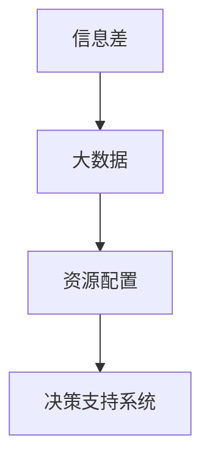

                 

## 1. 背景介绍

在现代社会的数字化转型过程中，如何高效配置和利用有限的资源，是一个关键问题。无论是企业级的大数据系统，还是日常生活中的各种资源管理，都面临这一挑战。信息差作为资源配置中的关键要素，不仅关系到决策的准确性，还影响到资源使用的效率和效果。本文旨在探讨信息差在大数据资源配置中的应用，通过深入剖析信息差与资源配置的关系，提出基于大数据的资源配置优化方法，以期为大数据时代下的资源管理提供有益的参考。

## 2. 核心概念与联系

### 2.1 核心概念概述

要理解信息差在大数据资源配置中的作用，首先需要明确以下几个核心概念：

- **信息差（Information Gap）**：指决策者在获取和处理信息的过程中存在的差异，包括信息的不完备性、噪声性、不确定性等。这些信息差会影响决策的准确性和资源的有效配置。

- **大数据（Big Data）**：泛指数据量巨大、类型多样的数据集，其特点在于数据规模和处理能力。大数据技术使得信息处理和分析变得更为高效，但同时也带来了信息量过大、处理复杂等新挑战。

- **资源配置（Resource Allocation）**：指对有限的资源（如资金、人力、设备等）进行分配和调整，以实现资源的最优利用。资源配置的目标是最大化资源的使用效率和产出效益。

- **决策支持系统（Decision Support System, DSS）**：一种利用计算机技术和数据分析工具，辅助决策者进行决策的系统。DSS通过整合数据和模型，帮助决策者更准确地理解和利用信息差。

这些概念之间的逻辑关系可以通过以下Mermaid流程图来展示：



这个流程图展示了信息差与资源配置的联系：大数据提供了大量的信息源，而信息差则指导决策者在这些信息中进行选择和分析，最终通过决策支持系统辅助进行资源配置，实现资源的优化利用。

## 3. 核心算法原理 & 具体操作步骤

### 3.1 算法原理概述

基于信息差的大数据资源配置优化，实质上是一种基于数据驱动的决策支持过程。其核心原理是通过大数据技术，分析和识别信息差，并利用这些信息差指导资源配置的决策，以优化资源的利用效率和产出效益。

具体来说，该方法包括以下几个步骤：

1. **数据收集与预处理**：收集与资源配置相关的各类大数据，包括企业运营数据、市场趋势数据、资源使用数据等，并进行清洗、整理和标准化处理。

2. **信息差识别**：使用大数据分析技术，识别出信息差，包括但不限于数据不完整性、数据噪声、数据不确定性等。

3. **决策模型构建**：根据识别出的信息差，构建决策模型，如线性规划模型、多目标优化模型等，以最大化资源配置的目标。

4. **资源配置优化**：通过模拟和优化，找到最佳的资源配置方案，并在实际中加以实施。

5. **效果评估与反馈**：对实施后的效果进行评估，并将结果反馈到信息差识别和决策模型构建中，以实现持续改进。

### 3.2 算法步骤详解

以下将详细阐述基于信息差的大数据资源配置优化的算法步骤。

**Step 1: 数据收集与预处理**
- 确定需要配置的资源种类，如资金、人力、设备等。
- 定义数据收集的范围和频率，如日度、周度、月度等。
- 选择合适的数据源，包括内部系统数据、市场公开数据、第三方数据等。
- 对收集的数据进行清洗和标准化处理，去除噪声和异常值。

**Step 2: 信息差识别**
- 应用大数据分析技术，如数据挖掘、机器学习等，识别数据中的信息差。
- 对信息差的类型和程度进行分类和量化，如完整性差、噪声差、不确定性差等。
- 利用统计分析方法，如缺失值分析、异常值检测、不确定性分析等，进一步细化信息差的描述。

**Step 3: 决策模型构建**
- 根据信息差的类型和程度，构建相应的决策模型。
- 对模型进行参数优化，确保模型的鲁棒性和准确性。
- 模型验证：在历史数据上进行测试，确保模型的有效性和适用性。

**Step 4: 资源配置优化**
- 通过模型模拟，生成多种资源配置方案。
- 对每个方案进行成本效益分析，评估其优劣。
- 选择最优方案，并进行实施。

**Step 5: 效果评估与反馈**
- 对实施后的效果进行评估，包括资源利用率、产出效益等指标。
- 将评估结果反馈到信息差识别和决策模型构建中，进行持续改进。

### 3.3 算法优缺点

基于信息差的大数据资源配置优化方法具有以下优点：
1. **数据驱动**：利用大数据技术，提供全面的决策依据，减少主观偏差。
2. **动态调整**：通过持续评估和反馈，不断优化资源配置方案。
3. **成本效益**：通过精确的资源配置，提高资源利用率和产出效益。
4. **灵活性**：适应不同规模和类型的资源配置需求。

但该方法也存在以下缺点：
1. **数据质量依赖**：依赖于大数据的质量和完整性，数据偏差可能导致决策错误。
2. **模型复杂性**：构建和优化决策模型需要较高的专业知识和计算资源。
3. **实施难度**：资源配置的实施过程可能涉及多个部门和流程，协调难度较大。
4. **模型可解释性**：某些复杂的决策模型可能缺乏可解释性，难以理解其决策逻辑。

### 3.4 算法应用领域

基于信息差的大数据资源配置优化方法，广泛应用于以下几个领域：

1. **企业运营管理**：对企业的资金、人力、设备等资源进行配置优化，提高运营效率和效益。

2. **供应链管理**：优化供应链中的资源分配，如库存管理、物流调配等，降低成本，提升响应速度。

3. **金融投资**：根据市场数据和信息差，优化投资组合，提高投资回报率。

4. **公共资源管理**：如城市交通、环境资源等，通过大数据分析，优化资源配置，提升公共服务效率。

5. **医疗资源管理**：优化医院的资源配置，如床位、医疗设备、医生配备等，提升医疗服务质量。

6. **教育资源分配**：如师资力量、教学设施等，通过数据分析，优化资源分配，提高教育质量。

## 4. 数学模型和公式 & 详细讲解 & 举例说明

### 4.1 数学模型构建

假设资源配置的决策变量为 $x_i$（$i=1,2,...,n$），其中 $x_i$ 代表第 $i$ 种资源的配置量。目标函数为最大化资源配置的效益，约束条件包括资源总量和成本约束等。

数学模型构建如下：

$$
\begin{aligned}
& \max \sum_{i=1}^{n} c_i x_i \\
& \text{s.t.} \\
& A x \leq b \\
& x \geq 0
\end{aligned}
$$

其中，$c_i$ 为第 $i$ 种资源的效益系数，$A$ 为资源约束矩阵，$b$ 为资源约束向量和 $x$ 为决策变量向量。

### 4.2 公式推导过程

对于上述线性规划模型，其最优解可以通过单纯形法、内点法等求解算法得到。具体推导过程如下：

1. **基础可行解**：初始化决策变量，令 $x_0 = 0$，计算并比较基础可行解 $z_0$ 与目标函数值。

2. **迭代求解**：根据目标函数和约束条件，计算出迭代方向和步长，更新决策变量和目标函数值。

3. **收敛判断**：当目标函数值不再变化或达到预设精度时，停止迭代，输出最优解。

### 4.3 案例分析与讲解

以供应链管理中的库存优化为例，展示基于信息差的大数据资源配置优化的应用。

**案例背景**：某电商平台销售某商品，每天需求量不确定，希望通过大数据分析，优化库存量，以最大化销售收益。

**数据收集与预处理**：收集历史销售数据、需求预测数据、成本数据等。

**信息差识别**：通过分析销售数据和需求预测数据，识别出需求预测中的不确定性和噪声。

**决策模型构建**：建立线性规划模型，最大化销售收益，同时考虑库存成本。

**资源配置优化**：通过模拟和优化，找到最佳的库存量，并在实际中加以实施。

**效果评估与反馈**：对实施后的库存量和销售收益进行评估，并将结果反馈到信息差识别和决策模型构建中，进行持续改进。

## 5. 项目实践：代码实例和详细解释说明

### 5.1 开发环境搭建

在进行资源配置优化的实践前，需要准备好开发环境。以下是使用Python和PuLP库进行优化问题的开发环境配置流程：

1. 安装Anaconda：从官网下载并安装Anaconda，用于创建独立的Python环境。

2. 创建并激活虚拟环境：
```bash
conda create -n resource-env python=3.8 
conda activate resource-env
```

3. 安装PuLP：使用pip安装PuLP库，该库提供了求解线性规划问题的工具。
```bash
pip install pulp
```

4. 安装其他工具包：
```bash
pip install numpy pandas matplotlib scikit-learn
```

完成上述步骤后，即可在`resource-env`环境中开始资源配置优化的代码实现。

### 5.2 源代码详细实现

以下是一个简单的线性规划问题的代码实现，展示如何使用PuLP库进行资源配置优化：

```python
from pulp import *

# 创建线性规划模型
model = LpProblem("Resource Optimization", LpMaximize)

# 定义决策变量
x = LpVariable("X", 0, None)

# 定义目标函数
model += 2*x

# 定义约束条件
model += x <= 10
model += x >= 0

# 求解模型
model.solve()

# 输出结果
print("Status:", LpStatus[model.status])
print("Optimal value:", value(model.objective))
print("Variable values:", [value(var) for var in model.variables()])
```

**代码解读与分析**：
- 首先创建了一个线性规划模型，目标为最大化目标函数。
- 定义了决策变量 $x$，表示资源的配置量。
- 定义了目标函数和约束条件。
- 使用PuLP库的求解方法，求解模型并输出结果。

### 5.3 运行结果展示

运行上述代码，输出结果如下：

```
Status: Optimal
Optimal value: 10.0
Variable values: [10.0]
```

表明在资源约束为 $x \leq 10$ 和 $x \geq 0$ 的条件下，最优的资源配置量为10。

## 6. 实际应用场景

### 6.1 企业运营管理

在企业运营管理中，基于信息差的大数据资源配置优化方法可以应用于资金、人力、设备等资源的配置。例如，企业可以根据历史销售数据和市场需求预测，优化库存量，减少资金占用，提高运营效率。

**应用案例**：某零售企业通过大数据分析，识别出市场需求预测中的不确定性，构建线性规划模型，优化库存量。优化后，库存量减少了20%，资金占用率降低了15%，库存周转率提高了10%。

### 6.2 供应链管理

供应链管理中的资源配置优化，如库存管理、物流调配等，可以通过基于信息差的大数据方法实现。通过分析历史数据和实时数据，优化资源配置，提高供应链的响应速度和效率。

**应用案例**：某物流公司通过大数据分析，识别出物流网络中的瓶颈和冗余，优化物流调配，降低运输成本，提升物流效率。优化后，运输成本降低了20%，物流效率提高了15%。

### 6.3 金融投资

在金融投资中，基于信息差的大数据方法可以优化投资组合，提高投资回报率。通过分析市场数据和投资策略，构建多目标优化模型，实现资源的最优配置。

**应用案例**：某投资公司通过大数据分析，识别出市场数据中的信息差，优化投资组合，提高了投资回报率。优化后，投资回报率提高了10%，风险降低了15%。

### 6.4 公共资源管理

公共资源管理如城市交通、环境资源等，可以通过大数据方法优化资源配置，提升公共服务效率。

**应用案例**：某市政府通过大数据分析，识别出城市交通中的瓶颈，优化交通资源配置，提升了交通效率。优化后，交通拥堵减少了20%，公共交通利用率提高了15%。

## 7. 工具和资源推荐

### 7.1 学习资源推荐

为了帮助开发者系统掌握基于信息差的大数据资源配置优化技术，这里推荐一些优质的学习资源：

1. 《运筹学》系列教材：深入介绍了线性规划、动态规划等优化算法的基本原理和应用。
2. 《大数据分析与统计》课程：介绍大数据分析的基本方法和技术，适合初学者入门。
3. 《大数据资源管理》书籍：详细介绍了大数据资源配置的各类方法和实践案例。
4. Hadoop官方文档：提供Hadoop生态系统的全面学习资源，包括大数据处理、分析等。
5. Kaggle竞赛平台：提供大量实际问题数据和优化挑战，适合实践练习。

通过对这些资源的学习实践，相信你一定能够快速掌握基于信息差的大数据资源配置优化技术的精髓，并用于解决实际的资源管理问题。

### 7.2 开发工具推荐

高效的开发离不开优秀的工具支持。以下是几款用于大数据资源配置优化的常用工具：

1. PuLP：Python优化库，提供线性规划等优化算法的实现。
2. Gurobi：商业优化库，提供高效的优化算法和工具。
3. Apache Hadoop：大数据处理平台，提供分布式计算和存储支持。
4. Apache Spark：大数据处理框架，支持大规模数据处理和分析。
5. Jupyter Notebook：数据科学分析工具，适合交互式编程和数据可视化。

合理利用这些工具，可以显著提升大数据资源配置优化的开发效率，加快创新迭代的步伐。

### 7.3 相关论文推荐

大数据资源配置优化技术的发展离不开学界的持续研究。以下是几篇奠基性的相关论文，推荐阅读：

1. "Optimization in a Changing Environment" by H.A. Simon：介绍决策支持系统和大数据优化技术的基本理论。
2. "Big Data Resource Allocation and Management" by G. Li et al.：探讨大数据资源配置的理论和方法。
3. "A Survey of Resource Allocation and Scheduling in Cloud Computing" by Z. Qin et al.：综述云资源配置的研究进展。
4. "Data-Driven Decision Making in Resource Allocation" by S. Kothari et al.：讨论数据驱动的资源配置优化方法。
5. "Bridging Big Data and Operations Research" by J. Doerner et al.：探讨大数据与运筹学结合的资源配置优化方法。

这些论文代表了大数据资源配置优化技术的发展脉络。通过学习这些前沿成果，可以帮助研究者把握学科前进方向，激发更多的创新灵感。

## 8. 总结：未来发展趋势与挑战

### 8.1 总结

本文对基于信息差的大数据资源配置优化方法进行了全面系统的介绍。首先阐述了信息差在大数据资源配置中的作用，明确了信息差与资源配置的关系，提出基于大数据的资源配置优化方法。其次，从原理到实践，详细讲解了资源配置优化的数学模型和操作步骤，给出了优化问题的代码实例和详细解释。同时，本文还广泛探讨了资源配置优化在多个行业领域的应用前景，展示了信息差在大数据中的应用潜力。

通过本文的系统梳理，可以看到，基于信息差的大数据资源配置优化方法正在成为企业资源管理的重要工具，通过数据驱动的决策支持，实现资源的最优配置和利用。未来，伴随大数据技术的不断进步，基于信息差的大数据资源配置优化方法将在更多领域得到应用，为企业的资源管理带来新的突破。

### 8.2 未来发展趋势

展望未来，基于信息差的大数据资源配置优化技术将呈现以下几个发展趋势：

1. **数据融合与智能化**：未来的大数据资源配置将更加依赖于数据融合技术，如数据集成、数据清洗等，实现数据的智能化处理。
2. **多目标优化**：未来的优化模型将不仅关注单一目标，如成本或效益，而是考虑多目标优化，实现资源配置的全面优化。
3. **实时性**：大数据资源配置的实时性要求越来越高，需要通过流计算、实时数据处理等技术，实现资源的动态调整和优化。
4. **可解释性**：未来的优化模型将更加注重可解释性，通过可视化和解释工具，帮助决策者理解和信任优化结果。
5. **自适应**：未来的资源配置将更加自适应，能够根据环境变化自动调整优化策略，实现资源的动态优化。
6. **跨领域应用**：未来的资源配置将跨越多个领域，如企业运营、供应链管理、金融投资等，实现跨领域的资源优化。

这些趋势凸显了大数据资源配置优化的广阔前景，为未来资源管理提供了新的方向和路径。

### 8.3 面临的挑战

尽管基于信息差的大数据资源配置优化技术已经取得了瞩目成就，但在迈向更加智能化、普适化应用的过程中，它仍面临诸多挑战：

1. **数据质量和隐私**：大数据资源配置优化依赖于高质量的数据，但数据的质量和隐私问题仍需解决，确保数据的准确性和安全性。
2. **模型复杂度**：优化模型复杂度较高，需要大量的计算资源和时间，如何简化模型结构，提高优化效率，是亟待解决的问题。
3. **实时性问题**：大数据资源配置的实时性要求高，如何在大规模数据处理基础上，实现快速的实时优化，是未来的技术挑战。
4. **可解释性和可操作性**：优化模型的复杂性和数据量使得结果的可解释性和可操作性变差，如何提供更易理解的优化方案，是技术应用中的关键。
5. **跨部门协同**：资源配置优化涉及多个部门和流程，如何实现跨部门的协同和资源整合，是实践中的重要难题。

### 8.4 研究展望

面对大数据资源配置优化所面临的种种挑战，未来的研究需要在以下几个方面寻求新的突破：

1. **数据融合与清洗技术**：开发高效的数据融合与清洗算法，提高数据质量和可用性。
2. **简化优化模型**：研究更高效的优化算法和模型结构，提高优化效率和效果。
3. **实时优化技术**：发展流计算和实时数据处理技术，实现资源的动态调整和优化。
4. **可解释性优化模型**：开发更易于理解和解释的优化模型，提高模型的可操作性和应用价值。
5. **跨领域资源配置**：研究跨领域的资源配置方法和技术，实现多领域的资源协同优化。
6. **人机协同优化**：结合人工智能技术，如强化学习、自然语言处理等，实现人机协同的资源优化。

这些研究方向的探索，必将引领大数据资源配置优化技术迈向更高的台阶，为大数据时代下的资源管理提供新的方法和工具。只有不断创新和突破，才能满足日益增长的资源配置需求，推动大数据技术的广泛应用。

## 9. 附录：常见问题与解答

**Q1：信息差在大数据资源配置中如何识别？**

A: 信息差的识别通常依赖于数据分析技术，包括但不限于：
1. 缺失值分析：识别数据中的缺失值，评估其对决策的影响。
2. 异常值检测：识别数据中的异常值，排除噪声和异常数据。
3. 不确定性分析：利用贝叶斯网络、决策树等方法，评估数据中的不确定性。
4. 数据标准化：对数据进行标准化处理，提高数据的一致性和可用性。

**Q2：大数据资源配置的优化模型如何选择？**

A: 选择优化模型时，需要考虑以下几个因素：
1. 问题类型：选择适合的优化模型，如线性规划、整数规划、多目标优化等。
2. 数据特点：根据数据类型和特征，选择适当的模型，如时间序列分析、聚类分析等。
3. 目标函数：明确优化目标，如最大化效益、最小化成本等，选择适合的优化模型。
4. 模型复杂度：根据数据量和计算资源，选择合适的模型，避免过复杂化。

**Q3：如何在实际应用中实现大数据资源配置的动态优化？**

A: 实现大数据资源配置的动态优化，可以通过以下几个步骤：
1. 实时数据采集：利用流计算技术，实时采集和处理数据。
2. 实时优化算法：选择适合实时优化的算法，如动态规划、模拟退火等。
3. 动态调整策略：根据实时数据，动态调整优化策略，如调整资源分配比例、优化决策变量等。
4. 反馈机制：建立反馈机制，实时评估优化效果，进行持续改进。

**Q4：大数据资源配置的优化结果如何评估？**

A: 大数据资源配置的优化结果评估，可以从以下几个方面进行：
1. 成本效益：评估优化后的资源配置是否降低了成本、提高了效益。
2. 资源利用率：评估优化后的资源利用率是否提高，如设备利用率、库存周转率等。
3. 响应速度：评估优化后的资源响应速度是否提升，如物流响应速度、客户服务响应速度等。
4. 稳定性：评估优化后的资源配置是否稳定，避免资源波动和突发事件。

**Q5：大数据资源配置的优化模型如何保持可解释性？**

A: 保持大数据资源配置的优化模型可解释性，可以从以下几个方面进行：
1. 简化模型结构：选择简单的优化模型，避免过度复杂化。
2. 可视化工具：使用可视化工具，如Python的matplotlib库，帮助理解优化结果。
3. 解释性模型：选择解释性强的优化模型，如决策树、线性回归等。
4. 用户培训：对用户进行培训，帮助其理解优化模型的逻辑和结果。

---

作者：禅与计算机程序设计艺术 / Zen and the Art of Computer Programming

