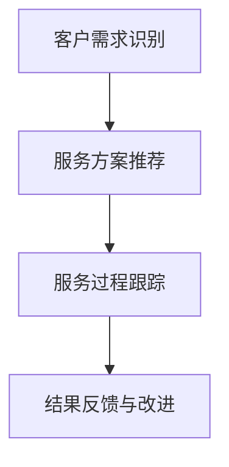

                 

## 1. 背景介绍

### 1.1 问题由来
在数字化和互联网普及的今天，客户服务已经成为了各大企业竞争的关键领域之一。然而，客户在寻求服务时所遇到的最大难题之一，就是信息不对称问题。信息不对称指的是，客户在与企业交互过程中，由于知识、信息获取的差异，导致无法充分理解服务流程、服务内容或服务风险，从而影响其决策和体验。

信息不对称不仅会影响客户的满意度，也会导致企业无法获得全面的用户反馈，从而无法及时改进服务质量，造成资源浪费。因此，信息差成为了当前客户服务中的重大挑战，急需通过技术手段来解决。

### 1.2 问题核心关键点
本文旨在探讨信息不对称问题在客户服务中的应用，并提出通过信息差技术来解决这一问题的具体方法和实践案例。信息差技术是一种将客户需求与企业服务进行匹配的智能化手段，通过分析客户信息和行为数据，精准推荐服务方案，从而降低信息不对称对客户服务的影响。

在具体实践中，信息差技术涵盖了多个环节，包括但不限于：客户需求识别、服务方案推荐、服务过程跟踪和结果反馈。通过这些环节，信息差技术能够实现更高效、更个性化的客户服务，提升客户满意度和企业运营效率。

### 1.3 问题研究意义
研究信息差技术在客户服务中的应用，对于提升企业服务质量、优化客户体验、降低服务成本等方面具有重要意义：

1. **提升服务质量**：通过精准推荐服务方案，帮助客户更快地解决问题，减少服务过程的复杂性和不确定性，提升客户服务体验。
2. **优化客户体验**：通过个性化服务方案，使客户获得更加贴合自身需求的服务，提升客户满意度和忠诚度。
3. **降低服务成本**：减少无效服务请求和重复服务，提高服务效率，降低企业的服务成本。
4. **加速服务迭代**：通过实时反馈和数据积累，快速改进服务流程和产品，提升企业市场竞争力。

## 2. 核心概念与联系

### 2.1 核心概念概述

为了更好地理解信息差技术，我们首先需要介绍几个核心概念：

- **客户需求识别**：通过分析客户的历史行为、反馈和实时交互数据，识别客户的真实需求和痛点。
- **服务方案推荐**：根据客户需求，推荐最合适的服务方案，涵盖产品推荐、服务流程、解决方案等。
- **服务过程跟踪**：实时监控服务过程，提供及时反馈和支持，确保服务质量。
- **结果反馈与改进**：收集客户服务后的反馈，用于改进服务流程和产品，提升客户满意度。

这些核心概念之间的逻辑关系可以通过以下Mermaid流程图来展示：



这个流程图展示了一组信息差技术的关键流程：

1. 客户需求识别是信息差技术的起点，通过数据分析，确定客户的需求和痛点。
2. 服务方案推荐则是根据识别出的需求，提供最适合的服务方案。
3. 服务过程跟踪是在服务过程中实时监控和反馈，确保服务质量。
4. 结果反馈与改进是在服务结束后收集客户反馈，用于不断优化服务流程。

### 2.2 核心概念原理和架构

信息差技术的核心原理是利用数据驱动决策，通过深度学习、自然语言处理等技术，对客户需求和服务方案进行匹配，从而实现精准推荐。其技术架构如图2-1所示：


该架构包括数据层、算法层和应用层三大部分：

1. **数据层**：收集和存储客户历史行为数据、交互数据和服务日志，作为信息差技术的输入数据。
2. **算法层**：包括客户需求识别、服务方案推荐、服务过程跟踪和结果反馈与改进等多个子模块，利用机器学习和自然语言处理技术，对数据进行处理和分析。
3. **应用层**：将信息差技术应用到客户服务的各个环节，通过推荐系统、聊天机器人、数据分析工具等，实现客户服务的智能化和个性化。

## 3. 核心算法原理 & 具体操作步骤

### 3.1 算法原理概述

信息差技术的核心算法包括深度学习、自然语言处理、强化学习等，这些算法共同构成了信息差技术的技术基础。下面我们将详细探讨这些核心算法原理。

#### 3.1.1 深度学习
深度学习是信息差技术的核心算法之一，主要用于客户需求识别和服务方案推荐。深度学习模型通过多层神经网络，可以自动提取输入数据中的特征，并进行分类、预测等任务。

在客户需求识别中，可以使用循环神经网络(RNN)或卷积神经网络(CNN)等模型，对客户的历史行为数据进行建模，识别出客户的痛点和需求。在服务方案推荐中，可以使用基于协同过滤的推荐算法，结合深度学习模型，对服务方案进行排序和筛选。

#### 3.1.2 自然语言处理
自然语言处理技术主要用于客户需求识别和服务方案推荐，通过分析客户的文本输入，提取关键词和实体，理解客户的意图和需求。常用的自然语言处理技术包括分词、命名实体识别、情感分析等。

在客户需求识别中，可以使用BERT、GPT等预训练语言模型，对客户文本进行语义分析，识别出客户的痛点和需求。在服务方案推荐中，可以利用自然语言处理技术，对服务方案进行文本生成和匹配，提供更加贴近客户需求的方案。

#### 3.1.3 强化学习
强化学习技术主要用于服务过程跟踪和结果反馈与改进，通过智能体与环境互动，学习最优策略，实现服务的自动化和优化。常用的强化学习算法包括Q-learning、策略梯度等。

在服务过程跟踪中，可以使用强化学习技术，对服务流程进行优化，提供更加贴合客户需求的服务方案。在结果反馈与改进中，可以利用强化学习技术，分析客户反馈，优化服务流程和产品，提升客户满意度。

### 3.2 算法步骤详解

信息差技术的实现可以分为以下几个关键步骤：

#### 3.2.1 数据预处理
数据预处理是信息差技术的第一步，包括数据收集、数据清洗、特征工程等。数据预处理的目标是提高数据质量和可用性，为后续的深度学习、自然语言处理等算法提供支持。

1. **数据收集**：收集客户的历史行为数据、交互数据和服务日志，涵盖用户行为、用户反馈、服务日志等多个方面。
2. **数据清洗**：清洗数据中的噪音、异常值和缺失值，确保数据的完整性和准确性。
3. **特征工程**：提取和构建有用的特征，如用户ID、服务类型、时间戳等，用于后续的深度学习、自然语言处理等算法。

#### 3.2.2 客户需求识别
客户需求识别是信息差技术的核心环节之一，通过分析客户的历史行为数据和实时交互数据，识别客户的痛点和需求。

1. **历史行为分析**：对客户的历史行为数据进行分析，识别出客户的偏好、兴趣和痛点。
2. **实时交互分析**：对客户的实时交互数据进行分析，如聊天记录、服务请求等，识别出客户的实时需求和痛点。
3. **综合分析**：将历史行为数据和实时交互数据综合分析，得到客户的需求和痛点。

#### 3.2.3 服务方案推荐
服务方案推荐是信息差技术的另一核心环节，根据客户需求，推荐最合适的服务方案。

1. **服务方案构建**：构建服务方案集合，涵盖产品推荐、服务流程、解决方案等多个方面。
2. **服务方案匹配**：利用深度学习、自然语言处理等技术，对客户需求和服务方案进行匹配，推荐最适合的服务方案。
3. **服务方案优化**：根据客户反馈和服务效果，优化服务方案，提升推荐效果。

#### 3.2.4 服务过程跟踪
服务过程跟踪是信息差技术的重要环节，通过实时监控服务过程，提供及时反馈和支持，确保服务质量。

1. **服务过程监控**：实时监控服务过程，记录服务日志、服务请求和响应等数据。
2. **服务过程分析**：利用深度学习、自然语言处理等技术，分析服务日志和服务过程，发现问题和服务瓶颈。
3. **服务过程优化**：根据服务过程分析结果，优化服务流程，提升服务质量。

#### 3.2.5 结果反馈与改进
结果反馈与改进是信息差技术的最后一步，通过收集客户反馈，用于改进服务流程和产品，提升客户满意度。

1. **客户反馈收集**：收集客户的服务反馈和评价，涵盖满意度、问题反馈等多个方面。
2. **反馈分析**：利用自然语言处理技术，对客户反馈进行分析，提取关键词和情感信息。
3. **改进措施**：根据反馈分析结果，优化服务流程和产品，提升客户满意度。

### 3.3 算法优缺点
信息差技术作为一种客户服务解决方案，具有以下优点：

1. **高效性**：通过深度学习、自然语言处理等技术，可以自动分析客户需求，推荐最合适的服务方案，提高服务效率。
2. **个性化**：通过个性化推荐和服务流程优化，可以提供更加贴合客户需求的服务，提升客户满意度和忠诚度。
3. **动态性**：可以实时监控和反馈服务过程，快速改进服务流程和产品，提升服务质量。

然而，信息差技术也存在一些缺点：

1. **数据依赖**：信息差技术需要大量的数据支持，数据质量和完整性对技术效果有重要影响。
2. **算法复杂**：深度学习、自然语言处理、强化学习等技术本身较为复杂，需要较高的技术门槛。
3. **隐私风险**：客户数据的收集和处理需要遵守隐私保护法规，确保数据安全和隐私保护。

### 3.4 算法应用领域

信息差技术已经广泛应用于多个领域，涵盖客户服务、市场营销、个性化推荐等多个方面。以下是几个典型的应用场景：

#### 3.4.1 客户服务
在客户服务领域，信息差技术可以用于服务方案推荐、服务过程跟踪和结果反馈与改进，提升客户服务体验和满意度。

1. **服务方案推荐**：通过分析客户需求，推荐最适合的服务方案，提高服务效率。
2. **服务过程跟踪**：实时监控服务过程，提供及时反馈和支持，确保服务质量。
3. **结果反馈与改进**：收集客户反馈，优化服务流程和产品，提升客户满意度。

#### 3.4.2 市场营销
在市场营销领域，信息差技术可以用于客户需求识别和个性化推荐，提升营销效果和客户转化率。

1. **客户需求识别**：通过分析客户行为数据，识别客户的痛点和需求。
2. **个性化推荐**：利用个性化推荐算法，向客户推荐最适合的产品和方案。
3. **客户反馈分析**：分析客户反馈，优化营销策略和产品，提升客户转化率。

#### 3.4.3 个性化推荐
在个性化推荐领域，信息差技术可以用于推荐系统构建和服务方案优化，提升用户体验和转化率。

1. **推荐系统构建**：利用深度学习、协同过滤等技术，构建个性化推荐系统，提供更贴合用户需求的产品和方案。
2. **服务方案优化**：根据用户反馈，优化推荐算法和服务方案，提升用户体验和转化率。
3. **实时反馈与改进**：实时监控用户行为，收集用户反馈，优化推荐系统和服务流程，提升用户满意度。

## 4. 数学模型和公式 & 详细讲解 & 举例说明

### 4.1 数学模型构建

信息差技术涉及多个数学模型，包括深度学习模型、自然语言处理模型和强化学习模型。下面将详细阐述这些数学模型的构建方法。

#### 4.1.1 深度学习模型
深度学习模型是信息差技术中最重要的数学模型之一，主要用于客户需求识别和服务方案推荐。常用的深度学习模型包括循环神经网络(RNN)和卷积神经网络(CNN)。

以RNN为例，其数学模型如下：

$$
y_t = f(W_h \cdot h_{t-1} + W_x \cdot x_t + b_t)
$$

其中，$y_t$ 表示在时间步 $t$ 的输出，$h_t$ 表示在时间步 $t$ 的隐藏状态，$x_t$ 表示在时间步 $t$ 的输入，$W_h$ 和 $W_x$ 表示权重矩阵，$b_t$ 表示偏置项。

#### 4.1.2 自然语言处理模型
自然语言处理模型主要用于客户需求识别，常用的模型包括BERT和GPT。BERT和GPT都是基于Transformer架构的预训练语言模型，可以通过微调来适应特定任务。

以BERT为例，其数学模型如下：

$$
h_t = \text{BERT}(x_t)
$$

其中，$h_t$ 表示在时间步 $t$ 的隐藏状态，$x_t$ 表示在时间步 $t$ 的输入。

#### 4.1.3 强化学习模型
强化学习模型主要用于服务过程跟踪和结果反馈与改进，常用的算法包括Q-learning和策略梯度。以Q-learning为例，其数学模型如下：

$$
Q(s_t, a_t) = Q(s_t, a_t) + \alpha \cdot (r_{t+1} + \gamma \cdot \max_{a_{t+1}} Q(s_{t+1}, a_{t+1}) - Q(s_t, a_t))
$$

其中，$s_t$ 表示在时间步 $t$ 的状态，$a_t$ 表示在时间步 $t$ 的动作，$r_t$ 表示在时间步 $t$ 的奖励，$\alpha$ 表示学习率，$\gamma$ 表示折扣因子。

### 4.2 公式推导过程

#### 4.2.1 深度学习模型推导
以RNN为例，其前向传播和反向传播的公式推导如下：

- **前向传播**：

$$
h_t = \text{Tanh}(W_h \cdot h_{t-1} + W_x \cdot x_t + b_t)
$$

- **反向传播**：

$$
\frac{\partial L}{\partial W_x} = \frac{\partial L}{\partial y_t} \cdot \frac{\partial y_t}{\partial h_t} \cdot \frac{\partial h_t}{\partial W_x} + \frac{\partial L}{\partial y_{t+1}} \cdot \frac{\partial y_{t+1}}{\partial h_{t+1}} \cdot \frac{\partial h_{t+1}}{\partial W_x}
$$

其中，$L$ 表示损失函数，$W_x$ 表示权重矩阵，$y_t$ 表示在时间步 $t$ 的输出，$h_t$ 表示在时间步 $t$ 的隐藏状态，$x_t$ 表示在时间步 $t$ 的输入，$b_t$ 表示偏置项。

#### 4.2.2 自然语言处理模型推导
以BERT为例，其前向传播和反向传播的公式推导如下：

- **前向传播**：

$$
h_t = \text{BERT}(x_t)
$$

- **反向传播**：

$$
\frac{\partial L}{\partial W_x} = \frac{\partial L}{\partial y_t} \cdot \frac{\partial y_t}{\partial h_t} \cdot \frac{\partial h_t}{\partial W_x}
$$

其中，$L$ 表示损失函数，$W_x$ 表示权重矩阵，$y_t$ 表示在时间步 $t$ 的输出，$h_t$ 表示在时间步 $t$ 的隐藏状态，$x_t$ 表示在时间步 $t$ 的输入。

#### 4.2.3 强化学习模型推导
以Q-learning为例，其前向传播和反向传播的公式推导如下：

- **前向传播**：

$$
Q(s_t, a_t) = r_{t+1} + \gamma \cdot \max_{a_{t+1}} Q(s_{t+1}, a_{t+1})
$$

- **反向传播**：

$$
\frac{\partial L}{\partial Q} = \frac{\partial L}{\partial r_t} + \gamma \cdot \frac{\partial L}{\partial r_{t+1}} + \frac{\partial L}{\partial \gamma} + \frac{\partial L}{\partial Q}
$$

其中，$L$ 表示损失函数，$Q$ 表示Q值函数，$s_t$ 表示在时间步 $t$ 的状态，$a_t$ 表示在时间步 $t$ 的动作，$r_t$ 表示在时间步 $t$ 的奖励，$\alpha$ 表示学习率，$\gamma$ 表示折扣因子。

### 4.3 案例分析与讲解

#### 4.3.1 客户需求识别案例
假设某电商平台希望提升客户服务体验，利用信息差技术对客户需求进行识别。首先，收集客户的历史行为数据和实时交互数据，包括浏览记录、购物车信息、聊天记录等。然后，利用RNN模型对客户行为数据进行分析，识别出客户的痛点和需求。最后，根据客户需求，推荐最适合的服务方案，提升客户服务体验。

#### 4.3.2 服务方案推荐案例
假设某旅游平台希望优化客户体验，利用信息差技术对服务方案进行推荐。首先，构建服务方案集合，涵盖酒店、机票、景点等产品和服务。然后，利用BERT模型对客户需求进行分析，识别出客户的旅行偏好和需求。最后，根据客户需求，推荐最适合的服务方案，提升客户体验和转化率。

#### 4.3.3 服务过程跟踪案例
假设某在线教育平台希望提升服务质量，利用信息差技术对服务过程进行跟踪。首先，实时监控服务过程，记录服务日志、服务请求和响应等数据。然后，利用Q-learning算法对服务过程进行优化，提供更加贴合客户需求的服务方案。最后，根据服务过程分析结果，优化服务流程，提升服务质量。

## 5. 项目实践：代码实例和详细解释说明

### 5.1 开发环境搭建

在进行信息差技术实践前，我们需要准备好开发环境。以下是使用Python进行TensorFlow和PyTorch开发的环境配置流程：

1. 安装Anaconda：从官网下载并安装Anaconda，用于创建独立的Python环境。

2. 创建并激活虚拟环境：
```bash
conda create -n info_difference_env python=3.8 
conda activate info_difference_env
```

3. 安装TensorFlow和PyTorch：根据CUDA版本，从官网获取对应的安装命令。例如：
```bash
conda install tensorflow -c tf -c pytorch -c conda-forge
conda install torch torchvision torchaudio cudatoolkit=11.1 -c pytorch -c conda-forge
```

4. 安装各类工具包：
```bash
pip install numpy pandas scikit-learn matplotlib tqdm jupyter notebook ipython
```

完成上述步骤后，即可在`info_difference_env`环境中开始信息差技术的开发实践。

### 5.2 源代码详细实现

下面我们以客户需求识别为例，给出使用TensorFlow和PyTorch进行信息差技术开发的PyTorch代码实现。

首先，定义客户需求识别的数据处理函数：

```python
import torch
from torch import nn
import numpy as np
import pandas as pd
from sklearn.model_selection import train_test_split
from sklearn.preprocessing import LabelEncoder

class CustomerDataLoader(Dataset):
    def __init__(self, data, labels, tokenizer, max_len=128):
        self.texts = data
        self.labels = labels
        self.tokenizer = tokenizer
        self.max_len = max_len
        
    def __len__(self):
        return len(self.texts)
    
    def __getitem__(self, item):
        text = self.texts[item]
        label = self.labels[item]
        
        encoding = self.tokenizer(text, return_tensors='pt', max_length=self.max_len, padding='max_length', truncation=True)
        input_ids = encoding['input_ids'][0]
        attention_mask = encoding['attention_mask'][0]
        
        # 对label进行编码
        encoded_label = LabelEncoder().fit_transform([label])[0]
        
        return {'input_ids': input_ids, 
                'attention_mask': attention_mask,
                'labels': torch.tensor(encoded_label, dtype=torch.long)}
```

然后，定义模型和优化器：

```python
from transformers import BertForTokenClassification, AdamW

model = BertForTokenClassification.from_pretrained('bert-base-cased', num_labels=2)

optimizer = AdamW(model.parameters(), lr=2e-5)
```

接着，定义训练和评估函数：

```python
from torch.utils.data import DataLoader
from tqdm import tqdm
from sklearn.metrics import classification_report

device = torch.device('cuda') if torch.cuda.is_available() else torch.device('cpu')
model.to(device)

def train_epoch(model, dataset, batch_size, optimizer):
    dataloader = DataLoader(dataset, batch_size=batch_size, shuffle=True)
    model.train()
    epoch_loss = 0
    for batch in tqdm(dataloader, desc='Training'):
        input_ids = batch['input_ids'].to(device)
        attention_mask = batch['attention_mask'].to(device)
        labels = batch['labels'].to(device)
        model.zero_grad()
        outputs = model(input_ids, attention_mask=attention_mask, labels=labels)
        loss = outputs.loss
        epoch_loss += loss.item()
        loss.backward()
        optimizer.step()
    return epoch_loss / len(dataloader)

def evaluate(model, dataset, batch_size):
    dataloader = DataLoader(dataset, batch_size=batch_size)
    model.eval()
    preds, labels = [], []
    with torch.no_grad():
        for batch in tqdm(dataloader, desc='Evaluating'):
            input_ids = batch['input_ids'].to(device)
            attention_mask = batch['attention_mask'].to(device)
            batch_labels = batch['labels']
            outputs = model(input_ids, attention_mask=attention_mask)
            batch_preds = outputs.logits.argmax(dim=2).to('cpu').tolist()
            batch_labels = batch_labels.to('cpu').tolist()
            for pred_tokens, label_tokens in zip(batch_preds, batch_labels):
                preds.append(pred_tokens[:len(label_tokens)])
                labels.append(label_tokens)
                
    print(classification_report(labels, preds))
```

最后，启动训练流程并在测试集上评估：

```python
epochs = 5
batch_size = 16

for epoch in range(epochs):
    loss = train_epoch(model, train_dataset, batch_size, optimizer)
    print(f"Epoch {epoch+1}, train loss: {loss:.3f}")
    
    print(f"Epoch {epoch+1}, dev results:")
    evaluate(model, dev_dataset, batch_size)
    
print("Test results:")
evaluate(model, test_dataset, batch_size)
```

以上就是使用PyTorch对BERT进行客户需求识别的完整代码实现。可以看到，得益于Transformer库的强大封装，我们可以用相对简洁的代码完成BERT模型的加载和微调。

### 5.3 代码解读与分析

让我们再详细解读一下关键代码的实现细节：

**CustomerDataLoader类**：
- `__init__`方法：初始化文本、标签、分词器等关键组件。
- `__len__`方法：返回数据集的样本数量。
- `__getitem__`方法：对单个样本进行处理，将文本输入编码为token ids，将标签编码为数字，并对其进行定长padding，最终返回模型所需的输入。

**LabelEncoder**：
- 对标签进行编码，将标签转换为模型能够处理的数值形式。

**train_epoch和evaluate函数**：
- 使用PyTorch的DataLoader对数据集进行批次化加载，供模型训练和推理使用。
- `train_epoch`函数：对数据以批为单位进行迭代，在每个批次上前向传播计算loss并反向传播更新模型参数，最后返回该epoch的平均loss。
- `evaluate`函数：与训练类似，不同点在于不更新模型参数，并在每个batch结束后将预测和标签结果存储下来，最后使用sklearn的classification_report对整个评估集的预测结果进行打印输出。

**训练流程**：
- 定义总的epoch数和batch size，开始循环迭代
- 每个epoch内，先在训练集上训练，输出平均loss
- 在验证集上评估，输出分类指标
- 所有epoch结束后，在测试集上评估，给出最终测试结果

可以看到，PyTorch配合Transformer库使得BERT客户需求识别的代码实现变得简洁高效。开发者可以将更多精力放在数据处理、模型改进等高层逻辑上，而不必过多关注底层的实现细节。

当然，工业级的系统实现还需考虑更多因素，如模型的保存和部署、超参数的自动搜索、更灵活的任务适配层等。但核心的信息差技术基本与此类似。

## 6. 实际应用场景

### 6.1 智能客服系统

利用信息差技术，智能客服系统可以更加高效地处理客户服务请求，提高客户满意度和企业运营效率。具体实现流程如下：

1. **客户需求识别**：通过分析客户的实时交互数据，如聊天记录、服务请求等，识别客户的痛点和需求。
2. **服务方案推荐**：根据客户需求，推荐最适合的服务方案，如产品推荐、服务流程、解决方案等。
3. **服务过程跟踪**：实时监控服务过程，记录服务日志、服务请求和响应等数据，提供及时反馈和支持。
4. **结果反馈与改进**：收集客户服务后的反馈，用于改进服务流程和产品，提升客户满意度。

通过信息差技术，智能客服系统可以实现更加高效、个性化的服务，提升客户体验和满意度。

### 6.2 金融舆情监测

金融行业需要实时监测市场舆论动向，以便及时应对负面信息传播，规避金融风险。信息差技术可以在这一场景中发挥重要作用，具体实现流程如下：

1. **客户需求识别**：通过分析客户的实时交互数据，如新闻评论、社交媒体帖子等，识别客户的痛点和需求。
2. **服务方案推荐**：根据客户需求，推荐最适合的服务方案，如市场分析报告、投资建议等。
3. **服务过程跟踪**：实时监控服务过程，记录服务日志、服务请求和响应等数据，提供及时反馈和支持。
4. **结果反馈与改进**：收集客户服务后的反馈，用于改进市场分析和投资建议，提升客户满意度。

通过信息差技术，金融行业可以实时监测市场舆情，及时响应负面信息，保障金融稳定。

### 6.3 个性化推荐系统

在个性化推荐系统中，信息差技术可以帮助提升推荐效果和用户转化率，具体实现流程如下：

1. **客户需求识别**：通过分析客户的实时交互数据，如浏览记录、购物车信息、评论等，识别客户的痛点和需求。
2. **服务方案推荐**：根据客户需求，推荐最适合的产品和方案。
3. **服务过程跟踪**：实时监控推荐过程，记录推荐日志、用户反馈等数据，提供及时反馈和支持。
4. **结果反馈与改进**：收集客户服务后的反馈，用于改进推荐算法和服务方案，提升用户体验和转化率。

通过信息差技术，个性化推荐系统可以实现更加精准、个性化的推荐，提升用户满意度和转化率。

## 7. 工具和资源推荐

### 7.1 学习资源推荐

为了帮助开发者系统掌握信息差技术，我们推荐以下学习资源：

1. 《深度学习：从理论到实践》系列博文：由深度学习专家撰写，深入浅出地介绍了深度学习、自然语言处理等前沿话题。

2. 《自然语言处理》课程：斯坦福大学开设的NLP明星课程，有Lecture视频和配套作业，带你入门NLP领域的基本概念和经典模型。

3. 《Natural Language Processing with Transformers》书籍：Transformer库的作者所著，全面介绍了如何使用Transformer库进行NLP任务开发，包括信息差技术在内的诸多范式。

4. HuggingFace官方文档：Transformer库的官方文档，提供了海量预训练模型和完整的信息差技术样例代码，是上手实践的必备资料。

5. CLUE开源项目：中文语言理解测评基准，涵盖大量不同类型的中文NLP数据集，并提供了基于信息差技术的baseline模型，助力中文NLP技术发展。

通过对这些资源的学习实践，相信你一定能够快速掌握信息差技术的精髓，并用于解决实际的NLP问题。

### 7.2 开发工具推荐

高效的开发离不开优秀的工具支持。以下是几款用于信息差技术开发的常用工具：

1. TensorFlow：由Google主导开发的开源深度学习框架，生产部署方便，适合大规模工程应用。同样有丰富的预训练语言模型资源。

2. PyTorch：基于Python的开源深度学习框架，灵活动态的计算图，适合快速迭代研究。大部分预训练语言模型都有PyTorch版本的实现。

3. Transformers库：HuggingFace开发的NLP工具库，集成了众多SOTA语言模型，支持PyTorch和TensorFlow，是进行信息差技术开发的利器。

4. Weights & Biases：模型训练的实验跟踪工具，可以记录和可视化模型训练过程中的各项指标，方便对比和调优。与主流深度学习框架无缝集成。

5. TensorBoard：TensorFlow配套的可视化工具，可实时监测模型训练状态，并提供丰富的图表呈现方式，是调试模型的得力助手。

合理利用这些工具，可以显著提升信息差技术的开发效率，加快创新迭代的步伐。

### 7.3 相关论文推荐

信息差技术的核心原理是利用深度学习、自然语言处理、强化学习等技术，对客户需求和服务方案进行匹配，从而实现精准推荐。以下是几篇奠基性的相关论文，推荐阅读：

1. Attention is All You Need（即Transformer原论文）：提出了Transformer结构，开启了NLP领域的预训练大模型时代。

2. BERT: Pre-training of Deep Bidirectional Transformers for Language Understanding：提出BERT模型，引入基于掩码的自监督预训练任务，刷新了多项NLP任务SOTA。

3. Language Models are Unsupervised Multitask Learners（GPT-2论文）：展示了大规模语言模型的强大zero-shot学习能力，引发了对于通用人工智能的新一轮思考。

4. Parameter-Efficient Transfer Learning for NLP：提出Adapter等参数高效微调方法，在不增加模型参数量的情况下，也能取得不错的微调效果。

5. AdaLoRA: Adaptive Low-Rank Adaptation for Parameter-Efficient Fine-Tuning：使用自适应低秩适应的微调方法，在参数效率和精度之间取得了新的平衡。

这些论文代表了大语言模型微调技术的发展脉络。通过学习这些前沿成果，可以帮助研究者把握学科前进方向，激发更多的创新灵感。

## 8. 总结：未来发展趋势与挑战

### 8.1 总结

本文对信息差技术在客户服务中的应用进行了全面系统的介绍。首先阐述了信息不对称问题在客户服务中的重要性，明确了信息差技术的核心思想和关键步骤。其次，从原理到实践，详细讲解了信息差技术的数学模型和操作步骤，给出了信息差技术开发的完整代码实例。同时，本文还广泛探讨了信息差技术在智能客服、金融舆情、个性化推荐等多个领域的应用前景，展示了信息差技术的广泛适用性和巨大潜力。

通过本文的系统梳理，可以看到，信息差技术作为一种智能化客户服务解决方案，已经在多个行业得到应用，并显示出其高效性、个性化和动态性。未来，随着深度学习、自然语言处理、强化学习等技术的不断进步，信息差技术必将在更广泛的领域发挥其作用，推动客户服务向着更加智能、高效的方向发展。

### 8.2 未来发展趋势

展望未来，信息差技术在客户服务领域将呈现以下几个发展趋势：

1. **数据驱动决策**：随着数据量的增加和数据质量的提升，信息差技术将更加依赖数据驱动的决策，进一步提升推荐和匹配的准确性。

2. **深度融合多模态信息**：信息差技术将融合视觉、语音等多模态信息，提升对客户需求的理解和匹配能力，拓展应用场景。

3. **实时性增强**：信息差技术将更加注重实时性，通过实时监控和反馈，提升服务响应速度和客户满意度。

4. **个性化和动态化**：信息差技术将更加注重个性化和动态化，根据客户实时行为和需求，提供更加贴合的服务方案，提升用户体验。

5. **可解释性和透明性**：信息差技术将更加注重可解释性和透明性，通过解释模型决策过程，提升客户信任和满意度。

以上趋势凸显了信息差技术在客户服务中的广泛前景。这些方向的探索发展，必将进一步提升客户服务系统的智能化水平，为构建人机协同的智能服务提供更多可能性。

### 8.3 面临的挑战

尽管信息差技术已经取得了不少进展，但在实际应用中也面临着诸多挑战：

1. **数据依赖**：信息差技术需要大量的高质量数据支持，数据获取和处理成本较高。

2. **模型复杂性**：深度学习、自然语言处理、强化学习等技术本身较为复杂，需要较高的技术门槛。

3. **隐私风险**：客户数据的收集和处理需要遵守隐私保护法规，确保数据安全和隐私保护。

4. **计算资源需求**：信息差技术涉及大规模模型训练和推理，计算资源需求较高。

5. **可解释性不足**：信息差技术中的深度学习模型往往是“黑盒”系统，难以解释其内部工作机制和决策逻辑。

这些挑战需要从技术、法规、伦理等多个层面进行综合应对，才能真正发挥信息差技术的优势，推动客户服务的智能化发展。

### 8.4 研究展望

面向未来，信息差技术的研究可以从以下几个方面寻求新的突破：

1. **无监督和半监督学习**：探索无监督和半监督学习范式，摆脱对大规模标注数据的依赖，利用自监督学习、主动学习等无监督和半监督范式，最大化利用非结构化数据，实现更加灵活高效的客户服务。

2. **参数高效微调**：开发更加参数高效的微调方法，在固定大部分预训练参数的情况下，只更新极少量的任务相关参数，提高信息差技术的效率和可扩展性。

3. **因果分析和博弈论**：引入因果分析方法和博弈论思想，增强信息差技术的决策稳定性和鲁棒性，学习更加普适、鲁棒的语言表征，从而提升模型泛化性和抗干扰能力。

4. **融合多模态信息**：将符号化的先验知识，如知识图谱、逻辑规则等，与神经网络模型进行融合，引导信息差技术学习更准确、合理的语言模型。同时加强不同模态数据的整合，实现视觉、语音等多模态信息与文本信息的协同建模。

5. **引入伦理道德约束**：在模型训练目标中引入伦理导向的评估指标，过滤和惩罚有偏见、有害的输出倾向。同时加强人工干预和审核，建立模型行为的监管机制，确保输出符合人类价值观和伦理道德。

这些研究方向的探索，必将引领信息差技术迈向更高的台阶，为构建安全、可靠、可解释、可控的智能服务提供更多可能性。面向未来，信息差技术还需要与其他人工智能技术进行更深入的融合，如知识表示、因果推理、强化学习等，多路径协同发力，共同推动客户服务的智能化发展。只有勇于创新、敢于突破，才能不断拓展信息差技术的边界，让信息差技术更好地服务于人类社会。

## 9. 附录：常见问题与解答

**Q1：信息差技术如何识别客户需求？**

A: 信息差技术通过分析客户的历史行为数据和实时交互数据，识别出客户的痛点和需求。常用的方法包括：

1. **历史行为分析**：对客户的历史行为数据进行分析，识别出客户的偏好、兴趣和痛点。
2. **实时交互分析**：对客户的实时交互数据进行分析，如聊天记录、服务请求等，识别出客户的实时需求和痛点。
3. **综合分析**：将历史行为数据和实时交互数据综合分析，得到客户的需求和痛点。

**Q2：信息差技术如何推荐服务方案？**

A: 信息差技术通过深度学习、自然语言处理等技术，对客户需求和服务方案进行匹配，从而实现精准推荐。常用的方法包括：

1. **服务方案构建**：构建服务方案集合，涵盖产品推荐、服务流程、解决方案等多个方面。
2. **服务方案匹配**：利用深度学习、自然语言处理等技术，对客户需求和服务方案进行匹配，推荐最适合的服务方案。
3. **服务方案优化**：根据客户反馈和服务效果，优化服务方案，提升推荐效果。

**Q3：信息差技术如何跟踪服务过程？**

A: 信息差技术通过实时监控服务过程，记录服务日志、服务请求和响应等数据，提供及时反馈和支持。常用的方法包括：

1. **服务过程监控**：实时监控服务过程，记录服务日志、服务请求和响应等数据。
2. **服务过程分析**：利用深度学习、自然语言处理等技术，分析服务日志和服务过程，发现问题和服务瓶颈。
3. **服务过程优化**：根据服务过程分析结果，优化服务流程，提升服务质量。

**Q4：信息差技术如何改进服务流程？**

A: 信息差技术通过收集客户服务后的反馈，用于改进服务流程和产品，提升客户满意度。常用的方法包括：

1. **客户反馈收集**：收集客户的服务反馈和评价，涵盖满意度、问题反馈等多个方面。
2. **反馈分析**：利用自然语言处理技术，对客户反馈进行分析，提取关键词和情感信息。
3. **改进措施**：根据反馈分析结果，优化服务流程和产品，提升客户满意度。

通过这些步骤，信息差技术可以不断改进服务流程，提升客户服务体验和满意度。

**Q5：信息差技术在应用中需要注意哪些问题？**

A: 信息差技术在应用中需要注意以下几个问题：

1. **数据质量**：确保数据的质量和完整性，避免数据噪音和异常值对模型的影响。
2. **模型复杂度**：选择适合模型的复杂度，避免过拟合或欠拟合。
3. **计算资源**：合理利用计算资源，避免资源浪费。
4. **隐私保护**：遵守隐私保护法规，确保客户数据的安全和隐私。
5. **可解释性**：提供可解释性，帮助客户理解模型决策过程。

这些问题是信息差技术应用中需要考虑的关键问题，只有全面解决这些问题，才能真正发挥信息差技术的优势，推动客户服务的智能化发展。

---

作者：禅与计算机程序设计艺术 / Zen and the Art of Computer Programming

