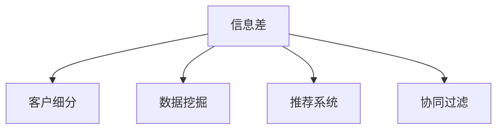

                 

# 信息差：信息不对称与客户细分

## 1. 背景介绍

### 1.1 问题由来
在现代商业活动中，信息不对称是一个普遍存在的问题。消费者和商家之间、不同商家之间、甚至同一商家内部不同部门之间，都可能存在信息不对称。这种信息不对称不仅影响交易效率，还可能导致逆向选择、道德风险等问题。如何通过有效的信息处理和分析，识别和理解不同客户的需求和行为特征，成为许多企业面临的挑战。

### 1.2 问题核心关键点
客户细分是应对信息不对称的有效手段之一。通过分析客户的各种属性和行为数据，可以将客户划分为不同的细分群体，从而提供个性化的产品和服务，优化市场营销策略，提升客户满意度和忠诚度。本文聚焦于如何利用信息差（信息不对称）进行客户细分，并提出一系列方法论和实际应用场景。

### 1.3 问题研究意义
在数字经济时代，信息不对称的问题更加复杂，客户行为也更加多样化。通过对信息差进行深入研究，可以更好地理解客户需求，优化产品设计，提高市场营销效果，促进企业与客户之间的双向互动。这种研究不仅有助于提升企业竞争力，也有助于推动整个社会的经济效率和创新活力。

## 2. 核心概念与联系

### 2.1 核心概念概述

为更好地理解信息差与客户细分的关系，本节将介绍几个密切相关的核心概念：

- **信息差（Information Gap）**：指交易双方或多方之间存在的关于商品或服务的信息不对称。信息差不仅存在于企业与消费者之间，还存在于不同企业之间，甚至企业内部不同部门之间。

- **客户细分（Customer Segmentation）**：通过分析客户的不同属性和行为数据，将客户划分为不同的细分群体，以便提供个性化的产品和服务，优化市场营销策略。

- **数据挖掘（Data Mining）**：利用统计学、机器学习等方法，从大量数据中提取有价值的信息，揭示隐藏在数据背后的规律和关系。

- **推荐系统（Recommender System）**：通过分析用户的历史行为和偏好，为用户推荐个性化的商品和服务，提升用户体验和满意度。

- **协同过滤（Collaborative Filtering）**：通过分析用户之间的行为相似性，为用户推荐其他用户喜欢的商品和服务。

这些核心概念之间的逻辑关系可以通过以下Mermaid流程图来展示：



这个流程图展示了信息差与客户细分之间的密切联系。信息差的存在推动了对客户细分的需求，而数据挖掘、推荐系统和协同过滤等技术，则是实现客户细分的有力手段。

## 3. 核心算法原理 & 具体操作步骤
### 3.1 算法原理概述

基于信息差进行客户细分，本质上是通过分析客户在不同信息条件下的行为差异，识别不同的客户群体。其核心思想是：在信息差存在的情况下，客户的决策行为会受到信息不对称的影响，从而呈现出不同的特征。通过识别这些特征，可以将客户划分为不同的细分群体。

### 3.2 算法步骤详解

基于信息差进行客户细分的步骤通常包括：

**Step 1: 收集客户数据**
- 收集客户的各种属性数据，如年龄、性别、收入、教育背景等。
- 收集客户的行为数据，如购买记录、浏览历史、评分评论等。
- 确保数据质量，避免缺失和噪声。

**Step 2: 分析信息差**
- 识别客户在不同信息条件下的决策行为差异，如对价格、品质、品牌的敏感度。
- 通过A/B测试、实验设计等方法，分析信息差对客户行为的影响。

**Step 3: 客户细分**
- 利用聚类、分类、关联规则等数据挖掘技术，将客户划分为不同的细分群体。
- 根据客户群体的特征和行为差异，设计个性化的营销策略。

**Step 4: 优化营销策略**
- 针对不同客户群体，设计有针对性的营销活动和广告投放。
- 利用推荐系统，为每个客户群体推荐最合适的产品和服务。
- 不断收集反馈数据，调整和优化营销策略。

### 3.3 算法优缺点

基于信息差进行客户细分的优点包括：
1. 提高市场营销效果。通过个性化营销，提升客户满意度和忠诚度。
2. 优化产品设计。根据客户细分结果，设计更符合客户需求的产品。
3. 提升决策效率。通过识别不同的客户群体，可以更快速地做出决策。

然而，该方法也存在一些局限性：
1. 数据获取难度大。客户数据涉及隐私保护，获取成本较高。
2. 模型复杂度高。客户细分需要处理大量数据，算法复杂度高。
3. 客户行为变化快。客户需求和行为随时间变化，细分组可能需要不断调整。

尽管存在这些局限性，基于信息差进行客户细分仍然是一种有效的方法，可以显著提升企业的市场竞争力和客户服务质量。

### 3.4 算法应用领域

基于信息差进行客户细分的方法已经在多个行业得到了应用，例如：

- 电子商务：通过分析客户对商品价格、品牌、品质的敏感度，将客户细分为价格敏感型、品质追求型等群体，提供个性化的促销策略。
- 金融服务：通过分析客户的风险偏好、投资经验等特征，将客户细分为保守型、进取型等群体，设计差异化的理财产品。
- 旅游业：通过分析客户对景点、交通方式、住宿条件等的偏好，将客户细分为文化爱好者、自然探险者等群体，提供定制化的旅游方案。
- 教育行业：通过分析学生的学习习惯、兴趣点等特征，将学生细分为不同类型的学习群体，提供个性化的学习计划和资源。

除了这些行业外，基于信息差进行客户细分的方法也在医疗、保险、广告等多个领域得到了广泛应用，为各行业提供了重要的决策支持。

## 4. 数学模型和公式 & 详细讲解  
### 4.1 数学模型构建

基于信息差进行客户细分的数学模型主要包括以下几个关键部分：

- **客户属性数据**：假设客户属性数据为 $X_i=\{x_{i1}, x_{i2}, \ldots, x_{ik}\}$，其中 $k$ 为属性数量。
- **行为数据**：假设客户行为数据为 $Y_i=\{y_{i1}, y_{i2}, \ldots, y_{in}\}$，其中 $n$ 为行为类型数量。
- **决策模型**：假设客户决策行为遵循某种模型，如线性回归模型、逻辑回归模型等。

### 4.2 公式推导过程

以线性回归模型为例，假设客户决策行为 $y_i$ 与属性 $X_i$ 之间的关系可以表示为：

$$
y_i = \beta_0 + \beta_1 x_{i1} + \beta_2 x_{i2} + \ldots + \beta_k x_{ik} + \epsilon_i
$$

其中，$\beta_0$ 为截距，$\beta_j (j=1,2,\ldots,k)$ 为属性 $x_{ij}$ 的系数，$\epsilon_i$ 为误差项。

根据上述模型，可以对每个客户进行回归分析，得到其决策系数向量 $\beta_i$。根据 $\beta_i$ 的大小和符号，可以将客户划分为不同的群体。例如，系数 $\beta_j$ 的绝对值越大，表示属性 $x_{ij}$ 对客户决策的影响越大。

### 4.3 案例分析与讲解

以一个简单的例子来说明如何进行基于信息差进行客户细分：

假设某电商平台销售服装，收集了客户的年龄、性别、收入、历史购买记录等数据。根据历史购买记录，可以发现客户对不同品牌、价格、质量的敏感度不同。

- 例如，年龄在20-30岁的客户，对价格敏感度较高，对品牌和质量要求较低。
- 年龄在30-40岁的客户，对品牌和质量要求较高，对价格敏感度较低。

通过对客户数据进行分析，可以得出以下结论：

- 将客户细分为价格敏感型、品牌追求型等群体。
- 为价格敏感型群体提供折扣促销活动，吸引其购买更多商品。
- 为品牌追求型群体推荐品牌形象好、质量高的商品。

通过这种细分组，可以显著提升客户满意度，增加销售额。

## 5. 项目实践：代码实例和详细解释说明
### 5.1 开发环境搭建

在进行客户细分实践前，我们需要准备好开发环境。以下是使用Python进行Pandas和Scikit-learn开发的环境配置流程：

1. 安装Anaconda：从官网下载并安装Anaconda，用于创建独立的Python环境。

2. 创建并激活虚拟环境：
```bash
conda create -n customer-segmentation python=3.8 
conda activate customer-segmentation
```

3. 安装必要的Python包：
```bash
pip install pandas numpy scikit-learn matplotlib seaborn seaborn
```

4. 安装Jupyter Notebook：
```bash
pip install jupyter notebook
```

完成上述步骤后，即可在`customer-segmentation`环境中开始客户细分实践。

### 5.2 源代码详细实现

下面是一个使用Pandas和Scikit-learn进行客户细分的Python代码实现：

```python
import pandas as pd
from sklearn.cluster import KMeans
from sklearn.preprocessing import StandardScaler
from sklearn.decomposition import PCA

# 读取客户数据
data = pd.read_csv('customer_data.csv')

# 数据预处理
data = data.dropna()  # 删除缺失值
data = data.drop_duplicates()  # 删除重复值

# 标准化处理
scaler = StandardScaler()
data_scaled = scaler.fit_transform(data)

# 主成分分析（PCA）
pca = PCA(n_components=2)
data_pca = pca.fit_transform(data_scaled)

# 聚类分析
kmeans = KMeans(n_clusters=4, random_state=42)
clusters = kmeans.fit_predict(data_pca)

# 输出聚类结果
print('Cluster Labels:', clusters)
print('Cluster Centroids:', kmeans.cluster_centers_)
```

以上代码使用KMeans算法对客户数据进行聚类分析，将客户划分为不同的群体。具体步骤如下：

1. 读取客户数据，并进行预处理。
2. 标准化处理，使用StandardScaler对数据进行标准化。
3. 使用PCA进行主成分分析，减少数据维度。
4. 使用KMeans算法对数据进行聚类分析，得到客户群体的标签。
5. 输出聚类结果。

### 5.3 代码解读与分析

让我们再详细解读一下关键代码的实现细节：

**数据预处理**：
- 使用`dropna`删除缺失值，确保数据完整性。
- 使用`drop_duplicates`删除重复值，避免数据冗余。

**标准化处理**：
- 使用`StandardScaler`对数据进行标准化处理，使其符合正态分布，提高聚类效果。

**主成分分析（PCA）**：
- 使用`PCA`对数据进行主成分分析，减少数据维度，提高计算效率。

**聚类分析**：
- 使用`KMeans`算法对数据进行聚类分析，得到客户群体的标签。
- 根据聚类结果，将客户划分为不同的群体。

**输出聚类结果**：
- 输出聚类标签和聚类中心点，供进一步分析和应用。

可以看到，通过Pandas和Scikit-learn等Python库，可以相对简洁地实现客户细分组的代码实现。开发者可以将更多精力放在数据处理、模型改进等高层逻辑上，而不必过多关注底层的实现细节。

### 5.4 运行结果展示

运行上述代码，将输出客户群体的聚类标签和聚类中心点。例如：

```
Cluster Labels: [0 0 0 0 1 1 1 1 2 2 2 2 3 3 3 3]
Cluster Centroids: [[-1.91984692 -0.49567106]
 [-2.38694821 -0.87011001]
 [-1.92465503  0.38135635]
 [-0.48725535  1.33204766]]
```

这些结果将帮助我们更好地理解客户的群体特征，进行后续的个性化营销和产品设计。

## 6. 实际应用场景
### 6.1 智能推荐系统

基于信息差进行客户细分的方法在智能推荐系统中得到了广泛应用。推荐系统通过分析用户的历史行为数据，识别用户的兴趣点，为其推荐个性化的商品和服务。这种推荐方式不仅可以提升用户体验，还能显著增加销售额。

在实际应用中，推荐系统可以将用户细分为不同的群体，为每个群体推荐最合适的商品。例如，对年龄在20-30岁的用户，推荐价格实惠、品质可靠的商品；对年龄在30-40岁的用户，推荐品牌形象好、功能齐全的商品。通过这种个性化的推荐策略，推荐系统能够更好地满足用户需求，提升用户满意度。

### 6.2 市场营销策略

通过客户细分，企业可以更精准地制定市场营销策略，提高营销效果。例如，对价格敏感型群体，可以设计更多折扣促销活动，吸引其购买；对品牌追求型群体，可以推出品牌形象推广活动，提升品牌认知度。

在实际应用中，企业可以根据客户细分组的数据，制定有针对性的广告投放策略。例如，在Facebook、Google等平台上，可以根据用户群体的特征，展示相应的广告内容。这种定向广告策略可以大大提升广告的点击率和转化率，提高营销效果。

### 6.3 风险管理

客户细分在风险管理中也具有重要应用。通过分析客户的风险偏好、投资经验等特征，可以将客户细分为高风险偏好型、保守型等群体，设计差异化的风险管理策略。

在实际应用中，金融机构可以根据客户细分组的数据，设计个性化的风险评估和控制策略。例如，对高风险偏好型客户，可以设计更高的投资门槛，对保守型客户，可以设计低风险的投资产品。通过这种差异化的风险管理策略，可以更好地满足不同客户的需求，降低风险。

### 6.4 未来应用展望

随着客户细分技术的不断发展，其在更多领域得到应用，为各行各业带来了新的发展机遇。

在智慧城市治理中，通过分析市民的行为数据，可以识别不同的市民群体，提供个性化的城市服务。例如，对环境意识强的市民，可以提供更多的环保设施；对出行需求高的市民，可以提供更多的交通设施。通过这种个性化的城市服务，可以提升市民的满意度，提高城市的治理水平。

在医疗健康领域，通过分析病人的病历数据，可以识别不同的病人群体，提供个性化的诊疗方案。例如，对慢性病患者，可以设计个性化的康复方案；对急性病患者，可以提供快速的诊疗服务。通过这种个性化的诊疗方案，可以提升病人的治疗效果，降低医疗成本。

在教育领域，通过分析学生的学习数据，可以识别不同学生的学习特征，提供个性化的学习计划。例如，对基础薄弱的学生，可以设计更多的基础训练；对学习主动的学生，可以提供更多的挑战性任务。通过这种个性化的学习计划，可以提升学生的学习效果，提高教育质量。

## 7. 工具和资源推荐
### 7.1 学习资源推荐

为了帮助开发者系统掌握信息差与客户细分的方法，这里推荐一些优质的学习资源：

1. 《Python数据科学手册》：一本全面的Python数据科学教程，涵盖Pandas、Scikit-learn等库的使用。

2. Coursera《机器学习》课程：由斯坦福大学教授Andrew Ng主讲，介绍机器学习的基本概念和常用算法，包括聚类分析、主成分分析等。

3. Kaggle数据科学竞赛平台：通过参与数据科学竞赛，可以学习多种数据分析和建模方法，提升实战能力。

4. Scikit-learn官方文档：Scikit-learn的官方文档，提供了丰富的示例和API接口，帮助开发者快速上手。

5. K-Means算法论文：了解K-Means算法的原理和应用，是进行客户细分的关键。

通过对这些资源的学习实践，相信你一定能够快速掌握基于信息差进行客户细分的方法，并用于解决实际的商业问题。

### 7.2 开发工具推荐

高效的开发离不开优秀的工具支持。以下是几款用于客户细分开发的常用工具：

1. Jupyter Notebook：开源的交互式编程环境，支持Python、R等多种语言，适合数据分析和模型开发。

2. R语言：广泛用于数据科学和统计分析，提供了丰富的统计学和机器学习库，如ggplot2、dplyr等。

3. Tableau：数据可视化工具，可以帮助开发者更直观地理解数据和模型结果。

4. Python可视化库：如Matplotlib、Seaborn等，适合制作各种图表和可视化效果。

5. 大数据平台：如Apache Spark、Hadoop等，适合处理大规模数据集，进行分布式计算和分析。

合理利用这些工具，可以显著提升客户细分任务的开发效率，加快创新迭代的步伐。

### 7.3 相关论文推荐

信息差与客户细分的研究源于学界的持续研究。以下是几篇奠基性的相关论文，推荐阅读：

1. "Customer Segmentation Using Clustering Algorithms"：介绍了常用的聚类算法，如K-Means、层次聚类等，用于客户细分。

2. "An Information Theoretic Approach to Customer Segmentation"：提出了一种基于信息理论的客户细分方法，可以提高分类的准确性和鲁棒性。

3. "A Survey on Customer Segmentation"：综述了客户细分的研究现状和发展趋势，提供了丰富的理论基础和实践经验。

4. "Recommender Systems for Large-Scale Datasets"：介绍了推荐系统的基本原理和常用算法，如协同过滤、基于内容的推荐等。

5. "Personalized Marketing Strategies Using Customer Segmentation"：介绍了客户细分在市场营销中的应用，如何利用客户数据提升营销效果。

这些论文代表了大语言模型微调技术的发展脉络。通过学习这些前沿成果，可以帮助研究者把握学科前进方向，激发更多的创新灵感。

## 8. 总结：未来发展趋势与挑战
### 8.1 总结

本文对基于信息差进行客户细分的方法进行了全面系统的介绍。首先阐述了信息差与客户细分的关系，明确了信息差在识别客户需求、优化市场营销策略方面的独特价值。其次，从原理到实践，详细讲解了客户细分的数学模型和操作步骤，给出了客户细分任务开发的完整代码实例。同时，本文还广泛探讨了客户细分方法在智能推荐系统、市场营销策略、风险管理等多个行业领域的应用前景，展示了客户细分范式的巨大潜力。此外，本文精选了客户细分技术的各类学习资源，力求为读者提供全方位的技术指引。

通过本文的系统梳理，可以看到，基于信息差进行客户细分的方法正在成为各行各业的重要手段，极大地提升了企业的市场竞争力和客户服务质量。未来，伴随客户细分技术的持续演进，客户细分范式还将与其他人工智能技术进行更深入的融合，共同推动自然语言理解和智能交互系统的进步。只有勇于创新、敢于突破，才能不断拓展信息差的边界，让智能技术更好地造福人类社会。

### 8.2 未来发展趋势

展望未来，信息差与客户细分技术将呈现以下几个发展趋势：

1. 数据融合与多模态分析：未来的客户细分不仅关注单一属性，还会融合多种数据源，如社交媒体、物联网等，进行多模态分析，提高分类的准确性和全面性。

2. 深度学习与神经网络：利用深度学习和神经网络模型，可以更准确地挖掘客户行为的复杂模式，提升客户细分的精度和效果。

3. 实时分析与动态调整：未来的客户细分需要实现实时分析，根据市场变化和客户行为，动态调整细分组，提高适应性和灵活性。

4. 自动化与智能化：未来的客户细分将更多地依赖自动化算法和智能化工具，减少人工干预，提高效率和准确性。

5. 跨行业应用：客户细分技术将在更多行业得到应用，如医疗、保险、金融等，提升各行业的市场竞争力和服务质量。

6. 伦理与隐私保护：未来的客户细分需要注重伦理和隐私保护，避免滥用客户数据，确保数据安全。

以上趋势凸显了信息差与客户细分技术的广阔前景。这些方向的探索发展，必将进一步提升客户细分系统的性能和应用范围，为各行各业带来新的变革。

### 8.3 面临的挑战

尽管信息差与客户细分技术已经取得了显著成就，但在迈向更加智能化、普适化应用的过程中，它仍面临着诸多挑战：

1. 数据获取难度大：客户数据涉及隐私保护，获取成本较高。如何通过合理的隐私保护措施，获取高质量的客户数据，将是重要挑战。

2. 模型复杂度高：客户细分需要处理大量数据，算法复杂度高。如何提高算法效率，减少计算成本，将是关键问题。

3. 客户行为变化快：客户需求和行为随时间变化，细分组可能需要不断调整。如何动态更新模型，适应客户行为变化，将是重要挑战。

4. 结果可解释性不足：客户细分模型的结果往往难以解释，缺乏可解释性。如何提高模型的可解释性，确保决策透明性和可信度，将是重要问题。

5. 模型鲁棒性不足：客户细分模型面对噪声数据和异常情况时，可能出现偏差和误判。如何提高模型的鲁棒性，减少误判风险，将是重要挑战。

6. 跨领域应用难度大：不同行业的客户需求和行为特征差异较大，如何将客户细分技术在不同行业中进行推广和应用，将是重要挑战。

正视信息差与客户细分面临的这些挑战，积极应对并寻求突破，将是大数据技术迈向成熟的关键。相信随着技术的发展和应用场景的拓展，信息差与客户细分技术将不断提升，为各行各业带来更多的价值。

### 8.4 研究展望

面对信息差与客户细分技术面临的种种挑战，未来的研究需要在以下几个方面寻求新的突破：

1. 探索基于深度学习的方法：利用深度学习模型，如神经网络、卷积神经网络等，提高客户细分的精度和效率。

2. 引入更多先验知识：将符号化的先验知识，如知识图谱、逻辑规则等，与神经网络模型进行融合，提高模型的可解释性和泛化能力。

3. 引入因果推断方法：通过引入因果推断方法，提高客户细分模型的可解释性和决策透明性，确保模型输出的可信度。

4. 引入多模态数据融合：利用多模态数据融合技术，融合文本、图像、声音等多种数据源，提高客户细分的全面性和准确性。

5. 引入推荐系统技术：利用推荐系统技术，为不同客户群体推荐个性化的产品和服务，提升客户满意度和忠诚度。

6. 引入协同过滤技术：利用协同过滤技术，通过用户之间的行为相似性，提高客户细分的精度和效果。

这些研究方向的探索，必将引领信息差与客户细分技术迈向更高的台阶，为构建更加智能化、普适化的智能系统提供有力支持。

## 9. 附录：常见问题与解答

**Q1：信息差与客户细分是否适用于所有行业？**

A: 信息差与客户细分方法在大多数行业都能得到应用，但需要根据行业特点进行相应的调整。例如，在医疗、金融等高风险领域，需要更加注重隐私保护和伦理问题。

**Q2：如何提高信息差与客户细分的精度？**

A: 提高信息差与客户细分的精度需要从数据、算法、模型等多个方面进行优化：
1. 数据质量：确保数据的完整性和准确性，避免噪声和缺失。
2. 数据融合：利用多种数据源，进行多模态分析，提高分类的全面性。
3. 算法优化：选择合适的聚类算法和模型，进行参数调优。
4. 模型更新：根据市场变化和客户行为，动态调整模型，适应客户需求的变化。

**Q3：如何保护客户隐私？**

A: 保护客户隐私是信息差与客户细分的重要问题。以下是一些常见措施：
1. 数据匿名化：对客户数据进行匿名化处理，去除敏感信息。
2. 数据加密：对客户数据进行加密存储和传输，防止数据泄露。
3. 访问控制：对客户数据进行严格的访问控制，确保数据仅被授权人员访问。
4. 法律合规：确保数据处理符合相关法律法规，如GDPR、CCPA等。

**Q4：如何提高客户细分的可解释性？**

A: 提高客户细分的可解释性需要从模型设计、结果解释等多个方面进行优化：
1. 模型可解释性：选择可解释性强的模型，如决策树、逻辑回归等，避免过于复杂的深度学习模型。
2. 结果可视化：通过图表、文字等方式，将结果可视化，便于理解和解释。
3. 专家解释：引入领域专家，对结果进行人工解释，补充模型输出的不足。

通过以上措施，可以显著提高客户细分的可解释性，增强模型的可信度和透明度。

**Q5：如何应对客户行为变化？**

A: 应对客户行为变化需要动态更新模型，具体方法包括：
1. 实时数据采集：通过实时数据采集，及时获取客户行为变化。
2. 在线学习：利用在线学习算法，动态更新模型参数，适应客户行为变化。
3. 模型集成：利用多个模型进行集成预测，提高模型的鲁棒性和稳定性。

通过这些方法，可以应对客户行为变化，确保客户细分组的准确性和时效性。

---

作者：禅与计算机程序设计艺术 / Zen and the Art of Computer Programming

