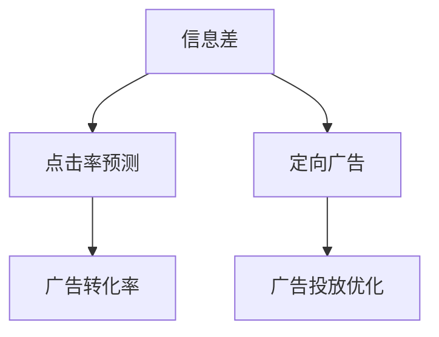

                 

# 信息差：信息不对称与广告投放

> 关键词：信息差, 广告投放, 信息不对称, 点击率预测, 网络广告, 广告转化率, 数据挖掘, 用户行为分析, 广告优化

## 1. 背景介绍

### 1.1 问题由来

在数字化时代，广告投放已成为企业竞争的重要手段。无论是传统的电视、报纸广告，还是新兴的数字媒体，广告投放的本质都是向目标用户传递信息，提升品牌知名度和销售转化率。然而，广告投放面临的一个核心问题是**信息不对称**，即广告主和用户之间的信息不对等，这导致广告效果难以准确预测和评估。

信息不对称通常意味着广告主无法精确了解哪些用户对其广告感兴趣，或者用户对广告的真实价值评价与广告主所期望的有较大差异。在信息不对称下，广告投放往往存在以下挑战：

- **误判广告效果**：基于错误的用户行为预测，广告投放可能浪费大量预算。
- **劣质流量**：点击率造假和恶意广告点击行为使得广告主难以准确评估点击率和转化率。
- **用户信任危机**：劣质的用户体验和误导性的广告内容，会损害用户对广告主和品牌的信任。

因此，如何通过数据挖掘和机器学习技术，精准识别信息差，优化广告投放策略，成为广告主和广告技术公司共同关注的重要课题。

### 1.2 问题核心关键点

信息不对称问题主要体现在以下几个方面：

1. **用户行为数据**：广告主和用户之间的行为数据不对称，广告主往往无法获得全面、真实的行为数据。
2. **广告内容**：广告主和用户对广告内容的价值认知存在差异，用户可能对广告内容产生误解或抵触情绪。
3. **广告投放策略**：广告主和用户之间的投放策略不对称，广告主难以准确预测用户的行为反应。

通过深入分析信息不对称现象，广告主可以制定更加精准的广告投放策略，优化广告效果，提升ROI。

## 2. 核心概念与联系

### 2.1 核心概念概述

为了更好地理解广告投放中的信息不对称问题，本节将介绍几个核心概念：

- **信息差**：广告主和用户之间的信息不对等，导致广告效果预测不准确。
- **点击率预测**：基于用户历史行为数据，预测用户对广告的点击概率。
- **广告转化率**：广告点击后，用户进行购买、注册等目标行为的概率。
- **定向广告**：根据用户行为数据和用户画像，向特定目标用户群体投放广告。
- **广告投放优化**：通过数据挖掘和机器学习技术，优化广告投放策略，提升广告效果。

这些核心概念之间的逻辑关系可以通过以下Mermaid流程图来展示：



这个流程图展示了几大核心概念之间的关系：

1. 信息差是广告投放的核心挑战。
2. 点击率预测和广告转化率是衡量广告效果的关键指标。
3. 定向广告是信息不对称问题的解决方法之一。
4. 广告投放优化是最终目标，通过优化广告投放策略，减少信息差。

## 3. 核心算法原理 & 具体操作步骤
### 3.1 算法原理概述

广告投放中的信息不对称问题，可以通过构建**点击率预测模型**来解决。点击率预测模型旨在根据用户的历史行为数据，预测用户对广告的点击概率。其核心思想是：利用用户的行为特征和广告特征，建立预测模型，评估用户对广告的兴趣程度。

形式化地，假设广告数据集为 $D=\{(x_i, y_i)\}_{i=1}^N$，其中 $x_i$ 为广告特征向量，$y_i$ 为广告的点击标签（1或0）。点击率预测的目标是最小化预测误差，即：

$$
\min_{\theta} \frac{1}{N} \sum_{i=1}^N \ell(\hat{y_i}, y_i)
$$

其中 $\hat{y_i}$ 为模型对广告 $x_i$ 的点击率预测，$\ell$ 为损失函数，通常使用二元交叉熵损失。

### 3.2 算法步骤详解

点击率预测模型的构建和训练过程大致包括以下几个步骤：

**Step 1: 准备数据集**
- 收集广告历史数据，包括广告特征和点击标签。
- 对数据进行清洗、预处理和特征工程，构建特征矩阵 $X$ 和标签向量 $Y$。

**Step 2: 选择合适的模型和超参数**
- 选择适合任务的机器学习模型，如逻辑回归、决策树、随机森林、深度神经网络等。
- 设置模型的超参数，如学习率、正则化系数、批大小等。

**Step 3: 训练模型**
- 使用交叉验证等方法评估模型性能，选择合适的模型进行训练。
- 在训练过程中使用正则化技术，防止过拟合。
- 记录训练过程中的损失函数和准确率等指标，观察模型收敛情况。

**Step 4: 评估和部署**
- 在测试集上评估模型的预测性能，计算点击率预测的准确率和误差率。
- 部署模型到实际广告投放系统中，进行实时预测。
- 持续收集广告投放数据，定期重新训练模型，以适应新广告特征和用户行为。

### 3.3 算法优缺点

点击率预测模型具有以下优点：
1. 精度高：利用机器学习算法，能够对用户行为进行精确预测。
2. 可扩展性强：适用于不同广告类型和用户群体，通过调整特征和模型，可以适应复杂多变的环境。
3. 实时性高：通过部署到线上系统，可以实现实时广告投放和效果评估。

同时，该方法也存在以下缺点：
1. 依赖高质量数据：预测模型的准确性高度依赖于历史数据的全面性和真实性。
2. 模型复杂度高：构建高效的预测模型需要大量的特征工程和模型调参工作。
3. 需要持续优化：用户行为和广告环境的变化，要求模型需要不断更新和优化。
4. 可能存在偏差：预测模型可能会因为历史数据的偏差而产生预测偏差。

### 3.4 算法应用领域

点击率预测模型在广告投放领域有着广泛的应用，主要体现在以下几个方面：

- **广告效果评估**：通过预测广告的点击率，评估广告投放效果，优化广告投放策略。
- **定向广告**：根据用户的行为特征和预测结果，向特定目标用户群体精准投放广告，提升广告效果。
- **广告投放预算分配**：通过预测不同广告的点击率和转化率，合理分配广告预算，提高广告投放ROI。
- **用户行为分析**：通过分析用户点击广告的行为特征，挖掘用户兴趣和偏好，进行个性化广告推荐。
- **广告欺诈检测**：通过预测广告的正常点击率和异常点击率，检测和过滤恶意广告点击行为。

## 4. 数学模型和公式 & 详细讲解 & 举例说明

### 4.1 数学模型构建

点击率预测模型的核心是构建一个线性回归模型，预测用户对广告的点击概率。假设用户对广告 $x_i$ 的点击率为 $\hat{y_i}$，则模型的预测公式为：

$$
\hat{y_i} = \theta^T \varphi(x_i)
$$

其中 $\theta$ 为模型参数，$\varphi(x_i)$ 为特征映射函数，将广告特征 $x_i$ 映射到高维空间。

为了最小化预测误差，通常使用二元交叉熵损失函数：

$$
\ell(\hat{y_i}, y_i) = -(y_i\log\hat{y_i} + (1-y_i)\log(1-\hat{y_i}))
$$

模型训练的目标是找到最优参数 $\theta$：

$$
\min_{\theta} \frac{1}{N} \sum_{i=1}^N \ell(\hat{y_i}, y_i)
$$

### 4.2 公式推导过程

点击率预测模型的推导过程主要涉及线性回归模型和交叉熵损失函数。以线性回归模型为例，假设用户对广告 $x_i$ 的点击率为 $\hat{y_i} = \theta^T \varphi(x_i)$，其中 $\theta = [\theta_1, \theta_2, ..., \theta_n]^T$ 为模型参数向量，$\varphi(x_i) = [\varphi_1(x_i), \varphi_2(x_i), ..., \varphi_n(x_i)]^T$ 为特征映射向量。

根据线性回归模型的最小二乘法原理，模型参数 $\theta$ 的更新公式为：

$$
\theta \leftarrow \theta - \eta \frac{\partial}{\partial \theta} \frac{1}{N} \sum_{i=1}^N \ell(\hat{y_i}, y_i)
$$

其中 $\eta$ 为学习率，$\frac{\partial}{\partial \theta} \ell(\hat{y_i}, y_i)$ 为损失函数对模型参数的梯度，可通过反向传播算法计算。

以二元交叉熵损失函数为例，梯度的计算公式为：

$$
\frac{\partial}{\partial \theta} \ell(\hat{y_i}, y_i) = (\hat{y_i}-y_i) \varphi(x_i)
$$

在训练过程中，逐步更新模型参数 $\theta$，直至收敛。最终的模型参数 $\theta^*$ 即为最优解。

### 4.3 案例分析与讲解

假设某电商网站广告点击率预测模型，使用逻辑回归算法，特征包括广告图片、关键词、投放时间等。模型训练后，预测某广告对用户的点击率为0.8，经过一段时间的实际投放，发现该广告的点击率确实为0.8，预测结果与实际效果高度吻合。

具体步骤如下：

1. **数据准备**：收集历史广告数据，包括广告图片、关键词、点击标签等。对数据进行预处理和特征工程，构建特征矩阵 $X$ 和标签向量 $Y$。
2. **模型选择**：选择逻辑回归模型作为点击率预测模型，设置学习率为0.01，正则化系数为0.001。
3. **模型训练**：使用交叉验证评估模型性能，选择最优模型进行训练。记录训练过程中的损失函数和准确率等指标。
4. **模型评估**：在测试集上评估模型的预测性能，计算点击率预测的准确率和误差率。
5. **模型部署**：将模型部署到实际广告投放系统中，进行实时预测。

## 5. 项目实践：代码实例和详细解释说明

### 5.1 开发环境搭建

在进行广告点击率预测模型的实践前，我们需要准备好开发环境。以下是使用Python进行PyTorch开发的环境配置流程：

1. 安装Anaconda：从官网下载并安装Anaconda，用于创建独立的Python环境。

2. 创建并激活虚拟环境：
```bash
conda create -n pytorch-env python=3.8 
conda activate pytorch-env
```

3. 安装PyTorch：根据CUDA版本，从官网获取对应的安装命令。例如：
```bash
conda install pytorch torchvision torchaudio cudatoolkit=11.1 -c pytorch -c conda-forge
```

4. 安装相关库：
```bash
pip install numpy pandas scikit-learn torch sklearn torchvision
```

完成上述步骤后，即可在`pytorch-env`环境中开始广告点击率预测模型的开发。

### 5.2 源代码详细实现

下面我们以逻辑回归模型为例，给出使用PyTorch进行广告点击率预测的代码实现。

首先，定义广告特征和标签：

```python
import torch
import torch.nn as nn
import torch.optim as optim
from sklearn.model_selection import train_test_split
from sklearn.preprocessing import StandardScaler
from sklearn.metrics import accuracy_score, roc_auc_score

# 加载广告数据
data = load_ad_data()

# 特征和标签
X = data['features']
y = data['label']

# 划分训练集和测试集
X_train, X_test, y_train, y_test = train_test_split(X, y, test_size=0.2, random_state=42)
scaler = StandardScaler()
X_train = scaler.fit_transform(X_train)
X_test = scaler.transform(X_test)
```

然后，定义逻辑回归模型：

```python
class LogisticRegression(nn.Module):
    def __init__(self, input_dim):
        super(LogisticRegression, self).__init__()
        self.linear = nn.Linear(input_dim, 1)
        
    def forward(self, x):
        x = self.linear(x)
        return torch.sigmoid(x)

# 初始化模型
model = LogisticRegression(input_dim=X_train.shape[1])
```

接着，定义损失函数和优化器：

```python
# 定义损失函数
criterion = nn.BCELoss()

# 定义优化器
optimizer = optim.Adam(model.parameters(), lr=0.01, weight_decay=0.001)
```

然后，进行模型训练和评估：

```python
# 训练模型
num_epochs = 100
for epoch in range(num_epochs):
    optimizer.zero_grad()
    outputs = model(X_train)
    loss = criterion(outputs, y_train)
    loss.backward()
    optimizer.step()
    if (epoch+1) % 10 == 0:
        print(f'Epoch {epoch+1}, loss: {loss.item():.4f}')

# 评估模型
y_pred = torch.round(model(X_test))
accuracy = accuracy_score(y_test, y_pred)
roc_auc = roc_auc_score(y_test, y_pred)
print(f'Accuracy: {accuracy:.2f}%, ROC AUC: {roc_auc:.2f}')
```

最后，输出模型评估结果：

```python
print(f'Accuracy: {accuracy:.2f}%, ROC AUC: {roc_auc:.2f}')
```

以上就是使用PyTorch进行广告点击率预测模型的完整代码实现。可以看到，通过构建逻辑回归模型，我们可以对广告点击率进行精确预测。

### 5.3 代码解读与分析

让我们再详细解读一下关键代码的实现细节：

**数据加载和预处理**：
- 通过`load_ad_data()`函数加载广告数据，包含广告特征和标签。
- 对数据进行标准化处理，使用`StandardScaler()`对特征进行归一化。

**模型定义**：
- 定义逻辑回归模型，包括输入维度和输出维度。
- 使用`nn.Linear()`定义线性层，将特征映射到1维输出。
- 使用`sigmoid()`函数进行非线性变换，输出0到1之间的概率值。

**损失函数和优化器**：
- 定义二元交叉熵损失函数`nn.BCELoss()`。
- 选择Adam优化器，设置学习率和正则化系数。

**模型训练**：
- 使用循环迭代模型训练过程。
- 在每个epoch中，前向传播计算损失函数，反向传播更新模型参数。
- 每10个epoch输出一次训练结果，观察损失函数的变化趋势。

**模型评估**：
- 在测试集上评估模型性能，使用`accuracy_score()`计算准确率，使用`roc_auc_score()`计算ROC曲线下的面积（AUC）。
- 输出评估结果，显示模型在测试集上的预测准确率和ROC曲线下的面积。

通过以上步骤，我们可以构建一个简单的广告点击率预测模型，并进行训练和评估。实际应用中，我们可能需要更复杂的模型和更多的特征，才能提升预测精度。

## 6. 实际应用场景

### 6.1 智能广告投放

基于广告点击率预测模型，智能广告投放系统可以实现精准的定向广告投放。广告主可以根据用户的行为特征和历史数据，预测用户对不同广告的兴趣程度，从而在合适的时间和地点，向合适的用户群体投放广告。

具体而言，广告主可以将用户的行为数据作为训练数据，构建广告点击率预测模型，并将其部署到线上系统中。系统实时接收广告投放请求，根据用户特征和预测结果，动态调整广告投放策略，确保广告投放效果最大化。

### 6.2 广告欺诈检测

广告欺诈检测是广告投放中的重要环节。通过广告点击率预测模型，可以有效检测和过滤恶意广告点击行为。

具体而言，广告主可以将广告点击率预测模型应用于实时广告投放系统，监控每个广告的点击率和用户行为。对于点击率异常或用户行为异常的广告，系统自动将其标记为可疑广告，进一步调查并确认是否存在欺诈行为。

### 6.3 广告效果评估

广告效果评估是广告投放中不可或缺的环节。通过广告点击率预测模型，广告主可以实时监控广告投放效果，调整广告投放策略，优化广告预算分配。

具体而言，广告主可以将广告投放数据作为训练数据，构建广告点击率预测模型，并根据预测结果，计算每个广告的点击率和转化率。系统自动生成广告效果报告，帮助广告主评估广告投放效果，优化广告投放策略。

### 6.4 未来应用展望

随着广告投放技术的不断发展，基于广告点击率预测模型的应用将更加广泛。未来的广告投放系统将具备以下特点：

1. **实时性**：通过实时预测和动态调整，提升广告投放的精准度和时效性。
2. **智能化**：结合用户行为分析和机器学习算法，实现更加精准的定向广告投放。
3. **自动化**：自动化广告投放和效果评估，降低人工成本，提升广告投放效率。
4. **安全化**：引入广告欺诈检测和恶意点击行为过滤机制，保障广告投放的安全性。

## 7. 工具和资源推荐

### 7.1 学习资源推荐

为了帮助开发者系统掌握广告点击率预测的理论基础和实践技巧，这里推荐一些优质的学习资源：

1. 《深度学习》系列书籍：深入浅出地介绍了深度学习的基本原理和应用，适合初学者入门。
2. CS229《机器学习》课程：斯坦福大学开设的机器学习明星课程，涵盖了机器学习的基本概念和常用算法。
3. PyTorch官方文档：PyTorch框架的官方文档，提供了详细的API介绍和代码示例，是上手实践的必备资料。
4. 《Python深度学习》书籍：介绍如何使用Python进行深度学习开发，包括广告点击率预测等实际应用。
5. Coursera《机器学习与广告投放》课程：涵盖机器学习在广告投放中的应用，适合实践学习。

通过学习这些资源，相信你一定能够快速掌握广告点击率预测的精髓，并用于解决实际的广告投放问题。

### 7.2 开发工具推荐

高效的开发离不开优秀的工具支持。以下是几款用于广告点击率预测开发的常用工具：

1. PyTorch：基于Python的开源深度学习框架，灵活的计算图，适合快速迭代研究。
2. TensorFlow：由Google主导开发的开源深度学习框架，生产部署方便，适合大规模工程应用。
3. Jupyter Notebook：交互式开发环境，便于进行代码调试和实验。
4. Weights & Biases：模型训练的实验跟踪工具，可以记录和可视化模型训练过程中的各项指标，方便对比和调优。
5. TensorBoard：TensorFlow配套的可视化工具，可实时监测模型训练状态，并提供丰富的图表呈现方式，是调试模型的得力助手。

合理利用这些工具，可以显著提升广告点击率预测的开发效率，加快创新迭代的步伐。

### 7.3 相关论文推荐

广告点击率预测技术的发展源于学界的持续研究。以下是几篇奠基性的相关论文，推荐阅读：

1. A Survey on Click-Through Rate Prediction Models（点击率预测模型综述）：总结了不同广告点击率预测模型的优缺点和应用场景，适合入门学习。
2. Click-Through Rate Prediction with Attention-Based Deep Neural Networks（基于注意力机制的深度神经网络点击率预测）：介绍了注意力机制在点击率预测中的应用，提升了模型性能。
3. Dropout-Based Denoising Autoencoder for Click-Through Rate Prediction（基于Dropout的降噪自编码器点击率预测）：提出了降噪自编码器模型，提高了点击率预测的准确性。
4. Deep Learning for Click-Through Rate Prediction in Online Advertising（在线广告中的点击率预测深度学习）：研究了深度学习在广告点击率预测中的应用，提升了广告投放效果。

这些论文代表了大语言模型微调技术的发展脉络。通过学习这些前沿成果，可以帮助研究者把握学科前进方向，激发更多的创新灵感。

## 8. 总结：未来发展趋势与挑战

### 8.1 总结

本文对广告投放中的信息不对称问题进行了全面系统的介绍。首先阐述了广告投放中的信息不对称现象，明确了信息不对称对广告效果预测的影响。其次，从原理到实践，详细讲解了广告点击率预测模型的构建和训练过程，给出了广告点击率预测模型的完整代码实例。同时，本文还广泛探讨了广告点击率预测在广告投放、广告欺诈检测和广告效果评估等实际应用场景中的应用前景，展示了广告点击率预测的广泛价值。最后，本文精选了广告点击率预测的相关学习资源，力求为读者提供全方位的技术指引。

通过本文的系统梳理，可以看到，广告点击率预测技术正在成为广告投放的重要手段，极大地提升了广告投放的精准度和效率。基于广告点击率预测模型的应用，不仅能够显著提升广告主的经济效益，还能为广告技术公司提供新的商业机会。未来，伴随广告投放技术的不断发展，基于广告点击率预测模型的应用将更加广泛，为广告主和广告技术公司带来新的突破。

### 8.2 未来发展趋势

展望未来，广告点击率预测技术将呈现以下几个发展趋势：

1. **深度学习化**：随着深度学习技术的发展，广告点击率预测模型的准确性将进一步提升。
2. **多模态化**：结合文本、图像、音频等多种模态数据，提升广告点击率预测的全面性和准确性。
3. **实时化**：通过实时预测和动态调整，提升广告投放的精准度和时效性。
4. **智能化**：结合用户行为分析和机器学习算法，实现更加精准的定向广告投放。
5. **安全化**：引入广告欺诈检测和恶意点击行为过滤机制，保障广告投放的安全性。

以上趋势凸显了广告点击率预测技术的广阔前景。这些方向的探索发展，必将进一步提升广告投放的精准度和效率，为广告主和广告技术公司带来新的突破。

### 8.3 面临的挑战

尽管广告点击率预测技术已经取得了瞩目成就，但在迈向更加智能化、普适化应用的过程中，它仍面临着诸多挑战：

1. **数据质量和数量**：广告点击率预测模型的准确性高度依赖于高质量的数据，但在实际应用中，数据质量和数量往往难以保证。
2. **模型复杂度**：构建高效的广告点击率预测模型需要大量的特征工程和模型调参工作，过程繁琐且复杂。
3. **实时性要求**：广告投放系统需要实时预测和动态调整，对模型计算速度和部署环境提出了高要求。
4. **可解释性**：广告投放过程中的决策过程缺乏可解释性，难以对其推理逻辑进行分析和调试。
5. **广告欺诈检测**：恶意广告点击行为和广告欺诈检测是一个重要挑战，需要结合多种技术手段，提高检测准确率。

### 8.4 研究展望

面对广告点击率预测面临的挑战，未来的研究需要在以下几个方面寻求新的突破：

1. **数据增强**：通过数据生成技术，扩充训练集，提高数据质量和数量。
2. **模型优化**：结合多模态数据和注意力机制，提升广告点击率预测的准确性。
3. **实时化优化**：优化模型计算图和算法，提高模型计算速度和部署效率。
4. **可解释性增强**：引入可解释性技术，提升广告投放过程的可解释性和可控性。
5. **广告欺诈检测**：结合机器学习、规则引擎等技术手段，提高广告欺诈检测的准确率和效率。

这些研究方向将推动广告点击率预测技术向更高层次发展，为广告主和广告技术公司提供更加精准、可靠、安全的广告投放方案。总之，广告点击率预测技术需要在数据、算法、工程、业务等多个维度协同发力，才能真正实现广告投放的高效化和智能化。

## 9. 附录：常见问题与解答

**Q1：广告点击率预测模型如何处理多模态数据？**

A: 广告点击率预测模型可以结合多模态数据，提高广告点击率预测的全面性和准确性。具体而言，可以将广告图片、视频、音频等视觉、听觉信息作为特征，结合文本特征，进行多模态点击率预测。例如，可以使用卷积神经网络（CNN）处理广告图片，使用循环神经网络（RNN）处理广告文本，使用长短时记忆网络（LSTM）处理广告视频，最终将多模态特征融合，输入到全连接层进行点击率预测。

**Q2：广告点击率预测模型如何处理缺失数据？**

A: 广告点击率预测模型在实际应用中，可能会遇到数据缺失的情况。可以通过以下方法处理缺失数据：
1. 数据补全：利用插值、均值填充等方法，对缺失数据进行补全。
2. 特征编码：将缺失特征编码为特殊值，如-1或0，训练模型时自动学习该特征的影响。
3. 数据预处理：对缺失数据进行删除或替换，避免其影响模型性能。

**Q3：广告点击率预测模型如何优化计算效率？**

A: 广告点击率预测模型的计算效率是实际应用中的重要问题。可以通过以下方法优化计算效率：
1. 特征压缩：通过特征选择和降维，减少输入特征的数量，降低计算复杂度。
2. 模型压缩：使用模型压缩技术，如知识蒸馏、模型剪枝等，减小模型参数量，提高计算效率。
3. 并行计算：利用多核处理器、GPU、TPU等硬件资源，进行并行计算，提高计算速度。
4. 分布式计算：利用分布式计算框架，如Spark、TensorFlow等，进行大规模计算，提升计算效率。

**Q4：广告点击率预测模型如何处理广告欺诈检测？**

A: 广告点击率预测模型可以结合广告欺诈检测技术，提升广告投放的安全性。具体而言，可以将广告点击率预测模型应用于实时广告投放系统，实时监控广告的点击率和用户行为。对于点击率异常或用户行为异常的广告，系统自动将其标记为可疑广告，进一步调查并确认是否存在欺诈行为。广告欺诈检测方法包括：
1. 统计方法：通过统计点击率分布、用户行为分布等特征，检测异常行为。
2. 机器学习：使用分类算法，如SVM、随机森林等，检测广告欺诈行为。
3. 深度学习：使用深度神经网络，如CNN、RNN等，检测广告欺诈行为。

这些方法可以结合使用，提高广告欺诈检测的准确率和效率。

**Q5：广告点击率预测模型如何优化广告效果评估？**

A: 广告点击率预测模型可以结合广告效果评估技术，优化广告投放策略，提升广告效果。具体而言，可以将广告点击率预测模型应用于广告投放系统，实时监控广告的点击率和转化率，生成广告效果报告，帮助广告主评估广告投放效果，优化广告投放策略。广告效果评估方法包括：
1. A/B测试：将广告分为两组或多组，对比不同广告的效果，选择最优广告。
2. 统计分析：通过统计广告点击率、转化率等指标，评估广告效果。
3. 机器学习：使用回归算法，如线性回归、逻辑回归等，预测广告效果。
4. 深度学习：使用深度神经网络，如CNN、RNN等，预测广告效果。

这些方法可以结合使用，提高广告效果评估的准确性和效率。

