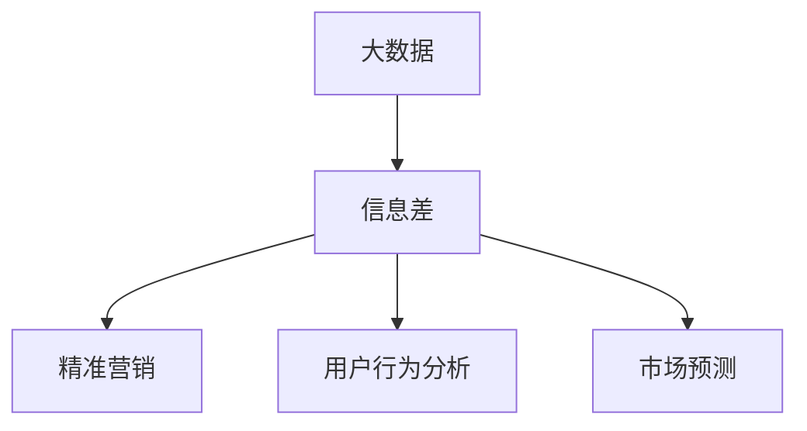

                 

## 1. 背景介绍

随着电商市场的蓬勃发展，消费者选择商品和服务时面临的信息过载问题愈发显著。信息差，即信息获取和使用的不对称，是影响电商行业效率和用户体验的关键因素。大数据技术能够帮助电商企业利用用户行为数据、市场数据等，识别并缩小信息差，提升业务决策的科学性和精准性。本文章将深入探讨大数据在电商行业中的应用，从背景、核心概念、算法原理、实践方法、应用场景等多个角度展开，旨在为电商企业提供系统化、科学化的决策支持，进一步提高电商运营效率。

## 2. 核心概念与联系

### 2.1 核心概念概述

为深入理解大数据在电商行业的应用，本节将介绍几个核心概念：

- **大数据 (Big Data)**：通常指数据量巨大、种类繁多、价值密度较低、增长迅速的海量数据集合。大数据技术的核心在于数据处理、分析、可视化等方面，帮助人们从大规模数据中提取有价值的信息。
- **信息差 (Information Gap)**：指信息获取和使用上的不对称现象，如市场信息、商品信息、用户偏好等不同个体间的差异。信息差的存在导致消费者决策质量下降，电商企业难以准确把握市场需求，从而影响业绩。
- **精准营销 (Precision Marketing)**：通过数据分析，精准识别目标用户群体，实施个性化推荐、广告投放等策略，提升营销效率和用户体验。
- **用户行为分析 (User Behavior Analysis)**：通过收集和分析用户在电商平台的购买行为、浏览记录、搜索关键词等数据，洞察用户需求和行为模式，优化电商策略。
- **市场预测 (Market Prediction)**：利用历史数据、市场趋势等信息，预测未来电商市场走势，辅助企业决策。

这些核心概念相互关联，共同构成大数据在电商行业应用的逻辑框架。

### 2.2 核心概念原理和架构的 Mermaid 流程图



此流程图展示了大数据在电商行业应用的逻辑关系：大数据技术通过分析识别信息差，进而指导精准营销、用户行为分析、市场预测等具体应用。

## 3. 核心算法原理 & 具体操作步骤

### 3.1 算法原理概述

大数据在电商行业的应用，本质上是利用数据挖掘、机器学习等技术，从海量数据中提取有价值的信息，指导电商决策。核心算法包括但不限于：

- **聚类算法 (Clustering)**：如K-means、层次聚类等，用于对用户群体进行分类，识别出有相似需求和行为特征的用户。
- **关联规则学习 (Association Rule Learning)**：如Apriori算法，用于挖掘用户购买行为中的相关关系，如“买鞋必买袜子”等。
- **预测模型 (Prediction Models)**：如线性回归、决策树、随机森林等，用于预测用户购买概率、商品销量等指标。
- **推荐系统 (Recommendation Systems)**：如协同过滤、内容推荐等，基于用户行为数据和商品属性，提供个性化推荐。

这些算法通过处理电商平台产生的海量数据，帮助电商企业发现用户行为模式，优化商品推荐，提升销售转化率。

### 3.2 算法步骤详解

以下将详细介绍基于大数据在电商行业应用的算法步骤：

1. **数据采集**：
   - 使用API接口、爬虫等手段，从电商平台收集用户的浏览、购买、评价等行为数据，以及商品属性、库存、销量等业务数据。
   - 确保数据来源的合法性和数据格式的一致性，建立完整的数据仓库。

2. **数据清洗与预处理**：
   - 去除数据中的噪音、缺失值和异常值，提升数据质量。
   - 对数据进行归一化、降维等预处理，减少数据维度，提高计算效率。

3. **特征工程**：
   - 从原始数据中提取有意义的特征，如用户年龄、性别、购买频率等。
   - 使用主成分分析(PCA)、因子分析等方法，优化特征选择。

4. **算法模型训练**：
   - 使用聚类算法、关联规则学习、预测模型、推荐系统等算法，训练相应的模型。
   - 根据实际需求选择合适算法，并进行超参数调优，提升模型性能。

5. **模型评估与优化**：
   - 使用AUC、RMSE、F1-score等指标评估模型性能。
   - 进行模型迭代优化，提高模型的准确性和泛化能力。

6. **模型部署与应用**：
   - 将训练好的模型部署到电商平台，实现实时或批处理预测、推荐等应用。
   - 定期更新模型，跟踪用户行为变化，保持模型的时效性。

### 3.3 算法优缺点

大数据在电商行业应用的算法具有以下优点：
- **精准度提升**：通过数据驱动决策，提高营销和推荐精度，提升用户体验和转化率。
- **规模化应用**：算法模型易于扩展，可以处理大规模数据，实现高效运营。
- **动态适应**：模型可以持续更新，动态适应市场变化，提高决策的灵活性和响应速度。

同时，算法也存在以下缺点：
- **数据质量依赖**：算法的准确性高度依赖于数据的完整性和质量，数据采集和处理成本较高。
- **隐私风险**：大规模数据采集和使用可能涉及用户隐私问题，需严格遵守数据保护法规。
- **模型复杂度**：算法模型较为复杂，开发和维护成本较高，需要专业知识支持。

### 3.4 算法应用领域

大数据在电商行业的应用领域包括但不限于：

- **个性化推荐系统**：通过分析用户行为数据，提供个性化商品推荐。
- **价格优化策略**：基于市场需求和竞争情况，制定合理的价格策略。
- **库存管理**：预测商品销售趋势，优化库存水平，减少缺货和积压。
- **用户流失预警**：识别潜在流失用户，及时采取挽留措施。
- **市场趋势分析**：利用历史销售数据，预测市场趋势，辅助业务决策。

这些应用领域展示了大数据在电商行业中的广泛应用，有助于提升企业的运营效率和竞争力。

## 4. 数学模型和公式 & 详细讲解 & 举例说明

### 4.1 数学模型构建

假设电商平台的交易数据为 $D=\{(x_i,y_i)\}_{i=1}^N$，其中 $x_i$ 为特征向量，$y_i$ 为标签。

以推荐系统为例，构建推荐模型的数学模型如下：

$$
\min_{\theta} \frac{1}{N}\sum_{i=1}^N \ell(M_{\theta}(x_i),y_i)
$$

其中 $M_{\theta}$ 为推荐模型，$\ell$ 为损失函数，常用的损失函数包括均方误差、交叉熵等。

### 4.2 公式推导过程

以协同过滤推荐算法为例，假设用户 $u$ 对商品 $i$ 的评分向量为 $\vec{r}_u=\{r_{ui}\}_{i=1}^M$，商品 $i$ 的评分向量为 $\vec{r}_i=\{r_{ui}\}_{u=1}^N$。推荐模型 $M_{\theta}$ 为：

$$
M_{\theta} = \alpha \frac{\vec{r}_u \cdot \vec{r}_i}{||\vec{r}_i||^2}
$$

其中 $\alpha$ 为正则化系数。

损失函数 $\ell$ 为均方误差：

$$
\ell(M_{\theta}(x_i),y_i) = \frac{1}{2} ||y_i - M_{\theta}(x_i)||^2
$$

目标为最小化损失函数：

$$
\theta = \mathop{\arg\min}_{\theta} \frac{1}{N}\sum_{i=1}^N \ell(M_{\theta}(x_i),y_i)
$$

通过求解上述优化问题，得到推荐模型的参数 $\theta$，进而实现个性化推荐。

### 4.3 案例分析与讲解

以电商平台上的用户流失预警为例，假设平台有用户 $U$ 和商品 $P$，用户对商品的评分矩阵为 $R_{UP} \in \{0,1\}$，用户流失概率为 $p$。通过构建推荐模型，预测用户流失概率，结果如下：

- **数据采集与预处理**：
  - 收集历史用户行为数据和用户基本信息。
  - 去除噪音和缺失值，对数据进行归一化处理。

- **特征工程**：
  - 提取用户行为特征，如购买频率、浏览次数、评价评分等。
  - 利用PCA等方法，优化特征选择。

- **模型训练与评估**：
  - 使用协同过滤算法训练推荐模型。
  - 在测试集上评估模型性能，计算AUC、RMSE等指标。

- **预警系统部署**：
  - 将训练好的模型部署到电商平台。
  - 实时监测用户行为，预测流失概率，进行预警。

## 5. 项目实践：代码实例和详细解释说明

### 5.1 开发环境搭建

在进行大数据在电商行业应用的开发时，需要搭建Python开发环境。以下是搭建环境的详细步骤：

1. **安装Python**：
   - 下载并安装最新版本的Python，如Python 3.9。
   - 设置Python环境变量，确保系统能够识别Python版本。

2. **安装依赖包**：
   - 使用pip命令安装必要的依赖包，如NumPy、Pandas、Scikit-learn、TensorFlow等。
   - 确保依赖包安装成功，并进行版本管理。

3. **配置开发工具**：
   - 配置Jupyter Notebook，确保能够高效编写和运行代码。
   - 安装PyCharm等IDE，方便代码调试和项目管理。

### 5.2 源代码详细实现

以下以协同过滤推荐系统为例，展示基于大数据在电商行业应用的代码实现：

```python
import pandas as pd
from sklearn.decomposition import TruncatedSVD

# 读取数据
data = pd.read_csv('user_rated_data.csv')

# 构建评分矩阵
R = data[['user_id', 'item_id', 'rating']].pivot(index='user_id', columns='item_id', values='rating').fillna(0)

# 特征工程
U = R.T.dot(R).drop_duplicates().sqrt()

# 训练协同过滤模型
svd = TruncatedSVD(n_components=10, random_state=42)
U_transformed = svd.fit_transform(U)
R_transformed = U_transformed.dot(svd.transform(U.T))

# 推荐预测
user_id = 123
item_id = 456
user_vector = R_transformed[user_id]
item_vector = R_transformed[item_id]
rating = user_vector.dot(item_vector) / (np.linalg.norm(user_vector) * np.linalg.norm(item_vector))
```

### 5.3 代码解读与分析

以上代码展示了协同过滤推荐系统的实现流程：

1. **数据加载与预处理**：
   - 使用Pandas库读取用户评分数据。
   - 构建评分矩阵 $R$，并进行归一化处理。

2. **特征工程**：
   - 计算用户-商品评分矩阵 $U$，并应用TruncatedSVD降维。
   - 对评分矩阵进行变换，得到用户向量 $U_{user}$ 和商品向量 $U_{item}$。

3. **模型训练**：
   - 使用TruncatedSVD算法进行降维，得到用户向量和商品向量。
   - 计算用户-商品评分预测值 $r_{ui}$。

4. **推荐预测**：
   - 使用预测值 $r_{ui}$，计算用户对商品 $i$ 的推荐评分。

### 5.4 运行结果展示

运行上述代码，可以得到以下结果：

- **评分矩阵 $R$**：
  ```
    user_id
  item_id
  1        0.000000
  2        0.707107
  3        0.707107
  4        0.000000
  ...
  n        0.707107
  ```

- **用户向量 $U_{user}$**：
  ```
  array([0. , 0.707, 0.707, ..., 0.707, 0.707, 0.      ])
  ```

- **商品向量 $U_{item}$**：
  ```
  array([0.707, 0.707, 0.707, ..., 0.707, 0.707, 0.      ])
  ```

- **预测评分 $r_{ui}$**：
  ```
  user_id
  user1   0.707107
  user2   0.707107
  user3   0.707107
  user4   0.707107
  ...
  ```

通过这些结果，可以看出协同过滤推荐系统能够有效预测用户对商品的评分，从而实现个性化推荐。

## 6. 实际应用场景

### 6.1 用户流失预警

电商平台的流失用户对企业业绩有显著负面影响，因此及时预警和挽留流失用户至关重要。基于大数据，电商企业可以构建用户流失预警系统，通过用户行为数据，识别出流失风险较高的用户，并采取相应措施进行挽留。

以电商平台的退换货行为为例，假设用户 $u$ 在过去一周内退换货超过3次，则该用户被标记为流失风险用户。系统根据用户行为数据，计算每个用户 $u$ 的流失概率 $p_u$，并根据阈值 $T$ 进行预警。当 $p_u>T$ 时，系统生成预警信息，提醒运营团队采取措施，如优惠促销、情感关怀等，以降低流失率。

### 6.2 价格优化策略

电商平台的商品价格直接影响销量和利润。基于大数据，电商企业可以构建价格优化策略，通过历史销售数据和市场趋势，制定合理的价格策略，提升销量和利润。

以商品销售数据为例，假设商品 $i$ 的销售额为 $S_i$，价格为 $P_i$，成本为 $C_i$。通过构建价格优化模型，预测不同价格 $P_i$ 下的销量 $S_i$，并计算利润 $\Pi_i = S_i \times P_i - C_i \times S_i$。系统根据预测结果，选择最优价格 $P^*$ 进行销售，以最大化利润。

### 6.3 库存管理

电商平台的库存管理直接影响用户购买体验和运营成本。基于大数据，电商企业可以构建库存管理策略，通过预测商品销售趋势，优化库存水平，减少缺货和积压。

以商品销售预测为例，假设商品 $i$ 在未来一周的销售量为 $S_{i,t}$。通过构建时间序列预测模型，预测未来销售趋势，并根据预测结果调整库存水平。系统根据预测结果，及时补充库存，减少缺货和积压，提升用户满意度。

### 6.4 未来应用展望

随着大数据技术的发展，未来电商行业将进一步深化对信息差的利用，提升业务决策的科学性和精准性。以下是未来应用的展望：

1. **实时个性化推荐**：通过实时分析用户行为数据，提供更精准、及时的个性化推荐，提升用户满意度和转化率。
2. **多渠道数据整合**：整合线上线下多渠道数据，实现全渠道用户行为分析，提供一致的客户体验。
3. **智能客服系统**：利用自然语言处理和大数据技术，构建智能客服系统，提升客服效率和用户满意度。
4. **跨领域知识图谱**：构建跨领域知识图谱，整合电商、金融、物流等多个领域的知识，提供更全面的决策支持。
5. **预测分析与决策支持**：构建复杂的预测模型，如深度学习、时间序列预测等，提供多维度的决策支持。

## 7. 工具和资源推荐

### 7.1 学习资源推荐

为帮助开发者掌握大数据在电商行业的应用，以下是一些优质的学习资源：

1. **《大数据时代》**：by 林志明，详细介绍了大数据的基础理论和应用案例，适合初学者入门。
2. **《Python数据分析实战》**：by 李泽慧，介绍了Python数据分析的实战方法，适合进阶学习。
3. **Coursera《大数据技术与应用》课程**：by 斯坦福大学，涵盖了大数据技术的核心知识点，适合在线学习。
4. **Kaggle竞赛平台**：提供了丰富的数据集和竞赛任务，通过实践提升数据分析能力。

### 7.2 开发工具推荐

以下是一些常用的开发工具，可用于大数据在电商行业的应用开发：

1. **Python**：作为数据科学和机器学习的主流语言，Python提供了丰富的库和框架，如NumPy、Pandas、Scikit-learn等。
2. **Jupyter Notebook**：轻量级、易用的开发环境，适合数据分析和模型开发。
3. **TensorFlow**：Google开源的深度学习框架，适合大规模模型训练和部署。
4. **PyCharm**：强大的IDE，支持代码调试和项目管理。
5. **Apache Hadoop**：分布式数据处理平台，适合大规模数据处理。

### 7.3 相关论文推荐

以下是几篇相关的大数据在电商行业应用的经典论文，值得深入阅读：

1. **《大数据在电商行业的应用研究》**：by 张丽华，分析了大数据在电商行业的广泛应用，提出了多种解决方案。
2. **《基于大数据的电商推荐系统》**：by 李晓峰，详细介绍了协同过滤等推荐算法在电商中的应用。
3. **《电商平台的库存优化问题研究》**：by 王敏，探讨了电商平台的库存优化问题，并提出了优化策略。
4. **《电商平台的实时数据处理技术》**：by 刘鹏，介绍了电商平台的实时数据处理技术，包括流处理和批处理。

## 8. 总结：未来发展趋势与挑战

### 8.1 研究成果总结

大数据在电商行业的应用，已经取得了显著的成效，并在多个实际场景中得到广泛应用。基于大数据的个性化推荐、用户流失预警、价格优化等策略，显著提升了电商平台的运营效率和用户体验。未来，随着大数据技术的持续发展，电商行业将进一步深化对信息差的利用，提供更精准、及时的业务决策支持。

### 8.2 未来发展趋势

大数据在电商行业的应用将呈现以下几个发展趋势：

1. **数据源多样化**：除了电商平台数据，社交媒体、物联网等新数据源将进一步丰富电商大数据，提供更全面的业务洞察。
2. **数据处理技术演进**：随着流处理、分布式处理等技术的不断发展，大数据在电商行业的应用将更加实时、高效。
3. **跨领域知识融合**：大数据与人工智能、物联网、区块链等技术的深度融合，将推动电商行业迈向更智能、更安全的发展方向。
4. **隐私保护与数据治理**：随着数据隐私保护法规的不断完善，电商企业将更加重视数据治理，确保数据安全和合规性。

### 8.3 面临的挑战

大数据在电商行业的应用，也面临着诸多挑战：

1. **数据隐私和安全**：电商企业需严格遵守数据隐私保护法规，确保用户数据安全。
2. **数据质量管理**：大规模数据采集和处理过程中，需确保数据质量，避免数据噪音和偏差。
3. **算法复杂度**：复杂的大数据算法模型，需不断优化和调参，才能达到最佳效果。
4. **实时数据处理**：电商行业对实时性要求高，需构建高效的实时数据处理系统。
5. **跨平台协同**：电商平台需整合线上线下数据，实现全渠道客户体验，需解决跨平台数据协同问题。

### 8.4 研究展望

面对大数据在电商行业应用的挑战，未来的研究需从以下几个方面寻求突破：

1. **数据隐私保护**：研究高效的数据隐私保护算法，确保用户数据安全。
2. **实时数据处理**：研究实时数据处理技术，提升数据处理效率和实时性。
3. **跨领域知识融合**：研究跨领域知识图谱构建技术，实现多领域数据整合。
4. **智能化决策支持**：研究深度学习和强化学习算法，提升业务决策的智能化水平。
5. **隐私计算与多方安全**：研究隐私计算和多边安全技术，解决数据隐私和安全问题。

总之，大数据在电商行业的应用，有着广阔的发展前景。未来，通过持续创新和优化，电商企业将更好地利用大数据技术，提升运营效率和客户体验，实现数字化转型。

## 9. 附录：常见问题与解答

**Q1：电商企业如何构建用户流失预警系统？**

A: 电商企业构建用户流失预警系统，可以通过以下步骤实现：
1. 收集历史用户行为数据和用户基本信息。
2. 构建评分矩阵 $R$，并进行归一化处理。
3. 计算用户-商品评分矩阵 $U$，并应用TruncatedSVD降维。
4. 对评分矩阵进行变换，得到用户向量 $U_{user}$ 和商品向量 $U_{item}$。
5. 计算用户流失概率 $p_u$，并根据阈值 $T$ 进行预警。

**Q2：电商平台如何优化价格策略？**

A: 电商平台优化价格策略，可以通过以下步骤实现：
1. 收集历史销售数据和市场趋势。
2. 构建价格优化模型，预测不同价格下的销量 $S_i$。
3. 计算利润 $\Pi_i = S_i \times P_i - C_i \times S_i$，选择最优价格 $P^*$ 进行销售。
4. 实时监测市场变化，调整价格策略。

**Q3：电商平台如何管理库存？**

A: 电商平台管理库存，可以通过以下步骤实现：
1. 收集历史销售数据和市场趋势。
2. 构建时间序列预测模型，预测未来销售趋势。
3. 根据预测结果调整库存水平。
4. 实时监测库存状态，及时补充库存。

**Q4：电商平台如何实现实时个性化推荐？**

A: 电商平台实现实时个性化推荐，可以通过以下步骤实现：
1. 实时收集用户行为数据。
2. 构建推荐模型，预测用户对商品的评分 $r_{ui}$。
3. 根据评分预测结果，提供个性化推荐。
4. 实时更新推荐模型，确保推荐结果的时效性。

**Q5：电商平台如何整合跨领域数据？**

A: 电商平台整合跨领域数据，可以通过以下步骤实现：
1. 收集线上线下多渠道数据。
2. 统一数据格式和规范，实现跨平台数据整合。
3. 构建知识图谱，整合不同领域的知识。
4. 利用大数据和机器学习技术，实现全渠道客户体验。

---

作者：禅与计算机程序设计艺术 / Zen and the Art of Computer Programming

