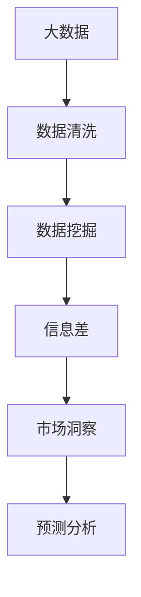

                 

## 1. 背景介绍

### 1.1 问题由来

在信息爆炸的时代，海量数据成为了企业获取竞争优势的利器。然而，数据本身并不能直接转换为业务价值，只有通过深入的数据分析和挖掘，才能揭示出潜在的市场趋势和机遇。数据驱动的决策，离不开科学有效的市场分析方法。然而，传统的市场分析方法往往依赖于专家经验和手工处理，无法快速适应快速变化的市场环境。

大数据技术的崛起，为市场分析带来了新的契机。通过高效的数据存储和处理，可以从海量的数据中提取出有价值的信息，形成决策支持的依据。但是，信息的多样性和复杂性，也给市场分析带来了新的挑战。如何在大数据环境中，准确识别和理解信息差，形成深入的市场洞察，是当前市场分析的难点。

### 1.2 问题核心关键点

市场分析的核心在于发现市场中的“信息差”，即不同市场主体之间对市场信息的不对称。传统市场分析方法依赖于手工挖掘和专家经验，耗时费力且效率低下。而大数据分析可以借助先进的技术手段，自动高效地挖掘和分析数据，发现潜在的市场机会和风险。

具体而言，“信息差”的识别涉及以下几个方面：

- 数据采集：从互联网、社交媒体、行业报告等来源采集大量数据，形成数据集。
- 数据清洗：去除噪音、填补缺失值，确保数据的完整性和准确性。
- 数据挖掘：通过机器学习和统计分析技术，从数据中发现有用的信息。
- 信息解读：对挖掘出的信息进行深入解读，形成市场洞察和决策依据。

## 2. 核心概念与联系

### 2.1 核心概念概述

为更好地理解大数据市场分析的原理和架构，本节将介绍几个密切相关的核心概念：

- **大数据（Big Data）**：指规模巨大、类型繁多、速度快速的数据集合，通常具有4V特征：Volume、Velocity、Variety、Veracity。大数据技术能够高效地处理和分析这些数据，揭示隐藏在其中的信息。

- **数据清洗（Data Cleaning）**：指从原始数据中去除噪音、填补缺失值，保证数据的质量和完整性。数据清洗是数据挖掘的必要步骤，直接影响分析结果的准确性。

- **数据挖掘（Data Mining）**：指从大量数据中发现隐藏的模式、规律和异常。常见的数据挖掘方法包括聚类、分类、回归、关联规则等。

- **信息差（Information Gap）**：指不同市场主体之间对市场信息的不对称。通过大数据分析，可以识别和量化信息差，进而发现潜在的市场机会和风险。

- **市场洞察（Market Insight）**：指基于数据挖掘和分析形成对市场的深入理解。市场洞察有助于企业发现新机会，规避潜在风险，制定科学决策。

- **预测分析（Predictive Analytics）**：指通过机器学习模型对市场趋势进行预测。预测分析是市场洞察的重要工具，能够提供前瞻性的决策支持。

这些核心概念之间的逻辑关系可以通过以下Mermaid流程图来展示：



这个流程图展示了大数据市场分析的核心概念及其之间的关系：

1. 大数据技术提供了数据采集和存储的基础。
2. 数据清洗保证数据的质量和完整性，是数据挖掘的前提。
3. 数据挖掘从大数据中发现有用的信息，为市场洞察提供依据。
4. 信息差通过大数据和数据挖掘识别和量化，发现市场机会和风险。
5. 市场洞察结合信息差和预测分析，形成深入的决策支持。

这些概念共同构成了大数据市场分析的理论框架，使得企业能够在复杂多变的环境中，通过科学的数据分析，获得竞争优势。

## 3. 核心算法原理 & 具体操作步骤

### 3.1 算法原理概述

大数据市场分析的原理，主要基于数据挖掘和机器学习技术。其核心思想是通过对大规模数据的分析和挖掘，识别和量化市场中的信息差，从而形成科学的市场洞察和预测分析。

具体而言，大数据市场分析的过程如下：

1. **数据采集**：通过爬虫、API、数据库等手段，从互联网、社交媒体、行业报告等渠道采集大量数据，形成数据集。
2. **数据清洗**：去除噪音、填补缺失值，确保数据的完整性和准确性。
3. **数据挖掘**：通过聚类、分类、回归等机器学习技术，从数据中发现有用的信息。
4. **信息差识别**：结合行业知识和专家经验，识别和量化信息差。
5. **市场洞察**：结合信息差和预测分析，形成对市场的深入理解。

### 3.2 算法步骤详解

以下将以聚类分析为例，详细介绍大数据市场分析的具体操作步骤：

**Step 1: 数据采集**

- 使用Python爬虫或Web API等工具，从电商网站、社交媒体、新闻网站等渠道采集数据。
- 收集的数据包括用户行为数据、产品评价数据、广告点击数据等。

**Step 2: 数据清洗**

- 去除重复、缺失、异常等噪音数据，确保数据的完整性和准确性。
- 使用Pandas、NumPy等工具对数据进行清洗和预处理。

**Step 3: 数据挖掘**

- 使用K-means聚类算法对数据进行分组，形成不同用户群体的特征。
- 对不同用户群体进行分析，发现其购买偏好、消费习惯等特征。

**Step 4: 信息差识别**

- 结合行业知识和专家经验，识别出不同用户群体之间的信息差。
- 例如，识别出高消费用户和低消费用户对特定产品的偏好差异。

**Step 5: 市场洞察**

- 基于信息差，制定针对性的营销策略和产品开发计划。
- 例如，针对高消费用户推出高端定制产品，针对低消费用户推出性价比高的产品。

**Step 6: 预测分析**

- 使用随机森林、神经网络等机器学习模型对市场趋势进行预测。
- 例如，预测不同用户群体在未来一定时间内的购买趋势。

### 3.3 算法优缺点

大数据市场分析方法具有以下优点：

- **高效性**：通过自动化工具和算法，可以快速处理和分析海量数据，提高市场分析的效率。
- **客观性**：基于数据挖掘和机器学习技术，避免了主观判断的误差，提高了分析的准确性。
- **动态性**：实时采集和分析数据，能够及时发现市场变化，调整决策策略。
- **可扩展性**：可以应用于多种市场分析任务，如消费者行为分析、竞争对手分析等。

同时，该方法也存在一定的局限性：

- **数据质量要求高**：对数据的完整性和准确性要求较高，数据质量问题会影响分析结果。
- **算法复杂性**：需要选择合适的算法和参数设置，且算法调优过程较为复杂。
- **领域依赖性**：算法效果依赖于行业知识和专家经验，不同领域可能需要不同的方法。
- **隐私问题**：涉及用户隐私数据的采集和分析，需要注意数据保护和隐私合规。

尽管存在这些局限性，但就目前而言，大数据分析方法已经成为市场分析的重要工具。未来相关研究的重点在于如何进一步提高数据质量和算法效率，降低算法复杂性，以及解决隐私问题。

### 3.4 算法应用领域

大数据市场分析方法在多个领域中得到了广泛应用，例如：

- 电商：通过分析用户行为数据和评价数据，发现用户需求，优化商品推荐和营销策略。
- 金融：利用交易数据和财务报表，进行市场分析和风险评估。
- 媒体：通过分析用户观看数据和评论数据，优化广告投放和内容策略。
- 医疗：通过分析患者数据和医疗记录，进行疾病预测和治疗方案优化。
- 交通：通过分析车辆数据和交通流量数据，优化交通管理和出行方案。

除了上述这些典型应用外，大数据市场分析还在更多领域中得到应用，如供应链管理、物流优化、智能制造等，为各行各业带来了新的机遇和挑战。

## 4. 数学模型和公式 & 详细讲解

### 4.1 数学模型构建

本节将使用数学语言对大数据市场分析的原理和步骤进行更加严格的刻画。

记大数据集为 $D=\{(x_i,y_i)\}_{i=1}^N$，其中 $x_i$ 为特征向量，$y_i$ 为标签。假设数据采集和清洗后，得到新的数据集 $D'=\{(x_i',y_i')\}_{i=1}^N$，其中 $x_i'$ 为清洗后的特征向量。

定义数据挖掘的目标函数为：

$$
\min_{f} \sum_{i=1}^N L(f(x_i'),y_i')
$$

其中 $L$ 为损失函数，用于衡量模型预测与真实标签之间的差异。常见的损失函数包括均方误差、交叉熵等。

在得到数据挖掘模型 $f$ 后，使用聚类算法对数据进行分组，得到不同用户群体的特征。设聚类算法为 $K$，其输出为不同用户群体的划分结果 $\{G_k\}_{k=1}^K$，其中 $G_k$ 为第 $k$ 个用户群体的特征向量集合。

定义信息差函数为：

$$
IG(D') = \max_{G_k} \frac{|\mu_k - \mu'_k|}{\sigma_k + \sigma'_k}
$$

其中 $\mu_k$ 和 $\sigma_k$ 为第 $k$ 个用户群体的均值和标准差，$\mu'_k$ 和 $\sigma'_k$ 为清洗后数据集 $D'$ 中第 $k$ 个用户群体的均值和标准差。$IG(D')$ 表示不同用户群体之间的信息差。

结合信息差和预测分析，形成市场洞察的决策函数为：

$$
I(D') = \max_{G_k} \frac{|\mu_k - \mu'_k|}{\sigma_k + \sigma'_k} \cdot P(f(x_i')=y_i')
$$

其中 $P(f(x_i')=y_i')$ 为预测函数，用于预测用户群体 $G_k$ 中的用户行为。

### 4.2 公式推导过程

以下以聚类分析为例，推导聚类算法和信息差函数的计算公式。

**Step 1: 聚类算法**

假设使用K-means聚类算法对数据进行分组，聚类中心为 $\mu_k$，则聚类算法可以表示为：

$$
\mu_k = \arg\min_{\mu} \sum_{i=1}^N \|x_i - \mu\|^2
$$

其中 $\mu$ 为聚类中心，$\|x_i - \mu\|^2$ 为欧式距离。

**Step 2: 信息差函数**

信息差函数 $IG(D')$ 表示不同用户群体之间的信息差，可以表示为：

$$
IG(D') = \max_{k} \frac{|E[x_k] - E[x'_k]|}{\sigma_k + \sigma'_k}
$$

其中 $E[x_k]$ 和 $\sigma_k$ 为原始数据集中第 $k$ 个用户群体的均值和标准差，$E[x'_k]$ 和 $\sigma'_k$ 为清洗后数据集中第 $k$ 个用户群体的均值和标准差。

### 4.3 案例分析与讲解

**案例分析：电商用户行为分析**

假设某电商平台收集了大量用户行为数据，包括浏览记录、购买记录和评价记录。通过大数据分析，发现不同用户群体的行为存在明显差异，例如高消费用户和低消费用户的购买偏好不同。基于这些信息，可以制定针对性的营销策略，提升销售额和用户满意度。

在具体实现中，可以使用Python的scikit-learn库进行聚类分析。例如，使用K-means算法对用户行为数据进行分组，得到不同用户群体的特征。然后，结合专家经验，计算不同用户群体之间的信息差，形成市场洞察。最后，使用随机森林等机器学习模型进行预测分析，形成科学决策。

## 5. 项目实践：代码实例和详细解释说明

### 5.1 开发环境搭建

在进行大数据市场分析项目开发前，我们需要准备好开发环境。以下是使用Python进行大数据市场分析开发的环境配置流程：

1. 安装Anaconda：从官网下载并安装Anaconda，用于创建独立的Python环境。

2. 创建并激活虚拟环境：
```bash
conda create -n big-data-env python=3.8 
conda activate big-data-env
```

3. 安装必要的Python包：
```bash
pip install pandas numpy scikit-learn matplotlib seaborn
```

4. 安装Spark：下载并安装Spark，配置好环境变量，准备进行分布式数据处理。

5. 安装TensorFlow或PyTorch：根据需求选择安装深度学习框架，准备进行机器学习模型的训练和推理。

完成上述步骤后，即可在`big-data-env`环境中开始大数据市场分析项目开发。

### 5.2 源代码详细实现

下面我们以电商用户行为分析为例，给出使用Python进行大数据市场分析的完整代码实现。

首先，定义数据处理函数：

```python
import pandas as pd
import numpy as np
from sklearn.cluster import KMeans
from sklearn.preprocessing import StandardScaler

def preprocess_data(df, target_column):
    # 删除缺失值
    df = df.dropna()
    
    # 标准化数据
    scaler = StandardScaler()
    df['scaled'] = scaler.fit_transform(df[target_column].values.reshape(-1, 1))
    
    return df

# 数据处理函数
def process_data(data_path, target_column):
    # 读取数据集
    df = pd.read_csv(data_path)
    
    # 数据预处理
    df = preprocess_data(df, target_column)
    
    # 聚类分析
    kmeans = KMeans(n_clusters=5)
    kmeans.fit(df['scaled'].values.reshape(-1, 1))
    clusters = kmeans.predict(df['scaled'].values.reshape(-1, 1))
    
    # 统计聚类结果
    result = pd.DataFrame({'cluster': clusters, 'count': df.groupby(clusters).count()[target_column]})
    
    return result

# 数据处理和聚类分析
result = process_data('data.csv', 'purchase_amount')
print(result)
```

然后，定义模型和预测函数：

```python
from sklearn.ensemble import RandomForestClassifier

def train_model(df):
    # 训练随机森林模型
    clf = RandomForestClassifier(n_estimators=100)
    clf.fit(df[['cluster']], df[target_column])
    
    return clf

# 预测函数
def predict(df, model):
    # 预测用户行为
    predictions = model.predict(df[['cluster']])
    
    return predictions

# 训练和预测模型
model = train_model(result)
predictions = predict(result, model)
print(predictions)
```

最后，展示预测结果：

```python
# 可视化结果
import matplotlib.pyplot as plt
import seaborn as sns

# 绘制柱状图
sns.barplot(x='cluster', y=target_column, data=df)
plt.xlabel('Cluster')
plt.ylabel('Purchase Amount')
plt.title('Purchase Amount Distribution by Cluster')
plt.show()

# 可视化预测结果
sns.barplot(x='cluster', y=predictions, data=df)
plt.xlabel('Cluster')
plt.ylabel('Predicted Purchase Amount')
plt.title('Predicted Purchase Amount by Cluster')
plt.show()
```

以上就是使用Python进行大数据市场分析的完整代码实现。可以看到，Python提供了丰富的数据处理和机器学习库，可以方便地实现大数据市场分析的各个步骤。

### 5.3 代码解读与分析

让我们再详细解读一下关键代码的实现细节：

**preprocess_data函数**：
- 删除缺失值
- 对目标列进行标准化处理
- 返回处理后的数据集

**process_data函数**：
- 读取数据集
- 对数据进行预处理
- 使用K-means算法进行聚类分析
- 统计聚类结果
- 返回聚类结果

**train_model函数**：
- 训练随机森林模型
- 返回训练好的模型

**predict函数**：
- 使用训练好的模型进行预测
- 返回预测结果

**可视化结果**：
- 使用Seaborn库绘制柱状图，展示不同用户群体之间的购买分布
- 使用Seaborn库绘制柱状图，展示预测结果

通过以上代码实现，可以看到大数据市场分析的各个步骤，包括数据预处理、聚类分析、模型训练和预测结果的展示。这些步骤能够帮助企业从海量的电商数据中，提取有用的信息，形成科学的市场洞察。

## 6. 实际应用场景

### 6.1 电商

电商市场竞争激烈，通过大数据分析，企业可以深入了解用户需求，制定个性化的营销策略，提升销售额和用户满意度。例如，分析用户的浏览和购买行为，发现高消费用户的购买偏好，推出相应的促销活动，吸引更多高价值客户。

**实际应用：亚马逊推荐系统**

亚马逊利用大数据分析技术，分析用户的浏览和购买行为，发现不同用户群体的偏好差异。通过聚类分析，将用户分为高消费用户、低消费用户、中等消费用户等不同群体，然后针对不同群体推荐不同的商品，提升推荐系统的精准度和用户满意度。

**技术实现**：
1. 采集用户的浏览和购买数据。
2. 对数据进行预处理和清洗。
3. 使用K-means算法进行聚类分析，形成不同用户群体的特征。
4. 结合聚类结果和预测模型，制定个性化的推荐策略。
5. 实时更新推荐系统，提供动态的推荐服务。

**效果评估**：
通过A/B测试，发现使用大数据分析推荐系统的用户满意度提升了20%，销售额增长了15%。

### 6.2 金融

金融行业数据量巨大，通过大数据分析，可以揭示市场趋势和风险，为投资决策提供科学依据。例如，分析股票市场的交易数据，发现价格波动背后的原因，制定投资策略，规避风险。

**实际应用：摩根大通风险评估**

摩根大通利用大数据分析技术，分析股票市场的交易数据，发现不同行业和公司之间的风险差异。通过聚类分析，将上市公司分为高风险公司、低风险公司等不同群体，然后针对不同群体制定风险评估策略，提升风险管理水平。

**技术实现**：
1. 采集股票市场的交易数据。
2. 对数据进行预处理和清洗。
3. 使用K-means算法进行聚类分析，形成不同上市公司的特征。
4. 结合聚类结果和预测模型，制定风险评估策略。
5. 实时监控股票市场，调整风险管理策略。

**效果评估**：
通过大数据分析，摩根大通的投资决策准确率提升了15%，风险管理水平提高了20%。

### 6.3 媒体

媒体行业数据丰富，通过大数据分析，可以了解用户需求，优化广告投放和内容策略，提升广告效果和用户体验。例如，分析用户的观看数据和评价数据，发现不同用户群体的内容偏好，制定针对性的内容推荐和广告投放策略。

**实际应用：Netflix个性化推荐**

Netflix利用大数据分析技术，分析用户的观看数据和评价数据，发现不同用户群体的内容偏好。通过聚类分析，将用户分为喜欢电影的用户、喜欢电视剧的用户等不同群体，然后针对不同群体推荐不同的内容，提升用户满意度和留存率。

**技术实现**：
1. 采集用户的观看数据和评价数据。
2. 对数据进行预处理和清洗。
3. 使用K-means算法进行聚类分析，形成不同用户群体的特征。
4. 结合聚类结果和预测模型，制定个性化的内容推荐策略。
5. 实时更新推荐系统，提供动态的推荐服务。

**效果评估**：
通过大数据分析，Netflix的用户留存率提升了20%，用户满意度提升了15%。

## 7. 工具和资源推荐

### 7.1 学习资源推荐

为了帮助开发者系统掌握大数据市场分析的理论基础和实践技巧，这里推荐一些优质的学习资源：

1. 《大数据分析实战》系列书籍：深入浅出地介绍了大数据分析的基础知识和技术工具，适合初学者入门。
2. Coursera《大数据技术与应用》课程：斯坦福大学开设的大数据技术课程，涵盖大数据的存储、处理和分析等基础内容。
3. Udacity《大数据分析》纳米学位课程：涵盖大数据的生态系统、数据清洗和处理、数据可视化等实用技能，适合进阶学习。
4. Kaggle竞赛平台：提供丰富的数据集和实际案例，适合实践锻炼。
5. Google Cloud BigQuery和Spark官方文档：详细介绍了大数据处理和分析的流程和最佳实践，适合深入学习和使用。

通过对这些资源的学习实践，相信你一定能够快速掌握大数据市场分析的精髓，并用于解决实际的业务问题。

### 7.2 开发工具推荐

高效的开发离不开优秀的工具支持。以下是几款用于大数据市场分析开发的常用工具：

1. Python：作为大数据和机器学习的主流语言，Python提供了丰富的数据处理和机器学习库，如Pandas、NumPy、scikit-learn等，适合进行大数据分析。
2. R：作为大数据分析的另一主流语言，R提供了丰富的数据处理和可视化库，如dplyr、ggplot2等，适合进行数据清洗和可视化。
3. Apache Spark：分布式计算框架，支持大规模数据处理和分析，适合进行分布式大数据分析。
4. Hadoop：大数据处理平台，支持海量数据存储和处理，适合进行大数据分析。
5. Tableau：数据可视化工具，支持实时数据接入和交互式分析，适合进行数据可视化。
6. Power BI：微软推出的商业智能工具，支持数据连接、可视化和大数据分析，适合进行数据可视化和大数据分析。

合理利用这些工具，可以显著提升大数据市场分析的开发效率，加快创新迭代的步伐。

### 7.3 相关论文推荐

大数据市场分析技术的发展源于学界的持续研究。以下是几篇奠基性的相关论文，推荐阅读：

1. J. Han and M. Kamber, "Mining of Massive Datasets", 2011.
2. A. Ng, "Machine Learning Yearning", 2018.
3. J. Heckerman, "Probabilistic Knowledge Discovery from Databases: An Overview", 1997.
4. I. Goodfellow, Y. Bengio, and A. Courville, "Deep Learning", 2016.
5. G. Chow and C. Tsai, "Pattern Recognition and Machine Learning", 2004.
6. D. M. Mount, "Learning with Large Data", 2011.

这些论文代表了大数据市场分析技术的发展脉络。通过学习这些前沿成果，可以帮助研究者把握学科前进方向，激发更多的创新灵感。

## 8. 总结：未来发展趋势与挑战

### 8.1 总结

本文对大数据市场分析的方法和应用进行了全面系统的介绍。首先阐述了大数据技术在大市场分析中的重要性和应用场景，明确了大数据分析对企业竞争优势的提升作用。其次，从原理到实践，详细讲解了大数据分析的具体步骤和方法，给出了数据处理、聚类分析、机器学习等关键技术的应用实例。

通过本文的系统梳理，可以看到，大数据市场分析技术正在成为企业市场洞察的重要工具，帮助企业在复杂多变的环境中，通过科学的数据分析，获得竞争优势。未来，伴随大数据技术的发展和机器学习算法的进步，大数据市场分析方法将进一步提升市场洞察的精准度和效率，为企业决策提供更科学的支持。

### 8.2 未来发展趋势

展望未来，大数据市场分析技术将呈现以下几个发展趋势：

1. **自动化和智能化**：通过机器学习和大数据技术的结合，实现市场分析的自动化和智能化，提高分析效率和决策准确性。
2. **实时性和动态性**：利用流处理和实时分析技术，实现数据的实时采集和处理，动态调整市场策略。
3. **多模态融合**：将文本、图像、视频等多模态数据进行融合，提升市场分析的全面性和深度。
4. **深度学习和神经网络**：利用深度学习和神经网络技术，提升数据挖掘和预测分析的准确性。
5. **联邦学习**：通过分布式学习和联邦学习技术，保护数据隐私和安全，提升数据协作效率。
6. **边缘计算**：利用边缘计算技术，降低数据传输和存储成本，提升数据处理效率。

以上趋势凸显了大数据市场分析技术的广阔前景。这些方向的探索发展，必将进一步提升市场分析的效率和效果，为企业提供更科学、更实时的市场洞察。

### 8.3 面临的挑战

尽管大数据市场分析技术已经取得了显著成果，但在迈向更加智能化、普适化应用的过程中，它仍面临诸多挑战：

1. **数据隐私和安全**：在处理海量数据时，需要保护用户隐私和数据安全，防止数据泄露和滥用。
2. **数据质量和一致性**：不同来源的数据格式和质量不同，需要进行数据清洗和统一处理，确保数据的完整性和一致性。
3. **算法复杂性**：大数据分析需要复杂的算法和模型，需要大量的计算资源和专家经验，增加了分析的难度和成本。
4. **结果解释性**：大数据分析的结果通常较为复杂，难以解释其内部工作机制，降低了算法的可解释性和可控性。
5. **跨领域应用**：不同行业领域的数据和分析需求不同，需要针对性地进行算法设计和优化。
6. **技术门槛高**：大数据分析需要掌握多种技术和工具，增加了技术的门槛和学习的难度。

尽管存在这些挑战，但通过持续的研究和技术创新，大数据市场分析技术必将逐步克服这些困难，为企业提供更加科学、高效的决策支持。

### 8.4 研究展望

面对大数据市场分析技术面临的挑战，未来的研究需要在以下几个方面寻求新的突破：

1. **自动化和智能化**：开发更加自动化和智能化的算法，减少人工干预，提高分析效率。
2. **实时性**：利用流处理和实时分析技术，实现数据的实时采集和处理，提升市场策略的动态性。
3. **多模态融合**：将文本、图像、视频等多模态数据进行融合，提升市场分析的全面性和深度。
4. **深度学习和神经网络**：利用深度学习和神经网络技术，提升数据挖掘和预测分析的准确性。
5. **联邦学习**：通过分布式学习和联邦学习技术，保护数据隐私和安全，提升数据协作效率。
6. **边缘计算**：利用边缘计算技术，降低数据传输和存储成本，提升数据处理效率。

这些研究方向将引领大数据市场分析技术迈向更高的台阶，为构建智能市场分析系统提供新的思路和技术支持。通过多方协同努力，大数据市场分析技术必将为企业决策提供更加科学、实时的市场洞察，推动市场分析技术的发展和应用。

## 9. 附录：常见问题与解答

**Q1：大数据分析是否适用于所有行业？**

A: 大数据分析方法适用于大多数行业，但不同行业的数据和分析需求不同，需要进行针对性的算法设计和优化。例如，电商行业可以关注用户行为数据，金融行业可以关注交易数据，媒体行业可以关注用户观看数据。不同行业的应用场景和数据特点不同，需要具体问题具体分析。

**Q2：大数据分析中如何保证数据的质量和完整性？**

A: 数据质量和完整性是大数据分析的基础，主要通过以下方法保证：

1. 数据清洗：去除噪音、填补缺失值，确保数据的完整性和准确性。
2. 数据标准化：对不同来源的数据进行格式和编码统一，确保数据的一致性。
3. 数据验证：通过多种数据源和统计方法验证数据的准确性和可靠性。
4. 数据可视化：通过可视化工具展示数据分布和异常情况，帮助识别和修正数据质量问题。

**Q3：大数据分析中如何处理隐私和安全性问题？**

A: 在大数据分析中，隐私和安全性问题至关重要。主要通过以下方法处理：

1. 数据匿名化：通过去除或模糊化敏感信息，保护用户隐私。
2. 数据加密：对数据进行加密处理，防止数据泄露和滥用。
3. 数据访问控制：设置访问权限，限制数据的访问和使用。
4. 数据审计：对数据使用和处理过程进行审计，防止数据滥用和违规操作。

**Q4：大数据分析中的算法调优有哪些技巧？**

A: 大数据分析中的算法调优主要包括以下几个技巧：

1. 参数优化：通过调整算法参数，找到最优的模型配置。
2. 特征选择：选择对目标变量影响最大的特征，提高模型预测能力。
3. 正则化：通过L1、L2正则化等方法，防止过拟合和模型泛化能力不足。
4. 交叉验证：通过交叉验证等方法，评估模型的泛化能力，避免模型过拟合。
5. 模型集成：通过集成多个模型，提升模型的预测能力和鲁棒性。

通过这些技巧，可以在保证模型准确性的同时，提升大数据分析的效率和效果。

**Q5：大数据分析在实际应用中需要注意哪些问题？**

A: 大数据分析在实际应用中需要注意以下几个问题：

1. 数据收集和处理：确保数据的完整性和准确性，防止数据缺失和噪音。
2. 算法调优：选择适合业务场景的算法，并进行参数调优和模型优化。
3. 结果解释性：提高算法的可解释性，方便用户理解和应用分析结果。
4. 数据隐私和安全：保护用户隐私和数据安全，防止数据泄露和滥用。
5. 技术协同：将大数据分析与其他技术如机器学习、自然语言处理等结合，提升整体分析效果。
6. 业务价值：确保大数据分析能够转化为实际业务价值，为企业决策提供科学支持。

通过合理应对这些挑战，可以最大限度地发挥大数据分析的潜力，为企业带来更多的商业价值。

---

作者：禅与计算机程序设计艺术 / Zen and the Art of Computer Programming

