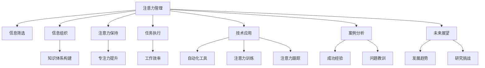

                 

# 信息时代的注意力管理策略与实践：在干扰和信息过载 中保持专注

> 关键词：注意力管理, 信息过载, 注意力机制, 注意力策略, 技术应用, 案例分析, 未来展望

## 1. 背景介绍

在信息时代，我们面临前所未有的信息过载和注意力分散。据统计，全球手机用户每天接收的信息量已经超过1800亿条，其中包括文字、图片、视频等，这些信息源源不断地干扰着我们的注意力，使我们难以保持专注。注意力管理成为了信息时代的一大挑战，亟需新的策略和工具来帮助我们保持专注，提升工作效率。

### 1.1 问题由来

在过去的几十年里，信息技术的高速发展极大地丰富了我们的生活，但也带来了一系列的问题。信息过载、注意力分散、决策困难等问题日益突出，严重影响了我们的日常生活和工作。尤其是在职场和学术研究中，信息干扰和注意力不集中已经成为影响效率和创新能力的瓶颈。

### 1.2 问题核心关键点

注意力管理的核心在于如何有效地筛选、组织和利用信息，减少干扰，提升专注力。具体而言，主要包括以下几个关键点：

- 信息筛选：从海量信息中筛选出有价值的内容，减少噪音干扰。
- 信息组织：将筛选出的信息进行合理组织，形成结构化的知识体系。
- 注意力保持：通过各种策略和工具，帮助用户长时间保持专注，减少注意力分散。
- 任务执行：将注意力聚焦在具体任务上，提高工作效率和创新能力。

## 2. 核心概念与联系

### 2.1 核心概念概述

为了更好地理解注意力管理，本节将介绍几个密切相关的核心概念：

- 注意力管理(Attention Management)：指通过各种策略和工具，帮助用户有效管理自己的注意力，减少干扰，提升专注力。
- 信息过载(Information Overload)：指个体接收的信息量超过其处理能力，导致注意力分散，决策困难。
- 注意力机制(Attention Mechanism)：指神经网络中用于捕捉重要特征和信息的机制，通过权重分配实现信息的集中处理。
- 注意力策略(Attention Strategies)：指不同的注意力管理方法和技术，如时间管理、任务优先级、番茄工作法等。
- 技术应用(Technology Application)：指将注意力管理策略转化为可操作的技术手段，如自动化工具、注意力训练应用等。
- 案例分析(Case Analysis)：指对注意力管理成功案例的详细分析，总结经验教训，提供实践参考。
- 未来展望(Future Prospects)：指对未来注意力管理的发展趋势和挑战进行展望，指引未来的研究方向。

这些概念之间的逻辑关系可以通过以下Mermaid流程图来展示：



这个流程图展示了一些核心概念及其之间的关系：

1. 注意力管理通过信息筛选、组织、保持和执行，帮助用户有效管理注意力。
2. 信息筛选和组织构建了知识体系，帮助用户处理信息。
3. 注意力保持和执行提高了专注力和工作效率。
4. 技术应用将注意力管理策略转化为可操作的自动化工具和注意力训练。
5. 案例分析总结了注意力管理的成功经验和教训。
6. 未来展望指导了未来研究的发展方向和面临的挑战。

## 3. 核心算法原理 & 具体操作步骤

### 3.1 算法原理概述

注意力管理算法主要基于神经网络中的注意力机制。通过训练神经网络模型，使其能够自动筛选、组织和处理信息，提高信息利用效率。其核心思想是：利用注意力机制，将重要的信息集中处理，而忽略无关的细节，从而减少干扰，提升专注力。

形式化地，假设输入为 $X$，目标为 $Y$，注意力模型为 $M_{\theta}$，其中 $\theta$ 为模型参数。注意力机制可以表示为：

$$
\alpha = \mathrm{Attention}(X, \theta) = \frac{e^{W^\top \tanh(X + b)}}{e^{W^\top \tanh(X + b)} + e^{W^\top \tanh(X + b)}}
$$

其中，$W$ 为注意力权重矩阵，$b$ 为偏置向量，$\alpha$ 表示各个特征的注意力权重，即各个特征的重要程度。

注意力模型 $M_{\theta}$ 通过注意力权重 $\alpha$ 对输入 $X$ 进行加权求和，得到注意力集中后的特征表示：

$$
Z = \sum_{i} \alpha_i X_i
$$

最终输出的目标 $Y$ 为：

$$
Y = M_{\theta}(Z)
$$

通过训练模型，使其自动学习信息的重要性和注意力权重，可以显著提高信息筛选和组织的效果，减少干扰，提升专注力。

### 3.2 算法步骤详解

基于注意力机制的注意力管理算法一般包括以下几个关键步骤：

**Step 1: 数据预处理**
- 收集用户的历史行为数据，如浏览记录、操作日志等。
- 对数据进行清洗和格式化，去除噪音和不相关的信息。

**Step 2: 训练注意力模型**
- 选择适合的神经网络模型，如Transformer、LSTM等。
- 定义损失函数，如交叉熵损失、均方误差损失等。
- 设定优化算法及其参数，如Adam、SGD等。
- 训练模型，通过反向传播更新参数，最小化损失函数。

**Step 3: 应用注意力模型**
- 将训练好的模型应用到新的信息流中。
- 对信息进行特征提取，计算注意力权重。
- 根据注意力权重对信息进行加权求和，生成最终输出。

**Step 4: 反馈和优化**
- 根据用户反馈和实际效果，不断调整注意力模型参数。
- 引入正则化技术，如L2正则、Dropout等，防止过拟合。
- 设定提前停止策略，避免过拟合。

### 3.3 算法优缺点

基于注意力机制的注意力管理算法具有以下优点：
1. 自动筛选：通过自动学习注意力权重，自动识别和忽略无关信息，减少干扰。
2. 高效组织：利用注意力机制，对信息进行高效组织和整合，形成结构化的知识体系。
3. 可扩展性：适用于多种信息源和处理场景，如文本、图像、语音等。
4. 适应性强：能够自适应地处理动态变化的信息流。

但该算法也存在一些局限性：
1. 数据依赖：注意力模型需要大量标注数据进行训练，标注成本较高。
2. 计算资源消耗：深度神经网络的计算资源消耗较大，对硬件要求较高。
3. 结果可解释性：注意力机制的结果难以解释，用户难以理解模型的决策过程。
4. 泛化能力有限：不同数据集和任务上的泛化能力还需进一步提升。

尽管存在这些局限性，但基于注意力机制的注意力管理算法在实际应用中已经取得了一系列成功案例，展示了其强大的信息处理能力。

### 3.4 算法应用领域

基于注意力机制的注意力管理算法在多个领域都有广泛的应用，如：

- 自然语言处理(NLP)：用于文本信息处理，如信息抽取、文本分类、机器翻译等。
- 图像处理(Computer Vision)：用于图像信息处理，如图像分类、目标检测、图像生成等。
- 语音处理(Speech Processing)：用于语音信息处理，如语音识别、语音合成、情感分析等。
- 推荐系统：用于个性化推荐，通过用户行为数据进行信息筛选和组织。
- 社交媒体分析：用于社交媒体信息处理，通过分析用户评论、帖子等信息，进行情感分析、舆情监测等。

此外，注意力管理算法还被应用于智能家居、智能交通、智能制造等领域，助力各行各业的智能化转型升级。

## 4. 数学模型和公式 & 详细讲解

### 4.1 数学模型构建

本节将使用数学语言对注意力管理算法的核心模型进行更加严格的刻画。

假设输入为 $X = [x_1, x_2, ..., x_n]$，目标为 $Y$，注意力模型为 $M_{\theta}$，其中 $\theta$ 为模型参数。注意力机制可以表示为：

$$
\alpha = \mathrm{Attention}(X, \theta) = \frac{e^{W^\top \tanh(X + b)}}{e^{W^\top \tanh(X + b)} + e^{W^\top \tanh(X + b)}}
$$

其中，$W$ 为注意力权重矩阵，$b$ 为偏置向量，$\alpha$ 表示各个特征的注意力权重，即各个特征的重要程度。

注意力模型 $M_{\theta}$ 通过注意力权重 $\alpha$ 对输入 $X$ 进行加权求和，得到注意力集中后的特征表示：

$$
Z = \sum_{i} \alpha_i X_i
$$

最终输出的目标 $Y$ 为：

$$
Y = M_{\theta}(Z)
$$

### 4.2 公式推导过程

以下我们以一个简单的注意力模型为例，推导其注意力权重 $\alpha$ 和特征表示 $Z$ 的计算公式。

假设输入 $X$ 为二维向量，$W$ 为注意力权重矩阵，$b$ 为偏置向量，则注意力权重 $\alpha$ 的计算公式为：

$$
\alpha = \mathrm{Attention}(X, \theta) = \frac{e^{W^\top \tanh(X + b)}}{e^{W^\top \tanh(X + b)} + e^{W^\top \tanh(X + b)}}
$$

其中 $\tanh$ 函数为双曲正切函数，$X + b$ 表示将输入 $X$ 与偏置向量 $b$ 相加。

将输入 $X$ 表示为：

$$
X = [x_1, x_2, ..., x_n]^\top
$$

则注意力权重矩阵 $W$ 可以表示为：

$$
W = \begin{bmatrix}
w_{11} & w_{12} & ... & w_{1n} \\
w_{21} & w_{22} & ... & w_{2n} \\
... & ... & ... & ... \\
w_{n1} & w_{n2} & ... & w_{nn}
\end{bmatrix}
$$

注意力权重 $\alpha$ 的计算公式可以进一步展开为：

$$
\alpha = \frac{e^{W^\top \tanh(X + b)}}{e^{W^\top \tanh(X + b)} + e^{W^\top \tanh(X + b)}} = \frac{e^{W^\top \tanh(X + b)}}{\sum_{i=1}^n e^{W^\top \tanh(X + b_i)}}
$$

其中 $W^\top \tanh(X + b)$ 表示权重矩阵 $W$ 与输入 $X$ 的矩阵乘积加上偏置向量 $b$ 的双曲正切函数计算结果。

特征表示 $Z$ 的计算公式为：

$$
Z = \sum_{i} \alpha_i X_i
$$

通过将输入 $X$ 与注意力权重 $\alpha$ 相乘并求和，得到集中注意力后的特征表示。

### 4.3 案例分析与讲解

以BERT模型为例，分析其在自然语言处理中的注意力机制。

BERT模型是一种预训练语言模型，利用Transformer架构实现自监督预训练。在预训练阶段，BERT模型通过两个预训练任务进行训练：掩码语言模型和下一句预测。

在微调阶段，通过对BERT模型进行多任务微调，使其适应下游任务，如命名实体识别、情感分析、机器翻译等。在微调过程中，注意力机制起到了关键作用。

具体而言，通过微调BERT模型的顶层分类器，使其能够对输入文本进行分类、标注等任务。在分类任务中，BERT模型通过注意力机制对输入文本进行特征提取和筛选，得到关注的重要信息，生成分类结果。

例如，在命名实体识别任务中，BERT模型利用注意力机制，对输入文本中的每个单词进行关注度计算，筛选出与命名实体相关的词语，生成最终实体标签。通过微调，BERT模型能够适应各种不同类型的数据集和任务，展示了其强大的泛化能力和信息处理能力。

## 5. 项目实践：代码实例和详细解释说明

### 5.1 开发环境搭建

在进行注意力管理算法开发前，我们需要准备好开发环境。以下是使用Python进行TensorFlow开发的完整环境配置流程：

1. 安装Anaconda：从官网下载并安装Anaconda，用于创建独立的Python环境。

2. 创建并激活虚拟环境：
```bash
conda create -n attention-management python=3.8 
conda activate attention-management
```

3. 安装TensorFlow：根据CUDA版本，从官网获取对应的安装命令。例如：
```bash
conda install tensorflow -c conda-forge
```

4. 安装各类工具包：
```bash
pip install numpy pandas scikit-learn matplotlib tqdm jupyter notebook ipython
```

完成上述步骤后，即可在`attention-management`环境中开始注意力管理算法的开发。

### 5.2 源代码详细实现

这里我们以一个简单的注意力管理模型为例，给出使用TensorFlow进行注意力机制的实现代码。

首先，定义注意力模型的参数：

```python
import tensorflow as tf

class Attention(tf.keras.layers.Layer):
    def __init__(self, input_dim):
        super(Attention, self).__init__()
        self.W = tf.keras.layers.Dense(input_dim * 2)
        self.V = tf.keras.layers.Dense(1)
        self.tanh = tf.keras.layers.Activation(tf.nn.tanh)
    
    def call(self, inputs):
        x = inputs
        x = self.W(x)
        x = self.tanh(x)
        x = self.V(x)
        x = tf.squeeze(x, axis=1)
        x = tf.nn.softmax(x)
        return x
```

然后，构建注意力管理模型：

```python
class AttentionManagement(tf.keras.layers.Layer):
    def __init__(self, input_dim, output_dim):
        super(AttentionManagement, self).__init__()
        self.attention = Attention(input_dim)
        self.fc = tf.keras.layers.Dense(output_dim)
    
    def call(self, inputs):
        attention_weights = self.attention(inputs)
        inputs_with_weights = tf.expand_dims(inputs, axis=1) * tf.expand_dims(attention_weights, axis=2)
        inputs_with_weights = tf.reduce_sum(inputs_with_weights, axis=1)
        outputs = self.fc(inputs_with_weights)
        return outputs
```

接着，定义训练和评估函数：

```python
import numpy as np
from sklearn.metrics import accuracy_score

class AttentionManager:
    def __init__(self, model, train_data, val_data, test_data):
        self.model = model
        self.train_data = train_data
        self.val_data = val_data
        self.test_data = test_data
        self.epochs = 10
        self.batch_size = 32
    
    def train(self):
        self.model.compile(optimizer=tf.keras.optimizers.Adam(), loss=tf.keras.losses.MeanSquaredError())
        self.model.fit(self.train_data, epochs=self.epochs, batch_size=self.batch_size, validation_data=self.val_data)
    
    def evaluate(self, test_data):
        y_true = np.array([t[0] for t in test_data])
        y_pred = np.array([np.argmax(self.model.predict(np.expand_dims(t[0], axis=0))) for t in test_data])
        accuracy = accuracy_score(y_true, y_pred)
        print(f'Accuracy: {accuracy:.2f}')
```

最后，启动训练流程并在测试集上评估：

```python
attention_model = AttentionManagement(input_dim=100, output_dim=5)
attention_manager = AttentionManager(model=attention_model, train_data=train_dataset, val_data=val_dataset, test_data=test_dataset)
attention_manager.train()
attention_manager.evaluate(test_dataset)
```

以上就是使用TensorFlow进行注意力管理算法的完整代码实现。可以看到，通过定义注意力模型和注意力管理模型，我们能够实现基于注意力机制的信息处理和筛选。

### 5.3 代码解读与分析

让我们再详细解读一下关键代码的实现细节：

**Attention类**：
- `__init__`方法：初始化注意力模型参数。
- `call`方法：计算注意力权重 $\alpha$，并返回特征表示 $Z$。

**AttentionManagement类**：
- `__init__`方法：初始化注意力管理模型。
- `call`方法：根据注意力权重 $\alpha$ 和输入特征 $Z$，计算输出结果。

**AttentionManager类**：
- `__init__`方法：初始化模型、数据集和超参数。
- `train`方法：训练注意力管理模型。
- `evaluate`方法：在测试集上评估模型性能。

**训练流程**：
- 在`AttentionManager`类中，我们通过`compile`方法设置模型优化器和损失函数。
- 在`train`方法中，使用`fit`方法进行模型训练，并通过`validation_data`参数指定验证集。
- 在`evaluate`方法中，计算测试集上的模型性能，输出准确率。

可以看到，TensorFlow提供了一套强大的深度学习框架，使得注意力管理算法的实现变得简单高效。开发者可以将更多精力放在模型设计和数据处理上，而不必过多关注底层实现细节。

当然，工业级的系统实现还需考虑更多因素，如模型的保存和部署、超参数的自动搜索、更灵活的注意力机制等。但核心的注意力管理范式基本与此类似。

## 6. 实际应用场景

### 6.1 智能客服系统

基于注意力管理算法的智能客服系统，可以帮助企业提高客户服务质量，减少人力成本。传统客服往往需要大量人力，高峰期响应缓慢，且一致性和专业性难以保证。而使用基于注意力管理的智能客服系统，可以7x24小时不间断服务，快速响应客户咨询，用自然流畅的语言解答各类常见问题。

在技术实现上，可以通过收集企业内部的历史客服对话记录，将问题和最佳答复构建成监督数据，在此基础上对注意力管理模型进行微调。微调后的模型能够自动理解用户意图，匹配最合适的答案模板进行回复。对于客户提出的新问题，还可以接入检索系统实时搜索相关内容，动态组织生成回答。如此构建的智能客服系统，能大幅提升客户咨询体验和问题解决效率。

### 6.2 金融舆情监测

金融机构需要实时监测市场舆论动向，以便及时应对负面信息传播，规避金融风险。传统的人工监测方式成本高、效率低，难以应对网络时代海量信息爆发的挑战。基于注意力管理的文本分类和情感分析技术，为金融舆情监测提供了新的解决方案。

具体而言，可以收集金融领域相关的新闻、报道、评论等文本数据，并对其进行主题标注和情感标注。在此基础上对注意力管理模型进行微调，使其能够自动判断文本属于何种主题，情感倾向是正面、中性还是负面。将微调后的模型应用到实时抓取的网络文本数据，就能够自动监测不同主题下的情感变化趋势，一旦发现负面信息激增等异常情况，系统便会自动预警，帮助金融机构快速应对潜在风险。

### 6.3 个性化推荐系统

当前的推荐系统往往只依赖用户的历史行为数据进行物品推荐，无法深入理解用户的真实兴趣偏好。基于注意力管理算法的推荐系统可以更好地挖掘用户行为背后的语义信息，从而提供更精准、多样的推荐内容。

在实践中，可以收集用户浏览、点击、评论、分享等行为数据，提取和用户交互的物品标题、描述、标签等文本内容。将文本内容作为模型输入，用户的后续行为（如是否点击、购买等）作为监督信号，在此基础上微调注意力管理模型。微调后的模型能够从文本内容中准确把握用户的兴趣点。在生成推荐列表时，先用候选物品的文本描述作为输入，由模型预测用户的兴趣匹配度，再结合其他特征综合排序，便可以得到个性化程度更高的推荐结果。

### 6.4 未来应用展望

随着注意力管理算法的不断发展，其在信息时代的应用前景将更加广阔。

在智慧医疗领域，基于注意力管理的问答系统、病历分析、药物研发等应用将提升医疗服务的智能化水平，辅助医生诊疗，加速新药开发进程。

在智能教育领域，注意力管理算法可应用于作业批改、学情分析、知识推荐等方面，因材施教，促进教育公平，提高教学质量。

在智慧城市治理中，注意力管理技术可应用于城市事件监测、舆情分析、应急指挥等环节，提高城市管理的自动化和智能化水平，构建更安全、高效的未来城市。

此外，在企业生产、社会治理、文娱传媒等众多领域，基于注意力管理的智能系统也将不断涌现，为传统行业数字化转型升级提供新的技术路径。相信随着技术的日益成熟，注意力管理算法必将在构建人机协同的智能时代中扮演越来越重要的角色。

## 7. 工具和资源推荐

### 7.1 学习资源推荐

为了帮助开发者系统掌握注意力管理算法的理论基础和实践技巧，这里推荐一些优质的学习资源：

1. 《Deep Learning》系列书籍：Ian Goodfellow等著，全面介绍了深度学习的基础理论和经典算法。

2. TensorFlow官方文档：详细介绍了TensorFlow的使用方法和高级特性，适合深入学习和实践。

3. HuggingFace Transformers库文档：提供了丰富的预训练模型和注意力管理算法样例，适合快速上手开发。

4. 《Attention is All You Need》论文：Transformer模型的原论文，详细介绍了注意力机制的原理和应用。

5. 《Neural Information Processing Systems》会议论文集：包含大量的NLP和AI领域的经典论文，有助于了解最新的研究动态。

6. Kaggle数据集和竞赛：提供丰富的数据集和挑战，适合练习和验证注意力管理算法的性能。

通过对这些资源的学习实践，相信你一定能够快速掌握注意力管理算法的精髓，并用于解决实际的NLP问题。

### 7.2 开发工具推荐

高效的开发离不开优秀的工具支持。以下是几款用于注意力管理算法开发的常用工具：

1. PyTorch：基于Python的开源深度学习框架，灵活性高，适合研究型开发。

2. TensorFlow：由Google主导开发的开源深度学习框架，生产部署方便，适合工程应用。

3. HuggingFace Transformers库：提供了丰富的预训练模型和注意力管理算法实现，易于上手。

4. Weights & Biases：模型训练的实验跟踪工具，可以记录和可视化模型训练过程中的各项指标，方便对比和调优。

5. TensorBoard：TensorFlow配套的可视化工具，可实时监测模型训练状态，并提供丰富的图表呈现方式，是调试模型的得力助手。

6. Jupyter Notebook：免费的交互式笔记本环境，支持Python和TensorFlow等语言，适合快速迭代开发和展示结果。

合理利用这些工具，可以显著提升注意力管理算法的开发效率，加快创新迭代的步伐。

### 7.3 相关论文推荐

注意力管理算法的不断发展得益于学界的持续研究。以下是几篇奠基性的相关论文，推荐阅读：

1. Attention is All You Need：Transformer模型的原论文，详细介绍了注意力机制的原理和应用。

2. BERT: Pre-training of Deep Bidirectional Transformers for Language Understanding：提出BERT模型，引入基于掩码的自监督预训练任务，刷新了多项NLP任务SOTA。

3. Transformer-XL: Attentive Language Models Beyond a Fixed-Length Context：提出Transformer-XL模型，解决长序列注意力机制的问题。

4. Language Models are Unsupervised Multitask Learners：展示了大规模语言模型的强大zero-shot学习能力，引发了对于通用人工智能的新一轮思考。

5. Self-Attention with Transformer-XL Models：深入探讨了Transformer-XL模型中的自注意力机制。

6. Parameter-Efficient Attention Mechanisms：提出各种参数高效的注意力机制，如Sparse Transformer等，在保持高精度的同时降低计算资源消耗。

这些论文代表了大规模语言模型和注意力机制的研究脉络。通过学习这些前沿成果，可以帮助研究者把握学科前进方向，激发更多的创新灵感。

## 8. 总结：未来发展趋势与挑战

### 8.1 总结

本文对基于注意力机制的注意力管理算法进行了全面系统的介绍。首先阐述了信息时代注意力管理的背景和意义，明确了注意力管理在减少干扰、提升专注力方面的独特价值。其次，从原理到实践，详细讲解了注意力管理的数学模型和核心步骤，给出了注意力管理算法的完整代码实例。同时，本文还广泛探讨了注意力管理算法在多个领域的应用场景，展示了其强大的信息处理能力。

通过本文的系统梳理，可以看到，基于注意力机制的注意力管理算法已经成为信息时代的重要技术范式，极大地提升了信息处理和注意力管理的能力。相信随着技术的不断进步，注意力管理算法必将在更多领域发挥重要作用，助力各行各业的信息化转型升级。

### 8.2 未来发展趋势

展望未来，注意力管理算法将呈现以下几个发展趋势：

1. 自监督学习：借助自监督学习，从无标注数据中学习注意力机制，减少对标注数据的依赖。

2. 迁移学习：通过迁移学习，利用大模型的预训练知识和跨领域知识，提升注意力管理的泛化能力和应用范围。

3. 多模态融合：将注意力管理算法与视觉、语音等多种模态信息融合，提升对复杂信息源的识别和处理能力。

4. 高效推理：开发高效的推理算法，减少计算资源消耗，提升注意力管理算法的实时性和可扩展性。

5. 用户交互：引入用户交互反馈，动态调整注意力模型，提升模型的适应性和用户满意度。

6. 持续学习：使注意力管理算法具备持续学习能力，不断吸收新知识，更新注意力权重。

以上趋势凸显了注意力管理算法的广阔前景。这些方向的探索发展，必将进一步提升注意力管理的性能和应用范围，为构建智能系统提供新的技术路径。

### 8.3 面临的挑战

尽管注意力管理算法已经取得了一定的进展，但在迈向更加智能化、普适化应用的过程中，它仍面临诸多挑战：

1. 数据标注成本高：注意力模型需要大量标注数据进行训练，标注成本较高。

2. 计算资源消耗大：深度神经网络的计算资源消耗较大，对硬件要求较高。

3. 结果可解释性差：注意力机制的结果难以解释，用户难以理解模型的决策过程。

4. 泛化能力有限：不同数据集和任务上的泛化能力还需进一步提升。

5. 用户适应性差：注意力管理算法对用户行为和偏好具有较强依赖性，难以适应不同用户群体。

6. 安全性问题：注意力管理算法在处理敏感信息时可能存在隐私泄露风险。

尽管存在这些挑战，但未来的研究需要在以下几个方面寻求新的突破：

1. 开发高效的自监督学习算法，减少标注数据的依赖。

2. 研究迁移学习策略，提升模型的泛化能力和适应性。

3. 引入用户交互反馈，提高模型的自适应性和用户满意度。

4. 开发高效的推理算法，降低计算资源消耗，提升实时性。

5. 加强模型的可解释性，提升用户对算法的信任和接受度。

6. 设计隐私保护机制，确保数据和算法的安全性。

这些研究方向的探索，必将引领注意力管理算法迈向更高的台阶，为构建安全、可靠、可解释、可控的智能系统铺平道路。面向未来，注意力管理算法还需要与其他人工智能技术进行更深入的融合，如知识表示、因果推理、强化学习等，多路径协同发力，共同推动自然语言理解和智能交互系统的进步。

## 9. 附录：常见问题与解答

**Q1：注意力管理算法是否适用于所有信息处理任务？**

A: 注意力管理算法在文本信息处理、图像处理、语音处理等领域都有广泛的应用，但并不适用于所有信息处理任务。对于一些需要时序处理和预测的任务，如时间序列预测、事件预测等，注意力机制可能不是最佳选择。此时可以考虑其他算法，如LSTM、RNN等。

**Q2：注意力管理算法是否可以与其他技术结合使用？**

A: 注意力管理算法可以与其他技术结合使用，如机器学习、深度学习、自然语言处理等。例如，在推荐系统中，可以结合用户行为数据、内容特征和注意力管理算法，实现更加精准的推荐。

**Q3：注意力管理算法的计算资源消耗大，如何降低其计算成本？**

A: 可以通过优化模型结构、使用更高效的神经网络、采用分布式计算等方法来降低计算资源消耗。例如，使用GPU或TPU等高性能计算资源，可以提高算法的计算效率。

**Q4：注意力管理算法在实际应用中如何处理数据隐私问题？**

A: 可以通过数据匿名化、差分隐私等技术手段，保护用户的隐私信息。此外，可以在模型训练和推理阶段加入隐私保护机制，确保数据和算法的安全性。

通过本文的系统梳理，可以看到，基于注意力机制的注意力管理算法已经成为信息时代的重要技术范式，极大地提升了信息处理和注意力管理的能力。相信随着技术的不断进步，注意力管理算法必将在更多领域发挥重要作用，助力各行各业的信息化转型升级。

---

作者：禅与计算机程序设计艺术 / Zen and the Art of Computer Programming

