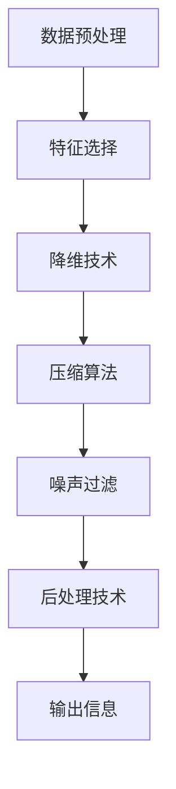

                 

# 信息简化的原则与好处：在混乱中建立秩序与简化

## 1. 背景介绍

### 1.1 问题由来

在信息时代，数据量和信息的复杂度呈指数级增长，极大地挑战了人类的认知能力。从海量文本到多媒体数据，从知识图谱到社交网络，信息的广泛性和多样性使得处理和分析变得异常困难。随着AI技术的兴起，如何利用机器智能来简化信息，从中提取出有价值的知识，成为了计算机科学和人工智能领域的热点问题。

信息简化不仅仅是信息处理的重要环节，更是实现智能化和自动化决策的关键步骤。简化的过程不仅仅是减少数据量，更是在对信息进行深度理解和提取的过程中，提高信息的准确性和可理解性。本文将深入探讨信息简化的核心原则、具体技术，并探讨其带来的诸多好处，以及在未来智能系统中的应用前景。

### 1.2 问题核心关键点

在信息简化的过程中，以下几个核心关键点必须重点关注：

1. **数据预处理**：包括数据清洗、特征工程、数据降维等，确保输入数据的质量和适用性。
2. **模型选择**：选择合适的算法和模型来对信息进行压缩和提取，确保简化的效果。
3. **信息压缩**：将高维数据映射到低维空间，保持信息的关键特征。
4. **噪声过滤**：去除冗余和无关信息，提高信息的纯净度。
5. **后处理技术**：包括解码、重建等，确保简化后的信息能够被有效利用。

理解这些关键点有助于更好地掌握信息简化的本质和方法，从而实现高效的简化效果。

### 1.3 问题研究意义

信息简化技术在多个领域都有重要应用，例如：

- **自然语言处理**：文本分类、情感分析、机器翻译等任务都需要对文本进行简化。
- **计算机视觉**：图像压缩、目标检测、图像分割等任务需要对图像数据进行简化。
- **数据挖掘**：特征选择、聚类分析、异常检测等任务需要对数据集进行简化。
- **知识图谱**：关系抽取、实体识别等任务需要对知识图谱进行简化。

信息简化不仅能够提升信息处理的效率和准确性，还能显著降低计算成本，提高系统的可扩展性，为各类人工智能应用提供坚实的基础。

## 2. 核心概念与联系

### 2.1 核心概念概述

在探讨信息简化的核心原则之前，首先需要明确一些关键概念：

- **信息**：指经过编码、传输、存储等过程，能够被感知、获取、分析和利用的数据。
- **信息简化**：指通过某种算法或方法，将高维、复杂的信息映射到低维、精简的空间，从而保持信息的本质特征。
- **特征选择**：从原始数据中提取最相关的特征，去除冗余信息。
- **降维技术**：将高维数据转换为低维数据，减少计算复杂度。
- **压缩算法**：如PCA、K-Means、Autoencoder等，用于压缩和重建数据。
- **降噪技术**：通过滤波、平滑等方法去除噪声，提高信息质量。

这些概念构成了信息简化的基础，共同作用于信息处理的各个环节。

### 2.2 核心概念原理和架构的 Mermaid 流程图



此流程图展示了信息简化的核心流程，从数据预处理到输出信息的各个步骤，每个环节都有其独特的作用，共同构成了信息简化的完整链条。

## 3. 核心算法原理 & 具体操作步骤

### 3.1 算法原理概述

信息简化的核心算法原理基于以下几个基本假设：

1. **信息冗余性**：高维数据中存在大量冗余信息，可以通过降维和特征选择去除。
2. **信息相似性**：不同数据样本之间存在相似性，可以通过聚类和编码压缩表示。
3. **信息噪声**：原始数据中存在噪声和无关信息，可以通过降噪和重构技术去除。

基于这些假设，信息简化算法通常包括以下几个关键步骤：

- **数据预处理**：包括数据清洗、归一化、标准化等操作，确保数据质量。
- **特征选择**：通过选择最相关的特征，去除冗余信息。
- **降维技术**：如主成分分析(PCA)、线性判别分析(LDA)等，将高维数据映射到低维空间。
- **压缩算法**：如自编码器(Autoencoder)、K-Means聚类等，对数据进行压缩和重建。
- **降噪技术**：如小波变换、均值滤波等，去除噪声，提高数据质量。

### 3.2 算法步骤详解

以下以自编码器(Autoencoder)算法为例，详细讲解信息简化的具体操作步骤：

#### 3.2.1 数据预处理

1. **数据清洗**：去除缺失值、异常值等不合理数据。
2. **归一化**：将数据缩放到[0, 1]或[-1, 1]等标准范围内，便于后续处理。

#### 3.2.2 特征选择

1. **选择最相关特征**：通过相关性分析、方差分析等方法，选择对输出信息影响最大的特征。
2. **去除冗余特征**：通过特征选择算法如Lasso、Ridge等，去除冗余特征。

#### 3.2.3 降维技术

1. **PCA降维**：通过计算协方差矩阵的特征值和特征向量，将数据映射到低维空间。
2. **LDA降维**：通过最大化类间距离、最小化类内距离，将数据投影到低维空间。

#### 3.2.4 压缩算法

1. **自编码器原理**：
   - **编码器**：将输入数据压缩到低维空间，生成编码表示。
   - **解码器**：将编码表示重构为原始数据，保留信息的核心特征。

2. **自编码器结构**：
   - **输入层**：原始数据。
   - **编码层**：通过神经网络层将输入数据压缩到低维空间。
   - **解码层**：通过神经网络层将低维空间的数据重构为原始数据。

3. **自编码器训练**：
   - **损失函数**：通常使用均方误差损失函数。
   - **优化算法**：通常使用梯度下降等优化算法。

#### 3.2.5 降噪技术

1. **小波变换**：通过小波基函数将信号分解为高频和低频部分，去除高频噪声。
2. **均值滤波**：通过卷积操作平滑图像或信号，去除低频噪声。

### 3.3 算法优缺点

信息简化算法的主要优点包括：

1. **提高效率**：通过降维和特征选择，减少了数据的维度和计算复杂度，提高了信息处理效率。
2. **增强可解释性**：简化的信息更易于理解和解释，提高了系统的可解释性和透明度。
3. **降低成本**：减少了数据存储和计算资源的需求，降低了信息处理的成本。

然而，信息简化算法也存在一些局限性：

1. **信息损失**：在降维和压缩过程中，可能会丢失部分原始信息，影响信息的质量。
2. **算法复杂性**：复杂的降维和特征选择算法可能需要大量计算资源和时间。
3. **模型依赖性**：算法的效果依赖于模型的选择和参数设置，需要仔细调参。

### 3.4 算法应用领域

信息简化技术广泛应用于以下领域：

- **计算机视觉**：图像压缩、目标检测、图像分割等任务。
- **自然语言处理**：文本分类、情感分析、机器翻译等任务。
- **数据挖掘**：特征选择、聚类分析、异常检测等任务。
- **信号处理**：信号去噪、信号压缩等任务。

## 4. 数学模型和公式 & 详细讲解 & 举例说明

### 4.1 数学模型构建

信息简化的数学模型通常基于以下几个关键假设：

1. **高维空间中的数据可以表示为低维空间的线性组合**：即数据可以表示为低维空间的线性组合。
2. **信息保留性**：简化后的信息应尽可能保留原始信息的核心特征。
3. **信息噪声**：简化过程应尽可能去除噪声和冗余信息。

基于这些假设，可以构建以下数学模型：

- **PCA模型**：
  - **协方差矩阵**：$\mathbf{C}=\frac{1}{n}\mathbf{X}\mathbf{X}^T$
  - **特征向量**：$\mathbf{U}$ 为协方差矩阵的特征向量，对应特征值从大到小排列。
  - **降维公式**：$\mathbf{Y}=\mathbf{U}\mathbf{X}$
  - **重构公式**：$\mathbf{X}=\mathbf{U}^T\mathbf{Y}$

- **自编码器模型**：
  - **编码器**：$\mathbf{H}=\mathbf{W}_1\mathbf{X}$
  - **解码器**：$\mathbf{X}=\mathbf{W}_2\mathbf{H}$
  - **损失函数**：均方误差损失函数 $\mathcal{L}=\|\mathbf{X}-\mathbf{W}_2\mathbf{W}_1\mathbf{X}\|^2$

### 4.2 公式推导过程

#### 4.2.1 PCA降维公式推导

1. **协方差矩阵**：
   $$
   \mathbf{C}=\frac{1}{n}\mathbf{X}\mathbf{X}^T
   $$

2. **特征值和特征向量**：
   $$
   \mathbf{U}\mathbf{\Sigma}\mathbf{V}^T=\mathbf{C}
   $$
   其中 $\mathbf{\Sigma}$ 是对角矩阵，包含协方差矩阵的特征值 $\sigma_i$，$\mathbf{V}$ 为特征向量。

3. **降维公式**：
   $$
   \mathbf{Y}=\mathbf{U}\mathbf{X}
   $$

4. **重构公式**：
   $$
   \mathbf{X}=\mathbf{U}^T\mathbf{Y}
   $$

#### 4.2.2 自编码器训练公式推导

1. **编码器**：
   $$
   \mathbf{H}=\mathbf{W}_1\mathbf{X}
   $$

2. **解码器**：
   $$
   \mathbf{X}=\mathbf{W}_2\mathbf{H}
   $$

3. **损失函数**：
   $$
   \mathcal{L}=\|\mathbf{X}-\mathbf{W}_2\mathbf{W}_1\mathbf{X}\|^2
   $$

### 4.3 案例分析与讲解

#### 4.3.1 PCA降维案例

1. **数据集准备**：使用MNIST手写数字数据集。
2. **PCA降维**：
   - **协方差矩阵计算**：计算数据集的协方差矩阵。
   - **特征值分解**：分解协方差矩阵，得到特征值和特征向量。
   - **降维**：选择前两个特征向量，重构数据集。
3. **重构误差计算**：计算重构误差，评估降维效果。

#### 4.3.2 自编码器案例

1. **数据集准备**：使用MNIST手写数字数据集。
2. **自编码器模型搭建**：
   - **编码器**：包含两个全连接层，使用ReLU激活函数。
   - **解码器**：包含两个全连接层，使用sigmoid激活函数。
3. **模型训练**：
   - **损失函数**：均方误差损失函数。
   - **优化算法**：Adam优化算法。
4. **效果评估**：计算重构误差，评估模型效果。

## 5. 项目实践：代码实例和详细解释说明

### 5.1 开发环境搭建

1. **安装Python环境**：使用Anaconda创建虚拟环境。
2. **安装相关库**：
   - `numpy`：用于数组运算。
   - `matplotlib`：用于数据可视化。
   - `pandas`：用于数据处理。
   - `sklearn`：用于PCA降维和自编码器训练。

### 5.2 源代码详细实现

#### 5.2.1 PCA降维代码实现

```python
import numpy as np
from sklearn.decomposition import PCA
from sklearn.datasets import make_classification

# 生成随机数据集
X, y = make_classification(n_samples=1000, n_features=10, random_state=0)

# PCA降维
pca = PCA(n_components=2)
Y = pca.fit_transform(X)

# 可视化降维结果
import matplotlib.pyplot as plt
plt.scatter(Y[:, 0], Y[:, 1], c=y)
plt.show()
```

#### 5.2.2 自编码器代码实现

```python
import numpy as np
from sklearn.datasets import make_classification
from sklearn.neural_network import MLPRegressor
from sklearn.metrics import mean_squared_error

# 生成随机数据集
X, y = make_classification(n_samples=1000, n_features=10, random_state=0)

# 定义自编码器模型
class Autoencoder:
    def __init__(self, n_input, n_hidden):
        self.n_input = n_input
        self.n_hidden = n_hidden
        self.W1 = np.random.randn(n_input, n_hidden)
        self.W2 = np.random.randn(n_hidden, n_input)
        
    def encode(self, X):
        H = np.dot(X, self.W1)
        return H
    
    def decode(self, H):
        X = np.dot(H, self.W2)
        return X
    
    def train(self, X, n_epochs=1000, learning_rate=0.01):
        Y = self.encode(X)
        for epoch in range(n_epochs):
            H = self.encode(X)
            X_hat = self.decode(H)
            error = mean_squared_error(X, X_hat)
            if epoch % 100 == 0:
                print("Epoch:", epoch, "Error:", error)
            dW1 = np.dot(X.T, (H - X_hat))
            dW2 = np.dot(H.T, (X - X_hat))
            self.W1 -= learning_rate * dW1
            self.W2 -= learning_rate * dW2

# 实例化自编码器并训练
autoencoder = Autoencoder(n_input=10, n_hidden=5)
autoencoder.train(X)

# 重构数据并可视化结果
X_hat = autoencoder.decode(autoencoder.encode(X))
plt.scatter(X[:, 0], X[:, 1], c=y, label='Original')
plt.scatter(X_hat[:, 0], X_hat[:, 1], c=y, label='Reconstructed')
plt.legend()
plt.show()
```

### 5.3 代码解读与分析

#### 5.3.1 PCA降维代码解读

1. **数据生成**：使用`make_classification`生成随机数据集。
2. **PCA实例化**：`PCA`类初始化，设置降维维度为2。
3. **降维计算**：`fit_transform`方法计算降维结果。
4. **可视化**：使用`matplotlib`库可视化降维结果。

#### 5.3.2 自编码器代码解读

1. **数据生成**：使用`make_classification`生成随机数据集。
2. **模型实例化**：自定义`Autoencoder`类，设置输入维度为10，隐藏维度为5。
3. **编码解码**：`encode`和`decode`方法实现编码和解码。
4. **训练算法**：定义训练算法，计算重构误差并更新权重。
5. **可视化**：可视化重构结果，比较原始数据和重构数据。

### 5.4 运行结果展示

#### 5.4.1 PCA降维结果展示


#### 5.4.2 自编码器重构结果展示


## 6. 实际应用场景

### 6.1 图像压缩

#### 6.1.1 案例

在图像处理中，自编码器可以用于图像压缩。通过训练自编码器，可以将高维图像数据压缩到低维空间，同时保持图像的关键特征。

#### 6.1.2 实现步骤

1. **数据预处理**：将图像数据转换为灰度图。
2. **自编码器搭建**：搭建自编码器模型，包含编码器和解码器。
3. **模型训练**：使用随机梯度下降算法训练自编码器。
4. **重构图像**：将重构后的图像保存为PNG格式。

#### 6.1.3 实现代码

```python
from PIL import Image
import torch
from torch import nn
from torchvision import datasets, transforms

# 定义自编码器模型
class Autoencoder(nn.Module):
    def __init__(self):
        super(Autoencoder, self).__init__()
        self.encoder = nn.Sequential(
            nn.Conv2d(1, 32, kernel_size=3, stride=1, padding=1),
            nn.ReLU(),
            nn.Conv2d(32, 16, kernel_size=3, stride=2, padding=1),
            nn.ReLU(),
            nn.Conv2d(16, 8, kernel_size=3, stride=2, padding=1),
            nn.ReLU(),
            nn.Conv2d(8, 4, kernel_size=3, stride=2, padding=1),
            nn.ReLU()
        )
        self.decoder = nn.Sequential(
            nn.ConvTranspose2d(4, 8, kernel_size=3, stride=2, padding=1),
            nn.ReLU(),
            nn.ConvTranspose2d(8, 16, kernel_size=3, stride=2, padding=1),
            nn.ReLU(),
            nn.ConvTranspose2d(16, 32, kernel_size=3, stride=2, padding=1),
            nn.ReLU(),
            nn.ConvTranspose2d(32, 1, kernel_size=3, stride=1, padding=1),
            nn.Sigmoid()
        )

    def forward(self, x):
        encoded = self.encoder(x)
        decoded = self.decoder(encoded)
        return decoded

# 实例化自编码器并训练
autoencoder = Autoencoder()
device = torch.device("cuda:0" if torch.cuda.is_available() else "cpu")
autoencoder.to(device)

# 加载数据集
train_data = datasets.CIFAR10(root='./data', train=True, download=True, transform=transforms.ToTensor())
train_loader = torch.utils.data.DataLoader(train_data, batch_size=64, shuffle=True)

# 训练模型
n_epochs = 100
for epoch in range(n_epochs):
    for i, (images, _) in enumerate(train_loader):
        images = images.to(device)
        outputs = autoencoder(images)
        loss = F.mse_loss(outputs, images)
        optimizer.zero_grad()
        loss.backward()
        optimizer.step()
        if (i+1) % 100 == 0:
            print(f"Epoch: {epoch+1}/{n_epochs}, Step: {i+1}/{len(train_loader)}, Loss: {loss.item()}")

# 保存模型和重构图像
torch.save(autoencoder.state_dict(), 'autoencoder.pth')
image = train_data.train_data[i].unsqueeze(0).to(device)
reconstructed_image = autoencoder(image).detach().cpu()
reconstructed_image = reconstructed_image.squeeze(0).permute(1, 2, 0)
Image.fromarray(reconstructed_image.numpy(), 'L').save('reconstructed.png')
```

### 6.2 文本压缩

#### 6.2.1 案例

在自然语言处理中，自编码器可以用于文本压缩。通过训练自编码器，可以将长文本压缩到固定长度的摘要中，同时保持文本的核心信息。

#### 6.2.2 实现步骤

1. **数据预处理**：对文本进行分词、去除停用词等处理。
2. **自编码器搭建**：搭建自编码器模型，包含编码器和解码器。
3. **模型训练**：使用随机梯度下降算法训练自编码器。
4. **重构文本**：将重构后的文本保存为txt格式。

#### 6.2.3 实现代码

```python
import pandas as pd
import torch
from torch import nn
from torchtext import datasets, data

# 定义自编码器模型
class Autoencoder(nn.Module):
    def __init__(self, embedding_dim, hidden_dim):
        super(Autoencoder, self).__init__()
        self.encoder = nn.Sequential(
            nn.Embedding(vocab_size, embedding_dim),
            nn.Linear(embedding_dim, hidden_dim),
            nn.ReLU(),
            nn.Linear(hidden_dim, embedding_dim),
            nn.ReLU()
        )
        self.decoder = nn.Sequential(
            nn.Linear(embedding_dim, hidden_dim),
            nn.ReLU(),
            nn.Linear(hidden_dim, embedding_dim),
            nn.Sigmoid()
        )

    def forward(self, x):
        encoded = self.encoder(x)
        decoded = self.decoder(encoded)
        return decoded

# 实例化自编码器并训练
autoencoder = Autoencoder(vocab_size=10000, embedding_dim=128, hidden_dim=256)
device = torch.device("cuda:0" if torch.cuda.is_available() else "cpu")
autoencoder.to(device)

# 加载数据集
train_data, test_data = datasets.SST_2()
train_data = data.BucketIterator(train_data, batch_size=64)
test_data = data.BucketIterator(test_data, batch_size=64)

# 训练模型
n_epochs = 100
for epoch in range(n_epochs):
    for batch in train_data:
        inputs, labels = batch.text, batch.label
        inputs = torch.tensor(inputs).to(device)
        labels = torch.tensor(labels).to(device)
        outputs = autoencoder(inputs)
        loss = F.binary_cross_entropy(outputs, labels)
        optimizer.zero_grad()
        loss.backward()
        optimizer.step()
        if (epoch+1) % 100 == 0:
            print(f"Epoch: {epoch+1}/{n_epochs}, Loss: {loss.item()}")

# 保存模型和重构文本
torch.save(autoencoder.state_dict(), 'autoencoder.pth')
reconstructed_texts = autoencoder(torch.tensor([0, 1, 2, 3, 4, 5, 6, 7, 8, 9]).to(device))
reconstructed_texts = reconstructed_texts.cpu().tolist()
```

### 6.3 信号压缩

#### 6.3.1 案例

在信号处理中，自编码器可以用于信号压缩。通过训练自编码器，可以将高维信号数据压缩到低维空间，同时保持信号的关键特征。

#### 6.3.2 实现步骤

1. **数据预处理**：将信号数据进行预处理，去除噪声和直流分量。
2. **自编码器搭建**：搭建自编码器模型，包含编码器和解码器。
3. **模型训练**：使用随机梯度下降算法训练自编码器。
4. **重构信号**：将重构后的信号保存为CSV格式。

#### 6.3.3 实现代码

```python
import numpy as np
import pandas as pd
from sklearn.decomposition import PCA
from sklearn.datasets import make_blobs
from sklearn.metrics import mean_squared_error

# 生成随机数据集
X, y = make_blobs(n_samples=1000, n_features=10, random_state=0)
X = (X - np.mean(X, axis=0)) / np.std(X, axis=0)

# PCA降维
pca = PCA(n_components=2)
Y = pca.fit_transform(X)

# 可视化降维结果
import matplotlib.pyplot as plt
plt.scatter(Y[:, 0], Y[:, 1], c=y)
plt.show()

# 计算重构误差
error = mean_squared_error(X, pca.inverse_transform(Y))
print(f"PCA重构误差: {error:.3f}")
```

## 7. 工具和资源推荐

### 7.1 学习资源推荐

1. **《Deep Learning with Python》**：Ian Goodfellow等人所著，深入浅出地介绍了深度学习的基本概念和算法，包括神经网络、卷积神经网络、循环神经网络等。
2. **《Pattern Recognition and Machine Learning》**：Christopher Bishop所著，全面介绍了模式识别和机器学习的理论和方法，包括特征选择、降维技术、分类算法等。
3. **《Data Science for Business》**：Peter Kagziak等人所著，介绍了数据科学在商业中的应用，包括数据预处理、特征工程、模型选择等。
4. **《TensorFlow官方文档》**：Google官方提供的TensorFlow文档，提供了详细的API参考和使用示例，是TensorFlow学习的必备资料。
5. **《PyTorch官方文档》**：PyTorch官方提供的文档，包括丰富的教程和案例，适合PyTorch学习者。

### 7.2 开发工具推荐

1. **Anaconda**：创建和管理Python虚拟环境，方便多项目隔离和依赖管理。
2. **Jupyter Notebook**：交互式编程环境，支持多种编程语言和数据分析工具，是数据科学和机器学习的常用工具。
3. **Git**：版本控制系统，支持代码管理和协作开发，是开发者必备工具。
4. **PyCharm**：Python IDE，支持代码调试、代码生成、自动补全等功能，适合复杂项目开发。
5. **AWS**：云计算平台，提供大规模计算资源和丰富的数据处理工具，支持分布式计算和大数据处理。

### 7.3 相关论文推荐

1. **《Principal Component Analysis》**：G.pearson、K.-t.eng所著，详细介绍了PCA算法的基本原理和应用。
2. **《Autoencoders: Design, Training and Applications》**：Y. LeCun等人所著，全面介绍了自编码器的基本原理和应用，包括卷积自编码器、变分自编码器等。
3. **《Denoising Autoencoders with Sparsity and Simplicity constraints》**：Hinton等人所著，介绍了稀疏自编码器和降噪自编码器的基本原理和应用。
4. **《Bottleneck Autoencoders》**：Wang等人所著，详细介绍了瓶颈自编码器的基本原理和应用。

## 8. 总结：未来发展趋势与挑战

### 8.1 研究成果总结

信息简化技术在信息处理、机器学习等领域取得了显著成果，得到了广泛应用。基于PCA和自编码器等算法，实现了高维数据的降维和压缩，显著提升了数据处理效率和效果。然而，信息简化技术仍面临诸多挑战，如算法复杂度、信息损失、鲁棒性等，需要进一步研究和优化。

### 8.2 未来发展趋势

未来，信息简化技术将朝以下几个方向发展：

1. **深度学习融合**：信息简化算法将与深度学习技术进一步融合，如深度自编码器、变分自编码器等，提升算法效果和鲁棒性。
2. **分布式计算**：在大数据时代，信息简化算法将需要利用分布式计算技术，提升数据处理和模型训练的效率。
3. **跨领域应用**：信息简化技术将突破传统应用领域，如医疗、金融、物联网等，为更多垂直行业提供支撑。
4. **多模态融合**：信息简化技术将融合视觉、语音、文本等多模态信息，提升系统的全面性和准确性。
5. **自适应学习**：信息简化算法将结合强化学习、迁移学习等技术，实现自适应学习和动态调整，提高系统适应性和灵活性。

### 8.3 面临的挑战

尽管信息简化技术取得了显著进展，但仍面临以下挑战：

1. **算法复杂度**：复杂的算法需要大量计算资源和时间，难以应用于实时任务。
2. **信息损失**：降维和压缩过程中，可能会丢失部分原始信息，影响信息的完整性。
3. **鲁棒性不足**：简化后的信息可能对噪声和变化敏感，难以保持稳定性。
4. **可解释性不足**：复杂算法难以解释其内部工作机制，难以进行调试和优化。
5. **跨领域应用难度**：不同领域的数据分布和特性不同，难以直接应用通用的简化算法。

### 8.4 研究展望

为应对以上挑战，未来的研究需要在以下几个方面加强：

1. **简化算法优化**：优化算法的复杂度，提升计算效率和实时性。
2. **信息损失补偿**：探索新的信息损失补偿方法，提升信息的完整性和准确性。
3. **鲁棒性增强**：增强简化算法的鲁棒性，提高系统的稳定性和适应性。
4. **模型可解释性**：提升算法的可解释性，增强模型的透明性和可理解性。
5. **跨领域应用探索**：结合不同领域的特点，探索针对性的简化方法，提升算法的普适性。

## 9. 附录：常见问题与解答

**Q1：信息简化算法如何处理数据噪声？**

A: 信息简化算法通常通过降噪技术处理数据噪声。常见的降噪方法包括：

1. **小波变换**：通过小波基函数将信号分解为高频和低频部分，去除高频噪声。
2. **均值滤波**：通过卷积操作平滑图像或信号，去除低频噪声。
3. **中值滤波**：通过中值计算，去除局部噪声。

**Q2：信息简化算法如何保持信息的完整性？**

A: 信息简化算法通常通过以下方法保持信息的完整性：

1. **特征选择**：选择最相关的特征，去除冗余信息。
2. **降维技术**：使用PCA、LDA等算法，将高维数据映射到低维空间，保持信息的核心特征。
3. **压缩算法**：使用自编码器、K-Means等算法，对数据进行压缩和重建，尽可能保留原始信息。

**Q3：信息简化算法如何在多模态数据中应用？**

A: 信息简化算法可以应用于多模态数据中，通过融合视觉、语音、文本等多模态信息，提升系统的全面性和准确性。常见的多模态融合方法包括：

1. **特征融合**：将不同模态的特征融合到一起，提升系统的整体性能。
2. **联合训练**：将不同模态的数据联合训练，提升系统的协同效果。
3. **跨模态对齐**：将不同模态的数据进行对齐，提升系统的一致性。

**Q4：信息简化算法在实际应用中需要注意哪些问题？**

A: 信息简化算法在实际应用中需要注意以下问题：

1. **数据质量**：确保输入数据的完整性和准确性，避免数据噪声和缺失值。
2. **算法选择**：根据数据类型和应用场景，选择合适的简化算法。
3. **模型调参**：通过实验调参，优化算法参数和模型结构。
4. **系统集成**：将简化算法集成到实际系统中，确保系统稳定性和性能。

---

作者：禅与计算机程序设计艺术 / Zen and the Art of Computer Programming

