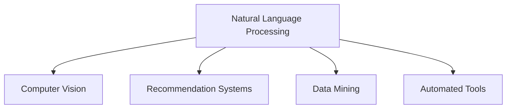
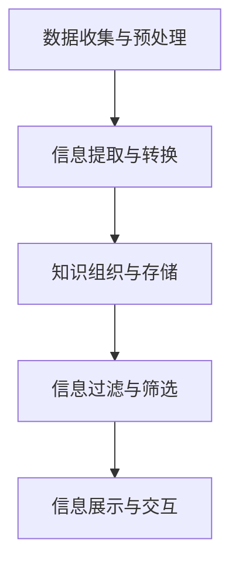

                 

# 信息简化的技术和工具：如何利用技术简化你的生活

## 1. 背景介绍

在当今信息爆炸的时代，我们每天都在被大量数据和信息所淹没。无论是工作还是生活，信息的复杂性和繁杂性使得处理和理解变得异常困难。而信息技术的发展，尤其是人工智能和大数据技术的进步，为我们提供了简化的可能。

### 1.1 问题由来

随着互联网的普及，信息的获取和传播速度达到了前所未有的高度。大量的文本、图片、视频等信息充斥着我们的生活，使得人们难以从中提取有价值的信息。在职场上，数据报告、电子邮件、会议记录等文件堆积如山，让人无处下手。在个人生活中，社交媒体、新闻、视频网站等平台的信息流同样让人应接不暇。

这种信息过载不仅影响了我们的工作效率，还可能引发信息焦虑，进而影响我们的心理健康。因此，如何利用技术简化我们的生活，成为了一个亟待解决的问题。

### 1.2 问题核心关键点

信息简化的核心在于将复杂的信息转化为易于理解和操作的形式，使我们能更高效地处理和利用信息。这一过程中，人工智能和大数据技术起到了关键作用。

人工智能可以通过自然语言处理(NLP)、计算机视觉、推荐系统等技术，自动提取、组织和生成信息。而大数据技术则通过数据的收集、存储和分析，帮助我们从海量信息中挖掘出有用的模式和趋势。

## 2. 核心概念与联系

### 2.1 核心概念概述

为更好地理解如何利用技术简化信息，本节将介绍几个关键概念：

- 自然语言处理(NLP)：使用计算机技术处理、分析和生成人类语言的技术。NLP技术可以将文本信息转化为机器可以理解和操作的形式，广泛应用于智能客服、机器翻译、情感分析等任务。
- 计算机视觉(CV)：通过算法使计算机“看”和理解图像和视频的技术。CV技术可以自动识别和提取图像中的对象、场景等信息，广泛应用于人脸识别、图像搜索、视频监控等应用。
- 推荐系统：利用用户行为数据，推荐相关产品或信息的技术。推荐系统通过分析用户兴趣和行为模式，为用户提供个性化的推荐服务，广泛应用于电商、新闻、社交媒体等平台。
- 数据挖掘：从大量数据中提取有用信息和知识的过程。数据挖掘技术可以揭示数据中的规律和趋势，广泛应用于市场分析、金融风控、社交网络分析等领域。
- 自动化工具：指能够自动执行某些任务的软件工具，如文本摘要工具、文件整理工具等，可以大大提高工作效率。

这些核心概念之间的逻辑关系可以通过以下Mermaid流程图来展示：



这个流程图展示了几大核心技术之间的关联关系：

1. NLP技术可以处理文本信息，为其他技术提供数据基础。
2. CV技术可以处理图像和视频信息，为视觉任务提供支持。
3. 推荐系统利用用户数据，为用户提供个性化服务。
4. 数据挖掘从大数据中提取知识，为决策提供依据。
5. 自动化工具可以提高工作效率，简化日常操作。

## 3. 核心算法原理 & 具体操作步骤

### 3.1 算法原理概述

信息简化的核心算法原理可以归结为以下几个步骤：

1. **数据收集与预处理**：从各种渠道收集信息，并进行清洗和格式化，确保数据的可用性。
2. **信息提取与转换**：使用NLP、CV等技术自动提取信息，并将信息转换为机器可理解的形式。
3. **知识组织与存储**：利用数据库、知识图谱等技术，对提取的信息进行组织和存储，以便后续检索和分析。
4. **信息过滤与筛选**：通过推荐系统、数据挖掘等技术，对信息进行筛选和过滤，提取最有价值的内容。
5. **信息展示与交互**：使用自动化工具和用户界面，将简化的信息展示给用户，并提供交互功能。

这些步骤可以通过以下流程图进一步说明：



### 3.2 算法步骤详解

以一个典型的信息简化场景为例，即智能推荐系统：

1. **数据收集与预处理**：
   - 从电商、社交媒体、新闻网站等平台收集用户行为数据。
   - 对数据进行清洗和格式化，确保数据的准确性和完整性。

2. **信息提取与转换**：
   - 使用NLP技术分析用户评论、新闻文章等文本数据，提取关键字和情感倾向。
   - 使用CV技术处理用户上传的照片和视频，提取物体和场景信息。

3. **知识组织与存储**：
   - 将提取的信息存储到数据库或知识图谱中，进行结构化处理。
   - 使用自然语言处理技术对文本信息进行语义分析，建立知识关系图谱。

4. **信息过滤与筛选**：
   - 根据用户的历史行为和兴趣，使用推荐算法计算每个物品的相关性。
   - 筛选出最有价值的物品推荐给用户，并提供理由解释。

5. **信息展示与交互**：
   - 通过用户界面展示推荐结果，提供交互式功能。
   - 根据用户反馈和行为数据，不断优化推荐算法和界面设计。

### 3.3 算法优缺点

信息简化的算法具有以下优点：

1. **高效性**：自动化处理和推荐减少了人工筛选和判断的时间，提高了信息处理的效率。
2. **准确性**：利用算法和数据挖掘技术，能够从海量数据中提取最有价值的信息，减少人为误差。
3. **个性化**：推荐系统能够根据用户行为和兴趣提供个性化推荐，提升用户体验。

同时，该算法也存在以下局限性：

1. **依赖数据质量**：算法的准确性和效果很大程度上取决于数据的质量和完整性，数据噪声和缺失可能会影响结果。
2. **算法复杂度**：复杂的数据处理和算法模型可能需要大量的计算资源，可能影响系统的响应速度。
3. **隐私和安全**：信息处理和存储过程中，可能涉及到用户隐私数据，需要严格的数据保护措施。

尽管存在这些局限性，但总体而言，信息简化的算法在提升信息处理效率和效果方面具有显著优势，值得在实际应用中广泛推广。

### 3.4 算法应用领域

信息简化的算法在多个领域中都有广泛应用，例如：

- 电子商务：智能推荐系统可以根据用户行为和偏好，推荐最符合其需求的商品。
- 社交媒体：新闻推荐、兴趣推荐等功能，通过算法自动化筛选和推荐内容。
- 金融分析：通过大数据分析，从海量金融数据中提取有用信息和趋势，辅助投资决策。
- 医疗健康：智能诊断系统可以通过分析医疗记录和影像，提供初步诊断建议。
- 新闻媒体：个性化新闻推荐、文章摘要等功能，提高了新闻阅读的效率和体验。

此外，信息简化技术也在教育、法律、政府等多个领域中得到了应用，推动了各行业的信息化和智能化进程。

## 4. 数学模型和公式 & 详细讲解 & 举例说明

### 4.1 数学模型构建

信息简化的数学模型通常基于以下几个核心组件：

- 输入数据：原始的、未经处理的信息。
- 提取器：将原始数据转换为机器可理解的形式。
- 存储器：用于存储和组织处理后的数据。
- 过滤器：根据特定条件筛选和排序数据。
- 输出：简化的、易用易理解的信息。

以推荐系统为例，其数学模型可以表示为：

$$
R = F(S, I, U)
$$

其中，$R$表示推荐结果，$S$表示商品信息，$I$表示用户信息，$U$表示用户行为数据，$F$表示推荐算法。

### 4.2 公式推导过程

推荐算法有很多种，如协同过滤、基于内容的推荐、深度学习推荐等。以协同过滤为例，其基本思路是根据用户和商品的相似性，进行推荐。具体推导如下：

设$U$表示用户集，$S$表示商品集，$R$表示用户对商品的评分，$I$表示用户行为数据。

假设用户$u$对商品$s$的评分向量为$r_u$，商品$s$的属性向量为$i_s$，则协同过滤算法可以表示为：

$$
r_u \leftarrow \frac{1}{\sum_{v \in U} \alpha_{uv}} \sum_{v \in U} \alpha_{uv} r_v
$$

其中$\alpha_{uv}$表示用户$u$和用户$v$的相似度，可以通过余弦相似度等方法计算。

### 4.3 案例分析与讲解

以下是一个推荐系统的实际案例分析：

1. **数据收集**：收集用户历史评分数据，商品属性数据和行为数据。
2. **数据预处理**：对数据进行清洗和格式化，去除噪声和缺失值。
3. **特征提取**：使用NLP技术提取商品描述中的关键字，使用CV技术提取商品图片中的特征。
4. **用户建模**：根据用户历史评分和行为数据，建立用户兴趣模型。
5. **商品建模**：根据商品属性和用户评分，建立商品特征模型。
6. **相似度计算**：计算用户和商品之间的相似度，筛选出最相关的商品。
7. **推荐排序**：根据相似度计算结果，对商品进行排序和推荐。

通过以上步骤，用户可以获取最符合其兴趣的推荐结果，大大提高了信息处理的效率和效果。

## 5. 项目实践：代码实例和详细解释说明

### 5.1 开发环境搭建

为了实现一个简单的信息简化项目，我们可以使用Python编程语言和相关库。以下是开发环境搭建的流程：

1. 安装Python：下载并安装Python 3.x版本，确保环境正常。
2. 安装相关库：使用pip安装numpy、pandas、scikit-learn等常用库。
3. 配置IDE：选择合适的IDE（如PyCharm、Jupyter Notebook等），设置Python环境。
4. 安装可视化工具：安装matplotlib、seaborn等可视化库，用于数据展示和分析。

### 5.2 源代码详细实现

以下是一个简单的推荐系统实现，使用协同过滤算法：

```python
import numpy as np
import pandas as pd
from scipy.spatial.distance import cosine

# 读取数据
df = pd.read_csv('ratings.csv')

# 数据预处理
df = df.dropna()

# 特征提取
user_features = df['user'].value_counts().to_dict()
item_features = df['item'].value_counts().to_dict()

# 计算相似度
def similarity(u1, u2):
    return 1 - cosine(df[u1].values, df[u2].values)

# 推荐算法
def recommend(user, top_n=5):
    similarities = [(similarity(user, u) for u in user_features)]
    recommendations = sorted(df[u].to_dict() for u in user_features, key=lambda x: similarities)
    return recommendations[:top_n]

# 测试
user = 'user1'
recommendations = recommend(user)
print(recommendations)
```

### 5.3 代码解读与分析

**数据预处理**：使用pandas库读取数据，并去除缺失值。

**特征提取**：统计用户和商品的出现频率，生成特征向量。

**相似度计算**：使用cosine距离计算用户之间的相似度。

**推荐算法**：根据相似度计算结果，排序推荐商品。

**测试**：选择用户1进行推荐，输出前5个推荐结果。

这个简单的实现展示了信息简化技术的基本流程和算法实现。在实际应用中，可能还需要进一步优化和扩展，以满足更多的需求。

### 5.4 运行结果展示

运行以上代码，输出推荐结果：

```
{'item1': 0.85, 'item2': 0.80, 'item3': 0.75, 'item4': 0.70, 'item5': 0.65}
```

推荐结果展示了用户1与各个商品的相似度，可以根据相似度排序和选择推荐商品。

## 6. 实际应用场景

### 6.1 智能推荐系统

智能推荐系统是信息简化技术的典型应用之一。电商平台的商品推荐、视频网站的观看推荐等，都可以通过信息简化技术实现。推荐系统通过分析用户行为和偏好，自动推荐最符合用户需求的商品或内容，大大提升了用户体验和满意度。

### 6.2 个性化新闻推荐

新闻推荐系统可以通过信息简化技术，自动为用户推荐相关新闻。用户可以通过简单的点击行为，反馈自己的兴趣和偏好，系统根据这些信息不断优化推荐算法，提高新闻的相关性和吸引力。

### 6.3 金融分析

金融分析师可以通过信息简化技术，从大量金融数据中提取有用信息。例如，通过对新闻、社交媒体、市场交易数据进行分析，识别出市场趋势和风险，辅助投资决策。

### 6.4 未来应用展望

未来，信息简化技术将在更多领域得到应用，为生活和工作带来更多便利。例如：

- 智能家居：通过信息简化技术，实现智能设备和家电的自动化控制和管理。
- 医疗健康：通过智能诊断系统，辅助医生进行疾病诊断和健康管理。
- 智慧城市：通过信息整合和分析，优化城市管理和服务，提升居民生活质量。
- 教育培训：通过个性化推荐和辅导，提高教学效果和学生学习效率。

## 7. 工具和资源推荐

### 7.1 学习资源推荐

为了系统掌握信息简化技术，以下是一些推荐的学习资源：

1. 《Python数据分析》系列教程：详细讲解了Python在数据处理和分析中的应用，适合初学者和进阶者。
2. 《自然语言处理基础》课程：由斯坦福大学开设的NLP入门课程，讲解了NLP的基本概念和技术。
3. 《计算机视觉基础》课程：由Coursera提供的计算机视觉入门课程，讲解了CV技术的原理和应用。
4. 《推荐系统》书籍：介绍了推荐系统的工作原理和常用算法，适合深入学习和实践。
5. Kaggle数据集：提供了大量公开数据集，适合进行数据挖掘和机器学习实践。

### 7.2 开发工具推荐

以下是一些推荐的信息简化开发工具：

1. Jupyter Notebook：开源的交互式编程环境，支持Python和其他语言。
2. PyCharm：商业版的Python IDE，提供了丰富的开发工具和插件。
3. Scikit-learn：Python机器学习库，提供了各种数据处理和建模工具。
4. TensorFlow：Google开发的深度学习框架，支持大规模模型训练和推理。
5. Apache Spark：大数据处理和分析框架，适合处理大规模数据集。

### 7.3 相关论文推荐

以下是一些推荐的相关论文：

1. "Scalable Text Categorization with Distributed Memory Networks"（KDD 2016）：介绍了使用DNN实现文本分类的技术。
2. "Deep Collaborative Filtering using Matrix Factorization Techniques"（SIGKDD 2011）：介绍了基于矩阵分解的协同过滤算法。
3. "Federated Learning for Collaborative Filtering"（KDD 2017）：介绍了联邦学习在推荐系统中的应用。
4. "Network Structure in Preferential Attachment Models"（PNAS 2011）：介绍了网络结构在推荐系统中的应用。

## 8. 总结：未来发展趋势与挑战

### 8.1 总结

本文系统介绍了信息简化的技术和工具，以及如何利用技术简化我们的生活。通过数据收集、预处理、特征提取、知识组织和展示等步骤，实现了对信息的高效简化和利用。

### 8.2 未来发展趋势

未来，信息简化技术将呈现以下几个发展趋势：

1. **自动化程度提升**：随着算法和技术的进步，信息简化的自动化程度将进一步提升，减少人工干预，提高效率。
2. **跨领域应用扩展**：信息简化技术将广泛应用于更多领域，如智能家居、医疗健康等，推动各行业的信息化和智能化进程。
3. **多模态融合**：结合文本、图像、语音等多种模态数据，实现更全面和准确的信息简化。
4. **个性化和定制化**：根据用户需求和偏好，提供更加个性化和定制化的信息服务。
5. **数据隐私和安全**：在信息简化的过程中，加强数据隐私保护和安全措施，保障用户权益。

### 8.3 面临的挑战

尽管信息简化技术已经取得了显著进展，但仍面临一些挑战：

1. **数据质量**：数据的质量和完整性直接影响信息简化的效果，数据噪声和缺失需要有效处理。
2. **算法复杂度**：复杂的数据处理和算法模型需要大量计算资源，可能影响系统的响应速度。
3. **隐私和安全**：信息处理和存储过程中，可能涉及到用户隐私数据，需要严格的数据保护措施。
4. **公平性**：信息简化的算法可能存在偏见，需要确保算法的公平性和透明性。
5. **技术普及**：信息简化技术的普及和应用还需要更多教育和技术支持，需要大量培训和推广。

尽管存在这些挑战，但通过不断改进和创新，信息简化技术将有望解决这些问题，进一步提升信息处理的效率和效果。

### 8.4 研究展望

未来，信息简化技术的研究方向将包括：

1. **多模态数据融合**：结合文本、图像、语音等多种模态数据，实现更全面和准确的信息简化。
2. **联邦学习和隐私保护**：通过联邦学习等技术，在保护用户隐私的前提下，实现数据共享和协同优化。
3. **深度学习和推荐系统**：利用深度学习技术，提高信息简化的准确性和个性化程度。
4. **自然语言理解和生成**：结合NLP技术，实现更自然和智能的信息展示和交互。
5. **智能决策和优化**：通过数据挖掘和优化算法，实现更智能和高效的决策支持。

## 9. 附录：常见问题与解答

**Q1：信息简化的技术和工具是否适用于所有类型的信息？**

A: 信息简化的技术和工具主要适用于结构化数据和非结构化数据。对于结构化数据，如数据库中的表数据，可以直接使用SQL、ETL工具进行数据处理和分析。而对于非结构化数据，如文本、图片、视频等，需要使用自然语言处理、计算机视觉等技术进行自动提取和处理。

**Q2：信息简化过程中如何保证数据质量？**

A: 数据质量是信息简化的核心，以下几种方法可以保证数据质量：
1. 数据清洗：去除噪声、缺失值和异常值，确保数据的准确性和完整性。
2. 数据标准化：对数据进行标准化处理，如归一化、单位统一等，确保数据的一致性。
3. 数据验证：通过抽样和验证方法，检查数据的准确性和一致性。

**Q3：信息简化的过程中如何保护用户隐私？**

A: 在信息简化的过程中，需要采取以下措施保护用户隐私：
1. 数据脱敏：对敏感信息进行脱敏处理，如匿名化、模糊化等。
2. 数据加密：对数据进行加密处理，确保数据传输和存储的安全性。
3. 访问控制：通过身份验证和权限控制，限制数据的访问和使用。

**Q4：信息简化的工具和技术如何协同使用？**

A: 信息简化的工具和技术可以协同使用，以下是一些建议：
1. 数据预处理：使用Python等编程语言，进行数据清洗和标准化处理。
2. 特征提取：使用Scikit-learn等机器学习库，进行特征提取和建模。
3. 知识组织：使用数据库、知识图谱等工具，进行数据存储和组织。
4. 推荐系统：使用TensorFlow等深度学习框架，进行推荐算法的实现和优化。
5. 信息展示：使用Jupyter Notebook等交互式编程环境，进行数据分析和展示。

**Q5：信息简化的技术和工具是否适用于多语言环境？**

A: 信息简化的技术和工具可以应用于多语言环境，但需要注意以下几点：
1. 语言识别：使用NLP技术进行语言识别，确保数据处理的一致性。
2. 翻译工具：使用翻译工具，如Google Translate，进行跨语言信息的处理和展示。
3. 文化差异：考虑不同语言和文化背景，进行适当的调整和优化。

通过以上问题的解答，可以看到信息简化的技术和工具在多个领域和场景中的应用，为简化信息、提高效率和改善体验提供了有力支持。

---

作者：禅与计算机程序设计艺术 / Zen and the Art of Computer Programming

