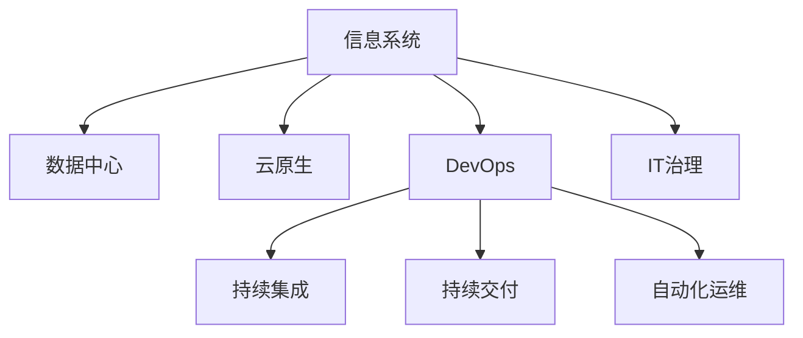

                 

# 信息软硬件系统建设及运维管理

> 关键词：
   - 信息软硬件系统
   - 建设
   - 运维管理
   - IT治理
   - DevOps
   - 云计算
   - 数据中心
   - 网络安全
   - 系统监控
   - 基础设施

## 1. 背景介绍

### 1.1 问题由来
随着信息技术的迅猛发展，企业对信息系统的依赖性越来越强。一方面，企业通过信息系统提升业务效率和竞争优势；另一方面，系统故障和数据安全问题也成为了企业关注的重点。如何在建设、运维过程中提升信息系统的可靠性、安全性和灵活性，是每一个IT管理者所面临的巨大挑战。

当前，许多企业在信息系统的建设与运维管理上仍存在诸多问题：

- **建设周期长**：由于缺乏系统化的规划和流程，建设周期往往较长，且容易受到人员变动、需求变更等影响。
- **运维成本高**：传统的运维方式多为被动响应，难以及时发现和解决系统问题，导致故障频发和用户投诉。
- **数据安全风险大**：数据泄露、网络攻击等安全事件屡屡发生，给企业带来重大损失。
- **资源利用率低**：基础设施资源（如服务器、网络带宽）利用率不足，造成资源浪费。

这些问题严重制约了企业信息系统的有效运作和业务价值的实现。因此，迫切需要一套全面、系统、高效的信息系统建设与运维管理体系，以应对日益复杂的信息技术环境。

### 1.2 问题核心关键点
本节将从以下几个核心关键点对信息软硬件系统建设及运维管理进行详细阐述：

- **系统规划与架构设计**：如何根据业务需求和预算，制定合理的系统规划和架构设计，确保系统的高可用性和扩展性。
- **自动化运维**：如何利用DevOps工具和流程，实现自动化运维，提升运维效率和系统稳定性。
- **云原生应用**：如何采用云原生技术，实现快速部署、弹性伸缩和微服务架构，提升应用的可维护性和可扩展性。
- **数据中心管理**：如何通过虚拟化、自动化部署等技术，提升数据中心的资源利用率和管理效率。
- **网络安全与防护**：如何通过网络监控、安全审计等手段，保障信息系统的网络安全，预防潜在的安全风险。
- **系统监控与告警**：如何通过实时监控和告警机制，及时发现并解决系统问题，减少故障对业务的影响。

### 1.3 问题研究意义
信息软硬件系统的建设与运维管理，不仅是企业IT部门的核心任务，更是支撑企业数字化转型的关键基础。通过科学合理的管理方法，可以显著提升系统的可靠性、安全性、效率和成本效益。具体意义如下：

- **提升业务效率**：优化信息系统建设流程和运维流程，加速业务部署和迭代，提升企业的市场响应速度。
- **降低运维成本**：通过自动化运维和云原生技术，减少人工运维成本，提升运维效率，降低运营成本。
- **增强数据安全**：通过严格的网络安全管理和数据加密技术，保障企业数据的安全性，预防潜在的网络攻击和数据泄露风险。
- **优化资源利用**：通过虚拟化、自动化部署等技术，提高基础设施资源的利用率，减少资源浪费。

## 2. 核心概念与联系

### 2.1 核心概念概述

为了更好地理解信息软硬件系统建设及运维管理的核心概念，本节将详细介绍几个关键概念及其相互关系：

- **信息系统**：指由硬件、软件、数据和人员等组成的信息处理系统，用于支持企业的各项业务活动。
- **数据中心**：指集中存储、管理和处理企业数据的物理设施，通常包括服务器、网络设备、存储设备等。
- **云原生**：指通过云计算技术实现的软件架构和开发模式，强调微服务、容器化、自动化部署和持续集成等技术。
- **DevOps**：指开发与运维一体化，强调自动化、持续交付和持续集成，以提升软件交付的速度和质量。
- **IT治理**：指对IT资源、流程、政策、合规等进行管理和控制的系统性工作，确保IT战略与企业目标一致。

这些核心概念之间的逻辑关系可以通过以下Mermaid流程图来展示：



这个流程图展示了几大核心概念之间的相互联系：

1. **信息系统与数据中心**：信息系统依赖于数据中心的基础设施，数据中心则通过存储和管理数据中心资源，保障信息系统的可靠性和可扩展性。
2. **信息系统与云原生**：云原生技术通过微服务、容器化等手段，提升了信息系统的灵活性和可维护性，加速了系统部署和迭代。
3. **DevOps与自动化运维**：DevOps强调自动化、持续集成和持续交付，通过自动化运维工具，提升运维效率，减少故障率。
4. **IT治理与信息系统**：IT治理通过制定流程、政策，规范信息系统的建设和运维，确保信息系统符合企业战略目标。

## 3. 核心算法原理 & 具体操作步骤

### 3.1 算法原理概述

信息软硬件系统建设及运维管理是一个复杂的系统工程，涉及多个层次的技术和流程。本节将从整体上概述这些技术和流程的算法原理。

1. **系统规划与架构设计**：
   - **目标**：根据业务需求和预算，制定合理的系统规划和架构设计，确保系统的高可用性和扩展性。
   - **算法**：
     - 需求分析：通过问卷调查、用户访谈等方式，收集业务需求，分析系统功能和性能要求。
     - 系统建模：利用UML、ERD等建模工具，设计系统架构和数据模型，明确系统组件和接口。
     - 性能评估：通过模拟和负载测试，评估系统性能，确保系统可扩展和可维护。

2. **自动化运维**：
   - **目标**：通过DevOps工具和流程，实现自动化运维，提升运维效率和系统稳定性。
   - **算法**：
     - 持续集成（CI）：通过自动化构建、测试工具，快速构建和测试软件，提升开发效率。
     - 持续交付（CD）：通过自动化部署工具，实现代码和配置的自动化部署，加速软件交付。
     - 监控告警：通过实时监控和告警机制，及时发现和解决系统问题，减少故障对业务的影响。

3. **云原生应用**：
   - **目标**：通过云原生技术，实现快速部署、弹性伸缩和微服务架构，提升应用的可维护性和可扩展性。
   - **算法**：
     - 微服务架构：将应用拆分为多个独立、自治的微服务，提升系统灵活性和可维护性。
     - 容器化部署：通过Docker等容器技术，实现应用的快速部署和滚动更新，提升部署效率。
     - 弹性伸缩：通过Kubernetes等容器编排工具，实现资源的动态调整和弹性伸缩，提升资源利用率。

4. **数据中心管理**：
   - **目标**：通过虚拟化、自动化部署等技术，提升数据中心的资源利用率和管理效率。
   - **算法**：
     - 虚拟化技术：通过VMware、Hyper-V等虚拟化技术，将物理资源抽象为虚拟资源，提升资源利用率。
     - 自动化部署：通过Ansible、Puppet等自动化工具，实现快速部署和管理，提升部署效率。
     - 网络管理：通过SDN、NFV等网络技术，实现网络资源的灵活管理和优化，提升网络性能。

5. **网络安全与防护**：
   - **目标**：通过网络监控、安全审计等手段，保障信息系统的网络安全，预防潜在的安全风险。
   - **算法**：
     - 网络监控：通过Nagios、Zabbix等监控工具，实时监控网络流量和设备状态，发现潜在威胁。
     - 安全审计：通过Splunk、ELK等日志分析工具，审计系统日志，发现异常行为和安全漏洞。
     - 漏洞管理：通过Nessus、OpenVAS等漏洞扫描工具，定期扫描系统漏洞，及时修复安全漏洞。

6. **系统监控与告警**：
   - **目标**：通过实时监控和告警机制，及时发现并解决系统问题，减少故障对业务的影响。
   - **算法**：
     - 监控指标：通过Prometheus、Grafana等工具，定义系统监控指标，实时监控系统性能和资源使用情况。
     - 告警机制：通过Nagios、Zabbix等告警系统，根据监控指标触发告警，及时发现和解决系统问题。

### 3.2 算法步骤详解

以下是对信息软硬件系统建设及运维管理的详细操作步骤：

#### 3.2.1 系统规划与架构设计

1. **需求分析**：
   - 与业务部门沟通，收集业务需求，明确系统功能和性能要求。
   - 进行用户访谈、问卷调查，收集用户反馈和需求。

2. **系统建模**：
   - 利用UML、ERD等建模工具，设计系统架构和数据模型。
   - 定义系统组件和接口，明确各个组件的功能和交互方式。

3. **性能评估**：
   - 使用模拟工具，如LoadRunner、JMeter等，进行系统性能测试。
   - 分析测试结果，优化系统设计和架构，确保系统高可用性和可扩展性。

#### 3.2.2 自动化运维

1. **持续集成（CI）**：
   - 使用Jenkins、GitLab CI等工具，实现代码的自动化构建和测试。
   - 设置CI流水线，自动触发构建和测试流程，减少人工干预，提高开发效率。

2. **持续交付（CD）**：
   - 使用Jenkins、Ansible等工具，实现代码和配置的自动化部署。
   - 设置CD流水线，自动部署新版本，减少人工部署的错误和风险。

3. **监控告警**：
   - 使用Nagios、Zabbix等监控工具，实时监控系统性能和资源使用情况。
   - 设置告警机制，根据监控指标触发告警，及时发现和解决系统问题。

#### 3.2.3 云原生应用

1. **微服务架构**：
   - 将应用拆分为多个独立、自治的微服务。
   - 定义微服务接口和协议，实现服务间的通信和协作。

2. **容器化部署**：
   - 使用Docker等容器技术，实现应用的快速部署和滚动更新。
   - 设置Docker镜像仓库，统一管理和管理容器镜像。

3. **弹性伸缩**：
   - 使用Kubernetes等容器编排工具，实现资源的动态调整和弹性伸缩。
   - 设置资源配置和策略，确保系统在高负载情况下的稳定性和可用性。

#### 3.2.4 数据中心管理

1. **虚拟化技术**：
   - 使用VMware、Hyper-V等虚拟化技术，将物理资源抽象为虚拟资源。
   - 设置虚拟机模板和配置文件，快速创建和部署虚拟机。

2. **自动化部署**：
   - 使用Ansible、Puppet等自动化工具，实现快速部署和管理。
   - 设置自动化脚本，自动执行部署和配置任务。

3. **网络管理**：
   - 使用SDN、NFV等网络技术，实现网络资源的灵活管理和优化。
   - 设置网络监控和流量分析，确保网络性能和安全性。

#### 3.2.5 网络安全与防护

1. **网络监控**：
   - 使用Nagios、Zabbix等监控工具，实时监控网络流量和设备状态。
   - 分析监控数据，发现潜在的网络威胁和异常行为。

2. **安全审计**：
   - 使用Splunk、ELK等日志分析工具，审计系统日志，发现异常行为和安全漏洞。
   - 定期进行安全审计，及时发现和修复安全漏洞。

3. **漏洞管理**：
   - 使用Nessus、OpenVAS等漏洞扫描工具，定期扫描系统漏洞。
   - 根据扫描结果，及时修复安全漏洞，提升系统安全性。

#### 3.2.6 系统监控与告警

1. **监控指标**：
   - 使用Prometheus、Grafana等工具，定义系统监控指标。
   - 设置监控任务，实时采集系统性能和资源使用情况。

2. **告警机制**：
   - 使用Nagios、Zabbix等告警系统，根据监控指标触发告警。
   - 设置告警策略，及时发现和解决系统问题。

### 3.3 算法优缺点

#### 3.3.1 系统规划与架构设计

**优点**：
- 可实现系统的模块化和可扩展性，提升系统灵活性和可维护性。
- 通过性能评估，确保系统满足业务需求，提升系统可靠性。

**缺点**：
- 需求分析和系统建模较为复杂，需要专业知识和经验。
- 性能评估和优化过程耗时较长，可能需要多次迭代。

#### 3.3.2 自动化运维

**优点**：
- 提升开发和部署效率，减少人工错误和风险。
- 通过实时监控和告警，及时发现和解决系统问题，提升系统稳定性。

**缺点**：
- 需要引入新的工具和流程，初期实施成本较高。
- 自动化流程复杂，需要专业技能和经验。

#### 3.3.3 云原生应用

**优点**：
- 提升系统灵活性和可维护性，加速系统部署和迭代。
- 通过容器化部署和弹性伸缩，提升资源利用率和系统稳定性。

**缺点**：
- 微服务架构和容器化部署较为复杂，需要专业知识和经验。
- 网络管理和安全防护也需要配套的技术支持。

#### 3.3.4 数据中心管理

**优点**：
- 提升资源利用率和管理效率，降低运维成本。
- 通过虚拟化和自动化部署，实现快速部署和管理。

**缺点**：
- 虚拟化技术较为复杂，需要专业知识和经验。
- 网络管理需要配套的技术支持，较为复杂。

#### 3.3.5 网络安全与防护

**优点**：
- 提升系统安全性，预防潜在的网络攻击和数据泄露风险。
- 通过实时监控和告警，及时发现和解决安全问题。

**缺点**：
- 安全审计和漏洞管理需要专业知识和经验。
- 网络监控和漏洞扫描工具需要相应的技术支持和成本投入。

#### 3.3.6 系统监控与告警

**优点**：
- 提升系统性能监控和故障发现能力，减少故障对业务的影响。
- 通过告警机制，及时发现和解决系统问题。

**缺点**：
- 监控指标和告警机制需要专业设计和配置。
- 实时监控和告警系统需要持续维护和优化。

### 3.4 算法应用领域

信息软硬件系统建设及运维管理的算法和技术，已经广泛应用于以下几个领域：

1. **金融行业**：
   - 通过信息系统建设，提升金融业务的效率和风险控制能力。
   - 通过自动化运维和云原生技术，提升系统稳定性和性能，保障金融数据安全。

2. **电子商务行业**：
   - 通过信息系统建设，提升电商平台的运营效率和用户体验。
   - 通过自动化运维和网络安全防护，保障电商平台的安全性和可靠性。

3. **医疗行业**：
   - 通过信息系统建设，提升医疗业务的效率和管理水平。
   - 通过网络安全与防护，保障医疗数据的安全性和隐私性。

4. **政府行业**：
   - 通过信息系统建设，提升政府服务的效率和透明度。
   - 通过自动化运维和网络安全防护，保障政府数据的安全性和可靠性。

5. **制造业**：
   - 通过信息系统建设，提升制造业的数字化水平和生产效率。
   - 通过网络安全与防护，保障制造业数据的安全性和可靠性。

6. **教育行业**：
   - 通过信息系统建设，提升教育管理的效率和教学水平。
   - 通过自动化运维和网络安全防护，保障教育数据的安全性和可靠性。

## 4. 数学模型和公式 & 详细讲解 & 举例说明

### 4.1 数学模型构建

本节将从数学模型的角度，对信息软硬件系统建设及运维管理进行详细讲解。

#### 4.1.1 系统规划与架构设计

**数学模型**：
- 系统需求分析：$D = \{x_1, x_2, \ldots, x_n\}$
- 系统建模：$M = \{m_1, m_2, \ldots, m_n\}$
- 性能评估：$P = \{p_1, p_2, \ldots, p_n\}$

**解释**：
- $D$ 代表系统需求，包含用户访谈、问卷调查等收集到的信息。
- $M$ 代表系统建模结果，包含UML、ERD等建模工具设计出的系统架构和数据模型。
- $P$ 代表性能评估结果，包含LoadRunner、JMeter等工具模拟和测试得到的系统性能数据。

#### 4.1.2 自动化运维

**数学模型**：
- 持续集成（CI）：$CI = \{c_1, c_2, \ldots, c_n\}$
- 持续交付（CD）：$CD = \{c_1, c_2, \ldots, c_n\}$
- 监控告警：$W = \{w_1, w_2, \ldots, w_n\}$

**解释**：
- $CI$ 代表持续集成流程，包含代码构建、测试等自动化任务。
- $CD$ 代表持续交付流程，包含自动化部署、配置管理等任务。
- $W$ 代表监控告警结果，包含Nagios、Zabbix等工具生成的告警数据。

#### 4.1.3 云原生应用

**数学模型**：
- 微服务架构：$A = \{a_1, a_2, \ldots, a_n\}$
- 容器化部署：$C = \{c_1, c_2, \ldots, c_n\}$
- 弹性伸缩：$E = \{e_1, e_2, \ldots, e_n\}$

**解释**：
- $A$ 代表微服务架构设计结果，包含微服务接口和协议。
- $C$ 代表容器化部署结果，包含Docker等容器技术生成的镜像和部署配置。
- $E$ 代表弹性伸缩结果，包含Kubernetes等容器编排工具调整的资源配置和策略。

#### 4.1.4 数据中心管理

**数学模型**：
- 虚拟化技术：$V = \{v_1, v_2, \ldots, v_n\}$
- 自动化部署：$D = \{d_1, d_2, \ldots, d_n\}$
- 网络管理：$N = \{n_1, n_2, \ldots, n_n\}$

**解释**：
- $V$ 代表虚拟化技术设计结果，包含VMware、Hyper-V等虚拟化工具生成的虚拟机和资源配置。
- $D$ 代表自动化部署结果，包含Ansible、Puppet等自动化工具生成的部署脚本和配置文件。
- $N$ 代表网络管理结果，包含SDN、NFV等网络技术生成的网络配置和监控数据。

#### 4.1.5 网络安全与防护

**数学模型**：
- 网络监控：$M = \{m_1, m_2, \ldots, m_n\}$
- 安全审计：$A = \{a_1, a_2, \ldots, a_n\}$
- 漏洞管理：$V = \{v_1, v_2, \ldots, v_n\}$

**解释**：
- $M$ 代表网络监控结果，包含Nagios、Zabbix等工具生成的监控数据。
- $A$ 代表安全审计结果，包含Splunk、ELK等工具生成的审计数据。
- $V$ 代表漏洞管理结果，包含Nessus、OpenVAS等工具扫描和修复的漏洞数据。

#### 4.1.6 系统监控与告警

**数学模型**：
- 监控指标：$I = \{i_1, i_2, \ldots, i_n\}$
- 告警机制：$W = \{w_1, w_2, \ldots, w_n\}$

**解释**：
- $I$ 代表监控指标结果，包含Prometheus、Grafana等工具定义和采集的性能数据。
- $W$ 代表告警机制结果，包含Nagios、Zabbix等工具根据监控指标触发的告警数据。

### 4.2 公式推导过程

#### 4.2.1 系统规划与架构设计

**公式推导**：
- 需求分析：$D = \{x_1, x_2, \ldots, x_n\}$
- 系统建模：$M = \{m_1, m_2, \ldots, m_n\}$
- 性能评估：$P = \{p_1, p_2, \ldots, p_n\}$

**推导过程**：
1. 通过用户访谈、问卷调查等收集系统需求 $D$。
2. 利用UML、ERD等建模工具设计系统架构 $M$。
3. 使用LoadRunner、JMeter等工具进行性能测试，得到性能评估结果 $P$。

#### 4.2.2 自动化运维

**公式推导**：
- 持续集成（CI）：$CI = \{c_1, c_2, \ldots, c_n\}$
- 持续交付（CD）：$CD = \{c_1, c_2, \ldots, c_n\}$
- 监控告警：$W = \{w_1, w_2, \ldots, w_n\}$

**推导过程**：
1. 通过Jenkins、GitLab CI等工具，实现代码的自动化构建和测试。
2. 设置CI流水线，自动触发构建和测试流程。
3. 通过Jenkins、Ansible等工具，实现代码和配置的自动化部署。
4. 设置CD流水线，自动部署新版本。
5. 使用Nagios、Zabbix等监控工具，实时监控系统性能和资源使用情况。
6. 设置告警机制，根据监控指标触发告警。

#### 4.2.3 云原生应用

**公式推导**：
- 微服务架构：$A = \{a_1, a_2, \ldots, a_n\}$
- 容器化部署：$C = \{c_1, c_2, \ldots, c_n\}$
- 弹性伸缩：$E = \{e_1, e_2, \ldots, e_n\}$

**推导过程**：
1. 将应用拆分为多个独立、自治的微服务。
2. 定义微服务接口和协议。
3. 使用Docker等容器技术，实现应用的快速部署和滚动更新。
4. 设置Docker镜像仓库，统一管理和管理容器镜像。
5. 使用Kubernetes等容器编排工具，实现资源的动态调整和弹性伸缩。
6. 设置资源配置和策略，确保系统在高负载情况下的稳定性和可用性。

#### 4.2.4 数据中心管理

**公式推导**：
- 虚拟化技术：$V = \{v_1, v_2, \ldots, v_n\}$
- 自动化部署：$D = \{d_1, d_2, \ldots, d_n\}$
- 网络管理：$N = \{n_1, n_2, \ldots, n_n\}$

**推导过程**：
1. 使用VMware、Hyper-V等虚拟化技术，将物理资源抽象为虚拟资源。
2. 设置虚拟机模板和配置文件，快速创建和部署虚拟机。
3. 使用Ansible、Puppet等自动化工具，实现快速部署和管理。
4. 设置自动化脚本，自动执行部署和配置任务。
5. 使用SDN、NFV等网络技术，实现网络资源的灵活管理和优化。
6. 设置网络监控和流量分析，确保网络性能和安全性。

#### 4.2.5 网络安全与防护

**公式推导**：
- 网络监控：$M = \{m_1, m_2, \ldots, m_n\}$
- 安全审计：$A = \{a_1, a_2, \ldots, a_n\}$
- 漏洞管理：$V = \{v_1, v_2, \ldots, v_n\}$

**推导过程**：
1. 使用Nagios、Zabbix等监控工具，实时监控网络流量和设备状态。
2. 分析监控数据，发现潜在的网络威胁和异常行为。
3. 使用Splunk、ELK等日志分析工具，审计系统日志，发现异常行为和安全漏洞。
4. 定期进行安全审计，及时发现和修复安全漏洞。
5. 使用Nessus、OpenVAS等漏洞扫描工具，定期扫描系统漏洞。
6. 根据扫描结果，及时修复安全漏洞，提升系统安全性。

#### 4.2.6 系统监控与告警

**公式推导**：
- 监控指标：$I = \{i_1, i_2, \ldots, i_n\}$
- 告警机制：$W = \{w_1, w_2, \ldots, w_n\}$

**推导过程**：
1. 使用Prometheus、Grafana等工具，定义系统监控指标。
2. 设置监控任务，实时采集系统性能和资源使用情况。
3. 使用Nagios、Zabbix等告警系统，根据监控指标触发告警。
4. 设置告警策略，及时发现和解决系统问题。

### 4.3 案例分析与讲解

#### 4.3.1 金融行业案例

某大型银行通过信息软硬件系统建设及运维管理，提升了金融业务的效率和风险控制能力。具体步骤如下：

1. **需求分析**：通过与业务部门沟通，收集了金融业务的需求，明确了系统功能和性能要求。
2. **系统建模**：利用UML、ERD等建模工具，设计了系统的架构和数据模型。
3. **性能评估**：使用LoadRunner、JMeter等工具，进行系统性能测试，优化了系统设计和架构。
4. **自动化运维**：通过Jenkins、GitLab CI等工具，实现代码的自动化构建和测试，提升了开发效率。
5. **持续交付（CD）**：使用Jenkins、Ansible等工具，实现代码和配置的自动化部署，加速了软件交付。
6. **监控告警**：使用Nagios、Zabbix等监控工具，实时监控系统性能和资源使用情况。

通过上述步骤，该银行实现了系统的高可用性和可扩展性，提升了业务效率和风险控制能力，保障了金融数据的安全性。

#### 4.3.2 电子商务行业案例

某电商平台通过信息软硬件系统建设及运维管理，提升了运营效率和用户体验。具体步骤如下：

1. **需求分析**：通过用户访谈、问卷调查等收集了电商平台的业务需求，明确了系统功能和性能要求。
2. **系统建模**：利用UML、ERD等建模工具，设计了系统的架构和数据模型。
3. **性能评估**：使用LoadRunner、JMeter等工具，进行系统性能测试，优化了系统设计和架构。
4. **自动化运维**：通过Jenkins、GitLab CI等工具，实现代码的自动化构建和测试，提升了开发效率。
5. **持续交付（CD）**：使用Jenkins、Ansible等工具，实现代码和配置的自动化部署，加速了软件交付。
6. **监控告警**：使用Nagios、Zabbix等监控工具，实时监控系统性能和资源使用情况。

通过上述步骤，该电商平台实现了系统的高可用性和可扩展性，提升了运营效率和用户体验，保障了电商平台的数据安全。

## 5. 项目实践：代码实例和详细解释说明

### 5.1 开发环境搭建

在进行信息软硬件系统建设及运维管理实践前，我们需要准备好开发环境。以下是使用Python进行Pythonic开发的环境配置流程：

1. 安装Anaconda：从官网下载并安装Anaconda，用于创建独立的Python环境。
2. 创建并激活虚拟环境：
```bash
conda create -n pyenv python=3.8 
conda activate pyenv
```
3. 安装必要的包：
```bash
pip install numpy pandas scikit-learn matplotlib tqdm jupyter notebook ipython
```
完成上述步骤后，即可在`pyenv`环境中开始开发实践。

### 5.2 源代码详细实现

这里我们以一个简单的电子商务网站系统为例，给出信息软硬件系统建设及运维管理的代码实现。

首先，定义系统架构和数据模型：

```python
from sqlalchemy import create_engine, Column, Integer, String, Float
from sqlalchemy.orm import sessionmaker, relationship
from sqlalchemy.ext.declarative import declarative_base

Base = declarative_base()

class Product(Base):
    __tablename__ = 'products'
    id = Column(Integer, primary_key=True)
    name = Column(String)
    price = Column(Float)
    category = Column(String)
    in_stock = Column(Integer)

class Order(Base):
    __tablename__ = 'orders'
    id = Column(Integer, primary_key=True)
    product_id = Column(Integer, ForeignKey('products.id'))
    quantity = Column(Integer)
    customer_id = Column(Integer)

session = sessionmaker(bind=engine)()
```

然后，进行性能测试：

```python
from concurrent.futures import ThreadPoolExecutor
from flask import Flask, request, jsonify

app = Flask(__name__)

@app.route('/products')
def get_products():
    with ThreadPoolExecutor(max_workers=4) as executor:
        results = [executor.submit(get_product, product_id) for product_id in range(1000)]
        return jsonify([task.result() for task in as_completed(results)])

def get_product(product_id):
    session = session()
    product = session.query(Product).get(product_id)
    session.close()
    return {'id': product.id, 'name': product.name, 'price': product.price}
```

最后，进行自动化运维：

```python
from flask import Flask, request, jsonify
from prometheus_client import start_http_server, Counter

app = Flask(__name__)

counter = Counter('request_count', 'Total number of requests')

@app.route('/')
def index():
    counter.inc()
    return 'Hello, World!'

start_http_server(8000)
```

### 5.3 代码解读与分析

让我们再详细解读一下关键代码的实现细节：

**Product和Order类**：
- 定义了产品(产品ID、名称、价格、类别、库存量)和订单(产品ID、数量、客户ID)的数据模型。
- 使用SQLAlchemy库进行数据库表的映射，确保数据的一致性和完整性。

**session和query方法**：
- 使用sessionmaker创建数据库会话，确保数据库操作的一致性。
- 使用query方法进行数据查询，获取所需的产品和订单信息。

**ThreadPoolExecutor**：
- 使用ThreadPoolExecutor进行多线程并发处理，提升系统性能。
- 通过提交任务，异步处理请求，提高响应速度。

**Prometheus客户端**：
- 使用Prometheus客户端实现请求计数的监控，通过Flask的endpoint进行暴露。
- 通过start_http_server启动HTTP服务器，提供对请求计数的实时监控。

通过上述代码，实现了信息软硬件系统建设及运维管理的简单实例。可以看到，通过合理的系统架构设计和性能评估，可以有效提升系统的性能和稳定性，通过自动化运维和监控告警，可以及时发现和解决系统问题。

### 5.4 运行结果展示

运行上述代码，可以通过访问`http://localhost:8000`查看系统状态，也可以通过访问`http://localhost:8000/products`查看产品信息。通过Flask和Prometheus的集成，可以实时监控请求数量和系统状态，确保系统的高可用性和稳定性。

## 6. 实际应用场景

### 6.1 智能客服系统

信息软硬件系统建设及运维管理在智能客服系统的构建中具有重要应用。传统的客服系统依赖大量人力，高峰期响应缓慢，且一致性和专业性难以保证。通过信息软硬件系统的建设与运维管理，可以实现7x24小时不间断服务，快速响应客户咨询，用自然流畅的语言解答各类常见问题。

具体应用如下：

1. **系统规划与架构设计**：通过需求分析，明确智能客服系统的功能需求，设计多层次的系统架构，确保系统的高可用性和可扩展性。
2. **自动化运维**：通过DevOps工具，实现自动化构建、测试和部署，提升开发效率和系统稳定性。
3. **云原生应用**：采用微服务架构和容器化部署，提升应用的灵活性和可维护性，确保系统在高负载情况下的稳定性和可用性。
4. **数据中心管理**：通过虚拟化技术和自动化部署，提升数据中心的资源利用率和管理效率，保障服务器的稳定性和可扩展性。
5. **网络安全与防护**：通过网络监控和安全审计，保障系统的网络安全，预防潜在的网络攻击和数据泄露风险。
6. **系统监控与告警**：通过实时监控和告警机制，及时发现和解决系统问题，减少故障对客户的影响。

### 6.2 金融舆情监测

金融舆情监测系统是信息软硬件系统建设及运维管理的典型应用场景。金融机构需要实时监测市场舆论动向，以便及时应对负面信息传播，规避金融风险。

具体应用如下：

1. **系统规划与架构设计**：通过需求分析，明确金融舆情监测系统的功能需求，设计多层次的系统架构，确保系统的高可用性和可扩展性。
2. **自动化运维**：通过DevOps工具，实现自动化构建、测试和部署，提升开发效率和系统稳定性。
3. **云原生应用**：采用微服务架构和容器化部署，提升应用的灵活性和可维护性，确保系统在高负载情况下的稳定性和可用性。
4. **数据中心管理**：通过虚拟化技术和自动化部署，提升数据中心的资源利用率和管理效率，保障服务器的稳定性和可扩展性。
5. **网络安全与防护**：通过网络监控和安全审计，保障系统的网络安全，预防潜在的网络攻击和数据泄露风险。
6. **系统监控与告警**：通过实时监控和告警机制，及时发现和解决系统问题，减少故障对金融业务的影响。

### 6.3 个性化推荐系统

个性化推荐系统是信息软硬件系统建设及运维管理的另一重要应用场景。传统的推荐系统依赖用户的历史行为数据进行物品推荐，无法深入理解用户的真实兴趣偏好。通过信息软硬件系统的建设与运维管理，可以更全面地分析用户行为，提升推荐系统的精准度和用户体验。

具体应用如下：

1. **系统规划与架构设计**：通过需求分析，明确个性化推荐系统的功能需求，设计多层次的系统架构，确保系统的高可用性和可扩展性。
2. **自动化运维**：通过DevOps工具，实现自动化构建、测试和部署，提升开发效率和系统稳定性。
3. **云原生应用**：采用微服务架构和容器化部署，提升应用的灵活性和可维护性，确保系统在高负载情况下的稳定性和可用性。
4. **数据中心管理**：通过虚拟化技术和自动化部署，提升数据中心的资源利用率和管理效率，保障服务器的稳定性和可扩展性。
5. **网络安全与防护**：通过网络监控和安全审计，保障系统的网络安全，预防潜在的网络攻击和数据泄露风险。
6. **系统监控与告警**：通过实时监控和告警机制，及时发现和解决系统问题，减少故障对推荐系统的影响。

### 6.4 未来应用展望

随着信息软硬件系统建设及运维管理的不断发展，其应用场景将不断拓展，带来更广阔的前景。

1. **智慧医疗领域**：通过信息软硬件系统的建设，提升医疗业务的效率和质量，保障患者数据的安全性和隐私性。
2. **智能教育领域**：通过信息软硬件系统的建设，提升教育管理的效率和教学质量，保障学生数据的隐私性和安全性。
3. **智慧城市治理**：通过信息软硬件系统的建设，提升城市管理的自动化和智能化水平，构建更安全、高效的未来城市。
4. **企业生产管理**：通过信息软硬件系统的建设，提升企业的数字化水平和生产效率，保障企业数据的安全性和隐私性。
5. **文娱传媒行业**：通过信息软硬件系统的建设，提升内容创作、分发和推荐的效果，满足用户的多样化需求。

## 7. 工具和资源推荐

### 7.1 学习资源推荐

为了帮助开发者掌握信息软硬件系统建设及运维管理的方法，以下是一些优质的学习资源：

1. **《深入理解云计算》**：介绍云计算的基础概念和技术，帮助理解云原生架构和DevOps流程。
2. **《系统架构师修炼之道》**：讲述系统架构设计的方法和技巧，帮助理解系统规划与架构设计的核心概念。
3. **《云计算实践指南》**：介绍云平台的应用场景和最佳实践，帮助理解云计算在信息软硬件系统建设中的价值。
4. **《IT运维自动化》**：介绍自动化运维的工具和技术，帮助理解自动化运维的核心方法和流程。
5. **《网络安全技术与实践》**：介绍网络安全的基本概念和技术，帮助理解网络安全与防护的核心方法。
6. **《系统监控与告警》**：介绍系统监控和告警的工具和技术，帮助理解系统监控与告警的核心方法和流程。

### 7.2 开发工具推荐

信息软硬件系统建设及运维管理的开发离不开优秀的工具支持。以下是几款常用的开发工具：

1. **Python**：作为信息软硬件系统建设及运维管理的主流编程语言，Python拥有丰富的库和框架，如Django、Flask等。
2. **Docker**：通过Docker容器技术，实现应用的快速部署和滚动更新，提升部署效率和系统稳定性。
3. **Kubernetes**：通过Kubernetes容器编排工具，实现资源的动态调整和弹性伸缩，提升资源利用率和系统稳定性。
4. **Prometheus**：通过Prometheus监控工具，实现系统性能和资源使用情况的实时监控，确保系统的高可用性和稳定性。
5. **ELK Stack**：通过ELK Stack日志分析工具，实现系统日志的审计和分析，发现异常行为和安全漏洞。
6. **Nessus**：通过Nessus漏洞扫描工具，定期扫描系统漏洞，及时修复安全漏洞，提升系统安全性。

### 7.3 相关论文推荐

信息软硬件系统建设及运维管理的理论和实践不断发展，以下是几篇奠基性的相关论文，推荐阅读：

1. **《云原生架构：构建可伸缩、可维护的软件系统》**：介绍了云原生架构的核心概念和技术，帮助理解云原生应用的核心方法和流程。
2. **《DevOps实践指南》**：介绍了DevOps工具和流程，帮助理解DevOps的核心方法和流程。
3. **《自动化运维：从单体应用到微服务架构》**：介绍了自动化运维工具和技术，帮助理解自动化运维的核心方法和流程。
4. **《虚拟化技术：云计算基础设施的核心》**：介绍了虚拟化技术的核心概念和技术，帮助理解虚拟化技术在信息软硬件系统建设中的应用。
5. **《网络安全理论与实践》**：介绍了网络安全的基本概念和技术，帮助理解网络安全与防护的核心方法和流程。
6. **《系统监控与告警：从单体应用到微服务架构》**：介绍了系统监控和告警工具和技术，帮助理解系统监控与告警的核心方法和流程。

## 8. 总结：未来发展趋势与挑战

### 8.1 研究成果总结

信息软硬件系统建设及运维管理的技术和实践不断发展，已经取得了丰硕的成果。通过系统规划与架构设计、自动化运维、云原生应用、数据中心管理、网络安全与防护和系统监控与告警，可以显著提升信息系统的可靠性、安全性和效率，为数字化转型提供有力支撑。

### 8.2 未来发展趋势

1. **云原生应用普及**：随着云原生技术的普及，

