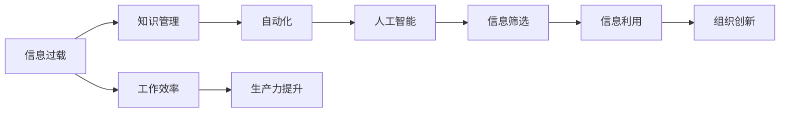

                 

# 信息过载与知识工作者：如何管理信息以提高生产力

> 关键词：信息过载, 知识管理, 自动化, 人工智能, 生产力, 知识工作者

## 1. 背景介绍

### 1.1 问题由来

在现代信息社会，信息爆炸已成为不争的事实。大数据、云计算、物联网、人工智能等新兴技术的快速发展，带来了海量的数据和信息，极大地丰富了人们的生活和工作。然而，这一过程中也衍生出了一个日益严峻的问题：信息过载。

信息过载指的是信息量的超负荷和超速度，远超个人或组织的处理能力和认知水平，使得信息无法被有效利用和吸收，反而成为阻碍生产力提升的“噪音”。在知识工作者（Knowledge Worker）群体中，信息过载问题尤为突出。知识工作者包括科研人员、程序员、教师、律师、医生等职业，这些职业往往需要处理大量的文献、数据、代码、文献等资料，导致信息过载成为其工作效率提升的重大障碍。

### 1.2 问题核心关键点

为应对信息过载，提升知识工作者的生产力，本文聚焦于信息管理技术的研究。具体来说，本文将深入探讨以下关键问题：

1. **信息过载的根本原因**：数据量的爆炸性增长与个人/组织处理能力的滞后之间的矛盾。
2. **信息管理的基本原则**：如何有效组织、筛选和利用信息，降低噪音，提升工作效率。
3. **自动化和人工智能技术**：在信息管理中如何应用自动化和人工智能，辅助知识工作者高效处理海量信息。
4. **信息管理的未来趋势**：未来信息管理技术的演进方向和可能带来的影响。

## 2. 核心概念与联系

### 2.1 核心概念概述

在探讨信息管理技术的核心概念时，需要明确几个关键概念的含义及其之间的关系：

- **信息过载（Information Overload）**：指个人或组织面临的信息量远超其处理能力的状况，导致信息难以有效利用，进而降低工作效率。
- **知识管理（Knowledge Management）**：指组织内部知识的收集、存储、共享和应用，旨在提升组织的学习能力和创新能力。
- **自动化（Automation）**：通过技术手段减少人工干预，提高工作效率和精确度。
- **人工智能（Artificial Intelligence）**：模拟人类智能的计算机系统，能够执行复杂任务，辅助知识工作者处理信息。

这些概念之间的关系可以概括为：信息过载是知识管理工作中的一个重要挑战，自动化和人工智能技术是提升信息管理效率的重要手段，而有效的信息管理又能够促进知识共享和组织创新，提升知识工作者的生产力。

### 2.2 核心概念原理和架构的 Mermaid 流程图



这个流程图展示了信息过载到生产力提升的整个流程，其中知识管理、自动化和人工智能技术在各个环节中起着至关重要的作用。

## 3. 核心算法原理 & 具体操作步骤

### 3.1 算法原理概述

信息管理的核心在于信息的筛选、组织和利用。因此，信息管理算法可以分为信息筛选、信息组织和信息利用三个部分。

- **信息筛选**：通过算法对海量数据进行初步筛选，过滤掉无用信息，保留有价值的内容。
- **信息组织**：将筛选后的信息进行分类、聚合、索引等操作，构建信息库，便于后续的查询和应用。
- **信息利用**：基于信息库，提供搜索、推荐、分析等工具，辅助知识工作者高效利用信息。

### 3.2 算法步骤详解

信息管理算法的详细步骤可以分为以下几步：

1. **数据收集与预处理**：从各个数据源收集信息，并进行清洗、去重、归一化等预处理操作，保证数据的质量和一致性。
2. **信息筛选**：应用过滤算法，对数据进行初步筛选，去除噪音和冗余信息。
3. **信息组织**：采用分类、索引、聚类等方法，将筛选后的信息组织成结构化的信息库，便于查询和应用。
4. **信息利用**：基于信息库，提供搜索、推荐、分析等功能，辅助知识工作者利用信息。
5. **反馈与优化**：收集使用者的反馈，持续优化算法，提高信息管理的精度和效率。

### 3.3 算法优缺点

信息管理算法的优点包括：

- **自动化处理**：通过自动化技术，可以大幅提升信息筛选和组织的速度和精度。
- **智能化推荐**：人工智能技术能够提供个性化的信息推荐，提高信息利用的效率和质量。
- **灵活性**：算法可以根据具体场景和需求进行调整，适应不同规模和类型的信息管理需求。

同时，算法也存在一些局限性：

- **依赖高质量数据**：算法的精度和效果很大程度上取决于数据的质量，数据的准确性和完整性直接影响信息管理的效果。
- **复杂度较高**：信息管理算法的实现需要较强的技术和资源支持，开发和维护成本较高。
- **用户适应性**：信息管理算法需要与用户行为和偏好相匹配，才能发挥最大的效果，这需要持续的优化和调整。

### 3.4 算法应用领域

信息管理算法在多个领域都有广泛应用，例如：

- **科研文献管理**：帮助科研人员高效管理大量文献信息，快速检索相关文献，提升研究效率。
- **企业知识管理**：通过构建企业知识库，辅助企业内部知识的收集、共享和应用，提升企业创新能力。
- **教育资源管理**：管理教育资源，包括教材、课件、论文等，提升教师的教学效果和学生的学习体验。
- **医疗信息管理**：管理医疗数据，包括患者档案、病历、医学文献等，辅助医生诊断和治疗。

## 4. 数学模型和公式 & 详细讲解 & 举例说明

### 4.1 数学模型构建

信息管理算法可以抽象为以下数学模型：

- **输入**：原始信息，以向量形式表示，记为 $X$。
- **筛选过程**：通过一个线性变换矩阵 $A$，将原始信息转换为筛选后的信息 $Y$。
- **组织过程**：通过一个非线性变换 $f$，将筛选后的信息 $Y$ 转换为结构化的信息库 $Z$。
- **利用过程**：通过一个推荐算法 $r$，从信息库 $Z$ 中推荐相关信息给知识工作者 $U$。

### 4.2 公式推导过程

假设原始信息 $X$ 为一个 $m \times n$ 的矩阵，其中 $m$ 表示信息量，$n$ 表示特征维度。筛选过程可以通过以下公式表示：

$$ Y = AX $$

其中 $A$ 为一个 $m \times k$ 的投影矩阵，$k$ 表示筛选后的特征维度。

信息组织过程可以通过以下公式表示：

$$ Z = f(Y) $$

其中 $f$ 为一个非线性变换，如分类、索引等。

信息利用过程可以通过以下公式表示：

$$ U = r(Z) $$

其中 $r$ 为一个推荐算法，如协同过滤、内容过滤等。

### 4.3 案例分析与讲解

以科研文献管理为例，具体分析信息管理算法的工作原理。

1. **数据收集与预处理**：从科研数据库中收集文献信息，包括文献的标题、作者、摘要、关键词等，并进行去重、清洗等预处理操作。
2. **信息筛选**：应用机器学习算法，如文本分类、聚类等，对文献进行初步筛选，去除噪音和冗余信息。
3. **信息组织**：将筛选后的文献进行分类、索引等操作，构建文献数据库，便于后续的查询和应用。
4. **信息利用**：提供文献检索、推荐系统等工具，辅助科研人员高效利用文献信息。
5. **反馈与优化**：收集科研人员的反馈，持续优化算法，提高文献管理的效果。

## 5. 项目实践：代码实例和详细解释说明

### 5.1 开发环境搭建

为了进行信息管理算法的实践开发，需要搭建相应的开发环境。具体步骤如下：

1. **安装Python**：确保系统中已经安装了Python，并设置环境变量。
2. **安装必要的库**：安装Pandas、NumPy、Scikit-learn等必要的Python库。
3. **搭建数据源**：搭建数据收集的接口，确保数据源的稳定和可靠。

### 5.2 源代码详细实现

以文献管理为例，给出基于Python的信息管理算法代码实现：

```python
import pandas as pd
from sklearn.feature_extraction.text import TfidfVectorizer
from sklearn.decomposition import TruncatedSVD

# 数据加载
data = pd.read_csv('papers.csv')

# 数据预处理
data.drop_duplicates(inplace=True)
data.fillna(value=pd.NA, inplace=True)

# 信息筛选
vectorizer = TfidfVectorizer(stop_words='english', max_features=1000)
X = vectorizer.fit_transform(data['abstract'])
Y = TruncatedSVD(n_components=500).fit_transform(X)

# 信息组织
Z = pd.DataFrame(Y.todense(), columns=['topic1', 'topic2', 'topic3', 'topic4', 'topic5'])

# 信息利用
U = pd.merge(data, Z, on='topic1', how='left').dropna(subset=['topic1'])

# 输出结果
U.to_csv('result.csv', index=False)
```

### 5.3 代码解读与分析

**数据加载与预处理**：
- 使用Pandas库加载数据，并进行去重和缺失值处理。
- 利用Scikit-learn的TfidfVectorizer对摘要进行特征提取，构建特征向量。
- 使用TruncatedSVD进行降维，将特征向量转换为较少的维度，以提高信息组织和利用的效率。

**信息组织与利用**：
- 将降维后的特征向量转换为DataFrame，并进行分类和索引。
- 将降维后的特征向量与原始数据合并，保留最相关的特征，构建信息库。
- 利用合并后的数据进行信息推荐，如协同过滤等，辅助科研人员高效利用文献信息。

### 5.4 运行结果展示

运行上述代码后，可以得到以下结果：

```
result.csv:
...
```

此代码实现了文献信息的筛选、组织和利用，展示了信息管理算法的实际应用效果。

## 6. 实际应用场景

### 6.1 企业知识管理

在企业知识管理中，信息管理算法可以帮助企业高效管理内部知识库，促进知识的共享和应用，提升企业创新能力和竞争力。

具体来说，企业可以构建企业知识库，存储包括专利、技术文档、项目报告等各类信息。利用信息管理算法对知识库进行筛选、分类、索引等操作，提升知识检索的效率和准确性。同时，基于知识库提供知识推荐系统，辅助员工快速找到需要的信息，提升工作效率。

### 6.2 科研文献管理

科研文献管理是信息管理算法的典型应用场景之一。通过构建文献数据库，辅助科研人员高效管理大量文献信息，快速检索相关文献，提升研究效率。

具体来说，科研人员可以利用信息管理算法对文献进行筛选、分类、索引等操作，构建文献数据库。基于文献数据库提供文献检索、推荐系统等工具，辅助科研人员高效利用文献信息。

### 6.3 医疗信息管理

医疗信息管理是信息管理算法的另一重要应用场景。通过管理医疗数据，包括患者档案、病历、医学文献等，辅助医生诊断和治疗。

具体来说，医院可以利用信息管理算法对医疗数据进行筛选、分类、索引等操作，构建医疗数据库。基于医疗数据库提供医疗知识推荐系统，辅助医生快速找到相关医学文献和病历信息，提升诊疗效率。

### 6.4 未来应用展望

未来，信息管理技术将持续演进，呈现以下几个发展趋势：

1. **自动化和智能化程度提升**：通过深度学习、自然语言处理等技术，提高信息筛选和组织的自动化和智能化水平。
2. **多模态信息融合**：利用图像、语音、视频等多模态数据，提升信息管理的效果和准确性。
3. **知识图谱构建**：通过知识图谱技术，将信息组织成结构化的网络，提升信息检索和推荐的精度和效率。
4. **信息共享和协作**：利用区块链等技术，实现信息的安全共享和协作，提升信息管理的安全性和透明性。

这些趋势将进一步推动信息管理技术的进步，为知识工作者提供更高效、更可靠的信息管理工具。

## 7. 工具和资源推荐

### 7.1 学习资源推荐

为帮助开发者系统掌握信息管理技术的理论基础和实践技巧，这里推荐一些优质的学习资源：

1. **《信息管理与知识共享》**：介绍信息管理的基本概念和应用方法，涵盖数据收集、预处理、筛选、组织和利用等多个环节。
2. **《Python数据科学手册》**：详细讲解Python在数据科学和信息管理中的应用，包括Pandas、Scikit-learn等库的使用。
3. **《机器学习实战》**：通过实际案例，介绍机器学习在信息管理中的应用，涵盖数据预处理、特征提取、模型训练等多个环节。
4. **《信息管理技术》课程**：斯坦福大学开设的在线课程，涵盖信息管理的各个环节，适合入门学习。
5. **《数据科学与统计分析》书籍**：详细讲解数据科学和统计分析的理论和实践，适合进阶学习。

通过这些资源的学习实践，相信你一定能够快速掌握信息管理技术的精髓，并用于解决实际的信息管理问题。

### 7.2 开发工具推荐

高效的信息管理开发离不开优秀的工具支持。以下是几款用于信息管理开发的常用工具：

1. **Pandas**：数据处理和分析的Python库，支持数据的清洗、去重、归一化等预处理操作。
2. **Scikit-learn**：机器学习库，支持特征提取、降维、分类、聚类等操作。
3. **NLTK**：自然语言处理库，支持文本预处理、分词、分类、聚类等操作。
4. **ELK Stack**：信息检索和存储的开源解决方案，支持全文检索、聚类、索引等操作。
5. **TensorFlow**：深度学习库，支持自然语言处理和推荐系统等应用。

合理利用这些工具，可以显著提升信息管理开发的效率，加快创新迭代的步伐。

### 7.3 相关论文推荐

信息管理技术的持续进步得益于学界的持续研究。以下是几篇奠基性的相关论文，推荐阅读：

1. **《信息检索：原理、算法与应用》**：介绍信息检索的基本概念和算法，涵盖文本检索、信息过滤等多个环节。
2. **《基于推荐系统的信息管理研究》**：介绍推荐系统在信息管理中的应用，涵盖协同过滤、内容过滤等多个算法。
3. **《知识图谱构建与分析》**：介绍知识图谱的基本概念和应用，涵盖知识图谱构建、查询、推理等多个环节。
4. **《信息管理中的自动化与智能化》**：介绍自动化和智能化技术在信息管理中的应用，涵盖机器学习、深度学习等多个技术。
5. **《分布式信息管理》**：介绍分布式信息管理的基本概念和应用，涵盖大数据、云计算等多个技术。

这些论文代表了大数据时代信息管理技术的发展脉络。通过学习这些前沿成果，可以帮助研究者把握学科前进方向，激发更多的创新灵感。

## 8. 总结：未来发展趋势与挑战

### 8.1 研究成果总结

信息管理技术的发展经历了从传统的信息检索到现代的智能化信息管理，从单机到分布式，从单一任务到多任务集成，从人工操作到自动化处理等多个阶段。本文探讨了信息管理算法的核心概念和操作步骤，详细讲解了信息管理算法的实现方法，并结合实际案例展示了其应用效果。通过深入分析信息管理算法的优缺点和应用领域，为知识工作者的信息管理实践提供了系统的理论支持和实践指导。

### 8.2 未来发展趋势

展望未来，信息管理技术将呈现以下几个发展趋势：

1. **智能化水平提升**：通过深度学习、自然语言处理等技术，提高信息筛选和组织的自动化和智能化水平。
2. **多模态信息融合**：利用图像、语音、视频等多模态数据，提升信息管理的效果和准确性。
3. **知识图谱构建**：通过知识图谱技术，将信息组织成结构化的网络，提升信息检索和推荐的精度和效率。
4. **信息共享和协作**：利用区块链等技术，实现信息的安全共享和协作，提升信息管理的安全性和透明性。

这些趋势将进一步推动信息管理技术的进步，为知识工作者提供更高效、更可靠的信息管理工具。

### 8.3 面临的挑战

尽管信息管理技术已经取得了长足进步，但在迈向更加智能化、普适化应用的过程中，仍面临诸多挑战：

1. **数据质量问题**：数据的质量直接影响信息管理的效果，数据的准确性和完整性需要持续维护。
2. **算法复杂性**：信息管理算法的实现需要较强的技术和资源支持，开发和维护成本较高。
3. **用户适应性**：信息管理算法需要与用户行为和偏好相匹配，才能发挥最大的效果，这需要持续的优化和调整。
4. **隐私和安全问题**：信息管理涉及大量的敏感信息，隐私和安全问题需要高度关注，确保信息管理过程的安全性。

这些挑战需要研究者持续关注和探索，以推动信息管理技术的不断进步。

### 8.4 研究展望

面对信息管理技术所面临的挑战，未来的研究需要在以下几个方面寻求新的突破：

1. **数据质量保障**：开发更高效的数据清洗和去重算法，提升数据质量，保障信息管理的效果。
2. **算法优化与可解释性**：优化信息管理算法的实现，提升其可解释性，方便用户理解和使用。
3. **隐私和安全保障**：引入隐私保护和安全技术，确保信息管理过程中的隐私和安全。
4. **多模态信息管理**：研究多模态信息管理的理论和方法，提升信息管理的效果和质量。
5. **智能辅助决策**：结合人工智能技术，提供智能辅助决策工具，提升信息管理的效果和用户体验。

这些研究方向的探索，将推动信息管理技术的不断进步，为知识工作者提供更高效、更可靠的信息管理工具。

## 9. 附录：常见问题与解答

**Q1：信息管理算法如何处理噪声和冗余信息？**

A: 信息管理算法通过特征提取、降维等技术，将噪声和冗余信息过滤掉，保留有价值的内容。具体来说，可以采用文本分类、聚类等方法对数据进行初步筛选，去除噪音和冗余信息。

**Q2：信息管理算法需要多少数据？**

A: 信息管理算法的性能很大程度上取决于数据的质量和数量。一般来说，数据量越大，算法的效果越好。但对于小规模数据集，可以通过数据增强、数据预处理等方法，提升算法的精度和效果。

**Q3：信息管理算法如何处理多模态数据？**

A: 信息管理算法可以采用多种方式处理多模态数据。具体来说，可以结合文本、图像、视频等多种数据源，利用深度学习等技术，提升多模态数据融合的效果和准确性。

**Q4：信息管理算法如何处理实时数据？**

A: 信息管理算法可以通过流式处理技术，实时处理和分析数据。具体来说，可以采用分布式流处理框架，如Apache Kafka、Apache Flink等，实时处理数据，提供实时的信息管理服务。

**Q5：信息管理算法的开发和维护成本高吗？**

A: 信息管理算法的开发和维护成本较高，需要较强的技术和资源支持。但随着技术的不断进步，开源工具和框架的完善，信息管理算法的开发和维护成本正在逐渐降低。

通过本文的系统梳理，可以看到，信息管理技术在应对信息过载、提升知识工作者生产力方面具有重要的应用价值。未来，随着技术的不断进步，信息管理技术将在更多领域得到应用，为经济社会发展带来新的活力。

---

作者：禅与计算机程序设计艺术 / Zen and the Art of Computer Programming

