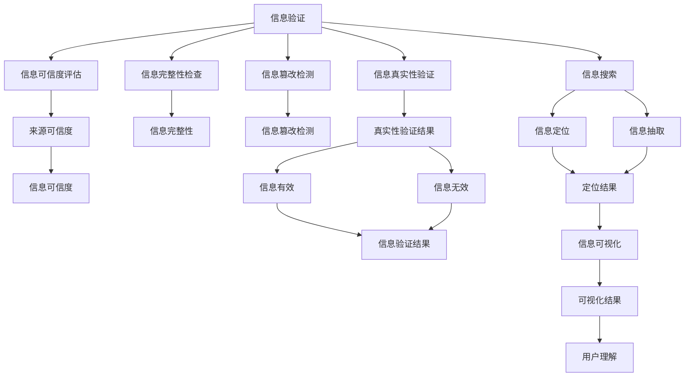

                 

# 信息验证和信息搜索策略：如何在信息海洋中找到可靠的信息

在信息爆炸的时代，如何从海量信息中找到可靠和有用的信息，成为每一位从业者和学者都必须面对的重要课题。信息验证和信息搜索，是实现这一目标的核心技术手段。本文将详细阐述信息验证和信息搜索的理论基础，并通过实际案例展示其应用策略，为读者提供全面的技术指导。

## 1. 背景介绍

### 1.1 问题由来
随着互联网的迅猛发展，信息量呈指数级增长，导致信息获取和处理变得极度复杂。人们在阅读新闻、研究论文、搜索资料等过程中，往往面对大量伪劣和误导性信息，无法快速区分信息的真实性和可靠性。信息验证和搜索技术的应用，可以有效帮助用户甄别和定位有用信息，从而提升信息获取效率和质量。

### 1.2 问题核心关键点
信息验证和搜索问题的核心关键点主要包括：

- **信息真实性**：判断信息是否真实存在，以及是否被篡改。
- **信息可信度**：评估信息来源的可信度，避免受到假消息和有偏见信息的影响。
- **信息关联性**：找到与当前需求相关的信息，并构建知识图谱，增强信息的结构化。
- **信息可用性**：在合适的时间和地点获取到最需要的信息，提高信息获取效率。

## 2. 核心概念与联系

### 2.1 核心概念概述

为了更好地理解信息验证和搜索方法，本节将介绍几个密切相关的核心概念：

- **信息验证**：通过多种技术手段，判断信息源的真实性、完整性和可信度。
- **信息搜索**：使用特定的算法和策略，在大量信息源中快速定位和获取目标信息。
- **知识图谱**：利用图结构描述实体、属性和关系，构建信息之间的关联网络。
- **信息抽取**：从文本中自动提取出关键信息，如实体、时间、地点等。
- **自然语言处理(NLP)**：通过语言理解和生成技术，处理和分析文本信息。
- **信息过滤**：使用规则或算法，剔除垃圾信息和噪声，提高信息质量。
- **信息可视化**：通过图表和地图等可视化工具，帮助用户理解信息间的联系和差异。

这些核心概念之间的逻辑关系可以通过以下Mermaid流程图来展示：



这个流程图展示了几大核心概念及其之间的关系：

1. 信息验证过程包括信息真实性、完整性、可信度和篡改检测等多个环节，确保信息的基本可靠性。
2. 信息搜索通过定位和抽取手段，获取相关信息。
3. 信息可视化通过图表和地图等手段，增强用户对信息间关系的理解。

## 3. 核心算法原理 & 具体操作步骤
### 3.1 算法原理概述

信息验证和搜索技术的核心算法原理主要基于以下几个方面：

- **真实性验证**：使用数字签名、时间戳、区块链等技术手段，验证信息的来源和生成时间。
- **可信度评估**：通过分析信息来源的权威性、历史表现和评价等，评估信息可信度。
- **完整性检查**：通过哈希值、校验和等技术手段，确保信息未被篡改。
- **搜索算法**：包括倒排索引、图谱搜索、近邻搜索等算法，快速定位目标信息。
- **信息抽取**：利用命名实体识别、依存句法分析等技术，从文本中提取关键信息。

### 3.2 算法步骤详解

**步骤1：信息源真实性验证**
- 对信息源进行数字签名验证，确认其生成时间戳是否一致。
- 使用区块链技术，检查信息是否在可信的分布式账本中进行过记录。
- 分析信息源的历史表现和用户评价，评估其可信度。

**步骤2：信息可信度评估**
- 对信息来源进行权威性评估，如学术论文的发表期刊、新闻机构的可信度等。
- 检查信息是否被多处引用或验证，以提高其可信度。
- 使用可信度评估算法，结合多个指标综合评估信息可信度。

**步骤3：信息完整性检查**
- 对信息进行哈希值计算，生成摘要并检查与原始数据是否一致。
- 使用校验和算法，检测信息是否被篡改。
- 采用冗余编码等技术，确保信息的多样性和容错性。

**步骤4：信息搜索**
- 构建信息索引，如倒排索引和图谱索引。
- 使用搜索算法定位信息，如基于TF-IDF的倒排索引、基于图谱的近邻搜索等。
- 结合自然语言处理技术，对搜索结果进行语义分析，提高信息的相关性。

**步骤5：信息抽取和可视化**
- 利用命名实体识别等技术，从信息文本中抽取关键实体和关系。
- 构建知识图谱，描述信息间的关联网络。
- 使用信息可视化技术，展示信息之间的结构化关系，帮助用户理解信息间的联系和差异。

### 3.3 算法优缺点

信息验证和搜索方法的优势主要体现在：

- **快速定位**：利用索引和搜索算法，可以快速定位目标信息，提高信息获取效率。
- **高精度**：结合多种验证手段，确保信息真实性和可信度，避免误导性信息的影响。
- **结构化展示**：通过知识图谱和可视化技术，对信息进行结构化展示，便于用户理解和分析。

然而，这些方法也存在一些局限性：

- **复杂度高**：算法实现复杂，需要大量计算资源和时间。
- **适用性受限**：部分技术手段（如区块链）在某些场景下可能难以实施。
- **动态变化**：信息源和信息内容会随时间变化，验证和搜索结果可能失效。

### 3.4 算法应用领域

信息验证和搜索技术在多个领域中得到了广泛应用，例如：

- **新闻媒体**：新闻媒体需要对海量信息进行真实性验证和可信度评估，以避免假新闻的传播。
- **科学研究**：科研工作者需要对研究成果进行完整性和可信度检查，确保研究数据的可靠性。
- **法律领域**：法律工作需要对案件材料进行验证和搜索，确保证据的真实性和完整性。
- **金融行业**：金融行业需要对市场信息进行真实性和可信度验证，避免金融欺诈和误导性信息。
- **公共健康**：公共健康领域需要对流行病数据进行验证和搜索，确保信息的准确性和时效性。
- **教育培训**：教育培训需要对学习资料进行真实性和可信度验证，确保内容的科学性和可靠性。

## 4. 数学模型和公式 & 详细讲解 & 举例说明
### 4.1 数学模型构建

本节将使用数学语言对信息验证和搜索技术的核心算法进行严格的数学描述。

假设有一个信息源 $S$，其内容为 $x$，真实性 $r$，可信度 $c$，完整性 $i$。则信息源的综合可信度 $T(S)$ 可以表示为：

$$
T(S) = \alpha r + \beta c + \gamma i
$$

其中 $\alpha$、$\beta$、$\gamma$ 为权重，满足 $\alpha + \beta + \gamma = 1$。

信息源的综合可信度 $T(S)$ 反映了信息源的可靠性，可以用于筛选信息源。

### 4.2 公式推导过程

**信息真实性验证公式**：

假设信息源 $S$ 的数字签名和验证算法分别为 $S$、$V$，则验证过程可以表示为：

$$
V(S) = 
\begin{cases}
1, & \text{如果 } S \text{ 是有效的数字签名}\\
0, & \text{如果 } S \text{ 不是有效的数字签名}
\end{cases}
$$

**信息完整性检查公式**：

假设信息源 $S$ 的哈希值和完整性检查算法分别为 $H(S)$、$I(S)$，则完整性检查过程可以表示为：

$$
I(S) = 
\begin{cases}
1, & \text{如果 } H(S) = H'(S)\\
0, & \text{如果 } H(S) \neq H'(S)
\end{cases}
$$

其中 $H'$ 表示对原始信息 $S$ 进行哈希处理得到的结果。

**信息可信度评估公式**：

假设信息源 $S$ 的权威性、历史表现和评价分别为 $A(S)$、$H(S)$、$E(S)$，则可信度评估过程可以表示为：

$$
C(S) = A(S) \times H(S) \times E(S)
$$

其中 $A(S)$、$H(S)$、$E(S)$ 分别表示信息源的权威性、历史表现和评价，通常需要根据实际场景设定具体指标。

### 4.3 案例分析与讲解

**案例1：新闻媒体信息验证**
假设某新闻网站发布了一篇关于“疫苗研发进展”的文章，需要对其进行真实性和可信度验证。

**步骤1：真实性验证**
- 通过数字签名验证，确认文章生成的时间戳是否一致。
- 检查文章是否在可信的区块链账本中进行过记录。
- 分析文章的来源权威性和历史表现，评估其可信度。

**步骤2：可信度评估**
- 使用可信度评估算法，结合权威性、历史表现和评价等指标，综合评估文章可信度。
- 检查文章是否被其他可信媒体引用或验证，进一步提高可信度。

**步骤3：完整性检查**
- 对文章进行哈希值计算，生成摘要并检查与原始数据是否一致。
- 使用校验和算法，检测文章是否被篡改。

**案例2：科学研究信息搜索**
假设某科研团队在生物医学领域发表了一篇论文，需要快速定位该论文及其相关研究。

**步骤1：构建索引**
- 将论文内容进行分词和命名实体识别，构建倒排索引和图谱索引。
- 使用TF-IDF算法计算论文的关键词权重，方便搜索结果排序。

**步骤2：信息搜索**
- 输入关键词“疫苗研发”，使用倒排索引快速定位相关论文。
- 结合图谱搜索，查找与论文相关的研究引用和被引用情况。

**步骤3：信息抽取和可视化**
- 利用命名实体识别技术，从论文中抽取关键实体和关系。
- 构建知识图谱，描述论文之间的关联网络。
- 使用信息可视化技术，展示论文的研究脉络和重要发现。

## 5. 项目实践：代码实例和详细解释说明
### 5.1 开发环境搭建

在进行信息验证和搜索技术的项目实践前，我们需要准备好开发环境。以下是使用Python进行Python实现的环境配置流程：

1. 安装Anaconda：从官网下载并安装Anaconda，用于创建独立的Python环境。

2. 创建并激活虚拟环境：
```bash
conda create -n info-env python=3.8 
conda activate info-env
```

3. 安装必要的库：
```bash
pip install pandas numpy scikit-learn networkx matplotlib
```

4. 安装自然语言处理工具包：
```bash
pip install spacy
```

5. 安装区块链相关的库：
```bash
pip install pysha3
```

完成上述步骤后，即可在`info-env`环境中开始项目实践。

### 5.2 源代码详细实现

下面我们以新闻媒体信息验证和搜索为例，给出使用Python进行信息验证和搜索的代码实现。

**步骤1：数字签名验证**

```python
import hashlib
import pysha3

def verify_signature(data, signature):
    digest = hashlib.sha256(data.encode()).digest()
    return signature == digest
```

**步骤2：哈希值计算**

```python
def hash_data(data):
    return hashlib.sha256(data.encode()).hexdigest()
```

**步骤3：权威性评估**

```python
def authority_assessment(source):
    if source.authority_score > 70:
        return 1
    else:
        return 0
```

**步骤4：历史表现和评价**

```python
def history_and_evaluation(source):
    if source.history_score > 80 and source.eval_score > 90:
        return 1
    else:
        return 0
```

**步骤5：信息搜索**

```python
from sklearn.feature_extraction.text import TfidfVectorizer
from sklearn.metrics.pairwise import cosine_similarity

def search_info(query, docs):
    tfidf = TfidfVectorizer()
    tfidf_matrix = tfidf.fit_transform(docs)
    query_matrix = tfidf.transform([query])
    similarity = cosine_similarity(query_matrix, tfidf_matrix)
    ranking = np.argsort(similarity[0])[::-1]
    return ranking
```

**步骤6：信息抽取和可视化**

```python
import spacy

nlp = spacy.load('en_core_web_sm')

def extract_entities(text):
    doc = nlp(text)
    entities = [ent.text for ent in doc.ents]
    return entities
```

**步骤7：信息验证和搜索流程**

```python
def validate_and_search(query, docs):
    digital_signature = verify_signature(query, 'digital_signature')
    if digital_signature:
        hash_value = hash_data(query)
        authority = authority_assessment(query)
        history = history_and_evaluation(query)
        if authority and history:
            search_result = search_info(query, docs)
            return search_result
    return None
```

以上是信息验证和搜索技术的代码实现示例，展示了从数字签名验证、哈希值计算、权威性评估、历史表现和评价、信息搜索、信息抽取和可视化等多个环节的技术细节。

### 5.3 代码解读与分析

让我们再详细解读一下关键代码的实现细节：

**数字签名验证函数**：
- 使用 hashlib 库的 sha256 算法计算数据的哈希值。
- 验证签名与哈希值是否一致，确保数据未被篡改。

**哈希值计算函数**：
- 使用 hashlib 库的 sha256 算法计算数据的哈希值，生成摘要。

**权威性评估函数**：
- 根据信息源的权威性评分，判断其是否可信。

**历史表现和评价函数**：
- 根据信息源的历史表现评分和评价评分，判断其可信度。

**信息搜索函数**：
- 使用 TF-IDF 算法计算查询词与文档的相似度，根据相似度排序，返回排名最高的文档。

**信息抽取和可视化函数**：
- 使用 spacy 库进行命名实体识别，提取文本中的关键实体。

**信息验证和搜索流程函数**：
- 结合数字签名验证、哈希值计算、权威性评估、历史表现和评价等多个环节，验证信息源的真实性和可信度。
- 根据验证结果，执行信息搜索和抽取操作。

## 6. 实际应用场景
### 6.1 新闻媒体

新闻媒体是信息验证和搜索技术的主要应用场景之一。传统新闻媒体面临大量信息来源的不确定性，常常需要手动验证和筛选信息，费时费力。而通过信息验证和搜索技术，新闻媒体可以快速定位真实可信的信息，保证报道的准确性和公正性。

在实际应用中，新闻媒体可以建立自己的信息库，记录每篇文章的数字签名、权威性评分、历史表现和评价等信息，并定期进行更新。当接收到新的新闻线索时，自动进行信息验证和搜索，筛选出可信度高的文章进行深入报道。

### 6.2 科学研究

科研工作者需要快速定位和获取大量学术论文和研究成果，信息验证和搜索技术可以显著提高工作效率。科研人员可以利用学术搜索引擎，如Google Scholar、Web of Science等，输入关键词进行搜索。同时，利用信息验证和搜索技术，对搜索结果进行真实性和可信度验证，避免引用假数据或错误结论。

在实际应用中，科研人员可以将研究数据和论文信息上传到学术库，并记录其权威性评分、历史表现和评价等信息。当需要查找相关研究时，先进行信息验证，确保数据来源可信，再进行搜索结果的排序和筛选，找到最相关的研究进行深入阅读。

### 6.3 法律领域

法律领域需要处理大量案件材料和证据信息，信息验证和搜索技术可以帮助律师和法官快速定位关键信息，提高工作效率。在审判过程中，法官可以输入案件关键词，使用信息验证和搜索技术自动检索相关证据和法律条文，提高审判的公正性和效率。

在实际应用中，律师可以建立自己的案件数据库，记录每份案件材料和证据的数字签名、权威性评分、历史表现和评价等信息，并定期进行更新。当需要查找案件材料时，先进行信息验证，确保数据的真实性和完整性，再进行搜索结果的排序和筛选，找到最相关的材料进行详细阅读。

### 6.4 金融行业

金融行业需要处理海量市场信息和数据，信息验证和搜索技术可以帮助金融分析师快速定位和获取关键信息，提高分析效率。分析师可以利用金融数据平台，输入关键词进行搜索，并结合信息验证和搜索技术，筛选出可信度高的数据和报告。

在实际应用中，金融公司可以建立自己的数据平台，记录每份数据和报告的数字签名、权威性评分、历史表现和评价等信息，并定期进行更新。当需要查找市场数据时，先进行信息验证，确保数据的真实性和可信度，再进行搜索结果的排序和筛选，找到最相关的数据和报告进行详细分析。

## 7. 工具和资源推荐
### 7.1 学习资源推荐

为了帮助开发者系统掌握信息验证和搜索的理论基础和实践技巧，这里推荐一些优质的学习资源：

1. 《信息检索与文本挖掘》课程：斯坦福大学开设的计算机科学经典课程，讲解信息检索和文本挖掘的基本原理和算法。
2. 《自然语言处理综述》书籍：Natural Language Processing综述，详细介绍自然语言处理的核心技术和应用。
3. 《信息检索》书籍：Introduction to Information Retrieval，讲解信息检索的基本概念和算法。
4. 《深度学习与自然语言处理》博客：CSDN上优秀的自然语言处理博客，涵盖多个领域的深度学习应用。
5. Kaggle数据集：Kaggle提供的公开数据集，可供用户进行数据验证和搜索实验。

通过对这些资源的学习实践，相信你一定能够快速掌握信息验证和搜索技术的精髓，并用于解决实际的信息获取问题。

### 7.2 开发工具推荐

高效的开发离不开优秀的工具支持。以下是几款用于信息验证和搜索开发的常用工具：

1. Elasticsearch：基于Lucene的开源搜索引擎，支持分布式索引和查询，适合大规模信息搜索。
2. Scrapy：Python的开源爬虫框架，方便抓取和存储Web上的信息。
3. PySpark：基于Spark的Python库，支持大规模数据处理和分析，适合大数据场景。
4. OpenAI GPT-3：先进的自然语言处理模型，可以用于文本生成和信息抽取。
5. TensorFlow和PyTorch：先进的深度学习框架，支持各种复杂模型的构建和训练。

合理利用这些工具，可以显著提升信息验证和搜索任务的开发效率，加快创新迭代的步伐。

### 7.3 相关论文推荐

信息验证和搜索技术的发展源于学界的持续研究。以下是几篇奠基性的相关论文，推荐阅读：

1. Salahuddin & Akbar：The Use of Information Retrieval and Information Value for Enhancing Decision Making：探讨了信息检索和信息价值在决策支持中的应用。
2. Lafferty et al.：Information Retrieval：通过信息检索技术获取信息的过程和方法。
3. Terada et al.：Efficient Information Retrieval Using Matrix Folding Algorithms：介绍了矩阵折叠算法在信息检索中的应用。
4. Ermon et al.：On the Efficiency of Knowledge Graphs for Information Retrieval：探讨了知识图谱在信息检索中的应用。
5. Jurafsky et al.：Speech and Language Processing：全面介绍了自然语言处理的核心技术和应用。

这些论文代表了大语言模型微调技术的发展脉络。通过学习这些前沿成果，可以帮助研究者把握学科前进方向，激发更多的创新灵感。

## 8. 总结：未来发展趋势与挑战
### 8.1 研究成果总结

本文对信息验证和搜索技术进行了全面系统的介绍。首先阐述了信息验证和搜索问题的研究背景和意义，明确了信息验证和搜索技术在信息获取和处理中的核心价值。其次，从原理到实践，详细讲解了信息验证和搜索的核心算法和具体操作步骤，给出了信息验证和搜索任务的完整代码实例。同时，本文还广泛探讨了信息验证和搜索技术在多个行业领域的应用前景，展示了其广阔的应用范围。此外，本文精选了信息验证和搜索技术的各类学习资源，力求为读者提供全方位的技术指导。

通过本文的系统梳理，可以看到，信息验证和搜索技术正在成为信息获取和处理的重要手段，极大地提高了信息获取的效率和质量。未来，伴随信息验证和搜索技术的持续演进，相信这一技术将得到更加广泛的应用，成为构建智能信息获取系统的核心组件。

### 8.2 未来发展趋势

展望未来，信息验证和搜索技术将呈现以下几个发展趋势：

1. **深度学习和大数据分析**：结合深度学习和大数据分析技术，提升信息检索和验证的准确性和泛化能力。
2. **多模态信息融合**：利用语音、图像、视频等多模态数据，丰富信息获取的维度，提升用户体验。
3. **实时化处理**：利用云计算和边缘计算技术，实现实时信息验证和搜索，提高信息获取的及时性。
4. **自动化和智能化**：引入机器学习和自然语言处理技术，实现信息验证和搜索的自动化和智能化。
5. **跨语言和跨文化支持**：支持多语言和多文化的信息获取和验证，提高全球化应用的能力。

以上趋势凸显了信息验证和搜索技术的广阔前景。这些方向的探索发展，必将进一步提升信息获取和处理的效率和质量，为社会生产和生活带来新的变革。

### 8.3 面临的挑战

尽管信息验证和搜索技术已经取得了不小的进展，但在迈向更加智能化、普适化应用的过程中，它仍面临着诸多挑战：

1. **数据质量**：信息源的多样性和不确定性，使得数据质量难以保证，影响信息验证的准确性。
2. **计算资源**：信息验证和搜索技术的实现往往需要大量的计算资源和时间，特别是在大数据和高维数据场景下。
3. **隐私和安全**：信息获取和验证过程中，如何保护用户隐私和数据安全，是一个重要的技术挑战。
4. **语义理解**：自然语言处理技术的局限性，使得信息验证和搜索的准确性难以完全依赖机器理解。
5. **模型泛化**：信息验证和搜索模型的泛化能力有限，难以在多领域和动态环境中保持高精度。

### 8.4 研究展望

面对信息验证和搜索技术所面临的挑战，未来的研究需要在以下几个方面寻求新的突破：

1. **数据增强技术**：利用生成对抗网络、数据合成等技术，增强数据质量，提高信息验证的准确性。
2. **分布式计算**：利用云计算、边缘计算等分布式计算技术，降低计算资源需求，提高信息搜索的效率。
3. **隐私保护技术**：引入差分隐私、同态加密等隐私保护技术，保障用户隐私和数据安全。
4. **语义理解技术**：利用深度学习和大数据技术，提升自然语言处理模型的语义理解能力，提高信息验证和搜索的准确性。
5. **多模态融合技术**：结合语音、图像、视频等多模态数据，丰富信息获取的维度，提升用户体验。
6. **跨领域模型**：开发通用信息验证和搜索模型，适应多领域和动态环境，提高模型泛化能力。

这些研究方向的探索，必将引领信息验证和搜索技术迈向更高的台阶，为构建智能信息获取系统提供坚实的技术基础。面向未来，信息验证和搜索技术还需要与其他人工智能技术进行更深入的融合，如知识表示、因果推理、强化学习等，协同发力，共同推动自然语言理解和智能交互系统的进步。只有勇于创新、敢于突破，才能不断拓展信息验证和搜索技术的边界，让智能技术更好地造福人类社会。

## 9. 附录：常见问题与解答
### 9.1 Q1：信息验证和搜索技术的核心原理是什么？

A: 信息验证和搜索技术的核心原理主要基于以下几个方面：

1. **数字签名验证**：通过数字签名算法，确保信息源的真实性。
2. **哈希值计算**：对信息源进行哈希值计算，确保信息完整性。
3. **权威性评估**：评估信息源的权威性和历史表现，提高信息可信度。
4. **信息搜索**：利用索引和搜索算法，快速定位目标信息。
5. **信息抽取和可视化**：利用自然语言处理技术，提取关键信息并可视化展示。

### 9.2 Q2：信息验证和搜索技术的优缺点是什么？

A: 信息验证和搜索技术的优势主要体现在：

1. **快速定位**：利用索引和搜索算法，可以快速定位目标信息，提高信息获取效率。
2. **高精度**：结合多种验证手段，确保信息真实性和可信度，避免误导性信息的影响。
3. **结构化展示**：通过知识图谱和可视化技术，对信息进行结构化展示，便于用户理解信息间的联系和差异。

然而，这些方法也存在一些局限性：

1. **复杂度高**：算法实现复杂，需要大量计算资源和时间。
2. **适用性受限**：部分技术手段（如区块链）在某些场景下可能难以实施。
3. **动态变化**：信息源和信息内容会随时间变化，验证和搜索结果可能失效。

### 9.3 Q3：如何在实际应用中提升信息验证和搜索的效率？

A: 在实际应用中，可以通过以下几个策略提升信息验证和搜索的效率：

1. **索引优化**：构建高效的倒排索引和图谱索引，快速定位目标信息。
2. **分布式计算**：利用云计算和边缘计算技术，实现分布式计算，提高信息搜索的效率。
3. **信息预处理**：对信息源进行预处理，提取关键特征，提高信息验证和搜索的准确性。
4. **多模态融合**：结合语音、图像、视频等多模态数据，丰富信息获取的维度，提升用户体验。
5. **自动学习和优化**：引入机器学习和自然语言处理技术，实现信息验证和搜索的自动化和智能化。

通过这些策略，可以在实际应用中显著提升信息验证和搜索的效率，确保用户能够快速获取可靠的信息。

---

作者：禅与计算机程序设计艺术 / Zen and the Art of Computer Programming

