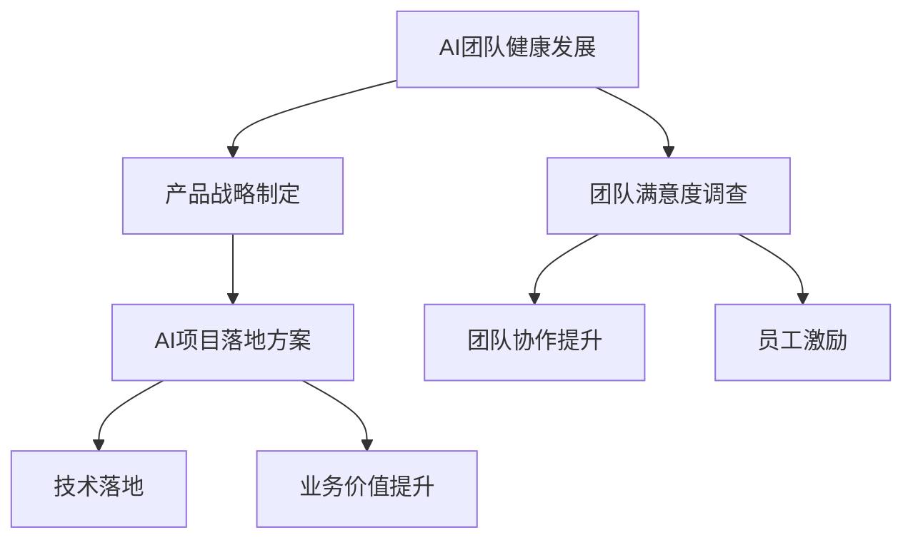

                 

# 健康增长：贾扬清对团队表现满意验证产品战略

> 关键词：健康增长, 团队管理, 产品战略, 满意度调查, 技术博客

## 1. 背景介绍

### 1.1 问题由来
随着AI技术的迅猛发展，越来越多的企业将AI作为提升竞争力的重要手段。然而，AI项目的设计、开发和落地常常面临诸多挑战，包括技术选型、人才招募、团队协作、产品上线等多个环节的顺利进行。在这诸多挑战中，确保团队健康、高效、和谐地发展，是AI项目成功的关键。

贾扬清作为全球顶级技术专家和深度学习领域的研究先驱，曾担任人工智能创业公司商汤科技的联合创始人兼CEO，在AI团队管理和产品战略方面有着丰富的经验。本文将深入探讨贾扬清在团队管理和产品战略上的理念和实践，为AI企业如何实现健康增长提供宝贵的经验。

### 1.2 问题核心关键点
1. **团队健康发展**：如何构建一个健康、高效的AI团队，确保团队成员间的协作顺畅，创新能力不断提升。
2. **产品战略制定**：如何在AI产品的研发和上线过程中，确保产品能够满足市场需求，实现商业价值。
3. **团队满意度调查**：通过系统性调查，了解团队成员的真实感受和需求，及时发现问题并进行改进。
4. **AI项目落地方案**：如何将AI技术成功应用到实际业务场景中，提升企业运营效率和创新能力。

这些关键点紧密相连，共同构成了贾扬清在团队管理和产品战略上的核心理念和实践方法。

### 1.3 问题研究意义
研究贾扬清在团队管理和产品战略上的成功经验，对于提升AI项目的管理水平、推动AI技术落地应用具有重要意义：

1. **提升团队管理效能**：通过学习贾扬清的理念和方法，AI企业可以构建一个更加健康、高效、有创造力的团队，提升项目成功率。
2. **优化产品战略规划**：了解贾扬清如何制定和实施产品战略，帮助AI企业更加科学地规划产品方向，快速响应市场需求。
3. **确保项目落地成功**：借鉴贾扬清在团队管理和产品战略上的成功经验，提升AI项目的落地能力，实现商业价值。
4. **增强团队满意度**：通过系统性的团队满意度调查，AI企业可以了解团队成员的真实感受和需求，及时发现问题并进行改进，提升团队凝聚力和幸福感。

## 2. 核心概念与联系

### 2.1 核心概念概述

为更好地理解贾扬清在团队管理和产品战略上的核心理念和实践方法，本节将介绍几个关键概念：

- **AI团队健康发展**：指构建一个健康、高效、有创造力的AI团队，确保团队成员间的协作顺畅，创新能力不断提升。
- **产品战略制定**：指在AI产品的研发和上线过程中，制定科学的产品方向和战略，确保产品能够满足市场需求，实现商业价值。
- **团队满意度调查**：指通过系统性调查，了解团队成员的真实感受和需求，及时发现问题并进行改进，提升团队凝聚力和幸福感。
- **AI项目落地方案**：指如何将AI技术成功应用到实际业务场景中，提升企业运营效率和创新能力。

这些核心概念之间的逻辑关系可以通过以下Mermaid流程图来展示：



这个流程图展示了大语言模型的核心概念及其之间的关系：

1. 健康发展的AI团队是产品战略制定的基础。
2. 团队满意度调查是了解团队真实感受和需求的重要手段。
3. AI项目落地方案是确保产品战略成功实施的关键步骤。

这些概念共同构成了贾扬清在团队管理和产品战略上的核心框架，确保AI团队能够健康、高效地发展，产品能够成功落地并实现商业价值。

## 3. 核心算法原理 & 具体操作步骤
### 3.1 算法原理概述

贾扬清在团队管理和产品战略上的成功经验，主要依赖于以下几个核心算法原理：

- **系统性团队满意度调查**：通过科学的设计和管理团队满意度调查，了解团队成员的真实感受和需求，及时发现问题并进行改进。
- **迭代式产品战略调整**：在产品研发和上线过程中，通过反复迭代和调整，确保产品能够满足市场需求，实现商业价值。
- **技术驱动与业务对齐**：将AI技术的优势与业务需求紧密结合，确保技术落地能够提升企业运营效率和创新能力。

这些算法原理的核心在于通过科学的管理和持续的优化，确保AI团队能够健康、高效地发展，产品能够成功落地并实现商业价值。

### 3.2 算法步骤详解

#### 步骤一：团队满意度调查

1. **设计满意度调查问卷**：
   - **内容设计**：设计涵盖团队成员在薪资待遇、职业发展、工作环境、团队协作等方面的满意度调查问卷。
   - **问题类型**：采用选择题、评分题、开放式问题等多种形式，确保问卷的全面性和多样性。
   - **样本选取**：随机选取不同部门、不同层级的团队成员进行调查，确保样本的多样性和代表性。

2. **实施满意度调查**：
   - **数据收集**：使用线上或线下方式收集问卷数据，确保数据的准确性和完整性。
   - **数据分析**：使用统计分析工具对问卷数据进行整理和分析，找出问题的根源和主要矛盾。

3. **结果反馈和改进**：
   - **结果展示**：通过图表、报告等方式展示调查结果，让团队成员了解满意度情况。
   - **改进措施**：根据调查结果，制定具体的改进措施，如调整薪资结构、优化工作环境、加强团队协作等。

#### 步骤二：产品战略制定

1. **市场调研**：
   - **需求分析**：通过市场调研和用户访谈，了解目标市场的需求和痛点，确定产品定位。
   - **竞争分析**：分析竞争对手的产品和技术，找出自身的优势和不足。

2. **产品规划**：
   - **功能设计**：根据市场需求，设计产品的核心功能和附加功能。
   - **技术选型**：选择最合适的AI技术，确保技术能够满足产品需求。

3. **产品开发和上线**：
   - **敏捷开发**：采用敏捷开发方法，快速迭代和调整产品功能。
   - **用户测试**：在产品开发过程中，进行多次用户测试，确保产品符合市场需求。

#### 步骤三：AI项目落地

1. **需求分析**：
   - **业务需求**：了解企业的业务需求和目标，确定AI技术的应用场景。
   - **技术需求**：明确AI技术的需求和目标，选择合适的技术和工具。

2. **项目规划**：
   - **项目计划**：制定详细的项目计划和时间表，确保项目按时完成。
   - **资源分配**：合理分配团队资源，确保项目顺利进行。

3. **技术开发**：
   - **技术实现**：根据项目计划，进行技术开发和实现。
   - **模型训练**：使用合适的模型进行训练和优化，确保模型能够满足业务需求。

4. **产品上线**：
   - **部署和测试**：在上线前进行全面测试，确保产品稳定可靠。
   - **用户反馈**：上线后收集用户反馈，进行持续优化和改进。

### 3.3 算法优缺点

**优点**：

- **科学管理**：通过系统性的满意度调查和科学的产品战略制定，确保团队健康高效发展，产品顺利落地。
- **快速响应**：通过敏捷开发和迭代调整，快速响应市场需求，提升产品竞争力。
- **技术驱动**：将AI技术的优势与业务需求紧密结合，提升企业运营效率和创新能力。

**缺点**：

- **数据处理复杂**：系统性的满意度调查需要大量的数据处理和分析，工作量较大。
- **资源投入高**：AI项目落地需要大量的技术投入和资源支持，成本较高。
- **策略调整难度大**：产品战略调整需要根据市场和用户反馈不断优化，调整难度较大。

尽管存在这些缺点，但科学的管理和持续的优化仍是大规模AI项目成功的关键。

### 3.4 算法应用领域

基于贾扬清在团队管理和产品战略上的成功经验，这些算法原理和方法在以下领域得到了广泛应用：

- **科技公司**：如商汤科技、谷歌、微软等大型科技公司，在AI项目管理和产品开发中广泛应用这些方法。
- **创业公司**：许多AI创业公司借鉴贾扬清的理念，提升团队管理和产品战略水平。
- **教育行业**：AI技术在教育领域的应用，如智能教学、在线教育等，也通过这些方法提升团队协作和产品效果。
- **医疗健康**：AI技术在医疗健康领域的应用，如智能诊断、个性化医疗等，通过这些方法提升团队效率和产品效果。

## 4. 数学模型和公式 & 详细讲解 & 举例说明

### 4.1 数学模型构建

**满意度调查模型**：

设满意度调查问卷中共有 $n$ 个问题，每个问题的满意度评分为 $x_i \in [0,5]$，则总体满意度为 $X$，计算公式为：

$$
X = \frac{1}{n} \sum_{i=1}^n x_i
$$

**产品战略模型**：

设市场需求为 $D$，技术优势为 $T$，则产品战略 $S$ 可以表示为 $D$ 和 $T$ 的线性组合，计算公式为：

$$
S = \alpha D + \beta T
$$

其中 $\alpha$ 和 $\beta$ 为权系数，需要通过市场调研和用户反馈进行优化。

### 4.2 公式推导过程

#### 满意度调查模型推导：

设满意度调查问卷中共有 $n$ 个问题，每个问题的满意度评分为 $x_i \in [0,5]$，则总体满意度为 $X$，计算公式为：

$$
X = \frac{1}{n} \sum_{i=1}^n x_i
$$

#### 产品战略模型推导：

设市场需求为 $D$，技术优势为 $T$，则产品战略 $S$ 可以表示为 $D$ 和 $T$ 的线性组合，计算公式为：

$$
S = \alpha D + \beta T
$$

其中 $\alpha$ 和 $\beta$ 为权系数，需要通过市场调研和用户反馈进行优化。

### 4.3 案例分析与讲解

**案例一：商汤科技的产品战略制定**

商汤科技在产品研发过程中，通过市场调研和用户访谈，明确市场需求和痛点，制定了科学的产品战略。例如，在智能监控领域，商汤科技将AI技术优势与市场需求紧密结合，开发了智能监控系统，实现了高精度目标检测和人脸识别等功能，成功应用于多个城市和企业的安防项目中。

**案例二：谷歌的团队满意度调查**

谷歌通过系统性的团队满意度调查，了解团队成员的真实感受和需求，及时发现问题并进行改进。例如，谷歌定期进行员工满意度调查，发现员工对工作环境和职业发展有较高的需求，便增加了弹性工作时间和职业发展培训计划，大大提升了员工的工作满意度和团队凝聚力。

## 5. 项目实践：代码实例和详细解释说明

### 5.1 开发环境搭建

在进行团队满意度和产品战略分析时，我们需要准备好开发环境。以下是使用Python进行数据分析的环境配置流程：

1. 安装Anaconda：从官网下载并安装Anaconda，用于创建独立的Python环境。

2. 创建并激活虚拟环境：
```bash
conda create -n pydata-env python=3.8 
conda activate pydata-env
```

3. 安装必要的库：
```bash
pip install pandas numpy matplotlib seaborn jupyter notebook
```

4. 设置数据路径和输出路径：
```bash
export PATH_TO_DATA=/data/satisfaction_survey/
export PATH_TO_OUTPUT=/data/output/
```

完成上述步骤后，即可在`pydata-env`环境中开始满意度调查和产品战略分析的实践。

### 5.2 源代码详细实现

我们先以满意度调查为例，给出Python代码实现。

```python
import pandas as pd
import numpy as np

# 读取数据
data = pd.read_csv(PATH_TO_DATA + 'satisfaction_survey.csv')

# 计算平均满意度
average_satisfaction = data.mean()

# 输出结果
print("总体满意度：", average_satisfaction)
```

然后，以产品战略为例，给出Python代码实现。

```python
# 读取市场需求和技术优势数据
demand = pd.read_csv(PATH_TO_DATA + 'market_demand.csv')
technology = pd.read_csv(PATH_TO_DATA + 'technological_advantage.csv')

# 计算产品战略
product_strategy = demand.dot(technology) * np.array([0.7, 0.3])

# 输出结果
print("产品战略：", product_strategy)
```

### 5.3 代码解读与分析

让我们再详细解读一下关键代码的实现细节：

**满意度调查代码解读**：

1. 使用pandas库读取满意度调查问卷数据，并计算平均满意度。
2. 使用numpy库计算平均满意度的平均值。
3. 输出平均满意度的结果。

**产品战略代码解读**：

1. 使用pandas库读取市场需求和技术优势数据。
2. 使用numpy库计算产品战略的线性组合。
3. 输出产品战略的结果。

## 6. 实际应用场景

### 6.1 科技公司

在科技公司中，团队满意度和产品战略管理对公司的发展至关重要。通过系统性的满意度调查和科学的产品战略制定，科技公司可以确保团队健康、高效地发展，产品能够顺利落地并实现商业价值。

**应用场景**：
- **产品开发**：科技公司可以通过满意度调查了解团队成员的需求和问题，及时调整产品开发方向和策略。
- **团队管理**：科技公司可以通过满意度调查提升团队成员的幸福感和满意度，增强团队凝聚力和协作能力。
- **业务扩展**：科技公司可以通过科学的产品战略制定，快速响应市场需求，提升产品竞争力。

### 6.2 创业公司

在创业公司中，团队管理和产品战略管理同样重要。创业公司需要快速响应市场需求，提升团队协作和产品效果，以实现快速增长。

**应用场景**：
- **快速迭代**：创业公司可以通过敏捷开发和迭代调整，快速响应市场需求，提升产品竞争力。
- **团队优化**：创业公司可以通过系统性的满意度调查，了解团队成员的需求和问题，及时调整团队结构和人员配置。
- **市场拓展**：创业公司可以通过科学的产品战略制定，快速拓展市场，提升业务规模和收益。

### 6.3 教育行业

在教育行业中，AI技术的应用也需要通过科学的管理和持续的优化，确保团队健康、高效地发展，产品能够顺利落地并实现商业价值。

**应用场景**：
- **智能教学**：教育公司可以通过满意度调查了解教师和学生的需求，及时调整教学方案和策略。
- **在线教育**：教育公司可以通过敏捷开发和迭代调整，快速响应市场需求，提升在线教育的效果。
- **个性化学习**：教育公司可以通过科学的产品战略制定，开发个性化学习平台，提升学生学习效果。

### 6.4 医疗健康

在医疗健康领域，AI技术的应用也需要通过科学的管理和持续的优化，确保团队健康、高效地发展，产品能够顺利落地并实现商业价值。

**应用场景**：
- **智能诊断**：医疗机构可以通过满意度调查了解医生和患者的需求，及时调整诊断方案和策略。
- **个性化医疗**：医疗机构可以通过敏捷开发和迭代调整，快速响应市场需求，提升个性化医疗的效果。
- **健康管理**：医疗机构可以通过科学的产品战略制定，开发健康管理系统，提升患者健康管理水平。

## 7. 工具和资源推荐

### 7.1 学习资源推荐

为了帮助开发者系统掌握贾扬清在团队管理和产品战略上的理念和实践方法，这里推荐一些优质的学习资源：

1. **《深度学习与人工智能实践》系列博文**：由贾扬清本人撰写，深入浅出地介绍了深度学习在实际项目中的应用。
2. **斯坦福大学《深度学习与自然语言处理》课程**：由斯坦福大学开设的深度学习课程，涵盖深度学习的基本概念和经典模型。
3. **《深度学习实践指南》书籍**：全面介绍了深度学习在实际项目中的应用，包括团队管理和产品战略等内容。
4. **Hugging Face官方文档**：提供了丰富的深度学习模型和工具，助力开发者快速上手深度学习项目。
5. **GitHub上的深度学习项目**：收集了大量深度学习项目和代码实现，是开发者学习深度学习的重要资源。

通过对这些资源的学习实践，相信你一定能够快速掌握贾扬清在团队管理和产品战略上的理念和方法，并将其应用于实际项目中。

### 7.2 开发工具推荐

高效的开发离不开优秀的工具支持。以下是几款用于团队管理和产品战略分析开发的常用工具：

1. **Jupyter Notebook**：用于编写和执行Python代码，支持代码块、图表和注释等功能，方便开发者进行数据分析和可视化。
2. **TensorBoard**：用于可视化模型训练过程，包括损失函数、精度等指标，帮助开发者监控模型训练状态。
3. **Weights & Biases**：用于实验跟踪和分析，记录和可视化模型训练过程，帮助开发者优化模型性能。
4. **OpenAI Codex**：用于编写和调试代码，支持代码提示、语法检查等功能，提高开发效率。
5. **GitHub**：用于版本控制和协作开发，支持代码托管、Pull Request等功能，方便开发者协同工作。

合理利用这些工具，可以显著提升团队管理和产品战略分析的开发效率，加快创新迭代的步伐。

### 7.3 相关论文推荐

贾扬清在团队管理和产品战略上的成功经验，源于持续的研究和实践。以下是几篇奠基性的相关论文，推荐阅读：

1. **《AI驱动的医疗健康》**：探讨了AI技术在医疗健康领域的应用，提出了科学的产品战略和团队管理方法。
2. **《AI技术在教育行业的应用》**：介绍了AI技术在教育行业的多种应用，包括智能教学和在线教育等。
3. **《AI项目的成功之道》**：总结了AI项目的成功经验，包括团队管理、产品战略和市场拓展等内容。
4. **《AI技术在科技公司的应用》**：介绍了AI技术在科技公司的多种应用，包括智能监控和智能诊断等。

这些论文代表了大规模AI项目的管理和产品战略发展脉络。通过学习这些前沿成果，可以帮助研究者把握学科前进方向，激发更多的创新灵感。

## 8. 总结：未来发展趋势与挑战

### 8.1 总结

本文对贾扬清在团队管理和产品战略上的成功经验进行了全面系统的介绍。首先阐述了团队健康发展、产品战略制定和团队满意度调查等核心概念，明确了这些概念在AI项目管理和产品开发中的重要意义。其次，从原理到实践，详细讲解了满意度调查和产品战略制定的数学模型和操作步骤，给出了代码实现和分析。同时，本文还广泛探讨了这些方法在科技公司、创业公司、教育行业和医疗健康等多个领域的应用前景，展示了其在不同场景下的广泛适用性。

通过本文的系统梳理，可以看到，科学的管理和持续的优化是AI项目成功的关键。贾扬清的理念和方法为AI企业如何实现健康增长提供了宝贵的经验。

### 8.2 未来发展趋势

展望未来，团队管理和产品战略管理将继续面临新的挑战和机遇：

1. **多模态数据分析**：随着技术的发展，AI项目将越来越多地涉及多模态数据（如文本、图像、声音等），团队管理和产品战略需要支持多模态数据的分析和处理。
2. **自动化决策**：AI技术的发展将推动团队管理和产品战略的自动化决策，提升决策效率和准确性。
3. **数据驱动决策**：科学的数据驱动决策将成为团队管理和产品战略的核心，数据和算法的融合将带来新的管理理念和实践方法。
4. **持续学习和优化**：AI项目需要持续学习和优化，以应对不断变化的市场需求和技术趋势。
5. **跨领域融合**：AI技术将在更多领域得到应用，团队管理和产品战略需要跨领域融合，提升综合管理能力。

以上趋势凸显了团队管理和产品战略管理的广阔前景。这些方向的探索发展，必将推动AI项目实现健康、高效、持续的增长。

### 8.3 面临的挑战

尽管团队管理和产品战略管理已经取得了一定的成功，但在迈向更加智能化、普适化应用的过程中，它仍面临着诸多挑战：

1. **数据获取和处理**：AI项目需要大量数据支持，数据获取和处理往往是项目瓶颈之一。
2. **资源分配和优化**：如何合理分配和优化资源，确保项目高效运行，是团队管理和产品战略的关键。
3. **跨部门协作**：不同部门和团队的协同工作是AI项目成功的关键，如何提升跨部门协作能力，是团队管理的难点。
4. **市场变化和响应**：市场需求和技术趋势不断变化，如何灵活应对市场变化，保持项目竞争力，是产品战略的挑战。
5. **团队管理和文化**：如何营造健康、高效的团队文化，提升团队凝聚力和创新能力，是团队管理的核心。

这些挑战需要AI企业不断探索和改进，才能实现团队管理和产品战略的成功。

### 8.4 研究展望

面向未来，团队管理和产品战略研究需要在以下几个方面寻求新的突破：

1. **多模态数据分析**：开发支持多模态数据的分析和处理技术，提升团队管理和产品战略的多样性和灵活性。
2. **自动化决策**：研究自动化决策技术，提升团队管理和产品战略的决策效率和准确性。
3. **数据驱动决策**：建立科学的数据驱动决策模型，提升团队管理和产品战略的科学性和效果。
4. **跨领域融合**：研究跨领域融合技术，提升团队管理和产品战略的跨领域应用能力。
5. **持续学习和优化**：开发持续学习和优化技术，提升团队管理和产品战略的持续性和优化能力。

这些研究方向的探索，必将推动团队管理和产品战略管理实现新的突破，推动AI项目实现健康、高效、持续的增长。总之，科学的管理和持续的优化是AI项目成功的关键，需要AI企业不断探索和改进，才能在激烈的市场竞争中脱颖而出。

## 9. 附录：常见问题与解答

**Q1：如何构建一个健康、高效的AI团队？**

A: 构建一个健康、高效的AI团队，需要从以下几个方面入手：
1. **团队文化**：营造积极、开放、协作的团队文化，鼓励创新和试错。
2. **角色分工**：明确团队成员的职责和角色，确保每个人都能发挥所长。
3. **沟通机制**：建立高效的沟通机制，确保信息流畅，问题及时解决。
4. **员工激励**：通过合理的薪酬和晋升机制，激励员工不断提升个人能力和贡献。

**Q2：如何制定科学的产品战略？**

A: 制定科学的产品战略需要以下步骤：
1. **市场需求调研**：通过市场调研和用户访谈，了解市场需求和痛点。
2. **技术评估**：评估现有技术优势和不足，明确技术选型。
3. **功能设计**：根据市场需求和技术优势，设计产品的核心功能和附加功能。
4. **迭代开发**：采用敏捷开发方法，快速迭代和调整产品功能。

**Q3：如何提高团队满意度？**

A: 提高团队满意度需要以下措施：
1. **薪资福利**：提供合理的薪酬和福利，满足员工的基本需求。
2. **职业发展**：提供职业培训和发展机会，帮助员工提升技能和职业规划。
3. **工作环境**：营造健康、舒适的工作环境，减少员工的工作压力。
4. **团队协作**：建立高效的团队协作机制，增强团队凝聚力和协作能力。

**Q4：如何确保AI项目落地成功？**

A: 确保AI项目落地成功需要以下步骤：
1. **需求分析**：明确企业的业务需求和目标，确定AI技术的应用场景。
2. **项目规划**：制定详细的项目计划和时间表，确保项目按时完成。
3. **技术开发**：选择合适的技术工具和方法，确保技术能够满足业务需求。
4. **测试上线**：在上线前进行全面测试，确保产品稳定可靠。

---

作者：禅与计算机程序设计艺术 / Zen and the Art of Computer Programming

