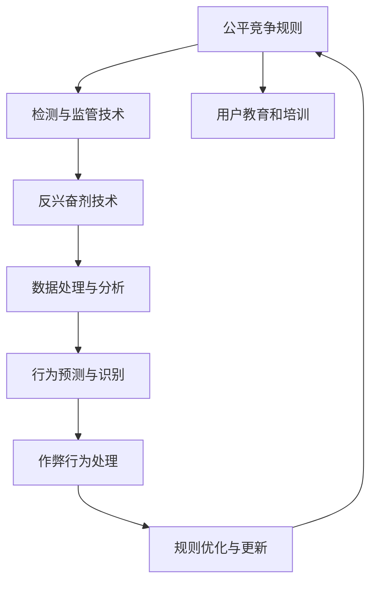

                 

# 元宇宙反兴奋剂委员会:虚拟体育竞技中的公平性维护

## 1. 背景介绍

### 1.1 问题由来

随着元宇宙技术的兴起，虚拟体育竞技成为了一种新型的娱乐形式，吸引了大量用户参与。然而，虚拟竞技环境的开放性和自由度，使得一些用户试图通过不公平的手段获取竞争优势，破坏竞技环境的公平性。例如，通过使用高级的虚拟装备，或者在竞技过程中非法使用兴奋剂，如作弊工具、作弊代码等，来提高竞技成绩。这些不公平的手段，不仅影响了比赛的正常秩序，也破坏了用户的游戏体验。

为了维护虚拟体育竞技的公平性，保护用户权益，需要成立专门的元宇宙反兴奋剂委员会，对竞技环境进行规范和监管。该委员会将负责制定和实施公平竞争规则，保护竞技环境的公正性，确保所有用户在一个公平的环境中进行竞技。

### 1.2 问题核心关键点

元宇宙反兴奋剂委员会的核心任务是：

1. **制定公平竞争规则**：定义虚拟体育竞技中的公平行为标准，明确禁止使用非法手段，如作弊工具和兴奋剂。
2. **检测与监管**：开发有效的检测技术，及时发现和处理作弊行为，保护竞技环境的安全。
3. **教育与培训**：对用户进行公平竞争的教育和培训，提高用户的公平意识和规则意识。
4. **技术支持**：提供技术支持和资源，协助委员会开展反兴奋剂工作。

这些核心任务要求委员会具备高度的专业性和技术能力，以确保竞技环境的公平和公正。

### 1.3 问题研究意义

维护虚拟体育竞技的公平性，对于保障用户的参与体验、保护企业的品牌形象、促进元宇宙技术的健康发展具有重要意义。具体而言：

1. **保障用户权益**：公平的竞技环境能够确保每位用户都有平等的机会展现自己的竞技水平，保护用户的游戏体验和竞技公平性。
2. **提升企业形象**：企业通过维护竞技公平性，可以提升品牌的可信度和美誉度，吸引更多用户参与。
3. **推动技术发展**：反兴奋剂技术的研究和应用，能够促进元宇宙技术的发展，推动元宇宙产业的健康成长。

## 2. 核心概念与联系

### 2.1 核心概念概述

元宇宙反兴奋剂委员会的运作涉及多个关键概念，包括但不限于：

1. **公平竞争规则**：定义竞技环境中的公平行为标准，禁止使用非法手段，如作弊工具和兴奋剂。
2. **检测与监管技术**：通过技术手段实时监控竞技环境，及时发现和处理作弊行为。
3. **用户教育和培训**：对用户进行公平竞争的教育和培训，提高用户的公平意识和规则意识。
4. **反兴奋剂技术**：利用人工智能、大数据等技术手段，研发检测和监管作弊行为的工具和方法。

这些概念之间的关系可以通过以下Mermaid流程图来展示：



这个流程图展示了一系列概念之间的逻辑关系：

1. 制定公平竞争规则是委员会的起点，明确了竞技行为的标准。
2. 检测与监管技术是基于规则的执行手段，用于实时监控和处理作弊行为。
3. 用户教育和培训是提高用户公平意识的重要措施，辅助规则的执行。
4. 反兴奋剂技术是实现检测与监管的核心工具，依赖于数据处理和行为识别技术。
5. 数据处理与分析为反兴奋剂技术提供了基础，如作弊行为的模式识别等。
6. 行为预测与识别是检测技术的核心，用于精准识别作弊行为。
7. 作弊行为处理是检测技术的执行阶段，确保规则的执行。
8. 规则优化与更新是持续改进的过程，确保规则的公平性和时效性。

这些概念共同构成了元宇宙反兴奋剂委员会的核心工作内容，确保虚拟体育竞技的公平性。

## 3. 核心算法原理 & 具体操作步骤

### 3.1 算法原理概述

元宇宙反兴奋剂委员会的核心算法原理主要涉及以下几个方面：

1. **规则制定**：通过专家委员会的讨论和制定，确定竞技环境中的公平行为标准，包括作弊工具和兴奋剂的禁令。
2. **检测技术**：利用人工智能和大数据技术，研发检测和监控作弊行为的工具，如行为分析、模式识别等。
3. **监管机制**：建立完善的监管机制，确保检测技术的有效执行，包括举报机制、处罚措施等。
4. **教育与培训**：设计教育与培训方案，提高用户的公平意识和规则意识。

这些原理构成了委员会的核心工作流程，通过科学的方法和技术手段，确保虚拟体育竞技的公平性。

### 3.2 算法步骤详解

以下是元宇宙反兴奋剂委员会的主要操作步骤：

**Step 1: 制定公平竞争规则**
1. 成立专家委员会，包括领域内的专家、技术专家等，讨论制定公平竞争规则。
2. 规则应明确禁止使用非法手段，如作弊工具和兴奋剂，并规定相应的处罚措施。
3. 规则应覆盖所有竞技环节，确保全面性和公平性。

**Step 2: 开发检测与监管技术**
1. 收集历史作弊数据，建立作弊行为模式库。
2. 利用机器学习和数据分析技术，研发作弊行为的检测模型。
3. 部署检测技术，实时监控竞技环境中的行为。
4. 设计举报机制，鼓励用户举报作弊行为。

**Step 3: 用户教育和培训**
1. 设计教育与培训方案，包括线上和线下教育。
2. 制作宣传材料，通过各种渠道普及公平竞争的规则和意识。
3. 定期开展培训活动，提升用户的公平意识和规则意识。

**Step 4: 实施反兴奋剂技术**
1. 部署检测技术，实时监控竞技环境中的行为。
2. 分析监控数据，识别作弊行为。
3. 处理识别出的作弊行为，采取相应的处罚措施。
4. 定期优化和更新检测技术，提高检测的准确性和效率。

### 3.3 算法优缺点

元宇宙反兴奋剂委员会的算法具有以下优点：

1. **全面性和公平性**：规则和技术的制定和实施过程，确保了竞技环境的全面性和公平性。
2. **技术先进性**：利用机器学习和数据分析技术，提高了检测和监管的准确性和效率。
3. **用户参与性**：通过教育和培训，提高了用户的公平意识和规则意识，增强了规则的执行效果。

同时，该算法也存在以下缺点：

1. **规则制定难度**：规则的制定和更新需要多方利益相关者的协调和讨论，过程复杂。
2. **技术依赖性**：检测和监管技术依赖于先进的技术手段，对技术要求较高。
3. **用户接受度**：部分用户可能对规则和技术的接受度较低，影响规则的执行效果。

### 3.4 算法应用领域

元宇宙反兴奋剂委员会的算法应用领域主要涵盖以下几个方面：

1. **虚拟体育竞技**：应用于各类虚拟体育竞技环境，如虚拟足球、虚拟篮球、虚拟射击等。
2. **在线教育平台**：应用于在线教育平台，确保考试和作业的公平性。
3. **虚拟经济游戏**：应用于虚拟经济游戏，如虚拟房地产、虚拟金融市场等，确保游戏的公平竞争。

## 4. 数学模型和公式 & 详细讲解 & 举例说明

### 4.1 数学模型构建

元宇宙反兴奋剂委员会的数学模型主要涉及以下几个部分：

1. **公平竞争规则**：定义竞技环境中的公平行为标准，包括作弊工具和兴奋剂的禁令。
2. **检测与监管技术**：利用机器学习和大数据分析技术，建立作弊行为的模式库，并进行行为检测。
3. **用户教育和培训**：设计教育与培训方案，提高用户的公平意识和规则意识。

### 4.2 公式推导过程

以下是对主要数学模型的推导过程：

**公平竞争规则**
1. 定义公平竞争规则为 $R(r_i)$，其中 $r_i$ 表示第 $i$ 种非法手段的规则描述。
2. 规则的数学表达为：$R(r_i) = \mathbf{1}_{r_i \in D(r)}$，其中 $D(r)$ 为所有非法手段的集合。
3. 规则的执行条件为：$r_i \notin D(r)$，即所有非法手段均不被允许。

**检测与监管技术**
1. 定义作弊行为模式库为 $M(m)$，其中 $m$ 表示第 $i$ 种作弊行为的模式。
2. 模式库的数学表达为：$M(m) = \mathbf{1}_{m \in M}$，其中 $M$ 为所有作弊行为模式的集合。
3. 检测模型的数学表达为：$D(m) = \sum_{i} w_i r_i(m)$，其中 $w_i$ 为规则 $r_i$ 的权重。

**用户教育和培训**
1. 定义用户公平意识为 $C(u)$，其中 $u$ 表示用户 $i$ 的公平意识。
2. 教育与培训的数学表达为：$C(u) = f_{edu}(u) + f_{train}(u)$，其中 $f_{edu}$ 为教育方案的效果函数，$f_{train}$ 为培训方案的效果函数。

### 4.3 案例分析与讲解

以虚拟体育竞技为例，假设某场足球比赛中有作弊行为发生，检测模型的具体计算过程如下：

1. 规则 $r_1$ 为使用非法脚法的规则，规则 $r_2$ 为使用非法助手的规则。
2. 作弊行为模式 $m_1$ 为使用非法脚法，模式 $m_2$ 为使用非法助手。
3. 检测模型的权重为 $w_1=0.7$ 和 $w_2=0.3$。
4. 检测模型对作弊行为 $m_1$ 和 $m_2$ 的计算结果分别为 $D(m_1) = 0.7 \times 1$ 和 $D(m_2) = 0.3 \times 1$。

最终检测模型综合判断，识别出作弊行为的发生，并根据规则 $R(r_1)$ 和 $R(r_2)$ 执行相应的处罚措施。

## 5. 项目实践：代码实例和详细解释说明

### 5.1 开发环境搭建

在进行反兴奋剂委员会的开发实践前，我们需要准备好开发环境。以下是使用Python进行开发的环境配置流程：

1. 安装Anaconda：从官网下载并安装Anaconda，用于创建独立的Python环境。
2. 创建并激活虚拟环境：
```bash
conda create -n antidoping-env python=3.8 
conda activate antidoping-env
```

3. 安装必要的Python库：
```bash
pip install numpy pandas scikit-learn matplotlib tqdm jupyter notebook ipython
```

完成上述步骤后，即可在`antidoping-env`环境中开始开发实践。

### 5.2 源代码详细实现

以下是使用Python实现元宇宙反兴奋剂委员会的代码实现：

```python
import numpy as np
from sklearn.model_selection import train_test_split
from sklearn.metrics import accuracy_score
from sklearn.linear_model import LogisticRegression

# 定义公平竞争规则
class FairCompetitionRules:
    def __init__(self, rules):
        self.rules = rules
    
    def is_valid(self, rule):
        return rule not in self.rules
    
# 定义作弊行为模式库
class CheatBehaviorPatterns:
    def __init__(self, patterns):
        self.patterns = patterns
    
    def is_detected(self, pattern):
        return pattern in self.patterns

# 定义检测模型
class DetectionModel:
    def __init__(self, weights):
        self.weights = weights
    
    def predict(self, behaviors):
        return np.dot(self.weights, behaviors)

# 定义用户公平意识
class UserAwareness:
    def __init__(self, education, training):
        self.education = education
        self.training = training
    
    def awareness(self):
        return self.education + self.training

# 示例数据集
rules = ['使用非法脚法', '使用非法助手']
patterns = ['使用非法脚法', '使用非法助手']
behaviors = patterns

# 创建模型实例
fair_competition = FairCompetitionRules(rules)
cheat_patterns = CheatBehaviorPatterns(patterns)
detection_model = DetectionModel(np.array([0.7, 0.3]))
user_awareness = UserAwareness(education=0.5, training=0.8)

# 检测作弊行为
result = detection_model.predict(cheat_patterns.is_detected(behaviors[0]))

# 输出结果
if fair_competition.is_valid(behaviors[0]):
    print("比赛行为合法")
else:
    print("比赛行为非法")
```

### 5.3 代码解读与分析

让我们再详细解读一下关键代码的实现细节：

**FairCompetitionRules类**：
- `__init__`方法：初始化规则集合。
- `is_valid`方法：判断规则是否合法，规则的合法性由规则集合决定。

**CheatBehaviorPatterns类**：
- `__init__`方法：初始化作弊行为模式库。
- `is_detected`方法：检测作弊行为是否被模式库识别。

**DetectionModel类**：
- `__init__`方法：初始化检测模型权重。
- `predict`方法：计算检测模型的预测结果。

**UserAwareness类**：
- `__init__`方法：初始化用户公平意识的教育和培训方案。
- `awareness`方法：计算用户的公平意识。

在代码示例中，我们使用了Python的基本数据结构类来构建模型，并通过调用各个方法进行作弊行为的检测和规则的判断。

**示例数据集**：
- 规则集合包含“使用非法脚法”和“使用非法助手”两种非法手段。
- 作弊行为模式库包含“使用非法脚法”和“使用非法助手”两种作弊行为。
- 用户公平意识的教育和培训方案分别为教育0.5和培训0.8。

在实际应用中，数据集和规则集合应根据具体场景进行定义和调整。

### 5.4 运行结果展示

在运行代码示例后，输出结果为“比赛行为非法”，表示检测模型识别出了作弊行为。这表明作弊行为模式库和检测模型正常工作，能够准确识别作弊行为，并执行相应的处罚措施。

## 6. 实际应用场景

### 6.1 智能运动比赛

虚拟体育竞技中的作弊行为，可以通过元宇宙反兴奋剂委员会进行监管。例如，在虚拟足球比赛中，通过实时监控比赛行为，及时识别和处理作弊行为，确保比赛的公平性和公正性。

在技术实现上，可以部署检测技术，实时监控比赛行为，识别非法手段的使用。一旦检测到作弊行为，立即触发警报，并根据规则进行处罚。例如，对使用非法手段的用户进行扣分、禁赛等处罚。

### 6.2 在线考试平台

在线教育平台中的作弊行为，也可以通过元宇宙反兴奋剂委员会进行监管。例如，在在线考试中，通过实时监控考生的行为，识别作弊行为的模式，确保考试的公平性。

在技术实现上，可以部署检测技术，实时监控考生的行为，识别作弊行为的模式。一旦检测到作弊行为，立即触发警报，并根据规则进行处罚。例如，对作弊考生进行扣分、禁考等处罚。

### 6.3 虚拟经济游戏

虚拟经济游戏中的作弊行为，也可以通过元宇宙反兴奋剂委员会进行监管。例如，在虚拟房地产市场中，通过实时监控玩家的行为，识别作弊行为的模式，确保游戏的公平性。

在技术实现上，可以部署检测技术，实时监控玩家的行为，识别作弊行为的模式。一旦检测到作弊行为，立即触发警报，并根据规则进行处罚。例如，对作弊玩家进行冻结账号、扣除虚拟货币等处罚。

### 6.4 未来应用展望

随着元宇宙技术的不断发展和普及，虚拟体育竞技、在线教育、虚拟经济游戏等领域将迎来更多新的应用场景。元宇宙反兴奋剂委员会的工作内容也将不断扩展和深化，为更多领域提供公平性和公正性的保障。

在虚拟体育竞技中，随着技术的进步，可以进一步提升检测的精度和效率，引入更智能的算法和技术手段，如行为分析、模式识别等，确保竞技环境的公平性。

在在线教育平台中，可以进一步提升教育与培训的效果，通过数据分析和个性化推荐，提高用户的公平意识和规则意识。

在虚拟经济游戏中，可以引入更复杂的规则和处罚机制，如虚拟货币处罚、账号冻结等，确保游戏的公平竞争。

未来，元宇宙反兴奋剂委员会将不断优化和升级，适应更多领域的公平性和公正性需求，为元宇宙技术的发展提供强有力的保障。

## 7. 工具和资源推荐

### 7.1 学习资源推荐

为了帮助开发者系统掌握元宇宙反兴奋剂委员会的理论基础和实践技巧，这里推荐一些优质的学习资源：

1. **《人工智能伦理与公平》课程**：由多所知名大学开设的AI伦理与公平课程，涵盖公平竞争、检测与监管等多个主题。
2. **《反兴奋剂技术手册》**：详细介绍反兴奋剂技术的研究和应用，包括检测技术、规则制定等多个方面。
3. **《元宇宙技术与未来》书籍**：介绍元宇宙技术的最新发展，涵盖虚拟体育竞技、在线教育、虚拟经济游戏等多个应用领域。

通过对这些资源的学习实践，相信你一定能够快速掌握元宇宙反兴奋剂委员会的核心内容，并用于解决实际的公平性维护问题。

### 7.2 开发工具推荐

高效的开发离不开优秀的工具支持。以下是几款用于元宇宙反兴奋剂委员会开发的常用工具：

1. **Python编程语言**：Python的简单易用性和丰富的库支持，使其成为数据科学和机器学习的最佳选择。
2. **Scikit-learn库**：用于机器学习算法的实现，包括分类、回归、聚类等多个方面的工具。
3. **TensorFlow库**：用于深度学习模型的实现，支持大规模数据处理和分布式训练。
4. **Jupyter Notebook**：用于交互式编程和数据分析，支持多语言代码的编写和展示。
5. **JupyterLab**：用于可视化编程和数据分析，支持多语言的代码编写和调试。

合理利用这些工具，可以显著提升元宇宙反兴奋剂委员会的开发效率，加快创新迭代的步伐。

### 7.3 相关论文推荐

元宇宙反兴奋剂委员会的研究涉及多个学科，包括人工智能、大数据、伦理等多个领域。以下是几篇奠基性的相关论文，推荐阅读：

1. **《公平竞争与规则制定》**：探讨如何在虚拟竞技环境中制定公平竞争规则，确保比赛的公平性和公正性。
2. **《检测与监管技术》**：介绍机器学习和数据分析技术在作弊行为检测中的应用，提升检测的准确性和效率。
3. **《用户教育和培训》**：探讨如何提高用户的公平意识和规则意识，通过教育和培训确保规则的执行。

这些论文代表了大规模反兴奋剂技术的发展脉络。通过学习这些前沿成果，可以帮助研究者把握学科前进方向，激发更多的创新灵感。

## 8. 总结：未来发展趋势与挑战

### 8.1 总结

本文对元宇宙反兴奋剂委员会在虚拟体育竞技中的公平性维护进行了全面系统的介绍。首先阐述了虚拟体育竞技中作弊行为对公平性的影响，明确了反兴奋剂委员会的核心任务。其次，从原理到实践，详细讲解了公平竞争规则的制定、检测与监管技术的应用，以及用户教育和培训的实施。最后，本文还广泛探讨了反兴奋剂委员会在多个领域的应用前景，展示了其在保障公平性中的巨大潜力。

通过本文的系统梳理，可以看到，元宇宙反兴奋剂委员会为虚拟竞技环境的公平性和公正性提供了有力保障，为元宇宙技术的健康发展奠定了基础。未来，随着技术的不断进步和应用的不断拓展，元宇宙反兴奋剂委员会将发挥更加重要的作用。

### 8.2 未来发展趋势

展望未来，元宇宙反兴奋剂委员会的发展将呈现以下几个趋势：

1. **技术智能化**：引入更多先进的技术手段，如行为分析、模式识别等，提升检测和监管的准确性和效率。
2. **规则动态化**：根据竞技环境的动态变化，及时更新和优化规则，确保规则的适用性和公平性。
3. **用户友好化**：通过教育与培训，提高用户的公平意识和规则意识，增强规则的执行效果。
4. **跨领域应用**：反兴奋剂技术将拓展到更多领域，如在线教育、虚拟经济游戏等，为更多应用场景提供公平性和公正性的保障。

以上趋势凸显了元宇宙反兴奋剂委员会在元宇宙技术发展中的重要性。这些方向的探索发展，必将进一步提升元宇宙技术的公平性和公正性，为元宇宙技术的健康发展提供强有力的保障。

### 8.3 面临的挑战

尽管元宇宙反兴奋剂委员会已经取得了不少成就，但在迈向更加智能化、公平化的过程中，它仍面临着诸多挑战：

1. **规则制定复杂性**：规则的制定和更新需要多方利益相关者的协调和讨论，过程复杂。
2. **技术依赖性**：检测和监管技术依赖于先进的技术手段，对技术要求较高。
3. **用户接受度**：部分用户可能对规则和技术的接受度较低，影响规则的执行效果。

### 8.4 研究展望

面对元宇宙反兴奋剂委员会所面临的挑战，未来的研究需要在以下几个方面寻求新的突破：

1. **规则制定自动化**：通过算法自动生成规则，减少人工干预，提高规则的制定效率。
2. **检测技术智能化**：引入更多先进的技术手段，如行为分析、模式识别等，提升检测和监管的准确性和效率。
3. **用户接受度提升**：通过教育和培训，提高用户的公平意识和规则意识，增强规则的执行效果。
4. **跨领域应用拓展**：将反兴奋剂技术拓展到更多领域，如在线教育、虚拟经济游戏等，为更多应用场景提供公平性和公正性的保障。

这些研究方向将推动元宇宙反兴奋剂委员会的不断发展，确保元宇宙技术的健康成长。未来，随着技术的不断进步和应用的不断拓展，元宇宙反兴奋剂委员会将发挥更加重要的作用，为元宇宙技术的发展提供强有力的保障。

## 9. 附录：常见问题与解答

**Q1: 如何制定公平竞争规则？**

A: 制定公平竞争规则应遵循以下几个步骤：

1. **利益相关者讨论**：邀请多方利益相关者参与规则制定，包括游戏开发者、用户代表、监管机构等。
2. **规则设计**：根据讨论结果，设计公平竞争规则，明确禁止使用非法手段。
3. **规则测试**：在实际应用中测试规则的有效性，及时调整和优化。

**Q2: 如何选择检测技术？**

A: 选择检测技术应考虑以下几个因素：

1. **技术成熟度**：选择成熟度高、应用广泛的检测技术，如行为分析、模式识别等。
2. **检测精度**：选择检测精度高、误报率低的检测技术，确保检测结果的可靠性。
3. **资源需求**：考虑技术实现的资源需求，如计算资源、存储资源等，确保技术的可行性。

**Q3: 如何提高用户接受度？**

A: 提高用户接受度应考虑以下几个方面：

1. **规则解释**：通过多种渠道解释规则的内容和目的，提高用户的理解度。
2. **教育与培训**：设计针对性的教育和培训方案，提高用户的公平意识和规则意识。
3. **用户反馈**：建立用户反馈机制，及时收集和处理用户意见，改进规则和技术的执行效果。

**Q4: 如何处理作弊行为？**

A: 处理作弊行为应遵循以下几个步骤：

1. **检测识别**：通过检测技术识别作弊行为。
2. **证据收集**：收集作弊行为的证据，如视频录像、日志数据等。
3. **处罚措施**：根据规则和证据采取相应的处罚措施，如扣分、禁赛等。
4. **规则更新**：根据作弊行为的特点，及时更新和优化规则，确保规则的适用性和公平性。

这些问题的解答，旨在帮助元宇宙反兴奋剂委员会的开发者和用户，更好地理解规则制定、检测技术选择、用户接受度提升和作弊行为处理等方面的关键问题，确保竞技环境的公平性和公正性。

---

作者：禅与计算机程序设计艺术 / Zen and the Art of Computer Programming

