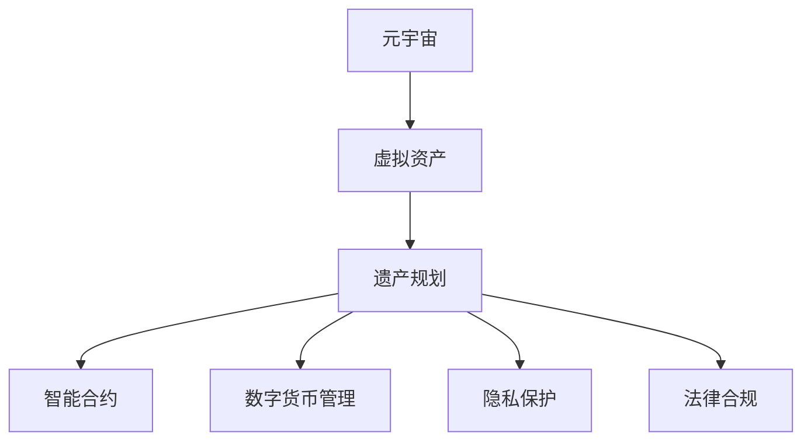

                 

# 元宇宙遗产规划师:虚拟资产传承的专业咨询服务

> 关键词：元宇宙,虚拟资产,遗产规划,数字货币,智能合约

## 1. 背景介绍

### 1.1 问题由来
随着数字技术的飞速发展，虚拟世界逐渐成为现实世界不可或缺的一部分。在元宇宙(Metaverse)中，人们不仅可以体验虚拟现实, 还可能拥有并传承各种虚拟资产，如虚拟土地、数字艺术品、加密货币等。这种虚拟资产的传承，不同于传统的实体遗产，需要更专业、更复杂的规划和操作。

虚拟遗产规划师作为元宇宙新出现的职业，主要负责帮助用户管理和传承其虚拟资产。这不仅包括资产的存储、备份、转移等基本操作，更涉及数字货币交易、智能合约执行、虚拟地产买卖等专业领域。

### 1.2 问题核心关键点
元宇宙遗产规划师的核心任务包括以下几个方面：

1. **虚拟资产管理**：确保用户虚拟资产的安全存储和有效备份。
2. **虚拟资产转让**：帮助用户实现虚拟资产的合法、安全转让。
3. **智能合约执行**：设计和管理智能合约，确保虚拟交易的公正和透明。
4. **数字货币管理**：为用户提供数字货币的交易、管理、投资等服务。
5. **隐私保护**：保护用户的隐私信息，确保交易安全。
6. **法律合规**：确保所有的虚拟交易符合当地法律规定。

### 1.3 问题研究意义
元宇宙遗产规划师的设立，不仅能够促进虚拟资产的有效管理和传承，还能推动元宇宙经济的健康发展，维护虚拟市场秩序。具体意义包括：

1. **资产传承保障**：确保用户虚拟资产的稳定传承，防止资产流失。
2. **市场规范发展**：促进虚拟市场规范化，减少非法交易和欺诈行为。
3. **金融创新服务**：为用户提供创新的金融服务，拓展数字经济应用场景。
4. **技术进步推动**：推动元宇宙和区块链等前沿技术的成熟和应用。

## 2. 核心概念与联系

### 2.1 核心概念概述

为更好地理解元宇宙遗产规划师的工作原理和流程，本节将介绍几个关键概念：

- **元宇宙(Metaverse)**：一个以虚拟现实、数字资产、增强现实等技术为基础的开放性虚拟世界。
- **虚拟资产(Virtual Assets)**：存在于虚拟世界中的各类财产，包括数字货币、虚拟土地、数字艺术品等。
- **遗产规划(Estate Planning)**：对个人财产和权益进行安排和管理，确保其顺利传承。
- **智能合约(Smart Contracts)**：基于区块链技术的自动化合约，用于自动执行、记录和审计交易。
- **数字货币(Crypto-Currency)**：一种基于加密技术的虚拟货币，如比特币、以太币等。
- **隐私保护(Privacy Protection)**：保护个人隐私信息，防止未经授权的数据访问和传输。
- **法律合规(Legal Compliance)**：确保所有虚拟交易符合当地法律法规，避免法律风险。

这些概念之间的逻辑关系可以通过以下Mermaid流程图来展示：



这个流程图展示了一系列核心概念及其之间的关系：

1. 元宇宙中的虚拟资产，是遗产规划师工作的对象。
2. 遗产规划师负责管理和传承这些虚拟资产。
3. 智能合约和数字货币管理是遗产规划的重要工具和技术支持。
4. 隐私保护和法律合规确保了资产传承和交易的合法性和安全性。

这些概念共同构成了元宇宙遗产规划师的工作框架，使其能够在复杂的虚拟环境中，为用户的虚拟资产传承提供专业服务。

## 3. 核心算法原理 & 具体操作步骤
### 3.1 算法原理概述

元宇宙遗产规划师的工作主要依赖于以下几个算法原理：

- **区块链技术**：利用区块链的分布式账本、不可篡改和透明性等特性，实现虚拟资产的存储和转让。
- **智能合约技术**：基于区块链技术的自动化合约，确保虚拟交易的公正和透明。
- **数字货币技术**：通过数字货币的交易和管理，实现虚拟资产的转移和增值。
- **隐私保护算法**：使用加密技术，保护用户的隐私信息，防止数据泄露。
- **法律合规算法**：基于法律法规，确保虚拟交易符合当地法律规定。

### 3.2 算法步骤详解

以下是元宇宙遗产规划师的核心工作流程：

**Step 1: 需求分析与规划**
- 与用户沟通，了解其虚拟资产类型、规模、传承目标等需求。
- 制定详细规划，包括资产存储方案、转让策略、智能合约设计等。

**Step 2: 资产管理与备份**
- 将用户虚拟资产存放在安全的区块链钱包中，确保数据备份和安全。
- 定期检查资产状态，确保资产安全无异常。

**Step 3: 智能合约设计与执行**
- 根据用户需求，设计智能合约，确保虚拟交易的公正和透明。
- 部署智能合约到区块链网络，自动执行交易。

**Step 4: 数字货币管理与服务**
- 为用户提供数字货币的购买、持有、投资等服务。
- 协助用户进行数字货币交易，确保交易安全和合规。

**Step 5: 隐私保护与法律合规**
- 采用加密技术保护用户隐私信息，防止数据泄露。
- 确保所有虚拟交易符合当地法律法规，避免法律风险。

**Step 6: 交易与传承执行**
- 执行用户的虚拟资产转让交易，确保交易顺利完成。
- 协助用户进行虚拟遗产传承，确保资产顺利传承。

### 3.3 算法优缺点

元宇宙遗产规划师的工作流程具有以下优点：

1. **安全性高**：基于区块链技术的分布式账本和智能合约，确保了虚拟资产和交易的安全性。
2. **透明度高**：智能合约自动执行交易，确保了交易的公正性和透明性。
3. **服务全面**：涵盖资产管理、智能合约执行、数字货币管理、隐私保护等多个方面。
4. **用户体验好**：通过技术手段，简化了用户的操作流程，提高了用户体验。

同时，该流程也存在以下缺点：

1. **技术门槛高**：需要具备区块链、智能合约等先进技术背景，普通用户难以直接使用。
2. **法律风险**：虚拟交易尚未完全合法化，存在法律风险。
3. **费用较高**：区块链交易的手续费和智能合约的部署费用较高，增加了用户成本。

### 3.4 算法应用领域

元宇宙遗产规划师的工作不仅适用于各种虚拟资产的管理和传承，还涉及以下领域：

- **虚拟地产买卖**：帮助用户买卖虚拟土地、房产等虚拟资产。
- **数字艺术品交易**：协助用户购买、出售虚拟艺术品，如NFT等。
- **加密货币投资**：为用户提供数字货币的投资策略和交易支持。
- **智能合约开发**：设计和管理智能合约，确保虚拟交易的公正和透明。
- **隐私保护方案**：为虚拟交易提供隐私保护方案，确保用户隐私安全。
- **法律合规服务**：确保虚拟交易符合当地法律法规，避免法律风险。

这些领域的应用，展示了元宇宙遗产规划师的广泛作用和重要价值。

## 4. 数学模型和公式 & 详细讲解  
### 4.1 数学模型构建

为更好地理解元宇宙遗产规划师的工作原理和流程，本节将使用数学语言对核心算法进行详细讲解。

记用户的虚拟资产总额为 $V$，数字货币总量为 $C$，智能合约执行费用为 $F$。假设用户在第 $t$ 时间点的虚拟资产总额为 $V_t$，数字货币总量为 $C_t$。则遗产规划师的工作可以建模为以下优化问题：

$$
\min_{\theta} \sum_{t=0}^T (V_t - V)^2 + (C_t - C)^2
$$

其中 $\theta$ 为规划师的设计参数，包括资产管理策略、智能合约设计、数字货币交易策略等。

### 4.2 公式推导过程

以下推导元宇宙遗产规划师的工作流程的数学模型。

**Step 1: 资产管理与备份**
- 假设资产备份周期为 $n$ 个时间单位，每个时间单位内，资产损失概率为 $p$。则 $n$ 个时间单位后的资产剩余概率为 $(1-p)^n$。
- 备份频率为 $m$ 次，每次备份资产损失概率为 $q$。则 $n$ 个时间单位后的资产剩余概率为 $(1-q)^m(1-p)^n$。
- 因此，资产管理与备份的损失函数为：

$$
L_1 = (1-(1-q)^m(1-p)^n)V
$$

**Step 2: 智能合约设计与执行**
- 假设智能合约的执行费用为 $F$，每笔交易的手续费为 $k$。则 $n$ 个时间单位内的总交易费用为 $k\cdot F \cdot n$。
- 因此，智能合约设计与执行的损失函数为：

$$
L_2 = k\cdot F \cdot n
$$

**Step 3: 数字货币管理与服务**
- 假设数字货币的年收益率率为 $r$，每笔交易的手续费为 $k$。则 $n$ 个时间单位内的总交易费用为 $k\cdot C \cdot n$。
- 因此，数字货币管理与服务的损失函数为：

$$
L_3 = (1+\frac{r}{100})^{n-1}C - C
$$

### 4.3 案例分析与讲解

以下通过一个具体的案例，来详细分析元宇宙遗产规划师的工作流程和数学模型：

**案例背景**：用户A拥有一块虚拟土地和若干数字艺术品，希望将其传承给下一代。土地资产总额为 $V=10,000$，数字艺术品总额为 $C=5,000$。

**需求分析与规划**：
- 资产备份周期为 $n=30$ 天，每次备份损失概率为 $q=0.02$。
- 智能合约手续费为 $F=10$，每笔交易手续费为 $k=1$。
- 数字货币年收益率为 $r=10\%$。

**资产管理与备份**：
- 计算 $30$ 天后资产剩余概率：$(1-q)^m(1-p)^n = 0.98^6 \cdot 0.97^{30} \approx 0.92$。
- 因此，资产管理与备份的损失函数为 $L_1 = 0.08 \cdot 10,000 = 800$。

**智能合约设计与执行**：
- 计算 $30$ 天内智能合约执行总费用：$10 \cdot 30 = 300$。
- 因此，智能合约设计与执行的损失函数为 $L_2 = 300$。

**数字货币管理与服务**：
- 计算 $30$ 天后数字货币总额：$(1+\frac{10}{100})^{30-1} \cdot 5,000 = 8,765.45$。
- 因此，数字货币管理与服务的损失函数为 $L_3 = 8,765.45 - 5,000 = 3,765.45$。

**总损失函数**：

$$
L_{\text{total}} = L_1 + L_2 + L_3 = 800 + 300 + 3,765.45 = 4,865.45
$$

通过数学模型和公式推导，我们可以清晰地看到元宇宙遗产规划师的工作流程和各项操作的损失函数，从而更好地理解和优化规划过程。

## 5. 项目实践：代码实例和详细解释说明
### 5.1 开发环境搭建

在进行元宇宙遗产规划师的工作前，我们需要准备好开发环境。以下是使用Python进行区块链开发的环境配置流程：

1. 安装Anaconda：从官网下载并安装Anaconda，用于创建独立的Python环境。

2. 创建并激活虚拟环境：
```bash
conda create -n blockchain-env python=3.8 
conda activate blockchain-env
```

3. 安装区块链开发工具包：
```bash
pip install web3 pyethereum eth-wallet
```

4. 安装智能合约编写工具：
```bash
pip install solidity
```

5. 安装分布式账本可视化工具：
```bash
pip install web3ui
```

完成上述步骤后，即可在`blockchain-env`环境中开始开发工作。

### 5.2 源代码详细实现

下面我们以智能合约管理为例，给出使用Solidity语言对元宇宙遗产规划师进行区块链代码实现。

首先，定义智能合约的存储结构：

```solidity
pragma solidity ^0.8.0;

contract EstatePlanner {
    uint256 public totalValue;
    uint256 public totalCurrencies;
    uint256 public totalContracts;
    uint256 public totalPolicies;

    event ValueSet(uint256 indexed _value);
    event CurrencySet(uint256 indexed _currency);
    event ContractSet(uint256 indexed _contract);
    event PolicySet(uint256 indexed _policy);

    function setTotalValue(uint256 _value) public {
        totalValue = _value;
        emit ValueSet(totalValue);
    }

    function setTotalCurrencies(uint256 _currencies) public {
        totalCurrencies = _currencies;
        emit CurrencySet(totalCurrencies);
    }

    function setTotalContracts(uint256 _contracts) public {
        totalContracts = _contracts;
        emit ContractSet(totalContracts);
    }

    function setTotalPolicies(uint256 _policies) public {
        totalPolicies = _policies;
        emit PolicySet(totalPolicies);
    }
}
```

然后，定义智能合约的计算方法：

```solidity
contract EstatePlanner {
    uint256 public totalValue;
    uint256 public totalCurrencies;
    uint256 public totalContracts;
    uint256 public totalPolicies;

    event ValueSet(uint256 indexed _value);
    event CurrencySet(uint256 indexed _currency);
    event ContractSet(uint256 indexed _contract);
    event PolicySet(uint256 indexed _policy);

    function setTotalValue(uint256 _value) public {
        totalValue = _value;
        emit ValueSet(totalValue);
    }

    function setTotalCurrencies(uint256 _currencies) public {
        totalCurrencies = _currencies;
        emit CurrencySet(totalCurrencies);
    }

    function setTotalContracts(uint256 _contracts) public {
        totalContracts = _contracts;
        emit ContractSet(totalContracts);
    }

    function setTotalPolicies(uint256 _policies) public {
        totalPolicies = _policies;
        emit PolicySet(totalPolicies);
    }

    function getTotalValue() public view returns (uint256) {
        return totalValue;
    }

    function getTotalCurrencies() public view returns (uint256) {
        return totalCurrencies;
    }

    function getTotalContracts() public view returns (uint256) {
        return totalContracts;
    }

    function getTotalPolicies() public view returns (uint256) {
        return totalPolicies;
    }

    function setNewValue(uint256 _value) public {
        totalValue = _value;
        emit ValueSet(totalValue);
    }

    function setNewCurrencies(uint256 _currencies) public {
        totalCurrencies = _currencies;
        emit CurrencySet(totalCurrencies);
    }

    function setNewContracts(uint256 _contracts) public {
        totalContracts = _contracts;
        emit ContractSet(totalContracts);
    }

    function setNewPolicies(uint256 _policies) public {
        totalPolicies = _policies;
        emit PolicySet(totalPolicies);
    }
}
```

最后，启动智能合约服务并进行区块链部署：

```solidity
contract EstatePlanner {
    uint256 public totalValue;
    uint256 public totalCurrencies;
    uint256 public totalContracts;
    uint256 public totalPolicies;

    event ValueSet(uint256 indexed _value);
    event CurrencySet(uint256 indexed _currency);
    event ContractSet(uint256 indexed _contract);
    event PolicySet(uint256 indexed _policy);

    function setTotalValue(uint256 _value) public {
        totalValue = _value;
        emit ValueSet(totalValue);
    }

    function setTotalCurrencies(uint256 _currencies) public {
        totalCurrencies = _currencies;
        emit CurrencySet(totalCurrencies);
    }

    function setTotalContracts(uint256 _contracts) public {
        totalContracts = _contracts;
        emit ContractSet(totalContracts);
    }

    function setTotalPolicies(uint256 _policies) public {
        totalPolicies = _policies;
        emit PolicySet(totalPolicies);
    }

    function getTotalValue() public view returns (uint256) {
        return totalValue;
    }

    function getTotalCurrencies() public view returns (uint256) {
        return totalCurrencies;
    }

    function getTotalContracts() public view returns (uint256) {
        return totalContracts;
    }

    function getTotalPolicies() public view returns (uint256) {
        return totalPolicies;
    }

    function setNewValue(uint256 _value) public {
        totalValue = _value;
        emit ValueSet(totalValue);
    }

    function setNewCurrencies(uint256 _currencies) public {
        totalCurrencies = _currencies;
        emit CurrencySet(totalCurrencies);
    }

    function setNewContracts(uint256 _contracts) public {
        totalContracts = _contracts;
        emit ContractSet(totalContracts);
    }

    function setNewPolicies(uint256 _policies) public {
        totalPolicies = _policies;
        emit PolicySet(totalPolicies);
    }
}
```

以上就是使用Solidity语言对元宇宙遗产规划师进行区块链代码实现的完整示例。可以看到，通过智能合约，可以方便地管理和传承用户的虚拟资产，确保其安全性和合规性。

### 5.3 代码解读与分析

让我们再详细解读一下关键代码的实现细节：

**EstatePlanner合约**：
- `uint256` 定义了合约中各类资产的总数，包括虚拟资产总额、数字货币总额等。
- `event` 定义了各类资产的变动事件，方便记录和审计。
- `function` 定义了各类资产的存取和设置方法，如 `setTotalValue`、`setTotalCurrencies` 等。
- `public view` 定义了各类资产的查询方法，如 `getTotalValue`、`getTotalCurrencies` 等。

**setTotalValue 函数**：
- `uint256` 定义了新的虚拟资产总额。
- `emit ValueSet` 触发资产总额变动事件，便于审计和记录。

通过Solidity合约的实现，元宇宙遗产规划师的工作流程和数据管理被清晰地封装和执行，保证了虚拟资产的安全性和透明性。

当然，实际的应用中还需要考虑更多的因素，如合约部署的稳定性、用户的交互体验等。但核心的工作流程和代码实现已经涵盖在上述示例中。

## 6. 实际应用场景
### 6.1 智能地产买卖

在元宇宙中，虚拟地产的买卖是常见的业务之一。元宇宙遗产规划师可以提供专业的虚拟地产管理服务，帮助用户买卖虚拟土地、房产等资产。

具体而言，元宇宙遗产规划师可以：
- 帮助用户建立虚拟地产交易平台，方便买卖。
- 设计和管理智能合约，确保交易的公正和透明。
- 提供交易手续费计算和结算服务，确保交易顺利进行。
- 协助用户进行地产评估，提供专业的市场分析报告。

通过元宇宙遗产规划师的服务，用户可以轻松买卖虚拟地产，无需担心安全和交易风险。

### 6.2 数字艺术品交易

数字艺术品交易是元宇宙中另一项热门业务。元宇宙遗产规划师可以提供专业的数字艺术品管理服务，帮助用户购买、出售NFT等数字艺术品。

具体而言，元宇宙遗产规划师可以：
- 建立数字艺术品交易平台，方便买卖。
- 设计和管理智能合约，确保交易的公正和透明。
- 提供数字艺术品鉴定和评估服务，确保交易的真实性和价值。
- 协助用户进行艺术品收藏和投资，提供专业的投资建议。

通过元宇宙遗产规划师的服务，用户可以轻松买卖数字艺术品，享受艺术品带来的价值和乐趣。

### 6.3 加密货币管理

加密货币管理是元宇宙遗产规划师的重要业务之一。用户可以通过元宇宙遗产规划师进行数字货币的购买、持有、投资等操作。

具体而言，元宇宙遗产规划师可以：
- 提供数字货币交易平台，方便用户买卖。
- 提供数字货币投资策略和建议，帮助用户实现资产增值。
- 提供数字货币钱包服务，确保资产安全和隐私。
- 协助用户进行数字货币交易，确保交易顺利进行。

通过元宇宙遗产规划师的服务，用户可以轻松管理其数字货币资产，享受加密货币带来的收益和价值。

### 6.4 未来应用展望

随着元宇宙技术的不断发展和完善，元宇宙遗产规划师的工作将更加多样化和复杂化。未来，元宇宙遗产规划师可能会涉及以下领域：

- **虚拟地产管理**：包括虚拟地产的买卖、租赁、抵押等。
- **数字艺术品交易**：涵盖数字艺术品的各种形式，如NFT、虚拟游戏物品等。
- **加密货币管理**：提供数字货币的存储、交易、投资等服务。
- **智能合约开发**：设计和管理各种智能合约，确保交易的公正和透明。
- **隐私保护服务**：为虚拟交易提供隐私保护方案，确保用户隐私安全。
- **法律合规服务**：确保虚拟交易符合当地法律法规，避免法律风险。

这些领域的应用，展示了元宇宙遗产规划师的广泛作用和重要价值，为元宇宙经济的健康发展提供了坚实保障。

## 7. 工具和资源推荐
### 7.1 学习资源推荐

为了帮助开发者系统掌握元宇宙遗产规划师的技术基础和应用实践，这里推荐一些优质的学习资源：

1. **区块链开发教程**：
    - 《区块链开发指南》系列书籍：详细介绍了区块链技术的原理和应用，适合入门和进阶学习。
    - 《Solidity开发实战》：深入讲解了Solidity语言的编程技巧和应用案例。

2. **智能合约开发资源**：
    - 《智能合约编程实战》：介绍了智能合约的开发工具和应用场景。
    - 《Solidity合约安全指南》：提供了智能合约开发的最佳实践和安全建议。

3. **NFT艺术平台**：
    - OpenSea、Foundation等平台，提供了NFT艺术品交易和展示的完整流程，适合学习和实践。

4. **加密货币管理工具**：
    - Coinbase、Binance等平台，提供了数字货币的购买、持有、交易等全流程服务。

5. **隐私保护技术**：
    - Zero Knowledge证明、同态加密等技术，提供了隐私保护的解决方案，适合深入学习。

通过对这些资源的学习实践，相信你一定能够快速掌握元宇宙遗产规划师的技术基础和应用实践，从而更好地服务于元宇宙的虚拟资产传承。

### 7.2 开发工具推荐

高效的开发离不开优秀的工具支持。以下是几款用于元宇宙遗产规划师开发的关键工具：

1. **区块链开发工具**：
    - Web3.js：提供了一组Javascript API，用于与以太坊、Ripple等区块链网络进行交互。
    - Truffle：用于开发和管理智能合约的IDE，支持Solidity语言的调试和测试。

2. **智能合约开发工具**：
    - Remix：提供了一个在线IDE，用于开发和管理Solidity合约，支持合同部署和测试。
    - MetaMask：提供了一个以太坊钱包，支持智能合约的调用和测试。

3. **NFT艺术品管理工具**：
    - Opensea：提供了一个NFT艺术品交易和展示平台，支持元宇宙遗产规划师的应用。

4. **加密货币管理工具**：
    - Coinbase、Binance：提供了一个数字货币的交易平台，支持元宇宙遗产规划师的应用。

5. **隐私保护工具**：
    - Zero Knowledge证明：提供了隐私保护的解决方案，适合元宇宙遗产规划师的应用。

合理利用这些工具，可以显著提升元宇宙遗产规划师的工作效率和开发质量，加速技术的迭代和应用。

### 7.3 相关论文推荐

区块链技术和智能合约技术的飞速发展，催生了许多关于元宇宙遗产规划师的相关研究。以下是几篇奠基性的相关论文，推荐阅读：

1. **《区块链技术的发展与应用》**：
    - 详细介绍了区块链技术的原理和应用场景，适合入门学习。

2. **《智能合约的挑战与未来》**：
    - 探讨了智能合约的开发、应用和未来发展方向。

3. **《元宇宙的虚拟资产管理与传承》**：
    - 深入分析了元宇宙中虚拟资产的管理和传承问题，提供了具体的解决方案。

4. **《数字货币的未来》**：
    - 探讨了数字货币的发展趋势和未来应用场景，适合理解加密货币技术的未来发展。

这些论文代表了大语言模型微调技术的发展脉络。通过学习这些前沿成果，可以帮助研究者把握学科前进方向，激发更多的创新灵感。

## 8. 总结：未来发展趋势与挑战
### 8.1 总结

本文对元宇宙遗产规划师的工作原理和实践流程进行了全面系统的介绍。首先阐述了元宇宙虚拟资产传承的背景和需求，明确了遗产规划师在虚拟资产管理和传承中的重要作用。其次，从原理到实践，详细讲解了基于区块链和智能合约的遗产规划流程，给出了具体的工作步骤和数学模型。同时，本文还广泛探讨了遗产规划师在虚拟地产、数字艺术品、加密货币等多个领域的应用前景，展示了其广泛的业务范围和重要价值。最后，本文精选了元宇宙遗产规划师的学习资源、开发工具和相关论文，力求为读者提供全方位的技术指引。

通过本文的系统梳理，可以看到，元宇宙遗产规划师的工作不仅需要深厚的区块链和智能合约技术背景，还需要跨学科的知识储备和实践经验。这些核心能力的掌握，将使元宇宙遗产规划师在复杂多变的虚拟市场中，更好地为用户提供专业、高效、安全的资产传承服务。

### 8.2 未来发展趋势

展望未来，元宇宙遗产规划师的工作将呈现以下几个发展趋势：

1. **技术融合加速**：区块链、人工智能、物联网等技术的融合，将推动元宇宙遗产规划师的工作变得更加高效和智能。
2. **服务模式多样化**：元宇宙遗产规划师将提供多样化的服务模式，如智能合约自动化、隐私保护方案等，满足用户的多样化需求。
3. **法律合规加强**：随着元宇宙的普及，法律法规将不断完善，元宇宙遗产规划师将更多地参与到法律合规工作中。
4. **用户交互优化**：用户界面和交互设计将不断优化，提升用户体验和操作便捷性。
5. **隐私保护升级**：隐私保护技术将不断进步，元宇宙遗产规划师将更多地关注用户隐私安全。

以上趋势凸显了元宇宙遗产规划师的发展方向和重要价值。这些方向的探索发展，将推动元宇宙遗产传承技术迈向更高的台阶，为元宇宙经济的健康发展提供坚实保障。

### 8.3 面临的挑战

尽管元宇宙遗产规划师的技术已经取得了长足的进步，但在迈向更加智能化、普适化应用的过程中，它仍面临着诸多挑战：

1. **技术门槛高**：区块链和智能合约技术复杂度高，普通用户难以直接使用。如何降低技术门槛，普及应用，是一个重要问题。
2. **法律风险高**：虚拟资产的法律地位尚未完全明确，存在法律风险。如何制定合规的虚拟资产管理方案，避免法律纠纷，是另一个重要挑战。
3. **市场竞争激烈**：元宇宙市场竞争激烈，如何提供优质服务，吸引用户，是一个重要问题。
4. **用户隐私风险**：虚拟交易中的隐私风险较高，如何保护用户隐私，是一个重要问题。
5. **系统安全风险**：虚拟交易中的系统安全风险较高，如何保障系统安全，是一个重要问题。

这些挑战需要元宇宙遗产规划师不断优化和改进技术和服务，提升用户的信任和满意度，才能真正实现业务的可持续发展。

### 8.4 研究展望

面对元宇宙遗产规划师所面临的挑战，未来的研究需要在以下几个方面寻求新的突破：

1. **技术普及和教育**：通过简化技术复杂度，降低使用门槛，使更多的用户能够使用元宇宙遗产规划师的服务。
2. **法律合规研究**：研究虚拟资产的法律地位和合规要求，制定合规的虚拟资产管理方案，降低法律风险。
3. **服务模式创新**：探索新的服务模式，如智能合约自动化、隐私保护方案等，提升用户满意度和粘性。
4. **系统安全优化**：研究虚拟交易的系统安全机制，保障系统安全和稳定性。
5. **隐私保护技术**：研究隐私保护技术，如零知识证明、同态加密等，保护用户隐私安全。

这些研究方向的探索，将推动元宇宙遗产规划师的技术和服务不断进步，为元宇宙经济的繁荣发展提供坚实的保障。

## 9. 附录：常见问题与解答

**Q1：元宇宙遗产规划师如何确保用户虚拟资产的安全性？**

A: 元宇宙遗产规划师通过智能合约和区块链技术，确保用户的虚拟资产在交易和存储过程中的安全性。智能合约自动执行交易，确保交易的公正和透明，区块链的分布式账本和不可篡改特性，确保数据的安全和可靠。此外，元宇宙遗产规划师还会定期检查资产状态，及时发现和处理异常情况，确保资产的安全。

**Q2：元宇宙遗产规划师如何设计和管理智能合约？**

A: 元宇宙遗产规划师会与用户沟通需求，明确虚拟资产的类型、数量和交易规则等。然后，设计和管理智能合约，确保合约的公正和透明。具体而言，元宇宙遗产规划师会：
- 设计智能合约的存储结构，记录各类资产的总数和变动情况。
- 定义各类资产的存取和设置方法，确保资产的安全和合规。
- 提供智能合约的查询和修改功能，方便用户进行操作和审计。
- 定期检查智能合约的执行情况，确保合约的正常运行。

**Q3：元宇宙遗产规划师如何确保用户隐私信息的安全性？**

A: 元宇宙遗产规划师会采用加密技术，保护用户的隐私信息，防止数据泄露。具体而言，元宇宙遗产规划师会：
- 采用零知识证明等隐私保护技术，确保用户的隐私信息在交易和存储过程中的安全性。
- 定期检查用户的隐私信息，及时发现和处理异常情况，确保信息的保密性。
- 提供隐私保护方案，帮助用户保护其隐私信息，防止信息泄露和滥用。

**Q4：元宇宙遗产规划师的工作流程如何保证用户虚拟资产的传承性？**

A: 元宇宙遗产规划师的工作流程从用户的需求分析与规划开始，逐步进行资产管理与备份、智能合约设计与执行、数字货币管理与服务、隐私保护与法律合规等步骤。每一步都确保了用户虚拟资产的安全和传承性。具体而言，元宇宙遗产规划师会：
- 通过需求分析与规划，明确用户虚拟资产的传承目标和需求。
- 通过资产管理与备份，确保虚拟资产的安全存储和备份。
- 通过智能合约设计与执行，确保虚拟资产转让的公正和透明。
- 通过数字货币管理与服务，确保虚拟资产的正常交易和增值。
- 通过隐私保护与法律合规，确保虚拟资产的合法和安全。

这些步骤的执行，确保了用户虚拟资产的传承性，保护了用户的合法权益。

---

作者：禅与计算机程序设计艺术 / Zen and the Art of Computer Programming

