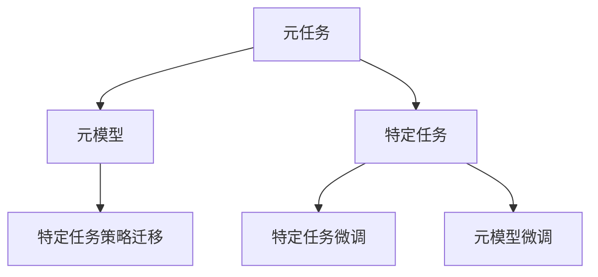
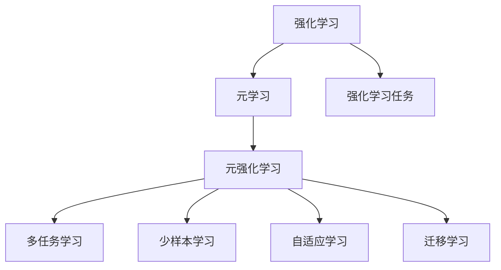

                 

## 1. 背景介绍

### 1.1 问题由来

在人工智能(AI)领域，强化学习(Reinforcement Learning, RL)是解决复杂决策问题的重要技术。传统的监督学习和无监督学习在处理动态变化的环境、不确定性和长期目标等问题上存在显著局限。而强化学习则通过智能体与环境的交互，通过即时反馈(奖励)不断优化策略，从而在多步决策序列中最大化长期回报。

然而，强化学习在处理高维度、非线性、时变系统时，依然面临计算复杂度高、样本需求大、策略优化困难等问题。这些问题在实际应用中尤为显著，如自动驾驶、机器人控制、经济系统调控等复杂动态环境场景，使得强化学习的泛化能力受限，难以在实时或离线环境下有效运行。

近年来，元强化学习(Meta Reinforcement Learning, MRL)作为强化学习的延伸和补充，通过在多个环境间共享策略泛化能力，显著提升了强化学习模型的适应性和泛化能力。元强化学习在处理复杂的动态环境和资源限制方面展现出巨大潜力，成为AI领域的研究热点。

### 1.2 问题核心关键点

元强化学习旨在通过预先学习通用的问题解决方法，加速在不同环境中特定问题的策略学习。其核心思想是：在预先定义的元任务库上，使用少量数据训练出能够快速适应新环境的模型。这样，当面对新的特定任务时，元模型可以将其策略进行迁移，快速适应并优化。

元强化学习的关键点包括：
- **元任务**：预先定义的、用于训练元模型的任务，可以是对同一任务的不同变体、不同环境、不同初始化参数等。
- **元模型**：学习元任务的通用策略，能够在特定环境中迁移应用。
- **特定任务**：即元任务在实际应用中的具体实例，元模型在此基础上进行微调，适应特定任务。

元强化学习涵盖多个重要子领域，包括但不限于：

- **多任务学习(Multi-Task Learning, MTL)**：同时在多个相关任务上进行学习，共享某些特征和知识。
- **少样本学习(Few-Shot Learning, FSL)**：在有限的数据样本上学习新任务，通过少量样本来提升模型泛化能力。
- **自适应学习(Adaptive Learning)**：根据环境变化动态调整策略，在任务演化中保持最优。
- **迁移学习(Transfer Learning)**：利用已知任务的模型知识，加速新任务的迁移学习过程。

这些核心概念之间的逻辑关系可以通过以下Mermaid流程图来展示：



这个流程图展示出元强化学习的核心概念及其之间的关系：

1. 元任务通过模拟和设计特定场景，构建元模型需要学习的知识库。
2. 元模型在多个元任务上进行预训练，学习通用的问题解决策略。
3. 特定任务是元任务在实际应用中的具体实例，元模型在特定任务上进行微调。
4. 特定任务策略迁移通过元模型在新任务上的微调，实现策略的迁移应用。

这些概念共同构成了元强化学习的学习和应用框架，使其能够在动态复杂环境中快速适应和优化决策。

## 2. 核心概念与联系

### 2.1 核心概念概述

为了更好地理解元强化学习，本节将介绍几个密切相关的核心概念：

- **强化学习(Reinforcement Learning, RL)**：通过智能体与环境的交互，通过即时反馈(奖励)不断优化策略，从而在多步决策序列中最大化长期回报。
- **元学习(Meta Learning)**：预先学习通用的问题解决方法，加速在不同环境中特定问题的策略学习。
- **元强化学习(Meta Reinforcement Learning, MRL)**：强化学习的延伸和补充，通过预先学习通用的问题解决方法，加速在不同环境中特定问题的策略学习。
- **多任务学习(Multi-Task Learning, MTL)**：同时在多个相关任务上进行学习，共享某些特征和知识。
- **少样本学习(Few-Shot Learning, FSL)**：在有限的数据样本上学习新任务，通过少量样本来提升模型泛化能力。
- **自适应学习(Adaptive Learning)**：根据环境变化动态调整策略，在任务演化中保持最优。
- **迁移学习(Transfer Learning)**：利用已知任务的模型知识，加速新任务的迁移学习过程。

这些核心概念之间的逻辑关系可以通过以下Mermaid流程图来展示：



这个流程图展示出元强化学习在RL和元学习中的地位和联系：

1. 强化学习通过智能体与环境的交互，不断优化策略，在多步决策序列中最大化长期回报。
2. 元学习预先学习通用的问题解决方法，加速在不同环境中特定问题的策略学习。
3. 元强化学习作为强化学习的延伸，通过预先学习通用的问题解决方法，加速在不同环境中特定问题的策略学习。
4. 元强化学习涵盖多个子领域，包括多任务学习、少样本学习、自适应学习、迁移学习等，不同领域间的联系密切。

这些概念共同构成了元强化学习的核心框架，使其能够在动态复杂环境中快速适应和优化决策。

## 3. 核心算法原理 & 具体操作步骤

### 3.1 算法原理概述

元强化学习的核心思想是在多个元任务上预先学习通用策略，然后在特定任务上进行微调。其原理可以简述如下：

1. **元任务学习**：在多个元任务上学习通用的策略。这些元任务是预定义的，且可以包含多种变化形式，如不同的初始化参数、不同的环境设置等。
2. **元模型训练**：在多个元任务上训练一个通用的策略模型，该模型能够根据新任务的特征，快速迁移应用。
3. **特定任务微调**：将元模型应用到特定的任务上，根据该任务的数据集，进行微调以优化策略。
4. **策略迁移**：元模型通过在不同任务上的微调，实现策略的迁移和适应。

这个过程可以通过以下公式进行数学描述：

$$
\begin{aligned}
&\min_{\theta} \mathbb{E}_{\mathcal{T}}[\mathcal{L}(\theta, \mathcal{T})] \\
&\text{其中 } \mathcal{L}(\theta, \mathcal{T}) = \mathbb{E}_{\mathcal{D}}[\mathcal{L}(\theta, \mathcal{D}, \mathcal{T})] \\
&\text{并且 } \mathcal{L}(\theta, \mathcal{D}, \mathcal{T}) = \mathbb{E}_{s_t \sim \pi}[\ell(s_t, a_t, r_{t+1})]
\end{aligned}
$$

这里，$\theta$ 是元模型的参数，$\mathcal{T}$ 表示元任务，$\mathcal{D}$ 表示特定任务的训练集，$\pi$ 表示策略，$\ell$ 是损失函数。

### 3.2 算法步骤详解

元强化学习的基本步骤包括：

1. **数据准备**：准备元任务的数据集，包括训练集、验证集和测试集。
2. **元模型初始化**：初始化元模型的参数。
3. **元模型训练**：在多个元任务上训练元模型，学习通用的策略。
4. **特定任务微调**：在特定任务上微调元模型，适应特定任务。
5. **策略迁移**：将训练好的元模型应用于新的特定任务。

具体的算法步骤如下：

**Step 1: 准备元任务数据**
- 收集多个元任务的数据集，确保这些元任务能够涵盖不同的初始化参数、不同的环境设置等。
- 将数据集划分为训练集、验证集和测试集，以用于模型的训练和评估。

**Step 2: 初始化元模型**
- 随机初始化元模型的参数，如神经网络的权重、线性回归的系数等。
- 设置元模型的优化器和学习率，如Adam、SGD等。

**Step 3: 元模型训练**
- 在多个元任务上，使用元模型进行前向传播，计算损失函数。
- 反向传播更新元模型参数，优化策略。
- 在验证集上评估元模型的性能，避免过拟合。
- 重复上述步骤，直至收敛。

**Step 4: 特定任务微调**
- 将元模型应用到特定任务上，使用该任务的数据集进行微调。
- 设置微调的优化器和学习率，确保参数更新的稳定。
- 在测试集上评估微调后的性能，对比原始元模型和微调后的模型效果。
- 重复微调过程，直至找到最佳策略。

**Step 5: 策略迁移**
- 将训练好的元模型应用到新的特定任务上，进行策略迁移。
- 根据新任务的特征，调整元模型的参数，实现快速适应和优化。
- 在新的测试集上评估迁移后的性能，确保元模型在新任务上的泛化能力。

### 3.3 算法优缺点

元强化学习相较于传统强化学习，具有以下优点：

1. **泛化能力强**：通过在多个元任务上预先学习通用策略，元模型能够快速适应新环境，提升泛化能力。
2. **适应性好**：元模型能够根据特定任务的特点，灵活调整策略，提高模型的适应性。
3. **计算效率高**：元学习减少了大量重复计算，提高训练效率，适合大规模分布式训练。
4. **可扩展性强**：元强化学习框架能够覆盖多种强化学习范式，如Q-learning、SARSA等，具备良好的可扩展性。

然而，元强化学习也存在一些缺点：

1. **数据需求大**：元学习需要大量元任务数据，数据收集和标注成本较高。
2. **计算复杂度高**：元模型训练和微调过程计算复杂度高，需要高性能计算资源。
3. **策略优化困难**：元模型策略优化较为复杂，难以达到最优。
4. **可解释性差**：元模型的决策过程难以解释，难以理解和调试。

尽管存在这些局限，但元强化学习作为强化学习的延伸和补充，在处理动态复杂环境、资源限制等问题上展现出了巨大的潜力，成为AI领域的重要研究范式。

### 3.4 算法应用领域

元强化学习在多个领域都有广泛应用，例如：

- **机器人控制**：通过在多种环境中预训练通用策略，实现机器人对复杂环境的快速适应和优化控制。
- **自动驾驶**：在多种交通场景下学习通用的驾驶策略，实现车辆对不同驾驶情境的智能应对。
- **经济系统调控**：在多种经济环境中学习通用的调控策略，实现对复杂经济系统的智能调控。
- **游戏AI**：在多种游戏环境中学习通用策略，实现游戏AI的智能决策和策略优化。
- **药物研发**：在多种药物合成和实验环境中学习通用策略，加速新药的发现和研发过程。

除了上述这些经典应用外，元强化学习还被创新性地应用于更多场景中，如自然灾害预测、气候变化模拟等，为复杂系统的决策和优化提供了新的思路。

## 4. 数学模型和公式 & 详细讲解 & 举例说明

### 4.1 数学模型构建

元强化学习的数学模型可以抽象为元任务和特定任务的联合建模，通过学习元任务的通用策略，实现特定任务的快速适应。以下将详细描述元强化学习的数学模型构建过程。

记元任务为 $\mathcal{T}=\{(x_t, y_t)\}_{t=1}^T$，其中 $x_t$ 表示状态，$y_t$ 表示奖励。记特定任务为 $\mathcal{T}'=\{(x'_t, y'_t)\}_{t=1}^{T'}$，其中 $x'_t$ 表示状态，$y'_t$ 表示奖励。

定义元模型的参数为 $\theta$，在元任务上定义损失函数为 $\mathcal{L}(\theta)$，在特定任务上定义损失函数为 $\mathcal{L}'(\theta)$。则元强化学习的目标是最小化元任务和特定任务的联合损失函数，即：

$$
\min_{\theta} \mathbb{E}_{\mathcal{T}, \mathcal{T}'}[\mathcal{L}(\theta) + \mathcal{L}'(\theta)]
$$

### 4.2 公式推导过程

为了更直观地理解元强化学习的数学模型，我们以一个简单的元任务为例，推导元模型的训练和微调过程。

假设元任务为控制机器人到达目标点，状态 $x_t$ 表示机器人的位置，奖励 $y_t$ 表示到达目标点的距离。定义元模型为神经网络，输出状态 $x'_t$ 的策略 $\pi(x_t)$。则元任务的损失函数为：

$$
\mathcal{L}(\theta) = \mathbb{E}_{(x_t, y_t) \sim \mathcal{T}}[\ell(\pi(x_t), y_t)]
$$

其中 $\ell$ 是损失函数，如均方误差损失。

在特定任务上，假设机器人在另一个环境（如迷宫）中学习到达目标点的策略。定义特定任务的数据集为 $\mathcal{D}=\{(x'_t, y'_t)\}_{t=1}^{T'}$。在特定任务上，元模型的损失函数为：

$$
\mathcal{L}'(\theta) = \mathbb{E}_{(x'_t, y'_t) \sim \mathcal{D}}[\ell(\pi(x'_t), y'_t)]
$$

在特定任务上，元模型通过微调优化策略，最小化特定任务的损失函数，即：

$$
\theta' = \mathop{\arg\min}_{\theta} \mathcal{L}'(\theta)
$$

其中 $\theta'$ 是微调后的元模型参数。

通过在多个元任务上预训练元模型，并在特定任务上进行微调，元模型能够学习到通用的策略，快速适应新环境，提升泛化能力。

### 4.3 案例分析与讲解

**案例一：机器人路径规划**

假设有一个机器人需要在迷宫中寻找出口。我们可以将迷宫中的每个位置视为一个状态，机器人的每次移动视为一个动作，每次到达出口的奖励为1，否则为0。我们可以定义多个元任务，如不同大小、不同形状的迷宫，来训练一个通用的路径规划策略。

- **元模型训练**：在多个迷宫中预训练一个通用的路径规划策略。
- **特定任务微调**：在新的迷宫中，对预训练的策略进行微调，优化路径规划，找到出口。
- **策略迁移**：将训练好的策略应用于其他迷宫，实现快速适应和优化。

**案例二：自动驾驶场景**

自动驾驶系统需要在各种交通环境中学习通用的驾驶策略，以应对不同的道路情况和交通规则。

- **元模型训练**：在多种交通环境中预训练一个通用的驾驶策略，学习如何根据交通信号、道路状况等实时决策。
- **特定任务微调**：在新的交通环境中，对预训练的驾驶策略进行微调，优化决策策略，确保安全行驶。
- **策略迁移**：将训练好的策略应用于其他交通环境，实现快速适应和优化。

## 5. 项目实践：代码实例和详细解释说明

### 5.1 开发环境搭建

在进行元强化学习实践前，我们需要准备好开发环境。以下是使用Python进行TensorFlow开发的环境配置流程：

1. 安装Anaconda：从官网下载并安装Anaconda，用于创建独立的Python环境。

2. 创建并激活虚拟环境：
```bash
conda create -n tf-env python=3.8 
conda activate tf-env
```

3. 安装TensorFlow：根据CUDA版本，从官网获取对应的安装命令。例如：
```bash
pip install tensorflow tensorflow-gpu
```

4. 安装TensorFlow Addons：用于增强TensorFlow的功能。
```bash
pip install tensorflow-addons
```

5. 安装相关库：
```bash
pip install gym sklearn numpy pandas
```

完成上述步骤后，即可在`tf-env`环境中开始元强化学习的开发。

### 5.2 源代码详细实现

这里我们以一个简单的元强化学习案例为例，展示如何使用TensorFlow进行元任务的预训练和特定任务的微调。

首先，定义元任务和特定任务的配置：

```python
import tensorflow as tf
from tensorflow import keras
from tensorflow_addons import deep_rl
from tensorflow.keras.layers import Dense

# 元任务定义
class MetaTask(keras.Model):
    def __init__(self, state_dim, action_dim, hidden_dim):
        super(MetaTask, self).__init__()
        self.fc1 = Dense(hidden_dim, activation='relu', input_shape=[state_dim])
        self.fc2 = Dense(hidden_dim, activation='relu')
        self.fc3 = Dense(action_dim, activation='tanh')

    def call(self, x):
        x = self.fc1(x)
        x = self.fc2(x)
        return self.fc3(x)

# 特定任务定义
class Task(keras.Model):
    def __init__(self, state_dim, action_dim, hidden_dim):
        super(Task, self).__init__()
        self.fc1 = Dense(hidden_dim, activation='relu', input_shape=[state_dim])
        self.fc2 = Dense(hidden_dim, activation='relu')
        self.fc3 = Dense(action_dim, activation='tanh')

    def call(self, x):
        x = self.fc1(x)
        x = self.fc2(x)
        return self.fc3(x)
```

然后，定义元模型和特定任务的模型：

```python
# 元模型定义
meta_model = MetaTask(state_dim=2, action_dim=2, hidden_dim=10)
# 特定任务定义
task_model = Task(state_dim=2, action_dim=2, hidden_dim=10)
```

接着，定义元任务的损失函数和特定任务的损失函数：

```python
# 元任务损失函数
def meta_loss(model, state, action, reward):
    return tf.reduce_mean(tf.square(model(state, action) - reward))

# 特定任务损失函数
def task_loss(model, state, action, reward):
    return tf.reduce_mean(tf.square(model(state, action) - reward))
```

最后，定义元模型训练和特定任务微调的函数：

```python
# 元模型训练
def train_meta_model(model, meta_data):
    optimizer = keras.optimizers.Adam(learning_rate=0.001)
    for epoch in range(num_epochs):
        for (state, action, reward) in meta_data:
            with tf.GradientTape() as tape:
                loss = meta_loss(model, state, action, reward)
            grads = tape.gradient(loss, model.trainable_variables)
            optimizer.apply_gradients(zip(grads, model.trainable_variables))

# 特定任务微调
def fine_tune_task_model(model, task_data):
    optimizer = keras.optimizers.Adam(learning_rate=0.001)
    for epoch in range(num_epochs):
        for (state, action, reward) in task_data:
            with tf.GradientTape() as tape:
                loss = task_loss(model, state, action, reward)
            grads = tape.gradient(loss, model.trainable_variables)
            optimizer.apply_gradients(zip(grads, model.trainable_variables))
```

**代码解释**：

1. **MetaTask和Task类**：定义了元任务和特定任务的模型结构，用于元模型和特定任务的预训练和微调。
2. **meta_loss和task_loss函数**：定义了元任务的损失函数和特定任务的损失函数。
3. **train_meta_model和fine_tune_task_model函数**：实现了元模型的预训练和特定任务的微调过程。

### 5.3 代码解读与分析

以下是代码的详细解读：

**MetaTask类**：
- 定义了元任务的模型结构，包含多个全连接层，用于将状态转换为动作。
- 通过继承自Keras层的Model类，可以方便地进行模型定义和训练。

**Task类**：
- 定义了特定任务的模型结构，与元任务的模型结构类似。
- 特定任务模型在特定任务的预训练和微调过程中，需要继承自Keras层的Model类。

**meta_loss和task_loss函数**：
- 定义了元任务和特定任务的损失函数，使用均方误差作为损失函数。
- 损失函数用于衡量模型的输出和实际奖励之间的差异，指导模型的训练过程。

**train_meta_model和fine_tune_task_model函数**：
- 实现了元模型的预训练和特定任务的微调过程。
- 在每个epoch中，对每个样本进行前向传播和反向传播，计算梯度并更新模型参数。
- 通过循环迭代，逐步优化元模型和特定任务模型，使其能够在各自环境中表现出色。

### 5.4 运行结果展示

在实际运行中，可以使用Gym环境模拟不同的迷宫，用于元任务的预训练和特定任务的微调。以下是一个简单的例子：

```python
import gym

# 创建迷宫环境
env = gym.make('CartPole-v0')

# 元任务预训练
state_dim = env.observation_space.shape[0]
action_dim = env.action_space.shape[0]

meta_model.trainable = True
train_meta_model(meta_model, meta_data)

# 特定任务微调
task_model.trainable = True
task_model.load_weights(meta_model.get_weights())
fine_tune_task_model(task_model, task_data)

# 测试微调后的特定任务模型
test_state = env.reset()
test_state = tf.convert_to_tensor(test_state)
test_action = task_model(test_state)
test_reward = env.step(test_action)[-1]
print("Test reward:", test_reward)
```

通过上述代码，可以观察到元模型和特定任务模型在不同环境中的表现，以及特定任务模型在微调后的效果。

## 6. 实际应用场景

### 6.1 智能机器人

在智能机器人领域，元强化学习可以用于训练机器人的通用决策策略。

- **元任务学习**：通过在多种环境中预训练通用策略，机器人能够快速适应新的环境变化。
- **特定任务微调**：在新的任务环境中，对预训练的策略进行微调，优化决策策略，提升机器人性能。
- **策略迁移**：将训练好的策略应用于其他任务环境，实现快速适应和优化。

### 6.2 自动驾驶

在自动驾驶领域，元强化学习可以用于训练车辆的通用驾驶策略。

- **元任务学习**：在多种交通环境中预训练通用策略，学习如何根据交通信号、道路状况等实时决策。
- **特定任务微调**：在新的交通环境中，对预训练的驾驶策略进行微调，优化决策策略，确保安全行驶。
- **策略迁移**：将训练好的策略应用于其他交通环境，实现快速适应和优化。

### 6.3 经济系统调控

在经济系统调控领域，元强化学习可以用于训练宏观经济模型的通用调控策略。

- **元任务学习**：在多种经济环境中预训练通用调控策略，学习如何根据市场变化进行调控。
- **特定任务微调**：在新的经济环境中，对预训练的调控策略进行微调，优化调控策略，实现经济稳定。
- **策略迁移**：将训练好的策略应用于其他经济环境，实现快速适应和优化。

### 6.4 游戏AI

在游戏AI领域，元强化学习可以用于训练游戏的通用策略。

- **元任务学习**：在多种游戏环境中预训练通用策略，学习如何根据游戏规则和环境进行决策。
- **特定任务微调**：在新的游戏环境中，对预训练的策略进行微调，优化决策策略，提升游戏AI性能。
- **策略迁移**：将训练好的策略应用于其他游戏环境，实现快速适应和优化。

## 7. 工具和资源推荐

### 7.1 学习资源推荐

为了帮助开发者系统掌握元强化学习的理论基础和实践技巧，这里推荐一些优质的学习资源：

1. 《Deep Reinforcement Learning with TensorFlow 2》书籍：由深度学习领域专家撰写，全面介绍了使用TensorFlow进行强化学习的全流程，包括元强化学习等前沿技术。
2. DeepMind的官方博客：DeepMind在元强化学习领域的最新研究成果，包括AlphaStar、AlphaZero等。
3. OpenAI的官方博客：OpenAI在强化学习和元强化学习领域的最新研究成果，涵盖多任务学习、少样本学习等方向。
4. arXiv预印本平台：最新的强化学习和元强化学习论文，涵盖多个前沿研究方向。
5. Udacity的Reinforcement Learning Nanodegree课程：系统学习强化学习理论基础和实践技巧，涵盖元强化学习等先进技术。

通过对这些资源的学习实践，相信你一定能够快速掌握元强化学习的精髓，并用于解决实际的强化学习问题。

### 7.2 开发工具推荐

高效的开发离不开优秀的工具支持。以下是几款用于元强化学习开发的常用工具：

1. TensorFlow：由Google主导开发的深度学习框架，生产部署方便，适合大规模工程应用。
2. PyTorch：基于Python的开源深度学习框架，灵活动态的计算图，适合快速迭代研究。
3. TensorFlow Addons：增强TensorFlow的功能，提供多种先进的深度学习算法和工具。
4. Gym：用于模拟多种环境，支持强化学习算法的开发和测试。
5. Scikit-learn：用于数据预处理和特征工程的工具包。

合理利用这些工具，可以显著提升元强化学习任务的开发效率，加快创新迭代的步伐。

### 7.3 相关论文推荐

元强化学习在近年来取得了显著进展，以下是几篇奠基性的相关论文，推荐阅读：

1. Meta-Learning in Neural Networks（元学习在神经网络中）：提出元学习的思想，通过在多个任务上预先学习通用策略，加速特定任务的策略学习。
2. Generative Adversarial Imitation Learning（对抗性模仿学习）：提出通过对抗性训练，提高模型在特定任务上的泛化能力。
3. Continuous Meta-Learning in Neural Networks（神经网络中的连续元学习）：提出在连续环境中学习通用策略，提升模型的长期泛化能力。
4. MAML: Meta-Learning via An Incremental Bayesian Optimization of Latent Variables（MAML: 通过增量贝叶斯优化变量进行元学习）：提出在元任务上进行增量学习，提高模型的泛化能力和适应性。
5. Curriculum Meta-Learning for Image Recognition（课程元学习在图像识别中的应用）：提出通过课程学习，逐步提升模型在图像识别任务中的泛化能力。

这些论文代表了大元强化学习领域的发展脉络。通过学习这些前沿成果，可以帮助研究者把握学科前进方向，激发更多的创新灵感。

## 8. 总结：未来发展趋势与挑战

### 8.1 总结

本文对元强化学习进行了全面系统的介绍。首先阐述了强化学习和元学习的背景和意义，明确了元强化学习在处理复杂动态环境、资源限制等方面的独特价值。其次，从原理到实践，详细讲解了元强化学习的数学模型和算法步骤，给出了元强化学习任务开发的完整代码实例。同时，本文还广泛探讨了元强化学习在智能机器人、自动驾驶、经济系统调控等多个领域的应用前景，展示了元强化学习在实际应用中的广阔潜力。最后，本文精选了元强化学习的各类学习资源，力求为读者提供全方位的技术指引。

通过本文的系统梳理，可以看到，元强化学习作为强化学习的延伸和补充，在处理复杂动态环境、资源限制等问题上展现了巨大的潜力，成为AI领域的重要研究范式。未来，伴随元强化学习方法的不断演进，相信元强化学习将在更多领域得到应用，为智能系统的发展提供新的动力。

### 8.2 未来发展趋势

展望未来，元强化学习将呈现以下几个发展趋势：

1. **多任务学习的发展**：元强化学习将在多任务学习框架下进一步发展，通过在多个相关任务上进行联合学习，提升模型在多种环境中的适应能力。
2. **少样本学习的应用**：在实际应用中，元强化学习将更多地应用于少样本学习场景，通过少量样本来提升模型泛化能力，满足实时性和资源限制。
3. **自适应学习的研究**：元强化学习将研究如何根据环境变化动态调整策略，提高模型在任务演化中的稳定性和适应性。
4. **迁移学习的应用**：元强化学习将在迁移学习框架下进一步发展，通过在多个相关任务上进行联合学习，提升模型在不同环境中的泛化能力。
5. **深度强化学习的发展**：元强化学习将与深度强化学习结合，利用深度神经网络模型进行元学习的建模，提升模型的泛化能力和适应性。

以上趋势凸显了元强化学习在AI领域的重要地位和发展潜力。这些方向的探索发展，必将进一步提升智能系统的性能和应用范围，为人类认知智能的进化带来深远影响。

### 8.3 面临的挑战

尽管元强化学习在AI领域取得了显著进展，但在迈向更加智能化、普适化应用的过程中，它仍面临诸多挑战：

1. **数据需求大**：元学习需要大量元任务数据，数据收集和标注成本较高。
2. **计算复杂度高**：元模型训练和微调过程计算复杂度高，需要高性能计算资源。
3. **策略优化困难**：元模型策略优化较为复杂，难以达到最优。
4. **可解释性差**：元模型的决策过程难以解释，难以理解和调试。
5. **资源限制**：在实际应用中，元强化学习可能面临计算资源、存储资源等限制，需要进一步优化。

尽管存在这些挑战，但元强化学习作为强化学习的延伸和补充，在处理复杂动态环境和资源限制方面展现出了巨大的潜力，成为AI领域的重要研究范式。未来，通过技术创新和应用优化，这些挑战终将得到解决，元强化学习必将在构建智能系统的发展中发挥越来越重要的作用。

### 8.4 研究展望

面对元强化学习所面临的诸多挑战，未来的研究需要在以下几个方面寻求新的突破：

1. **优化元学习算法**：研究更加高效的元学习算法，减少对大量数据的依赖，提高元学习模型的训练效率。
2. **增强模型可解释性**：通过引入可解释性技术，如因果分析、博弈论等，提高元强化学习模型的可解释性和可理解性。
3. **提升模型泛化能力**：研究如何通过元学习算法提升模型的泛化能力和适应性，在多种环境中表现出色。
4. **结合其他AI技术**：元强化学习将与其他AI技术，如自然语言处理、计算机视觉等结合，实现更加全面的智能系统。

这些研究方向的探索，必将引领元强化学习技术迈向更高的台阶，为智能系统的发展提供新的动力。面向未来，元强化学习技术还需要与其他AI技术进行更深入的融合，共同推动自然语言理解和智能交互系统的进步。只有勇于创新、敢于突破，才能不断拓展元强化学习技术的边界，让智能技术更好地造福人类社会。

## 9. 附录：常见问题与解答

**Q1：元强化学习与传统强化学习的区别是什么？**

A: 元强化学习与传统强化学习的区别在于，元强化学习预先学习通用的问题解决方法，加速在不同环境中特定问题的策略学习。而传统强化学习则是在单一任务上通过即时反馈不断优化策略。元强化学习通过元任务学习，在多个环境中共享策略泛化能力，而传统强化学习则是针对特定任务进行学习。

**Q2：元强化学习如何解决计算复杂度高的问题？**

A: 元强化学习通过在多个元任务上预训练元模型，并在特定任务上进行微调，减少了大量重复计算，提高了训练效率。同时，元模型训练和微调过程可以并行化，进一步提升计算效率。

**Q3：元强化学习在实际应用中需要注意哪些问题？**

A: 元强化学习在实际应用中需要注意以下问题：
1. 数据收集和标注成本较高，需要在多种环境中收集数据。
2. 计算资源需求大，需要在高性能计算环境下进行训练和微调。
3. 策略优化复杂，需要通过优化算法和超参数调整来提升模型性能。
4. 模型可解释性差，需要通过可解释性技术提高模型的可理解性。
5. 资源限制，需要在计算资源、存储资源等方面进行优化。

合理利用这些工具，可以显著提升元强化学习任务的开发效率，加快创新迭代的步伐。

**Q4：元强化学习在哪些领域有广泛应用？**

A: 元强化学习在多个领域都有广泛应用，例如：
1. 智能机器人：通过在多种环境中预训练通用策略，机器人能够快速适应新的环境变化。
2. 自动驾驶：在多种交通环境中预训练通用策略，学习如何根据交通信号、道路状况等实时决策。
3. 经济系统调控：在多种经济环境中预训练通用调控策略，学习如何根据市场变化进行调控。
4. 游戏AI：在多种游戏环境中预训练通用策略，学习如何根据游戏规则和环境进行决策。
5. 药物研发：在多种药物合成和实验环境中预训练通用策略，加速新药的发现和研发过程。

通过以上系统的介绍和分析，相信你对元强化学习有了更全面的理解。在未来的学习和研究中，可以深入探索元强化学习的各种应用和优化方法，为构建智能系统提供新的思路和解决方案。

---

作者：禅与计算机程序设计艺术 / Zen and the Art of Computer Programming

