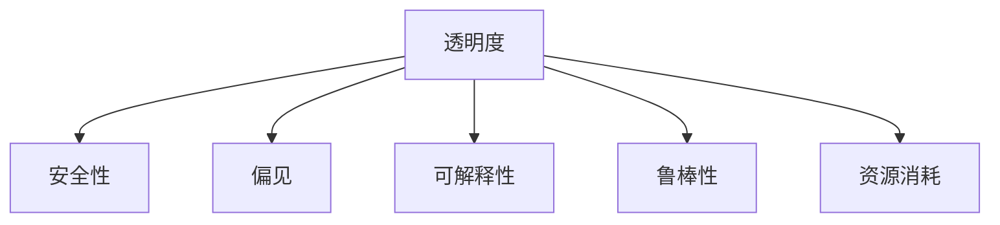

                 

# 克服人工智能固有缺点的方法

> 关键词：人工智能, 固有缺点, 机器学习, 深度学习, 优化算法, 模型评估, 偏见, 安全, 透明性, 解释性

## 1. 背景介绍

### 1.1 问题由来
随着人工智能（AI）技术的快速发展，人工智能系统在医疗、金融、交通、教育等众多领域得到了广泛应用。然而，尽管AI在某些特定领域展现了强大的能力，但仍然存在一些固有的缺点，限制了其在更广泛场景中的推广应用。这些问题主要包括模型的透明度、安全性、偏见、可解释性等方面。这些问题如不能有效解决，将限制AI技术的普及和应用，甚至导致严重的社会问题。

### 1.2 问题核心关键点
当前AI技术的固有缺点主要包括以下几个方面：

1. **模型的透明度**：许多AI模型，尤其是深度学习模型，通常是“黑盒”系统，其内部决策过程不透明，难以理解和解释。
2. **模型的安全性**：AI模型可能会因为数据偏差、算法设计等原因产生偏见，甚至在关键决策中产生歧视性行为，引发社会不公。
3. **模型的可解释性**：AI模型的预测结果缺乏足够的解释，难以获得用户的信任和使用，特别是在医疗、法律等对可解释性要求高的领域。
4. **模型的鲁棒性**：AI模型对噪声、异常值和对抗攻击的鲁棒性不足，容易受到攻击和误导，导致系统不稳定。
5. **模型的资源消耗**：许多AI模型需要大量的计算资源和存储空间，难以在资源受限的环境中应用。

### 1.3 问题研究意义
解决AI的固有缺点对于提升AI技术的可信度和可靠性，推动其在更多领域的应用至关重要。通过提升模型的透明度、安全性和可解释性，AI系统将更能获得用户的信任，同时减少潜在的偏见和风险，为社会带来更多正能量。

## 2. 核心概念与联系

### 2.1 核心概念概述

为更好地理解如何克服AI固有缺点，本节将介绍几个密切相关的核心概念：

- **透明度（Transparency）**：指模型决策过程的可视化、可解释性，使得用户能够理解模型是如何做出预测的。
- **安全性（Safety）**：指模型在面对恶意输入、攻击等情况下的稳健性，保证系统不会产生有害的行为或决策。
- **偏见（Bias）**：指模型在训练过程中学习到的数据偏见，可能产生歧视性或不公正的决策。
- **可解释性（Explainability）**：指模型预测结果的可解释性，使用户能够理解模型的内部工作机制。
- **鲁棒性（Robustness）**：指模型在面对数据噪声、异常值和对抗攻击时的稳定性。
- **资源消耗（Resource Consumption）**：指模型在计算和存储方面的资源需求。

这些核心概念之间的逻辑关系可以通过以下Mermaid流程图来展示：



这个流程图展示了几大核心概念之间的关联性：

1. 透明度影响安全性和偏见，透明的模型更容易发现和消除偏见，同时也更安全。
2. 偏见和安全性会影响模型的可解释性和透明度。
3. 可解释性、偏见、鲁棒性和资源消耗对模型的透明度和安全性的影响。

## 3. 核心算法原理 & 具体操作步骤
### 3.1 算法原理概述

克服AI固有缺点的方法通常涉及以下几个关键步骤：

- **数据清洗与标注**：清洗和标注数据以减少偏见和噪声，提高数据质量。
- **算法选择与优化**：选择合适的算法并进行优化，如通过正则化、对抗训练等方法提升鲁棒性。
- **模型评估与监控**：使用模型评估指标和监控工具检测模型的性能和安全性。
- **透明性与可解释性提升**：通过可视化、文档记录等手段提升模型的透明性与可解释性。
- **模型部署与维护**：将模型部署到实际应用中，并持续监控和维护，确保系统稳定运行。

### 3.2 算法步骤详解

#### 3.2.1 数据清洗与标注
数据清洗与标注是提升AI模型性能和安全性的基础。具体步骤如下：

1. **数据预处理**：对数据进行去重、去噪、标准化等处理，减少数据噪声和异常值的影响。
2. **数据标注**：为数据集添加标签，如分类标签、标注信息等，为模型训练提供指导。
3. **偏见检测与修正**：使用偏见检测工具分析数据集中的偏见，并进行修正。

#### 3.2.2 算法选择与优化
选择合适的算法并进行优化，是提升模型性能和安全性的关键步骤。具体步骤如下：

1. **算法选择**：根据任务特点选择合适的算法，如线性回归、决策树、神经网络等。
2. **参数调优**：通过交叉验证、网格搜索等方法，调整算法参数，找到最优解。
3. **正则化与抗干扰**：使用L2正则、Dropout等技术，减少过拟合和模型脆弱性。

#### 3.2.3 模型评估与监控
模型评估与监控是确保模型稳定运行的重要手段。具体步骤如下：

1. **模型评估指标**：选择合适的评估指标，如准确率、召回率、F1值等，评估模型性能。
2. **监控工具**：使用监控工具实时监控模型性能和运行状态，如TensorBoard、Weights & Biases等。
3. **异常检测**：使用异常检测算法识别模型预测结果中的异常，及时纠正。

#### 3.2.4 透明性与可解释性提升
提升模型的透明性和可解释性，有助于用户理解模型决策过程，增强信任。具体步骤如下：

1. **可视化技术**：使用可视化技术，如t-SNE、PCA等，展示模型内部结构和学习过程。
2. **文档记录**：记录模型训练、优化和评估过程中的关键步骤，形成文档，便于查阅和理解。
3. **模型解释工具**：使用解释工具，如SHAP、LIME等，分析模型的预测结果和特征重要性。

#### 3.2.5 模型部署与维护
模型部署与维护是确保系统长期稳定运行的关键步骤。具体步骤如下：

1. **模型部署**：将训练好的模型部署到生产环境，使用标准服务接口提供预测服务。
2. **持续集成与部署**：使用持续集成工具，如Jenkins、GitLab CI等，自动化模型训练、评估和部署过程。
3. **模型维护**：定期更新模型，修复已知问题，优化性能，确保系统长期稳定运行。

### 3.3 算法优缺点

#### 3.3.1 数据清洗与标注
优点：
- 减少模型偏差和噪声，提高数据质量。
- 提升模型的鲁棒性和泛化能力。

缺点：
- 数据清洗和标注工作量较大，需要大量人力和时间。
- 数据标注可能存在主观性，影响模型公正性。

#### 3.3.2 算法选择与优化
优点：
- 选择合适的算法和参数，提升模型性能。
- 正则化和抗干扰技术提高模型鲁棒性。

缺点：
- 算法选择和调优需要丰富的经验和专业知识。
- 复杂算法可能增加计算资源消耗。

#### 3.3.3 模型评估与监控
优点：
- 实时监控模型性能，及时发现和修正问题。
- 提高模型的透明度和可解释性。

缺点：
- 监控工具和异常检测算法需要配置和维护。
- 模型评估可能受数据分布和标签误差的影响。

#### 3.3.4 透明性与可解释性提升
优点：
- 提升模型的透明度和用户信任度。
- 通过解释工具，分析模型特征重要性，帮助理解模型。

缺点：
- 可视化技术和解释工具可能复杂，需要专业知识。
- 解释工具可能增加计算资源消耗。

#### 3.3.5 模型部署与维护
优点：
- 自动化模型训练、评估和部署，提升效率。
- 持续集成和部署，确保模型长期稳定运行。

缺点：
- 需要持续投入资源进行模型维护和更新。
- 部署过程中可能遇到硬件资源瓶颈。

### 3.4 算法应用领域

克服AI固有缺点的技术已经在多个领域得到应用，以下是几个典型案例：

1. **医疗领域**：使用AI辅助诊断，减少医疗错误，提高诊断准确性。通过数据清洗和标注，减少偏见和噪声，提升模型透明性和可解释性，增强患者信任。
2. **金融领域**：使用AI进行信用评分、风险评估等，减少歧视和偏见。通过模型评估和监控，确保模型公正性和鲁棒性，增强系统安全性。
3. **教育领域**：使用AI进行个性化推荐和智能辅导，提高教学效果。通过透明性和可解释性提升，帮助学生理解学习过程，增强学习效果。
4. **交通领域**：使用AI进行交通流量预测和优化，提升交通管理效率。通过模型评估和监控，确保系统稳定运行，减少事故风险。

## 4. 数学模型和公式 & 详细讲解  
### 4.1 数学模型构建

本节将使用数学语言对克服AI固有缺点的技术进行更加严格的刻画。

设输入数据为 $x$，输出为 $y$，模型为 $f(x; \theta)$，其中 $\theta$ 为模型参数。模型的损失函数为 $L(y,f(x; \theta))$。

模型的透明度、安全性和偏见可以分别通过以下指标来度量：

- **透明度**：使用可视化技术，如t-SNE、PCA等，展示模型内部结构和学习过程。
- **安全性**：通过对抗训练等技术，提升模型对噪声、异常值和对抗攻击的鲁棒性。
- **偏见**：通过数据清洗和标注，减少数据集中的偏见，提升模型公正性。

### 4.2 公式推导过程

以下我们以数据清洗与标注为例，推导如何通过数据预处理和偏见检测提升模型性能。

#### 4.2.1 数据预处理
数据预处理包括数据清洗和标准化等步骤。设原始数据为 $x_i$，预处理后的数据为 $\hat{x}_i$。数据预处理的目标是减少噪声和异常值的影响，具体公式如下：

$$
\hat{x}_i = f_{\text{preprocess}}(x_i)
$$

其中 $f_{\text{preprocess}}$ 为预处理函数，可以是去重、去噪、标准化等。

#### 4.2.2 数据标注
数据标注是将原始数据 $x_i$ 映射到标签 $y_i$ 的过程。设标注函数为 $f_{\text{annotate}}$，具体公式如下：

$$
y_i = f_{\text{annotate}}(x_i)
$$

其中 $f_{\text{annotate}}$ 为标注函数，可以是分类标签、标注信息等。

#### 4.2.3 偏见检测与修正
偏见检测是通过模型训练数据中的分布差异，判断数据集是否存在偏见的过程。设偏见检测函数为 $f_{\text{bias}}$，具体公式如下：

$$
\text{Bias}(x_i, y_i) = f_{\text{bias}}(x_i, y_i)
$$

其中 $\text{Bias}(x_i, y_i)$ 为偏见检测结果，可以是概率、分数等。

如果数据集存在偏见，需要通过修正函数 $f_{\text{correct}}$ 进行修正，具体公式如下：

$$
y'_i = f_{\text{correct}}(x_i, y_i, \text{Bias}(x_i, y_i))
$$

其中 $y'_i$ 为修正后的标签，$f_{\text{correct}}$ 为修正函数。

### 4.3 案例分析与讲解

假设我们有一个用于信用评分的AI模型，需要检测和修正偏见。具体步骤如下：

1. **数据预处理**：清洗和标准化数据，去除噪声和异常值。
2. **数据标注**：为数据集添加分类标签，如“高风险”、“低风险”等。
3. **偏见检测**：使用偏见检测函数 $f_{\text{bias}}$，检测数据集中的偏见。
4. **偏见修正**：根据偏见检测结果，使用修正函数 $f_{\text{correct}}$，修正数据集中的偏见。
5. **模型训练与评估**：使用修正后的数据集训练模型，评估模型性能。

通过上述步骤，可以有效地减少模型偏见，提升模型的公正性和鲁棒性。

## 5. 项目实践：代码实例和详细解释说明
### 5.1 开发环境搭建

在进行数据清洗与标注的实践前，我们需要准备好开发环境。以下是使用Python进行数据清洗和标注的开发环境配置流程：

1. 安装Anaconda：从官网下载并安装Anaconda，用于创建独立的Python环境。

2. 创建并激活虚拟环境：
```bash
conda create -n data_cleaning_env python=3.8 
conda activate data_cleaning_env
```

3. 安装相关工具包：
```bash
pip install pandas numpy scikit-learn tensorflow
```

4. 配置数据标注工具：
```bash
pip install pyannote
```

完成上述步骤后，即可在`data_cleaning_env`环境中开始数据清洗与标注实践。

### 5.2 源代码详细实现

下面我们以信用评分数据集为例，给出使用Python进行数据清洗和标注的代码实现。

```python
import pandas as pd
import numpy as np
import pyannote
from sklearn.preprocessing import StandardScaler
from sklearn.model_selection import train_test_split

# 加载原始数据集
data = pd.read_csv('credit_data.csv')

# 数据预处理
data.dropna(inplace=True)
data.drop_duplicates(inplace=True)

# 标准化数据
scaler = StandardScaler()
data['numerical_features'] = scaler.fit_transform(data[['numerical_features']])

# 数据标注
target = data['target']
data.drop(columns=['target'], inplace=True)

# 划分训练集和测试集
train_data, test_data = train_test_split(data, test_size=0.2, random_state=42)

# 输出数据集统计信息
print(data.describe())
print(train_data.describe())
print(test_data.describe())

# 输出样本数据
print(data.head())
print(train_data.head())
print(test_data.head())
```

在这个代码示例中，我们首先加载了原始的信用评分数据集，并进行数据清洗和标准化。然后，我们添加了标签，并将数据集划分为训练集和测试集。最后，我们输出了数据集的统计信息和部分样本数据。

### 5.3 代码解读与分析

让我们再详细解读一下关键代码的实现细节：

- **数据预处理**：使用`dropna()`和`drop_duplicates()`方法去除缺失值和重复值，使用`StandardScaler()`对数值型特征进行标准化，以减少噪声和异常值的影响。
- **数据标注**：首先添加标签，然后将标签作为目标变量，并从原始数据中删除。
- **数据集划分**：使用`train_test_split()`方法将数据集划分为训练集和测试集，确保模型在未见过的数据上评估性能。
- **输出数据集统计信息**：使用`describe()`方法输出数据集的统计信息，帮助理解数据的分布和特征。
- **输出样本数据**：使用`head()`方法输出数据集的前几行样本，帮助可视化数据内容。

通过以上代码，我们完成了数据清洗和标注的基本步骤。在实际应用中，还需要根据具体任务和数据特点，进一步优化数据清洗和标注过程。

## 6. 实际应用场景
### 6.1 智能医疗
在智能医疗领域，AI模型常用于辅助诊断、药物研发等任务。为了确保模型公正性和鲁棒性，数据清洗和标注至关重要。

例如，在辅助诊断中，数据清洗可以去除病人基本信息中的敏感信息，确保模型仅基于临床数据进行诊断。数据标注可以添加详细的疾病标签，如“肿瘤”、“心脏病”等，帮助模型理解病症和诊断结果。

### 6.2 金融风控
在金融风控领域，AI模型常用于信用评分、风险评估等任务。为了确保模型公正性和鲁棒性，数据清洗和标注是不可或缺的。

例如，在信用评分中，数据清洗可以去除客户基本信息中的敏感信息，确保模型仅基于财务数据进行评分。数据标注可以添加详细的信用标签，如“高风险”、“低风险”等，帮助模型理解客户的信用情况。

### 6.3 智能教育
在智能教育领域，AI模型常用于个性化推荐和智能辅导等任务。为了确保模型公正性和鲁棒性，数据清洗和标注同样重要。

例如，在个性化推荐中，数据清洗可以去除用户基本信息中的敏感信息，确保模型仅基于学习数据进行推荐。数据标注可以添加详细的学习标签，如“数学”、“物理”等，帮助模型理解用户的兴趣和需求。

### 6.4 未来应用展望
随着AI技术的不断发展，数据清洗和标注将在更多领域得到应用，为AI模型提供更优质、更全面的训练数据。

未来，数据清洗和标注技术将进一步自动化，使用AI技术自动清洗和标注数据，减少人力和时间成本。同时，将结合其他AI技术，如自然语言处理、计算机视觉等，实现更全面、更精准的数据清洗和标注。

## 7. 工具和资源推荐
### 7.1 学习资源推荐

为了帮助开发者系统掌握数据清洗和标注的理论基础和实践技巧，这里推荐一些优质的学习资源：

1. 《Python数据清洗与处理》系列博文：由数据科学专家撰写，深入浅出地介绍了数据清洗和标注的流程和技巧。

2. CS229《机器学习》课程：斯坦福大学开设的机器学习明星课程，涵盖了数据清洗和标注的基本概念和经典方法。

3. 《深度学习入门》书籍：深度学习领域的入门书籍，介绍了数据清洗和标注的实际应用。

4. Kaggle平台：世界知名的数据科学竞赛平台，提供了丰富的数据集和标注工具，帮助开发者实践和提升技能。

5. Scikit-learn官方文档：Scikit-learn库的官方文档，提供了丰富的数据清洗和标注工具，包括缺失值处理、特征选择、标签编码等。

通过对这些资源的学习实践，相信你一定能够快速掌握数据清洗和标注的精髓，并用于解决实际的AI问题。

### 7.2 开发工具推荐

高效的开发离不开优秀的工具支持。以下是几款用于数据清洗和标注开发的常用工具：

1. Pandas：Python中的数据分析库，提供了丰富的数据清洗和标注函数，如`dropna()`、`fillna()`、`LabelEncoder()`等。

2. NumPy：Python中的数值计算库，提供了高效的数组操作和数学运算函数，如`mean()`、`std()`、`norm()`等。

3. Scikit-learn：Python中的机器学习库，提供了丰富的数据清洗和标注工具，如`StandardScaler()`、`OneHotEncoder()`、`Imputer()`等。

4. TensorFlow：Google开发的深度学习框架，提供了丰富的数据清洗和标注工具，如`tf.data`、`tf.feature_column`等。

5. PyTorch：Facebook开发的深度学习框架，提供了丰富的数据清洗和标注工具，如`torch.utils.data`、`torch.utils.data.dataset`等。

合理利用这些工具，可以显著提升数据清洗和标注的开发效率，加快创新迭代的步伐。

### 7.3 相关论文推荐

数据清洗和标注技术的发展源于学界的持续研究。以下是几篇奠基性的相关论文，推荐阅读：

1. "Data Cleaning and Preprocessing for Big Data"：介绍大数据清洗和预处理的基本方法。

2. "Automated Data Labeling Using Natural Language Generation"：介绍自动标注的方法和工具，帮助快速生成标注信息。

3. "Robust Data Augmentation for Neural Networks"：介绍数据增强的方法，提升模型的鲁棒性和泛化能力。

4. "Bias Detection and Mitigation in AI Models"：介绍偏见检测和修正的方法，提升模型的公正性和鲁棒性。

5. "Explainable AI: Methods for Making AI Explanations for Humans"：介绍可解释AI的方法，提升模型的透明性和可解释性。

这些论文代表了大数据清洗和标注技术的发展脉络。通过学习这些前沿成果，可以帮助研究者把握学科前进方向，激发更多的创新灵感。

## 8. 总结：未来发展趋势与挑战

### 8.1 总结

本文对数据清洗与标注的技术进行了全面系统的介绍。首先阐述了数据清洗与标注在提升AI模型性能和安全性的基础地位，明确了数据清洗与标注在消除偏见和提升透明性方面的重要价值。其次，从原理到实践，详细讲解了数据清洗与标注的数学原理和关键步骤，给出了数据清洗与标注任务开发的完整代码实例。同时，本文还广泛探讨了数据清洗与标注方法在医疗、金融、教育等诸多领域的应用前景，展示了数据清洗与标注范式的巨大潜力。

通过本文的系统梳理，可以看到，数据清洗与标注技术正在成为AI系统的重要组成部分，极大地提升了AI模型的性能和应用范围，为AI技术落地应用提供了坚实基础。未来，伴随数据清洗与标注方法的持续演进，相信AI技术将在更广泛的应用领域大放异彩，深刻影响人类的生产生活方式。

### 8.2 未来发展趋势

展望未来，数据清洗与标注技术将呈现以下几个发展趋势：

1. 自动化程度提升。随着AI技术的发展，数据清洗与标注将进一步自动化，减少人力和时间成本，提升效率。

2. 跨领域应用扩展。数据清洗与标注技术将从传统的图像、文本等单一领域，扩展到多模态数据的清洗与标注，如视频、音频等。

3. 数据生成与合成。数据清洗与标注技术将结合数据生成技术，使用AI生成高质量标注数据，解决标注资源不足的问题。

4. 数据质量提升。数据清洗与标注技术将结合深度学习等先进技术，提升数据清洗与标注的质量和精度。

5. 数据隐私保护。数据清洗与标注技术将结合隐私保护技术，确保数据清洗与标注过程中的数据隐私和安全。

以上趋势凸显了数据清洗与标注技术的广阔前景。这些方向的探索发展，必将进一步提升AI系统的性能和应用范围，为社会带来更多正能量。

### 8.3 面临的挑战

尽管数据清洗与标注技术已经取得了瞩目成就，但在迈向更加智能化、普适化应用的过程中，它仍面临着诸多挑战：

1. 数据清洗与标注成本较高。尽管自动化程度提升，但高质量标注数据仍然需要大量人力和时间成本。

2. 数据标注存在主观性。标注数据可能存在主观性，影响模型公正性和鲁棒性。

3. 数据隐私和安全问题。数据清洗与标注过程中可能存在数据泄露和隐私侵犯的风险。

4. 数据清洗与标注方法单一。现有的数据清洗与标注方法大多局限于单一领域，难以应对复杂多变的现实场景。

5. 数据清洗与标注工具局限性。现有的数据清洗与标注工具大多功能单一，难以满足复杂数据清洗与标注需求。

正视数据清洗与标注面临的这些挑战，积极应对并寻求突破，将是大数据清洗与标注技术走向成熟的必由之路。相信随着学界和产业界的共同努力，这些挑战终将一一被克服，数据清洗与标注技术必将在构建智能系统时发挥重要作用。

### 8.4 研究展望

面对数据清洗与标注技术所面临的种种挑战，未来的研究需要在以下几个方面寻求新的突破：

1. 探索无监督和半监督数据清洗与标注方法。摆脱对大规模标注数据的依赖，利用自监督学习、主动学习等无监督和半监督范式，最大限度利用非结构化数据，实现更加灵活高效的数据清洗与标注。

2. 研究参数高效和计算高效的清洗与标注范式。开发更加参数高效的清洗与标注方法，在固定大部分预训练参数的情况下，只更新极少量的任务相关参数。同时优化清洗与标注模型的计算图，减少前向传播和反向传播的资源消耗，实现更加轻量级、实时性的部署。

3. 融合因果和对比学习范式。通过引入因果推断和对比学习思想，增强清洗与标注模型建立稳定因果关系的能力，学习更加普适、鲁棒的语言表征，从而提升模型泛化性和抗干扰能力。

4. 引入更多先验知识。将符号化的先验知识，如知识图谱、逻辑规则等，与神经网络模型进行巧妙融合，引导清洗与标注过程学习更准确、合理的语言模型。同时加强不同模态数据的整合，实现视觉、语音等多模态信息与文本信息的协同建模。

5. 结合因果分析和博弈论工具。将因果分析方法引入清洗与标注模型，识别出模型决策的关键特征，增强输出解释的因果性和逻辑性。借助博弈论工具刻画人机交互过程，主动探索并规避模型的脆弱点，提高系统稳定性。

6. 纳入伦理道德约束。在模型训练目标中引入伦理导向的评估指标，过滤和惩罚有偏见、有害的输出倾向。同时加强人工干预和审核，建立模型行为的监管机制，确保输出符合人类价值观和伦理道德。

这些研究方向的探索，必将引领数据清洗与标注技术迈向更高的台阶，为构建安全、可靠、可解释、可控的智能系统铺平道路。面向未来，数据清洗与标注技术还需要与其他AI技术进行更深入的融合，如知识表示、因果推理、强化学习等，多路径协同发力，共同推动自然语言理解和智能交互系统的进步。只有勇于创新、敢于突破，才能不断拓展语言模型的边界，让智能技术更好地造福人类社会。

## 9. 附录：常见问题与解答

**Q1：数据清洗与标注是否适用于所有数据类型？**

A: 数据清洗与标注方法适用于多种数据类型，包括文本、图像、音频、视频等。对于不同类型的数据，清洗和标注方法有所不同，需要根据具体数据特点进行选择。例如，文本数据需要进行分词、去重、标准化等处理，图像数据需要进行去噪、裁剪、归一化等处理。

**Q2：数据清洗与标注过程中如何平衡质量和成本？**

A: 数据清洗与标注过程中，质量与成本之间的平衡是关键。一般来说，高质量的标注数据需要大量人力和时间成本，因此需要在保证数据质量的前提下，尽量降低成本。可以通过以下方法实现：

1. 自动化数据清洗与标注。使用AI技术自动清洗和标注数据，减少人力和时间成本。
2. 使用半监督学习。结合少量标注数据和大量未标注数据，使用半监督学习提升标注质量。
3. 数据清洗与标注优先级。对于关键数据集，可以投入更多资源进行高质量标注，对于一般数据集，可以适当降低标注质量要求。

通过这些方法，可以在保证数据质量的同时，尽量降低成本。

**Q3：数据清洗与标注如何应对数据噪声和异常值？**

A: 数据清洗与标注过程中，数据噪声和异常值是不可避免的。可以采用以下方法应对：

1. 数据预处理。使用去重、去噪、标准化等方法，减少数据噪声和异常值的影响。
2. 异常检测。使用异常检测算法，识别并剔除异常值。
3. 数据增强。使用数据增强技术，生成更多训练数据，减少噪声和异常值的影响。

通过这些方法，可以最大限度减少数据噪声和异常值对清洗与标注结果的影响。

**Q4：数据清洗与标注如何处理数据隐私问题？**

A: 数据清洗与标注过程中，数据隐私问题需要引起高度重视。可以采用以下方法处理：

1. 数据匿名化。在数据清洗与标注过程中，使用数据匿名化技术，保护个人隐私。
2. 数据脱敏。在数据清洗与标注过程中，使用数据脱敏技术，去除敏感信息。
3. 访问控制。在数据清洗与标注过程中，设置访问控制策略，确保只有授权人员可以访问数据。

通过这些方法，可以最大限度保护数据隐私，确保数据清洗与标注过程中的数据安全。

**Q5：数据清洗与标注如何在模型训练过程中应用？**

A: 数据清洗与标注结果在模型训练过程中具有重要应用。具体步骤如下：

1. 数据预处理。使用数据清洗与标注结果，对数据进行预处理，减少噪声和异常值的影响。
2. 模型训练。使用清洗与标注结果训练模型，提升模型性能和泛化能力。
3. 模型评估。使用模型在测试集上的表现，评估数据清洗与标注结果的有效性。

通过这些步骤，可以在模型训练过程中充分利用数据清洗与标注结果，提升模型性能。

---

作者：禅与计算机程序设计艺术 / Zen and the Art of Computer Programming

