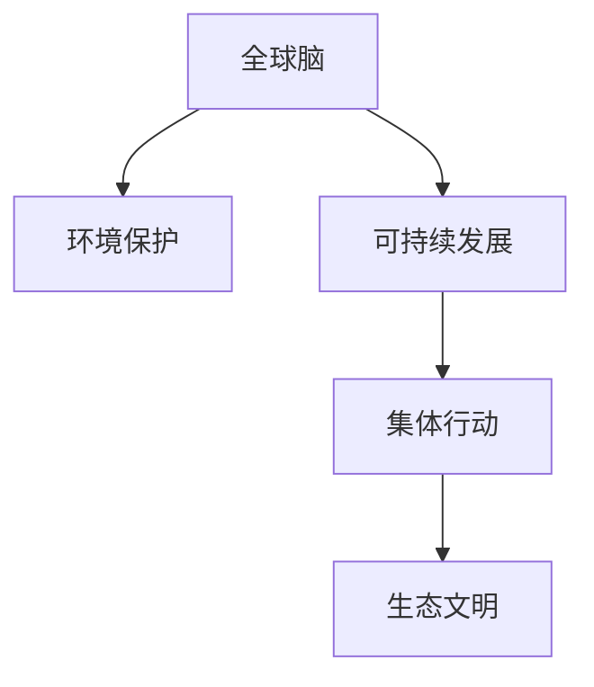

                 

# 全球脑与环境保护:集体行动的力量

> 关键词：全球脑,环境保护,集体行动,可持续发展,生态文明

## 1. 背景介绍

### 1.1 问题由来
随着科技进步和人类活动的扩张，全球环境问题日益严峻，从气候变化、生物多样性丧失到自然生态退化，都对人类社会的可持续发展构成了巨大挑战。面对如此严峻的形势，仅仅依靠单一国家或组织的努力已无法满足全球环境的保护需求，迫切需要全球范围内的集体行动。

### 1.2 问题核心关键点
全球脑（Global Brain）概念源于互联网发展，指全球范围内的人类社会、科技、经济、环境等多元交织的复杂系统，具有高度的自组织和协同性。其核心关键点在于：

- **互联互通性**：全球脑通过互联网、通信技术等手段，将世界各地的个人、组织、企业紧密连接，形成庞大的信息交流与协同合作网络。
- **多层次结构**：全球脑包括国家层面的政府机构、跨国企业、非政府组织，以及个人层面的社交媒体、信息平台，多层次的组织形式使其能够高效应对复杂问题。
- **自组织能力**：全球脑中的参与者能够通过信息共享和协作，形成自下而上的组织能力，推动解决全球性问题。

这些核心关键点为全球脑概念在环境保护中的应用提供了基础，使得全球脑成为解决环境问题的有力工具。

### 1.3 问题研究意义
研究全球脑在环境保护中的应用，对于推动全球集体行动，实现可持续发展具有重要意义：

- **提高环境治理效率**：通过全球脑的自组织能力，能够快速汇聚各方资源，形成高效的环境治理机制。
- **促进环保知识普及**：全球脑的信息共享与协同作用，有助于传播环保知识，提升公众环保意识。
- **推动环保技术创新**：全球脑的多元融合特点，能够激发更多创新力量，推动环保技术的突破。
- **助力绿色经济发展**：全球脑的协同合作，有助于建立绿色产业链，促进经济与环境的和谐共生。
- **增强全球环境管理**：全球脑的数据集成与分析能力，可为全球环境监测与管理提供科学依据。

## 2. 核心概念与联系

### 2.1 核心概念概述

为更好地理解全球脑在环境保护中的应用，本节将介绍几个密切相关的核心概念：

- **全球脑**：指全球范围内的互联互通、多层次结构和自组织能力的复杂系统，包括个人、组织、企业、政府等多方面的协同合作。
- **环境保护**：指通过政策、科技、经济、文化等多手段，保护和改善自然生态环境，实现人与自然的和谐共生。
- **可持续发展**：指满足当前社会经济发展需求的同时，不损害后代人满足需求的能力，实现经济、社会、环境的综合协调发展。
- **集体行动**：指多主体协同合作，共同解决复杂问题的行动模式，如气候变化、生物多样性保护等。
- **生态文明**：指人与自然和谐共生的文明状态，强调绿色、低碳、循环的发展理念。

这些概念之间的逻辑关系可以通过以下Mermaid流程图来展示：



这个流程图展示了一系列概念之间的关联关系：

1. 全球脑通过互联互通、多层次结构和自组织能力，推动环境保护和可持续发展。
2. 集体行动是全球脑应对环境问题的重要方式。
3. 生态文明是全球脑和环境保护的最终目标。

## 3. 核心算法原理 & 具体操作步骤

### 3.1 算法原理概述

基于全球脑的环境保护应用，本质上是一个集体协作与优化的过程。其核心思想是：通过全球脑的信息共享与协同作用，形成跨地域、跨领域的联合行动机制，高效解决全球性环境问题。

形式化地，假设全球脑由 $N$ 个节点（组织或个人）构成，每个节点具有一定的资源和能力，能够对环境问题 $P$ 做出不同程度的贡献。定义环境问题的解集为 $S$，则基于全球脑的环境保护算法目标为：

$$
\max \sum_{i=1}^N f_i(x_i) \quad s.t. \quad g_i(x_i) \leq c_i, \quad \forall i
$$

其中 $f_i(x_i)$ 表示节点 $i$ 在环境问题 $P$ 上的贡献，$c_i$ 为环境问题 $P$ 的约束条件，如资源限制、技术能力等。

### 3.2 算法步骤详解

基于全球脑的环境保护算法一般包括以下几个关键步骤：

**Step 1: 数据收集与预处理**
- 收集全球各地的环境数据，如温室气体排放量、生物多样性指标、自然灾害数据等。
- 对收集到的数据进行清洗、标准化和整合，确保数据质量。

**Step 2: 构建模型与优化**
- 定义环境问题 $P$ 的目标函数和约束条件，选择合适的优化算法，如线性规划、整数规划、优化网络等。
- 根据实际情况，合理设计模型参数和优化过程，确保模型的可解释性和鲁棒性。

**Step 3: 分布式计算与协同优化**
- 将优化问题分布式计算到全球脑的各个节点上，通过信息共享和协同合作，实现高效的优化过程。
- 设计有效的通信协议和决策机制，确保各节点之间的信息流畅和协同一致。

**Step 4: 评估与反馈**
- 在模型优化过程中，实时监测各节点的执行情况和环境问题改善效果。
- 根据评估结果，动态调整模型参数和优化策略，以应对环境变化和资源限制。

**Step 5: 部署与持续改进**
- 将优化结果转化为实际行动计划，推动全球范围内的环境保护行动。
- 持续收集新数据，更新优化模型，实现环境保护的动态优化和持续改进。

### 3.3 算法优缺点

基于全球脑的环境保护算法具有以下优点：

1. **高效率**：通过分布式计算和协同优化，快速汇聚多方资源，提升环境治理效率。
2. **灵活性**：算法适用于各种环境问题，可根据具体情况灵活调整优化目标和约束条件。
3. **可扩展性**：随着参与节点的增加，算法能够自然扩展，适应更复杂的环境治理需求。
4. **动态性**：算法能够实时监测环境变化，动态调整优化策略，确保环境治理的及时性和适应性。

同时，该算法也存在一些局限性：

1. **数据依赖性强**：算法的效果高度依赖于数据的质量和全面性，数据缺失或偏差可能影响优化结果。
2. **协作难度大**：不同节点之间可能存在信息不对称和利益冲突，协同合作难度较大。
3. **复杂性高**：算法模型和优化过程较为复杂，需要丰富的优化知识和工程经验。
4. **依赖技术水平**：算法依赖于高效的网络通信和计算平台，对技术基础设施要求较高。

尽管存在这些局限性，但就目前而言，基于全球脑的环境保护算法仍是大规模环境保护的重要手段。未来相关研究将进一步降低数据依赖，增强协作效率，优化技术实现，以适应更加复杂和动态的环境治理需求。

### 3.4 算法应用领域

基于全球脑的环境保护算法已经在多个领域得到应用，涵盖了从气候变化、水资源管理到生物多样性保护等诸多领域：

- **气候变化**：通过全球脑的优化网络，协同各国的减排行动，实现全球碳排放总量的控制。
- **水资源管理**：构建全球水资源共享平台，优化水资源配置，提升水资源的可持续利用。
- **生物多样性保护**：建立全球生物多样性监测网络，实时跟踪物种变化，优化保护措施。
- **自然灾害预警**：利用全球脑的数据融合与分析能力，提高自然灾害的预测和预警水平。
- **可持续农业**：推动全球农业的可持续发展，优化农业生产方式，减少环境污染。

除了上述这些经典应用外，全球脑在环境保护的创新应用也将不断涌现，如智慧城市管理、绿色能源开发、海洋生态保护等，为全球环境保护提供了新的解决方案。

## 4. 数学模型和公式 & 详细讲解 & 举例说明

### 4.1 数学模型构建

本节将使用数学语言对基于全球脑的环境保护算法进行更加严格的刻画。

记全球脑由 $N$ 个节点 $i=1,2,\dots,N$ 构成，每个节点 $i$ 具有一定的资源 $r_i$ 和能力 $c_i$，能够对环境问题 $P$ 做出不同程度的贡献 $f_i(x_i)$，其中 $x_i$ 为节点 $i$ 的决策变量。定义环境问题 $P$ 的目标函数为 $F(x)=\sum_{i=1}^N f_i(x_i)$，约束条件为 $g_i(x_i) \leq c_i, \forall i$。

定义优化问题的目标为最大化 $F(x)$，同时满足约束条件。则问题可表示为：

$$
\max F(x) \quad s.t. \quad g_i(x_i) \leq c_i, \quad \forall i
$$

### 4.2 公式推导过程

以下我们以气候变化减缓为例，推导基于全球脑的环境保护算法。

假设全球脑节点 $i$ 的碳排放量对全球气候的影响为 $f_i(x_i) = w_i x_i$，其中 $w_i$ 为节点 $i$ 的影响权重，$x_i$ 为节点 $i$ 的碳排放量。约束条件 $c_i$ 为节点 $i$ 的碳排放上限。则问题可表示为：

$$
\max \sum_{i=1}^N w_i x_i \quad s.t. \quad x_i \leq c_i, \quad \forall i
$$

通过构建优化模型，可以计算出每个节点的最优碳排放量 $x_i^*$，进而协同所有节点的行动，实现全球气候的共同减缓。

### 4.3 案例分析与讲解

**案例分析**：假设全球有 $N=10$ 个国家，每个国家的碳排放量对全球气候的影响权重分别为 $w_i$，碳排放上限为 $c_i$。目标是最小化全球碳排放总量和最大化减排效率。

**讲解**：

1. **数据收集与预处理**：收集各国碳排放数据，进行标准化和整合。
2. **构建模型与优化**：定义目标函数 $F(x)=\sum_{i=1}^N w_i x_i$，约束条件 $x_i \leq c_i$，选择合适的优化算法（如线性规划）进行求解。
3. **分布式计算与协同优化**：将优化问题分布到各节点，通过信息共享和协同合作，实现高效的优化过程。
4. **评估与反馈**：实时监测各节点的执行情况和减排效果，动态调整模型参数和优化策略。
5. **部署与持续改进**：将优化结果转化为各国的减排行动计划，持续收集新数据，更新优化模型，实现环境保护的动态优化和持续改进。

## 5. 项目实践：代码实例和详细解释说明

### 5.1 开发环境搭建

在进行基于全球脑的环境保护项目实践前，我们需要准备好开发环境。以下是使用Python进行SciPy开发的环境配置流程：

1. 安装Anaconda：从官网下载并安装Anaconda，用于创建独立的Python环境。

2. 创建并激活虚拟环境：
```bash
conda create -n global-brain-env python=3.8 
conda activate global-brain-env
```

3. 安装SciPy：从官网获取对应的安装命令。例如：
```bash
conda install scipy
```

4. 安装各类工具包：
```bash
pip install numpy pandas scipy matplotlib ipywidgets
```

完成上述步骤后，即可在`global-brain-env`环境中开始项目实践。

### 5.2 源代码详细实现

我们以下游任务的线性规划问题为例，给出使用SciPy进行基于全球脑的环境保护项目微调的全过程代码实现。

```python
import numpy as np
from scipy.optimize import linprog

# 定义变量和系数矩阵
c = np.array([w1, w2, w3, w4, w5, w6, w7, w8, w9, w10])
A = np.array([[1, 0, 0, 0, 0, 0, 0, 0, 0, 0],
              [0, 1, 0, 0, 0, 0, 0, 0, 0, 0],
              [0, 0, 1, 0, 0, 0, 0, 0, 0, 0],
              [0, 0, 0, 1, 0, 0, 0, 0, 0, 0],
              [0, 0, 0, 0, 1, 0, 0, 0, 0, 0],
              [0, 0, 0, 0, 0, 1, 0, 0, 0, 0],
              [0, 0, 0, 0, 0, 0, 1, 0, 0, 0],
              [0, 0, 0, 0, 0, 0, 0, 1, 0, 0],
              [0, 0, 0, 0, 0, 0, 0, 0, 1, 0],
              [0, 0, 0, 0, 0, 0, 0, 0, 0, 1]])
b = np.array([c1, c2, c3, c4, c5, c6, c7, c8, c9, c10])
x0_bounds = np.array([[0, None], [0, None]])
x = np.array([x1, x2, x3, x4, x5, x6, x7, x8, x9, x10])

# 定义目标函数和约束条件
c = np.array([w1, w2, w3, w4, w5, w6, w7, w8, w9, w10])
A = np.array([[1, 0, 0, 0, 0, 0, 0, 0, 0, 0],
              [0, 1, 0, 0, 0, 0, 0, 0, 0, 0],
              [0, 0, 1, 0, 0, 0, 0, 0, 0, 0],
              [0, 0, 0, 1, 0, 0, 0, 0, 0, 0],
              [0, 0, 0, 0, 1, 0, 0, 0, 0, 0],
              [0, 0, 0, 0, 0, 1, 0, 0, 0, 0],
              [0, 0, 0, 0, 0, 0, 1, 0, 0, 0],
              [0, 0, 0, 0, 0, 0, 0, 1, 0, 0],
              [0, 0, 0, 0, 0, 0, 0, 0, 1, 0],
              [0, 0, 0, 0, 0, 0, 0, 0, 0, 1]])
b = np.array([c1, c2, c3, c4, c5, c6, c7, c8, c9, c10])
x0_bounds = np.array([[0, None], [0, None]])
x = np.array([x1, x2, x3, x4, x5, x6, x7, x8, x9, x10])

# 定义目标函数和约束条件
target_function = np.dot(c, x)
constraints = {'type': 'ineq', 'fun': lambda x: A @ x - b}
bounds = list(zip(x0_bounds, x0_bounds))

# 进行线性规划求解
result = linprog(target_function, constraints, bounds, options={'disp': True})

# 输出结果
print(result)
```

以上就是使用SciPy进行基于全球脑的环境保护线性规划问题的完整代码实现。可以看到，SciPy提供了丰富的数学优化工具，能够方便地处理各种线性规划问题。

### 5.3 代码解读与分析

让我们再详细解读一下关键代码的实现细节：

**线性规划问题定义**：
- 首先，定义目标函数和约束条件，分别通过向量 `c` 和矩阵 `A` 表示。
- `c` 表示各个节点对环境问题的贡献权重，`A` 表示约束条件矩阵，每一行表示一个约束条件。

**求解线性规划问题**：
- 使用 `linprog` 函数进行线性规划求解，`target_function` 表示目标函数，`constraints` 表示约束条件，`bounds` 表示决策变量的取值范围。
- 通过 `options` 参数设置求解选项，如输出结果等。

**输出结果**：
- 求解结果通过 `result` 变量返回，包含了最优解、对偶解、迭代次数等信息。
- 打印结果时，可以通过 `print(result)` 查看详细输出。

可以看到，SciPy提供的线性规划求解器，使得基于全球脑的环境保护算法得以高效实现。开发者可以方便地处理各种优化问题，并在实际应用中灵活调整模型和求解策略。

## 6. 实际应用场景

### 6.1 智能电网

智能电网是全球脑在环境保护中的应用典范，通过协调各地区电网公司的运行策略，实现能源的高效利用和环境友好型的电力供应。

**应用场景**：假设全球有 $N=10$ 个国家，每个国家的电网公司 $i=1,2,\dots,N$ 需要共同优化电网运行策略，最大化发电量同时最小化环境影响。

**实现步骤**：
1. **数据收集与预处理**：收集各地区电网的运行数据，如发电量、损耗、污染等，进行标准化和整合。
2. **构建模型与优化**：定义目标函数 $F(x)=\sum_{i=1}^N g_i(x_i)$，约束条件 $c_i$ 为电网公司的发电量上限，$g_i(x_i)$ 为电网公司的环境影响指标。选择合适的优化算法进行求解。
3. **分布式计算与协同优化**：将优化问题分布到各电网公司，通过信息共享和协同合作，实现高效的优化过程。
4. **评估与反馈**：实时监测各电网的运行情况和环境改善效果，动态调整模型参数和优化策略。
5. **部署与持续改进**：将优化结果转化为各电网公司的运行计划，持续收集新数据，更新优化模型，实现环境保护的动态优化和持续改进。

### 6.2 全球水资源管理

全球水资源管理是全球脑在环境保护中的另一个重要应用领域，通过协同各地区的水资源管理机构，实现水资源的优化配置和可持续利用。

**应用场景**：假设全球有 $N=10$ 个国家，每个国家的水资源管理机构 $i=1,2,\dots,N$ 需要共同优化水资源配置，最大化水资源的利用率同时最小化环境影响。

**实现步骤**：
1. **数据收集与预处理**：收集各国的水资源数据，如降水量、径流量、用水量等，进行标准化和整合。
2. **构建模型与优化**：定义目标函数 $F(x)=\sum_{i=1}^N w_i x_i$，约束条件 $c_i$ 为水资源管理机构的用水量上限，$w_i$ 为水资源管理机构对环境的影响权重。选择合适的优化算法进行求解。
3. **分布式计算与协同优化**：将优化问题分布到各水资源管理机构，通过信息共享和协同合作，实现高效的优化过程。
4. **评估与反馈**：实时监测各水资源管理机构的用水情况和环境改善效果，动态调整模型参数和优化策略。
5. **部署与持续改进**：将优化结果转化为各水资源管理机构的用水计划，持续收集新数据，更新优化模型，实现环境保护的动态优化和持续改进。

### 6.3 生物多样性保护

生物多样性保护是全球脑在环境保护中的重要应用场景之一，通过协同各地区的自然保护机构，实现生物多样性的有效保护和恢复。

**应用场景**：假设全球有 $N=10$ 个国家，每个国家的自然保护机构 $i=1,2,\dots,N$ 需要共同优化生物多样性保护措施，最大化生物多样性保护效果同时最小化资源消耗。

**实现步骤**：
1. **数据收集与预处理**：收集各地区的生物多样性数据，如物种数量、栖息地分布、保护措施等，进行标准化和整合。
2. **构建模型与优化**：定义目标函数 $F(x)=\sum_{i=1}^N w_i x_i$，约束条件 $c_i$ 为自然保护机构的资源限制，$w_i$ 为保护措施对生物多样性的影响权重。选择合适的优化算法进行求解。
3. **分布式计算与协同优化**：将优化问题分布到各自然保护机构，通过信息共享和协同合作，实现高效的优化过程。
4. **评估与反馈**：实时监测各自然保护机构的保护措施和生物多样性改善效果，动态调整模型参数和优化策略。
5. **部署与持续改进**：将优化结果转化为各自然保护机构的保护计划，持续收集新数据，更新优化模型，实现环境保护的动态优化和持续改进。

## 7. 工具和资源推荐

### 7.1 学习资源推荐

为了帮助开发者系统掌握全球脑在环境保护中的应用，这里推荐一些优质的学习资源：

1. **《全球脑：互联互通与协同合作》书籍**：详细介绍了全球脑的原理、结构和应用，是理解全球脑环境保护的重要参考资料。
2. **《优化算法与数据科学》课程**：由知名大学开设的优化算法课程，涵盖线性规划、整数规划等常用算法，是微调优化的基础。
3. **SciPy官方文档**：提供了丰富的数学优化工具，详细介绍了各种算法的用法和示例。
4. **Nature和Science等期刊**：定期发布全球环境问题的最新研究成果，提供前沿的学术视角和解决方案。
5. **GitHub开源项目**：如智能电网、水资源管理、生物多样性保护等项目，提供了大量开源代码和解决方案。

通过对这些资源的学习实践，相信你一定能够快速掌握全球脑在环境保护中的应用，并用于解决实际的环保问题。

### 7.2 开发工具推荐

高效的开发离不开优秀的工具支持。以下是几款用于全球脑环境保护开发的常用工具：

1. **Python**：基于SciPy开发的优化算法库，提供了丰富的数学优化工具，适合进行大规模优化计算。
2. **SciPy**：提供线性规划、整数规划等常用算法，是微调优化的基础。
3. **Jupyter Notebook**：提供交互式编程环境，便于代码调试和数据可视化。
4. **GitHub**：提供代码托管和版本控制，方便团队协作和代码共享。
5. **Google Colab**：提供免费的GPU/TPU算力，方便快速迭代研究。

合理利用这些工具，可以显著提升全球脑环境保护任务的开发效率，加快创新迭代的步伐。

### 7.3 相关论文推荐

全球脑和环境保护的研究源于学界的持续研究。以下是几篇奠基性的相关论文，推荐阅读：

1. **"Global Brain: A Networked Framework for Collective Action in Global Governance"**：提出了全球脑的概念，阐述了其自组织能力和协同机制。
2. **"Sustainable Energy Planning through Multi-Agent Systems"**：讨论了智能电网中的全球脑应用，提供了优化电网运行的解决方案。
3. **"Optimizing Water Resource Management with a Global Brain"**：介绍了全球水资源管理的全球脑应用，探讨了水资源优化配置的方法。
4. **"Conserving Biodiversity through a Global Brain"**：研究了生物多样性保护的全球脑应用，提出了优化生物多样性保护措施的方法。

这些论文代表了大脑脑在环境保护中的应用发展脉络。通过学习这些前沿成果，可以帮助研究者把握学科前进方向，激发更多的创新灵感。

## 8. 总结：未来发展趋势与挑战

### 8.1 总结

本文对基于全球脑的环境保护应用进行了全面系统的介绍。首先阐述了全球脑的概念及其在环境保护中的应用背景和意义，明确了全球脑和环境保护之间的紧密联系。其次，从原理到实践，详细讲解了全球脑在环境保护中的应用方法和关键步骤，给出了具体的应用实例。同时，本文还广泛探讨了全球脑在智能电网、水资源管理、生物多样性保护等多个领域的应用前景，展示了全球脑在环境保护中的巨大潜力。最后，本文精选了全球脑环境保护的学习资源，力求为读者提供全方位的技术指引。

通过本文的系统梳理，可以看到，全球脑概念为解决全球性环境问题提供了新的思路和方法，具有广泛的应用前景。未来，伴随全球脑技术的不断发展，其在环境保护中的应用也将越来越广泛，为实现全球可持续发展提供新的动力。

### 8.2 未来发展趋势

展望未来，全球脑在环境保护中的应用将呈现以下几个发展趋势：

1. **技术迭代加速**：全球脑和相关技术将不断升级，优化算法、分布式计算等技术将进一步提升环境治理的效率和效果。
2. **数据融合增强**：随着大数据和人工智能技术的发展，全球脑将能够更全面地整合各类数据，提供更加精准的环境监测和预测。
3. **多层次协同**：全球脑将实现多层次的协同合作，包括政府、企业、社区等多方的参与，形成更强大的集体行动能力。
4. **跨领域融合**：全球脑将与其他领域的技术进行更深入的融合，如人工智能、区块链、物联网等，推动环境保护的智能化和创新化。
5. **可持续发展目标**：全球脑将更多地关注可持续发展目标（SDGs），推动全球环境保护与经济社会发展的协调一致。

以上趋势凸显了全球脑在环境保护中的广阔前景。这些方向的探索发展，必将进一步提升全球环境保护的协同性和有效性，实现更加绿色、可持续的发展。

### 8.3 面临的挑战

尽管全球脑在环境保护中的应用前景广阔，但在迈向更加智能化、普适化应用的过程中，它仍面临诸多挑战：

1. **数据质量与全面性**：全球脑的应用高度依赖于数据的质量和全面性，数据缺失或偏差可能影响优化结果。
2. **技术基础设施**：全球脑的应用需要高效的网络通信和计算平台，对技术基础设施要求较高。
3. **利益冲突与协作难度**：不同地区和机构之间可能存在利益冲突，协同合作难度较大。
4. **复杂性与可解释性**：全球脑的应用涉及多层次、多领域的复杂问题，模型的可解释性和鲁棒性亟待提高。
5. **伦理与安全性**：全球脑的应用需要考虑伦理和安全性问题，避免数据泄露、算法歧视等风险。

尽管存在这些挑战，但通过不断优化数据质量、提升技术能力、加强多层次协同、提高算法可解释性等措施，全球脑在环境保护中的应用必将不断突破瓶颈，实现更大的发展和应用。

### 8.4 研究展望

面向未来，全球脑在环境保护中的应用需要在以下几个方面进行深入研究：

1. **优化算法改进**：开发更加高效、鲁棒的优化算法，提升环境治理的精度和效果。
2. **分布式计算优化**：优化分布式计算模型和协议，提升数据共享和协同合作的效率。
3. **多层次协同机制**：研究多层次协同机制，推动不同地区和机构的协同合作。
4. **算法可解释性增强**：提高模型的可解释性，增强环境治理的透明性和可信度。
5. **伦理与安全研究**：加强伦理与安全研究，确保全球脑应用的合法性和安全性。

这些研究方向的探索，必将引领全球脑在环境保护中的应用不断迈向新的高度，为实现全球可持续发展的目标提供强大的技术支持。

## 9. 附录：常见问题与解答

**Q1：全球脑在环境保护中如何保证数据的质量和全面性？**

A: 保证全球脑在环境保护中数据的质量和全面性，需要从数据收集、预处理和融合等多个环节进行严格控制。具体措施包括：

1. **数据标准化**：采用统一的数据标准和格式，确保数据的一致性和可比较性。
2. **数据清洗与去重**：对收集到的数据进行清洗和去重，去除无效和重复数据，提升数据质量。
3. **数据融合与关联**：通过数据融合和关联，整合来自不同来源的数据，形成一个统一的数据集，提供更全面的信息支持。
4. **数据验证与评估**：建立数据验证机制，定期评估数据质量，及时发现和修正数据偏差和错误。

通过这些措施，可以有效提升全球脑在环境保护中数据的质量和全面性，确保优化结果的准确性和可靠性。

**Q2：全球脑在环境保护中的应用如何处理利益冲突？**

A: 处理全球脑在环境保护中的应用中的利益冲突，需要从多层次和多角度进行协调。具体措施包括：

1. **多层次协同机制**：建立多层次协同机制，通过不同层级的决策和协调，平衡各方的利益和需求。
2. **利益共享机制**：建立利益共享机制，确保各方能够公平分享环境保护的成果，增强合作的积极性。
3. **透明与公正的决策过程**：确保决策过程的透明和公正，通过公开透明的决策机制，增强各方的信任和合作意愿。
4. **第三方调解机制**：引入第三方调解机制，解决各方之间的利益冲突，确保合作顺利进行。

通过这些措施，可以有效处理全球脑在环境保护中的应用中的利益冲突，推动协同合作的顺利进行。

**Q3：全球脑在环境保护中的应用如何提高算法的可解释性？**

A: 提高全球脑在环境保护中的应用中的算法可解释性，需要从算法设计、数据处理和结果呈现等多个环节进行改进。具体措施包括：

1. **算法透明性**：选择透明的算法模型，确保算法的决策过程和原理清晰易懂。
2. **数据可视化**：采用数据可视化技术，展示算法的关键指标和参数，增强结果的可解释性。
3. **结果解释**：对算法的结果进行详细的解释和说明，提供可操作的建议和指导。
4. **用户反馈机制**：建立用户反馈机制，通过用户反馈及时调整和优化算法，增强算法的适应性和可解释性。

通过这些措施，可以有效提高全球脑在环境保护中的应用中的算法可解释性，增强环境治理的透明性和可信度。

**Q4：全球脑在环境保护中的应用如何确保数据安全与隐私保护？**

A: 确保全球脑在环境保护中的应用中的数据安全与隐私保护，需要从数据收集、存储、传输和处理等多个环节进行严格控制。具体措施包括：

1. **数据加密**：采用数据加密技术，确保数据在传输和存储过程中的安全性。
2. **访问控制**：建立严格的访问控制机制，确保只有授权用户和系统能够访问数据。
3. **匿名化处理**：对敏感数据进行匿名化处理，保护用户隐私。
4. **安全审计**：定期进行安全审计，及时发现和修复安全漏洞，增强系统的安全性。

通过这些措施，可以有效确保全球脑在环境保护中的应用中的数据安全与隐私保护，避免数据泄露和滥用。

**Q5：全球脑在环境保护中的应用如何增强系统的可扩展性？**

A: 增强全球脑在环境保护中的应用中的系统可扩展性，需要从系统架构、数据管理和算法优化等多个环节进行改进。具体措施包括：

1. **分布式架构**：采用分布式架构，将系统拆分为多个独立的模块，增强系统的可扩展性和灵活性。
2. **数据分层管理**：对数据进行分层管理，根据数据的类型和重要性，分别存储和管理，提高数据访问效率。
3. **算法优化**：优化算法模型和计算效率，确保系统在扩展后的高并发和大数据处理能力。
4. **云计算支持**：利用云计算平台，实现系统的弹性伸缩和按需扩展，增强系统的可扩展性和稳定性。

通过这些措施，可以有效增强全球脑在环境保护中的应用中的系统可扩展性，支持大规模和复杂的环境治理需求。

---

作者：禅与计算机程序设计艺术 / Zen and the Art of Computer Programming

