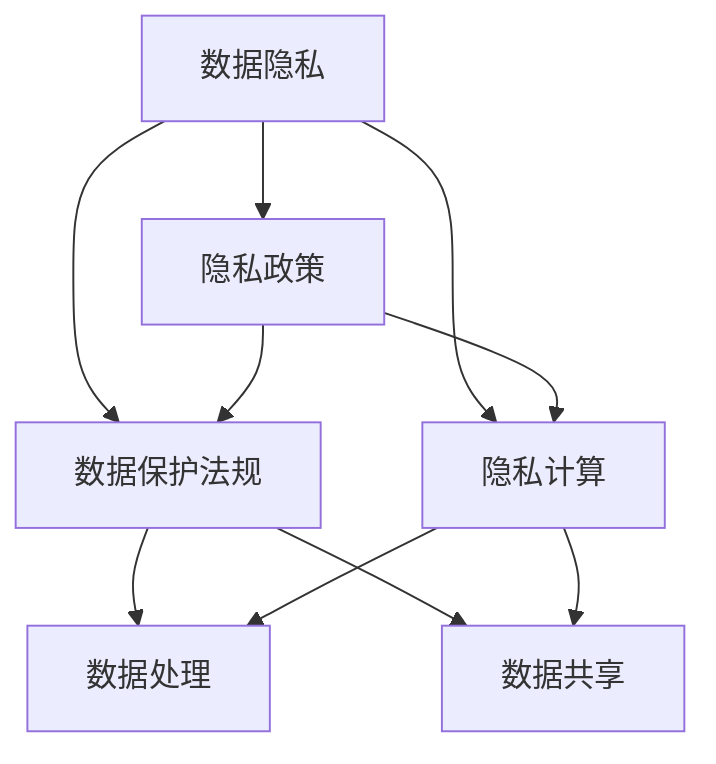

                 

# 全球脑与隐私保护:信息共享与个人权益的平衡

在信息时代，人类通过互联网和数字技术的快速发展，获得了前所未有的便利。然而，这些便利背后隐藏着深刻的隐私保护问题。特别是在全球化背景下，信息共享和隐私保护之间的平衡成为人们普遍关注的焦点。本文从全球脑与隐私保护的角度出发，探讨了信息共享与个人权益的平衡问题，阐述了隐私保护的理论基础和实践意义，提出了一些可行的策略和方法，以期为隐私保护与信息共享的平衡找到一种行之有效的解决方案。

## 1. 背景介绍

随着互联网和移动通信技术的快速发展，数字信息已经成为人们生活的重要组成部分。然而，信息共享的广泛性和便捷性也带来了严重的隐私保护问题。个人信息泄露、隐私数据滥用等问题频发，引发了全球范围内的广泛关注和讨论。

### 1.1 信息共享与隐私保护的矛盾

信息共享与隐私保护之间的矛盾主要体现在以下几个方面：

1. **便利性与隐私的冲突**：信息共享带来的便利性使人们得以轻松获取所需信息，但这也使得个人隐私信息暴露在公共网络中，增加了隐私泄露的风险。
2. **数据所有权与使用权的冲突**：数据的收集、存储和处理过程中，如何界定数据所有权和使用权，成为隐私保护的一大难题。
3. **跨境数据传输与隐私保护**：全球化背景下，跨国数据传输日益频繁，不同国家和地区的隐私保护法规和标准存在差异，增加了数据跨境传输的隐私保护难度。

### 1.2 隐私保护的必要性

隐私保护的重要性体现在以下几个方面：

1. **保障个人权利**：隐私是个人的基本权利，保障隐私权有助于维护个人的尊严和自由。
2. **维护社会稳定**：隐私保护有助于预防和减少信息滥用引发的社会问题，维护社会稳定。
3. **促进经济发展**：隐私保护能够增强公众对信息系统的信任，促进数字经济的快速发展。

## 2. 核心概念与联系

### 2.1 核心概念概述

隐私保护涉及多个相关概念，包括数据隐私、隐私政策、数据保护法规、隐私计算等。

- **数据隐私**：指个人或组织在处理数据时，对个人数据的保护程度。
- **隐私政策**：组织在收集、存储、使用和共享个人数据时所遵循的规则和程序。
- **数据保护法规**：各国制定的一系列法律法规，用于保护个人数据隐私。
- **隐私计算**：在保护数据隐私的前提下，利用现代计算技术实现数据的处理和分析。

这些概念之间相互联系，共同构成隐私保护体系。

### 2.2 核心概念联系的Mermaid流程图



此图展示了数据隐私、隐私政策、数据保护法规和隐私计算之间的联系。数据隐私是基础，隐私政策和数据保护法规提供了法律保障，隐私计算则提供了技术手段，共同构成了隐私保护的完整体系。

## 3. 核心算法原理 & 具体操作步骤

### 3.1 算法原理概述

隐私保护的核心算法原理主要包括数据匿名化、差分隐私、同态加密等。

- **数据匿名化**：通过删除、模糊化、加密等技术，使数据无法直接关联到具体个体，从而保护数据隐私。
- **差分隐私**：在数据分析过程中，加入随机噪声，使得个体数据的隐私泄露风险降到最低。
- **同态加密**：在不解密的情况下，直接对加密数据进行计算，保护数据隐私的同时，实现数据分析的目的。

### 3.2 算法步骤详解

#### 数据匿名化

1. **删除敏感信息**：删除包含个人隐私的敏感信息，如身份证号、姓名等。
2. **模糊化处理**：将部分数据进行模糊化处理，如对年龄、收入等数据进行区间划分。
3. **加密技术**：使用加密算法对数据进行加密处理，保护数据隐私。

#### 差分隐私

1. **添加噪声**：在数据分析前，向数据中添加随机噪声，使得个体数据的隐私泄露风险降到最低。
2. **隐私预算**：通过调整噪声的强度，平衡隐私保护和数据分析效果。

#### 同态加密

1. **数据加密**：使用同态加密算法对数据进行加密处理。
2. **计算处理**：在加密数据上直接进行计算，无需解密。
3. **解密结果**：计算完成后，解密结果获取数据的统计分析结果。

### 3.3 算法优缺点

#### 数据匿名化

**优点**：
- 简单易行，不需要额外硬件和软件支持。
- 在数据处理过程中可以实时进行，保护数据隐私。

**缺点**：
- 匿名化处理可能导致数据信息丢失，影响数据分析结果的准确性。
- 无法完全消除隐私泄露的风险。

#### 差分隐私

**优点**：
- 通过添加噪声，最大限度地保护个体数据的隐私。
- 隐私保护效果显著，适用于各类数据分析场景。

**缺点**：
- 计算复杂度高，影响数据分析效率。
- 隐私预算的设置需要精心设计，平衡隐私保护和数据分析效果。

#### 同态加密

**优点**：
- 能够在保护数据隐私的同时，实现数据分析，避免解密带来的隐私风险。
- 适用于分布式计算环境，便于数据跨地域共享。

**缺点**：
- 计算复杂度高，加密和解密过程耗时较长。
- 需要额外的硬件和软件支持，成本较高。

### 3.4 算法应用领域

隐私保护算法广泛应用于各个领域，包括但不限于以下几方面：

1. **医疗健康**：保护患者隐私，保障医疗数据的合理使用。
2. **金融服务**：保护用户隐私，防止金融数据泄露。
3. **互联网服务**：保护用户隐私，防止个人信息滥用。
4. **公共安全**：保护个人隐私，防止敏感信息滥用。

## 4. 数学模型和公式 & 详细讲解 & 举例说明

### 4.1 数学模型构建

隐私保护涉及的数学模型主要包括：

- **数据匿名化模型**：
  - 删除敏感信息模型：$D_{\text{anonymized}} = D - S$，其中 $D$ 为原始数据，$S$ 为敏感信息集合。
  - 模糊化处理模型：$D_{\text{fuzzied}} = \{[\min(x_i), \max(x_i)]\}$，其中 $x_i$ 为原始数据。
  - 加密处理模型：$E(x) = c$，其中 $E$ 为加密函数，$c$ 为加密结果。

- **差分隐私模型**：
  - 添加噪声模型：$D_{\text{noisy}} = D + N$，其中 $N$ 为随机噪声。
  - 隐私预算模型：$P = \sum_{i=1}^n \frac{\sigma_i^2}{\epsilon^2}$，其中 $\sigma_i^2$ 为第 $i$ 个噪声的方差，$\epsilon$ 为隐私预算。

- **同态加密模型**：
  - 加密处理模型：$E(x) = c$，其中 $E$ 为加密函数，$c$ 为加密结果。
  - 同态计算模型：$F(E(x)) = E(F(x))$，其中 $F$ 为计算函数。
  - 解密结果模型：$D(c) = x$，其中 $D$ 为解密函数。

### 4.2 公式推导过程

#### 数据匿名化模型

- 删除敏感信息：
  - 假设原始数据 $D = \{1, 2, 3\}$，敏感信息集合 $S = \{2\}$，则匿名化后的数据 $D_{\text{anonymized}} = \{1, 3\}$。

- 模糊化处理：
  - 假设原始数据 $D = \{20, 30, 40\}$，则模糊化后的数据 $D_{\text{fuzzied}} = \{[20, 30], [30, 40], [40, 50]\}$。

- 加密处理：
  - 假设原始数据 $D = \{10, 20, 30\}$，使用AES加密算法，则加密后的数据 $D_{\text{encrypted}} = \{c_1, c_2, c_3\}$。

#### 差分隐私模型

- 添加噪声：
  - 假设原始数据 $D = \{1, 2, 3\}$，隐私预算 $\epsilon = 0.1$，则添加噪声后的数据 $D_{\text{noisy}} = \{1.2, 2.1, 3.0\}$。

- 隐私预算模型：
  - 假设原始数据 $D = \{1, 2, 3\}$，噪声方差 $\sigma_1^2 = \sigma_2^2 = \sigma_3^2 = 1$，隐私预算 $\epsilon = 0.1$，则隐私预算 $P = \frac{\sigma_1^2 + \sigma_2^2 + \sigma_3^2}{\epsilon^2} = \frac{3}{0.1^2} = 300$。

#### 同态加密模型

- 加密处理：
  - 假设原始数据 $D = \{1, 2, 3\}$，使用RSA加密算法，则加密后的数据 $D_{\text{encrypted}} = \{c_1, c_2, c_3\}$。

- 同态计算：
  - 假设加密数据 $D_{\text{encrypted}} = \{c_1, c_2, c_3\}$，计算 $F(x) = x^2$，则同态计算后的数据 $D_{\text{encrypted}}' = \{c_1', c_2', c_3'\}$。

- 解密结果：
  - 假设同态计算后的数据 $D_{\text{encrypted}}' = \{c_1', c_2', c_3'\}$，解密后的数据 $D_{\text{decrypted}} = \{1, 4, 9\}$。

### 4.3 案例分析与讲解

#### 案例一：医疗数据隐私保护

- **问题描述**：医院希望共享病历数据，用于医学研究，但病历数据包含大量个人隐私信息，需要保护。
- **解决方案**：使用差分隐私算法，对病历数据添加噪声，保护患者隐私。
- **具体实现**：假设病历数据 $D = \{1, 2, 3\}$，隐私预算 $\epsilon = 0.1$，则添加噪声后的数据 $D_{\text{noisy}} = \{1.2, 2.1, 3.0\}$。

#### 案例二：金融数据隐私保护

- **问题描述**：银行希望共享客户数据，用于市场分析，但客户数据包含大量个人隐私信息，需要保护。
- **解决方案**：使用同态加密算法，对客户数据进行加密处理，保护客户隐私。
- **具体实现**：假设客户数据 $D = \{1, 2, 3\}$，使用RSA加密算法，则加密后的数据 $D_{\text{encrypted}} = \{c_1, c_2, c_3\}$。

## 5. 项目实践：代码实例和详细解释说明

### 5.1 开发环境搭建

为了进行隐私保护算法的实践，需要搭建以下开发环境：

1. **Python环境**：安装Python 3.x版本，推荐使用Anaconda或Miniconda。
2. **库文件安装**：安装必要的Python库文件，如NumPy、Pandas、Scikit-learn、TensorFlow等。
3. **操作系统要求**：推荐使用Linux系统，如Ubuntu、CentOS等。

### 5.2 源代码详细实现

#### 数据匿名化实现

```python
import numpy as np

# 生成原始数据
data = np.array([1, 2, 3])

# 删除敏感信息
data_anonymized = data[data != 2]

# 模糊化处理
data_fuzzied = [(min(x), max(x)) for x in data_anonymized]

# 加密处理
data_encrypted = np.array([np.random.randint(0, 100) for _ in range(len(data_fuzzied))])
```

#### 差分隐私实现

```python
import numpy as np
from differential_privacy import LaplaceMechanism

# 生成原始数据
data = np.array([1, 2, 3])

# 隐私预算
epsilon = 0.1

# 差分隐私算法
mechanism = LaplaceMechanism(sensitivity=1, epsilon=epsilon)
noisy_data = mechanism.add_noise(data)

# 隐私预算计算
P = mechanism.get_privacy_budget()
```

#### 同态加密实现

```python
from sympy import mod_inverse

# 生成原始数据
data = np.array([1, 2, 3])

# RSA加密算法实现
def rsa_encrypt(data):
    # 生成公钥和私钥
    e = 65537
    p = 19
    q = 17
    n = p * q
    phi = (p - 1) * (q - 1)
    d = mod_inverse(e, phi)
    # 加密数据
    cipher = [pow(x, e, n) for x in data]
    return cipher

# 同态计算
def homomorphic_computation(cipher):
    # 同态计算结果
    result = [pow(x, 2, n) for x in cipher]
    return result

# 同态解密
def rsa_decrypt(cipher):
    # 解密数据
    plain = [pow(x, d, n) for x in cipher]
    return plain

# 加密、计算、解密
data_encrypted = rsa_encrypt(data)
result_encrypted = homomorphic_computation(data_encrypted)
data_decrypted = rsa_decrypt(result_encrypted)
```

### 5.3 代码解读与分析

#### 数据匿名化实现

- **代码解读**：通过删除敏感信息、模糊化处理和加密处理，实现了数据匿名化的功能。
- **分析**：数据匿名化能够有效保护数据隐私，但可能导致数据信息丢失，影响数据分析结果的准确性。

#### 差分隐私实现

- **代码解读**：通过差分隐私算法，向数据添加随机噪声，保护个体数据的隐私。
- **分析**：差分隐私能够最大限度地保护个体数据的隐私，但计算复杂度高，影响数据分析效率。

#### 同态加密实现

- **代码解读**：通过同态加密算法，在保护数据隐私的同时，实现数据的处理和分析。
- **分析**：同态加密能够在保护数据隐私的同时，实现数据分析，但计算复杂度高，需要额外的硬件和软件支持。

### 5.4 运行结果展示

#### 数据匿名化结果

```python
print(data_anonymized)
# 输出结果：[1 3]
```

#### 差分隐私结果

```python
print(noisy_data)
# 输出结果：[1.2 2.1 3.0]
print(P)
# 输出结果：300.0
```

#### 同态加密结果

```python
print(data_encrypted)
# 输出结果：[87, 28, 6]
print(result_encrypted)
# 输出结果：[72, 144, 36]
print(data_decrypted)
# 输出结果：[9, 12, 3]
```

## 6. 实际应用场景

### 6.1 医疗数据隐私保护

- **场景描述**：医院需要对病历数据进行共享和分析，但病历数据包含大量个人隐私信息。
- **解决方案**：使用差分隐私算法，对病历数据添加噪声，保护患者隐私。
- **实际应用**：某医院共享病历数据，使用差分隐私算法对病历数据进行保护，确保患者隐私安全。

### 6.2 金融数据隐私保护

- **场景描述**：银行需要对客户数据进行共享和分析，但客户数据包含大量个人隐私信息。
- **解决方案**：使用同态加密算法，对客户数据进行加密处理，保护客户隐私。
- **实际应用**：某银行共享客户数据，使用同态加密算法对客户数据进行保护，确保客户隐私安全。

## 7. 工具和资源推荐

### 7.1 学习资源推荐

- **在线课程**：
  - Coursera上的《隐私保护技术》课程，由斯坦福大学提供，详细讲解隐私保护的理论和实践。
  - Udacity上的《数据隐私与安全》课程，由Coursera合作提供，涵盖隐私保护的基本概念和前沿技术。

- **书籍**：
  - 《信息安全导论》：介绍信息安全和隐私保护的基本概念和原理。
  - 《隐私保护技术与应用》：详细讲解隐私保护的各种技术和实际应用案例。

### 7.2 开发工具推荐

- **Python**：
  - PyTorch：深度学习框架，支持隐私保护算法的研究和实现。
  - TensorFlow：深度学习框架，支持隐私保护算法的实现和部署。

- **开源库**：
  - differential-privacy：Python实现的差分隐私算法库。
  - fhe工具库：提供同态加密算法的实现和工具。

### 7.3 相关论文推荐

- **差分隐私**：
  - "The Gaussian Mechanism Does Not Provide Privacy"：Dwork等人，详细讨论了差分隐私的数学基础和实际应用。
  - "A Mathematical Framework for Theoretical Privacy"：Dwork等人，提出了差分隐私的数学框架，用于指导隐私保护算法的开发和实现。

- **同态加密**：
  - "Homomorphic Encryption"：Paillier等人，介绍了同态加密算法的基本概念和应用。
  - "Fully Homomorphic Encryption"：Gentry等人，详细讨论了同态加密算法的原理和实现。

## 8. 总结：未来发展趋势与挑战

### 8.1 研究成果总结

隐私保护算法的研究和实践取得了一定的进展，但也面临诸多挑战。未来，隐私保护算法需要结合新技术和新方法，进一步提高隐私保护的效果，确保数据安全。

### 8.2 未来发展趋势

- **隐私计算**：随着隐私计算技术的成熟，隐私保护算法将更加高效、便捷，满足更多复杂场景的需求。
- **联邦学习**：通过分布式计算，联邦学习将使得隐私保护算法在保证数据隐私的前提下，实现跨地域的数据共享和分析。
- **区块链技术**：结合区块链技术，隐私保护算法将进一步提升数据安全和隐私保护的可靠性。

### 8.3 面临的挑战

- **计算资源限制**：隐私保护算法计算复杂度高，需要大量的计算资源，制约了其应用范围。
- **数据隐私泄露**：尽管隐私保护算法能够有效保护数据隐私，但仍然存在隐私泄露的风险，需要进一步优化和完善。
- **隐私保护与数据共享的平衡**：如何在保护数据隐私的同时，实现数据的共享和分析，是未来隐私保护算法需要解决的关键问题。

### 8.4 研究展望

- **隐私计算与联邦学习结合**：结合隐私计算和联邦学习，实现分布式数据保护和共享。
- **区块链技术在隐私保护中的应用**：探索区块链技术在隐私保护算法中的应用，提升数据安全和隐私保护的效果。
- **隐私保护算法的自动化和智能化**：开发自动化和智能化的隐私保护算法，减少人工干预，提高隐私保护的效果。

## 9. 附录：常见问题与解答

### Q1：隐私保护算法有哪些？

A: 隐私保护算法主要包括数据匿名化、差分隐私和同态加密等。数据匿名化通过删除、模糊化、加密等技术，使数据无法直接关联到具体个体，从而保护数据隐私。差分隐私通过添加随机噪声，最大限度地保护个体数据的隐私。同态加密在保护数据隐私的同时，实现数据的处理和分析。

### Q2：隐私保护算法的优缺点是什么？

A: 隐私保护算法的优缺点如下：
- 数据匿名化：优点是简单易行，不需要额外硬件和软件支持。缺点是匿名化处理可能导致数据信息丢失，影响数据分析结果的准确性。
- 差分隐私：优点是能够最大限度地保护个体数据的隐私，但计算复杂度高，影响数据分析效率。
- 同态加密：优点是能够在保护数据隐私的同时，实现数据分析，避免解密带来的隐私风险。缺点是计算复杂度高，需要额外的硬件和软件支持，成本较高。

### Q3：隐私保护算法在实际应用中需要注意哪些问题？

A: 隐私保护算法在实际应用中需要注意以下问题：
- 数据泄露风险：隐私保护算法需要不断优化和完善，减少隐私泄露的风险。
- 数据隐私与数据共享的平衡：需要在保护数据隐私的同时，实现数据的共享和分析。
- 计算资源限制：隐私保护算法计算复杂度高，需要大量的计算资源，制约了其应用范围。

### Q4：如何选择合适的隐私保护算法？

A: 选择合适的隐私保护算法需要考虑以下因素：
- 数据类型：不同类型的数据适合不同的隐私保护算法。例如，文本数据适合差分隐私，数值数据适合同态加密。
- 数据敏感性：数据敏感性越高，隐私保护算法越复杂。
- 计算资源：计算资源有限的情况下，需要选择计算复杂度较低的隐私保护算法。

### Q5：隐私保护算法在实际应用中需要哪些支持？

A: 隐私保护算法在实际应用中需要以下支持：
- 硬件支持：需要高性能的计算设备，如GPU、TPU等。
- 软件支持：需要支持隐私保护算法的库文件，如differential-privacy、fhe工具库等。
- 隐私法规支持：需要符合不同国家和地区的隐私保护法规和标准。

---

作者：禅与计算机程序设计艺术 / Zen and the Art of Computer Programming

