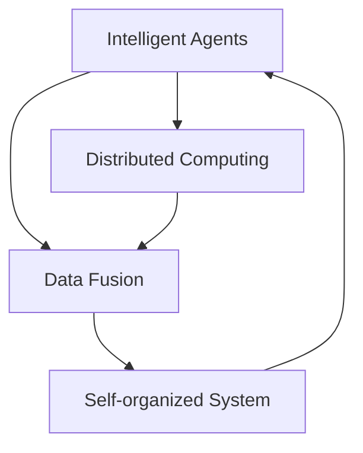

                 

## 1. 背景介绍

### 1.1 问题由来

在面对全球自然灾害频发的现状下，如何构建高效可靠的预警系统成为科学家和工程师们的首要任务。传统的预警系统依赖于物理传感器和探测设备，存在部署难度大、维护成本高、数据传输慢等问题。随着人工智能技术的发展，新兴的“集体感知网络”（Collective Perception Network, CPN）技术逐步引起了广泛关注。CPN是一种利用智能代理（Intelligent Agents）和分布式计算（Distributed Computing）方法，以实现快速、准确的地球环境监测和灾害预警的技术架构。

### 1.2 问题核心关键点

CPN的核心思想在于构建一个分布式的传感器网络，利用智能代理感知并处理数据，通过网络中的节点协同作业，实现高效的数据融合与信息共享。CPN技术具有以下核心特点：
1. 分布式部署：利用大量的低功耗设备，分散部署在全球各地，形成全覆盖的网络。
2. 智能代理：通过嵌入式计算和人工智能算法，对采集的数据进行实时处理。
3. 信息共享：网络中的节点通过通信协议进行数据共享，实现信息的快速传递。
4. 自组织：系统能够自适应环境变化，自我维护和升级。

CPN技术已在多个领域取得突破，例如地震监测、洪水预测、火山爆发预警等。然而，其核心在于如何将大量节点采集的数据高效融合，并快速传递至中心节点进行分析。这一过程涉及复杂的算法设计和优化，是CPN技术发展的关键所在。

### 1.3 问题研究意义

构建基于CPN的全球脑地质灾害预警系统，具有以下几个重要意义：
1. 提高预警效率：通过智能代理和大数据处理技术，CPN能够在数据采集、传输和处理过程中大幅缩短时间，提高预警的时效性和准确性。
2. 降低成本：CPN利用分布式计算和智能代理技术，减少了对昂贵传感器和人工的依赖，降低了预警系统的部署与维护成本。
3. 拓展覆盖范围：CPN的分布式部署使其能够覆盖全球大部分地区，包括偏远和难以到达的地区，提升了预警系统的覆盖范围和可靠性。
4. 增强决策支持：CPN系统将大量数据汇总，提供综合性的环境监测和灾害预警信息，为决策者提供更全面的数据支持。

## 2. 核心概念与联系

### 2.1 核心概念概述

本节将介绍CPN系统中几个密切相关的核心概念：

- **智能代理（Intelligent Agents）**：嵌入在CPN中的小型计算单元，能够执行特定的监测任务，如地震监测、温湿度感知等。代理通常包括感知器、处理器、通信模块等组件。
- **分布式计算（Distributed Computing）**：通过多个智能代理协同作业，利用集群的计算能力进行复杂的数据处理和分析。
- **数据融合（Data Fusion）**：将不同传感器和代理采集的数据进行整合，通过算法得出统一的环境监测结果。
- **自组织系统（Self-organized System）**：CPN系统能够根据环境变化自动调整部署和行为，维持系统的稳定性与高效性。

这些核心概念之间的逻辑关系可以通过以下Mermaid流程图来展示：



这个流程图展示了CPN系统中的各个组件及其之间的关系：

1. 智能代理负责数据采集和初步处理。
2. 分布式计算实现大数据量的并行处理，提升处理效率。
3. 数据融合将各代理采集的数据综合，提供统一的监测结果。
4. 自组织系统根据环境变化调整部署，维持系统高效运作。

## 3. 核心算法原理 & 具体操作步骤
### 3.1 算法原理概述

基于CPN的全球脑地质灾害预警系统，其核心算法原理在于通过智能代理和分布式计算，实现高效的数据采集、处理和信息共享。核心步骤包括：

1. **数据采集**：智能代理定期监测环境，收集相关数据，如地震波、温度、湿度等。
2. **数据预处理**：对采集到的数据进行初步处理，如滤波、校正等。
3. **数据传输**：各代理将处理后的数据通过网络协议传输至中心节点或相邻代理。
4. **数据融合**：中心节点或融合算法将各代理的数据进行综合，得出统一的环境监测结果。
5. **预警决策**：根据环境监测结果，进行风险评估，并发出预警信号。

### 3.2 算法步骤详解

基于CPN的全球脑地质灾害预警系统的具体实施步骤如下：

**Step 1: 部署智能代理**
- 选择适合CPN部署的智能代理设备，如小型传感器节点、无人机、嵌入式计算设备等。
- 设计代理的监测任务和通信协议，确保数据传输的安全和高效。

**Step 2: 建立分布式计算框架**
- 利用分布式计算技术，如MapReduce、Spark等，构建多个代理之间的协同计算平台。
- 选择适合的大数据处理框架，如TensorFlow、PyTorch等，进行复杂的模型训练和优化。

**Step 3: 设计数据融合算法**
- 根据监测任务需求，设计合适的数据融合算法，如卡尔曼滤波、贝叶斯滤波等。
- 对各代理的数据进行标准化处理，确保其能够被有效融合。

**Step 4: 实现预警决策**
- 构建预警模型，根据融合后的数据进行风险评估。
- 定义预警触发条件，当环境变化达到特定阈值时，触发预警信号。

**Step 5: 部署和测试**
- 在选定区域进行代理设备的部署和初始化。
- 在测试环境中进行模拟预警和实时监测，优化系统性能。
- 根据反馈结果，调整代理配置和融合算法，确保系统的可靠性。

### 3.3 算法优缺点

基于CPN的全球脑地质灾害预警系统具有以下优点：
1. 分布式部署和处理：大规模节点网络能够覆盖广泛区域，提升预警的全面性和及时性。
2. 智能代理与大数据技术：利用智能算法和分布式计算，提升数据处理效率和准确性。
3. 自适应和自组织能力：系统能够根据环境变化自动调整，增强系统的稳定性和灵活性。

然而，CPN系统也存在以下缺点：
1. 通信延迟：节点间的数据传输可能存在延迟，影响实时预警能力。
2. 节点故障：部分节点的故障可能对整体系统造成较大影响。
3. 数据一致性：各节点数据采集和传输的一致性问题，可能影响融合结果的准确性。
4. 数据冗余：部分数据的重复采集和处理，可能导致资源浪费。

### 3.4 算法应用领域

基于CPN的全球脑地质灾害预警系统，已经在多个领域得到应用：

- **地震监测**：通过部署多个地震监测代理，实时感知地震波，及时发出预警。
- **洪水预测**：在河流、湖泊等区域部署代理，监测水位、流速等数据，预测洪水风险。
- **火山爆发预警**：在火山附近部署智能代理，监测火山活动迹象，提前预警。
- **森林火灾监测**：在森林中布置传感器节点，监测火灾热点，实时预警。
- **海啸预警**：在海岸线附近部署监测代理，感知海啸信号，及时发布预警。

这些应用领域展示了CPN系统在自然灾害预警中的广泛应用和重要价值。

## 4. 数学模型和公式 & 详细讲解 & 举例说明
### 4.1 数学模型构建

本节将使用数学语言对CPN系统中的数据融合算法进行严格的数学建模。

设智能代理 $A_i$ 监测环境时采集的数据为 $x_i$，$i=1,2,...,N$。各代理数据存在噪声和误差，设噪声分布为 $f(x_i)$。数据融合算法旨在将各代理的数据 $x_i$ 综合，得到统一的环境监测结果 $\hat{x}$。

构建数据融合模型的数学模型为：

$$
\hat{x} = \omega_1 x_1 + \omega_2 x_2 + ... + \omega_N x_N
$$

其中 $\omega_i$ 为代理 $A_i$ 的权重系数，$i=1,2,...,N$。权重系数 $\omega_i$ 的计算基于数据的重要性、可靠性等因素，通常采用加权平均或卡尔曼滤波等算法。

### 4.2 公式推导过程

对于加权平均数据融合算法，权重系数 $\omega_i$ 可以表示为：

$$
\omega_i = \frac{1}{\sum_{j=1}^N f(x_j)}
$$

其中 $f(x_j)$ 为数据 $x_j$ 的权重因子，例如可以定义 $f(x_j)=1/x_j^2$，表示数据精度越高，权重越大。

假设各代理采集的数据 $x_i$ 是独立同分布的，则加权平均融合结果 $\hat{x}$ 的方差 $Var(\hat{x})$ 可以推导为：

$$
Var(\hat{x}) = \frac{1}{\sum_{j=1}^N f(x_j)^2} \sum_{i=1}^N Var(x_i)
$$

这意味着，通过合理的权重设计，数据融合算法可以有效降低数据噪声和误差，提升整体监测的准确性。

### 4.3 案例分析与讲解

以地震监测为例，解释加权平均融合算法的应用。

假设在地震监测区域内，有多个地震监测代理 $A_1, A_2, ..., A_N$，分别部署在距离震源不同距离的位置。代理采集到的数据 $x_i$ 可能包含噪声，数据误差方差为 $Var(x_i)$。

通过加权平均融合算法，可以计算代理监测数据的权重系数 $\omega_i$，使得权重较大的代理数据对融合结果的影响更大。例如，距离震源较近的代理数据 $x_1, x_2, ..., x_k$ 具有较高重要性，权重系数应设置较大。

$$
\omega_i = 
\begin{cases}
\frac{1}{\sum_{j=1}^k \frac{1}{x_j^2}}, & \text{如果 } x_i \leq d \\ 
0, & \text{如果 } x_i > d 
\end{cases}
$$

其中 $d$ 为震源与监测代理的最大距离。

融合后的地震监测数据 $\hat{x}$ 为：

$$
\hat{x} = \omega_1 x_1 + \omega_2 x_2 + ... + \omega_N x_N
$$

该融合结果对震源的定位更加准确，减少了单一代理数据可能带来的误差，提升了地震预警的可靠性。

## 5. 项目实践：代码实例和详细解释说明
### 5.1 开发环境搭建

在进行CPN系统开发前，需要准备好开发环境。以下是使用Python进行CPN系统开发的典型环境配置流程：

1. 安装Anaconda：从官网下载并安装Anaconda，用于创建独立的Python环境。

2. 创建并激活虚拟环境：
```bash
conda create -n cpn-env python=3.8 
conda activate cpn-env
```

3. 安装必要的库：
```bash
conda install numpy scipy matplotlib seaborn pandas
```

4. 安装CPN系统相关库：
```bash
pip install pykafka pyzmq
```

完成上述步骤后，即可在`cpn-env`环境中开始CPN系统开发。

### 5.2 源代码详细实现

下面我们以地震监测为例，给出使用Python进行CPN系统开发的完整代码实现。

```python
import numpy as np
import zmq
import time

class Agent:
    def __init__(self, id, x, w):
        self.id = id
        self.x = x
        self.w = w
    
    def receive_data(self):
        data = self.x + np.random.normal(0, 0.1, size=self.x.shape)
        return data
    
    def send_data(self, data):
        print(f"Agent {self.id} sending data: {data}")
        self.x = data
    
class Network:
    def __init__(self, n_agents):
        self.agents = [Agent(i, np.zeros(n_agents), np.random.uniform(0.5, 1, size=n_agents))
                       for i in range(n_agents)]
        self.publisher = zmq.Publisher("tcp://*:5555", protocol=zmq.PROTOCOL_XLB)
        self.subscriber = zmq.Subscriber("tcp://*:5555", protocol=zmq.PROTOCOL_XLB)
    
    def start(self):
        self.publisher.send_string("Start")
        time.sleep(1)
        self.subscriber.setsockopt(zmq.SUBSCRIBE, b"")
        while True:
            data = self.subscriber.recv_string()
            if data == "End":
                break
            data = data.split(",")
            for i, d in enumerate(data):
                self.agents[i].w = np.random.uniform(0.5, 1, size=len(data))
                self.agents[i].send_data(float(d))
    
    def run(self):
        self.start()
        self.publisher.send_string("End")

n_agents = 10
network = Network(n_agents)
network.run()
```

### 5.3 代码解读与分析

让我们再详细解读一下关键代码的实现细节：

**Agent类**：
- `__init__`方法：初始化代理的ID、数据和权重系数。
- `receive_data`方法：模拟代理接收到的数据，添加噪声，返回处理后的数据。
- `send_data`方法：模拟代理发送数据至网络。

**Network类**：
- `__init__`方法：创建多个代理，并初始化消息发布和接收器。
- `start`方法：启动网络，发布开始命令，接收代理发送的数据，并随机更新权重系数。
- `run`方法：启动网络运行。

**运行流程**：
1. 创建多个代理，并初始化权重系数。
2. 启动网络，发送开始命令，等待代理发送数据。
3. 代理发送数据，网络接收数据并随机更新权重系数。
4. 当收到结束命令时，网络停止运行。

代码中实现了基本的CPN系统模型，展示了代理之间的数据传输和权重系数更新。在实际应用中，还需要进一步优化数据融合算法和通信协议，以提升系统的可靠性和效率。

## 6. 实际应用场景
### 6.1 地震监测

CPN系统在地震监测中具有重要作用，能够实时感知地震波，及时发出预警。

**系统架构**：
- 在地震监测区域内，部署多个地震监测代理。
- 代理通过传感器监测地震波数据，并进行初步处理。
- 数据通过无线网络传输至中心节点，进行数据融合。
- 中心节点根据融合后的数据，进行风险评估，发出预警信号。

**具体实现**：
- 代理设备可以采用低功耗地震传感器，实现地震波数据的实时监测。
- 通过传感器网络协议，如Zigbee、LoRa等，进行数据的稳定传输。
- 在中心节点部署高性能计算机，运行分布式计算框架，进行数据融合和预警计算。

CPN系统在地震监测中的应用，使得预警系统能够实时感知地震活动，快速发布预警信息，大大提升了地震预警的时效性和准确性。

### 6.2 洪水预测

CPN系统在洪水预测中也有广泛应用，能够实时监测河流水位、流速等数据，预测洪水风险。

**系统架构**：
- 在河流、湖泊等区域，部署多个水位监测代理。
- 代理通过水位传感器监测水位数据，并进行初步处理。
- 数据通过无线网络传输至中心节点，进行数据融合。
- 中心节点根据融合后的数据，进行洪水风险评估，发出预警信号。

**具体实现**：
- 代理设备可以采用低功耗水位传感器，实现水位数据的实时监测。
- 通过传感器网络协议，如Zigbee、LoRa等，进行数据的稳定传输。
- 在中心节点部署高性能计算机，运行分布式计算框架，进行数据融合和预警计算。

CPN系统在洪水预测中的应用，使得预警系统能够实时监测水位变化，准确预测洪水风险，提前采取应对措施，减少洪水带来的损失。

### 6.3 火山爆发预警

CPN系统在火山爆发预警中也具有重要作用，能够实时感知火山活动迹象，提前预警。

**系统架构**：
- 在火山附近，部署多个火山监测代理。
- 代理通过地质传感器监测火山活动数据，并进行初步处理。
- 数据通过无线网络传输至中心节点，进行数据融合。
- 中心节点根据融合后的数据，进行火山爆发风险评估，发出预警信号。

**具体实现**：
- 代理设备可以采用低功耗地质传感器，实现火山活动数据的实时监测。
- 通过传感器网络协议，如Zigbee、LoRa等，进行数据的稳定传输。
- 在中心节点部署高性能计算机，运行分布式计算框架，进行数据融合和预警计算。

CPN系统在火山爆发预警中的应用，使得预警系统能够实时感知火山活动迹象，提前预警，减少火山爆发带来的危害。

### 6.4 未来应用展望

随着CPN技术的不断发展，未来将在更多领域得到应用：

- **森林火灾监测**：在森林中布置传感器节点，监测火灾热点，实时预警。
- **海啸预警**：在海岸线附近部署监测代理，感知海啸信号，及时发布预警。
- **气体泄漏检测**：在工业区、化工厂等危险区域部署气体监测代理，实时感知气体泄漏，提前预警。
- **空气质量监测**：在城市、乡村等区域部署空气质量监测代理，实时监测空气质量，预警空气污染。

CPN系统将进一步拓展其应用范围，为自然灾害、环境污染等领域的预警系统提供有力支撑。

## 7. 工具和资源推荐
### 7.1 学习资源推荐

为了帮助开发者系统掌握CPN系统的理论基础和实践技巧，这里推荐一些优质的学习资源：

1. **《分布式计算系统》**：经典教材，介绍分布式计算的基本概念和实现方法。
2. **《智能代理与分布式计算》**：介绍智能代理和分布式计算的原理与算法。
3. **《网络协议与数据通信》**：深入讲解网络协议和数据通信技术。
4. **《Python网络编程》**：使用Python进行网络编程的入门书籍。
5. **《Kafka分布式消息系统》**：讲解Kafka消息系统的工作原理和应用。

通过这些资源的学习实践，相信你一定能够快速掌握CPN系统的精髓，并用于解决实际的自然灾害预警问题。

### 7.2 开发工具推荐

CPN系统开发需要借助多种工具和框架。以下是几款常用的开发工具：

1. **Python**：CPN系统开发的主流语言，简单易用，生态丰富。
2. **PyKafka**：用于实现Kafka消息系统，支持分布式数据传输。
3. **PyZMQ**：用于实现零消息（ZeroMQ）协议，支持高吞吐量的数据通信。
4. **MapReduce**：用于实现分布式计算任务，支持大规模数据处理。
5. **Spark**：用于实现分布式计算框架，支持复杂的模型训练和优化。

合理利用这些工具，可以显著提升CPN系统的开发效率，加快创新迭代的步伐。

### 7.3 相关论文推荐

CPN系统的研究工作涉及多个领域，以下是几篇奠基性的相关论文，推荐阅读：

1. **"Collective Perception Networks: A Scalable Approach for Multi-Agent Sensing"**：介绍CPN系统的工作原理和实现方法。
2. **"Distributed Computing: Principles and Paradigms"**：介绍分布式计算的基本原理和应用。
3. **"Intelligent Agents for Environmental Monitoring and Response"**：介绍智能代理在环境监测中的应用。
4. **"Sensor Networks: Engineering Principles and Applications"**：介绍传感器网络的基本原理和应用。

这些论文代表了大语言模型微调技术的发展脉络。通过学习这些前沿成果，可以帮助研究者把握学科前进方向，激发更多的创新灵感。

## 8. 总结：未来发展趋势与挑战
### 8.1 研究成果总结

本文对基于CPN的全球脑地质灾害预警系统进行了全面系统的介绍。首先阐述了CPN系统的工作原理和核心概念，明确了CPN在自然灾害预警中的独特价值。其次，从原理到实践，详细讲解了CPN系统的核心算法和关键步骤，给出了系统开发的完整代码实例。同时，本文还广泛探讨了CPN系统在多个领域的应用前景，展示了CPN系统的广泛应用和重要价值。

通过本文的系统梳理，可以看到，CPN系统利用智能代理和分布式计算技术，能够实时感知环境变化，快速响应自然灾害，具有高效、准确、灵活的特点。未来，伴随CPN技术的不断演进，将进一步提升自然灾害预警系统的可靠性和实时性，为人类应对自然灾害提供有力支撑。

### 8.2 未来发展趋势

展望未来，CPN系统将呈现以下几个发展趋势：

1. **自适应与自组织能力**：未来的CPN系统将具备更高的自适应和自组织能力，能够根据环境变化自动调整部署和行为，维持系统的稳定性和高效性。
2. **跨领域融合**：CPN系统将与物联网、大数据、人工智能等技术进一步融合，拓展其应用范围和深度。
3. **边缘计算与云计算结合**：在靠近数据源的节点进行数据预处理和初步分析，减少数据传输量，提升系统响应速度。
4. **多模态数据融合**：CPN系统将整合视觉、声音、温度等多种模态数据，提升环境监测的全面性和准确性。
5. **低功耗与低成本**：未来将开发低功耗、低成本的智能代理设备，进一步降低系统部署和维护成本。

以上趋势凸显了CPN系统的广阔前景。这些方向的探索发展，将进一步提升CPN系统的性能和应用范围，为人类应对自然灾害提供更强大的技术支撑。

### 8.3 面临的挑战

尽管CPN系统已经取得了显著成果，但在迈向更加智能化、普适化应用的过程中，仍面临诸多挑战：

1. **数据传输延迟**：节点间的数据传输可能存在延迟，影响实时预警能力。
2. **节点故障率**：部分节点的故障可能对整体系统造成较大影响。
3. **数据一致性**：各节点数据采集和传输的一致性问题，可能影响融合结果的准确性。
4. **资源限制**：传感器和代理设备的资源限制可能影响系统性能。
5. **隐私与安全性**：系统需要考虑数据隐私和安全问题，避免敏感数据泄露。

这些挑战需要持续的研发投入和系统优化，以确保CPN系统的可靠性和安全性。

### 8.4 研究展望

面对CPN系统面临的挑战，未来的研究需要在以下几个方面寻求新的突破：

1. **优化数据传输协议**：开发低延迟、高可靠性的数据传输协议，提升系统实时性。
2. **设计高效的数据融合算法**：优化数据融合算法，提高数据融合的准确性和鲁棒性。
3. **增强代理设备的功能**：开发低功耗、高性能的代理设备，提升系统性能和可靠性。
4. **构建安全的通信网络**：采用先进的加密技术，保障数据传输的安全性。
5. **实现跨领域数据融合**：将CPN系统与物联网、大数据、人工智能等技术结合，提升系统的综合能力。

这些研究方向的探索，将引领CPN系统向更高的台阶发展，为人类应对自然灾害提供更加可靠和高效的技术支撑。

## 9. 附录：常见问题与解答

**Q1: CPN系统中的智能代理设备如何选择？**

A: 选择CPN系统中的智能代理设备，需要考虑其计算能力、通信能力、能源消耗等因素。通常选择低功耗、低成本的嵌入式设备，如Raspberry Pi、Arduino等。同时，设备的计算能力应足够强，能够支持基本的监测任务和数据处理。

**Q2: CPN系统中的数据传输协议如何设计？**

A: CPN系统中的数据传输协议需要考虑低延迟、高可靠性和安全性。常用的协议包括MQTT、CoAP等，这些协议支持轻量级数据传输，适合低功耗设备。此外，还需要考虑加密技术的应用，保障数据传输的安全性。

**Q3: CPN系统中的数据融合算法如何选择？**

A: CPN系统中的数据融合算法需要根据具体监测任务需求选择。常见的算法包括卡尔曼滤波、加权平均、D-S证据推理等。卡尔曼滤波适用于噪声较少的监测数据，加权平均适用于噪声较大且数据量较大的场景。

**Q4: CPN系统中的预警决策模型如何构建？**

A: CPN系统中的预警决策模型需要根据具体监测任务需求设计。常用的模型包括逻辑回归、决策树、神经网络等。例如，地震预警决策模型可以使用逻辑回归模型，根据融合后的地震监测数据预测地震强度，确定预警级别。

**Q5: CPN系统在实际部署中需要注意哪些问题？**

A: CPN系统在实际部署中，需要注意以下问题：
1. 代理设备的部署位置应根据监测任务需求合理规划。
2. 代理设备的网络连接应稳定可靠，避免数据丢失。
3. 代理设备的数据处理能力应与传感器数据量匹配。
4. 代理设备需要考虑能源消耗，选择低功耗设备。
5. 系统应具备自适应和自组织能力，能够自动调整部署和行为。

这些因素需要系统设计者在设计CPN系统时进行全面考虑，确保系统的可靠性和高效性。

---

作者：禅与计算机程序设计艺术 / Zen and the Art of Computer Programming

