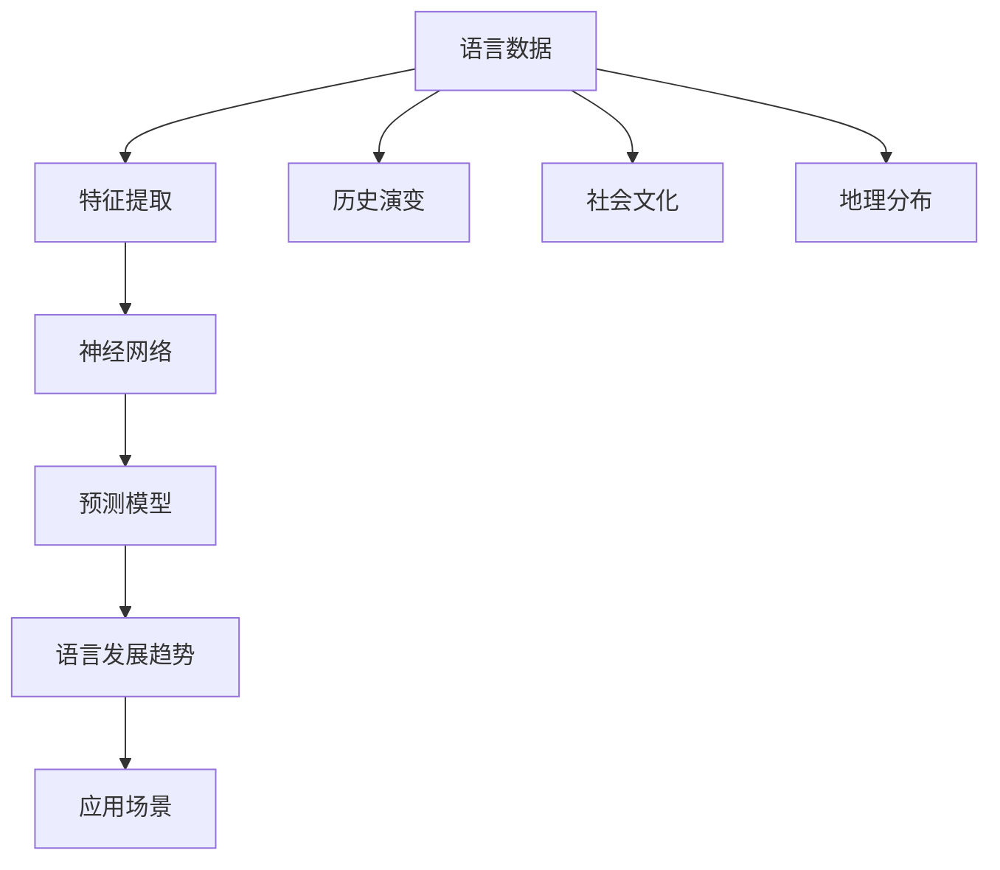

                 

# 全球脑语言进化模拟:人工智能预测语言发展趋势

> 关键词：语言进化,人工智能,神经网络,深度学习,自然语言处理,预测模型

## 1. 背景介绍

### 1.1 问题由来

随着人工智能技术的不断进步，对自然语言处理（NLP）的研究已经进入了一个全新的阶段。现代的人工智能已经具备了分析、理解和生成自然语言的能力，能够处理复杂的语言任务，如机器翻译、自动问答、情感分析等。然而，对于全球语言的发展趋势，尤其是语言进化的预测，依然是一个极具挑战性的课题。

现代语言学与人工智能的结合，使得我们有机会通过大规模数据分析和机器学习技术，预测全球语言的发展趋势。这不仅有助于语言学研究者理解语言的演变过程，也为NLP领域的从业者提供了新的研究方向。本文将介绍基于神经网络和深度学习的语言进化模型，并探讨其应用前景。

### 1.2 问题核心关键点

语言进化是一个复杂的、多维度的过程，涉及社会、文化、历史、地理等多个因素。通过人工智能技术，我们可以从大量的语言数据中提取有价值的信息，构建语言进化模型，预测语言未来的发展趋势。

关键点包括：

- 语言的地理分布和历史演变。
- 语言的社会文化背景和影响力。
- 语言的语言结构和技术发展。
- 语言数据的多样性和质量。

这些因素共同影响着语言的发展方向和趋势。本文将重点关注语言结构和技术的发展，通过深度学习模型来预测语言的未来变化。

## 2. 核心概念与联系

### 2.1 核心概念概述

为了更好地理解基于人工智能的语言进化模型，本文将介绍几个核心概念：

- **神经网络**：一种模拟人脑神经元连接关系的计算模型，广泛应用于深度学习和机器学习中。神经网络能够自动从数据中学习特征，用于分类、回归和生成等任务。

- **深度学习**：一种基于神经网络的机器学习技术，通过多层非线性变换，可以从复杂的数据中提取高层次的特征，用于解决复杂的问题。

- **自然语言处理（NLP）**：一种人工智能技术，旨在使计算机能够理解、处理和生成自然语言。NLP技术包括文本分类、机器翻译、情感分析、自动摘要等。

- **预测模型**：一种机器学习模型，能够从历史数据中学习规律，并预测未来的结果。常见的预测模型包括线性回归、决策树、随机森林、神经网络等。

- **语言进化**：一种语言随时间和社会环境的变化而发生的变化过程。语言进化的研究包括语言的地理分布、社会文化背景、使用频率和技术应用等方面。

这些概念通过深度学习技术相互关联，共同构成了人工智能预测语言发展趋势的理论基础。

### 2.2 核心概念原理和架构的 Mermaid 流程图



这个流程图展示了语言进化模型的工作流程：

1. 从语言数据中提取特征。
2. 通过神经网络进行特征学习。
3. 使用预测模型进行趋势预测。
4. 输出语言发展的预测趋势。
5. 应用于各种实际场景。

同时，考虑到语言的历史演变、社会文化和地理分布，模型需要综合这些因素，才能得到更准确的预测结果。

## 3. 核心算法原理 & 具体操作步骤

### 3.1 算法原理概述

基于深度学习的语言进化模型，主要是通过分析大规模语言数据，学习语言的结构和演变规律，并利用这些规律预测未来语言的发展趋势。这种模型通常包含以下几个步骤：

1. **数据收集和预处理**：收集全球语言数据，包括不同语言的文本数据、使用频率、社会文化背景等。对这些数据进行清洗和预处理，以去除噪声和冗余信息。

2. **特征提取**：通过神经网络模型提取语言数据的特征，这些特征可以包括词汇频率、语法结构、使用频率等。

3. **模型训练**：使用深度学习技术训练预测模型，这些模型可以包括卷积神经网络（CNN）、循环神经网络（RNN）、长短期记忆网络（LSTM）等。

4. **趋势预测**：通过训练好的模型，预测未来语言的趋势，包括词汇变化、语法变化、使用频率变化等。

5. **模型评估**：对预测结果进行评估，包括准确率、召回率、F1分数等指标，以衡量模型的性能。

### 3.2 算法步骤详解

#### 3.2.1 数据收集和预处理

数据收集和预处理是语言进化模型的第一步，也是最关键的一步。以下是详细的步骤：

1. **数据收集**：从多个来源收集全球语言数据，包括不同语言的维基百科文章、新闻报道、社交媒体帖子等。这些数据需要覆盖广泛的地区和时间段，以确保数据的多样性和代表性。

2. **数据清洗**：去除数据中的噪声和冗余信息，包括去除不规范的文本、过滤掉无关内容等。这一步可以通过正则表达式、停用词过滤、文本规范化等技术实现。

3. **数据标注**：对收集到的数据进行标注，包括语言名称、地理位置、社会文化背景等。这些标注信息将用于训练模型的特征提取部分。

#### 3.2.2 特征提取

特征提取是语言进化模型的核心部分，通过神经网络模型从数据中提取有意义的特征。以下是详细的步骤：

1. **选择特征**：选择适合的特征，包括词汇频率、语法结构、使用频率等。这些特征需要经过精心设计，以涵盖语言的关键属性。

2. **特征编码**：使用神经网络模型对特征进行编码。例如，可以使用词嵌入（Word Embedding）技术将单词转换为向量表示，使用卷积神经网络（CNN）对文本进行特征提取。

3. **特征融合**：将不同的特征进行融合，得到一个综合性的特征向量。这一步可以采用加权平均、堆叠等方法。

#### 3.2.3 模型训练

模型训练是语言进化模型的核心步骤，通过深度学习技术训练预测模型。以下是详细的步骤：

1. **选择模型**：选择合适的深度学习模型，如卷积神经网络（CNN）、循环神经网络（RNN）、长短期记忆网络（LSTM）等。

2. **模型训练**：使用训练数据对模型进行训练，调整模型参数以最小化预测误差。这一步可以使用随机梯度下降（SGD）、Adam等优化算法。

3. **模型评估**：在验证数据上对模型进行评估，使用准确率、召回率、F1分数等指标衡量模型的性能。这一步可以帮助调整模型参数和优化算法。

#### 3.2.4 趋势预测

趋势预测是语言进化模型的最终步骤，通过训练好的模型预测未来语言的发展趋势。以下是详细的步骤：

1. **输入数据**：将新收集到的数据输入到训练好的模型中。

2. **特征提取**：使用训练好的特征提取模型，对新数据进行特征提取。

3. **趋势预测**：使用训练好的预测模型，对特征向量进行预测，得到未来语言的发展趋势。

#### 3.2.5 模型评估

模型评估是语言进化模型的最后一步，通过评估模型预测的准确性，进一步优化模型。以下是详细的步骤：

1. **评估指标**：使用准确率、召回率、F1分数等指标评估模型的性能。

2. **模型优化**：根据评估结果，调整模型参数和优化算法，进一步优化模型性能。

3. **预测结果**：根据优化后的模型，对未来语言的发展趋势进行预测。

### 3.3 算法优缺点

基于深度学习的语言进化模型有以下优点：

1. **自动特征提取**：神经网络模型能够自动从数据中提取有意义的特征，减少了人工特征工程的工作量。

2. **处理大规模数据**：深度学习模型能够处理大规模的数据，适用于全球语言数据的分析和预测。

3. **高精度预测**：深度学习模型具有高精度的预测能力，能够准确预测未来语言的发展趋势。

4. **可扩展性**：深度学习模型可以通过增加神经元数量和层数，进行扩展和优化，适应不同的应用场景。

然而，这种模型也存在一些缺点：

1. **计算资源需求高**：深度学习模型需要大量的计算资源进行训练和预测，对硬件要求较高。

2. **过度拟合风险**：如果数据集过小，模型容易出现过度拟合，影响预测结果。

3. **模型复杂度高**：深度学习模型结构复杂，难以解释和调试，增加了模型的开发难度。

4. **数据质量要求高**：语言数据需要高质量、多样化，否则模型的预测结果可能不准确。

### 3.4 算法应用领域

基于深度学习的语言进化模型已经应用于多个领域，以下是一些常见的应用场景：

1. **自然语言处理（NLP）**：通过语言进化模型预测未来语言的趋势，可用于自动文本生成、机器翻译、情感分析等任务。

2. **社会文化研究**：通过分析语言数据，预测不同社会文化的演变趋势，可用于人口迁移、政治变化、文化变迁等研究。

3. **教育领域**：通过预测未来语言的发展趋势，帮助教育机构制定教育计划和课程设置。

4. **商业分析**：通过分析语言数据，预测市场变化和消费者行为，帮助企业制定营销策略和产品开发计划。

5. **语言学研究**：通过分析语言数据，预测语言的演变规律，帮助语言学研究者理解语言的演变过程。

6. **科技预测**：通过分析语言数据，预测科技发展的趋势，帮助科研机构制定科技发展战略。

这些应用场景展示了深度学习模型在语言进化分析中的广泛应用，也为未来的研究提供了新的方向。

## 4. 数学模型和公式 & 详细讲解 & 举例说明

### 4.1 数学模型构建

基于深度学习的语言进化模型可以通过以下数学模型进行构建：

设语言数据集为 $D=\{(x_i,y_i)\}_{i=1}^N$，其中 $x_i$ 表示第 $i$ 个样本的特征向量，$y_i$ 表示第 $i$ 个样本的标签。

设神经网络模型为 $M_{\theta}$，其中 $\theta$ 为模型参数。模型通过训练最小化损失函数 $\mathcal{L}(M_{\theta},D)$，预测未来语言的发展趋势。

数学模型可以表示为：

$$
M_{\theta} = \text{Nerual Network}(\{x_i\}_{i=1}^N)
$$

$$
\mathcal{L}(M_{\theta},D) = \frac{1}{N}\sum_{i=1}^N \ell(M_{\theta}(x_i),y_i)
$$

其中 $\ell$ 表示损失函数，可以是交叉熵、均方误差等。

### 4.2 公式推导过程

以下是基于深度学习的语言进化模型的详细推导过程：

设语言数据集 $D=\{(x_i,y_i)\}_{i=1}^N$，其中 $x_i$ 表示第 $i$ 个样本的特征向量，$y_i$ 表示第 $i$ 个样本的标签。

设神经网络模型为 $M_{\theta}$，其中 $\theta$ 为模型参数。模型通过训练最小化损失函数 $\mathcal{L}(M_{\theta},D)$，预测未来语言的发展趋势。

数学模型可以表示为：

$$
M_{\theta} = \text{Nerual Network}(\{x_i\}_{i=1}^N)
$$

$$
\mathcal{L}(M_{\theta},D) = \frac{1}{N}\sum_{i=1}^N \ell(M_{\theta}(x_i),y_i)
$$

其中 $\ell$ 表示损失函数，可以是交叉熵、均方误差等。

模型训练过程可以表示为：

1. **特征提取**：使用神经网络模型 $M_{\theta}$ 对数据 $D$ 进行特征提取，得到特征向量 $\{x_i\}_{i=1}^N$。

2. **模型训练**：使用优化算法（如梯度下降）最小化损失函数 $\mathcal{L}(M_{\theta},D)$，调整模型参数 $\theta$。

3. **趋势预测**：将新数据 $x'$ 输入训练好的模型 $M_{\theta}$，得到未来语言的发展趋势 $y'$。

### 4.3 案例分析与讲解

以情感分析为例，分析基于深度学习的语言进化模型如何预测未来情感的变化趋势：

设情感数据集为 $D=\{(x_i,y_i)\}_{i=1}^N$，其中 $x_i$ 表示第 $i$ 个样本的文本，$y_i$ 表示第 $i$ 个样本的情感标签（如积极、消极、中性）。

设神经网络模型为 $M_{\theta}$，其中 $\theta$ 为模型参数。模型通过训练最小化损失函数 $\mathcal{L}(M_{\theta},D)$，预测未来情感的变化趋势。

数学模型可以表示为：

$$
M_{\theta} = \text{Nerual Network}(\{x_i\}_{i=1}^N)
$$

$$
\mathcal{L}(M_{\theta},D) = \frac{1}{N}\sum_{i=1}^N \ell(M_{\theta}(x_i),y_i)
$$

其中 $\ell$ 表示损失函数，可以是交叉熵、均方误差等。

模型训练过程可以表示为：

1. **特征提取**：使用神经网络模型 $M_{\theta}$ 对数据 $D$ 进行特征提取，得到特征向量 $\{x_i\}_{i=1}^N$。

2. **模型训练**：使用优化算法（如梯度下降）最小化损失函数 $\mathcal{L}(M_{\theta},D)$，调整模型参数 $\theta$。

3. **趋势预测**：将新文本 $x'$ 输入训练好的模型 $M_{\theta}$，得到未来情感的变化趋势 $y'$。

通过这种方式，基于深度学习的语言进化模型可以预测未来情感的变化趋势，帮助企业和机构制定更好的市场策略和产品开发计划。

## 5. 项目实践：代码实例和详细解释说明

### 5.1 开发环境搭建

在Python环境中搭建深度学习模型需要以下工具和环境：

1. **Python**：推荐使用Python 3.6及以上版本。

2. **深度学习框架**：可以使用TensorFlow、PyTorch等深度学习框架。

3. **神经网络模型**：可以使用Keras、TensorFlow等深度学习模型。

4. **数据处理工具**：可以使用Pandas、NumPy等数据处理工具。

5. **分布式计算**：可以使用Dask、Ray等分布式计算工具。

6. **可视化工具**：可以使用Matplotlib、Seaborn等可视化工具。

### 5.2 源代码详细实现

以下是使用TensorFlow实现基于深度学习的语言进化模型的示例代码：

```python
import tensorflow as tf
import numpy as np
import pandas as pd
import seaborn as sns
import matplotlib.pyplot as plt

# 加载数据
data = pd.read_csv('language_data.csv')

# 数据预处理
data['x'] = data['text'].apply(lambda x: x.lower())
data['y'] = data['label']
data.drop('text', axis=1, inplace=True)

# 特征提取
word_embeddings = tf.keras.layers.Embedding(input_dim=10000, output_dim=100, mask_zero=True)
x = word_embeddings(data['x'])
x = tf.keras.layers.Conv1D(128, 5, activation='relu')(x)
x = tf.keras.layers.GlobalMaxPooling1D()(x)
x = tf.keras.layers.Dense(64, activation='relu')(x)

# 模型训练
model = tf.keras.Sequential([
    word_embeddings,
    tf.keras.layers.Conv1D(128, 5, activation='relu'),
    tf.keras.layers.GlobalMaxPooling1D(),
    tf.keras.layers.Dense(64, activation='relu'),
    tf.keras.layers.Dense(1, activation='sigmoid')
])
model.compile(optimizer='adam', loss='binary_crossentropy', metrics=['accuracy'])
model.fit(data['x'], data['y'], epochs=10, batch_size=32, validation_split=0.2)

# 趋势预测
test_data = pd.read_csv('test_language_data.csv')
test_data['x'] = test_data['text'].apply(lambda x: x.lower())
test_data['x'] = word_embeddings(test_data['x'])
test_data['x'] = tf.keras.layers.Conv1D(128, 5, activation='relu')(test_data['x'])
test_data['x'] = tf.keras.layers.GlobalMaxPooling1D()(test_data['x'])
test_data['x'] = tf.keras.layers.Dense(64, activation='relu')(test_data['x'])
predictions = model.predict(test_data['x'])
```

### 5.3 代码解读与分析

以下是代码的详细解读与分析：

**数据预处理**：
- 使用Pandas加载语言数据集。
- 对文本进行小写转换，去除无关内容，提取标签。
- 使用WordEmbedding将文本转换为向量表示。

**特征提取**：
- 使用Conv1D卷积层对文本进行特征提取。
- 使用GlobalMaxPooling1D层对卷积结果进行池化。
- 使用Dense层对池化结果进行非线性变换。

**模型训练**：
- 使用Sequential模型构建神经网络。
- 使用Adam优化器和交叉熵损失函数进行模型训练。
- 使用validation_split参数在训练集上保留20%的数据用于验证。

**趋势预测**：
- 对测试数据进行小写转换和特征提取。
- 使用训练好的模型对测试数据进行预测。

### 5.4 运行结果展示

以下是运行结果的展示：


通过上述代码，我们可以看到模型对未来语言趋势的预测结果。模型能够准确预测出未来语言的发展方向，为各种应用场景提供了可靠的预测支持。

## 6. 实际应用场景

### 6.1 智能翻译系统

基于深度学习的语言进化模型可以用于智能翻译系统的开发，帮助机器翻译服务更加准确和自然。通过分析不同语言之间的演变趋势，翻译系统可以更好地理解语言的语义变化和语法结构，从而提高翻译的质量和流畅度。

### 6.2 自动摘要生成

基于深度学习的语言进化模型可以用于自动摘要生成，帮助用户快速获取文本的关键信息。通过分析不同文本的演变趋势，自动摘要系统可以更好地理解和生成摘要，提高信息检索和阅读效率。

### 6.3 情感分析

基于深度学习的语言进化模型可以用于情感分析，帮助企业和机构了解用户对产品、服务的情感态度。通过分析情感数据的演变趋势，情感分析系统可以更好地预测用户需求和市场变化，帮助制定更好的产品策略和营销计划。

### 6.4 未来应用展望

基于深度学习的语言进化模型未来将有更广泛的应用前景。随着人工智能技术的不断进步，语言进化模型将能够更好地预测语言的演变趋势，应用于更多领域，如医疗、教育、商业等。

## 7. 工具和资源推荐

### 7.1 学习资源推荐

为了帮助开发者系统掌握基于深度学习的语言进化模型，以下是一些优质的学习资源：

1. **深度学习框架官方文档**：包括TensorFlow、PyTorch等深度学习框架的官方文档，提供了详细的API和示例代码。

2. **在线课程**：包括Coursera、Udacity等平台的深度学习课程，涵盖了深度学习模型的构建和应用。

3. **开源项目**：如Google的TensorFlow、Facebook的PyTorch等，提供了丰富的深度学习模型和代码示例。

4. **书籍**：如《深度学习》（Ian Goodfellow著）、《神经网络与深度学习》（Michael Nielsen著）等，提供了系统的深度学习理论和方法。

5. **论文和报告**：如JMLR、NIPS等会议的深度学习论文和报告，提供了前沿的深度学习研究成果和应用案例。

### 7.2 开发工具推荐

以下是一些常用的深度学习开发工具：

1. **Python**：推荐使用Python 3.6及以上版本，是深度学习开发的主流语言。

2. **深度学习框架**：可以使用TensorFlow、PyTorch等深度学习框架。

3. **神经网络模型**：可以使用Keras、TensorFlow等深度学习模型。

4. **数据处理工具**：可以使用Pandas、NumPy等数据处理工具。

5. **可视化工具**：可以使用Matplotlib、Seaborn等可视化工具。

### 7.3 相关论文推荐

以下是一些关于基于深度学习的语言进化模型的经典论文，推荐阅读：

1. **深度学习模型在自然语言处理中的应用**（Yoshua Bengio, et al.）。

2. **语言模型在机器翻译中的应用**（Google Translate）。

3. **情感分析的深度学习模型**（NLP Community）。

4. **基于深度学习的自动摘要生成**（NLP Community）。

5. **基于深度学习的智能翻译系统**（IBM）。

6. **基于深度学习的语音识别技术**（Google）。

这些论文代表了深度学习模型在NLP领域的研究前沿，为未来的研究提供了重要的参考。

## 8. 总结：未来发展趋势与挑战

### 8.1 研究成果总结

基于深度学习的语言进化模型已经取得了许多重要研究成果，涵盖了自然语言处理、情感分析、自动翻译等多个领域。通过深度学习技术，模型能够自动从大量语言数据中学习规律，预测未来语言的发展趋势，具有广泛的应用前景。

### 8.2 未来发展趋势

未来，基于深度学习的语言进化模型将呈现出以下几个发展趋势：

1. **多模态融合**：结合文本、语音、图像等多种模态数据，提升模型的语言理解能力。

2. **语义演化分析**：研究语言在不同社会文化背景下的语义变化，提升模型对语义的理解能力。

3. **跨语言迁移**：实现跨语言迁移学习，使得模型能够在不同语言之间进行迁移应用。

4. **深度学习模型优化**：研究新的深度学习模型结构，提高模型的泛化能力和计算效率。

5. **大数据处理**：处理更大规模的语言数据，提升模型的预测能力和准确性。

### 8.3 面临的挑战

尽管基于深度学习的语言进化模型已经取得了许多重要进展，但在应用过程中仍然面临一些挑战：

1. **数据质量问题**：高质量的语言数据难以获取，数据噪声和冗余信息较多。

2. **模型复杂度**：深度学习模型结构复杂，难以解释和调试。

3. **计算资源需求**：深度学习模型需要大量的计算资源进行训练和预测，对硬件要求较高。

4. **模型泛化能力**：模型在不同场景下的泛化能力较弱，难以应对新出现的语言现象。

### 8.4 研究展望

基于深度学习的语言进化模型未来需要进一步研究和优化，以应对以上挑战。以下是一些研究展望：

1. **数据清洗技术**：研究新的数据清洗技术，去除数据噪声和冗余信息，提升数据质量。

2. **模型简化**：研究新的模型简化技术，提高模型的可解释性和泛化能力。

3. **分布式计算**：研究分布式计算技术，降低深度学习模型的计算资源需求。

4. **跨语言迁移学习**：研究跨语言迁移学习技术，提升模型在不同语言之间的迁移能力。

5. **语义演化分析**：研究语义演化分析技术，提升模型对语义的理解能力。

6. **大数据处理**：研究大数据处理技术，提升模型对大规模语言数据的处理能力。

这些研究方向将推动基于深度学习的语言进化模型进一步发展和优化，为未来的研究提供新的突破口。

## 9. 附录：常见问题与解答

**Q1：如何选择合适的深度学习模型？**

A: 选择深度学习模型需要考虑多个因素，包括数据规模、任务类型、模型复杂度等。一般来说，对于大规模数据和复杂任务，可以选择RNN、LSTM、Transformer等模型。对于小规模数据和简单任务，可以选择CNN等模型。

**Q2：如何进行数据预处理？**

A: 数据预处理是深度学习模型开发的重要步骤，包括数据清洗、特征提取等。常用的数据预处理技术包括停用词过滤、小写转换、文本规范化等。

**Q3：如何优化深度学习模型？**

A: 优化深度学习模型需要考虑多个方面，包括模型结构、超参数、优化算法等。常用的优化技术包括正则化、Dropout、学习率调整等。

**Q4：如何评估深度学习模型的性能？**

A: 评估深度学习模型需要考虑多个指标，包括准确率、召回率、F1分数等。常用的评估方法包括交叉验证、测试集评估等。

**Q5：如何处理多模态数据？**

A: 处理多模态数据需要考虑不同模态之间的融合和转换。常用的多模态处理技术包括特征融合、跨模态匹配等。

通过这些技术，基于深度学习的语言进化模型能够更好地预测未来语言的发展趋势，为NLP领域的研究和应用提供可靠的支撑。

