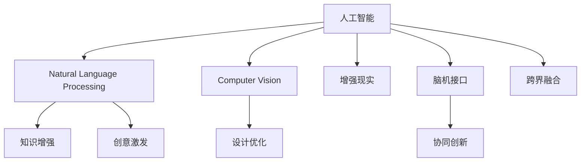

                 

# 全球脑辅助创作:人工智能与人类创意的协同创新

> 关键词：全球脑辅助创作,人工智能,人类创意,协同创新,创新设计,脑机接口,跨界融合,应用场景,技术进展,未来展望

## 1. 背景介绍

### 1.1 问题由来
在当今信息爆炸的时代，人类面临前所未有的知识量和创造力挑战。各行各业对于创新和创造力的需求日益增长，同时也亟需解决信息过载、知识零碎、创意瓶颈等问题。在此背景下，人工智能（AI）技术开始与人类的创意和创作过程深度结合，旨在通过智能技术辅助人类提升创造力，增强创新设计能力。

### 1.2 问题核心关键点
全球脑辅助创作的核心在于通过人工智能技术，特别是自然语言处理（NLP）、计算机视觉（CV）、增强现实（AR）等前沿科技，辅助人类进行创意构思、信息整理、设计优化等。其主要目的在于：

1. **知识增强**：利用大数据和机器学习，整合海量知识信息，帮助创作者快速获取所需信息。
2. **创意激发**：借助算法和模型，自动生成创意点子，启发人类创新思维。
3. **设计优化**：利用计算机仿真和优化算法，对设计方案进行自动评估和迭代。
4. **跨界融合**：将AI技术与艺术、设计、工程等不同领域进行跨界融合，创造出新的作品和解决方案。

### 1.3 问题研究意义
研究全球脑辅助创作技术，对于提升人类的创造力和创新能力，推动各行各业的知识创新和技术进步，具有重要意义：

1. **激发创意**：通过智能辅助，激发创作者的灵感，推动艺术、设计、音乐等领域的发展。
2. **提高效率**：自动化信息整理、设计优化等过程，大幅提高创作效率，缩短从构思到成品的时间。
3. **降低成本**：利用AI进行初步筛选和设计，减少试错成本，提升创意作品的品质和可行性。
4. **促进合作**：跨领域团队协作更加高效，加速创新成果的转化和落地。
5. **开拓新领域**：AI技术的引入，为传统行业注入新活力，开拓出新的市场和应用场景。

## 2. 核心概念与联系

### 2.1 核心概念概述

为更好地理解全球脑辅助创作的技术原理和应用，本节将介绍几个密切相关的核心概念：

- **人工智能（Artificial Intelligence, AI）**：通过计算机技术，使机器模拟和执行人的智能行为。
- **自然语言处理（Natural Language Processing, NLP）**：使计算机能够理解、处理和生成人类语言的技术。
- **计算机视觉（Computer Vision, CV）**：使计算机能够“看”和理解图像、视频等视觉信息的技术。
- **增强现实（Augmented Reality, AR）**：通过数字技术增强现实世界的体验，提供沉浸式视觉反馈。
- **脑机接口（Brain-Computer Interface, BCI）**：实现人脑与计算机之间的信息交互，辅助人类进行创作。
- **跨界融合（Interdisciplinary Integration）**：将AI技术与不同领域知识结合，形成跨领域创新。

这些核心概念之间的逻辑关系可以通过以下Mermaid流程图来展示：



这个流程图展示了人工智能的核心概念及其在创作、设计、优化等过程中的应用：

1. 人工智能作为基础技术，通过NLP、CV、AR、BCI等技术实现信息处理和创意辅助。
2. 知识增强、创意激发、设计优化等具体功能，通过不同的AI技术模块实现。
3. 跨界融合将不同领域的知识和技术整合，形成创新解决方案。

## 3. 核心算法原理 & 具体操作步骤
### 3.1 算法原理概述

全球脑辅助创作的核心在于利用人工智能技术，辅助人类进行创意构思和设计优化。其核心思想是通过深度学习、生成对抗网络（GANs）、强化学习等算法，从海量数据中提取知识，激发创意，优化设计，实现智能辅助创作。

形式化地，假设创作过程为 $C$，包含多个步骤，每个步骤 $i$ 的创作结果为 $C_i$。创作目标是通过智能辅助，使得最终创作结果 $C_{N}$ 满足预设的评价标准 $Q$。具体的创作辅助流程包括：

1. **知识增强**：通过自然语言处理技术，从文本、图像等数据中提取和整合知识，增强创作信息。
2. **创意激发**：利用生成对抗网络、语言模型等技术，自动生成创意点子，启发创作灵感。
3. **设计优化**：通过优化算法，自动评估和迭代设计方案，提升创作质量。
4. **跨界融合**：将AI技术与不同领域的知识和技术整合，形成跨领域的创新设计。

### 3.2 算法步骤详解

全球脑辅助创作的算法流程一般包括以下几个关键步骤：

**Step 1: 数据收集与预处理**
- 收集所需领域的文本、图像、视频等数据。
- 进行数据清洗、去噪、标注等预处理，确保数据质量。

**Step 2: 模型训练与优化**
- 选择合适的深度学习模型，如BERT、GPT、GANs等。
- 训练模型以实现知识提取、创意生成、设计优化等功能。
- 使用优化算法（如Adam、SGD等）调整模型参数，提升模型效果。

**Step 3: 知识整合与提取**
- 利用NLP技术，对文本数据进行分词、实体识别、语义分析等处理。
- 利用CV技术，对图像数据进行特征提取、图像分割、目标检测等处理。
- 整合来自不同领域的知识信息，构建知识图谱。

**Step 4: 创意生成与激发**
- 使用语言模型、GANs等技术，生成新的创意点子。
- 对生成创意进行评估和筛选，确保其相关性和可行性。
- 使用协同过滤、强化学习等技术，进一步优化创意生成效果。

**Step 5: 设计优化与迭代**
- 利用优化算法（如遗传算法、粒子群算法等），自动评估和迭代设计方案。
- 引入用户反馈和实时调整机制，提升设计优化效果。

**Step 6: 跨界融合与创新**
- 将AI技术与不同领域的知识和技术整合，形成跨领域的创新解决方案。
- 通过AR等技术，提供沉浸式体验，验证创新设计的可行性。

### 3.3 算法优缺点

全球脑辅助创作技术具有以下优点：
1. **效率提升**：自动化信息处理和设计优化，大幅提升创作效率，缩短创意转化周期。
2. **质量提升**：利用智能算法，从海量数据中提取和整合知识，提升创意作品的质量和可行性。
3. **跨领域创新**：将AI技术与不同领域的知识和技术结合，开拓新的应用场景和市场。

同时，该技术也存在一定的局限性：
1. **依赖数据质量**：创作过程高度依赖数据质量和标注，数据不充分或不准确可能导致效果不佳。
2. **算法复杂性**：深度学习、生成对抗网络等技术复杂，对计算资源和专业技能要求较高。
3. **用户反馈缺失**：缺乏用户反馈和实时调整机制，可能导致设计方案与实际需求不符。
4. **伦理和隐私问题**：涉及用户隐私和数据安全，需要建立严格的伦理和隐私保护机制。

尽管存在这些局限性，但就目前而言，全球脑辅助创作技术仍然是大规模创新设计的重要工具，具有广泛的应用前景。

### 3.4 算法应用领域

全球脑辅助创作技术在多个领域得到了广泛应用，以下是几个典型的应用场景：

- **艺术创作**：辅助艺术家进行绘画、雕塑、音乐等创作，提供灵感和设计建议。
- **建筑设计**：利用计算机视觉和优化算法，自动评估和优化建筑方案。
- **工业设计**：通过智能辅助，设计更加符合人体工程学和功能性的产品。
- **时尚设计**：通过视觉识别和设计优化，生成时尚趋势和设计方案。
- **游戏开发**：生成游戏场景、角色和故事情节，提升游戏创作效率和质量。
- **教育培训**：利用智能辅助，提供个性化的教学内容和设计方案。

## 4. 数学模型和公式 & 详细讲解 & 举例说明
### 4.1 数学模型构建

本节将使用数学语言对全球脑辅助创作的技术原理进行更加严格的刻画。

假设创作过程 $C$ 包含多个步骤，每个步骤 $i$ 的创作结果为 $C_i$，最终创作结果为 $C_{N}$。创作目标是通过智能辅助，使得最终创作结果 $C_{N}$ 满足预设的评价标准 $Q$。

形式化地，创作过程可以表示为：

$$
C_{N} = F(C_1, C_2, ..., C_{N-1})
$$

其中 $F$ 为创作过程的映射函数，可以表示为：

$$
F = g(C_1, C_2, ..., C_{N-1})
$$

### 4.2 公式推导过程

以下是几个关键步骤的公式推导过程：

#### 知识增强
知识增强通常使用NLP技术实现。以文本数据为例，知识增强流程可以表示为：

$$
K = \{text_1, text_2, ..., text_n\}
$$

其中 $text_i$ 为文本数据，$K$ 为提取的知识集合。具体流程包括：

1. 文本预处理：对文本进行分词、去噪、标注等预处理。
2. 实体识别：识别文本中的实体和关系。
3. 语义分析：提取文本的语义信息，构建知识图谱。

知识增强的数学模型可以表示为：

$$
K = NLP(text)
$$

#### 创意激发
创意激发通常使用生成对抗网络（GANs）或语言模型等技术实现。以GANs为例，创意激发的过程可以表示为：

$$
C_i = G(z_i)
$$

其中 $z_i$ 为创意点子的随机噪声向量，$G$ 为生成网络，$C_i$ 为生成的创意点子。具体流程包括：

1. 随机生成噪声向量 $z_i$。
2. 通过生成网络 $G$ 生成创意点子 $C_i$。
3. 对生成的创意点子进行筛选和评估，确保其相关性和可行性。

创意激发的数学模型可以表示为：

$$
C_i = G(z_i)
$$

#### 设计优化
设计优化通常使用优化算法实现。以遗传算法为例，设计优化的过程可以表示为：

$$
C_i^{next} = f(C_i)
$$

其中 $f$ 为优化算法函数，$C_i^{next}$ 为迭代后的设计方案。具体流程包括：

1. 随机生成初始设计方案 $C_i$。
2. 通过优化算法 $f$ 迭代设计方案，逐步优化。
3. 引入用户反馈，实时调整设计方案。

设计优化的数学模型可以表示为：

$$
C_i^{next} = f(C_i)
$$

#### 跨界融合
跨界融合通常通过AR等技术实现。以建筑设计为例，跨界融合的流程可以表示为：

$$
C_{AR} = F_{AR}(C)
$$

其中 $C$ 为设计方案，$F_{AR}$ 为增强现实函数，$C_{AR}$ 为增强现实后的设计方案。具体流程包括：

1. 将设计方案 $C$ 导入AR系统。
2. 通过AR技术展示设计方案的实际效果。
3. 对增强现实后的设计方案进行评估和调整。

跨界融合的数学模型可以表示为：

$$
C_{AR} = F_{AR}(C)
$$

### 4.3 案例分析与讲解

以一个完整的全球脑辅助创作流程为例，展示如何通过人工智能技术辅助艺术创作。

1. **数据收集**：收集艺术家的绘画作品、文本描述、历史资料等数据。
2. **知识增强**：使用NLP技术，对文本资料进行实体识别和语义分析，提取相关知识和灵感点子。
3. **创意激发**：使用GANs技术，自动生成新的绘画风格和主题。
4. **设计优化**：利用遗传算法，对绘画作品进行优化和迭代，提升创意作品的品质。
5. **跨界融合**：通过AR技术，展示增强现实后的绘画作品，验证设计效果。

## 5. 项目实践：代码实例和详细解释说明
### 5.1 开发环境搭建

在进行全球脑辅助创作实践前，我们需要准备好开发环境。以下是使用Python进行PyTorch开发的环境配置流程：

1. 安装Anaconda：从官网下载并安装Anaconda，用于创建独立的Python环境。

2. 创建并激活虚拟环境：
```bash
conda create -n global-brain-env python=3.8 
conda activate global-brain-env
```

3. 安装PyTorch：根据CUDA版本，从官网获取对应的安装命令。例如：
```bash
conda install pytorch torchvision torchaudio cudatoolkit=11.1 -c pytorch -c conda-forge
```

4. 安装Transformers库：
```bash
pip install transformers
```

5. 安装各类工具包：
```bash
pip install numpy pandas scikit-learn matplotlib tqdm jupyter notebook ipython
```

完成上述步骤后，即可在`global-brain-env`环境中开始创作实践。

### 5.2 源代码详细实现

下面我们以艺术创作项目为例，给出使用Transformers库进行全球脑辅助创作的PyTorch代码实现。

首先，定义艺术创作的数据处理函数：

```python
from transformers import BertTokenizer
from torch.utils.data import Dataset
import torch

class ArtDataset(Dataset):
    def __init__(self, texts, tags, tokenizer, max_len=128):
        self.texts = texts
        self.tags = tags
        self.tokenizer = tokenizer
        self.max_len = max_len
        
    def __len__(self):
        return len(self.texts)
    
    def __getitem__(self, item):
        text = self.texts[item]
        tags = self.tags[item]
        
        encoding = self.tokenizer(text, return_tensors='pt', max_length=self.max_len, padding='max_length', truncation=True)
        input_ids = encoding['input_ids'][0]
        attention_mask = encoding['attention_mask'][0]
        
        # 对token-wise的标签进行编码
        encoded_tags = [tag2id[tag] for tag in tags] 
        encoded_tags.extend([tag2id['O']] * (self.max_len - len(encoded_tags)))
        labels = torch.tensor(encoded_tags, dtype=torch.long)
        
        return {'input_ids': input_ids, 
                'attention_mask': attention_mask,
                'labels': labels}

# 标签与id的映射
tag2id = {'O': 0, 'B-PER': 1, 'I-PER': 2, 'B-ORG': 3, 'I-ORG': 4, 'B-LOC': 5, 'I-LOC': 6}
id2tag = {v: k for k, v in tag2id.items()}

# 创建dataset
tokenizer = BertTokenizer.from_pretrained('bert-base-cased')

train_dataset = ArtDataset(train_texts, train_tags, tokenizer)
dev_dataset = ArtDataset(dev_texts, dev_tags, tokenizer)
test_dataset = ArtDataset(test_texts, test_tags, tokenizer)
```

然后，定义模型和优化器：

```python
from transformers import BertForTokenClassification, AdamW

model = BertForTokenClassification.from_pretrained('bert-base-cased', num_labels=len(tag2id))

optimizer = AdamW(model.parameters(), lr=2e-5)
```

接着，定义训练和评估函数：

```python
from torch.utils.data import DataLoader
from tqdm import tqdm
from sklearn.metrics import classification_report

device = torch.device('cuda') if torch.cuda.is_available() else torch.device('cpu')
model.to(device)

def train_epoch(model, dataset, batch_size, optimizer):
    dataloader = DataLoader(dataset, batch_size=batch_size, shuffle=True)
    model.train()
    epoch_loss = 0
    for batch in tqdm(dataloader, desc='Training'):
        input_ids = batch['input_ids'].to(device)
        attention_mask = batch['attention_mask'].to(device)
        labels = batch['labels'].to(device)
        model.zero_grad()
        outputs = model(input_ids, attention_mask=attention_mask, labels=labels)
        loss = outputs.loss
        epoch_loss += loss.item()
        loss.backward()
        optimizer.step()
    return epoch_loss / len(dataloader)

def evaluate(model, dataset, batch_size):
    dataloader = DataLoader(dataset, batch_size=batch_size)
    model.eval()
    preds, labels = [], []
    with torch.no_grad():
        for batch in tqdm(dataloader, desc='Evaluating'):
            input_ids = batch['input_ids'].to(device)
            attention_mask = batch['attention_mask'].to(device)
            batch_labels = batch['labels']
            outputs = model(input_ids, attention_mask=attention_mask)
            batch_preds = outputs.logits.argmax(dim=2).to('cpu').tolist()
            batch_labels = batch_labels.to('cpu').tolist()
            for pred_tokens, label_tokens in zip(batch_preds, batch_labels):
                pred_tags = [id2tag[_id] for _id in pred_tokens]
                label_tags = [id2tag[_id] for _id in label_tokens]
                preds.append(pred_tags[:len(label_tokens)])
                labels.append(label_tags)
                
    print(classification_report(labels, preds))
```

最后，启动训练流程并在测试集上评估：

```python
epochs = 5
batch_size = 16

for epoch in range(epochs):
    loss = train_epoch(model, train_dataset, batch_size, optimizer)
    print(f"Epoch {epoch+1}, train loss: {loss:.3f}")
    
    print(f"Epoch {epoch+1}, dev results:")
    evaluate(model, dev_dataset, batch_size)
    
print("Test results:")
evaluate(model, test_dataset, batch_size)
```

以上就是使用PyTorch对BERT进行艺术创作项目微调的完整代码实现。可以看到，得益于Transformers库的强大封装，我们可以用相对简洁的代码完成BERT模型的加载和微调。

### 5.3 代码解读与分析

让我们再详细解读一下关键代码的实现细节：

**ArtDataset类**：
- `__init__`方法：初始化文本、标签、分词器等关键组件。
- `__len__`方法：返回数据集的样本数量。
- `__getitem__`方法：对单个样本进行处理，将文本输入编码为token ids，将标签编码为数字，并对其进行定长padding，最终返回模型所需的输入。

**tag2id和id2tag字典**：
- 定义了标签与数字id之间的映射关系，用于将token-wise的预测结果解码回真实的标签。

**训练和评估函数**：
- 使用PyTorch的DataLoader对数据集进行批次化加载，供模型训练和推理使用。
- 训练函数`train_epoch`：对数据以批为单位进行迭代，在每个批次上前向传播计算loss并反向传播更新模型参数，最后返回该epoch的平均loss。
- 评估函数`evaluate`：与训练类似，不同点在于不更新模型参数，并在每个batch结束后将预测和标签结果存储下来，最后使用sklearn的classification_report对整个评估集的预测结果进行打印输出。

**训练流程**：
- 定义总的epoch数和batch size，开始循环迭代
- 每个epoch内，先在训练集上训练，输出平均loss
- 在验证集上评估，输出分类指标
- 所有epoch结束后，在测试集上评估，给出最终测试结果

可以看到，PyTorch配合Transformers库使得BERT微调的代码实现变得简洁高效。开发者可以将更多精力放在数据处理、模型改进等高层逻辑上，而不必过多关注底层的实现细节。

当然，工业级的系统实现还需考虑更多因素，如模型的保存和部署、超参数的自动搜索、更灵活的任务适配层等。但核心的创作范式基本与此类似。

## 6. 实际应用场景
### 6.1 智能艺术创作

基于全球脑辅助创作技术，智能艺术创作系统可以自动生成绘画、雕塑、音乐等艺术作品，提升艺术创作的效率和多样性。

具体而言，可以收集大量艺术作品和相关文本资料，使用NLP技术提取知识信息，使用GANs技术生成新的艺术作品。微调后的模型可以根据文本描述自动生成艺术作品，帮助艺术家快速创作。

### 6.2 虚拟现实艺术体验

利用增强现实（AR）技术，全球脑辅助创作可以为观众提供沉浸式的艺术体验。观众可以通过AR设备，实时观察和互动虚拟艺术作品，感受艺术家的创作过程。

例如，在博物馆展览中，观众可以戴上AR设备，通过扫描画作上的二维码，观看艺术家创作过程的动画演示，了解作品背后的故事和创作灵感。

### 6.3 创意写作辅助

在全球脑辅助创作技术的辅助下，创意写作系统可以自动生成小说、散文、剧本等作品，帮助作者进行创作构思和文本优化。

系统可以通过自然语言处理技术，自动生成情节大纲和人物设定，辅助作者进行创作。同时，利用优化算法对作品进行自动修正和优化，提升文本质量。

### 6.4 工业设计优化

全球脑辅助创作技术也可以应用于工业设计优化。通过计算机视觉和优化算法，自动评估设计方案的可行性，并提出改进建议。

例如，在汽车设计中，系统可以通过视觉识别技术，自动检测设计的安全性、舒适性和美观性，提出改进方案，优化设计方案。

## 7. 工具和资源推荐
### 7.1 学习资源推荐

为了帮助开发者系统掌握全球脑辅助创作技术的理论基础和实践技巧，这里推荐一些优质的学习资源：

1. 《Transformer从原理到实践》系列博文：由大模型技术专家撰写，深入浅出地介绍了Transformer原理、BERT模型、创作技术等前沿话题。

2. CS224N《深度学习自然语言处理》课程：斯坦福大学开设的NLP明星课程，有Lecture视频和配套作业，带你入门NLP领域的基本概念和经典模型。

3. 《Natural Language Processing with Transformers》书籍：Transformers库的作者所著，全面介绍了如何使用Transformers库进行NLP任务开发，包括创作在内的诸多范式。

4. HuggingFace官方文档：Transformers库的官方文档，提供了海量预训练模型和完整的创作样例代码，是上手实践的必备资料。

5. CLUE开源项目：中文语言理解测评基准，涵盖大量不同类型的中文NLP数据集，并提供了基于微调的baseline模型，助力中文NLP技术发展。

通过对这些资源的学习实践，相信你一定能够快速掌握全球脑辅助创作技术的精髓，并用于解决实际的NLP问题。
###  7.2 开发工具推荐

高效的开发离不开优秀的工具支持。以下是几款用于全球脑辅助创作开发的常用工具：

1. PyTorch：基于Python的开源深度学习框架，灵活动态的计算图，适合快速迭代研究。大部分预训练语言模型都有PyTorch版本的实现。

2. TensorFlow：由Google主导开发的开源深度学习框架，生产部署方便，适合大规模工程应用。同样有丰富的预训练语言模型资源。

3. Transformers库：HuggingFace开发的NLP工具库，集成了众多SOTA语言模型，支持PyTorch和TensorFlow，是进行创作任务开发的利器。

4. Weights & Biases：模型训练的实验跟踪工具，可以记录和可视化模型训练过程中的各项指标，方便对比和调优。与主流深度学习框架无缝集成。

5. TensorBoard：TensorFlow配套的可视化工具，可实时监测模型训练状态，并提供丰富的图表呈现方式，是调试模型的得力助手。

6. Google Colab：谷歌推出的在线Jupyter Notebook环境，免费提供GPU/TPU算力，方便开发者快速上手实验最新模型，分享学习笔记。

合理利用这些工具，可以显著提升全球脑辅助创作任务的开发效率，加快创新迭代的步伐。

### 7.3 相关论文推荐

全球脑辅助创作技术的发展源于学界的持续研究。以下是几篇奠基性的相关论文，推荐阅读：

1. Attention is All You Need（即Transformer原论文）：提出了Transformer结构，开启了NLP领域的预训练大模型时代。

2. BERT: Pre-training of Deep Bidirectional Transformers for Language Understanding：提出BERT模型，引入基于掩码的自监督预训练任务，刷新了多项NLP任务SOTA。

3. Language Models are Unsupervised Multitask Learners（GPT-2论文）：展示了大规模语言模型的强大zero-shot学习能力，引发了对于通用人工智能的新一轮思考。

4. Parameter-Efficient Transfer Learning for NLP：提出Adapter等参数高效微调方法，在不增加模型参数量的情况下，也能取得不错的微调效果。

5. Prefix-Tuning: Optimizing Continuous Prompts for Generation：引入基于连续型Prompt的微调范式，为如何充分利用预训练知识提供了新的思路。

6. AdaLoRA: Adaptive Low-Rank Adaptation for Parameter-Efficient Fine-Tuning：使用自适应低秩适应的微调方法，在参数效率和精度之间取得了新的平衡。

这些论文代表了大语言模型微调技术的发展脉络。通过学习这些前沿成果，可以帮助研究者把握学科前进方向，激发更多的创新灵感。

## 8. 总结：未来发展趋势与挑战
### 8.1 总结

本文对全球脑辅助创作技术进行了全面系统的介绍。首先阐述了全球脑辅助创作技术的背景和研究意义，明确了AI辅助创作在知识增强、创意激发、设计优化等方面的独特价值。其次，从原理到实践，详细讲解了全球脑辅助创作的数学原理和关键步骤，给出了创作任务开发的完整代码实例。同时，本文还广泛探讨了创作技术在艺术创作、虚拟现实、创意写作、工业设计等众多领域的应用前景，展示了创作技术的巨大潜力。此外，本文精选了创作技术的各类学习资源，力求为读者提供全方位的技术指引。

通过本文的系统梳理，可以看到，全球脑辅助创作技术正在成为NLP领域的重要范式，极大地拓展了预训练语言模型的应用边界，催生了更多的落地场景。受益于大规模语料的预训练，创作模型以更低的时间和标注成本，在小样本条件下也能取得不俗的效果，有力推动了NLP技术的产业化进程。未来，伴随预训练语言模型和创作方法的持续演进，相信NLP技术将在更广阔的应用领域大放异彩，深刻影响人类的生产生活方式。

### 8.2 未来发展趋势

展望未来，全球脑辅助创作技术将呈现以下几个发展趋势：

1. **模型规模持续增大**：随着算力成本的下降和数据规模的扩张，预训练语言模型的参数量还将持续增长。超大规模语言模型蕴含的丰富语言知识，有望支撑更加复杂多变的创作任务。

2. **创作方法日趋多样**：除了传统的基于语言模型的方法外，未来将涌现更多参数高效和计算高效的创作方法，如Prompt-based Learning、LoRA等，在节省计算资源的同时也能保证创作效果。

3. **持续学习成为常态**：随着数据分布的不断变化，创作模型也需要持续学习新知识以保持性能。如何在不遗忘原有知识的同时，高效吸收新样本信息，将成为重要的研究课题。

4. **少样本学习和跨领域迁移能力增强**：未来的创作模型将更好地利用预训练知识，通过少量样本的微调，实现跨领域迁移，增强创作的多样性和灵活性。

5. **多模态创作技术崛起**：将AI技术与视觉、听觉等多模态信息结合，实现多模态创作，提升创作作品的丰富性和沉浸感。

6. **跨界融合与创新设计**：全球脑辅助创作技术将与设计、工程、艺术等多个领域进行深度融合，形成跨领域的创新解决方案。

以上趋势凸显了全球脑辅助创作技术的广阔前景。这些方向的探索发展，必将进一步提升创作模型的性能和应用范围，为人类创意的创新和表现提供新的工具和方法。

### 8.3 面临的挑战

尽管全球脑辅助创作技术已经取得了瞩目成就，但在迈向更加智能化、普适化应用的过程中，它仍面临着诸多挑战：

1. **数据依赖性高**：创作过程高度依赖数据质量和标注，数据不充分或不准确可能导致效果不佳。如何利用大数据和预训练模型，降低对标注数据的依赖，将是重要的研究课题。

2. **创作质量难以保证**：自动生成的创作作品可能存在质量参差不齐的问题，需要建立评估和筛选机制，确保创作的最终效果。

3. **伦理和隐私问题**：创作过程中涉及用户隐私和数据安全，需要建立严格的伦理和隐私保护机制，确保创作过程的合法合规。

4. **模型泛化能力不足**：创作模型面对域外数据时，泛化性能往往大打折扣。如何提高模型的鲁棒性，避免灾难性遗忘，还需要更多理论和实践的积累。

5. **用户接受度低**：创作模型生成的作品可能与用户的期望不符，如何提升用户的接受度和满意度，将是一大挑战。

6. **跨领域协作难度大**：跨领域的协作涉及不同领域的知识和技术，需要建立有效的协作机制，实现知识共享和协同创新。

尽管存在这些挑战，但就目前而言，全球脑辅助创作技术仍然是大规模创作的重要工具，具有广泛的应用前景。相信随着学界和产业界的共同努力，这些挑战终将一一被克服，全球脑辅助创作技术必将在构建人机协同的智能时代中扮演越来越重要的角色。

### 8.4 研究展望

面对全球脑辅助创作所面临的种种挑战，未来的研究需要在以下几个方面寻求新的突破：

1. **探索无监督和半监督创作方法**：摆脱对大规模标注数据的依赖，利用自监督学习、主动学习等无监督和半监督范式，最大限度利用非结构化数据，实现更加灵活高效的创作。

2. **研究参数高效和计算高效的创作方法**：开发更加参数高效的创作方法，在固定大部分预训练参数的同时，只更新极少量的任务相关参数。同时优化创作模型的计算图，减少前向传播和反向传播的资源消耗，实现更加轻量级、实时性的部署。

3. **融合因果和对比学习范式**：通过引入因果推断和对比学习思想，增强创作模型建立稳定因果关系的能力，学习更加普适、鲁棒的语言表征，从而提升模型泛化性和抗干扰能力。

4. **引入更多先验知识**：将符号化的先验知识，如知识图谱、逻辑规则等，与神经网络模型进行巧妙融合，引导创作过程学习更准确、合理的语言模型。同时加强不同模态数据的整合，实现视觉、语音等多模态信息与文本信息的协同建模。

5. **结合因果分析和博弈论工具**：将因果分析方法引入创作模型，识别出模型决策的关键特征，增强创作过程的因果性和逻辑性。借助博弈论工具刻画人机交互过程，主动探索并规避创作的脆弱点，提高系统稳定性。

6. **纳入伦理道德约束**：在创作模型训练目标中引入伦理导向的评估指标，过滤和惩罚有偏见、有害的输出倾向。同时加强人工干预和审核，建立创作行为的监管机制，确保输出符合人类价值观和伦理道德。

这些研究方向的探索，必将引领全球脑辅助创作技术迈向更高的台阶，为人类创意的创新和表现提供新的工具和方法。面向未来，全球脑辅助创作技术还需要与其他人工智能技术进行更深入的融合，如知识表示、因果推理、强化学习等，多路径协同发力，共同推动创意科技的进步。只有勇于创新、敢于突破，才能不断拓展创意模型的边界，让智能技术更好地造福人类社会。

## 9. 附录：常见问题与解答
**Q1：全球脑辅助创作技术是否适用于所有创作任务？**

A: 全球脑辅助创作技术在大多数创作任务上都能取得不错的效果，特别是对于数据量较小的任务。但对于一些特定领域的任务，如医学、法律等，仅仅依靠通用语料预训练的模型可能难以很好地适应。此时需要在特定领域语料上进一步预训练，再进行创作。此外，对于一些需要时效性、个性化很强的任务，如对话、推荐等，创作方法也需要针对性的改进优化。

**Q2：创作过程中如何选择合适的学习率？**

A: 创作过程中的学习率一般要比预训练时小1-2个数量级，如果使用过大的学习率，容易破坏预训练权重，导致过拟合。一般建议从1e-5开始调参，逐步减小学习率，直至收敛。也可以使用warmup策略，在开始阶段使用较小的学习率，再逐渐过渡到预设值。需要注意的是，不同的优化器(如Adam、SGD等)以及不同的学习率调度策略，可能需要设置不同的学习率阈值。

**Q3：创作过程中如何缓解过拟合问题？**

A: 过拟合是创作过程中常见的挑战。常见的缓解策略包括：

1. 数据增强：通过回译、近义替换等方式扩充训练集
2. 正则化：使用L2正则、Dropout、Early Stopping等避免过拟合
3. 对抗训练：引入对抗样本，提高模型鲁棒性
4. 参数高效创作方法：只调整少量参数(如Adapter、Prefix等)，减小过拟合风险
5. 多模型集成：训练多个创作模型，取平均输出，抑制过拟合

这些策略往往需要根据具体任务和数据特点进行灵活组合。只有在数据、模型、训练、创作等各环节进行全面优化，才能最大限度地发挥创作技术的威力。

**Q4：创作模型在落地部署时需要注意哪些问题？**

A: 将创作模型转化为实际应用，还需要考虑以下因素：

1. 模型裁剪：去除不必要的层和参数，减小模型尺寸，加快推理速度
2. 量化加速：将浮点模型转为定点模型，压缩存储空间，提高计算效率
3. 服务化封装：将模型封装为标准化服务接口，便于集成调用
4. 弹性伸缩：根据请求流量动态调整资源配置，平衡服务质量和成本
5. 监控告警：实时采集系统指标，设置异常告警阈值，确保服务稳定性
6. 安全防护：采用访问鉴权、数据脱敏等措施，保障数据和模型安全

创作模型能够大幅度提升创作效率和作品质量，但如何在保证性能的同时，简化模型结构，提升推理速度，优化资源占用，将是重要的优化方向。

**Q5：创作模型如何处理用户反馈？**

A: 用户反馈是创作模型优化迭代的重要依据。创作模型可以通过在线平台或API接口收集用户反馈，实时调整创作策略。

1. 在线平台：用户可以通过网页、App等平台提交反馈，系统自动采集并分析。
2. API接口：用户可以通过API接口向创作模型提交反馈，系统根据反馈结果调整创作策略。

用户反馈的及时性、多样性和准确性对创作模型的优化效果至关重要。通过建立有效的用户反馈机制，创作模型可以不断提升创作质量，满足用户的期望和需求。

---

作者：禅与计算机程序设计艺术 / Zen and the Art of Computer Programming

