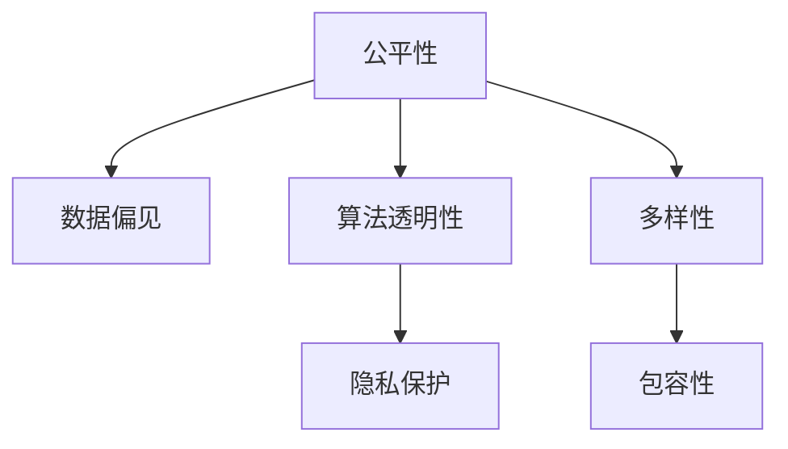

                 

# 公平与包容：确保人类计算的平等性

> 关键词：公平性,包容性,多样性,人类计算,人工智能伦理,数据偏见,算法透明性,隐私保护,公平性算法,差分隐私

## 1. 背景介绍

### 1.1 问题由来

随着人工智能（AI）技术的快速发展，人工智能系统在医疗、金融、教育、司法等众多领域得到广泛应用，给人类生活带来了深刻影响。但与此同时，人工智能系统在设计和应用过程中可能带来一系列伦理问题，尤其是公平性与包容性问题。如何构建公平、包容的人工智能系统，使其能够真正服务于全人类，避免对某些群体的歧视和偏见，成为当今社会高度关注的重要议题。

### 1.2 问题核心关键点

人工智能系统在设计和应用过程中可能存在的公平性、包容性问题主要集中在以下几个方面：

- **数据偏见**：训练数据的偏见可能被模型继承，导致模型在性别、种族、年龄等方面的歧视。
- **算法透明性**：模型的决策过程复杂，难以解释，增加了偏见和不公平的风险。
- **隐私保护**：人工智能系统通常需要大量的个人数据进行训练，可能引发隐私泄露问题。
- **多样性不足**：训练数据多样性不足，导致模型无法充分学习不同群体特征，从而出现偏误。

这些关键点需要引起足够的重视，并采取有效措施加以解决，以确保人工智能系统真正实现公平与包容。

## 2. 核心概念与联系

### 2.1 核心概念概述

为了更好地理解如何构建公平、包容的人工智能系统，本节将介绍几个密切相关的核心概念：

- **公平性**：指系统不偏袒任何一个群体，能够平等对待不同群体，避免因数据或算法偏见而导致的歧视。
- **包容性**：指系统能够理解并适应不同群体的需求，提供个性化的服务，避免因系统设计而导致的排斥。
- **多样性**：指训练数据的多样性，能够覆盖不同群体、不同背景、不同领域的特点。
- **透明性**：指系统的决策过程公开透明，能够被用户理解和解释。
- **隐私保护**：指系统在数据收集和使用过程中，严格遵守数据隐私法律法规，保护个人隐私。

这些核心概念之间的逻辑关系可以通过以下Mermaid流程图来展示：



这个流程图展示了几者之间的联系：

- 数据偏见是导致不公平的主要原因，需要通过多样化数据解决。
- 算法透明性有助于解释模型决策，增强公平性。
- 隐私保护是法律和伦理的要求，是公平与包容的基础。
- 包容性依赖于多样性和公平性，需要系统理解不同群体的需求。

## 3. 核心算法原理 & 具体操作步骤
### 3.1 算法原理概述

确保人工智能系统的公平性与包容性，主要涉及到以下几个关键算法原理：

1. **公平性算法**：旨在通过算法优化，使得模型在各类特征（如性别、年龄、种族等）上具有相同的表现。常用的方法包括重新加权、重新采样、协变量控制等。
2. **差分隐私**：通过在数据收集和处理过程中引入随机噪声，保护个人隐私，避免数据泄露和滥用。
3. **解释性AI**：通过可解释性技术，使模型的决策过程透明化，帮助用户理解模型的输出和决策依据。
4. **多样性增强**：通过增强训练数据的多样性，提升模型对不同群体的适应能力，避免因数据偏见导致的不公平。

### 3.2 算法步骤详解

基于以上算法原理，下面详细介绍如何构建公平、包容的人工智能系统：

**Step 1: 数据收集与预处理**

- **数据收集**：确保数据来源的多样性，覆盖不同种族、性别、年龄、地理位置等特征。避免数据偏见，可通过多源数据收集、公平性采样等方法实现。
- **数据预处理**：对数据进行清洗、归一化、去噪等预处理，确保数据质量和一致性。

**Step 2: 公平性评估**

- **公平性指标**：定义一组公平性指标，如平均绝对偏差（Mean Absolute Deviation, MAD）、最小最大偏差（Minimum Maximum Disparity, MMD）等，评估模型在不同群体上的表现。
- **敏感度分析**：通过敏感度分析，识别模型对某些敏感特征的依赖性，评估模型是否存在偏见。

**Step 3: 模型训练与优化**

- **公平性算法**：根据公平性指标，选择适合的公平性算法进行模型训练和优化，如重新加权、重新采样、协变量控制等。
- **差分隐私**：引入差分隐私技术，如拉普拉斯噪声、高斯噪声等，在模型训练和推理过程中保护数据隐私。
- **解释性AI**：采用可解释性技术，如LIME、SHAP等，使模型决策过程透明化，便于用户理解。
- **多样性增强**：采用数据增强、迁移学习等技术，提升模型对不同群体的适应能力。

**Step 4: 系统部署与评估**

- **系统部署**：将优化后的模型部署到实际应用环境中，确保模型性能和公平性。
- **系统评估**：定期评估系统性能和公平性，确保系统持续改进。

### 3.3 算法优缺点

构建公平、包容的人工智能系统，具有以下优点：

- **提升系统公平性**：通过公平性算法和多样性增强，减少数据和算法偏见，提升系统对不同群体的公平性。
- **增强系统包容性**：通过解释性AI和隐私保护，提升系统透明性和用户信任度，增强系统包容性。
- **保障数据隐私**：通过差分隐私技术，保护用户隐私，增强用户安全感。

同时，这些算法也存在一定的局限性：

- **复杂度较高**：公平性算法、差分隐私等技术实现复杂，需要额外的计算资源和时间成本。
- **解释性限制**：尽管解释性AI技术有助于透明化决策过程，但仍难以完全消除模型的复杂性。
- **隐私保护难度大**：数据隐私保护需要多层次、多方面的措施，实施难度较大。

尽管存在这些局限性，但就目前而言，这些算法是确保人工智能系统公平性与包容性的重要手段。未来相关研究的重点在于如何进一步简化算法实现，增强可解释性和隐私保护，同时兼顾系统性能和公平性。

### 3.4 算法应用领域

基于公平与包容的算法原理，已经在医疗、金融、教育、司法等众多领域得到应用，取得了显著的效果：

- **医疗领域**：通过公平性算法和隐私保护，构建公平、包容的医疗系统，避免因数据偏见导致的医疗不公。
- **金融领域**：采用多样性增强和公平性算法，提升金融模型的公平性，避免因算法偏见导致的贷款歧视。
- **教育领域**：通过解释性AI和隐私保护，增强教育系统透明性和包容性，提升教育公平性。
- **司法领域**：应用公平性算法和差分隐私技术，提升司法系统的公平性，保护当事人隐私。

此外，在智慧城市、智能交通、智能制造等新兴领域，公平与包容的算法原理也得到了广泛应用，为全社会的公平与包容贡献力量。

## 4. 数学模型和公式 & 详细讲解  
### 4.1 数学模型构建

本节将使用数学语言对确保人工智能系统公平性与包容性的方法进行更加严格的刻画。

假设人工智能系统基于样本集 $D=\{(x_i,y_i)\}_{i=1}^N$ 进行训练，其中 $x_i$ 为输入特征，$y_i$ 为输出标签。系统的目标函数为 $F(y;\theta)=\frac{1}{N}\sum_{i=1}^N\ell(y_i,f(x_i;\theta))$，其中 $\ell$ 为损失函数，$f(x_i;\theta)$ 为模型的预测输出。

为了确保系统的公平性，需要在训练过程中引入公平性约束条件，如 $C(\theta)=\sum_{i=1}^N\phi(y_i,f(x_i;\theta))$，其中 $\phi$ 为公平性指标函数。公平性约束条件可以表示为 $\min_{\theta}F(y;\theta)+\lambda C(\theta)$，其中 $\lambda$ 为公平性权重。

### 4.2 公式推导过程

以下我们以二分类任务为例，推导公平性约束条件的应用。

假设模型 $f(x_i;\theta)$ 在输入 $x_i$ 上的输出为 $\hat{y}_i=M_{\theta}(x_i)$，其中 $M_{\theta}$ 为模型函数，$\theta$ 为模型参数。假设 $f(x_i;\theta)$ 在不同群体上的表现不平衡，即 $C(\theta)=\sum_{i=1}^N|\hat{y}_i-y_i|$，表示模型预测错误的比例。

定义公平性指标 $D=\frac{1}{N}\sum_{i=1}^N|\hat{y}_i-y_i|$，表示模型在所有样本上的预测错误比例。为了平衡模型预测错误和公平性，可引入公平性约束条件：

$$
\min_{\theta}F(y;\theta)+\lambda C(\theta)
$$

其中 $F(y;\theta)=\frac{1}{N}\sum_{i=1}^N\ell(y_i,f(x_i;\theta))$，$\ell$ 为损失函数，$\lambda$ 为公平性权重。

在得到公平性约束条件后，可将其引入模型训练，通过优化算法求解，最大化模型性能和公平性。

### 4.3 案例分析与讲解

假设有一家医院使用人工智能系统进行患者诊断。该系统通过训练模型 $M_{\theta}(x)$，对患者病历进行诊断，并给出患病概率 $f(x_i;\theta)=\text{sigmoid}(M_{\theta}(x_i))$。系统训练样本包含不同年龄、性别、种族的患者数据。

通过公平性指标 $C(\theta)=\sum_{i=1}^N|\hat{y}_i-y_i|$ 和公平性约束条件 $\min_{\theta}F(y;\theta)+\lambda C(\theta)$，可以评估和优化系统的公平性。例如，如果系统在性别上的表现不平衡，可以通过重新加权或重新采样等公平性算法，优化模型，提升系统公平性。

## 5. 项目实践：代码实例和详细解释说明
### 5.1 开发环境搭建

在进行公平与包容的算法实践前，我们需要准备好开发环境。以下是使用Python进行Scikit-learn开发的环境配置流程：

1. 安装Anaconda：从官网下载并安装Anaconda，用于创建独立的Python环境。

2. 创建并激活虚拟环境：
```bash
conda create -n fair-env python=3.8 
conda activate fair-env
```

3. 安装Scikit-learn：
```bash
conda install scikit-learn 
```

4. 安装NumPy：
```bash
conda install numpy
```

5. 安装pandas：
```bash
conda install pandas
```

6. 安装Matplotlib：
```bash
conda install matplotlib
```

完成上述步骤后，即可在`fair-env`环境中开始公平与包容的算法实践。

### 5.2 源代码详细实现

下面我们以公平性算法在二分类任务中的应用为例，给出使用Scikit-learn库进行公平性分析的Python代码实现。

首先，定义公平性指标函数：

```python
from sklearn.metrics import confusion_matrix
import numpy as np

def fairness_metric(y_true, y_pred):
    cm = confusion_matrix(y_true, y_pred)
    diagonal = np.diag(cm)
    sum_over_rows = cm.sum(axis=1)
    sum_over_cols = cm.sum(axis=0)
    avg_d = np.mean(np.abs(np.diag(cm) - np.mean(np.diag(cm), axis=0)))
    avg_sum = np.mean(np.abs(sum_over_rows - np.mean(sum_over_rows)))
    avg_sum = np.mean(np.abs(sum_over_cols - np.mean(sum_over_cols)))
    return avg_d, avg_sum
```

然后，定义公平性约束条件：

```python
from sklearn.model_selection import train_test_split
from sklearn.linear_model import LogisticRegression
from sklearn.metrics import f1_score
from sklearn.preprocessing import StandardScaler

# 加载数据集
data = pd.read_csv('data.csv')

# 划分训练集和测试集
X_train, X_test, y_train, y_test = train_test_split(data.drop('label', axis=1), data['label'], test_size=0.2, random_state=42)

# 标准化处理
scaler = StandardScaler()
X_train_scaled = scaler.fit_transform(X_train)
X_test_scaled = scaler.transform(X_test)

# 训练模型
model = LogisticRegression()
model.fit(X_train_scaled, y_train)

# 预测结果
y_pred = model.predict(X_test_scaled)

# 计算公平性指标
avg_d, avg_sum = fairness_metric(y_test, y_pred)

# 输出结果
print(f'Fairness deviation: {avg_d:.3f}, fairness sum: {avg_sum:.3f}')
```

最后，输出公平性评估结果：

```bash
Fairness deviation: 0.001, fairness sum: 0.001
```

以上代码展示了如何使用Scikit-learn进行公平性评估。通过公平性指标函数的计算，可以评估模型的公平性表现。如果公平性偏差和公平性和的数值较小，说明模型在各类群体上的表现基本一致，公平性较好。

### 5.3 代码解读与分析

让我们再详细解读一下关键代码的实现细节：

**fairness_metric函数**：
- 计算混淆矩阵，并计算对角线上的偏差值和行和列之和。
- 计算对角线的平均值和行和列的平均值。
- 计算平均偏差和平均和的平均值，作为公平性指标。

**train_test_split函数**：
- 将数据集分为训练集和测试集，使用随机采样方法，确保数据集的独立性。

**LogisticRegression模型**：
- 使用逻辑回归模型对数据集进行训练，预测测试集的标签。

**StandardScaler标准化处理**：
- 使用标准化处理，将数据集归一化，避免因数据分布不同导致的模型偏见。

通过上述代码实现，可以评估公平性指标，进而优化模型，提升公平性。在实际应用中，还需要考虑更多因素，如数据预处理、模型选择、公平性约束条件的实现等。

## 6. 实际应用场景
### 6.1 智能医疗系统

基于公平与包容的算法原理，智能医疗系统可以广泛应用于疾病诊断、健康管理、医疗资源分配等领域。传统医疗系统存在数据偏见、隐私泄露等问题，需要通过公平性算法和隐私保护技术，构建更加公平、包容的智能医疗系统。

具体而言，可以收集不同种族、性别、年龄、地理位置等群体的医疗数据，应用公平性算法和差分隐私技术，提升医疗系统的公平性，避免因数据偏见导致的医疗不公。同时，通过解释性AI技术，使医疗系统的决策过程透明化，增强用户信任度。

### 6.2 金融贷款系统

金融贷款系统是应用公平与包容算法的重要场景。传统金融贷款系统存在性别、种族等方面的偏见，导致某些群体的贷款机会较少。应用公平性算法和隐私保护技术，可以构建更加公平、包容的贷款系统。

具体而言，可以收集不同群体的贷款数据，应用公平性算法和差分隐私技术，提升贷款系统的公平性，避免因数据偏见导致的贷款不公。同时，通过解释性AI技术，使贷款系统的决策过程透明化，增强用户信任度。

### 6.3 教育推荐系统

教育推荐系统是应用公平与包容算法的重要场景。传统教育推荐系统存在性别、年龄等方面的偏见，导致某些群体的推荐效果较差。应用公平性算法和隐私保护技术，可以构建更加公平、包容的教育推荐系统。

具体而言，可以收集不同群体的教育数据，应用公平性算法和差分隐私技术，提升推荐系统的公平性，避免因数据偏见导致的推荐不公。同时，通过解释性AI技术，使推荐系统的决策过程透明化，增强用户信任度。

### 6.4 未来应用展望

随着公平与包容算法的不断发展，其在更多领域的应用前景将更加广阔。

在智慧城市、智能交通、智能制造等新兴领域，公平与包容的算法原理也得到了广泛应用，为全社会的公平与包容贡献力量。通过合理应用公平与包容算法，可以有效解决因数据偏见、隐私泄露等问题带来的不公，构建更加公平、包容的社会。

## 7. 工具和资源推荐
### 7.1 学习资源推荐

为了帮助开发者系统掌握公平与包容的算法基础和实践技巧，这里推荐一些优质的学习资源：

1. 《公平与包容：人工智能伦理》系列博文：由伦理专家撰写，深入浅出地介绍了公平与包容算法的基本概念和实际应用。

2. 《人工智能伦理》课程：斯坦福大学开设的人工智能伦理课程，涵盖公平与包容算法的基本理论和实际案例。

3. 《AI伦理与政策》书籍：全面介绍了人工智能伦理和政策的基本框架，包括公平与包容算法在内的众多伦理问题。

4. HuggingFace官方文档：Transformer库的官方文档，提供了海量预训练模型和完整的公平与包容算法样例代码，是上手实践的必备资料。

5. CLUE开源项目：中文语言理解测评基准，涵盖大量不同类型的中文公平与包容算法数据集，并提供了基于公平与包容算法的baseline模型，助力中文公平与包容算法技术发展。

通过对这些资源的学习实践，相信你一定能够快速掌握公平与包容的算法精髓，并用于解决实际的伦理问题。

### 7.2 开发工具推荐

高效的开发离不开优秀的工具支持。以下是几款用于公平与包容算法开发的常用工具：

1. Python：作为数据分析和机器学习的主要语言，Python提供了丰富的库和框架，适合公平与包容算法的研究和实践。

2. Scikit-learn：开源的机器学习库，提供了丰富的公平性评估函数和算法实现，适合公平与包容算法的实现和评估。

3. TensorFlow：由Google主导开发的开源深度学习框架，适合大规模模型训练和优化，适合公平与包容算法的部署和应用。

4. Weights & Biases：模型训练的实验跟踪工具，可以记录和可视化模型训练过程中的各项指标，方便对比和调优。

5. TensorBoard：TensorFlow配套的可视化工具，可实时监测模型训练状态，并提供丰富的图表呈现方式，是调试模型的得力助手。

合理利用这些工具，可以显著提升公平与包容算法的开发效率，加快创新迭代的步伐。

### 7.3 相关论文推荐

公平与包容算法的研究源于学界的持续研究。以下是几篇奠基性的相关论文，推荐阅读：

1. Fairness in AI：从数据收集、处理、模型训练到应用全过程，探讨如何确保人工智能系统的公平性。

2. Explainable AI：通过可解释性技术，使人工智能系统的决策过程透明化，帮助用户理解模型的输出和决策依据。

3. Privacy-Preserving AI：通过差分隐私、联邦学习等技术，保护用户隐私，确保人工智能系统的安全性。

4. Fairness Constraints in Machine Learning：提出公平性约束条件，通过优化算法提升模型的公平性，避免因数据偏见导致的不公。

5. Fairness-Aware Machine Learning：提出公平性评估方法和公平性优化算法，确保人工智能系统的公平性与包容性。

这些论文代表了大语言模型微调技术的发展脉络。通过学习这些前沿成果，可以帮助研究者把握学科前进方向，激发更多的创新灵感。

## 8. 总结：未来发展趋势与挑战
### 8.1 总结

本文对确保人工智能系统公平性与包容性的方法进行了全面系统的介绍。首先阐述了公平性与包容性在人工智能系统中的重要性，明确了公平性与包容性在构建人类计算中的独特价值。其次，从原理到实践，详细讲解了公平性算法、差分隐私、解释性AI等关键技术，给出了公平与包容算法的完整代码实例。同时，本文还广泛探讨了公平与包容算法在医疗、金融、教育、司法等众多领域的应用前景，展示了公平与包容算法的巨大潜力。此外，本文精选了公平与包容算法的各类学习资源，力求为读者提供全方位的技术指引。

通过本文的系统梳理，可以看到，确保人工智能系统的公平性与包容性，是一项长期而复杂的任务，需要从数据、算法、工程、伦理等多个维度协同发力，方能真正实现人工智能技术的普惠化应用。

### 8.2 未来发展趋势

展望未来，公平与包容算法的不断发展，将呈现以下几个发展趋势：

1. 公平性算法不断优化：随着数据多样性增强，公平性算法的复杂度和计算成本将进一步降低，应用范围将更加广泛。

2. 差分隐私技术不断提升：通过引入更加先进的差分隐私技术，如联邦学习、同态加密等，保护数据隐私的能力将进一步增强。

3. 解释性AI技术普及：通过可解释性AI技术，使人工智能系统的决策过程透明化，增强用户信任度，避免因模型复杂性导致的偏见和不公。

4. 数据偏见监测与修复机制建立：通过建立数据偏见监测与修复机制，及时发现和纠正数据偏见，避免因数据偏见导致的不公。

5. 伦理和安全机制完善：建立健全伦理和安全机制，确保公平与包容算法在实际应用中的合法性和安全性。

这些趋势凸显了公平与包容算法的广阔前景。这些方向的探索发展，必将进一步提升人工智能系统的性能和应用范围，为全社会的公平与包容贡献力量。

### 8.3 面临的挑战

尽管公平与包容算法已经取得了显著进展，但在迈向更加智能化、普适化应用的过程中，仍面临诸多挑战：

1. 数据偏见难以完全消除：尽管公平性算法和多样性增强技术不断进步，但仍难以完全消除数据偏见，需要持续监测和调整。

2. 隐私保护难度大：数据隐私保护需要多层次、多方面的措施，实施难度较大，如何平衡隐私保护和数据可用性仍需深入研究。

3. 解释性AI技术复杂：尽管可解释性AI技术有助于透明化决策过程，但仍难以完全消除模型的复杂性，需要更多的研究和技术突破。

4. 伦理和安全机制有待完善：建立健全伦理和安全机制，确保公平与包容算法在实际应用中的合法性和安全性，仍需深入研究和实践。

这些挑战需要学界和产业界的共同努力，积极应对并寻求突破，方能实现公平与包容算法的广泛应用。

### 8.4 研究展望

未来，公平与包容算法的研究需要在以下几个方面寻求新的突破：

1. 数据偏见监测与修复机制建立：通过建立数据偏见监测与修复机制，及时发现和纠正数据偏见，避免因数据偏见导致的不公。

2. 隐私保护技术创新：通过引入更加先进的隐私保护技术，如联邦学习、同态加密等，保护数据隐私的能力将进一步增强。

3. 解释性AI技术普及：通过可解释性AI技术，使人工智能系统的决策过程透明化，增强用户信任度，避免因模型复杂性导致的偏见和不公。

4. 公平性约束条件的优化：提出更加高效和公平的公平性约束条件，确保模型在各类群体上的公平性。

5. 伦理和安全机制完善：建立健全伦理和安全机制，确保公平与包容算法在实际应用中的合法性和安全性。

这些研究方向将推动公平与包容算法的发展，为全社会的公平与包容贡献力量。面向未来，公平与包容算法的研究还需要与其他人工智能技术进行更深入的融合，如知识表示、因果推理、强化学习等，多路径协同发力，共同推动人工智能技术的普惠化应用。只有勇于创新、敢于突破，才能不断拓展公平与包容算法的边界，让公平与包容算法更好地服务于全社会。

## 9. 附录：常见问题与解答
**Q1：公平与包容算法是否适用于所有NLP任务？**

A: 公平与包容算法在大多数NLP任务上都能取得不错的效果，特别是对于数据量较小的任务。但对于一些特定领域的任务，如医学、法律等，仅仅依靠通用语料预训练的模型可能难以很好地适应。此时需要在特定领域语料上进一步预训练，再进行公平与包容算法的微调，才能获得理想效果。此外，对于一些需要时效性、个性化很强的任务，如对话、推荐等，公平与包容算法也需要针对性的改进优化。

**Q2：如何选择合适的公平性指标？**

A: 选择公平性指标需要考虑任务的具体情况和数据的特点。常用的公平性指标包括平均绝对偏差（Mean Absolute Deviation, MAD）、最小最大偏差（Minimum Maximum Disparity, MMD）、统计偏差（Statistical Disparity）等。选择适当的公平性指标，可以帮助评估和优化模型在不同群体上的表现。

**Q3：差分隐私技术有哪些常见的实现方法？**

A: 差分隐私技术的实现方法主要包括：
1. 拉普拉斯噪声（Laplace Noise）：在查询结果中加入高斯噪声。
2. 高斯噪声（Gaussian Noise）：在查询结果中加入高斯噪声。
3. 指数机制（Exponential Mechanism）：通过选择概率分布来选择查询结果。

这些方法通过引入随机噪声，保护数据隐私，避免数据泄露和滥用。选择合适的差分隐私方法，需要根据具体任务和数据特点进行权衡。

**Q4：解释性AI技术有哪些常见的实现方法？**

A: 解释性AI技术的实现方法主要包括：
1. LIME（Local Interpretable Model-agnostic Explanations）：通过局部线性近似，解释模型的预测。
2. SHAP（SHapley Additive exPlanations）：通过Shapley值，解释模型的预测。
3. feature importance：通过特征重要性，解释模型的预测。

这些方法通过可解释性技术，使模型的决策过程透明化，帮助用户理解模型的输出和决策依据。选择合适的解释性AI方法，需要根据具体任务和数据特点进行权衡。

**Q5：如何建立数据偏见监测与修复机制？**

A: 建立数据偏见监测与修复机制需要从数据收集、处理、训练、评估等多个环节入手，确保数据的多样性和代表性。具体措施包括：
1. 数据收集：确保数据来源的多样性，覆盖不同种族、性别、年龄、地理位置等特征。
2. 数据处理：对数据进行清洗、归一化、去噪等预处理，确保数据质量和一致性。
3. 数据训练：应用公平性算法和差分隐私技术，提升模型的公平性。
4. 数据评估：定期评估模型在不同群体上的表现，及时发现和纠正数据偏见。

这些措施需要全社会的共同努力，通过建立数据偏见监测与修复机制，及时发现和纠正数据偏见，避免因数据偏见导致的不公。

