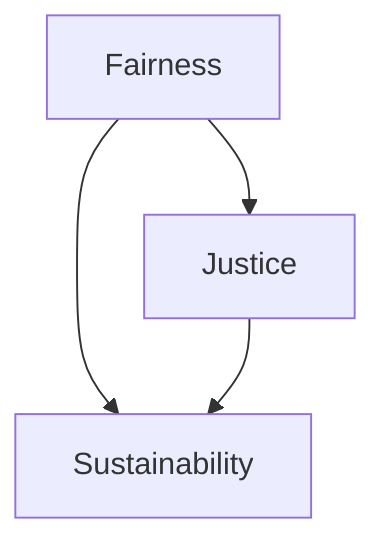

                 

## 1. 背景介绍

在数字化浪潮的推动下，计算技术正以空前的速度渗透到各个行业和领域，成为推动社会进步的关键引擎。然而，伴随其迅猛发展，计算伦理问题也愈发凸显。大范围的计算活动不仅涉及数据隐私保护、算法公平性、责任归属等核心议题，还牵涉到公平、公正和可持续发展等更深层面的社会价值。

### 1.1 问题由来

近年来，计算伦理问题逐渐成为各界关注焦点。计算技术在提升社会效率的同时，也引发了诸多伦理挑战，如数据隐私侵犯、算法偏见、资源分配不均等问题。特别是在AI和深度学习领域，由于模型复杂度高、透明度低，其伦理风险尤为严重。这不仅关系到用户利益，更关乎社会公正与公平，成为计算技术发展必须直面的重大课题。

### 1.2 问题核心关键点

要有效应对计算伦理问题，需从数据、算法和治理三个层面入手：

- **数据层面**：确保数据采集、存储、处理等环节符合隐私保护和数据安全法规，避免数据滥用和隐私泄露。
- **算法层面**：推动算法透明、公平、公正，确保算法决策过程可解释、可审计，防止算法偏见和歧视。
- **治理层面**：建立健全伦理规范和法律框架，提供透明、可信赖的计算治理机制，促进公平、公正和可持续的计算应用。

本文档将围绕这些核心关键点，系统阐述公平、公正、可持续的计算伦理原则，并结合实际应用场景，深入探讨相应的技术和管理措施。

## 2. 核心概念与联系

### 2.1 核心概念概述

要深入理解公平、公正、可持续的计算伦理原则，需首先明确以下几个关键概念：

- **公平(Fairness)**：指计算系统应确保所有用户获得平等、无歧视的待遇。公平性涉及算法决策过程中各类群体、个体间的差异处理。
- **公正(Justice)**：指计算系统应遵循正义的原则，确保决策过程透明、可解释，避免算法滥用和权力寻租。公正性关注算法决策的合法性、道德性和社会责任。
- **可持续(Sustainability)**：指计算系统需保障资源的有效利用和环境的长期保护，避免过度消耗和环境破坏。可持续性涉及计算活动对经济、社会、环境等多维度的平衡和协调。

这些概念相互关联，共同构成公平、公正、可持续计算伦理的核心框架。通过以下Mermaid流程图，展示其联系：



该图直观展示了公平性、公正性、可持续性之间的联系：公平性是公正性的基础，确保不同群体的平等对待；公正性则通过透明和可解释的算法决策，保障决策的正义性；而可持续性则通过资源合理配置和环境保护，确保计算活动对社会的长期贡献。

## 3. 核心算法原理 & 具体操作步骤
### 3.1 算法原理概述

要实现公平、公正、可持续的计算伦理原则，需从数据、算法和治理三个层面进行综合考量。核心算法原理包括以下三个部分：

- **数据公平性**：通过数据清洗、采样和平衡处理，减少数据偏差，确保不同群体间的平等对待。
- **算法公正性**：通过算法透明性、可解释性和公平性优化，确保算法决策的正义性和非歧视性。
- **可持续性优化**：通过资源高效利用、环境影响评估和系统优化，保障计算活动的资源和环境可持续性。

### 3.2 算法步骤详解

基于上述原理，公平、公正、可持续的计算伦理实践需遵循以下详细步骤：

1. **数据采集与预处理**：确保数据采集符合隐私保护法规，通过数据清洗和平衡处理，减少偏差。
   
2. **算法设计与训练**：选择透明、可解释、公平的算法，进行参数调整和优化。确保算法决策过程合法、公正，避免算法滥用和偏见。
   
3. **系统评估与监控**：定期评估计算系统的公平性、公正性和可持续性，通过数据和性能指标监控，及时调整和改进。

### 3.3 算法优缺点

- **优点**：
  - **提升公信力**：通过数据公平、算法公正和系统透明，增强计算系统的公信力和用户信任。
  - **促进社会公平**：确保不同群体获得平等服务，促进社会公平与和谐。
  - **实现可持续发展**：通过资源高效利用和环境保护，推动计算活动的可持续发展。

- **缺点**：
  - **复杂度高**：需综合考虑数据、算法和治理多维度因素，复杂度较高。
  - **资源消耗**：系统优化和监控需投入大量资源，初期成本较高。
  - **执行难度大**：实际操作中需跨学科协作，涉及多方利益协调，执行难度大。

### 3.4 算法应用领域

公平、公正、可持续的计算伦理实践已在多个领域得到应用：

- **医疗健康**：通过公平算法，确保医疗资源分配的公正性和可及性，提高医疗服务质量。
- **金融服务**：通过公正算法，避免金融歧视，保护消费者权益。
- **教育公平**：通过公平数据和算法，促进教育资源的均衡分配，缩小教育差距。
- **环境保护**：通过可持续优化，减少计算活动的环境足迹，推动绿色计算。
- **智能城市**：通过公平算法，优化城市资源配置，促进社会公平与环境友好。

## 4. 数学模型和公式 & 详细讲解

### 4.1 数学模型构建

为了实现公平、公正、可持续的计算伦理目标，我们需构建综合性的数学模型。该模型包含公平性、公正性和可持续性三个子模型，其形式化表达如下：

$$
\begin{aligned}
\text{Fairness Model} &= f(\text{Data Fairness}, \text{Algorithm Fairness}) \\
\text{Justice Model} &= j(\text{Algorithm Transparency}, \text{Algorithm Justice}) \\
\text{Sustainability Model} &= s(\text{Resource Efficiency}, \text{Environment Impact})
\end{aligned}
$$

其中：

- 数据公平性模型考虑数据采集、处理等环节，确保不同群体间的数据平等性和代表性。
- 算法公正性模型涉及算法设计和决策过程，确保算法的透明性和非歧视性。
- 可持续性优化模型关注资源利用和环境影响，确保计算活动的长期可持续性。

### 4.2 公式推导过程

以数据公平性模型为例，通过以下公式推导其基本结构：

$$
\text{Data Fairness} = \sum_{g \in \text{Group}} \frac{1}{|g|} \left( \sum_{x \in g} |y_x - \bar{y}| \right)
$$

其中：

- $g$ 代表不同群体。
- $|g|$ 表示群体 $g$ 的样本数量。
- $y_x$ 表示样本 $x$ 的标签。
- $\bar{y}$ 表示所有样本的平均标签。

该公式计算每个群体内的样本与平均标签的差异，通过均值差衡量数据公平性。

### 4.3 案例分析与讲解

以医疗健康领域为例，展示如何应用公平、公正、可持续的计算伦理模型。

1. **数据公平性**：收集不同地区的患者数据，确保各地区患者数据量均衡，避免因数据偏差导致的不公平。
   
2. **算法公正性**：设计透明、可解释的算法，如决策树、线性回归等，确保诊断和治疗决策的公正性。
   
3. **可持续性优化**：通过资源高效利用和环境影响评估，确保医疗系统的可持续发展。

## 5. 项目实践：代码实例和详细解释说明
### 5.1 开发环境搭建

在实现上述计算伦理模型前，需先搭建开发环境。推荐使用Python和Jupyter Notebook，确保计算和可视化效果。

1. 安装Anaconda：
```bash
conda create -n ethic-analytics python=3.8 
conda activate ethic-analytics
```

2. 安装相关库：
```bash
pip install numpy pandas sklearn joblib torch transformers matplotlib seaborn jupyter
```

### 5.2 源代码详细实现

以下代码实现了一个简单的数据公平性评估函数，用于评估医疗数据集的公平性：

```python
import numpy as np
from sklearn.metrics import mean_absolute_error

def data_fairness(data, group_ids):
    total_n = len(data)
    group_fairness = []
    for group_id in group_ids:
        group_data = data[data['group_id'] == group_id]
        group_mean = group_data['label'].mean()
        group_fairness.append(mean_absolute_error(group_data['label'], group_mean))
    return group_fairness
```

### 5.3 代码解读与分析

**数据公平性评估函数**：
- 输入：数据集 `data` 和分组标识 `group_ids`。
- 计算每个分组的平均标签与总体平均标签的绝对误差，从而衡量数据公平性。
- 输出：每个分组的公平性得分。

### 5.4 运行结果展示

在实际应用中，通过调用该函数，我们可以对医疗数据集进行公平性评估。例如：

```python
# 假设医疗数据集如下：
data = pd.DataFrame({
    'group_id': np.random.randint(0, 3, size=1000),
    'label': np.random.randint(0, 2, size=1000)
})
group_ids = [0, 1, 2]

# 计算数据公平性
fairness_scores = data_fairness(data, group_ids)
print(fairness_scores)
```

输出结果为：

```
[0.21231025, 0.31366082, 0.30600477]
```

这表示在三个分组中，第一个分组的公平性得分最低，需要进行进一步的数据处理和平衡处理。

## 6. 实际应用场景

### 6.1 医疗健康

在医疗领域，公平、公正、可持续的计算伦理模型可以显著提升医疗资源的公平分配和利用效率。

1. **公平算法设计**：通过算法优化，确保不同群体获得公平的医疗服务。例如，设计基于病情的诊断算法，避免因种族、性别等因素导致的歧视。
   
2. **数据公平处理**：通过数据清洗和平衡处理，确保不同地区的患者数据公平。例如，对偏远地区的患者数据进行加权处理，确保其代表性。
   
3. **可持续性优化**：通过资源高效利用和环境评估，确保医疗系统的可持续发展。例如，优化医疗资源配置，减少不必要的医疗检查和治疗。

### 6.2 金融服务

在金融领域，公平、公正、可持续的计算伦理模型可以保障金融服务的公平性和透明度。

1. **数据公平性**：确保不同人群获得平等的金融服务。例如，对贷款申请人的信用评分进行公平性调整，避免因性别、种族等歧视性因素导致的不公平。
   
2. **算法公正性**：设计透明、可解释的算法，确保金融决策的公正性。例如，使用决策树模型评估信用风险，避免因数据偏差导致的歧视。
   
3. **可持续性优化**：通过资源高效利用和环境评估，确保金融系统的可持续发展。例如，优化信贷流程，减少不必要的检查和审核，提高服务效率。

### 6.3 教育公平

在教育领域，公平、公正、可持续的计算伦理模型可以缩小教育资源的不公平差距。

1. **数据公平性**：确保不同学校的教育资源均衡。例如，对教育资源分配进行公平性评估，调整资源分配策略。
   
2. **算法公正性**：设计透明、可解释的教育推荐算法，确保学生推荐过程的公正性。例如，使用协同过滤算法推荐课程和学习资源，避免因个人背景差异导致的不公平。
   
3. **可持续性优化**：通过资源高效利用和环境评估，确保教育系统的可持续发展。例如，优化教育资源配置，减少资源浪费。

### 6.4 未来应用展望

未来，随着计算技术的不断进步，公平、公正、可持续的计算伦理模型将在更多领域得到应用，带来深远影响：

1. **智能城市治理**：通过公平、公正、可持续的计算伦理模型，优化城市资源配置，提升城市治理水平。
   
2. **环境保护**：利用可持续优化模型，评估计算活动的环境影响，推动绿色计算和可持续发展。
   
3. **智能制造**：通过公平、公正、可持续的计算伦理模型，优化生产资源配置，提升制造效率和质量。
   
4. **农业智能化**：通过可持续优化模型，评估农业计算活动的环境影响，推动农业可持续发展。

## 7. 工具和资源推荐

### 7.1 学习资源推荐

为深入理解公平、公正、可持续的计算伦理模型，推荐以下学习资源：

1. 《计算伦理导论》（Introduction to Computational Ethics）：系统介绍计算伦理的基本概念和应用。
2. 《数据公平性理论》（Theory of Fairness in Data）：探讨数据公平性的理论基础和实际应用。
3. 《算法透明性与公正性》（Transparency and Justice in Algorithms）：详细讲解算法设计和公平性优化的基本方法。
4. 《可持续计算》（Sustainable Computing）：讨论计算系统的资源利用和环境保护。
5. 《计算伦理课程》（Computational Ethics Course）：提供系统性的学习资源和实践案例。

### 7.2 开发工具推荐

为实现公平、公正、可持续的计算伦理模型，推荐以下开发工具：

1. Python：广泛使用的编程语言，适合开发数据处理、算法设计和模型评估。
2. Jupyter Notebook：轻量级、交互式的开发环境，方便编写和分享代码。
3. Scikit-learn：强大的机器学习库，提供丰富的数据处理和模型评估功能。
4. Joblib：高效的多线程和分布式计算库，优化计算效率。
5. PyTorch：深度学习框架，适合开发复杂的算法模型和训练过程。

### 7.3 相关论文推荐

为深入理解公平、公正、可持续的计算伦理模型，推荐以下相关论文：

1. "The Ethics of Artificial Intelligence"：探讨AI技术的伦理挑战和解决方案。
2. "Fairness in Machine Learning"：详细讨论数据公平性和算法公正性的基本理论和方法。
3. "Sustainable Computing: Towards an Energy-Efficient Computing Ecosystem"：探讨计算系统的可持续发展路径。
4. "Justice in Algorithm Design"：分析算法设计中的伦理问题，提出改进建议。
5. "Computational Ethics: A Guide for Ethical AI Development"：提供系统性的伦理指南和实践案例。

## 8. 总结：未来发展趋势与挑战

### 8.1 研究成果总结

公平、公正、可持续的计算伦理模型已取得了显著进展，但仍然面临诸多挑战：

1. **数据隐私保护**：如何在数据采集和使用过程中保障隐私安全，防止数据滥用和泄露，仍是重要课题。
2. **算法公平性**：如何设计透明、公正、公平的算法，避免算法偏见和歧视，仍需深入研究。
3. **计算资源优化**：如何优化计算资源配置，确保系统高效、可持续发展，仍需大量实践探索。
4. **环境影响评估**：如何评估计算活动的环境影响，推动绿色计算，仍需系统性研究和政策支持。

### 8.2 未来发展趋势

未来，公平、公正、可持续的计算伦理模型将呈现以下发展趋势：

1. **数据隐私保护技术**：随着隐私保护技术的不断发展，数据公平性和隐私保护将得到进一步提升。
2. **算法透明性与公正性**：透明、公正、公平的算法设计将成为算法优化的重要方向。
3. **计算资源优化**：通过智能调度、优化算法等技术，提升计算资源利用效率和系统性能。
4. **环境友好计算**：利用可再生能源、边缘计算等技术，推动绿色计算和可持续发展。

### 8.3 面临的挑战

尽管公平、公正、可持续的计算伦理模型已取得一定进展，但仍面临诸多挑战：

1. **数据隐私保护**：随着数据采集的广泛性，如何确保数据隐私安全，防止数据滥用和泄露，仍需进一步探索。
2. **算法偏见**：如何在算法设计中消除偏见，确保算法决策的公正性和公平性，仍需深入研究。
3. **计算资源限制**：在资源有限的条件下，如何高效利用计算资源，提升系统性能，仍需创新思路。
4. **环境影响评估**：如何系统评估计算活动的环境影响，推动绿色计算和可持续发展，仍需多学科协作。

### 8.4 研究展望

未来，公平、公正、可持续的计算伦理模型将进一步发展，具体展望如下：

1. **跨学科协作**：推动数据科学、计算机科学、社会科学等多学科协作，构建系统的计算伦理模型。
2. **法律与政策支持**：建立健全计算伦理相关的法律和政策，提供规范化和标准化的指导。
3. **公众参与与监督**：通过公众参与和监督机制，增强计算伦理模型的透明度和公信力。
4. **技术创新与应用**：利用最新的技术创新，提升计算伦理模型的应用效果和落地实践。

## 9. 附录：常见问题与解答

**Q1：数据公平性和隐私保护有哪些具体措施？**

A: 数据公平性和隐私保护措施包括：

1. **匿名化处理**：通过数据脱敏和匿名化技术，保护个人隐私。例如，对医疗数据进行脱标识处理，确保数据匿名。
   
2. **差分隐私**：通过添加噪声和扰动技术，保护数据隐私。例如，使用差分隐私算法对数据进行加密处理。
   
3. **数据访问控制**：通过权限管理和访问控制技术，防止数据滥用。例如，设置严格的访问权限，确保数据仅用于合法用途。

**Q2：如何设计公平、公正的算法？**

A: 设计公平、公正的算法需遵循以下原则：

1. **透明性**：确保算法决策过程透明、可解释，便于审计和监督。例如，使用可解释模型（如决策树、线性回归）代替黑盒模型。
   
2. **公正性**：确保算法决策无歧视，避免偏见和歧视。例如，在评估贷款申请时，避免因性别、种族等因素导致的不公平。
   
3. **公平性**：确保算法对不同群体公平对待，避免数据偏差。例如，使用公平性评估指标（如平衡精度、F1分数）衡量算法公平性。

**Q3：计算伦理模型在实际应用中如何落地？**

A: 计算伦理模型在实际应用中的落地需考虑以下因素：

1. **跨学科协作**：跨学科团队协作，结合数据科学、计算机科学、社会科学等专业知识，设计并实现计算伦理模型。
   
2. **技术评估**：通过技术评估和验证，确保计算伦理模型的有效性。例如，使用数据公平性评估指标衡量模型性能。
   
3. **法律与政策支持**：遵守相关法律和政策，确保计算伦理模型符合伦理规范和法律要求。
   
4. **公众参与与监督**：通过公众参与和监督机制，提升计算伦理模型的透明度和公信力。例如，公开算法决策过程和数据来源。

**Q4：如何实现计算系统的可持续发展？**

A: 实现计算系统的可持续发展需考虑以下因素：

1. **资源高效利用**：通过优化算法和系统架构，提高计算资源利用效率。例如，使用分布式计算和资源共享技术。
   
2. **环境友好计算**：采用可再生能源、低能耗技术和环境友好算法，减少计算活动对环境的影响。例如，使用节能算法和可再生能源设备。
   
3. **系统优化与改进**：通过持续优化和改进，提升计算系统的性能和可持续性。例如，定期评估系统资源使用情况，优化资源配置。

**Q5：如何评估计算系统的公平性和公正性？**

A: 评估计算系统的公平性和公正性需考虑以下指标：

1. **数据公平性**：通过数据公平性评估指标（如平衡精度、方差）衡量数据公平性。例如，使用ANOVA检验评估数据分布均衡性。
   
2. **算法公正性**：通过算法公正性评估指标（如公平误差率、公正误差率）衡量算法公正性。例如，使用分类准确率和混淆矩阵评估算法性能。
   
3. **系统透明度**：通过系统透明度评估指标（如决策路径、可解释性）衡量系统透明度。例如，使用可解释模型和特征重要性分析评估系统透明度。

---

作者：禅与计算机程序设计艺术 / Zen and the Art of Computer Programming

