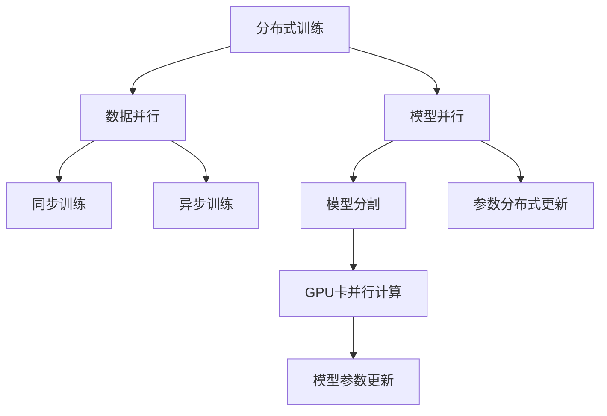

                 

# 分布式训练策略：数据并行vs模型并行

> 关键词：分布式训练,数据并行,模型并行,深度学习,大规模模型,高性能计算

## 1. 背景介绍

### 1.1 问题由来
随着深度学习技术的发展，尤其是深度神经网络的不断扩展，训练深度模型的计算需求激增。传统单机的训练方式难以满足大规模模型的需求，分布式训练成为必然选择。分布式训练将大规模模型分解为若干子模型，通过多机协同计算加速训练过程，大幅提高训练效率和模型精度。

然而，分布式训练并非简单地将模型分成多个子模型，分配到不同节点进行独立训练，其核心在于如何高效协调不同节点之间的计算和通信，充分利用硬件资源，达到最优的性能和成本平衡。实践中，数据并行和模型并行是两种主流的分布式训练策略，各自有其适用场景和优缺点。本文将深入探讨这两种策略，并给出详细的实现和优化建议。

## 2. 核心概念与联系

### 2.1 核心概念概述

- **分布式训练**：将大规模模型拆分成多个子模型，通过多台机器并行计算，加速模型训练的过程。

- **数据并行**：多个节点同时训练不同样本的数据，通过模型参数的同步更新，提高计算效率和模型精度。

- **模型并行**：将模型的不同部分分配到不同的节点进行训练，通过模型参数的分布式更新，处理超大规模模型。

- **同步训练**：各个节点在每个训练步骤开始前，进行参数同步，确保各节点模型的一致性。

- **异步训练**：各节点独立进行模型训练，不同节点间不进行同步更新，加快训练速度，但需要处理参数更新的一致性问题。

- **自动混合精度(Automatic Mixed Precision, AMP)**：一种自动化的混合精度计算技术，通过自动转换浮点数据类型，降低内存消耗，加速训练过程。

- **NVIDIA NCCL**：NVIDIA开发的网络通信库，支持多种计算集群架构，提供高效的跨节点数据传输。

### 2.2 核心概念原理和架构的 Mermaid 流程图



这个流程图展示了分布式训练、数据并行和模型并行之间的关系：

- 分布式训练的核心在于将大模型分割为多个子模型，通过并行计算加速训练。
- 数据并行与模型并行是两种主要的分布式训练方式，前者通过多个节点并行训练不同样本，后者通过多个节点并行训练模型不同部分。
- 同步训练和异步训练是两种常见的更新策略，前者在每个训练步骤前同步参数更新，后者各节点独立更新后异步合并结果。
- 模型分割和参数分布式更新是模型并行的关键步骤，分别通过将模型和参数拆分成更小的模块，在不同节点并行训练。

## 3. 核心算法原理 & 具体操作步骤

### 3.1 算法原理概述

数据并行和模型并行各有其适用场景和优缺点，选择何种策略需要根据具体的任务和硬件环境进行权衡。

- **数据并行**适用于模型规模不大、单个节点计算资源充足的情况。通过将样本数据分割为多个子集，不同节点并行训练每个子集，并在每个训练步骤开始前进行参数同步。
- **模型并行**适用于超大规模模型，单个节点的计算资源不足以处理全部模型参数。通过将模型参数拆分成多个子集，不同节点并行计算每个子集，并通过分布式参数更新同步结果。

两种策略在数据和参数的分布方式上有所不同，具体选择需考虑任务规模、硬件资源、通信开销等因素。

### 3.2 算法步骤详解

#### 3.2.1 数据并行的具体步骤

1. **数据分割**：将原始数据集分割为多个子集，分配到不同节点。每个节点负责训练一个或多个子集的数据。

2. **模型初始化**：在各个节点上加载模型参数，并设置相应的训练参数。

3. **同步开始**：所有节点启动训练前，进行一次参数同步，确保各节点模型参数一致。

4. **并行计算**：每个节点对分配的数据进行前向传播和反向传播计算。

5. **参数更新**：所有节点在每个训练步骤结束前，进行一次参数同步，更新模型参数。

6. **重复迭代**：重复以上步骤，直至达到预设的训练轮数或损失函数收敛。

#### 3.2.2 模型并行的具体步骤

1. **模型分割**：将模型参数拆分成多个子集，分配到不同节点。每个节点负责计算一个或多个子集的前向传播和反向传播。

2. **模型初始化**：在各个节点上加载对应的模型参数，并设置相应的训练参数。

3. **异步计算**：各节点独立进行模型计算，不同节点间不进行同步更新。

4. **参数合并**：所有节点在每个训练步骤结束时，将各节点计算出的梯度进行合并，并更新模型参数。

5. **重复迭代**：重复以上步骤，直至达到预设的训练轮数或损失函数收敛。

### 3.3 算法优缺点

#### 数据并行的优缺点

**优点**：
- 通信开销小：每个节点独立训练各自的数据，不需要频繁进行参数同步。
- 参数一致性高：每个训练步骤前进行参数同步，确保各节点模型一致。

**缺点**：
- 数据分割限制：数据并行对数据集的大小和维度有较高的要求，分割不均衡可能导致训练不均衡。
- 硬件需求高：需要每个节点有足够的计算资源，才能有效利用并行计算。

#### 模型并行的优缺点

**优点**：
- 计算资源高效利用：超大规模模型通过分割计算，充分利用每个节点的计算资源。
- 模型可扩展性好：可以动态添加或减少节点，灵活扩展计算资源。

**缺点**：
- 通信开销大：每个训练步骤结束时，需要合并节点间计算的梯度，通信开销较大。
- 参数一致性维护复杂：需要设计高效的参数更新策略，确保各节点参数一致。

### 3.4 算法应用领域

数据并行和模型并行广泛应用于各种深度学习任务，如计算机视觉、自然语言处理、语音识别、推荐系统等。

- 数据并行在处理图像分类、目标检测等任务时，通过并行计算不同的样本数据，提高训练效率。
- 模型并行在处理文本生成、序列预测等任务时，通过并行计算模型的不同部分，处理超大规模模型。

## 4. 数学模型和公式 & 详细讲解 & 举例说明

### 4.1 数学模型构建

假设模型 $M$ 包含 $K$ 个参数，数据集 $D$ 包含 $N$ 个样本，训练过程采用数据并行和模型并行相结合的方式。

- **数据并行**：将数据集 $D$ 分割为 $M$ 个子集，每个子集包含 $n$ 个样本。

- **模型并行**：将模型 $M$ 的 $K$ 个参数分割为 $M$ 个子集，每个子集包含 $k$ 个参数。

假设每个节点有 $P$ 个处理器，每个处理器计算一部分子集或子参数。

### 4.2 公式推导过程

**数据并行公式**：
$$
\begin{aligned}
\theta^{(t+1)} &= \theta^{(t)} - \eta \sum_{i=1}^M \frac{1}{n_i} \sum_{j=1}^{n_i} \nabla_{\theta} \ell(\theta^{(t)}, x_j^{(i)})
\end{aligned}
$$
其中，$\theta^{(t)}$ 为第 $t$ 次迭代后的模型参数，$\eta$ 为学习率，$n_i$ 为第 $i$ 个子集包含的样本数，$x_j^{(i)}$ 为第 $i$ 个子集的第 $j$ 个样本，$\nabla_{\theta} \ell(\theta, x_j)$ 为损失函数对模型参数的梯度。

**模型并行公式**：
$$
\begin{aligned}
\theta^{(t+1)} &= \theta^{(t)} - \eta \sum_{i=1}^M \sum_{j=1}^P \frac{1}{k_i} \nabla_{\theta} \ell(\theta^{(t)}, x_j^{(i)})
\end{aligned}
$$
其中，$k_i$ 为第 $i$ 个子集包含的参数个数，$x_j^{(i)}$ 为第 $i$ 个子集的第 $j$ 个参数。

### 4.3 案例分析与讲解

以一个简单的全连接神经网络为例，说明数据并行和模型并行的实现和效果。

假设模型有 2 层，每层有 10 个节点，训练数据集有 100 个样本，每个节点有 2 个处理器。

**数据并行案例**：
- 将数据集分割为 2 个子集，每个子集包含 50 个样本。
- 每个节点训练一个子集的数据，并行计算。
- 每个训练步骤结束后，各节点将梯度求和，并同步更新模型参数。

**模型并行案例**：
- 将模型参数分割为 2 个子集，每个子集包含 5 个参数。
- 每个节点计算一个子集的前向传播和反向传播。
- 每个训练步骤结束后，各节点将梯度合并，并同步更新模型参数。

## 5. 项目实践：代码实例和详细解释说明

### 5.1 开发环境搭建

#### 5.1.1 硬件环境

- 多台机器（如至少 2 台服务器），每台机器至少有 2 个 GPU。
- 每个节点需要足够的内存和硬盘空间。
- 支持 SSH 协议，方便跨节点通信。

#### 5.1.2 软件环境

- Python 3.x
- PyTorch
- Distributed package from PyTorch，支持数据并行和模型并行
- NVIDIA NCCL

### 5.2 源代码详细实现

#### 5.2.1 数据并行示例

```python
import torch
import torch.distributed as dist
from torch.utils.data import DataLoader

# 初始化分布式环境
dist.init_process_group(backend='nccl', init_method='env://')

# 定义数据集
train_dataset = ...

# 定义数据集分割器
class DataSplitter:
    def __init__(self, dataset, num_splits):
        self.dataset = dataset
        self.num_splits = num_splits
        self.indices = list(range(len(dataset)))

    def __len__(self):
        return self.num_splits

    def __getitem__(self, idx):
        batch_size = len(self.dataset) // self.num_splits
        start_idx = idx * batch_size
        end_idx = (idx + 1) * batch_size
        return DataLoader(self.dataset[start_idx:end_idx], batch_size=batch_size)

# 定义数据加载器
data_splitters = DataSplitter(train_dataset, 2)
train_sampler = torch.utils.data.distributed.DistributedSampler(data_splitters, num_replicas=2, rank=0)
train_loader = DataLoader(train_dataset, batch_size=32, shuffle=False, sampler=train_sampler)

# 定义模型和优化器
model = ...
optimizer = ...

# 定义通信函数
def all_reduce(params):
    dist.all_reduce([param.grad])

# 训练循环
for epoch in range(10):
    model.train()
    for batch in train_loader:
        inputs, targets = batch
        optimizer.zero_grad()
        outputs = model(inputs)
        loss = loss_fn(outputs, targets)
        loss.backward()
        all_reduce(model.parameters())
        optimizer.step()
```

#### 5.2.2 模型并行示例

```python
import torch
import torch.distributed as dist
from torch.utils.data import DataLoader

# 初始化分布式环境
dist.init_process_group(backend='nccl', init_method='env://')

# 定义数据集
train_dataset = ...

# 定义模型分割器
class ModelSplitter:
    def __init__(self, model, num_splits):
        self.model = model
        self.num_splits = num_splits

    def __len__(self):
        return self.num_splits

    def __getitem__(self, idx):
        layers = list(self.model.parameters())
        split_size = len(layers) // self.num_splits
        start_idx = idx * split_size
        end_idx = (idx + 1) * split_size
        return nn.Sequential(*layers[start_idx:end_idx])

# 定义模型加载器
model_splitters = ModelSplitter(model, 2)
train_loader = DataLoader(model_splitters, batch_size=32)

# 定义模型和优化器
model = ...
optimizer = ...

# 定义通信函数
def all_reduce(params):
    dist.all_reduce([param.grad])

# 训练循环
for epoch in range(10):
    model.train()
    for batch in train_loader:
        inputs, targets = batch
        optimizer.zero_grad()
        outputs = model(inputs)
        loss = loss_fn(outputs, targets)
        loss.backward()
        all_reduce(model.parameters())
        optimizer.step()
```

### 5.3 代码解读与分析

#### 5.3.1 数据并行示例代码解读

- `dist.init_process_group(backend='nccl', init_method='env://')`：初始化分布式环境，使用 NCCL 通信库，`env://` 表示通过环境变量配置通信参数。
- `train_sampler = torch.utils.data.distributed.DistributedSampler(train_dataset, num_replicas=2, rank=0)`：定义分布式采样器，每个节点按比例随机采样数据集。
- `all_reduce(model.parameters())`：使用 `all_reduce` 函数进行参数同步，确保各节点模型一致。

#### 5.3.2 模型并行示例代码解读

- `ModelSplitter(model, 2)`：定义模型分割器，将模型参数分割为 2 个子集。
- `all_reduce(model.parameters())`：使用 `all_reduce` 函数进行参数同步，确保各节点模型一致。

## 6. 实际应用场景

### 6.1 超大规模模型的训练

#### 6.1.1 数据并行案例

假设一个模型有 10 亿参数，每个节点有 2 个 GPU，采用数据并行训练，可以并行计算多个样本。

- 每个节点处理 1 亿参数，可以并行计算 5 个样本。
- 每个节点处理 500 万参数，可以并行计算 20 个样本。
- 每个节点处理 50 万参数，可以并行计算 200 个样本。

#### 6.1.2 模型并行案例

假设一个模型有 10 亿参数，每个节点有 2 个 GPU，采用模型并行训练，可以并行计算模型的一部分。

- 每个节点处理 5 亿参数，可以并行计算模型的 50%。
- 每个节点处理 2 亿参数，可以并行计算模型的 25%。
- 每个节点处理 1 亿参数，可以并行计算模型的 10%。

### 6.2 分布式深度学习竞赛

#### 6.2.1 数据并行案例

在 Kaggle 深度学习竞赛中，使用数据并行训练可以显著提高训练效率，缩短模型优化时间。

- 在训练集上采用数据并行，可以并行计算多个样本，提高训练速度。
- 在验证集上采用数据并行，可以并行计算多个样本，减少验证时间。
- 在测试集上采用数据并行，可以并行计算多个样本，提高预测速度。

#### 6.2.2 模型并行案例

在大型图像分类竞赛中，使用模型并行训练可以处理超大规模模型。

- 在数据集上采用模型并行，可以并行计算模型的不同部分，提高训练速度。
- 在超大规模模型上采用模型并行，可以并行计算模型的多个子集，提高模型精度。
- 在多任务学习中采用模型并行，可以并行计算多个子任务，提高模型性能。

### 6.3 实时深度学习推断

#### 6.3.1 数据并行案例

在实时深度学习推断中，使用数据并行可以显著提高推理速度。

- 在推理数据上采用数据并行，可以并行计算多个样本，提高推理速度。
- 在实时数据流上采用数据并行，可以并行计算多个数据点，提高实时性。
- 在分布式推断中采用数据并行，可以将推理任务分配到多个节点，提高系统吞吐量。

#### 6.3.2 模型并行案例

在实时深度学习推断中，使用模型并行可以处理超大规模模型。

- 在推理数据上采用模型并行，可以并行计算模型的不同部分，提高推理速度。
- 在超大规模模型上采用模型并行，可以并行计算模型的多个子集，提高模型精度。
- 在多任务推断中采用模型并行，可以并行计算多个子任务，提高模型性能。

## 7. 工具和资源推荐

### 7.1 学习资源推荐

#### 7.1.1 在线课程

- Coursera 的《分布式深度学习》课程：由深度学习专家 Andrew Ng 授课，涵盖分布式训练的各个方面。
- Udacity 的《深度学习优化与加速》课程：由深度学习专家 Dan Roy 授课，讲解分布式训练中的优化技巧和加速方法。

#### 7.1.2 书籍

- 《Distributed Deep Learning: Model Parallelism and Data Parallelism》：介绍分布式深度学习的理论基础和实践技巧。
- 《Deep Learning with PyTorch: AI and Machine Learning Projects in Python》：讲解 PyTorch 在分布式训练中的应用。

### 7.2 开发工具推荐

#### 7.2.1 PyTorch

- PyTorch 是深度学习领域的领先框架，支持分布式训练，易于使用和调试。
- 提供了丰富的分布式训练 API，支持数据并行和模型并行。

#### 7.2.2 NVIDIA NCCL

- NVIDIA NCCL 是高性能的分布式通信库，支持多节点之间的高效数据传输。
- 支持多种计算集群架构，包括单机多卡、多机多卡等。

#### 7.2.3 MPI

- MPI（Message Passing Interface）是分布式计算的标准接口，支持多节点之间的消息传递。
- 广泛应用于科学计算、模拟仿真等领域。

### 7.3 相关论文推荐

#### 7.3.1 数据并行论文

- "Deep Residual Learning for Image Recognition"（He 等人，2016）：介绍 ResNet 模型，并行计算多个样本。
- "Distributed Training with Distributed Data Parallel"（NVIDIA，2020）：介绍分布式数据并行的实现方法。

#### 7.3.2 模型并行论文

- "Training Deep Neural Networks with Mixed Precision: A Comprehensive Guide"（NVIDIA，2020）：介绍自动混合精度计算，优化训练效率。
- "Megatron-LM: Training Multi-Billion Parameter Language Models Using Model Parallelism"（NVIDIA，2020）：介绍 Megatron-LM，一种基于模型并行的深度学习框架。

## 8. 总结：未来发展趋势与挑战

### 8.1 研究成果总结

本文介绍了分布式训练中的数据并行和模型并行两种策略，并给出了详细的实现和优化建议。主要结论如下：

- 数据并行适用于模型规模不大、单个节点计算资源充足的情况，模型并行适用于超大规模模型。
- 数据并行通信开销小，参数一致性高，模型并行计算资源高效利用，模型可扩展性好。
- 数据并行和模型并行各有优缺点，选择何种策略需考虑任务规模、硬件资源、通信开销等因素。

### 8.2 未来发展趋势

未来的分布式训练将朝着以下几个方向发展：

- **硬件融合**：硬件加速设备如 GPU、TPU 等与分布式训练框架的深度集成，提升计算效率和系统可靠性。
- **软件优化**：分布式训练框架的不断优化，如自动混合精度、模型自动缩减等，提升训练效率和模型性能。
- **异步训练**：异步训练策略的进一步优化，如参数分布式优化器等，提升训练速度和稳定性。
- **多任务学习**：多任务学习的深度融合，提高模型的多样性和泛化能力。
- **混合并行**：数据并行和模型并行的混合使用，提升训练效率和模型精度。

### 8.3 面临的挑战

分布式训练仍面临诸多挑战：

- **通信开销**：大规模集群通信开销大，如何优化通信效率是关键。
- **模型一致性**：分布式训练中模型一致性维护复杂，如何设计高效的参数更新策略是难点。
- **资源管理**：多节点资源管理复杂，如何自动平衡计算资源是挑战。
- **故障容忍**：分布式训练中节点故障难以避免，如何设计故障容忍机制是难题。
- **可扩展性**：如何实现高效的扩展，支持大规模分布式训练是未来方向。

### 8.4 研究展望

未来的研究需关注以下方向：

- **自适应算法**：设计自适应分布式训练算法，动态调整计算资源和参数更新策略。
- **模型压缩**：开发高效的模型压缩技术，减少存储和通信开销。
- **模型分布式优化**：研究高效的分布式优化算法，提升训练效率和模型精度。
- **硬件加速**：研究硬件加速设备如 GPU、TPU 等与分布式训练框架的深度集成，提升计算效率。

## 9. 附录：常见问题与解答

### 9.1 常见问题与解答

**Q1: 数据并行和模型并行的区别是什么？**

A: 数据并行和模型并行是两种分布式训练策略。数据并行将数据分割成多个子集，不同节点并行训练每个子集的数据，并在每个训练步骤开始前进行参数同步；模型并行将模型参数拆分成多个子集，不同节点并行计算每个子集的前向传播和反向传播，并通过分布式参数更新同步结果。

**Q2: 数据并行和模型并行哪个更快？**

A: 数据并行和模型并行各有优缺点，无法简单比较哪个更快。数据并行适用于模型规模不大、单个节点计算资源充足的情况，模型并行适用于超大规模模型。实际应用中，需要根据具体情况选择适当的分布式训练策略。

**Q3: 数据并行和模型并行哪个更容易实现？**

A: 数据并行和模型并行实现难度相近，但实现细节有所不同。数据并行需要考虑数据分割和参数同步，模型并行需要考虑模型分割和参数更新策略。实际应用中，需要根据具体情况选择适当的分布式训练策略。

**Q4: 数据并行和模型并行哪个更好？**

A: 数据并行和模型并行各有优缺点，无法简单比较哪个更好。数据并行通信开销小，参数一致性高，模型并行计算资源高效利用，模型可扩展性好。实际应用中，需要根据具体情况选择适当的分布式训练策略。

---

作者：禅与计算机程序设计艺术 / Zen and the Art of Computer Programming

