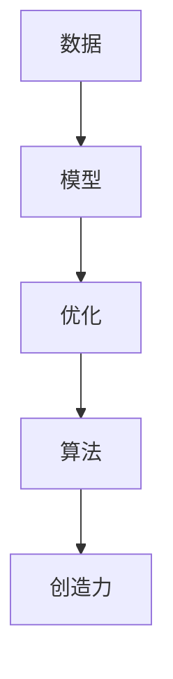

                 

## 1. 背景介绍

创造力（Creativity），被誉为人类最宝贵的内在资产之一。在科技迅猛发展的当下，无论是软件开发、数据分析、人工智能，还是生物工程、天文学等，创造力都在其中起到了不可替代的作用。创造力不仅帮助我们发现新的知识，还能解决复杂的问题，驱动技术的革新和产业的变革。因此，理解并提升创造力，成为了众多学者、工程师和企业关注的热点。

本文旨在从技术角度探讨创造力的本质和实现路径，帮助读者深入理解创造力如何通过技术手段转化为现实，并详细阐述相关技术和工具的应用实践。

## 2. 核心概念与联系

### 2.1 核心概念概述

在探讨创造力及其技术实现之前，首先需要明确几个关键概念：

- **创造力（Creativity）**：将想法转化为现实的能力，包括创新、设计、解决问题、创造新事物等。

- **算法（Algorithm）**：定义解决问题过程的一系列明确规则和步骤，通常包括输入、处理和输出三个部分。

- **数据（Data）**：反映现实世界的信息集合，是训练、测试和应用算法的基础。

- **模型（Model）**：算法在数据上训练的结果，可以用于预测和决策。

- **优化（Optimization）**：通过调整模型参数，使模型更好地匹配数据，提升性能。

这些概念通过相互联系，构成了解决问题的整个技术框架。创造力通过算法和模型，将数据转化为实用的解决方案，进而推动技术的发展和应用。

### 2.2 核心概念原理和架构的 Mermaid 流程图



在这个流程图中，数据首先经过模型，通过优化过程，最终转化为创造力。这个过程体现了从数据到模型，再到应用创造力的技术路径。

## 3. 核心算法原理 & 具体操作步骤

### 3.1 算法原理概述

创造力的实现离不开算法的支持。创造力本身虽然是一种主观的、非线性的过程，但可以通过算法来模拟和优化。以下是创造力实现的基本原理和步骤：

1. **数据采集与预处理**：获取并准备数据，以便算法能够高效处理。
2. **模型设计**：选择或设计合适的模型结构，确保能够捕捉数据中的关键模式。
3. **优化与训练**：使用优化算法对模型进行训练，使其能够更好地匹配数据。
4. **评估与验证**：通过评估指标，验证模型的性能和泛化能力。
5. **应用与创新**：将训练好的模型应用于实际问题，生成创造性的解决方案。

### 3.2 算法步骤详解

#### 3.2.1 数据采集与预处理

数据采集是创造力实现的基础。首先，需要明确数据来源，例如，从公开数据集、爬虫获取、用户输入等。接着，对数据进行预处理，包括数据清洗、特征工程、数据增强等步骤，以提高数据的质量和多样性。

#### 3.2.2 模型设计

选择合适的模型结构是创造力实现的关键。常用的模型包括深度学习中的卷积神经网络（CNN）、循环神经网络（RNN）、长短时记忆网络（LSTM）和变压器（Transformer）等。这些模型已经在图像识别、文本生成、语音识别等领域展示了强大的能力。

#### 3.2.3 优化与训练

模型的训练过程通常使用优化算法，如梯度下降（GD）、Adam、RMSprop等。通过反向传播算法，模型根据损失函数调整参数，以最小化预测误差。这个过程需要调整超参数，如学习率、批量大小、迭代次数等。

#### 3.2.4 评估与验证

模型训练完毕后，需要进行评估和验证，以确保其性能和泛化能力。评估指标包括准确率、召回率、F1分数、ROC曲线等。

#### 3.2.5 应用与创新

最后，将训练好的模型应用于实际问题，生成创造性的解决方案。这可能包括生成新的图像、文本、音频等，或优化现有产品的功能，甚至解决全新的问题。

### 3.3 算法优缺点

#### 3.3.1 优点

- **高效处理大量数据**：算法能够高效处理大量数据，提取关键特征，生成有意义的解决方案。
- **模型可解释性强**：许多现代算法，如决策树、神经网络等，可以提供可视化的解释，帮助理解模型的内部运作机制。
- **易于集成和部署**：算法通常可以封装成可重用的组件，方便集成到现有系统中。

#### 3.3.2 缺点

- **数据依赖性强**：算法的性能高度依赖于数据的质量和多样性，需要投入大量资源准备数据。
- **模型复杂度高**：复杂的模型需要更多的计算资源和时间进行训练和优化，可能会增加部署成本。
- **需要专业知识**：算法的设计和优化需要专业的知识，对非技术背景的人员来说，门槛较高。

### 3.4 算法应用领域

创造力在多个领域中都有应用，包括：

- **图像处理**：如计算机视觉、图像识别、自动驾驶等。
- **自然语言处理**：如机器翻译、语音识别、文本生成等。
- **推荐系统**：如电商平台、音乐、视频推荐等。
- **智能制造**：如机器人控制、预测性维护等。
- **金融分析**：如信用评估、风险管理等。

这些领域中的算法应用，展现了创造力如何通过技术手段转化为现实，推动了产业的创新和发展。

## 4. 数学模型和公式 & 详细讲解 & 举例说明

### 4.1 数学模型构建

创造力的实现通常涉及到多个数学模型，包括但不限于回归模型、分类模型、聚类模型等。这些模型需要根据具体问题选择合适的算法和超参数。

以线性回归模型为例，其数学模型为：

$$
y = \theta_0 + \sum_{i=1}^n \theta_i x_i
$$

其中，$y$ 是输出，$x_i$ 是输入特征，$\theta_i$ 是模型参数。

### 4.2 公式推导过程

线性回归模型的推导过程如下：

1. 定义损失函数 $L(y,\hat{y})$，如均方误差（MSE）：

$$
L(y,\hat{y}) = \frac{1}{2N}\sum_{i=1}^N(y_i-\hat{y}_i)^2
$$

2. 通过链式法则，计算损失函数对参数的梯度：

$$
\frac{\partial L}{\partial \theta_j} = -\frac{1}{N}\sum_{i=1}^N(x_i^j)(y_i-\hat{y}_i)
$$

3. 使用梯度下降算法更新参数：

$$
\theta_j \leftarrow \theta_j - \eta \frac{\partial L}{\partial \theta_j}
$$

其中，$\eta$ 是学习率。

### 4.3 案例分析与讲解

以图像分类为例，CNN模型是常用的算法。CNN模型由多个卷积层、池化层、全连接层组成，能够高效地提取图像的局部特征和全局特征，最终分类输出。

## 5. 项目实践：代码实例和详细解释说明

### 5.1 开发环境搭建

- **编程语言**：Python。
- **框架**：TensorFlow或PyTorch。
- **环境**：GPU或TPU。

安装Python和相关框架，确保开发环境支持GPU加速。

### 5.2 源代码详细实现

以下是一个简单的图像分类项目的实现步骤：

1. 数据集准备：使用TensorFlow或Keras的数据集加载功能，准备图像和标签数据。

```python
from tensorflow.keras.datasets import mnist

(x_train, y_train), (x_test, y_test) = mnist.load_data()
```

2. 数据预处理：将数据归一化到0-1之间，并转换为TensorFlow可处理的格式。

```python
x_train = x_train / 255.0
x_test = x_test / 255.0
x_train = x_train.reshape(x_train.shape[0], x_train.shape[1], x_train.shape[2], 1)
x_test = x_test.reshape(x_test.shape[0], x_test.shape[1], x_test.shape[2], 1)
```

3. 模型设计：定义CNN模型结构，包括卷积层、池化层、全连接层等。

```python
from tensorflow.keras import layers

model = layers.Sequential([
    layers.Conv2D(32, (3, 3), activation='relu', input_shape=(28, 28, 1)),
    layers.MaxPooling2D((2, 2)),
    layers.Conv2D(64, (3, 3), activation='relu'),
    layers.MaxPooling2D((2, 2)),
    layers.Flatten(),
    layers.Dense(10, activation='softmax')
])
```

4. 模型训练：使用TensorFlow的Keras API训练模型，调整超参数。

```python
model.compile(optimizer='adam', loss='sparse_categorical_crossentropy', metrics=['accuracy'])
model.fit(x_train, y_train, epochs=5, validation_data=(x_test, y_test))
```

5. 模型评估：在测试集上评估模型性能。

```python
model.evaluate(x_test, y_test)
```

### 5.3 代码解读与分析

在代码实现中，数据准备和预处理是基础，模型设计是核心，训练和评估是关键。每个步骤都需要精心设计和调整，以确保模型的高效和准确。

### 5.4 运行结果展示

运行上述代码，可以得到模型在测试集上的准确率和损失函数曲线，从而评估模型的性能。

## 6. 实际应用场景

### 6.1 图像处理

图像处理是创造力在技术应用中最常见的领域之一。无论是医学影像分析、智能安防、自动驾驶，还是社交媒体中的面部识别、情感分析，图像处理算法都发挥了重要作用。

### 6.2 自然语言处理

自然语言处理（NLP）涉及文本生成、语音识别、机器翻译等多个方面。通过算法和模型，NLP可以自动化处理大量文本数据，提升文本分析和信息提取的效率和精度。

### 6.3 推荐系统

推荐系统通过算法和模型，分析用户行为和偏好，提供个性化的商品、内容和服务推荐，提升用户体验和满意度。

### 6.4 未来应用展望

未来的创造力技术将更加智能和多样化。例如，基于生成对抗网络（GAN）的图像生成、基于转移学习的跨领域应用、基于深度学习和大数据的新算法等，都将推动创造力技术的发展。

## 7. 工具和资源推荐

### 7.1 学习资源推荐

- **在线课程**：Coursera、edX、Udacity等平台的机器学习、深度学习课程。
- **书籍**：《深度学习》（Ian Goodfellow等著）、《Python深度学习》（François Chollet著）等。
- **社区**：GitHub、Kaggle、Stack Overflow等。

### 7.2 开发工具推荐

- **编程语言**：Python、R。
- **框架**：TensorFlow、PyTorch、Keras等。
- **开发环境**：Jupyter Notebook、Google Colab等。

### 7.3 相关论文推荐

- **经典论文**：《深度学习》（Ian Goodfellow等著）、《ImageNet分类》（Krizhevsky等著）等。
- **前沿论文**：《Attention is All You Need》（Vaswani等著）、《BERT: Pre-training of Deep Bidirectional Transformers for Language Understanding》（Devlin等著）等。

## 8. 总结：未来发展趋势与挑战

### 8.1 研究成果总结

创造力技术在多个领域展示了巨大的潜力，提升了数据处理和问题解决的能力，推动了技术的创新和应用。然而，技术实现过程中仍面临诸多挑战，包括数据依赖、算法复杂度、模型可解释性等。

### 8.2 未来发展趋势

未来的创造力技术将更加智能和多样化，包括基于生成对抗网络（GAN）的图像生成、基于转移学习的跨领域应用、基于深度学习和大数据的新算法等，都将推动创造力技术的发展。

### 8.3 面临的挑战

未来的创造力技术面临的挑战包括数据依赖、算法复杂度、模型可解释性等。如何克服这些挑战，将是大规模应用的关键。

### 8.4 研究展望

未来的研究将集中在以下几个方面：

- **跨领域融合**：将创造力技术与AI、大数据、物联网等技术结合，推动技术的全面创新。
- **算法优化**：开发更加高效、可解释性强的算法，提升创造力技术的实用性和可靠性。
- **应用拓展**：将创造力技术应用于更多领域，如医疗、金融、智能制造等，推动技术的产业化和商业化。

## 9. 附录：常见问题与解答

**Q1: 什么是创造力？**

A: 创造力是将想法转化为现实的能力，包括创新、设计、解决问题、创造新事物等。

**Q2: 创造力是如何通过技术手段转化为现实的？**

A: 创造力通过算法和模型，将数据转化为实际的解决方案，推动技术的创新和应用。

**Q3: 有哪些工具和资源可以推荐？**

A: 学习资源推荐包括在线课程、书籍和社区，开发工具推荐包括编程语言、框架和开发环境。

**Q4: 未来创造力技术的发展趋势是什么？**

A: 未来的创造力技术将更加智能和多样化，包括基于生成对抗网络（GAN）的图像生成、基于转移学习的跨领域应用、基于深度学习和大数据的新算法等，都将推动创造力技术的发展。

**Q5: 创造力技术面临的挑战有哪些？**

A: 创造力技术面临的挑战包括数据依赖、算法复杂度、模型可解释性等，需要通过跨领域融合、算法优化和应用拓展等方式加以克服。

---

作者：禅与计算机程序设计艺术 / Zen and the Art of Computer Programming

