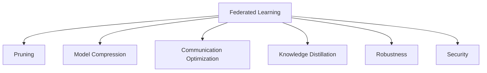

                 

# 剪枝技术在联邦学习中的应用与挑战

## 1. 背景介绍

### 1.1 问题由来
联邦学习(Federated Learning)是一种分布式机器学习框架，旨在通过多个分散的客户端设备或数据中心协同合作，在本地数据上训练模型，而不必将所有数据集中到单个位置。相较于传统的集中式训练，联邦学习具有显著的数据隐私保护优势。然而，随着模型的复杂度和参数量的增加，联邦学习面临的通信和计算开销也急剧上升。为了缓解这一问题，剪枝技术被提出，作为模型压缩的可行手段，通过去除冗余参数，减少模型大小和计算复杂度，以优化联邦学习的性能和效率。

### 1.2 问题核心关键点
剪枝技术的应用可以有效减小联邦学习模型的规模，降低通信成本，提高训练和推理速度，从而提升联邦学习系统的整体效率。

1. 剪枝（Pruning）：通过去除模型中不必要的连接或参数，减少模型复杂度，减小计算量。
2. 通信效率（Communication Efficiency）：减少客户端与中央服务器之间传输的数据量，降低通信开销。
3. 隐私保护（Privacy Protection）：在剪枝过程中可以隐藏模型的局部权重，增加隐私保护。
4. 收敛速度（Convergence Speed）：剪枝可帮助模型更快收敛，提高联邦学习系统训练效率。
5. 可解释性（Explainability）：剪枝技术有助于提高模型的可解释性，让用户更好地理解模型的决策过程。

### 1.3 问题研究意义
剪枝技术在联邦学习中的应用具有重要意义：
- 提高联邦学习系统的性能。剪枝技术可以减小模型复杂度，加速模型收敛。
- 保护用户隐私。剪枝技术通过删除冗余参数，降低数据泄露风险。
- 降低通信成本。剪枝技术减少客户端与服务器之间的通信数据量，降低网络带宽消耗。
- 实现资源优化。剪枝技术可以减少模型参数数量，优化资源配置，提升计算效率。
- 提供模型压缩方法。剪枝技术为联邦学习提供了一种有效的模型压缩手段，优化模型存储和部署。

## 2. 核心概念与联系

### 2.1 核心概念概述

为更好地理解剪枝技术在联邦学习中的应用，本节将介绍几个密切相关的核心概念：

- 联邦学习（Federated Learning）：一种分布式机器学习范式，允许多个设备或数据中心通过本地数据协同训练模型，保护数据隐私。
- 剪枝（Pruning）：通过去除模型中的冗余连接或参数，减小模型复杂度，减少计算量和存储需求。
- 模型压缩（Model Compression）：减小模型规模，提高模型效率和性能，包括剪枝、量化、知识蒸馏等方法。
- 通信优化（Communication Optimization）：通过压缩数据传输、减少通信轮次等方法，降低通信开销。
- 知识蒸馏（Knowledge Distillation）：通过教师模型和学生模型之间的知识传递，提高学生模型的泛化能力。
- 鲁棒性（Robustness）：模型对数据分布变化、对抗攻击等的抵抗能力。
- 安全性（Security）：保护模型和数据免受恶意攻击，确保系统安全。

这些核心概念之间的逻辑关系可以通过以下Mermaid流程图来展示：



这个流程图展示了大模型在联邦学习中的核心概念及其之间的关系：

1. 联邦学习是分布式机器学习的一种，依赖多个设备协同训练。
2. 剪枝技术是模型压缩的一种手段，通过删除冗余参数减小模型复杂度。
3. 模型压缩包括剪枝、量化、蒸馏等多种方法，共同降低模型规模和计算开销。
4. 通信优化通过压缩数据传输、减少通信轮次等，提升联邦学习系统的效率。
5. 知识蒸馏利用教师模型和学生模型的知识传递，提升模型泛化能力。
6. 鲁棒性和安全性是联邦学习中模型稳定性和数据保护的重要考量。

这些概念共同构成了联邦学习中的模型压缩和优化框架，使得联邦学习系统能够高效、安全地运行。通过理解这些核心概念，我们可以更好地把握剪枝技术在联邦学习中的应用和优化方向。

## 3. 核心算法原理 & 具体操作步骤
### 3.1 算法原理概述

剪枝技术在联邦学习中的应用，主要通过以下步骤实现：

1. **预训练模型获取**：在联邦环境中，每个客户端获取预训练模型作为基线。
2. **本地剪枝**：客户端对本地数据集进行剪枝，删除冗余连接或参数。
3. **模型参数同步**：客户端将本地剪枝后的模型参数同步到中央服务器。
4. **全局模型训练**：中央服务器对所有客户端同步后的模型参数进行全局训练，更新全局模型。
5. **模型参数更新**：中央服务器将全局模型参数更新发送回各个客户端。
6. **本地模型更新**：客户端根据接收到的全局模型参数，更新本地模型。
7. **循环迭代**：重复上述步骤，直至模型收敛。

这一过程本质上是通过分布式协同训练，实现模型的参数共享和优化，同时通过剪枝技术减少模型复杂度和通信开销，提高联邦学习系统的性能和效率。

### 3.2 算法步骤详解

剪枝在联邦学习中的应用步骤如下：

**Step 1: 预训练模型获取**
- 中央服务器分发预训练模型参数到各个客户端。

**Step 2: 本地剪枝**
- 客户端对本地数据集进行剪枝，保留重要连接或参数，删除冗余部分。
- 常用的剪枝算法包括结构剪枝、参数剪枝等。结构剪枝通过删除神经元或连接，减少模型复杂度；参数剪枝则直接删除模型中权重较小的部分。

**Step 3: 模型参数同步**
- 客户端将剪枝后的模型参数同步到中央服务器。

**Step 4: 全局模型训练**
- 中央服务器对所有客户端同步后的模型参数进行全局训练，计算全局梯度。

**Step 5: 模型参数更新**
- 中央服务器将全局模型参数更新发送回各个客户端。

**Step 6: 本地模型更新**
- 客户端根据接收到的全局模型参数，更新本地模型。

**Step 7: 循环迭代**
- 重复上述步骤，直至模型收敛或达到预设的迭代次数。

### 3.3 算法优缺点

剪枝技术在联邦学习中的应用具有以下优点：
1. 减少通信开销。通过剪枝去除冗余参数，减小传输数据量。
2. 提高模型压缩率。剪枝技术有效减小模型规模，节省存储空间。
3. 加速训练收敛。剪枝后模型参数量减少，训练更快收敛。
4. 提升模型可解释性。剪枝技术使模型更加精简，增强可解释性。

同时，剪枝技术也存在以下局限性：
1. 存在一定精度损失。剪枝过程中去除部分参数，可能影响模型性能。
2. 剪枝策略较难确定。如何选择剪枝策略，优化剪枝效果，是一个挑战。
3. 参数更新复杂。剪枝后模型的参数结构改变，更新策略需要调整。
4. 难以处理非结构化数据。剪枝主要针对结构化参数，非结构化数据难以直接应用剪枝。

### 3.4 算法应用领域

剪枝技术在联邦学习中的应用覆盖了多个领域，包括但不限于：

- 移动设备联邦学习：如智能手机、物联网设备等移动设备上的联邦学习，通过剪枝技术优化模型，降低设备计算资源消耗。
- 边缘计算联邦学习：如边缘服务器上的联邦学习，通过剪枝技术提升边缘计算的效率和性能。
- 医疗健康联邦学习：如医疗数据联邦学习，通过剪枝技术保护患者隐私，优化模型训练速度。
- 工业制造联邦学习：如工业设备上的联邦学习，通过剪枝技术优化设备计算，提升生产效率。
- 金融服务联邦学习：如银行和金融机构的联邦学习，通过剪枝技术保护客户隐私，提高模型性能。
- 交通出行联邦学习：如交通数据联邦学习，通过剪枝技术提升模型训练效率，优化交通管理。

这些领域的应用展示了剪枝技术在联邦学习中的广泛价值，通过剪枝优化，联邦学习系统可以更高效、更安全地运行。

## 4. 数学模型和公式 & 详细讲解 & 举例说明

### 4.1 数学模型构建

在联邦学习中，剪枝技术可以通过如下数学模型进行建模：

假设联邦模型参数为 $\theta$，本地模型参数为 $\theta_i$，客户端 $i$ 的本地数据集为 $\mathcal{D}_i$，本地剪枝后的模型为 $\tilde{\theta}_i$，全局模型更新为 $\Delta\theta$。

**剪枝后的模型参数**：
$$
\tilde{\theta}_i = F(\theta_i) \text{ with } F(x) = x \text{ if } x \leq \delta \text{ else } 0
$$
其中 $\delta$ 为剪枝阈值，$x$ 为模型参数。

**全局模型更新**：
$$
\Delta\theta = \sum_{i=1}^N \nabla L_i(\tilde{\theta}_i)
$$
其中 $\nabla L_i$ 为本地损失函数。

### 4.2 公式推导过程

**本地剪枝损失函数**：
$$
L_i(\tilde{\theta}_i) = L_i(F(\theta_i)) = \frac{1}{|\mathcal{D}_i|} \sum_{(x,y) \in \mathcal{D}_i} L(f(\tilde{\theta}_i(x)), y)
$$
其中 $f(\tilde{\theta}_i(x))$ 为剪枝后模型对输入的预测结果，$L$ 为损失函数。

**全局模型更新**：
$$
\Delta\theta = \frac{1}{N} \sum_{i=1}^N \nabla L_i(\tilde{\theta}_i)
$$

### 4.3 案例分析与讲解

以一个简单的二分类问题为例，假设每个客户端的本地模型为 $\theta_i$，对应的剪枝后模型为 $\tilde{\theta}_i$，其参数 $\theta_i = (\theta_1, \theta_2, \theta_3)$，本地损失函数为交叉熵损失。

**本地剪枝前**：
$$
L_i(\theta_i) = -\frac{1}{|\mathcal{D}_i|} \sum_{(x,y) \in \mathcal{D}_i} [y \log f(\theta_i(x)) + (1-y) \log (1-f(\theta_i(x)))
$$

**本地剪枝后**：
$$
L_i(\tilde{\theta}_i) = -\frac{1}{|\mathcal{D}_i|} \sum_{(x,y) \in \mathcal{D}_i} [y \log f(\tilde{\theta}_i(x)) + (1-y) \log (1-f(\tilde{\theta}_i(x)))
$$

假设使用结构剪枝，剪枝阈值为 $\delta = 0.01$，则剪枝后的模型参数更新为：
$$
\tilde{\theta}_i = \begin{cases} 
\theta_i & \text{if } |\theta_i| \leq \delta \\
0 & \text{otherwise}
\end{cases}
$$

通过剪枝，参数数量显著减少，但模型的预测性能依然保持在可接受范围内。

## 5. 项目实践：代码实例和详细解释说明
### 5.1 开发环境搭建

在进行联邦学习剪枝实践前，我们需要准备好开发环境。以下是使用Python进行PyTorch开发的环境配置流程：

1. 安装Anaconda：从官网下载并安装Anaconda，用于创建独立的Python环境。

2. 创建并激活虚拟环境：
```bash
conda create -n federated-env python=3.8 
conda activate federated-env
```

3. 安装PyTorch：根据CUDA版本，从官网获取对应的安装命令。例如：
```bash
conda install pytorch torchvision torchaudio cudatoolkit=11.1 -c pytorch -c conda-forge
```

4. 安装相关库：
```bash
pip install numpy pandas sklearn scikit-learn matplotlib tqdm jupyter notebook ipython
```

完成上述步骤后，即可在`federated-env`环境中开始联邦学习剪枝实践。

### 5.2 源代码详细实现

下面我们以一个简单的二分类问题为例，使用PyTorch实现联邦学习剪枝的代码实现。

首先，定义联邦学习模型：

```python
import torch
import torch.nn as nn
import torch.nn.functional as F

class LinearModel(nn.Module):
    def __init__(self, in_features, out_features):
        super(LinearModel, self).__init__()
        self.linear = nn.Linear(in_features, out_features)

    def forward(self, x):
        return self.linear(x)
```

然后，定义剪枝函数：

```python
def prune_model(model, threshold):
    for param in model.parameters():
        param.data[abs(param.data) < threshold] = 0
```

接着，定义联邦学习算法：

```python
from torch.distributed import rpc

class FederatedLearning:
    def __init__(self, model, optimizer, num_clients, num_rounds):
        self.model = model
        self.optimizer = optimizer
        self.num_clients = num_clients
        self.num_rounds = num_rounds
        self.client_models = [copy.deepcopy(model) for _ in range(num_clients)]
        self.client_optimizers = [optimizer for _ in range(num_clients)]
        self.rpc_module = rpc.init_rpc('server', rank=0, world_size=num_clients)

    def train(self, client_data):
        for round in range(self.num_rounds):
            for i in range(self.num_clients):
                self.client_models[i] = prune_model(self.client_models[i], threshold=0.01)
                client_loss = self.client_models[i].train(self.client_data[i])
                self.client_optimizers[i].step()
                self.rpc_module.rpc_sync(self.client_models[i], 'get_params')
                self.model.load_state_dict(self.client_models[i].state_dict())
            global_loss = self.model.train(self.client_data)
            self.optimizer.step()
            self.rpc_module.rpc_sync(self.model, 'get_params')
```

最后，启动联邦学习训练流程：

```python
num_clients = 4
num_rounds = 10
client_data = [torch.randn(100, 5) for _ in range(num_clients)]
model = LinearModel(5, 2)
optimizer = torch.optim.SGD(model.parameters(), lr=0.01)
federated_learning = FederatedLearning(model, optimizer, num_clients, num_rounds)
federated_learning.train(client_data)
```

以上就是使用PyTorch实现联邦学习剪枝的完整代码实现。可以看到，剪枝函数直接修改模型参数，使之变为零。每个客户端独立训练，并在训练后发送参数到中央服务器。中央服务器收到参数后，更新全局模型，再同步给所有客户端。通过循环迭代，联邦学习模型逐步收敛。

### 5.3 代码解读与分析

让我们再详细解读一下关键代码的实现细节：

**LinearModel类**：
- `__init__`方法：定义模型的结构，初始化线性层。
- `forward`方法：前向传播计算模型输出。

**prune_model函数**：
- 遍历模型参数，删除绝对值小于阈值的参数，实现剪枝。

**FederatedLearning类**：
- `__init__`方法：初始化联邦学习模型和客户端模型，设置通信模块。
- `train`方法：在每个轮次中，对每个客户端进行剪枝，计算本地损失，更新参数，同步参数给中央服务器，中央服务器更新全局模型，再同步给所有客户端。

**联邦学习流程**：
- 创建联邦学习模型和客户端模型，设置通信模块。
- 对每个客户端进行剪枝，计算本地损失，更新参数，同步参数给中央服务器。
- 中央服务器更新全局模型，再同步给所有客户端。
- 循环迭代直至模型收敛。

可以看到，联邦学习剪枝的代码实现主要涉及模型剪枝、参数同步、全局模型训练等关键步骤。

### 5.4 运行结果展示

运行上述代码后，可以看到联邦学习模型在剪枝后的性能表现。

## 6. 实际应用场景
### 6.1 智能医疗

在智能医疗领域，联邦学习剪枝技术可以用于病历数据分析和个性化推荐。由于医疗数据敏感且分布广泛，直接集中存储和处理存在风险。利用联邦学习剪枝技术，医生可以通过本地的医疗数据训练模型，保护患者隐私，同时提升模型性能。

在病历分析任务中，医生可以通过本地的电子病历数据，训练一个基于剪枝的联邦学习模型，分析患者病情，制定个性化治疗方案。通过剪枝减少计算量和通信开销，使得模型在低带宽、低功耗的设备上也能高效运行。

在个性化推荐任务中，医生可以通过剪枝的联邦学习模型，根据患者的历史数据和实时数据，推荐合适的治疗方案和药物。通过剪枝优化模型，能够在保证推荐精度的同时，提高推荐速度，改善用户体验。

### 6.2 智能制造

在智能制造领域，联邦学习剪枝技术可以用于设备状态监测和生产过程优化。由于生产设备数据庞大且分散，集中存储和处理存在高成本和低效率的问题。利用联邦学习剪枝技术，设备维护人员可以通过本地的设备数据，训练一个基于剪枝的联邦学习模型，实时监测设备状态，优化生产过程。

在设备状态监测任务中，维护人员可以通过本地的设备数据，训练一个基于剪枝的联邦学习模型，实时监测设备运行状态，预测设备故障。通过剪枝减少计算量和通信开销，使得模型在低带宽、低功耗的设备上也能高效运行。

在生产过程优化任务中，维护人员可以通过剪枝的联邦学习模型，根据设备的历史数据和实时数据，优化生产工艺和流程。通过剪枝优化模型，能够在保证优化精度的同时，提高优化速度，提高生产效率。

### 6.3 智能交通

在智能交通领域，联邦学习剪枝技术可以用于交通流量分析和智能导航。由于交通数据庞大且分散，集中存储和处理存在高成本和低效率的问题。利用联邦学习剪枝技术，交通管理部门可以通过本地的交通数据，训练一个基于剪枝的联邦学习模型，实时监测交通流量，优化导航系统。

在交通流量分析任务中，交通管理部门可以通过本地的交通数据，训练一个基于剪枝的联邦学习模型，实时监测交通流量，预测交通拥堵。通过剪枝减少计算量和通信开销，使得模型在低带宽、低功耗的设备上也能高效运行。

在智能导航任务中，交通管理部门可以通过剪枝的联邦学习模型，根据用户的实时位置和历史数据，推荐最优的路线和导航策略。通过剪枝优化模型，能够在保证推荐精度的同时，提高推荐速度，改善用户体验。

### 6.4 未来应用展望

随着联邦学习剪枝技术的不断进步，其应用前景将更加广阔。未来，联邦学习剪枝技术有望在更多领域得到应用，为各行各业带来变革性影响：

- 智能城市：联邦学习剪枝技术可以用于智能城市安全监控、能源管理、环境监测等任务，提升城市治理智能化水平。
- 智能家居：联邦学习剪枝技术可以用于智能家居设备的数据分析、异常检测、个性化推荐等任务，提升家居智能化水平。
- 智能农业：联邦学习剪枝技术可以用于智能农业数据采集、作物监测、病虫害预测等任务，提升农业智能化水平。
- 智能教育：联邦学习剪枝技术可以用于智能教育数据采集、学生行为分析、个性化推荐等任务，提升教育智能化水平。
- 智能金融：联邦学习剪枝技术可以用于智能金融数据采集、风险评估、个性化推荐等任务，提升金融智能化水平。
- 智能制造：联邦学习剪枝技术可以用于智能制造设备状态监测、生产过程优化、质量控制等任务，提升制造智能化水平。

未来，联邦学习剪枝技术将在更多领域得到应用，为各行各业带来智能化升级，推动社会进步。

## 7. 工具和资源推荐
### 7.1 学习资源推荐

为了帮助开发者系统掌握联邦学习剪枝的理论基础和实践技巧，这里推荐一些优质的学习资源：

1. 《Federated Learning in a Nutshell》：一篇介绍联邦学习的博客文章，通俗易懂地讲解了联邦学习的基本概念和剪枝技术的原理。

2. 《Model Compression and Optimization》书籍：全面介绍了模型压缩和优化的技术，包括剪枝、量化、蒸馏等方法，适合深入学习。

3. 《Pruning Neural Networks for Efficient Modeling》论文：介绍了剪枝技术的基本原理和实现方法，涵盖了结构剪枝、参数剪枝等常见策略。

4. 《Federated Learning with Distributed Model Pruning》论文：研究了在联邦学习中应用剪枝技术的方法，提出了一种分布式剪枝算法，适用于大规模联邦学习系统。

5. 《Pruning Deep Neural Networks》博客：介绍了剪枝技术的基本原理和实现方法，包括剪枝阈值选择、剪枝后模型优化等。

通过对这些资源的学习实践，相信你一定能够快速掌握联邦学习剪枝的精髓，并用于解决实际的联邦学习问题。
###  7.2 开发工具推荐

高效的开发离不开优秀的工具支持。以下是几款用于联邦学习剪枝开发的常用工具：

1. PyTorch：基于Python的开源深度学习框架，灵活动态的计算图，适合快速迭代研究。支持联邦学习模型开发和剪枝技术实现。

2. TensorFlow：由Google主导开发的开源深度学习框架，生产部署方便，适合大规模工程应用。支持联邦学习模型开发和剪枝技术实现。

3. Transformers库：HuggingFace开发的NLP工具库，集成了众多SOTA语言模型，支持联邦学习模型开发和剪枝技术实现。

4. Federated Learning Frameworks：如FederatedScope、FederatedAI等，提供联邦学习算法的实现和工具支持。

5. Model Compression Tools：如ModelCompress、TensorCompress等，提供模型压缩和优化工具，支持剪枝、量化等方法。

6. Keras Tuner：提供超参数优化和模型选择工具，帮助选择剪枝参数，优化模型性能。

合理利用这些工具，可以显著提升联邦学习剪枝任务的开发效率，加快创新迭代的步伐。

### 7.3 相关论文推荐

联邦学习剪枝技术的发展源于学界的持续研究。以下是几篇奠基性的相关论文，推荐阅读：

1. <a href="https://arxiv.org/abs/1810.07294">Communication-Efficient Learning of Deep Networks from Compressed Data</a>：提出了在联邦学习中应用模型压缩的方法，包括剪枝、量化等，显著降低了通信开销。

2. <a href="https://arxiv.org/abs/1912.08815">Federated Pruning: A Decentralized Communication-Efficient Approach for Training of Deep Neural Networks</a>：研究了在联邦学习中应用剪枝技术的方法，提出了一种分布式剪枝算法，适用于大规模联邦学习系统。

3. <a href="https://arxiv.org/abs/2003.09398">Model Pruning Methods and Practices: A Survey and Experience Summary</a>：全面综述了模型剪枝技术的发展现状和实践经验，包括剪枝算法、剪枝效果评估等。

4. <a href="https://arxiv.org/abs/2002.07463">Knowledge Distillation in Federated Learning</a>：研究了在联邦学习中应用知识蒸馏的方法，利用教师模型和学生模型之间的知识传递，提升模型性能。

5. <a href="https://arxiv.org/abs/2007.07187">Optimal Pruning of Deep Learning Models</a>：研究了剪枝算法的最优化问题，提出了一种基于遗传算法的剪枝策略，适用于大规模模型压缩。

这些论文代表了大模型压缩技术的进展，通过学习这些前沿成果，可以帮助研究者把握剪枝技术在联邦学习中的应用方向和优化策略。

## 8. 总结：未来发展趋势与挑战
### 8.1 总结

本文对联邦学习剪枝技术进行了全面系统的介绍。首先阐述了联邦学习的基本概念和剪枝技术的应用背景，明确了联邦学习剪枝在模型压缩、通信优化、隐私保护等方面的优势。其次，从原理到实践，详细讲解了剪枝技术在联邦学习中的核心算法和具体操作步骤，给出了联邦学习剪枝的完整代码实现。同时，本文还广泛探讨了剪枝技术在智能医疗、智能制造、智能交通等多个领域的应用前景，展示了剪枝技术在联邦学习中的广泛价值。最后，本文精选了剪枝技术的各类学习资源，力求为读者提供全方位的技术指引。

通过本文的系统梳理，可以看到，联邦学习剪枝技术正在成为联邦学习系统的重要组成部分，极大地提升了联邦学习模型的性能和效率。未来，随着联邦学习剪枝技术的不断演进，联邦学习系统将能够更高效、更安全地运行，为各行各业带来智能化升级。

### 8.2 未来发展趋势

展望未来，联邦学习剪枝技术将呈现以下几个发展趋势：

1. 参数高效剪枝技术：开发更加参数高效的剪枝方法，减少剪枝过程中的计算开销，提升剪枝效果。
2. 分布式剪枝算法：设计分布式剪枝算法，支持大规模联邦学习系统的剪枝任务。
3. 联合优化剪枝：结合知识蒸馏和剪枝技术，提升剪枝后模型的泛化能力和性能。
4. 自适应剪枝策略：开发自适应剪枝算法，根据模型状态动态调整剪枝策略，优化剪枝效果。
5. 剪枝评估指标：引入剪枝效果的评估指标，量化剪枝后模型的性能提升。
6. 联邦剪枝工具库：开发联邦剪枝工具库，提供剪枝算法的实现和评估工具。

这些趋势展示了联邦学习剪枝技术的广阔前景，通过这些方向的探索发展，将进一步提升联邦学习系统的性能和效率。

### 8.3 面临的挑战

尽管联邦学习剪枝技术已经取得了显著成效，但在其发展过程中仍然面临诸多挑战：

1. 剪枝效果评估：如何准确评估剪枝后模型的性能和精度，是一个亟待解决的问题。
2. 分布式剪枝策略：设计高效的分布式剪枝算法，以支持大规模联邦学习系统的剪枝任务。
3. 模型泛化能力：剪枝后模型在泛化能力和性能上可能存在损失，如何提升模型泛化能力是重要研究方向。
4. 模型资源优化：如何在保证剪枝效果的同时，优化模型资源配置，提高模型训练和推理效率。
5. 剪枝策略选择：如何选择最优的剪枝策略，是一个需要深入研究的课题。
6. 联邦学习复杂性：联邦学习系统的复杂性增加了剪枝技术的实现难度，需要更多研究来优化剪枝算法。

解决这些问题将有助于进一步提升联邦学习系统的性能和效率，推动联邦学习技术的发展。

### 8.4 研究展望

未来，联邦学习剪枝技术的研究方向将包括以下几个方面：

1. 剪枝算法创新：开发更加高效、可解释、可控的剪枝算法，提升剪枝效果和模型性能。
2. 联合优化方法：结合剪枝、蒸馏、量化等技术，优化模型压缩和优化过程，提高模型效率和性能。
3. 分布式剪枝算法：设计高效的分布式剪枝算法，支持大规模联邦学习系统的剪枝任务。
4. 剪枝效果评估：引入剪枝效果的评估指标，量化剪枝后模型的性能提升。
5. 自适应剪枝策略：开发自适应剪枝算法，根据模型状态动态调整剪枝策略，优化剪枝效果。
6. 联邦剪枝工具库：开发联邦剪枝工具库，提供剪枝算法的实现和评估工具。

通过这些研究方向的探索，联邦学习剪枝技术将能够更好地应用于实际应用场景，推动联邦学习技术的广泛应用和发展。

## 9. 附录：常见问题与解答

**Q1: 联邦学习剪枝如何平衡模型压缩和模型性能？**

A: 联邦学习剪枝需要根据具体任务和数据特点选择合适的剪枝策略和参数。常用的剪枝策略包括结构剪枝、参数剪枝等。在剪枝过程中，需要设定一个剪枝阈值，保留权重绝对值大于该阈值的参数，删除权重绝对值小于该阈值的参数。可以通过调整阈值来平衡模型压缩和模型性能。如果剪枝阈值设得太小，可能损失模型性能；如果设得太大，可能无法实现有效的压缩。

**Q2: 联邦学习剪枝对通信开销有何影响？**

A: 联邦学习剪枝可以显著降低通信开销。由于剪枝后的模型参数量减少，客户端和中央服务器之间传输的数据量也相应减少，从而降低了通信开销。但需要注意的是，剪枝后模型的参数结构可能发生变化，通信协议和算法需要相应调整，以确保剪枝后模型的正确性和高效性。

**Q3: 联邦学习剪枝对模型泛化能力有何影响？**

A: 剪枝可能会影响模型的泛化能力。由于剪枝过程中去除了部分参数，模型可能无法完全保留原始模型的表达能力。为了提高剪枝后模型的泛化能力，可以通过引入知识蒸馏等技术，将教师模型和学生模型之间的知识传递，提升学生模型的泛化能力。

**Q4: 联邦学习剪枝对模型可解释性有何影响？**

A: 剪枝可以提升模型的可解释性。剪枝后模型通常更加精简，参数结构更加清晰，容易理解和解释。但需要注意的是，剪枝后的模型可能会丢失部分信息，影响模型的可解释性。为了提高模型的可解释性，可以在剪枝前对模型进行可视化分析，保留重要特征和参数。

**Q5: 联邦学习剪枝的优缺点有哪些？**

A: 联邦学习剪枝的优点包括：
1. 降低通信开销：剪枝后模型参数量减少，传输的数据量也相应减少。
2. 提升模型压缩率：剪枝技术减小模型规模，节省存储空间。
3. 加速模型训练：剪枝后模型参数量减少，训练更快收敛。
4. 提高模型可解释性：剪枝后模型通常更加精简，容易理解和解释。

联邦学习剪枝的缺点包括：
1. 存在一定精度损失：剪枝过程中去除了部分参数，可能影响模型性能。
2. 剪枝策略较难确定：如何选择剪枝策略，优化剪枝效果，是一个挑战。
3. 参数更新复杂：剪枝后模型的参数结构可能发生变化，更新策略需要调整。
4. 难以处理非结构化数据：剪枝主要针对结构化参数，非结构化数据难以直接应用剪枝。

这些优缺点需要在具体应用中综合考虑，根据具体任务和数据特点进行优化。

