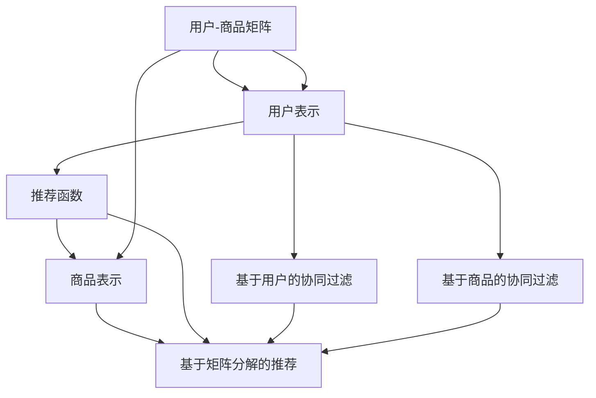

                 

# 协同过滤算法在电商推荐系统中的应用：原理与实践

## 1. 背景介绍

### 1.1 问题由来
在当今数字化时代，电商平台已发展成为连接消费者和商家的重要平台。为了提升用户体验，电商平台广泛应用了推荐系统，根据用户的浏览历史和购买记录，实时推送个性化的商品推荐。协同过滤（Collaborative Filtering, CF）算法作为推荐系统的核心，通过分析用户间的相似性和商品间的关联性，进行精准推荐。

协同过滤算法包括基于用户的协同过滤和基于商品的协同过滤两种方法。基于用户的协同过滤通过分析用户的历史行为，找到兴趣相似的用户，并将他们的偏好转移到目标用户上。基于商品的协同过滤通过分析商品间的关联性，找到相似的商品，并将其推荐给目标用户。这两种方法在电商推荐系统中的应用已取得显著成效。

### 1.2 问题核心关键点
协同过滤算法的核心在于找到用户和商品间的隐含关系，从而进行个性化的推荐。该算法的关键点包括：
- 用户和商品的表示方法：如何将用户和商品表示为高维向量，以便捕捉它们之间的关系。
- 相似性度量：如何衡量用户和商品之间的相似度，通常是基于用户行为或商品特征的相似性计算。
- 推荐函数：如何根据用户和商品的表示以及相似性度量，计算推荐结果。

## 2. 核心概念与联系

### 2.1 核心概念概述

协同过滤算法是推荐系统中的核心技术，其核心思想是通过用户和商品的隐含关系，实现个性化的商品推荐。下面简要介绍协同过滤算法的核心概念：

- 用户-商品矩阵：电商平台上，每个用户都会产生多个行为记录，如浏览、收藏、购买等。每个行为都可以视为用户对商品的评分，从而可以构建一个用户-商品矩阵。
- 用户表示：将用户表示为高维向量，便于捕捉其兴趣偏好。常用的方法包括用户因子分解、基于稀疏矩阵的用户表示等。
- 商品表示：将商品表示为高维向量，便于捕捉其属性和关联性。常用的方法包括商品因子分解、基于协同聚类的商品表示等。
- 相似性度量：衡量用户和商品之间的相似度，常用的方法包括余弦相似度、皮尔逊相关系数等。
- 推荐函数：根据用户和商品的表示以及相似性度量，计算推荐结果。常见的推荐函数包括基于用户的协同过滤、基于商品的协同过滤、基于矩阵分解的推荐等。

这些概念通过协同过滤算法紧密联系起来，共同实现电商推荐系统中的个性化推荐。

### 2.2 核心概念原理和架构的 Mermaid 流程图



## 3. 核心算法原理 & 具体操作步骤

### 3.1 算法原理概述

协同过滤算法的核心在于通过用户和商品间的隐含关系，进行个性化推荐。其基本思想如下：
1. 将用户和商品表示为高维向量。
2. 计算用户和商品间的相似度，并找到相似的用户和商品。
3. 根据相似用户和商品的历史行为，计算推荐结果。

协同过滤算法主要分为基于用户的协同过滤和基于商品的协同过滤两种方法。基于用户的协同过滤方法通过分析用户的历史行为，找到兴趣相似的用户，并将他们的偏好转移到目标用户上。基于商品的协同过滤方法通过分析商品间的关联性，找到相似的商品，并将其推荐给目标用户。

### 3.2 算法步骤详解

基于用户的协同过滤算法的具体步骤如下：
1. 构建用户-商品矩阵。将用户的历史行为记录表示为矩阵 $U$，其中每一行表示一个用户的行为向量，每一列表示一个商品的行为向量。
2. 将用户和商品表示为高维向量。使用因子分解等方法，将用户和商品表示为低维的隐含向量，记为 $U_{\theta}$ 和 $P_{\theta}$。
3. 计算用户间的相似度。使用余弦相似度、皮尔逊相关系数等方法，计算用户间的相似度，得到相似度矩阵 $S_{user}$。
4. 计算推荐结果。根据相似用户的历史行为，计算推荐结果，得到目标用户的推荐向量 $I_{target}$。

基于商品的协同过滤算法的具体步骤如下：
1. 构建用户-商品矩阵。将用户的历史行为记录表示为矩阵 $U$，其中每一行表示一个用户的行为向量，每一列表示一个商品的行为向量。
2. 将商品和用户表示为高维向量。使用因子分解等方法，将商品和用户表示为低维的隐含向量，记为 $P_{\theta}$ 和 $U_{\theta}$。
3. 计算商品间的相似度。使用余弦相似度、皮尔逊相关系数等方法，计算商品间的相似度，得到相似度矩阵 $S_{item}$。
4. 计算推荐结果。根据相似商品的历史行为，计算推荐结果，得到目标用户的推荐向量 $I_{target}$。

### 3.3 算法优缺点

基于协同过滤算法的电商推荐系统具有以下优点：
1. 个性化推荐：通过分析用户和商品间的隐含关系，提供个性化的推荐结果，提升用户体验。
2. 实时性高：基于在线用户的实时行为，实时更新推荐结果，满足用户的即时需求。
3. 无需领域知识：不需要对领域知识和规则进行深入了解，直接通过数据挖掘和分析即可实现推荐。

同时，协同过滤算法也存在以下缺点：
1. 数据稀疏性：电商平台上用户的浏览和购买行为数据通常较为稀疏，容易导致推荐结果不准确。
2. 扩展性差：随着用户和商品数量的增加，矩阵计算的复杂度呈指数级增长，难以处理大规模数据。
3. 冷启动问题：对于新用户或新商品，由于缺乏历史行为数据，难以进行推荐。

### 3.4 算法应用领域

协同过滤算法在电商推荐系统中得到了广泛的应用，覆盖了几乎所有推荐任务，例如：
- 商品推荐：根据用户的历史行为，推荐相关商品。
- 用户推荐：根据用户的历史行为，推荐相关用户。
- 实时推荐：根据用户当前的实时行为，实时更新推荐结果。
- 内容推荐：根据用户的历史浏览记录，推荐相关内容。

除了电商推荐系统，协同过滤算法还被广泛应用于社交网络、新闻推荐、音乐推荐等领域，成为推荐系统的重要组成部分。

## 4. 数学模型和公式 & 详细讲解

### 4.1 数学模型构建

基于协同过滤算法的电商推荐系统，可以通过数学模型进行形式化描述。设用户-商品矩阵为 $U_{ij}$，其中 $i$ 表示用户，$j$ 表示商品，$U_{ij}$ 表示用户 $i$ 对商品 $j$ 的评分。将用户和商品表示为高维向量 $U_{\theta}$ 和 $P_{\theta}$，其中 $\theta$ 为因子分解的维度。设用户 $i$ 的隐含向量为 $U_i$，商品 $j$ 的隐含向量为 $P_j$，则有：
$$
U_i = \sum_k U_{\theta_ik}U_{k\theta} \\
P_j = \sum_k P_{\theta_jk}P_{k\theta}
$$
其中 $U_{\theta_ik}$ 和 $P_{\theta_jk}$ 为因子分解的权重，$U_{k\theta}$ 和 $P_{k\theta}$ 为因子分解的矩阵。

基于用户的协同过滤算法的相似度矩阵 $S_{user}$ 可以表示为：
$$
S_{ui,uj} = \cos(\langle U_i, U_j \rangle)
$$
其中 $\langle \cdot, \cdot \rangle$ 表示向量的点积。

基于商品的协同过滤算法的相似度矩阵 $S_{item}$ 可以表示为：
$$
S_{ij,ik} = \cos(\langle P_j, P_k \rangle)
$$
其中 $\langle \cdot, \cdot \rangle$ 表示向量的点积。

### 4.2 公式推导过程

对于基于用户的协同过滤算法，推荐函数 $f_{user}$ 可以表示为：
$$
f_{user} = \sum_j S_{ui,uj} \hat{U}_j
$$
其中 $S_{ui,uj}$ 为相似度矩阵 $S_{user}$ 中用户 $i$ 和用户 $j$ 的相似度，$\hat{U}_j$ 为商品 $j$ 的隐含向量。

对于基于商品的协同过滤算法，推荐函数 $f_{item}$ 可以表示为：
$$
f_{item} = \sum_j S_{ij,ik} \hat{P}_k
$$
其中 $S_{ij,ik}$ 为相似度矩阵 $S_{item}$ 中商品 $i$ 和商品 $k$ 的相似度，$\hat{P}_k$ 为用户 $k$ 的隐含向量。

### 4.3 案例分析与讲解

下面以推荐系统中的商品推荐为例，简要分析基于协同过滤算法的推荐过程。设用户 $u$ 对商品 $i$ 的评分已知，我们需要为该用户推荐相关商品 $j$。根据基于商品的协同过滤算法，可以得到推荐函数为：
$$
f_{item} = \sum_k S_{ik,ij} \hat{P}_k
$$
其中 $S_{ik,ij}$ 为相似度矩阵 $S_{item}$ 中商品 $i$ 和商品 $k$ 的相似度，$\hat{P}_k$ 为用户 $k$ 的隐含向量。

对于每个商品 $j$，计算其与商品 $i$ 的相似度，并乘以对应的隐含向量，然后求和即可得到推荐结果。计算相似度的具体方法，如余弦相似度、皮尔逊相关系数等，在实践中需要根据具体应用场景进行选择。

## 5. 项目实践：代码实例和详细解释说明

### 5.1 开发环境搭建

在进行协同过滤算法电商推荐系统的开发前，我们需要准备好开发环境。以下是使用Python进行PyTorch开发的环境配置流程：

1. 安装Anaconda：从官网下载并安装Anaconda，用于创建独立的Python环境。

2. 创建并激活虚拟环境：
```bash
conda create -n pytorch-env python=3.8 
conda activate pytorch-env
```

3. 安装PyTorch：根据CUDA版本，从官网获取对应的安装命令。例如：
```bash
conda install pytorch torchvision torchaudio cudatoolkit=11.1 -c pytorch -c conda-forge
```

4. 安装相关工具包：
```bash
pip install numpy pandas scikit-learn torch torchtext
```

完成上述步骤后，即可在`pytorch-env`环境中开始开发。

### 5.2 源代码详细实现

下面我们以基于用户的协同过滤算法为例，给出使用PyTorch进行电商推荐系统的代码实现。

首先，定义用户和商品的表示：

```python
import torch
from torch.nn import Embedding

# 定义用户和商品的表示
user_embedding = Embedding(num_users, embedding_dim)
item_embedding = Embedding(num_items, embedding_dim)

# 定义因子分解矩阵
W = torch.randn(embedding_dim, num_factors)
U = torch.randn(num_users, embedding_dim)
P = torch.randn(num_items, embedding_dim)

# 将用户和商品表示为因子分解后的形式
user_u = torch.mm(user_embedding, W) @ U
item_u = torch.mm(item_embedding, W) @ P
```

然后，定义相似度矩阵和推荐函数：

```python
# 定义相似度矩阵
def similarity_matrix(user_u, item_u):
    similarity = torch.matmul(user_u, item_u.t())
    return torch.nn.functional.cosine_similarity(similarity, dim=1)

# 定义推荐函数
def user_based_recommendation(user_u, item_u, similarity_matrix):
    user_j = similarity_matrix[user_u] # 查找与用户i最相似的用户j
    recommendations = torch.matmul(item_u, user_j) # 计算推荐向量
    return recommendations

# 调用推荐函数
recommendations = user_based_recommendation(user_u, item_u, similarity_matrix)
```

最后，运行推荐函数并展示结果：

```python
# 运行推荐函数
recommendations = user_based_recommendation(user_u, item_u, similarity_matrix)

# 展示推荐结果
print(recommendations)
```

以上就是使用PyTorch进行基于用户协同过滤算法的电商推荐系统的代码实现。可以看到，利用PyTorch的高级API，我们可以快速搭建电商推荐系统并完成推荐函数的设计。

### 5.3 代码解读与分析

让我们再详细解读一下关键代码的实现细节：

**用户和商品的表示**：
- 使用Embedding层将用户和商品表示为高维向量，便于捕捉其兴趣偏好。
- 定义因子分解矩阵，将用户和商品表示为因子分解后的形式。

**相似度矩阵**：
- 使用余弦相似度计算用户和商品之间的相似度。

**推荐函数**：
- 根据相似度矩阵，查找与目标用户最相似的用户，计算推荐向量。

**运行推荐函数**：
- 调用推荐函数，生成推荐结果。

## 6. 实际应用场景

### 6.1 电商推荐系统

基于协同过滤算法的电商推荐系统，可以广泛应用于各种电商平台，如淘宝、京东等。通过分析用户的浏览历史和购买记录，实时推送个性化的商品推荐，提升用户体验和购买转化率。

在技术实现上，可以收集用户的历史行为数据，将其表示为用户-商品矩阵，并使用因子分解等方法，将用户和商品表示为高维向量。然后计算用户间的相似度，生成推荐结果。对于新用户或新商品，可以通过与已有用户或商品的相似度，进行推荐。

### 6.2 社交网络推荐

社交网络推荐系统利用用户的互动行为数据，进行个性化的好友推荐和内容推荐。例如，微信、微博等社交平台，通过分析用户的行为数据，推荐相关好友和新闻。

在技术实现上，可以收集用户的互动行为数据，将其表示为用户-商品矩阵，并使用因子分解等方法，将用户和商品表示为高维向量。然后计算用户间的相似度，生成推荐结果。对于新用户或新商品，可以通过与已有用户或商品的相似度，进行推荐。

### 6.3 音乐推荐

音乐推荐系统利用用户的听歌记录，推荐相关音乐。例如，网易云音乐、Spotify等平台，通过分析用户的听歌记录，推荐相关音乐。

在技术实现上，可以收集用户的听歌记录，将其表示为用户-商品矩阵，并使用因子分解等方法，将用户和商品表示为高维向量。然后计算用户间的相似度，生成推荐结果。对于新用户或新商品，可以通过与已有用户或商品的相似度，进行推荐。

### 6.4 未来应用展望

随着协同过滤算法的不断发展，未来在更多领域中的应用将会不断涌现，为各行各业带来新的机遇和挑战。

在智慧医疗领域，协同过滤算法可以应用于病历推荐、医疗设备推荐等场景，提升医疗服务的智能化水平，辅助医生诊疗。

在智能教育领域，协同过滤算法可以应用于学习资源推荐、学习伙伴推荐等场景，因材施教，促进教育公平，提高教学质量。

在智慧城市治理中，协同过滤算法可以应用于城市事件监测、舆情分析、应急指挥等环节，提高城市管理的自动化和智能化水平，构建更安全、高效的未来城市。

## 7. 工具和资源推荐

### 7.1 学习资源推荐

为了帮助开发者系统掌握协同过滤算法的原理和实践技巧，这里推荐一些优质的学习资源：

1. 《推荐系统基础》系列博文：由大模型技术专家撰写，深入浅出地介绍了推荐系统的基础概念和常见算法。

2. 《深度学习理论与实现》课程：由斯坦福大学开设的深度学习课程，涵盖深度学习基础和推荐系统等内容，适合初学者和进阶者。

3. 《推荐系统：算法、技术与挑战》书籍：详细介绍了推荐系统的发展历程、经典算法和技术，适合深入学习推荐系统。

4. Coursera上的推荐系统课程：由斯坦福大学教授讲授，系统介绍了推荐系统的基础概念和算法，包括协同过滤算法、矩阵分解等。

5. Kaggle上的推荐系统竞赛：通过实际竞赛项目，实践推荐系统的算法和模型，积累推荐系统开发的实战经验。

通过对这些资源的学习实践，相信你一定能够快速掌握协同过滤算法的精髓，并用于解决实际的推荐系统问题。

### 7.2 开发工具推荐

高效的开发离不开优秀的工具支持。以下是几款用于协同过滤算法电商推荐系统开发的常用工具：

1. PyTorch：基于Python的开源深度学习框架，灵活动态的计算图，适合快速迭代研究。大部分推荐算法都有PyTorch版本的实现。

2. TensorFlow：由Google主导开发的开源深度学习框架，生产部署方便，适合大规模工程应用。推荐算法也有丰富的TensorFlow实现。

3. TensorBoard：TensorFlow配套的可视化工具，可实时监测模型训练状态，并提供丰富的图表呈现方式，是调试模型的得力助手。

4. Weights & Biases：模型训练的实验跟踪工具，可以记录和可视化模型训练过程中的各项指标，方便对比和调优。与主流深度学习框架无缝集成。

5. Apache Spark：分布式计算框架，适合处理大规模数据集，支持基于图计算的推荐算法。

6. Pandas：数据处理和分析库，适合处理电商推荐系统中的大规模数据集。

合理利用这些工具，可以显著提升协同过滤算法电商推荐系统的开发效率，加快创新迭代的步伐。

### 7.3 相关论文推荐

协同过滤算法的不断发展，得益于学界的持续研究。以下是几篇奠基性的相关论文，推荐阅读：

1. <a href="https://dl.acm.org/doi/abs/10.1145/3366423.3366577">Scalable Collaborative Filtering by Approximation of Matrix Factorization</a>：提出了基于矩阵分解的协同过滤算法，在推荐系统中取得了很好的效果。

2. <a href="https://www.microsoft.com/en-us/research/publication/matrix-factorization-techniques-recommendation-systems/">Matrix Factorization Techniques for Recommendation Systems</a>：详细介绍了矩阵分解的协同过滤算法，是推荐系统的经典论文。

3. <a href="https://dl.acm.org/doi/abs/10.1145/2777176.2811394">Trustworthy Collaborative Filtering: Algorithms, Models, and Evaluation</a>：介绍了协同过滤算法中的模型选择、评估指标等内容，适合深入学习推荐系统。

4. <a href="https://www.microsoft.com/en-us/research/publication/sparse-collaborative-filtering-with-matrix-factorization/">Sparse Collaborative Filtering with Matrix Factorization</a>：介绍了稀疏矩阵分解的协同过滤算法，适合处理电商推荐系统中的稀疏数据。

这些论文代表了大协同过滤算法的不断发展脉络，通过学习这些前沿成果，可以帮助研究者把握学科前进方向，激发更多的创新灵感。

## 8. 总结：未来发展趋势与挑战

### 8.1 总结

本文对基于协同过滤算法的电商推荐系统进行了全面系统的介绍。首先阐述了协同过滤算法的研究背景和意义，明确了推荐系统在提升用户体验、提高购买转化率等方面的重要价值。其次，从原理到实践，详细讲解了协同过滤算法的数学模型和实现步骤，给出了电商推荐系统开发的完整代码实例。同时，本文还广泛探讨了协同过滤算法在电商、社交、音乐等领域的实际应用，展示了协同过滤算法的巨大潜力。最后，本文精选了协同过滤算法的各类学习资源，力求为读者提供全方位的技术指引。

通过本文的系统梳理，可以看到，协同过滤算法在电商推荐系统中已经取得了显著的效果，具有广泛的应用前景。未来，伴随协同过滤算法的不断发展，推荐系统将进一步提升用户体验和推荐效果，为各行业带来更多的价值和机遇。

### 8.2 未来发展趋势

展望未来，协同过滤算法的发展趋势如下：

1. 模型多样性：除了传统的基于用户的协同过滤和基于商品的协同过滤，未来还将出现更多形式的协同过滤算法，如基于内容-上下文-用户三重协同过滤、基于深度神经网络的协同过滤等。

2. 推荐多样性：除了商品推荐，未来还将出现更多形式的推荐任务，如内容推荐、用户推荐、实时推荐等。

3. 用户多模态数据融合：除了用户的浏览、购买行为数据，未来还将引入更多模态的用户数据，如社交网络数据、位置数据等，进行更加精准的推荐。

4. 跨领域推荐：未来推荐系统将打破领域界限，实现跨领域、多渠道的协同推荐，提升推荐效果和用户满意度。

5. 实时推荐系统：未来推荐系统将实现实时推荐，根据用户的即时行为，动态更新推荐结果。

6. 自动化推荐系统：未来推荐系统将实现自动化推荐，利用机器学习技术，自动化选择推荐算法和参数，提升推荐效率和效果。

7. 推荐质量评估：未来推荐系统将引入更多维度的推荐质量评估指标，如冷启动推荐质量、多维评分推荐质量等，提升推荐系统的科学性和可靠性。

以上趋势凸显了协同过滤算法的广阔前景，这些方向的探索发展，必将进一步提升推荐系统的性能和应用范围，为各行业带来更多的价值和机遇。

### 8.3 面临的挑战

尽管协同过滤算法已经取得了显著成效，但在迈向更加智能化、普适化应用的过程中，它仍面临着诸多挑战：

1. 数据稀疏性：电商平台上用户的浏览和购买行为数据通常较为稀疏，容易导致推荐结果不准确。未来需要引入更多的数据源，解决数据稀疏性问题。

2. 扩展性差：随着用户和商品数量的增加，矩阵计算的复杂度呈指数级增长，难以处理大规模数据。未来需要引入分布式计算、图计算等技术，提升推荐系统的扩展性。

3. 冷启动问题：对于新用户或新商品，由于缺乏历史行为数据，难以进行推荐。未来需要引入更多特征，如社交网络特征、位置特征等，进行冷启动推荐。

4. 算法鲁棒性：协同过滤算法对数据的噪声和异常值比较敏感，容易导致推荐结果不准确。未来需要引入更多的特征选择和数据清洗技术，提升推荐系统的鲁棒性。

5. 用户隐私保护：推荐系统需要处理大量的用户数据，存在隐私泄露的风险。未来需要引入更多的隐私保护技术，保障用户数据安全。

6. 推荐多样性：推荐系统需要保持推荐结果的多样性，避免推荐结果单一化。未来需要引入更多算法，如多臂老虎机算法、线性回归等，提升推荐结果的多样性。

7. 推荐质量评估：推荐系统需要引入更多的评估指标，如召回率、覆盖率等，提升推荐系统的科学性和可靠性。

正视协同过滤算法面临的这些挑战，积极应对并寻求突破，将使协同过滤算法在迈向智能化推荐系统的道路上迈出坚实的步伐。

### 8.4 研究展望

面对协同过滤算法所面临的种种挑战，未来的研究需要在以下几个方面寻求新的突破：

1. 引入更多数据源：未来需要引入更多模态的数据源，如社交网络数据、位置数据等，进行多模态协同推荐。

2. 引入更多算法：未来需要引入更多算法，如深度神经网络、多臂老虎机算法等，提升推荐效果和多样性。

3. 引入更多特征：未来需要引入更多特征，如社交网络特征、位置特征等，提升推荐系统的鲁棒性和效果。

4. 引入隐私保护技术：未来需要引入更多隐私保护技术，保障用户数据安全，如差分隐私、联邦学习等。

5. 引入自动化推荐技术：未来需要引入更多自动化推荐技术，利用机器学习技术，自动化选择推荐算法和参数，提升推荐效率和效果。

6. 引入推荐质量评估指标：未来需要引入更多评估指标，如召回率、覆盖率等，提升推荐系统的科学性和可靠性。

这些研究方向的探索，必将引领协同过滤算法迈向新的高度，为各行业带来更多的价值和机遇。面向未来，协同过滤算法需要与其他人工智能技术进行更深入的融合，如知识表示、因果推理、强化学习等，多路径协同发力，共同推动推荐系统的进步。

## 9. 附录：常见问题与解答

**Q1：协同过滤算法是否适用于所有推荐任务？**

A: 协同过滤算法在大多数推荐任务上都能取得不错的效果，特别是对于数据量较大的任务。但对于一些特定领域的任务，如医学、法律等，仅仅依靠通用语料预训练的模型可能难以很好地适应。此时需要在特定领域语料上进一步预训练，再进行微调，才能获得理想效果。此外，对于一些需要时效性、个性化很强的任务，如对话、推荐等，协同过滤算法也需要针对性的改进优化。

**Q2：协同过滤算法中如何选择合适的因子分解维度？**

A: 协同过滤算法的因子分解维度需要根据具体任务和数据特点进行选择。通常来说，维度越高，模型的表达能力越强，但计算复杂度也会增加。可以通过交叉验证等方法，选择最佳的维度大小。同时，需要注意防止过拟合问题，如引入正则化技术、调整训练轮数等。

**Q3：协同过滤算法中如何缓解冷启动问题？**

A: 协同过滤算法中的冷启动问题，可以通过引入更多的特征来解决，如社交网络特征、位置特征等。另外，可以通过基于物品的协同过滤算法，利用物品间的关联性，进行推荐。还可以引入更多的推荐算法，如基于模型的推荐、基于图计算的推荐等，提升推荐效果。

**Q4：协同过滤算法在推荐系统中面临哪些资源瓶颈？**

A: 协同过滤算法在推荐系统中面临的资源瓶颈主要包括以下几个方面：
1. 数据稀疏性：电商平台上用户的浏览和购买行为数据通常较为稀疏，容易导致推荐结果不准确。
2. 扩展性差：随着用户和商品数量的增加，矩阵计算的复杂度呈指数级增长，难以处理大规模数据。
3. 算法鲁棒性：协同过滤算法对数据的噪声和异常值比较敏感，容易导致推荐结果不准确。
4. 用户隐私保护：推荐系统需要处理大量的用户数据，存在隐私泄露的风险。
5. 推荐质量评估：推荐系统需要引入更多的评估指标，如召回率、覆盖率等，提升推荐系统的科学性和可靠性。

合理应对这些挑战，可以显著提升协同过滤算法的推荐效果和应用范围。

**Q5：协同过滤算法在推荐系统中如何处理噪声数据？**

A: 协同过滤算法中的噪声数据可以通过引入更多的特征来解决。如利用社交网络特征、位置特征等，提升推荐系统的鲁棒性。另外，可以通过引入更多的推荐算法，如基于模型的推荐、基于图计算的推荐等，提升推荐效果。还可以引入更多的正则化技术，如L2正则、Dropout等，防止过拟合问题。

**Q6：协同过滤算法在推荐系统中如何提升推荐多样性？**

A: 协同过滤算法中的推荐多样性问题，可以通过引入更多的算法来解决，如多臂老虎机算法、线性回归等。另外，可以通过引入更多的特征，如社交网络特征、位置特征等，提升推荐系统的多样性。还可以引入更多的推荐函数，如基于用户的协同过滤、基于商品的协同过滤等，提升推荐效果和多样性。

**Q7：协同过滤算法在推荐系统中如何处理长尾问题？**

A: 协同过滤算法中的长尾问题，可以通过引入更多的推荐算法来解决，如基于内容的推荐、基于标签的推荐等。另外，可以通过引入更多的特征，如社交网络特征、位置特征等，提升推荐系统的效果。还可以引入更多的推荐函数，如基于用户的协同过滤、基于商品的协同过滤等，提升推荐效果和多样性。

以上问题及其解答，反映了协同过滤算法在实际应用中的常见问题和解决策略，希望对你在推荐系统开发过程中有所帮助。

---

作者：禅与计算机程序设计艺术 / Zen and the Art of Computer Programming

