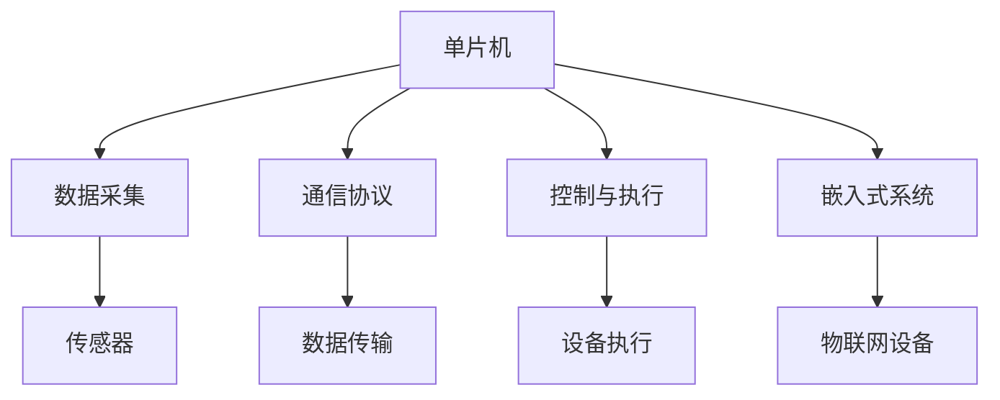

                 

# 单片机应用：物联网设备

> 关键词：物联网,单片机,嵌入式系统,传感器,通信协议

## 1. 背景介绍

### 1.1 问题由来
随着物联网(IoT)技术的快速发展，越来越多的设备被连接到互联网中，为人们的生活带来了极大的便利。从智能家居到工业自动化，从智慧医疗到智能交通，物联网的应用场景不断拓展，使得数据采集、传输和处理的需求日益增长。单片机作为一种性价比高、功能强大的嵌入式系统，在物联网设备中得到了广泛应用。

### 1.2 问题核心关键点
单片机在物联网设备中的应用，主要集中在以下几个方面：

- **数据采集与处理**：单片机作为传感器的控制器，负责采集环境、设备等数据，并进行初步处理。
- **通信协议**：单片机用于实现设备间的通信协议，如Wi-Fi、蓝牙、Zigbee等，确保数据在网络中安全、高效地传输。
- **控制与执行**：单片机控制设备的执行，如电机、灯光、传感器等，根据用户指令或预设条件进行动作。

### 1.3 问题研究意义
研究单片机在物联网设备中的应用，对于推动物联网技术的普及和应用，具有重要意义：

- **降低成本**：单片机具有成本低、体积小、可靠性高等优点，广泛应用于物联网设备中，降低了物联网系统的整体成本。
- **提升性能**：单片机能够高效处理数据，实时响应用户指令，提升设备的智能性和用户体验。
- **增强互联性**：单片机作为网络接口，确保设备间的数据互通，构建无缝互联的物联网生态系统。
- **支持创新**：单片机易于编程和集成，支持开发者快速实现新功能，推动物联网技术的不断创新。

## 2. 核心概念与联系

### 2.1 核心概念概述

为了更好地理解单片机在物联网设备中的应用，本节将介绍几个密切相关的核心概念：

- **单片机(Microcontroller Unit, MCU)**：一种集成在单片上的微处理器，包括CPU、RAM、Flash、外设接口等，广泛应用于嵌入式系统中。
- **嵌入式系统(Embedded System)**：指将软硬件集成的系统，通常用于控制特定任务。物联网设备中的传感器、控制器等均属于嵌入式系统的范畴。
- **物联网(IoT, Internet of Things)**：指通过互联网连接各种设备，实现设备间的数据共享和协同工作。
- **传感器(Sensor)**：用于检测环境、设备等参数的电子元件，通过单片机进行数据采集和处理。
- **通信协议(Communication Protocol)**：指设备间通信的标准规范，如Wi-Fi、蓝牙、Zigbee等，用于实现数据的安全传输。

这些核心概念之间的逻辑关系可以通过以下Mermaid流程图来展示：



这个流程图展示了一些关键概念的相互关系：

1. 单片机作为物联网设备的控制核心，负责数据采集、通信和执行。
2. 数据采集通过传感器进行，并将数据通过通信协议传输给单片机。
3. 单片机控制设备的执行，并与其他设备通过通信协议实现互联互通。
4. 物联网设备通过嵌入式系统实现各种功能，如智能家居、智慧医疗等。

## 3. 核心算法原理 & 具体操作步骤
### 3.1 算法原理概述

单片机在物联网设备中的应用，主要涉及以下几个核心算法原理：

- **数据采集与处理**：通过传感器获取环境、设备等数据，并在单片机中进行初步处理，如滤波、降噪、数据编码等。
- **通信协议**：实现设备间的数据传输，通常采用Wi-Fi、蓝牙、Zigbee等协议，通过单片机进行通信栈的搭建和数据包的处理。
- **控制与执行**：根据用户指令或预设条件，单片机控制设备的执行，如电机、灯光、传感器等。

### 3.2 算法步骤详解

单片机在物联网设备中的应用，通常包括以下几个关键步骤：

**Step 1: 数据采集与处理**

1. 连接传感器：将传感器连接到单片机的GPIO口或IIC、SPI等通信接口。
2. 读取传感器数据：通过传感器协议，读取环境、设备等数据。
3. 数据预处理：对采集到的数据进行滤波、降噪、编码等处理。

**Step 2: 通信协议实现**

1. 搭建通信栈：根据协议规范，搭建通信栈，包括初始化、握手、数据传输等。
2. 处理数据包：对接收到的数据包进行解析、校验等处理，确保数据传输的准确性。
3. 发送数据包：将单片机处理后的数据包发送到目标设备。

**Step 3: 控制与执行**

1. 接收用户指令：通过按钮、触摸屏等方式接收用户指令。
2. 解析指令：对用户指令进行解析，生成控制命令。
3. 控制设备：根据控制命令，控制电机、灯光、传感器等设备执行相应的动作。

### 3.3 算法优缺点

单片机在物联网设备中的应用，具有以下优点：

- **成本低廉**：单片机价格低廉，易于大规模生产，降低了物联网设备的总体成本。
- **功能丰富**：单片机集成了CPU、RAM、Flash、外设接口等功能，能够满足大多数物联网设备的需求。
- **实时性好**：单片机能够实时处理数据，快速响应用户指令，提升用户体验。

同时，单片机在物联网设备中的应用，也存在以下缺点：

- **处理能力有限**：单片机的计算能力相对有限，难以处理大规模数据和高复杂度任务。
- **扩展性差**：单片机的存储和内存有限，难以支持大规模数据存储和复杂算法实现。
- **安全性低**：单片机的安全机制较弱，容易受到恶意攻击，数据传输和设备执行可能存在风险。

### 3.4 算法应用领域

单片机在物联网设备中的应用，涵盖以下几个主要领域：

- **智能家居**：单片机用于控制灯光、电器、窗帘等设备，实现家居自动化。
- **智慧医疗**：单片机用于监测健康数据，控制医疗器械，实现健康监控和管理。
- **智能交通**：单片机用于控制交通信号灯、车辆传感器等设备，实现智能交通管理。
- **工业自动化**：单片机用于控制生产线、机械臂等设备，实现工业自动化生产。
- **环境监测**：单片机用于采集环境数据，监测空气质量、水质等，实现环境监测系统。

## 4. 数学模型和公式 & 详细讲解 & 举例说明

### 4.1 数学模型构建

在本节中，我们将使用数学语言对单片机在物联网设备中的应用进行更加严格的刻画。

假设单片机处理的数据为 $x \in [a,b]$，其预处理后的数据为 $y = f(x)$，其中 $f$ 为预处理函数。假设单片机控制执行的设备为 $g(y)$，其输出为 $z = g(y)$。

单片机的整个数据处理和控制流程可以表示为：

$$
z = g(f(x))
$$

### 4.2 公式推导过程

以下我们以智能家居场景为例，推导单片机数据采集、处理和控制的具体实现。

**数据采集**：假设传感器采集到的温度数据为 $x \in [0,100]$，单片机对其进行线性预处理，得到 $y = 0.1x + 20$。

**数据处理**：假设单片机根据温度数据，控制灯光亮度，控制函数为 $g(y) = \sqrt{y}$。则单片机处理后的灯光亮度为 $z = \sqrt{0.1x + 20}$。

### 4.3 案例分析与讲解

假设温度传感器采集到的数据为 $x = 75$，则单片机处理后的温度数据为 $y = 0.1 \times 75 + 20 = 29.5$，控制灯光亮度为 $z = \sqrt{29.5} = 5.43$。单片机将控制命令发送给灯光控制器，调整灯光亮度为5.43。

## 5. 项目实践：代码实例和详细解释说明

### 5.1 开发环境搭建

在进行单片机应用开发前，我们需要准备好开发环境。以下是使用Arduino IDE开发单片机应用的流程：

1. 安装Arduino IDE：从官网下载并安装Arduino IDE，用于开发和调试单片机应用程序。
2. 安装相应开发板驱动：根据单片机型号，从制造商官网下载对应的驱动，安装到计算机中。
3. 连接开发板与计算机：将单片机连接到计算机的USB接口，打开Arduino IDE，选择相应开发板。

完成上述步骤后，即可在Arduino IDE中开始开发单片机应用。

### 5.2 源代码详细实现

下面我们以智能温控器为例，给出使用Arduino开发单片机应用的Pytho代码实现。

```python
# Arduino代码实现

import arduino

arduino.connect('COM3')  # 连接开发板，这里以COM3为例
arduino.baudrate = 115200  # 设置串口通信速率

while True:
    # 读取温度传感器数据
    temperature = arduino.get_analog(0)
    temperature_scaled = 0.1 * temperature + 20  # 预处理温度数据
    
    # 控制灯光亮度
    arduino.digital_write(13, int(temperature_scaled))  # 控制灯光
    arduino.send("temperature: {}, light: {}\n".format(temperature_scaled, int(temperature_scaled)))  # 发送调试信息
```

### 5.3 代码解读与分析

让我们再详细解读一下关键代码的实现细节：

**温度传感器数据读取**：使用Arduino的`get_analog`方法读取模拟电压值，并将其转换为温度数据。

**数据预处理**：对温度数据进行线性预处理，得到处理后的温度数据。

**灯光控制**：使用Arduino的`digital_write`方法控制数字引脚的输出，实现灯光亮度的调节。

**调试信息输出**：使用Arduino的`send`方法，将调试信息输出到计算机的串口，便于开发者进行实时监控。

## 6. 实际应用场景

### 6.1 智能家居

单片机在智能家居中的应用，可以实现设备的自动化控制和智能监测，提升用户的居住体验。

在技术实现上，可以连接各种传感器，如温度传感器、湿度传感器、光线传感器等，通过单片机进行数据采集和处理。根据采集到的数据，单片机可以控制灯光、电器、窗帘等设备的开关和亮度，实现智能家居系统。

### 6.2 智慧医疗

单片机在智慧医疗中的应用，可以实现健康数据的监测和管理，辅助医生进行诊断和治疗。

具体而言，可以连接心率传感器、血压传感器、血糖传感器等，通过单片机进行数据采集和处理。将采集到的健康数据发送到云端服务器，实现远程监控和管理。同时，单片机可以根据预设条件，控制医疗器械的工作状态，辅助医生进行诊断和治疗。

### 6.3 智能交通

单片机在智能交通中的应用，可以实现交通信号灯的控制和管理，提升交通系统的运行效率。

具体而言，可以连接交通摄像头、红绿灯控制器等设备，通过单片机进行数据采集和处理。根据采集到的交通数据，单片机可以控制交通信号灯的开关和时长，实现交通信号灯的自动化控制。同时，单片机可以根据实时交通情况，调整信号灯的时序，优化交通流量。

### 6.4 未来应用展望

随着物联网技术的不断发展，单片机在各种场景中的应用将更加广泛。未来，单片机将应用于更多智能设备和系统中，为各行各业带来变革性影响。

在智慧城市治理中，单片机将应用于城市事件监测、智能照明、环境监测等领域，构建更智能、更高效的城市管理生态系统。在农业生产中，单片机将应用于智能灌溉、农情监测、温室控制等领域，提升农业生产的智能化水平。在工业制造中，单片机将应用于智能检测、质量控制、生产调度等领域，实现智能制造的升级转型。

## 7. 工具和资源推荐
### 7.1 学习资源推荐

为了帮助开发者系统掌握单片机在物联网设备中的应用，这里推荐一些优质的学习资源：

1. Arduino官方文档：Arduino官方提供的详细文档，包括硬件连接、代码实现、调试技巧等，是开发者不可或缺的参考资料。
2. Arduino项目实战教程：由Arduino社区成员撰写的实战教程，涵盖从入门到高级的各种项目，适合初学者和进阶开发者。
3. ARM架构与嵌入式开发书籍：详细讲解ARM架构和嵌入式开发的基本原理和实践技巧，适合深度学习单片机开发。
4. Embedded Systems Design 书籍：由嵌入式系统专家撰写，全面介绍嵌入式系统设计的基本概念和实践技巧，适合硬件和软件协同开发。
5. IoT传感器与数据采集教程：讲解如何连接和使用各种传感器，采集环境、设备等数据，适合开发物联网应用。

通过对这些资源的学习实践，相信你一定能够快速掌握单片机在物联网设备中的应用，并用于解决实际的物联网问题。

### 7.2 开发工具推荐

高效的开发离不开优秀的工具支持。以下是几款用于单片机开发应用的常用工具：

1. Arduino IDE：由Arduino公司开发的集成开发环境，支持多种单片机，提供丰富的开发资源和库函数。
2. PlatformIO：一款开源的跨平台嵌入式开发工具，支持多种编程语言和开发环境，适合跨平台开发。
3. ESP-IDF：由Espressif公司提供的物联网开发框架，支持ESP8266、ESP32等芯片，提供高效的开发工具链。
4. Keil μVision：由Keil公司提供的嵌入式开发工具，支持多种单片机，提供高效的代码调试和优化功能。

合理利用这些工具，可以显著提升单片机应用的开发效率，加快创新迭代的步伐。

### 7.3 相关论文推荐

单片机在物联网设备中的应用，涉及多个交叉学科，相关研究也在不断推进。以下是几篇奠基性的相关论文，推荐阅读：

1. "Low-Power Embedded Systems Design" 书籍：详细讲解嵌入式系统设计的低功耗设计技巧，适合单片机应用开发。
2. "Internet of Things: From Prototype to Deployment" 书籍：由IoT专家撰写，全面介绍物联网系统的设计、开发和部署过程，适合物联网应用开发。
3. "Real-Time Data Processing on Microcontrollers" 论文：讲解如何在单片机上实现实时数据处理，适合实时数据采集和处理应用。
4. "Enhancing Energy Efficiency in Embedded Systems" 论文：讲解如何提升嵌入式系统的能效，适合单片机应用开发。
5. "Designing Smart Home Systems Using Arduino" 论文：讲解如何使用Arduino开发智能家居系统，适合智能家居应用开发。

这些论文代表中单片机在物联网设备应用的研究进展，通过学习这些前沿成果，可以帮助研究者把握学科前进方向，激发更多的创新灵感。

## 8. 总结：未来发展趋势与挑战

### 8.1 总结

本文对单片机在物联网设备中的应用进行了全面系统的介绍。首先阐述了单片机和物联网设备的研究背景和意义，明确了单片机在数据采集、通信协议、控制与执行等方面的关键作用。其次，从原理到实践，详细讲解了单片机在物联网设备中的应用流程，给出了单片机应用的完整代码实例。同时，本文还探讨了单片机在智能家居、智慧医疗、智能交通等多个领域的应用前景，展示了单片机应用的广阔前景。

通过本文的系统梳理，可以看到，单片机在物联网设备中的应用，不仅成本低廉、功能强大，而且能够实现设备的自动化控制和智能监测，为各行各业带来了变革性影响。未来，伴随单片机技术的持续演进，单片机必将在更多领域大放异彩，为各行各业带来新的发展机遇。

### 8.2 未来发展趋势

展望未来，单片机在物联网设备中的应用将呈现以下几个发展趋势：

1. **更高效的数据处理**：随着硬件技术的不断进步，单片机的计算能力和内存将进一步提升，支持更复杂的数据处理和算法实现。
2. **更广泛的通信协议**：单片机将支持更多通信协议，如Wi-Fi、蓝牙、Zigbee、LoRa等，实现更广泛的设备互联。
3. **更高的安全性**：单片机将引入更多安全机制，如加密、认证、抗干扰等，确保数据传输和设备执行的安全性。
4. **更多的智能功能**：单片机将集成人工智能技术，如机器学习、自然语言处理等，提升设备的智能化水平。
5. **更广泛的硬件支持**：单片机将支持更多硬件平台，如ARM、RISC-V、MIPS等，适应更广泛的设备需求。

以上趋势凸显了单片机在物联网设备应用的广阔前景。这些方向的探索发展，必将进一步提升单片机应用的性能和应用范围，为物联网技术的发展注入新的动力。

### 8.3 面临的挑战

尽管单片机在物联网设备中的应用已经取得了显著进展，但在迈向更加智能化、普适化应用的过程中，仍面临诸多挑战：

1. **计算能力有限**：单片机的计算能力相对有限，难以处理大规模数据和高复杂度任务。
2. **扩展性差**：单片机的存储和内存有限，难以支持大规模数据存储和复杂算法实现。
3. **安全性低**：单片机的安全机制较弱，容易受到恶意攻击，数据传输和设备执行可能存在风险。
4. **开发复杂**：单片机应用开发涉及硬件、软件、通信等多个方面，开发难度较高，需要多方协同。
5. **标准化不足**：单片机应用的协议、接口、数据格式等尚未完全标准化，导致设备间的互操作性较差。

正视单片机应用面临的这些挑战，积极应对并寻求突破，将使单片机应用更上一层楼。

### 8.4 未来突破

面对单片机应用所面临的种种挑战，未来的研究需要在以下几个方面寻求新的突破：

1. **引入更多智能算法**：将机器学习、自然语言处理等智能算法引入单片机应用，提升设备智能水平。
2. **优化硬件平台**：开发更高效的硬件平台，如专用芯片、异构计算等，提升单片机的计算能力和能效。
3. **增强安全性**：引入更多安全机制，如加密、认证、抗干扰等，确保单片机应用的安全性。
4. **标准化协议**：制定和推广单片机应用的协议、接口、数据格式等标准化规范，提升设备间的互操作性。
5. **优化开发工具**：提供更高效的开发工具和平台，降低单片机应用的开发难度和复杂度。

这些研究方向的探索，必将引领单片机应用迈向更高的台阶，为物联网技术的发展注入新的动力。未来，伴随单片机技术的持续演进，单片机必将在更多领域大放异彩，为各行各业带来新的发展机遇。

## 9. 附录：常见问题与解答

**Q1：单片机在物联网设备中的应用，是否适用于所有场景？**

A: 单片机在物联网设备中的应用，主要适用于数据采集和处理需求较小、控制需求较高的场景，如智能家居、智慧医疗、智能交通等。对于数据处理和计算需求较高的场景，如大数据分析、高精度传感器应用等，可能需要更强大的硬件平台和算法支持。

**Q2：单片机在应用开发过程中，如何降低开发难度？**

A: 单片机应用开发涉及硬件、软件、通信等多个方面，开发难度较高。可以通过以下方法降低开发难度：
1. 使用集成开发环境：如Arduino IDE，提供丰富的开发资源和库函数，降低开发难度。
2. 使用现成的开发框架：如ESP-IDF、PlatformIO等，提供高效的开发工具链和开发指南，加速开发进程。
3. 引入第三方库和模块：使用开源库和模块，如Arduino库、Wi-Fi库、传感器库等，减少开发工作量。

**Q3：单片机在应用开发过程中，如何确保数据传输和设备执行的安全性？**

A: 单片机应用的安全性需要从多个方面进行保障：
1. 使用加密算法：对传输数据进行加密，确保数据在传输过程中的安全性。
2. 引入认证机制：使用认证机制，如数字证书、数字签名等，确保设备间的身份认证。
3. 抗干扰技术：引入抗干扰技术，如信号滤波、数字滤波等，提高设备抗干扰能力。
4. 安全协议：使用安全协议，如SSL/TLS、IPSec等，确保设备间的安全通信。

**Q4：单片机在应用开发过程中，如何确保设备的互操作性？**

A: 单片机应用的互操作性需要从协议、接口、数据格式等多个方面进行标准化：
1. 制定标准化协议：制定和推广单片机应用的通信协议，如Wi-Fi、蓝牙、Zigbee等，确保设备间的互联互通。
2. 定义标准化接口：定义和推广单片机应用的外设接口，如GPIO、IIC、SPI等，确保设备间的接口兼容。
3. 统一数据格式：定义和推广单片机应用的数据格式，如JSON、XML等，确保设备间的数据互操作性。

这些措施将有助于提升单片机应用的互操作性，推动物联网设备的广泛应用。

---

作者：禅与计算机程序设计艺术 / Zen and the Art of Computer Programming

