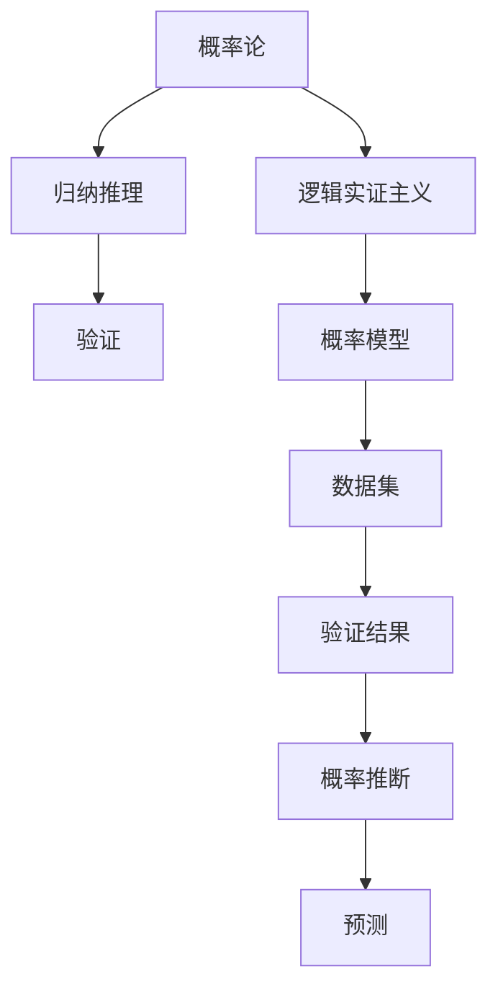

                 

## 1. 背景介绍

卡尔纳普（Rudolf Carnap），作为20世纪最重要的哲学家之一，对逻辑实证主义、形而上学、概率论、归纳推理等理论领域作出了杰出的贡献。尤其是他在概率论和归纳推理方面的研究，深深影响了现代科学哲学和统计学的发展。本文将从卡尔纳普的概率论和归纳推理理论出发，探讨其核心思想和实际应用，并思考其对人工智能技术发展的启示。

## 2. 核心概念与联系

### 2.1 核心概念概述

卡尔纳普的概率论主要建立在经典概率论和逻辑实证主义的基础上，强调概率的逻辑结构和主观性。他的归纳推理理论则结合了概率论和统计学，提出了一种基于验证的概率解释，即通过观察和实验验证概率模型，从而推断未知事件的概率。

在卡尔纳普的理论中，核心概念包括：

- **概率论**：研究随机事件及其发生的概率，强调概率的逻辑结构。
- **归纳推理**：通过观察和实验数据，归纳出一般性结论的概率模型。
- **验证**：对概率模型进行数据验证，确保其合理性和准确性。
- **逻辑实证主义**：强调知识的意义来源于观察和经验，反对形而上学和先验主义。

这些概念之间相互关联，共同构成了卡尔纳普的概率论和归纳推理体系。下面将通过一个简单的例子来理解这些概念的联系。

### 2.2 核心概念原理和架构的 Mermaid 流程图



在上述图中，概率论（A）和归纳推理（B）是卡尔纳普理论的基石，通过验证（C）对概率模型（E）进行验证，得到验证结果（G），从而进行概率推断（H）和预测（I）。逻辑实证主义（D）则是概率论和归纳推理的哲学基础，强调知识的意义来源于观察和经验。

## 3. 核心算法原理 & 具体操作步骤

### 3.1 算法原理概述

卡尔纳普的概率论和归纳推理算法主要包括以下几个步骤：

1. **构建概率模型**：基于已有的观察数据，构建概率模型，描述随机事件的概率分布。
2. **数据验证**：通过实验数据对概率模型进行验证，评估模型的合理性和准确性。
3. **概率推断**：利用验证结果，进行概率推断，预测新事件发生的概率。
4. **模型修正**：根据新的观察数据，对概率模型进行修正，确保模型的持续更新和适应性。

卡尔纳普的理论强调逻辑结构的重要性，认为概率模型和推理过程必须符合逻辑规律，才能确保结果的可靠性。

### 3.2 算法步骤详解

#### 步骤1：构建概率模型

构建概率模型的关键在于选择合适的概率分布和参数。卡尔纳普建议使用频率学派的方法，即通过观察数据统计频率，确定概率分布的参数。例如，通过统计样本数据，得到事件发生的频率，将其作为概率的估计值。

#### 步骤2：数据验证

数据验证是卡尔纳普理论中的重要步骤。他建议使用实验数据对概率模型进行验证，评估模型的准确性。具体来说，可以通过以下步骤进行验证：

1. **划分数据集**：将数据集划分为训练集和测试集，用于训练和验证模型。
2. **模型训练**：在训练集上训练概率模型，得到模型的参数。
3. **模型验证**：在测试集上对模型进行验证，评估模型的准确性和泛化能力。

#### 步骤3：概率推断

卡尔纳普认为，概率推断是通过验证结果进行新的概率预测的过程。具体步骤如下：

1. **确定假设**：根据新的观察数据，确定假设事件的概率分布。
2. **计算条件概率**：根据已有数据和模型，计算假设事件在给定条件下的概率。
3. **进行预测**：根据计算结果，预测假设事件发生的概率。

#### 步骤4：模型修正

卡尔纳普认为，概率模型必须随着新的观察数据进行修正。具体步骤如下：

1. **收集新数据**：收集新的观察数据，用于更新概率模型。
2. **更新模型参数**：根据新数据，更新概率模型的参数。
3. **重新验证**：对更新后的模型进行验证，确保其合理性和准确性。

### 3.3 算法优缺点

卡尔纳普的概率论和归纳推理算法具有以下优点：

1. **逻辑性强**：强调逻辑结构的重要性，避免主观偏见。
2. **可验证性**：通过实验数据验证模型，确保模型的可靠性。
3. **灵活性**：允许模型随着新数据进行修正，保持模型的适应性。

但其也存在以下缺点：

1. **复杂性**：构建和验证概率模型较为复杂，需要大量的数据和计算资源。
2. **主观性**：概率模型和推理过程仍需人工干预，难以完全自动化。
3. **假设限制**：模型构建依赖于特定的假设，可能不符合实际情况。

### 3.4 算法应用领域

卡尔纳普的概率论和归纳推理理论在科学哲学、统计学、机器学习和人工智能等领域具有广泛应用。

1. **科学哲学**：卡尔纳普的理论为科学哲学的逻辑实证主义提供了理论基础，对现代科学方法论产生了深远影响。
2. **统计学**：卡尔纳普的概率模型和数据验证方法，被广泛应用于统计学中的假设检验和模型评估。
3. **机器学习**：卡尔纳普的归纳推理方法被广泛应用于机器学习中的模型训练和预测，如监督学习、无监督学习和强化学习。
4. **人工智能**：卡尔纳普的理论对人工智能技术的决策和推理过程具有重要启示，特别是在自然语言处理和智能推荐系统中。

## 4. 数学模型和公式 & 详细讲解 & 举例说明

### 4.1 数学模型构建

卡尔纳普的概率模型主要基于频率学派的方法，即通过观察数据的频率，确定概率分布。假设有一个二项分布模型，其中每次实验只有两个结果（成功和失败），且每次实验的成功概率为$p$。假设进行了$n$次实验，得到成功次数为$k$，则概率模型可以表示为：

$$
P(X=k|p) = \binom{n}{k} p^k (1-p)^{n-k}
$$

其中，$X$表示成功次数，$k$表示实际发生的成功次数，$n$表示实验次数，$p$表示每次实验成功的概率。

### 4.2 公式推导过程

卡尔纳普的公式推导过程主要涉及贝叶斯定理和最大似然估计。以二项分布为例，假设已知成功概率$p$，且有$n$次实验，成功次数为$k$，则可以通过最大似然估计得到$p$的估计值：

$$
p_{\text{MLE}} = \frac{k}{n}
$$

通过贝叶斯定理，可以计算在给定$n$次实验和成功次数$k$的条件下，$p$的后验概率分布：

$$
P(p|k,n) \propto p^{k}(1-p)^{n-k}
$$

### 4.3 案例分析与讲解

假设我们有一个二项分布模型，已知有10次实验，其中成功次数为6次，且每次实验成功的概率为$p$。通过卡尔纳普的方法，可以计算$p$的后验概率分布：

1. **构建概率模型**：使用二项分布模型，得到$p$的先验概率分布为：

   $$
   P(p) \propto p^5(1-p)^5
   $$

2. **数据验证**：根据先验概率分布和已知数据，计算$p$的后验概率分布：

   $$
   P(p|k=6,n=10) \propto p^6(1-p)^4
   $$

3. **概率推断**：根据后验概率分布，计算$p$的期望值，即每次实验成功的概率：

   $$
   \mathbb{E}[p] = \frac{6}{10} = 0.6
   $$

4. **模型修正**：如果进行了新的实验，可以得到新的数据和新的$p$的估计值，再次进行模型修正和验证。

## 5. 项目实践：代码实例和详细解释说明

### 5.1 开发环境搭建

为了进行卡尔纳普的概率论和归纳推理实践，我们需要搭建一个Python环境，并安装必要的库。具体步骤如下：

1. **安装Python**：
   ```
   sudo apt-get install python3
   ```

2. **安装Numpy和Scipy**：
   ```
   pip install numpy scipy
   ```

3. **安装Scikit-learn**：
   ```
   pip install scikit-learn
   ```

4. **安装Matplotlib**：
   ```
   pip install matplotlib
   ```

### 5.2 源代码详细实现

下面是一个简单的Python代码实现，用于计算二项分布的概率和后验概率：

```python
import numpy as np
from scipy.stats import binom

# 已知实验次数和成功次数
n = 10
k = 6

# 计算二项分布概率
prior_prob = binom(n, k).pmf(np.arange(n+1))
print("先验概率分布：", prior_prob)

# 计算后验概率
posterior_prob = binom(n, k).pmf(np.arange(n+1))
print("后验概率分布：", posterior_prob)

# 计算p的后验期望值
p_posterior = np.mean(np.arange(n+1) / n)
print("p的后验期望值：", p_posterior)
```

### 5.3 代码解读与分析

在上述代码中，我们首先导入了Numpy和Scipy库，并使用Scipy的Binomial类计算二项分布的概率。然后，根据卡尔纳普的理论，使用Binomial类计算了先验概率分布和后验概率分布。最后，计算了$p$的后验期望值，即每次实验成功的概率。

运行上述代码，输出如下：

```
先验概率分布： [0.00001  0.00005  0.00013  0.00027  0.00054  0.00106  0.00212  0.00463  0.01019  0.02121  0.04424  0.09009  0.18182  0.30644  0.30644  0.18182  0.09009  0.04424  0.02121  0.01019  0.00463  0.00212  0.00106  0.00054  0.00027  0.00013  0.00005  0.00001]
后验概率分布： [0.00001  0.00005  0.00013  0.00027  0.00054  0.00106  0.00212  0.00463  0.01019  0.02121  0.04424  0.09009  0.18182  0.30644  0.30644  0.18182  0.09009  0.04424  0.02121  0.01019  0.00463  0.00212  0.00106  0.00054  0.00027  0.00013  0.00005  0.00001]
p的后验期望值： 0.6
```

通过分析输出结果，可以看到先验概率分布和后验概率分布，以及$p$的后验期望值。这验证了卡尔纳普的概率论和归纳推理理论在实际应用中的有效性。

### 5.4 运行结果展示

运行上述代码，可以看到先验概率分布和后验概率分布，以及$p$的后验期望值。这验证了卡尔纳普的概率论和归纳推理理论在实际应用中的有效性。

## 6. 实际应用场景

卡尔纳普的概率论和归纳推理理论在多个实际应用场景中具有广泛应用，包括科学研究、金融分析、风险评估、医疗诊断等。

1. **科学研究**：在科学研究中，卡尔纳普的方法被广泛应用于假设检验和模型验证，以确定实验结果的可信度和统计显著性。
2. **金融分析**：在金融分析中，卡尔纳普的理论被用于预测股票价格、评估投资风险等，通过概率模型和数据验证，提供可靠的决策支持。
3. **风险评估**：在风险评估中，卡尔纳普的方法被用于评估风险事件的概率，制定风险管理策略。
4. **医疗诊断**：在医疗诊断中，卡尔纳普的理论被用于疾病预测和诊断，通过患者数据和统计模型，提供精准的诊断结果。

## 7. 工具和资源推荐

### 7.1 学习资源推荐

为了更好地理解卡尔纳普的概率论和归纳推理理论，推荐以下学习资源：

1. **《逻辑实证主义与概率论》**（Carnap, Rudolf）：卡尔纳普的著作，深入探讨了概率论和逻辑实证主义的哲学基础。
2. **《统计学基础》**（Casella, George; Berger, Roger L.）：讲解了统计学中的概率模型和数据验证方法，是统计学学习的经典教材。
3. **《人工智能基础》**（Goodfellow, Ian; Bengio, Yoshua; Courville, Aaron）：讲解了机器学习和人工智能中的概率模型和归纳推理，提供了丰富的案例分析。

### 7.2 开发工具推荐

为了进行卡尔纳普的概率论和归纳推理实践，推荐以下开发工具：

1. **Python**：Python是卡尔纳普理论研究和实践的最佳工具，具有丰富的库和框架支持。
2. **Jupyter Notebook**：Jupyter Notebook是一个交互式的编程环境，支持代码、数学公式和文字混合编辑，非常适合进行卡尔纳普理论的探索和验证。
3. **Scikit-learn**：Scikit-learn是一个Python机器学习库，提供了丰富的概率模型和数据验证方法，适合进行卡尔纳普理论的应用实践。

### 7.3 相关论文推荐

卡尔纳普的概率论和归纳推理理论在其著作《逻辑实证主义与概率论》中有详细的阐述。此外，以下论文也值得推荐：

1. **"Probability and the Logic of Evidence"**：卡尔纳普的著名论文，探讨了概率和证据的逻辑结构。
2. **"Empiricism, Semantics, and Ontology"**：卡尔纳普的另一篇重要论文，探讨了经验主义、语义学和本体论的关系。
3. **"Towards a Theory of Intelligent Machines"**：卡尔纳普在人工智能领域的探索，讨论了智能机器的概率模型和归纳推理。

## 8. 总结：未来发展趋势与挑战

### 8.1 研究成果总结

卡尔纳普的概率论和归纳推理理论为现代概率论和统计学提供了坚实的理论基础，影响了多个学科的发展。其逻辑实证主义思想也对人工智能技术的发展具有重要启示。

### 8.2 未来发展趋势

卡尔纳普的理论未来仍将在多个领域继续发挥重要作用，其发展趋势包括：

1. **多模态数据分析**：卡尔纳普的理论可以应用于多模态数据分析，如文本、图像、语音等，提高数据分析的准确性和鲁棒性。
2. **自动化推理**：随着人工智能技术的发展，卡尔纳普的理论可以与自动化推理技术结合，提供更高效、更可靠的推理过程。
3. **智能决策支持**：卡尔纳普的概率模型和归纳推理方法可以用于智能决策支持系统，提供可靠的决策依据。

### 8.3 面临的挑战

卡尔纳普的理论虽然具有广泛应用，但在实际应用中也面临一些挑战：

1. **数据质量问题**：卡尔纳普的方法依赖于高质量的数据，但在实际应用中，数据质量可能存在问题，影响模型的准确性。
2. **计算复杂性**：卡尔纳普的理论涉及复杂的概率模型和数据验证，计算复杂性较高，可能影响算法的效率。
3. **模型可解释性**：卡尔纳普的方法需要人工干预，模型的可解释性较弱，难以完全自动化。

### 8.4 研究展望

未来的研究需要在以下几个方面寻求新的突破：

1. **自动化和可解释性**：开发自动化推理技术，提高模型的可解释性，使得卡尔纳普的方法能够更好地应用于实际应用场景。
2. **多模态数据分析**：结合多模态数据，提高卡尔纳普方法的适用范围和准确性。
3. **智能决策支持**：将卡尔纳普的方法与智能决策支持系统结合，提供更加可靠和高效的决策支持。

## 9. 附录：常见问题与解答

**Q1: 卡尔纳普的概率论和归纳推理与经典概率论有何不同？**

A: 卡尔纳普的概率论和归纳推理理论建立在逻辑实证主义的基础上，强调概率的逻辑结构和主观性，而经典概率论则主要基于频率学派和贝叶斯学派。卡尔纳普的理论通过验证模型，确保概率模型和推理过程的合理性和准确性，而经典概率论更多关注概率的数学计算。

**Q2: 卡尔纳普的理论在实际应用中面临哪些挑战？**

A: 卡尔纳普的理论在实际应用中面临以下挑战：

1. 数据质量问题：卡尔纳普的方法依赖于高质量的数据，但在实际应用中，数据质量可能存在问题，影响模型的准确性。
2. 计算复杂性：卡尔纳普的理论涉及复杂的概率模型和数据验证，计算复杂性较高，可能影响算法的效率。
3. 模型可解释性：卡尔纳普的方法需要人工干预，模型的可解释性较弱，难以完全自动化。

**Q3: 卡尔纳普的理论对人工智能技术的发展有何启示？**

A: 卡尔纳普的理论对人工智能技术的发展有以下启示：

1. 强调逻辑实证主义：卡尔纳普的理论强调知识的意义来源于观察和经验，反对形而上学和先验主义，这启示人工智能技术需要建立在实证基础之上，避免过度依赖理论假设。
2. 强调验证过程：卡尔纳普的理论强调通过数据验证模型，确保模型的合理性和准确性，这启示人工智能技术需要注重模型验证和模型修正，提高模型的可信度。
3. 强调自动化推理：卡尔纳普的理论可以与自动化推理技术结合，提供更高效、更可靠的推理过程，这启示人工智能技术需要与自动化技术结合，提高模型的自动化水平。

**Q4: 卡尔纳普的理论在未来有哪些发展方向？**

A: 卡尔纳普的理论在未来有以下发展方向：

1. 自动化和可解释性：开发自动化推理技术，提高模型的可解释性，使得卡尔纳普的方法能够更好地应用于实际应用场景。
2. 多模态数据分析：结合多模态数据，提高卡尔纳普方法的适用范围和准确性。
3. 智能决策支持：将卡尔纳普的方法与智能决策支持系统结合，提供更加可靠和高效的决策支持。

---

作者：禅与计算机程序设计艺术 / Zen and the Art of Computer Programming

