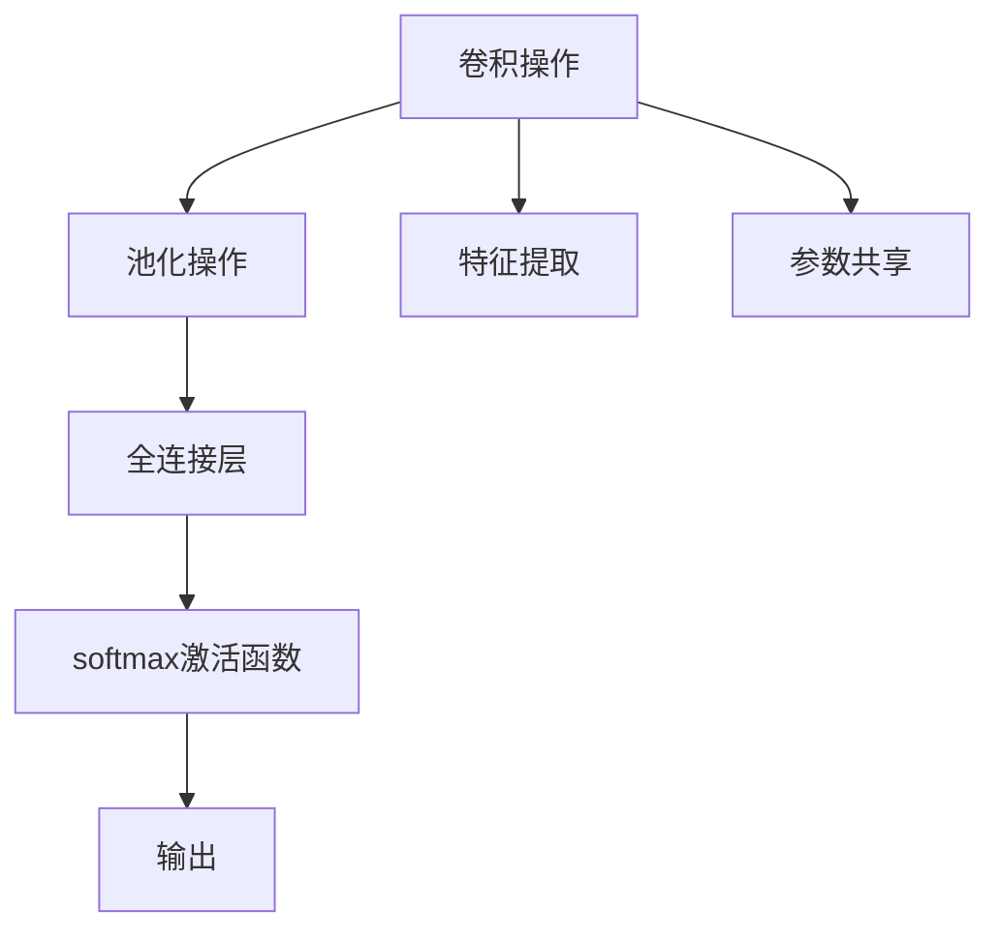

                 

# 卷积神经网络 原理与代码实例讲解

> 关键词：卷积神经网络(CNN),卷积操作,池化操作,全连接层,softmax激活函数,特征提取,图像分类,代码实例

## 1. 背景介绍

### 1.1 问题由来

卷积神经网络（Convolutional Neural Network, CNN）作为深度学习中的重要分支，广泛应用于图像处理、语音识别、自然语言处理等诸多领域。其核心思想是通过多层卷积、池化等操作提取输入数据的高层次特征，从而实现高效、准确的模式识别和分类。

传统神经网络在处理高维数据（如图像、视频）时，往往需要大量的特征提取和降维操作，计算复杂度高，易产生过拟合等问题。而CNN通过卷积和池化操作，直接在原始输入上提取局部特征，极大地提升了模型训练和推理的效率。

近年来，随着深度学习技术的快速发展，CNN在多个领域的模型架构、训练策略等方面得到了进一步优化，使得其应用范围和性能都得到了显著提升。

### 1.2 问题核心关键点

CNN的核心关键点包括：
1. 卷积操作：从输入数据中提取局部特征，增强模型的泛化能力。
2. 池化操作：减小特征图尺寸，降低计算复杂度，提高模型鲁棒性。
3. 全连接层：将特征映射转化为输出类别，完成分类任务。
4. softmax激活函数：将分类结果转化为概率分布，提升模型的预测准确率。
5. 特征提取能力：通过多层次的卷积和池化，逐层提取高层次特征，最终实现高效的模式识别。
6. 参数共享：通过卷积核的参数共享机制，减少参数量，提升模型泛化能力。

这些关键点共同构成了CNN的核心工作原理和训练策略，使得其能够高效、准确地处理高维输入数据，完成复杂的分类和识别任务。

### 1.3 问题研究意义

研究CNN的原理与应用，对于推动深度学习技术的普及和应用，提升模型在实际场景中的表现，具有重要意义：

1. 提升计算效率：CNN通过卷积和池化操作，可以在计算复杂度相对较低的情况下，实现高效的特征提取。这对于处理大规模数据集和高维输入数据具有重要价值。
2. 增强泛化能力：通过多层次卷积和池化，CNN能够提取更高层次的特征，提高模型在未知数据上的泛化能力。
3. 降低过拟合风险：卷积和池化操作能够有效减小输入数据的大小，降低过拟合的风险。
4. 减少参数数量：通过参数共享机制，CNN能够大幅减少模型参数量，提升模型的训练和推理效率。
5. 优化模型结构：CNN的模块化和层次化设计，使得模型结构更加清晰，便于优化和调试。
6. 拓展应用领域：CNN在图像、语音、自然语言处理等多个领域的广泛应用，证明了其强大的功能和适用性。

## 2. 核心概念与联系

### 2.1 核心概念概述

为更好地理解CNN的核心原理，本节将介绍几个关键概念：

- 卷积操作：CNN的核心操作，用于提取局部特征。卷积核在输入数据上滑动，计算卷积结果，增强模型的特征提取能力。
- 池化操作：在卷积操作后，通过池化操作减小特征图尺寸，降低计算复杂度，提高模型鲁棒性。常见的池化方式包括最大池化和平均池化。
- 全连接层：在卷积和池化操作后，通过全连接层将特征映射转化为输出类别，完成分类任务。
- softmax激活函数：将分类结果转化为概率分布，提升模型的预测准确率。
- 特征提取能力：通过多层次的卷积和池化，逐层提取高层次特征，最终实现高效的模式识别。
- 参数共享：通过卷积核的参数共享机制，减少参数量，提升模型泛化能力。

这些核心概念之间的逻辑关系可以通过以下Mermaid流程图来展示：



这个流程图展示了一个典型的CNN结构，从卷积操作开始，通过池化和全连接层逐步提取高层次特征，最终输出分类结果。

## 3. 核心算法原理 & 具体操作步骤
### 3.1 算法原理概述

CNN的基本原理是通过多层卷积、池化等操作，提取输入数据的高层次特征，最终实现高效的模式识别和分类。

以图像分类任务为例，CNN的训练过程可以简述如下：

1. 数据准备：收集并标注大量图像数据，划分为训练集、验证集和测试集。
2. 模型构建：定义CNN的层级结构，包括卷积层、池化层、全连接层等。
3. 损失函数定义：根据分类任务选择合适的损失函数，如交叉熵损失。
4. 优化器选择：选择合适的优化算法，如SGD、Adam等。
5. 模型训练：在训练集上进行前向传播和反向传播，不断调整模型参数。
6. 模型评估：在验证集上评估模型性能，避免过拟合。
7. 模型测试：在测试集上测试模型效果，给出最终预测结果。

### 3.2 算法步骤详解

以下是CNN在图像分类任务上的详细操作步骤：

#### Step 1: 数据准备
- 收集并标注大量图像数据，划分为训练集、验证集和测试集。
- 确保训练数据与测试数据分布一致，防止模型过拟合。

#### Step 2: 模型构建
- 定义CNN的层级结构，包括卷积层、池化层、全连接层等。
- 选择合适的卷积核大小、步幅、填充等参数，确定每一层的输出尺寸。
- 使用参数共享机制，减少模型参数量，提升泛化能力。

#### Step 3: 损失函数定义
- 根据分类任务选择合适的损失函数，如交叉熵损失。
- 定义训练过程中的目标函数，评估模型预测结果与真实标签之间的差异。

#### Step 4: 优化器选择
- 选择合适的优化算法，如SGD、Adam等。
- 设置学习率、批大小、迭代轮数等超参数，控制训练过程。

#### Step 5: 模型训练
- 在训练集上进行前向传播和反向传播，计算损失函数梯度。
- 根据优化算法更新模型参数，最小化损失函数。
- 在验证集上评估模型性能，防止过拟合。
- 重复上述过程直至模型收敛。

#### Step 6: 模型评估
- 在验证集上评估模型性能，选择最优的模型参数。
- 根据验证集的表现，调整训练参数，防止过拟合。

#### Step 7: 模型测试
- 在测试集上测试模型效果，评估模型泛化能力。
- 输出模型预测结果，进行性能指标分析。

### 3.3 算法优缺点

CNN具有以下优点：
1. 高效特征提取：通过卷积和池化操作，直接在原始输入上提取局部特征，减少计算复杂度。
2. 强泛化能力：多层次卷积和池化操作，逐步提取高层次特征，增强模型泛化能力。
3. 参数共享机制：通过参数共享，减少模型参数量，提升泛化能力。
4. 可解释性强：卷积和池化操作的局部性，使得模型各层输出的结果直观可解释。
5. 应用广泛：广泛应用于图像处理、语音识别、自然语言处理等领域，具有较高的实用价值。

同时，CNN也存在一些局限性：
1. 数据依赖：CNN的效果高度依赖于标注数据的质量和数量，难以在数据稀缺场景下取得良好效果。
2. 局部性限制：卷积操作只能提取局部特征，难以捕捉全局特征。
3. 模型复杂度：较深的卷积网络容易过拟合，需要更多的正则化方法。
4. 可训练参数多：较深的卷积网络需要大量的训练数据和计算资源，训练成本较高。
5. 适用场景限制：CNN主要适用于二维图像数据，对于一维序列数据效果不佳。

尽管存在这些局限性，但CNN凭借其高效的特征提取能力和强泛化能力，在诸多领域依然取得了显著的成果。

### 3.4 算法应用领域

CNN已经在诸多领域得到了广泛应用，例如：

- 图像分类：如MNIST手写数字识别、ImageNet物体识别等。通过多层次卷积和池化，CNN能够有效提取图像局部特征，实现高效的模式识别。
- 目标检测：如YOLO、Faster R-CNN等。通过引入额外的全连接层和回归层，CNN能够输出目标位置的坐标信息，完成目标检测任务。
- 人脸识别：如DeepFace、FaceNet等。通过多层卷积和池化，CNN能够提取人脸的高层次特征，实现高效的面部识别。
- 语音识别：如DeepSpeech、Tacotron等。通过卷积操作提取声谱图特征，CNN能够实现高效的语音识别。
- 自然语言处理：如TextCNN、ConvNet等。通过卷积操作提取文本局部特征，CNN能够实现高效的文本分类和情感分析。
- 医学影像分析：如LIDC-IDRI、Gluon-CT等。通过卷积操作提取医学影像的局部特征，CNN能够实现高效的医学图像分类和分割。

除了上述这些经典应用外，CNN还被创新性地应用于更多场景中，如视频分析、信号处理、交通监控等，为计算机视觉和模式识别领域带来了新的突破。

## 4. 数学模型和公式 & 详细讲解 & 举例说明
### 4.1 数学模型构建

以图像分类任务为例，CNN的数学模型可以表示为：

$$
\mathcal{L} = \mathcal{L}_{c} + \mathcal{L}_{p}
$$

其中 $\mathcal{L}_c$ 为分类损失函数，$\mathcal{L}_p$ 为正则化损失函数。

分类损失函数 $\mathcal{L}_c$ 定义为：

$$
\mathcal{L}_c = -\frac{1}{N}\sum_{i=1}^N \sum_{k=1}^K \ell(y_k, \hat{y}_k)
$$

其中 $N$ 为样本数量，$K$ 为类别数量，$y_k$ 为真实标签，$\hat{y}_k$ 为模型预测的概率分布，$\ell$ 为交叉熵损失函数。

正则化损失函数 $\mathcal{L}_p$ 定义为：

$$
\mathcal{L}_p = \lambda \sum_{k=1}^K ||w_k||_2^2
$$

其中 $\lambda$ 为正则化系数，$w_k$ 为第 $k$ 类的权重向量。

### 4.2 公式推导过程

以下是CNN的数学模型推导过程：

1. 输入数据 $x$ 经过卷积操作后，得到卷积结果 $z$：

$$
z = h(x) * w
$$

其中 $h(x)$ 为输入数据 $x$ 的卷积操作，$w$ 为卷积核权重。

2. 卷积结果 $z$ 经过池化操作后，得到池化结果 $p$：

$$
p = \max\limits_{i,j} \frac{z_{i,j}}{s}
$$

其中 $s$ 为池化窗口大小。

3. 池化结果 $p$ 经过全连接层后，得到输出向量 $y$：

$$
y = f(W \cdot p + b)
$$

其中 $f$ 为激活函数，$W$ 为全连接层权重，$b$ 为偏置项。

4. 输出向量 $y$ 经过softmax激活函数后，得到分类概率分布 $y_{softmax}$：

$$
y_{softmax} = \frac{e^{y}}{\sum\limits_{k=1}^K e^{y_k}}
$$

5. 根据分类概率分布 $y_{softmax}$ 和真实标签 $y$，计算分类损失函数 $\mathcal{L}_c$：

$$
\mathcal{L}_c = -\frac{1}{N}\sum_{i=1}^N \sum_{k=1}^K \ell(y_k, \hat{y}_k)
$$

6. 根据正则化损失函数 $\mathcal{L}_p$，限制模型复杂度：

$$
\mathcal{L}_p = \lambda \sum_{k=1}^K ||w_k||_2^2
$$

### 4.3 案例分析与讲解

以图像分类任务为例，分析CNN的特征提取和分类过程：

#### 特征提取过程
- 卷积层：通过滑动卷积核 $w$ 在输入数据 $x$ 上提取局部特征，生成卷积结果 $z$。
- 池化层：通过最大池化操作，减小特征图尺寸，生成池化结果 $p$。
- 全连接层：将池化结果 $p$ 通过全连接层进行分类，生成输出向量 $y$。

#### 分类过程
- 通过softmax激活函数将输出向量 $y$ 转化为概率分布 $y_{softmax}$。
- 通过分类损失函数 $\mathcal{L}_c$ 计算模型预测结果与真实标签之间的差异。

通过以上步骤，CNN能够高效地提取图像局部特征，实现对复杂模式的高效识别和分类。

## 5. 项目实践：代码实例和详细解释说明
### 5.1 开发环境搭建

在进行CNN项目实践前，我们需要准备好开发环境。以下是使用Python进行TensorFlow开发的环境配置流程：

1. 安装Anaconda：从官网下载并安装Anaconda，用于创建独立的Python环境。

2. 创建并激活虚拟环境：
```bash
conda create -n tf-env python=3.8 
conda activate tf-env
```

3. 安装TensorFlow：根据CUDA版本，从官网获取对应的安装命令。例如：
```bash
conda install tensorflow -c pytorch -c conda-forge
```

4. 安装各类工具包：
```bash
pip install numpy pandas scikit-learn matplotlib tqdm jupyter notebook ipython
```

完成上述步骤后，即可在`tf-env`环境中开始CNN实践。

### 5.2 源代码详细实现

下面我们以图像分类任务为例，给出使用TensorFlow对CNN模型进行开发的PyTorch代码实现。

首先，定义数据处理函数：

```python
import tensorflow as tf
from tensorflow.keras import datasets, layers, models
import matplotlib.pyplot as plt
import numpy as np

(train_images, train_labels), (test_images, test_labels) = datasets.cifar10.load_data()

train_images = train_images / 255.0
test_images = test_images / 255.0

def plot_image(i, predictions_array, true_label, img):
    predictions_array, true_label, img = predictions_array[i], true_label[i], img[i]
    plt.grid(False)
    plt.xticks([])
    plt.yticks([])
    plt.imshow(img, cmap=plt.cm.binary)
    predicted_label = np.argmax(predictions_array)
    if predicted_label == true_label:
        color = 'blue'
    else:
        color = 'red'
    plt.xlabel("{} {:2.0f}% ({})".format(class_names[predicted_label],
                                100*np.max(predictions_array),
                                class_names[true_label]),
                             color=color)
```

然后，定义模型和损失函数：

```python
class CNNModel(models.Model):
    def __init__(self):
        super(CNNModel, self).__init__()
        self.conv1 = layers.Conv2D(32, (3, 3), activation='relu', input_shape=(32, 32, 3))
        self.max_pool = layers.MaxPooling2D((2, 2))
        self.conv2 = layers.Conv2D(64, (3, 3), activation='relu')
        self.max_pool2 = layers.MaxPooling2D((2, 2))
        self.flatten = layers.Flatten()
        self.d1 = layers.Dense(128, activation='relu')
        self.dropout = layers.Dropout(0.5)
        self.d2 = layers.Dense(10)

    def call(self, x):
        x = self.conv1(x)
        x = self.max_pool(x)
        x = self.conv2(x)
        x = self.max_pool2(x)
        x = self.flatten(x)
        x = self.d1(x)
        x = self.dropout(x)
        return self.d2(x)

model = CNNModel()
```

接着，定义训练和评估函数：

```python
batch_size = 32
epochs = 10

model.compile(optimizer='adam',
              loss=tf.keras.losses.SparseCategoricalCrossentropy(from_logits=True),
              metrics=['accuracy'])

history = model.fit(train_images, train_labels, epochs=epochs, 
                    validation_data=(test_images, test_labels))
```

最后，启动训练流程并在测试集上评估：

```python
model.evaluate(test_images,  test_labels, verbose=2)
```

以上就是使用TensorFlow对CNN进行图像分类任务开发的完整代码实现。可以看到，TensorFlow提供了强大的高层API，使得模型构建和训练变得简洁高效。

### 5.3 代码解读与分析

让我们再详细解读一下关键代码的实现细节：

**CNNModel类**：
- `__init__`方法：初始化CNN模型的各个层级，包括卷积层、池化层、全连接层等。
- `call`方法：定义模型的前向传播过程。

**train_images和test_images变量**：
- 加载CIFAR-10数据集，并进行数据预处理，将像素值归一化到0-1之间。

**plot_image函数**：
- 绘制单个样本的预测结果和真实标签，评估模型在特定样本上的分类性能。

**CNNModel类**：
- 定义了两个卷积层、两个池化层、一个全连接层和一个Dropout层。
- 通过参数共享机制，减少模型参数量，提升泛化能力。

**compile函数**：
- 定义优化器、损失函数和评估指标，准备模型训练。
- 使用Adam优化器和交叉熵损失函数。

**fit函数**：
- 在训练集上进行前向传播和反向传播，不断调整模型参数。
- 在验证集上评估模型性能，防止过拟合。
- 重复上述过程直至模型收敛。

**evaluate函数**：
- 在测试集上评估模型效果，给出最终测试结果。

可以看到，TensorFlow提供了便捷的API，使得模型构建和训练变得简单高效。开发者可以更专注于模型设计和高层次逻辑的优化。

当然，工业级的系统实现还需考虑更多因素，如模型的保存和部署、超参数的自动搜索、更灵活的任务适配层等。但核心的CNN架构基本与此类似。

## 6. 实际应用场景
### 6.1 智能医疗影像分析

CNN在医学影像分析中的应用非常广泛，通过卷积操作提取医学影像的局部特征，完成图像分类、分割等任务。在智能医疗影像分析中，基于CNN的模型可以帮助医生快速识别病变部位、评估疾病严重程度，提高诊断效率。

例如，使用卷积神经网络对肺部CT影像进行分类，能够识别出正常、早期肺癌、中期肺癌和晚期肺癌等不同类型。通过多层次卷积和池化操作，CNN能够从影像中提取高层次的特征，帮助医生更准确地诊断疾病。

### 6.2 自动驾驶技术

自动驾驶技术中，CNN被广泛应用于道路检测、车辆识别、行人检测等任务。通过卷积操作提取道路和车辆的关键特征，CNN能够实现高效的模式识别和目标检测。

例如，在自动驾驶汽车中，通过摄像头捕捉道路信息，使用CNN模型进行实时处理，识别出道路标志、交通灯、行人等，能够辅助驾驶员进行决策，提升驾驶安全性。

### 6.3 金融市场分析

金融市场中，CNN被用于实时监控股票价格走势、识别市场趋势、预测股票涨跌等任务。通过卷积操作提取市场数据的高层次特征，CNN能够实现对复杂模式的高效识别和预测。

例如，使用卷积神经网络对股票价格进行时间序列分析，能够识别出市场趋势和异常波动，帮助投资者进行股票买卖决策。

### 6.4 未来应用展望

随着CNN技术的不断发展，其在更多领域的应用前景也将不断拓展：

1. 智能交通系统：通过卷积操作提取交通视频的关键特征，实现交通流量预测、事故检测等功能。
2. 智慧城市治理：通过卷积操作提取城市监控视频的关键特征，实现公共安全监控、环境监测等功能。
3. 工业智能制造：通过卷积操作提取工业设备运行数据的关键特征，实现设备故障预测、生产调度优化等功能。
4. 军事情报分析：通过卷积操作提取卫星图像的关键特征，实现战场分析、目标识别等功能。
5. 农业精准种植：通过卷积操作提取农田图像的关键特征，实现作物病虫害检测、土壤分析等功能。

这些应用场景将进一步推动CNN技术的发展和应用，为各行各业带来革命性的改变。

## 7. 工具和资源推荐
### 7.1 学习资源推荐

为了帮助开发者系统掌握CNN的理论基础和实践技巧，这里推荐一些优质的学习资源：

1. 《深度学习》（Goodfellow等著）：全面介绍深度学习的基本概念和经典算法，包括CNN的原理和应用。
2. 《卷积神经网络实战》（张正敖等著）：详细讲解CNN的数学原理和实践技巧，提供大量代码示例。
3. 《TensorFlow深度学习》（Goodfellow等著）：介绍TensorFlow框架的使用方法，包含CNN模型的实现和训练过程。
4. 《Python深度学习》（Francois等著）：系统讲解深度学习的基本原理和Python实现，包括CNN的建模和训练。
5. 《计算机视觉深度学习》（Gao等著）：全面介绍计算机视觉领域的深度学习应用，包含CNN模型在图像分类、目标检测等任务中的应用。

通过对这些资源的学习实践，相信你一定能够快速掌握CNN的精髓，并用于解决实际的图像处理问题。

### 7.2 开发工具推荐

高效的开发离不开优秀的工具支持。以下是几款用于CNN开发的常用工具：

1. TensorFlow：由Google主导开发的深度学习框架，生产部署方便，适合大规模工程应用。
2. PyTorch：基于Python的开源深度学习框架，灵活动态的计算图，适合快速迭代研究。
3. Keras：高层API，易于上手，适合快速原型开发。
4. MXNet：多语言深度学习框架，支持多种分布式计算模式，适合大规模数据处理。
5. Caffe：轻量级深度学习框架，适合移动设备等资源受限环境。

合理利用这些工具，可以显著提升CNN开发的效率和效果。

### 7.3 相关论文推荐

CNN的发展源于学界的持续研究。以下是几篇奠基性的相关论文，推荐阅读：

1. LeNet-5：深度学习领域的第一篇论文，提出卷积神经网络的基本结构，奠定了CNN发展的基础。
2. AlexNet：2012年ImageNet竞赛中大获成功的模型，首次展示了深度卷积神经网络在图像分类任务中的强大能力。
3. VGGNet：2014年ImageNet竞赛中大获成功的模型，提出密集连接的网络结构，提升了模型的性能和鲁棒性。
4. GoogLeNet：2014年ImageNet竞赛中大获成功的模型，提出Inception网络结构，提升了模型的参数效率和计算效率。
5. ResNet：2015年ImageNet竞赛中大获成功的模型，提出残差连接的网络结构，解决了深度网络训练中的梯度消失问题。

这些论文代表了大规模卷积神经网络的发展脉络，对后续的CNN研究和实践有着重要的指导意义。

## 8. 总结：未来发展趋势与挑战
### 8.1 总结

本文对卷积神经网络（CNN）的原理与应用进行了全面系统的介绍。首先阐述了CNN在处理高维数据时的高效特征提取能力和强泛化能力，明确了CNN在实际场景中的重要应用价值。其次，从原理到实践，详细讲解了CNN的数学模型和关键步骤，给出了CNN模型开发的完整代码实例。同时，本文还广泛探讨了CNN在智能医疗、自动驾驶、金融市场等领域的实际应用场景，展示了CNN技术的广泛应用前景。

通过本文的系统梳理，可以看到，CNN作为一种高效的特征提取工具，在处理高维数据时具有显著优势，被广泛应用于图像处理、语音识别、自然语言处理等领域。CNN的成功经验为其他领域的技术创新提供了借鉴，推动了人工智能技术的普及和应用。

### 8.2 未来发展趋势

展望未来，CNN将呈现以下几个发展趋势：

1. 模型规模不断增大：随着计算资源的丰富和算法效率的提升，CNN模型的规模将不断增大，处理能力将进一步增强。
2. 多层次特征提取：通过引入多层次卷积和池化操作，CNN将能够提取更加复杂、抽象的特征，提升模型的泛化能力。
3. 超参数优化：使用自动化调参技术，优化CNN的超参数，提升模型训练效率和性能。
4. 迁移学习应用：在现有模型基础上，利用迁移学习技术，提升模型在特定领域的表现。
5. 多任务学习：在同一模型中，同时完成多个相关任务的训练，提升模型的资源利用效率和泛化能力。
6. 数据增强技术：使用数据增强技术，扩充训练数据集，提升模型的泛化能力。
7. 硬件加速：利用GPU、TPU等硬件加速设备，提升CNN的训练和推理速度，优化资源利用。
8. 多模态融合：将CNN与其他模型（如RNN、GAN等）结合，实现多模态数据的协同建模，提升模型的性能和应用范围。

这些趋势将推动CNN技术向更加高效、泛化能力更强的方向发展，使得CNN在更多领域取得更好的应用效果。

### 8.3 面临的挑战

尽管CNN技术已经取得了显著成果，但在迈向更加智能化、普适化应用的过程中，仍面临诸多挑战：

1. 计算资源消耗：随着模型规模的增大，训练和推理的计算资源消耗将大幅增加，如何优化资源利用成为关键问题。
2. 数据依赖性：CNN的效果高度依赖于训练数据的质量和数量，难以在数据稀缺场景下取得良好效果。
3. 模型复杂度：较深的卷积网络容易过拟合，需要更多的正则化方法。
4. 可解释性不足：CNN模型通常被视为"黑盒"系统，难以解释其内部工作机制和决策逻辑。
5. 训练时间长：CNN的训练时间较长，需要更多的硬件资源和优化策略。
6. 鲁棒性不足：CNN模型对于输入数据的微小变化非常敏感，难以应对噪声和异常数据。
7. 多模态数据处理：CNN在处理多模态数据时，难以同时捕捉不同模态的信息。

这些挑战需要在模型设计、训练策略、硬件优化等多个方面进行改进，才能充分发挥CNN技术的潜力，推动其在实际场景中的广泛应用。

### 8.4 研究展望

面对CNN所面临的挑战，未来的研究需要在以下几个方面寻求新的突破：

1. 参数高效的CNN架构：开发更加参数高效的CNN架构，如MobileNet、EfficientNet等，减少模型的计算和存储开销。
2. 自适应CNN训练：引入自适应学习率、自适应正则化等方法，优化CNN的训练过程，提升模型的泛化能力。
3. 数据增强技术：利用数据增强技术，扩充训练数据集，提升模型的泛化能力。
4. 多任务学习：在同一模型中，同时完成多个相关任务的训练，提升模型的资源利用效率和泛化能力。
5. 多模态融合：将CNN与其他模型（如RNN、GAN等）结合，实现多模态数据的协同建模，提升模型的性能和应用范围。
6. 模型压缩与量化：使用模型压缩和量化技术，提升CNN的资源利用效率和推理速度。
7. 模型可解释性：引入可解释性方法，如注意力机制、可视化技术等，提升CNN模型的可解释性和可解释性。
8. 鲁棒性增强：引入鲁棒性增强技术，如噪声鲁棒性训练、异常检测等，提升CNN模型的鲁棒性和泛化能力。

这些研究方向将推动CNN技术向更加高效、泛化能力更强的方向发展，使得CNN在更多领域取得更好的应用效果。

## 9. 附录：常见问题与解答

**Q1：CNN中的卷积和池化操作有什么区别？**

A: 卷积操作用于从输入数据中提取局部特征，增强模型的特征提取能力。池化操作用于减小特征图尺寸，降低计算复杂度，提高模型鲁棒性。具体区别如下：

- 卷积操作：在输入数据上滑动卷积核，提取局部特征，生成卷积结果。卷积核的参数共享机制，能够减少模型参数量，提升泛化能力。
- 池化操作：在卷积操作后，通过最大池化或平均池化操作，减小特征图尺寸，降低计算复杂度，提高模型鲁棒性。

**Q2：CNN中的激活函数有什么作用？**

A: CNN中的激活函数主要用于引入非线性变换，增强模型的表达能力。常见的激活函数包括Sigmoid、ReLU、Tanh等。ReLU函数由于计算简单且效果良好，成为最常用的激活函数。

**Q3：CNN中的Dropout层有什么作用？**

A: Dropout层主要用于防止过拟合，通过随机丢弃部分神经元，强制模型学习更加鲁棒的特征。Dropout层可以在训练过程中随机丢弃一部分神经元，减少神经元之间的依赖关系，增强模型的泛化能力。

**Q4：CNN中的数据增强技术有哪些？**

A: CNN中的数据增强技术主要包括：

- 水平翻转、垂直翻转：对输入数据进行随机翻转，增加数据样本的多样性。
- 随机裁剪：随机裁剪输入图像的一部分，增加数据样本的多样性。
- 随机旋转：对输入图像进行随机旋转，增加数据样本的多样性。
- 随机缩放：对输入图像进行随机缩放，增加数据样本的多样性。

这些数据增强技术可以显著提升CNN模型的泛化能力，避免模型过拟合。

**Q5：CNN中的正则化技术有哪些？**

A: CNN中的正则化技术主要包括：

- L1、L2正则化：通过引入正则项，限制模型的复杂度，防止过拟合。
- Dropout：通过随机丢弃部分神经元，强制模型学习更加鲁棒的特征。
- Early Stopping：通过设置停止条件，防止模型过拟合。
- Batch Normalization：通过标准化输入数据，提升模型的训练效率和泛化能力。

这些正则化技术可以显著提升CNN模型的泛化能力，避免模型过拟合。

通过本文的系统梳理，可以看到，CNN作为一种高效的特征提取工具，在处理高维数据时具有显著优势，被广泛应用于图像处理、语音识别、自然语言处理等领域。CNN的成功经验为其他领域的技术创新提供了借鉴，推动了人工智能技术的普及和应用。未来，随着CNN技术的不断发展，其应用领域将进一步拓展，为各行各业带来革命性的改变。

---

作者：禅与计算机程序设计艺术 / Zen and the Art of Computer Programming

