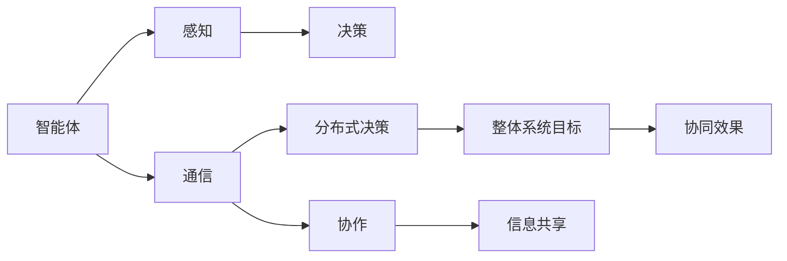

                 

## 1. 背景介绍

在数字化转型的浪潮下，企业越来越多地依赖于信息系统、网络基础设施、业务流程和人工智能等技术来提升效率和竞争力。然而，这些系统并非孤立运行，而是通过信息流、资源流和资金流等方式相互联系，形成一个复杂的大系统。在这种背景下，合作成为提升企业整体效能和竞争力的关键。

### 1.1 问题由来

多智能体系统（MAS）是近年来兴起的一个研究热点，它由一组智能体（Agent）组成，这些智能体在信息空间中相互交互，共同完成某项任务。这些智能体可以是自动化机器、软件代理、人类角色，甚至是无人驾驶汽车等。

然而，多智能体系统存在协作不足、信息不对称、资源竞争等挑战。当多个智能体同时决策时，如何确保决策的有效性和效率，成为系统设计的一大难点。此外，智能体之间的协同方式、沟通机制、利益分配机制等也是亟待解决的问题。

### 1.2 问题核心关键点

本节将具体介绍多智能体系统中存在的问题以及其对合作效果的影响。

#### 1.2.1 协作不足

协作不足指的是多个智能体之间缺乏有效沟通和协作，导致决策效率低下或出现冲突。例如，在生产流程中，如果两个自动化机器人同时对同一件产品进行加工，可能会出现重复劳动或相互干扰，导致生产效率降低。

#### 1.2.2 信息不对称

信息不对称指的是不同智能体之间掌握的信息存在差异，这可能导致决策偏差和误解。例如，在一个供应链管理系统中，供应商和制造商之间的信息不对称可能导致库存积压或订单延误。

#### 1.2.3 资源竞争

资源竞争指的是多个智能体同时竞争有限的资源，如计算资源、带宽、人力资源等，导致资源分配不公或浪费。例如，在一个云计算环境中，多个虚拟机同时使用同一条带宽，可能会出现网络拥堵或服务中断。

## 2. 核心概念与联系

### 2.1 核心概念概述

为了更好地理解多智能体协同的合作效果，本节将介绍几个关键概念：

#### 2.1.1 智能体

智能体是具有一定自主决策能力和信息处理能力的主体。它可以感知环境，做出决策，并与其他智能体进行交互。智能体可以是物理实体，如机器人、无人机等，也可以是软件实体，如自动化流程、网络节点等。

#### 2.1.2 多智能体系统

多智能体系统是由一组智能体组成的系统，这些智能体在信息空间中相互交互，共同完成某项任务。多智能体系统的目标是通过智能体之间的协同工作，提升整体系统的性能和效率。

#### 2.1.3 协作

协作是指多个智能体之间通过信息共享和协同工作，共同实现某个目标。协作是提升多智能体系统效率和效能的关键。

#### 2.1.4 通信

通信是多智能体系统中的重要机制，它使得智能体之间能够交换信息，协调决策。良好的通信机制是实现有效协作的基础。

#### 2.1.5 分布式决策

分布式决策是指多个智能体在不同节点上做出决策，共同完成某个任务。分布式决策可以提高系统的灵活性和可扩展性，但也带来了复杂的决策协调问题。

### 2.2 核心概念原理和架构的 Mermaid 流程图



该流程图展示了智能体之间的协作关系，包括感知、决策、通信、协作和分布式决策等核心机制。

## 3. 核心算法原理 & 具体操作步骤

### 3.1 算法原理概述

为了改进多智能体系统的合作效果，可以采用以下算法原理：

#### 3.1.1 协调算法

协调算法是指通过算法实现多个智能体之间的协同工作。常见的协调算法包括分布式优化算法、协同进化算法、拍卖机制等。

#### 3.1.2 共识算法

共识算法是指多个智能体在一定条件下达成共识，避免冲突和误判。常见的共识算法包括Paxos、Raft、Consensus+Failure Detection等。

#### 3.1.3 博弈论

博弈论是多智能体系统中的重要理论工具，用于分析和预测智能体之间的决策行为。常见的博弈论方法包括Nash均衡、纳什协调、贝叶斯博弈等。

### 3.2 算法步骤详解

#### 3.2.1 算法步骤概述

以下是基于协调算法和博弈论的多智能体系统合作改进的详细步骤：

1. 定义智能体的目标函数和约束条件。
2. 设计协调算法或共识算法，使智能体之间达成一致。
3. 使用博弈论方法，分析智能体之间的策略和行为。
4. 优化智能体的决策和协同方式，提升整体系统的合作效果。

#### 3.2.2 算法步骤详解

以下是具体的算法步骤：

1. **定义智能体的目标函数和约束条件**：

   智能体的目标函数和约束条件是其决策的基础。例如，在生产流程中，智能体的目标函数可能是最小化生产成本或最大化生产效率。约束条件可能包括机器可用性、生产率上限等。

2. **设计协调算法**：

   协调算法是实现智能体之间协作的关键。例如，在生产流程中，可以使用分布式优化算法，如粒子群优化算法（PSO），协调多个机器人的工作。

3. **使用博弈论方法**：

   博弈论方法可以用于预测和分析智能体之间的决策行为。例如，在供应链管理中，可以使用贝叶斯博弈，预测供应商和制造商之间的决策互动。

4. **优化智能体的决策和协同方式**：

   根据博弈论结果，优化智能体的决策和协同方式，提升整体系统的合作效果。例如，在供应链管理中，可以优化供应商和制造商的订单量和库存水平，减少库存积压。

### 3.3 算法优缺点

#### 3.3.1 算法优点

1. **协同效应**：协调算法和共识算法可以使多个智能体之间达成一致，提升系统的整体效能。
2. **高效决策**：博弈论方法可以预测和分析智能体之间的决策行为，优化决策过程。
3. **灵活性**：分布式决策可以提高系统的灵活性和可扩展性，满足不同场景的需求。

#### 3.3.2 算法缺点

1. **计算复杂度高**：协调算法和共识算法可能涉及复杂的计算，影响系统的实时性。
2. **不确定性高**：博弈论方法基于假设和模型，可能无法完全预测实际情况。
3. **模型复杂度**：多智能体系统的模型复杂度较高，需要综合考虑多种因素。

### 3.4 算法应用领域

#### 3.4.1 生产流程管理

在生产流程中，多个智能体（如机器人、自动化设备）需要协同工作，以提高生产效率和产品质量。协调算法和共识算法可以优化这些智能体的工作安排和资源分配。

#### 3.4.2 供应链管理

在供应链管理中，多个智能体（如供应商、制造商、分销商）需要协同工作，以减少库存积压和提高订单满足率。博弈论方法可以预测和分析这些智能体之间的决策行为，优化供应链管理。

#### 3.4.3 智慧城市

在智慧城市中，多个智能体（如智能交通系统、智能电网、智能安防系统）需要协同工作，以提高城市的运行效率和安全性。协调算法和共识算法可以优化这些智能体的工作安排和资源分配。

## 4. 数学模型和公式 & 详细讲解

### 4.1 数学模型构建

本节将使用数学语言对多智能体系统的合作效果进行更加严格的刻画。

记智能体集合为 $N = \{1, 2, ..., n\}$，智能体的状态集合为 $S = \{s_1, s_2, ..., s_n\}$，智能体的决策集合为 $A = \{a_1, a_2, ..., a_n\}$。智能体之间的通信关系用图 $G=(N, E)$ 表示，其中 $N$ 为节点集合，$E$ 为边集合。

智能体的目标函数为 $f_i(s, a_i) = R_i(s, a_i) + C_i(s, a_i)$，其中 $R_i(s, a_i)$ 为智能体 $i$ 的回报函数，$C_i(s, a_i)$ 为智能体 $i$ 的成本函数。智能体之间的通信机制可以表示为 $M = (s, a_i, s', a'_i)$，其中 $s$ 为当前状态，$a_i$ 为智能体 $i$ 的决策，$s'$ 为通信后的状态，$a'_i$ 为通信后的决策。

### 4.2 公式推导过程

以下我们以生产流程中的机器人协同为例，推导协调算法和共识算法的数学模型。

假设生产流程中有 $n$ 个机器人，每个机器人需要完成某项任务。每个机器人的目标函数为 $f_i(s, a_i) = R_i(s, a_i) + C_i(s, a_i)$，其中 $R_i(s, a_i)$ 为完成任务所获得的回报，$C_i(s, a_i)$ 为完成任务所需的成本。智能体之间的通信机制可以表示为 $M = (s, a_i, s', a'_i)$，其中 $s$ 为当前状态，$a_i$ 为智能体 $i$ 的决策，$s'$ 为通信后的状态，$a'_i$ 为通信后的决策。

假设机器人之间的通信机制为交换当前任务进度和剩余时间，则通信后的决策可以表示为 $a'_i = g(a_i, a_j)$，其中 $a_i$ 为当前决策，$a_j$ 为通信后其他智能体的决策。根据通信机制，智能体之间的状态转移可以表示为 $s' = h(s, a_i, a_j)$。

根据上述假设，可以建立生产流程中机器人的协调算法和共识算法的数学模型：

1. **协调算法**：
   协调算法的目标是最大化系统的总回报函数 $F(s, a_1, a_2, ..., a_n) = \sum_{i=1}^n R_i(s, a_i)$。例如，可以使用分布式优化算法，如粒子群优化算法（PSO），最大化系统的总回报函数。

2. **共识算法**：
   共识算法的目标是使所有智能体达成一致决策。例如，可以使用一致性算法，如Raft，保证所有智能体的决策一致。

### 4.3 案例分析与讲解

#### 4.3.1 机器人协同生产

假设在生产流程中有 5 个机器人，每个机器人需要完成某项任务。每个机器人的目标函数为 $f_i(s, a_i) = R_i(s, a_i) + C_i(s, a_i)$，其中 $R_i(s, a_i)$ 为完成任务所获得的回报，$C_i(s, a_i)$ 为完成任务所需的成本。智能体之间的通信机制为交换当前任务进度和剩余时间。

#### 4.3.2 供应链协同管理

假设在供应链管理中有 3 个智能体，分别为供应商、制造商、分销商。每个智能体的目标函数为 $f_i(s, a_i) = R_i(s, a_i) + C_i(s, a_i)$，其中 $R_i(s, a_i)$ 为完成订单所获得的回报，$C_i(s, a_i)$ 为完成订单所需的成本。智能体之间的通信机制为交换订单信息和库存信息。

#### 4.3.3 智慧城市协同治理

假设在智慧城市中有 4 个智能体，分别为智能交通系统、智能电网、智能安防系统。每个智能体的目标函数为 $f_i(s, a_i) = R_i(s, a_i) + C_i(s, a_i)$，其中 $R_i(s, a_i)$ 为提升城市运行效率所获得的回报，$C_i(s, a_i)$ 为提升城市运行效率所需的成本。智能体之间的通信机制为交换交通数据、电力数据和安全数据。

## 5. 项目实践：代码实例和详细解释说明

### 5.1 开发环境搭建

在进行多智能体系统合作改进的实践前，我们需要准备好开发环境。以下是使用Python进行MultiAgents包的开发环境配置流程：

1. 安装Anaconda：从官网下载并安装Anaconda，用于创建独立的Python环境。

2. 创建并激活虚拟环境：
```bash
conda create -n multi_agent_env python=3.8 
conda activate multi_agent_env
```

3. 安装MultiAgents库：
```bash
pip install multi-agents
```

4. 安装各类工具包：
```bash
pip install numpy pandas scikit-learn matplotlib tqdm jupyter notebook ipython
```

完成上述步骤后，即可在`multi_agent_env`环境中开始多智能体系统合作改进的实践。

### 5.2 源代码详细实现

这里我们以生产流程中的机器人协同为例，使用MultiAgents库实现基于粒子群优化算法（PSO）的协调算法。

首先，定义生产流程中的机器人模型：

```python
from multi_agents.agents import Agent
from multi_agents.belief import BeliefState

class Robot(Agent):
    def __init__(self, name, communication_graph):
        super().__init__(name)
        self.state = BeliefState(self.name, communication_graph)
        self.action_space = discrete_actions=[0, 1, 2, 3, 4]
        self.belief_state = BeliefState(self.name, communication_graph)

    def take_action(self, communication_data):
        # 根据通信数据更新信念状态
        self.belief_state.update(communication_data)
        # 根据信念状态选择决策
        return self.act()

    def act(self):
        # 根据当前任务进度和剩余时间选择决策
        if self.state.get_total_time() > 0:
            return 1
        else:
            return 0
```

然后，定义粒子群优化算法的优化函数：

```python
from multi_agents.algorithms.swarm import SwarmOptimization

class PSO:
    def __init__(self, agents, cost_fn, num_particles, max_iterations):
        self.agents = agents
        self.cost_fn = cost_fn
        self.num_particles = num_particles
        self.max_iterations = max_iterations

    def optimize(self):
        # 初始化粒子
        particles = [Agent(self.agents[0].get_name(), self.agents[0].communication_graph) for _ in range(self.num_particles)]
        # 迭代优化
        for _ in range(self.max_iterations):
            # 生成初始粒子位置
            particle = random.choice(particles)
            particle.belief_state.update(particle.get_state())
            particle.take_action(particle.get_state())
            # 计算粒子适应度
            fitness = self.cost_fn(particle.get_state())
            # 更新粒子位置和速度
            particle.update_velocity_and_position(particle, fitness)
            # 选择最优粒子
            best_particle = max(particles, key=lambda x: x.get_state().get_total_time())
            # 更新粒子群最优位置
            best_particle.update_global()
        return best_particle
```

接着，定义成本函数：

```python
def cost_function(state):
    # 计算所有机器人的总任务完成时间
    total_time = sum([robot.state.get_total_time() for robot in state.agents])
    return total_time
```

最后，启动优化过程：

```python
# 创建机器人集合
agents = [Robot("Robot1", communication_graph), Robot("Robot2", communication_graph), Robot("Robot3", communication_graph), Robot("Robot4", communication_graph), Robot("Robot5", communication_graph)]

# 创建粒子群优化对象
pso = PSO(agents, cost_function, num_particles=10, max_iterations=100)

# 运行优化
best_particle = pso.optimize()

# 输出最优结果
print(best_particle.get_state().get_total_time())
```

以上就是使用Python和MultiAgents库实现基于粒子群优化算法的生产流程机器人协同优化的完整代码实现。可以看到，使用MultiAgents库可以很方便地定义多智能体系统，并通过PSO算法优化这些智能体的协同效果。

### 5.3 代码解读与分析

让我们再详细解读一下关键代码的实现细节：

**Robot类**：
- `__init__`方法：初始化机器人的状态、动作空间和信念状态。
- `take_action`方法：根据通信数据更新信念状态，并根据信念状态选择决策。
- `act`方法：根据当前任务进度和剩余时间选择决策。

**PSO类**：
- `__init__`方法：初始化粒子群算法所需的参数，包括智能体集合、成本函数、粒子数和迭代次数。
- `optimize`方法：迭代优化粒子群，最终选择最优粒子并输出结果。

**cost_function函数**：
- 计算所有机器人的总任务完成时间，作为优化目标。

**最佳粒子更新**：
- 根据当前粒子群的最优位置，更新最优粒子。

**优化流程**：
- 创建机器人集合。
- 创建PSO对象。
- 运行PSO算法。
- 输出最优结果。

可以看到，使用MultiAgents库和多智能体优化算法，可以方便地实现多智能体的协同优化，提升系统的整体效能。

## 6. 实际应用场景

### 6.1 智能交通系统协同管理

在智能交通系统中，多个智能体（如交通信号灯、智能车辆、行人）需要协同工作，以提高交通流畅度和安全性。基于多智能体协同的优化算法，可以优化这些智能体的工作安排和资源分配，提升整体系统的运行效率。

### 6.2 医疗系统协同诊断

在医疗系统中，多个智能体（如医生、护士、医疗设备）需要协同工作，以提高诊断和治疗效率。基于多智能体协同的优化算法，可以优化这些智能体的工作安排和资源分配，提升整体系统的诊断和治疗效果。

### 6.3 金融系统协同监管

在金融系统中，多个智能体（如银行、证券公司、保险公司）需要协同工作，以提高风险管理和财务分析效率。基于多智能体协同的优化算法，可以优化这些智能体的工作安排和资源分配，提升整体系统的风险管理和财务分析效果。

## 7. 工具和资源推荐

### 7.1 学习资源推荐

为了帮助开发者系统掌握多智能体系统的合作改进理论基础和实践技巧，这里推荐一些优质的学习资源：

1. 《多智能体系统理论与应用》系列博文：由多智能体系统专家撰写，深入浅出地介绍了多智能体系统的基本概念、理论方法和应用场景。

2. CS131《人工智能与机器学习》课程：斯坦福大学开设的AI明星课程，涵盖多智能体系统、博弈论、强化学习等内容，适合初学者入门。

3. 《多智能体系统设计与实现》书籍：系统介绍了多智能体系统的设计与实现方法，包括协作、通信、分布式决策等内容。

4. Udacity《多智能体系统》课程：深入讲解多智能体系统的理论和实践，通过编程任务提升学习效果。

5. ArXiv上的相关论文：多智能体系统领域的最新研究成果，涵盖各种协同优化算法、共识机制和分布式决策方法。

通过对这些资源的学习实践，相信你一定能够快速掌握多智能体系统的合作改进的精髓，并用于解决实际的智能体协同问题。

### 7.2 开发工具推荐

高效的开发离不开优秀的工具支持。以下是几款用于多智能体系统合作改进开发的常用工具：

1. Python：简单易用的编程语言，支持多智能体系统的开发和优化算法实现。

2. MultiAgents：Python多智能体系统开发框架，提供丰富的组件和算法库，适合系统化开发。

3. Pachyderm：开源数据管理平台，支持分布式数据处理和协同优化算法，适合大规模数据和协同任务。

4. Jupyter Notebook：支持交互式编程和数据可视化，方便开发者进行实验和调试。

5. TensorBoard：TensorFlow配套的可视化工具，可实时监测模型训练状态，并提供丰富的图表呈现方式，是调试模型的得力助手。

6. Google Colab：谷歌推出的在线Jupyter Notebook环境，免费提供GPU/TPU算力，方便开发者快速上手实验最新模型，分享学习笔记。

合理利用这些工具，可以显著提升多智能体系统合作改进任务的开发效率，加快创新迭代的步伐。

### 7.3 相关论文推荐

多智能体系统合作改进的研究源于学界的持续研究。以下是几篇奠基性的相关论文，推荐阅读：

1. Swarm Intelligence（即粒子群优化算法）：由Eberhart和Kennedy提出，广泛应用于多智能体系统的协同优化。

2. Consensus Algorithms in Networks of Discrete Event Automata：探讨多智能体系统中的共识算法，如Raft、Paxos等。

3. Game Theory and Artificial Intelligence：讲述博弈论的基本原理和应用，广泛应用于多智能体系统中的决策分析。

4. Multi-Agent Systems：介绍多智能体系统的定义、结构和应用，涵盖协作、通信、分布式决策等内容。

5. Distributed Multi-Agent Systems for Smart Grids：研究多智能体系统在智能电网中的应用，涵盖协作、优化、安全等内容。

这些论文代表了大智能体系统合作改进的研究脉络。通过学习这些前沿成果，可以帮助研究者把握学科前进方向，激发更多的创新灵感。

## 8. 总结：未来发展趋势与挑战

### 8.1 研究成果总结

本文对多智能体系统的合作改进方法进行了全面系统的介绍。首先阐述了多智能体系统的研究背景和合作效果的重要性，明确了协同优化在提升系统效能和效率方面的独特价值。其次，从原理到实践，详细讲解了基于协调算法和博弈论的多智能体系统合作改进的数学原理和关键步骤，给出了多智能体系统合作改进的完整代码实例。同时，本文还广泛探讨了多智能体系统在智能交通、医疗、金融等多个领域的应用前景，展示了协同改进范式的广阔前景。

通过本文的系统梳理，可以看到，多智能体系统的协同优化技术正在成为智能系统设计的重要范式，极大地拓展了智能系统的应用边界，催生了更多的协同应用场景。受益于多智能体系统的不断发展，智能系统将能够更好地实现人机协同，提升整体系统的性能和效率。

### 8.2 未来发展趋势

展望未来，多智能体系统合作改进技术将呈现以下几个发展趋势：

1. 实时协同优化：随着物联网和5G等技术的发展，多智能体系统将具备更强的实时通信能力，实现更快速的协同优化。

2. 自适应协同：基于机器学习技术，多智能体系统将能够根据环境变化动态调整协同策略，提升系统的灵活性和自适应能力。

3. 多层次协同：多智能体系统将从单个智能体协同，向多层次、多领域的协同扩展，实现更复杂的协作任务。

4. 自动化协同：基于自动化决策技术，多智能体系统将能够实现更高效的协同工作，减少人工干预和操作成本。

5. 分布式计算：多智能体系统将采用分布式计算技术，提高系统的计算能力和并行处理能力，适应更大规模的协同任务。

6. 安全协同：基于区块链和加密技术，多智能体系统将实现更安全的协同，保障数据和系统的安全。

以上趋势凸显了多智能体系统合作改进技术的广阔前景。这些方向的探索发展，必将进一步提升智能系统的性能和效能，为社会带来深远的影响。

### 8.3 面临的挑战

尽管多智能体系统合作改进技术已经取得了瞩目成就，但在迈向更加智能化、普适化应用的过程中，它仍面临着诸多挑战：

1. 通信延迟：多智能体系统中的通信延迟可能会影响协同效果，尤其是在大规模系统中。如何优化通信机制，减少延迟，成为重要挑战。

2. 协作算法复杂度高：多智能体系统中的协作算法可能涉及复杂的计算，影响系统的实时性。如何设计高效的协作算法，降低计算复杂度，是关键问题。

3. 资源竞争：多智能体系统中的资源竞争可能会导致资源分配不公或浪费。如何公平分配资源，提高资源利用率，是重要挑战。

4. 模型复杂度高：多智能体系统的模型复杂度较高，需要综合考虑多种因素。如何简化模型，降低复杂度，提高系统可解释性，是重要课题。

5. 系统安全性：多智能体系统中的信息共享可能带来安全隐患，如数据泄露、系统攻击等。如何保障系统安全，是重要挑战。

6. 模型泛化性：多智能体系统中的模型泛化性不足，可能在特定场景下效果不佳。如何提高模型泛化性，扩展应用范围，是重要课题。

这些挑战凸显了多智能体系统合作改进技术的复杂性和多样性，需要不断探索和优化。只有通过技术创新和实践积累，才能克服这些挑战，实现多智能体系统的长期稳定发展。

### 8.4 研究展望

未来的研究需要在以下几个方面寻求新的突破：

1. 实时协同优化算法：探索更加高效的实时协同优化算法，适应大规模多智能体系统的需求。

2. 自适应协同机制：研究多智能体系统中的自适应协同机制，提高系统的灵活性和自适应能力。

3. 分布式协同技术：探索分布式协同技术，提高系统的计算能力和并行处理能力。

4. 安全协同协议：研究多智能体系统中的安全协同协议，保障数据和系统的安全。

5. 模型泛化性提升：提高多智能体系统的模型泛化性，扩展应用范围。

6. 自动化协同决策：探索多智能体系统中的自动化协同决策技术，减少人工干预和操作成本。

这些研究方向将引领多智能体系统合作改进技术迈向更高的台阶，为智能系统的协同应用带来新的突破。

## 9. 附录：常见问题与解答

**Q1：多智能体系统的协同效果如何影响系统效率？**

A: 多智能体系统的协同效果直接决定了系统的整体效率和效能。当多个智能体能够高效协同时，系统能够更好地利用资源，减少重复劳动，提升整体效率。例如，在生产流程中，多个机器人协同工作，可以大幅度提高生产效率，减少生产成本。

**Q2：多智能体系统中的通信机制有哪些？**

A: 多智能体系统中的通信机制包括直接通信、异步通信、广播通信等。直接通信是指智能体之间直接交换信息，异步通信是指智能体之间按照一定顺序依次交换信息，广播通信是指智能体之间同时交换信息。选择适合的通信机制，可以提高系统的通信效率和协作效果。

**Q3：多智能体系统的优化目标是什么？**

A: 多智能体系统的优化目标通常是最大化系统的整体回报函数，例如，在生产流程中，最大化所有机器人的任务完成时间；在供应链管理中，最大化所有智能体的订单满足率。优化目标的设定需要根据具体任务进行调整。

**Q4：多智能体系统的协作算法有哪些？**

A: 多智能体系统的协作算法包括分布式优化算法、协同进化算法、拍卖机制等。分布式优化算法如粒子群优化算法（PSO）、遗传算法等，可以优化多个智能体的协同工作。协同进化算法如NEAT算法，可以优化智能体的演化过程。拍卖机制如Vickrey拍卖，可以优化资源的分配和交易。

**Q5：多智能体系统中的分布式决策有哪些？**

A: 多智能体系统中的分布式决策包括基于投票的决策、基于协议的决策等。基于投票的决策是指智能体通过投票方式决定最终决策，例如，在供应链管理中，供应商和制造商通过投票决定订单分配。基于协议的决策是指智能体通过协议达成一致决策，例如，在智能交通系统中，智能车辆通过协议达成避让策略。

这些问题的解答可以帮助读者更好地理解多智能体系统的基本概念和协同机制，提升对系统优化和改进的认识。

