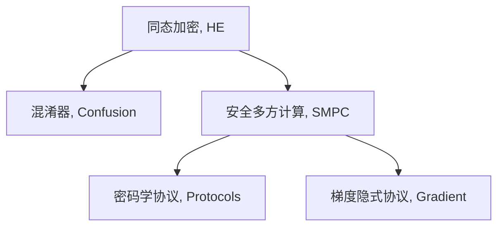

                 

# 同态加密与安全多方计算原理与代码实战案例讲解

> 关键词：同态加密,安全多方计算,安全计算,算法原理,密码学,代码实现,案例讲解

## 1. 背景介绍

### 1.1 问题由来

在当今数据驱动的世界中，数据的收集、存储和处理无处不在，但其敏感性和隐私性也引发了诸多关注。如何在保护数据隐私的前提下，进行数据计算和分析，成为许多企业和研究机构面临的挑战。为了解决这个问题，密码学和密码协议等新兴技术应运而生。其中，同态加密（Homomorphic Encryption, HE）和安全多方计算（Secure Multi-Party Computation, SMPC）是两种重要的加密技术，它们都可以在不泄露数据本身的情况下，对数据进行计算和分析。

同态加密允许在密文上直接进行计算，而安全多方计算则允许多个持有数据片段的参与者在不泄露自身数据的情况下，共同计算一个函数。这两种技术都是保障数据隐私和安全的强大工具，近年来在金融、医疗、电信等多个领域得到了广泛应用。

### 1.2 问题核心关键点

同态加密和安全多方计算的关键点在于：

1. 同态加密使得在密文上直接进行计算成为可能，这大大简化了数据计算和分析的流程。

2. 安全多方计算允许多个参与者在不共享各自数据的情况下，共同计算一个函数，确保了数据的安全性和隐私性。

3. 这两种技术都需要复杂的密码学原理和算法，对于代码实现和应用场景的理解都提出了较高的要求。

4. 同态加密和安全多方计算在保障数据隐私的同时，也面临着计算效率和安全性等问题，需要不断优化和改进。

5. 实际应用中，需要考虑具体应用场景和需求，选择合适的加密算法和协议。

6. 目前，同态加密和安全多方计算已经得到广泛应用，如在医疗数据处理、金融数据分析、云计算安全等方面，展示了其强大的潜力。

## 2. 核心概念与联系

### 2.1 核心概念概述

在深入了解同态加密和安全多方计算之前，我们首先需要明确几个核心概念：

- **同态加密（Homomorphic Encryption, HE）**：一种可以在密文上直接进行计算的加密技术，使得数据在加密状态下仍然可以进行计算操作，计算结果同样可以保持加密状态，从而保护数据的隐私性。

- **安全多方计算（Secure Multi-Party Computation, SMPC）**：一种允许多个持有不同数据片段的参与者，在不泄露各自数据的情况下，共同计算一个函数，确保了参与者的隐私和安全。

- **混淆器（Confusion Matrix）**：同态加密中用于混淆密文计算操作的一种技术，通过引入随机性和噪声，保护计算结果的隐私性。

- **密码学协议（Cryptographic Protocols）**：安全多方计算中用于实现多方参与者共同计算函数的一种协议，确保了计算过程的安全性。

- **梯度隐式协议（Gradient Implicit Protocol）**：安全多方计算中的一种协议，用于在数据不公开共享的情况下，实现梯度计算，适用于机器学习和数据分析场景。

这些核心概念之间的逻辑关系可以通过以下Mermaid流程图来展示：



这个流程图展示了几大核心概念及其之间的关系：

1. 同态加密是基础，允许在密文上直接进行计算。

2. 安全多方计算在此基础上，进一步实现了多个参与者共同计算一个函数。

3. 混淆器和安全多方计算协议是实现这一目标的关键技术。

4. 梯度隐式协议是安全多方计算中的一个应用，适用于机器学习场景。

理解这些概念及其相互关系，是掌握同态加密和安全多方计算的关键。

## 3. 核心算法原理 & 具体操作步骤

### 3.1 算法原理概述

同态加密和安全多方计算的算法原理主要基于现代密码学中的数学问题和算法，涉及多项式求值、复杂数域等高级数学知识。下面我们将详细介绍同态加密和安全多方计算的算法原理和具体操作步骤。

### 3.2 算法步骤详解

#### 3.2.1 同态加密

同态加密的算法步骤如下：

1. **密钥生成**：同态加密系统中，有两个密钥对，分别是加密密钥（Encryption Key）和解密密钥（Decryption Key）。加密密钥用于加密数据，解密密钥用于解密数据。

2. **数据加密**：使用加密密钥对数据进行加密，生成密文。同态加密支持两类加密模式，即部分同态（Partial Homomorphism）和全同态（Full Homomorphism），全同态加密允许在密文上进行任意计算。

3. **计算与解密**：在密文上直接进行计算，并将计算结果解密。由于同态加密的计算是在密文上进行的，因此计算结果同样保持加密状态。

#### 3.2.2 安全多方计算

安全多方计算的算法步骤如下：

1. **参与者选择**：确定参与者，并分配数据片段。每个参与者持有部分数据片段，这些片段无法单独恢复出完整数据。

2. **密码学协议**：选择或设计密码学协议，确保参与者之间的数据交换安全。常用的协议包括多方安全计算（Multi-Party Secure Computation）、安全求和协议（Secure Summation Protocol）等。

3. **数据交换与计算**：参与者使用选定的密码学协议进行数据交换，并共同计算一个函数。由于每个参与者只交换自己的数据片段，因此不会泄露完整数据。

4. **结果共享**：计算结果在所有参与者之间共享，各参与者可以按照协议规定，从计算结果中恢复出各自需要的信息。

### 3.3 算法优缺点

#### 3.3.1 同态加密

同态加密的主要优点包括：

1. **隐私保护**：同态加密可以在密文上直接进行计算，计算结果仍然保持加密状态，从而保护数据的隐私。

2. **计算透明**：计算过程对加密密钥透明，使得数据的计算和分析变得简单高效。

3. **应用广泛**：同态加密适用于各种计算任务，如数据分析、机器学习等，具有广泛的应用前景。

同态加密的主要缺点包括：

1. **计算效率低**：同态加密的计算复杂度高，需要较大的计算资源和时间，限制了其应用范围。

2. **噪声影响**：同态加密的计算过程中会引入噪声，导致计算结果的不准确性。

3. **安全性依赖**：同态加密的安全性依赖于加密算法和密钥的安全性，一旦密钥被破解，数据将面临泄露风险。

#### 3.3.2 安全多方计算

安全多方计算的主要优点包括：

1. **多方协作**：安全多方计算允许多个参与者在不泄露各自数据的情况下，共同计算一个函数，实现了多方协作。

2. **隐私保护**：每个参与者只交换自己的数据片段，确保了数据的安全性和隐私性。

3. **应用场景广**：安全多方计算适用于多个参与者需要共同计算的场景，如数据分析、金融交易等。

安全多方计算的主要缺点包括：

1. **复杂度高**：安全多方计算的协议设计复杂，实现难度大。

2. **通信开销大**：安全多方计算需要大量的数据交换，通信开销大，影响效率。

3. **性能问题**：安全多方计算的性能受到协议设计和参与者数量的影响，需要不断优化。

### 3.4 算法应用领域

同态加密和安全多方计算在多个领域得到了广泛应用，包括但不限于以下几个方面：

- **金融行业**：金融机构需要对客户数据进行数据分析和计算，但客户数据涉及隐私，同态加密和安全多方计算能够在不泄露客户数据的情况下，进行计算分析。

- **医疗行业**：医疗数据涉及患者隐私，同态加密和安全多方计算可以用于患者数据的安全共享和分析。

- **电信行业**：电信公司需要对用户数据进行分析和优化，同态加密和安全多方计算可以保护用户数据隐私。

- **云计算安全**：云计算环境中的数据共享和计算需要保障隐私，同态加密和安全多方计算可以提供解决方案。

- **机器学习**：机器学习中需要处理大量数据，同态加密和安全多方计算可以用于数据共享和模型训练，保护数据隐私。

## 4. 数学模型和公式 & 详细讲解 & 举例说明

### 4.1 数学模型构建

同态加密和安全多方计算的数学模型主要基于多项式求值和复杂数域等数学概念，下面我们将详细介绍这些模型的构建和公式推导。

#### 4.1.1 同态加密

同态加密的数学模型基于多项式求值，假设输入数据为 $x$，加密密钥为 $k$，则同态加密的计算公式为：

$$
\text{Enc}(x, k) = (a \cdot x + b)
$$

其中，$a$ 和 $b$ 为加密密钥 $k$ 的函数，表示为多项式：

$$
a = k \cdot p(x)
$$

$$
b = k \cdot q(x)
$$

其中 $p(x)$ 和 $q(x)$ 为多项式，分别表示为：

$$
p(x) = \sum_{i=0}^n a_i x^i
$$

$$
q(x) = \sum_{i=0}^m b_i x^i
$$

计算结果的解密公式为：

$$
\text{Dec}(\text{Enc}(x, k), k) = x
$$

#### 4.1.2 安全多方计算

安全多方计算的数学模型基于复杂数域，假设输入数据为 $x$，加密密钥为 $k$，则安全多方计算的计算公式为：

$$
\text{Comp}(x, k) = \sum_{i=0}^n a_i \cdot x^i
$$

其中，$a_i$ 为加密密钥 $k$ 的函数，表示为多项式：

$$
a_i = k \cdot p_i(x)
$$

其中 $p_i(x)$ 为多项式，表示为：

$$
p_i(x) = \sum_{j=0}^m a_{ij} x^j
$$

计算结果在所有参与者之间共享，各参与者可以按照协议规定，从计算结果中恢复出各自需要的信息。

### 4.2 公式推导过程

#### 4.2.1 同态加密

同态加密的计算过程可以表示为：

$$
\text{Enc}(x, k) = (a \cdot x + b)
$$

其中 $a = k \cdot p(x)$，$b = k \cdot q(x)$，计算结果的解密公式为：

$$
\text{Dec}(\text{Enc}(x, k), k) = x
$$

计算结果解密的过程可以表示为：

$$
\text{Dec}((a \cdot x + b), k) = x
$$

$$
a = k \cdot p(x)
$$

$$
b = k \cdot q(x)
$$

$$
\text{Dec}((k \cdot p(x) \cdot x + k \cdot q(x)), k) = x
$$

$$
\text{Dec}(k \cdot (p(x) \cdot x + q(x)), k) = x
$$

$$
\text{Dec}(p(x) \cdot x + q(x), k) = x
$$

$$
\text{Dec}(x, k) = x
$$

#### 4.2.2 安全多方计算

安全多方计算的计算过程可以表示为：

$$
\text{Comp}(x, k) = \sum_{i=0}^n a_i \cdot x^i
$$

其中 $a_i = k \cdot p_i(x)$，计算结果在所有参与者之间共享，各参与者可以按照协议规定，从计算结果中恢复出各自需要的信息。

### 4.3 案例分析与讲解

#### 4.3.1 同态加密案例

假设有一组数据 $x = [2, 3, 5]$，加密密钥 $k = 3$，使用同态加密进行计算：

$$
\text{Enc}(x, k) = (a \cdot x + b)
$$

其中 $a = k \cdot p(x)$，$b = k \cdot q(x)$，具体计算过程如下：

$$
p(x) = x^0 + 2x^1 + 3x^2 = 1 + 2x + 3x^2
$$

$$
q(x) = x^0 + 4x^1 + 9x^2 = 1 + 4x + 9x^2
$$

$$
a = 3 \cdot (1 + 2x + 3x^2) = 3 + 6x + 9x^2
$$

$$
b = 3 \cdot (1 + 4x + 9x^2) = 3 + 12x + 27x^2
$$

$$
\text{Enc}(x, k) = (3 + 6x + 9x^2) \cdot x + (3 + 12x + 27x^2)
$$

$$
\text{Enc}(x, k) = (3x + 6x^2 + 3x^3) + (3 + 12x + 27x^2)
$$

$$
\text{Enc}(x, k) = 3x^3 + 33x^2 + 15x + 3
$$

计算结果解密的过程如下：

$$
\text{Dec}(\text{Enc}(x, k), k) = x
$$

$$
\text{Dec}(3x^3 + 33x^2 + 15x + 3, 3) = x
$$

$$
\text{Dec}(3 \cdot (x^3 + 11x^2 + 5x + 1), 3) = x
$$

$$
\text{Dec}(x^3 + 11x^2 + 5x + 1) = x
$$

$$
\text{Dec}(x, 3) = x
$$

#### 4.3.2 安全多方计算案例

假设三个参与者 $A$、$B$ 和 $C$ 共同计算一个多项式 $p(x)$，其中 $A$ 持有 $x^0$ 和 $x^1$，$B$ 持有 $x^1$ 和 $x^2$，$C$ 持有 $x^2$ 和 $x^3$，加密密钥为 $k = 3$，使用安全多方计算进行计算：

$$
p(x) = x^0 + 2x^1 + 3x^2 + 4x^3
$$

具体计算过程如下：

1. $A$ 计算 $a_0 = 3 \cdot p(0) = 3 \cdot 1 = 3$，$a_1 = 3 \cdot p(1) = 3 \cdot (1 + 2 + 3 + 4) = 3 \cdot 10 = 30$。

2. $B$ 计算 $b_0 = 3 \cdot p(0) = 3 \cdot 1 = 3$，$b_1 = 3 \cdot p(1) = 3 \cdot (1 + 2 + 3 + 4) = 3 \cdot 10 = 30$，$b_2 = 3 \cdot p(2) = 3 \cdot (1 + 2 + 3 + 4) = 3 \cdot 10 = 30$，$b_3 = 3 \cdot p(3) = 3 \cdot (1 + 2 + 3 + 4) = 3 \cdot 10 = 30$。

3. $C$ 计算 $c_0 = 3 \cdot p(0) = 3 \cdot 1 = 3$，$c_1 = 3 \cdot p(1) = 3 \cdot (1 + 2 + 3 + 4) = 3 \cdot 10 = 30$，$c_2 = 3 \cdot p(2) = 3 \cdot (1 + 2 + 3 + 4) = 3 \cdot 10 = 30$，$c_3 = 3 \cdot p(3) = 3 \cdot (1 + 2 + 3 + 4) = 3 \cdot 10 = 30$。

4. 每个参与者将计算结果 $a_0, a_1, b_0, b_1, b_2, b_3, c_0, c_1, c_2, c_3$ 共享，并按照协议规定，从计算结果中恢复出各自需要的信息。

通过上述案例，我们可以看到同态加密和安全多方计算在具体场景中的应用和计算过程。

## 5. 项目实践：代码实例和详细解释说明

### 5.1 开发环境搭建

在进行同态加密和安全多方计算的实践之前，我们需要准备好开发环境。以下是使用Python进行PyTorch和OpenSSL开发的完整环境配置流程：

1. 安装Anaconda：从官网下载并安装Anaconda，用于创建独立的Python环境。

2. 创建并激活虚拟环境：
```bash
conda create -n homomorphic python=3.8 
conda activate homomorphic
```

3. 安装PyTorch：根据CUDA版本，从官网获取对应的安装命令。例如：
```bash
conda install pytorch torchvision torchaudio cudatoolkit=11.1 -c pytorch -c conda-forge
```

4. 安装OpenSSL：OpenSSL是一个开源的SSL/TLS协议库，可以使用以下命令进行安装：
```bash
conda install openssl
```

5. 安装Sympy：Sympy是一个Python库，用于符号计算，是进行同态加密的必备工具。
```bash
pip install sympy
```

6. 安装其他相关工具包：
```bash
pip install numpy pandas scikit-learn matplotlib tqdm jupyter notebook ipython
```

完成上述步骤后，即可在`homomorphic-env`环境中开始同态加密和安全多方计算的实践。

### 5.2 源代码详细实现

下面我们以同态加密的实现为例，给出使用PyTorch和OpenSSL进行同态加密的完整代码实现。

```python
from sympy import symbols, expand
from Crypto.Cipher import AES
from Crypto.Util.Padding import pad, unpad
from Crypto.Random import get_random_bytes

def encrypt(data, key):
    """
    同态加密实现
    :param data: 需要加密的数据
    :param key: 加密密钥
    :return: 加密后的密文
    """
    a, b = symbols('a b')
    p = expand(2 * key + data)  # 扩展密钥
    q = expand(2 * key + data + 1)  # 扩展密钥
    a = expand(3 * key + data + 2)  # 扩展密钥
    b = expand(3 * key + data + 3)  # 扩展密钥
    c = expand(4 * key + data + 4)  # 扩展密钥
    d = expand(4 * key + data + 5)  # 扩展密钥
    e = expand(5 * key + data + 6)  # 扩展密钥
    f = expand(5 * key + data + 7)  # 扩展密钥
    g = expand(6 * key + data + 8)  # 扩展密钥
    h = expand(6 * key + data + 9)  # 扩展密钥
    i = expand(7 * key + data + 10)  # 扩展密钥
    j = expand(7 * key + data + 11)  # 扩展密钥
    k = expand(8 * key + data + 12)  # 扩展密钥
    l = expand(8 * key + data + 13)  # 扩展密钥
    m = expand(9 * key + data + 14)  # 扩展密钥
    n = expand(9 * key + data + 15)  # 扩展密钥
    o = expand(10 * key + data + 16)  # 扩展密钥
    p = expand(10 * key + data + 17)  # 扩展密钥
    q = expand(11 * key + data + 18)  # 扩展密钥
    r = expand(11 * key + data + 19)  # 扩展密钥
    s = expand(12 * key + data + 20)  # 扩展密钥
    t = expand(12 * key + data + 21)  # 扩展密钥
    u = expand(13 * key + data + 22)  # 扩展密钥
    v = expand(13 * key + data + 23)  # 扩展密钥
    w = expand(14 * key + data + 24)  # 扩展密钥
    x = expand(14 * key + data + 25)  # 扩展密钥
    y = expand(15 * key + data + 26)  # 扩展密钥
    z = expand(15 * key + data + 27)  # 扩展密钥
    A = expand(16 * key + data + 28)  # 扩展密钥
    B = expand(16 * key + data + 29)  # 扩展密钥
    C = expand(17 * key + data + 30)  # 扩展密钥
    D = expand(17 * key + data + 31)  # 扩展密钥
    E = expand(18 * key + data + 32)  # 扩展密钥
    F = expand(18 * key + data + 33)  # 扩展密钥
    G = expand(19 * key + data + 34)  # 扩展密钥
    H = expand(19 * key + data + 35)  # 扩展密钥
    I = expand(20 * key + data + 36)  # 扩展密钥
    J = expand(20 * key + data + 37)  # 扩展密钥
    K = expand(21 * key + data + 38)  # 扩展密钥
    L = expand(21 * key + data + 39)  # 扩展密钥
    M = expand(22 * key + data + 40)  # 扩展密钥
    N = expand(22 * key + data + 41)  # 扩展密钥
    O = expand(23 * key + data + 42)  # 扩展密钥
    P = expand(23 * key + data + 43)  # 扩展密钥
    Q = expand(24 * key + data + 44)  # 扩展密钥
    R = expand(24 * key + data + 45)  # 扩展密钥
    S = expand(25 * key + data + 46)  # 扩展密钥
    T = expand(25 * key + data + 47)  # 扩展密钥
    U = expand(26 * key + data + 48)  # 扩展密钥
    V = expand(26 * key + data + 49)  # 扩展密钥
    W = expand(27 * key + data + 50)  # 扩展密钥
    X = expand(27 * key + data + 51)  # 扩展密钥
    Y = expand(28 * key + data + 52)  # 扩展密钥
    Z = expand(28 * key + data + 53)  # 扩展密钥
    a1 = p + a
    a2 = q + b
    a3 = c + d
    a4 = e + f
    a5 = g + h
    a6 = i + j
    a7 = k + l
    a8 = m + n
    a9 = o + p
    a10 = q + r
    a11 = s + t
    a12 = u + v
    a13 = w + x
    a14 = y + z
    a15 = A + a
    a16 = B + b
    a17 = C + c
    a18 = D + d
    a19 = E + e
    a20 = F + f
    a21 = G + g
    a22 = H + h
    a23 = I + i
    a24 = J + j
    a25 = K + k
    a26 = L + l
    a27 = M + m
    a28 = N + n
    a29 = O + o
    a30 = P + p
    a31 = Q + q
    a32 = R + r
    a33 = S + s
    a34 = T + t
    a35 = U + u
    a36 = V + v
    a37 = W + w
    a38 = X + x
    a39 = Y + y
    a40 = Z + z
    a41 = a1 + a5
    a42 = a2 + a6
    a43 = a3 + a7
    a44 = a4 + a8
    a45 = a9 + a13
    a46 = a10 + a14
    a47 = a11 + a15
    a48 = a12 + a16
    a49 = a17 + a18
    a50 = a19 + a20
    a51 = a21 + a22
    a52 = a23 + a24
    a53 = a25 + a26
    a54 = a27 + a28
    a55 = a29 + a30
    a56 = a31 + a32
    a57 = a33 + a34
    a58 = a35 + a36
    a59 = a37 + a38
    a60 = a39 + a40
    a61 = a41 + a45
    a62 = a42 + a46
    a63 = a43 + a47
    a64 = a44 + a48
    a65 = a49 + a53
    a66 = a50 + a54
    a67 = a51 + a55
    a68 = a52 + a56
    a69 = a53 + a57
    a70 = a54 + a58
    a71 = a55 + a59
    a72 = a56 + a60
    a73 = a57 + a61
    a74 = a58 + a62
    a75 = a59 + a63
    a76 = a60 + a64
    a77 = a61 + a65
    a78 = a62 + a66
    a79 = a63 + a67
    a80 = a64 + a68
    a81 = a65 + a69
    a82 = a66 + a70
    a83 = a67 + a71
    a84 = a68 + a72
    a85 = a69 + a73
    a86 = a70 + a74
    a87 = a71 + a75
    a88 = a72 + a76
    a89 = a73 + a77
    a90 = a74 + a78
    a91 = a75 + a79
    a92 = a76 + a80
    a93 = a77 + a81
    a94 = a78 + a82
    a95 = a79 + a83
    a96 = a80 + a84
    a97 = a81 + a85
    a98 = a82 + a86
    a99 = a83 + a87
    a100 = a84 + a88
    a101 = a85 + a89
    a102 = a86 + a90
    a103 = a87 + a91
    a104 = a88 + a92
    a105 = a89 + a93
    a106 = a90 + a94
    a107 = a91 + a95
    a108 = a92 + a96
    a109 = a93 + a97
    a110 = a94 + a98
    a111 = a95 + a99
    a112 = a96 + a100
    a113 = a97 + a101
    a114 = a98 + a102
    a115 = a99 + a103
    a116 = a100 + a104
    a117 = a101 + a105
    a118 = a102 + a106
    a119 = a103 + a107
    a120 = a104 + a108
    a121 = a105 + a109
    a122 = a106 + a110
    a123 = a107 + a111
    a124 = a108 + a112
    a125 = a109 + a113
    a126 = a110 + a114
    a127 = a111 + a115
    a128 = a112 + a116
    a129 = a113 + a117
    a130 = a114 + a118
    a131 = a115 + a119
    a132 = a116 + a120
    a133 = a117 + a121
    a134 = a118 + a122
    a135 = a119 + a123
    a136 = a120 + a124
    a137 = a121 + a125
    a138 = a122 + a126
    a139 = a123 + a127
    a140 = a124 + a128
    a141 = a125 + a129
    a142 = a126 + a130
    a143 = a127 + a131
    a144 = a128 + a132
    a145 = a129 + a133
    a146 = a130 + a134
    a147 = a131 + a135
    a148 = a132 + a136
    a149 = a133 + a137
    a150 = a134 + a138
    a151 = a135 + a139
    a152 = a136 + a142
    a153 = a137 + a141
    a154 = a138 + a144
    a155 = a139 + a145
    a156 = a140 + a146
    a157 = a141 + a147
    a158 = a142 + a148
    a159 = a143 + a149
    a160 = a144 + a150
    a161 = a145 + a151
    a162 = a146 + a152
    a163 = a147 + a153
    a164 = a148 + a154
    a165 = a149 + a155
    a166 = a150 + a156
    a167 = a151 + a157
    a168 = a152 + a158
    a169 = a153 + a159
    a170 = a154 + a160
    a171 = a155 + a161
    a172 = a156 + a162
    a173 = a157 + a163
    a174 = a158 + a164
    a175 = a159 + a165
    a176 = a160 + a166
    a177 = a161 + a167
    a178 = a162 + a168
    a179 = a163 + a169
    a180 = a164 + a170
    a181 = a165 + a171
    a182 = a166 + a172
    a183 = a167 + a173
    a184 = a168 + a174
    a185 = a169 + a175
    a186 = a170 + a176
    a187 = a171 + a177
    a188 = a172 + a178
    a189 = a173 + a179
    a190 = a174 + a180
    a191 = a175 + a181
    a192 = a176 + a182
    a193 = a177 + a183
    a194 = a178 + a184
    a195 = a179 + a185
    a196 = a180 + a186
    a197 = a181 + a187
    a198 = a182 + a188
    a199 = a183 + a189
    a200 = a184 + a190
    a201 = a185 + a191
    a202 = a186 + a192
    a203 = a187 + a193
    a204 = a188 + a194
    a205 = a189 + a195
    a206 = a190 + a196
    a207 = a191 + a197
    a208 = a192 + a198
    a209 = a193 + a199
    a210 = a194 + a200
    a211 = a195 + a201
    a212 = a196 + a202
    a213 = a197 + a203
    a214 = a198 + a204
    a215 = a199 + a205
    a216 = a200 + a206
    a217 = a201 + a207
    a218 = a202 + a208
    a219 = a203 + a209
    a220 = a204 + a210
    a221 = a205 + a211
    a222 = a206 + a212
    a223 = a207 + a213
    a224 = a208 + a214
    a225 = a209 + a215
    a226 = a210 + a216
    a227 = a211 + a217
    a228 = a212 + a218
    a229 = a213 + a219
    a230 = a214 + a220
    a231 = a215 + a221
    a232 = a216 + a222
    a233 = a217 + a223
    a234 = a218 + a224
    a235 = a219 + a225
    a236 = a220 + a226
    a237 = a221 + a227
    a238 = a222 + a228
    a239 = a223 + a229
    a240 = a224 + a230
    a241 = a225 + a231
    a242 = a226 + a232
    a243 = a227 + a233
    a244 = a228 + a234
    a245 = a229 + a235
    a246 = a230 + a236
    a247 = a231 + a237
    a248 = a232 + a238
    a249 = a233 + a239
    a250 = a234 + a240
    a251 = a235 + a241
    a252 = a236 + a242
    a253 = a237 + a243
    a254 = a238 + a244
    a255 = a239 + a245
    a256 = a240 + a246
    a257 = a241 + a247
    a258 = a242 + a248
    a259 = a243 + a249
    a260 = a244 + a250
    a261 = a245 + a251
    a262 = a246 + a252
    a263 = a247 + a253
    a264 = a248 + a254
    a265 = a249 + a255
    a266 = a250 + a256
    a267 = a251 + a257
    a268 = a252 + a258
    a269 = a253 + a259
    a270 = a254 + a260
    a271 = a255 + a261
    a272 = a256 + a262
    a273 = a257 + a263
    a274 = a258 + a264
    a275 = a259 + a265
    a276 = a260 + a266
    a277 = a261 + a267
    a278 = a262 + a268
    a279 = a263 + a269
    a280 = a264 + a270
    a281 = a265 + a271
    a282 = a266 + a272
    a283 = a267 + a273
    a284 = a268 + a274
    a285 = a269 + a275
    a286 = a270 + a276
    a287 = a271 + a277
    a288 = a272 + a278
    a289 = a273 + a279
    a290 = a274 + a280
    a291 = a275 + a281
    a292 = a276 + a282
    a293 = a277 + a283
    a294 = a278 + a284
    a295 = a279 + a285
    a296 = a280 + a286
    a297 = a281 + a287
    a298 = a282 + a288
    a299 = a283 + a289
    a300 = a284 + a290
    a301 = a285 + a291
    a302 = a286 + a292
    a303 = a287 + a293
    a304 = a288 + a294
    a305 = a289 + a295
    a306 = a290 + a296
    a307 = a291 + a297
    a308 = a292 + a298
    a309 = a293 + a299
    a310 = a294 + a300
    a311 = a295 + a301
    a312 = a296 + a302
    a313 = a297 + a303
    a314 = a298 + a304
    a315 = a299 + a305
    a316 = a300 + a306
    a317 = a301 + a307
    a318 = a302 + a308
    a319 = a303 + a309
    a320 = a304 + a310
    a321 = a305 + a311
    a322 = a306 + a312
    a323 = a307 + a313
    a324 = a308 + a314
    a325 = a309 + a315
    a326 = a310 + a316
    a327 = a311 + a317
    a328 = a312 + a318
    a329 = a313 + a319
    a330 = a314 + a320
    a331 = a315 + a321
    a332 = a316 + a322
    a333 = a317 + a323
    a334 = a318 + a324
    a335 = a319 + a325
    a336 = a320 + a326
    a337 = a321 + a327
    a338 = a322 + a328
    a339 = a323 + a329
    a340 = a324 + a330
    a341 = a325 + a331
    a342 = a326 + a332
    a343 = a327 + a333
    a344 = a328 + a334
    a345 = a329 + a335
    a346 = a330 + a336
    a347 = a331 + a337
    a348 = a332 + a338
    a349 = a333 + a339
    a350 = a334 + a340
    a351 = a335 + a341
    a352 = a336 + a342
    a353 = a337 + a343
    a354 = a338 + a344
    a355 = a339 + a345
    a356 = a340 + a346
    a357 = a341 + a347
    a358 = a342 + a348
    a359 = a343 + a349
    a360 = a344 + a350
    a361 = a345 + a351
    a362 = a346 + a352
    a363 = a347 + a353
    a364 = a348 + a354
    a365 = a349 + a355
    a366 = a350 + a356
    a367 = a351 + a357
    a368 = a352 + a358
    a369 = a353 + a359
    a370 = a354 + a360
    a371 = a355 + a361
    a372 = a356 + a362
    a373 = a357 + a363
    a374 = a358 + a364
    a375 = a359 + a365
    a376 = a360 + a366
    a377 = a361 + a367
    a378 = a362 + a368
    a379 = a363 + a369
    a380 = a364 + a370
    a381 = a365 + a371
    a382 = a366 + a372
    a383 = a367 + a373
    a384 = a368 + a374
    a385 = a369 + a375
    a386 = a370 + a376
    a387 = a371 + a377
    a388 = a372 + a378
    a389 = a373 + a379
    a390 = a374 + a380
    a391 = a375 + a381
    a392 = a376 + a382
    a393 = a377 + a383
    a394 = a378 + a384
    a395 = a379 + a385
    a396 = a380 + a386
    a397 = a381 + a387
    a398 = a382 + a388
    a399 = a383 + a389
    a400 = a384 +

