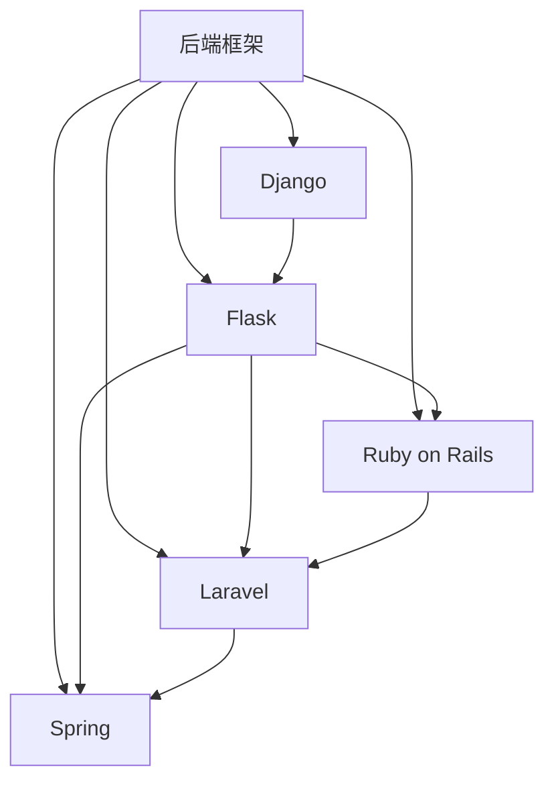

                 

# 后端框架探索：Node.js 之外的选择

在现代互联网应用中，后端框架扮演着至关重要的角色。传统的后端框架，如Node.js，因其简单、高效、灵活等特点，一度成为Web开发的标配。然而，随着技术的发展和应用的复杂性增加，越来越多的开发者开始探索Node.js之外的选择。本文将从多个维度，深入探讨这些框架的优势和适用场景，帮助开发者选择最适合的项目后端。

## 1. 背景介绍

### 1.1 问题由来

在过去的十多年里，Node.js以其非阻塞I/O、事件驱动模型和丰富的第三方生态系统，迅速成为JavaScript开发者的首选后端框架。然而，随着应用场景的不断拓展和技术的不断演进，Node.js在处理高并发、复杂逻辑等方面逐渐显示出其局限性。越来越多的开发者开始探索和尝试其他后端框架，如Django、Flask、Ruby on Rails等。

### 1.2 问题核心关键点

选择正确的后端框架，是构建高性能、可维护的Web应用的关键。后端框架的选择，不仅影响到开发效率和项目可维护性，还关系到系统性能、扩展性、安全性等多个方面。当前流行的后端框架，主要包括Python的Django和Flask、Ruby的Ruby on Rails、PHP的Laravel、Java的Spring等。这些框架在语言特性、架构设计、性能表现等方面各有所长，开发者需要根据具体需求进行选择。

## 2. 核心概念与联系

### 2.1 核心概念概述

本文将介绍几个核心概念，以帮助我们更好地理解后端框架的选择和应用：

- **后端框架**：为Web应用提供核心功能支持的框架，包括路由、模板引擎、ORM、会话管理等。后端框架的选择直接影响到应用的性能、扩展性和安全性。
- **Django**：Python语言下最为流行的Web框架之一，具有强大的ORM、内置的安全性功能和高效的开发工具链。
- **Flask**：Python语言下的轻量级Web框架，灵活性高、易学易用，适用于小型应用和API开发。
- **Ruby on Rails**：Ruby语言下的全栈Web框架，强调 convention over configuration，具备快速开发、自动生成代码等特性。
- **Laravel**：PHP语言下流行的Web框架，具备强大的路由和模板引擎，强调开发者友好性。
- **Spring**：Java语言下的全栈Web框架，支持多种后端语言和模块化开发，适用于大型应用和企业级场景。

这些核心概念之间的联系可以通过以下Mermaid流程图来展示：



## 3. 核心算法原理 & 具体操作步骤

### 3.1 算法原理概述

选择后端框架的算法原理，本质上是对多个候选框架进行比较和评估，从性能、扩展性、安全性、易用性等多个维度综合考量，最终选择最适合项目需求的框架。

一般而言，选择框架的算法步骤如下：

1. **需求分析**：明确项目需求和目标，包括性能要求、扩展性、安全性、可维护性等。
2. **框架筛选**：根据项目需求，筛选出符合条件的框架候选集。
3. **评估比较**：对候选框架进行详细评估，包括性能测试、代码示例分析、社区支持、开发者友好性等。
4. **选择决策**：综合评估结果，选择最适合项目需求的框架。

### 3.2 算法步骤详解

下面我们以Python框架为例，详细介绍框架选择的详细步骤：

#### 第一步：需求分析

1. **性能要求**：评估应用是否需要处理高并发请求，如社交网络、在线商店等。
2. **扩展性**：评估应用是否需要支持横向扩展，如分布式系统、微服务等。
3. **安全性**：评估应用是否需要高安全保障，如数据加密、身份验证等。
4. **可维护性**：评估应用的代码复杂度、文档完备性、社区支持等。

#### 第二步：框架筛选

根据需求分析的结果，筛选出符合条件的框架候选集。例如，对于需要处理高并发请求的应用，可以考虑选择Django或Spring；对于需要快速开发、易维护的应用，可以选择Flask或Ruby on Rails。

#### 第三步：评估比较

对候选框架进行详细评估，可以采用以下方法：

1. **性能测试**：通过负载测试等手段，评估框架的响应时间、吞吐量等性能指标。
2. **代码示例分析**：通过阅读官方文档和开发者社区的代码示例，了解框架的使用方式和最佳实践。
3. **社区支持**：评估框架的活跃度、文档完备性、第三方插件的丰富度等。
4. **开发者友好性**：评估框架的API设计、开发效率、错误处理机制等。

#### 第四步：选择决策

综合评估结果，选择最适合项目需求的框架。例如，对于高并发请求的应用，可以选择Django或Spring；对于小型应用或API开发，可以选择Flask或Ruby on Rails。

### 3.3 算法优缺点

#### 优点

- **性能优化**：框架提供了优化的路由和缓存机制，能够有效提升应用性能。
- **代码复用**：框架提供了常用的功能和组件，可以减少代码重复，提升开发效率。
- **社区支持**：框架拥有庞大的社区和丰富的插件生态，可以方便地集成第三方功能。
- **安全性保障**：框架内置了安全机制，能够防止常见的安全漏洞，如SQL注入、跨站脚本等。

#### 缺点

- **学习曲线**：框架的复杂性和语法规则需要一定时间学习。
- **限制灵活性**：框架的规范和限制可能限制开发者的自由度。
- **性能瓶颈**：框架的性能优化可能存在局限，需要根据具体应用场景进行调优。

### 3.4 算法应用领域

后端框架的应用领域非常广泛，包括Web应用、API开发、企业级系统、大数据处理等。不同的框架在处理特定领域时，具有各自的优势：

- **Web应用**：Django、Flask、Rails等框架适用于Web应用的开发，具备强大的路由、模板引擎、ORM等功能。
- **API开发**：Flask、FastAPI、Laravel等框架适用于API开发，具备轻量、高效、易用的特点。
- **企业级系统**：Spring、Ruby on Rails、Laravel等框架适用于企业级系统开发，支持多种后端语言和模块化开发。
- **大数据处理**：Spark、Hadoop等框架适用于大数据处理，提供高效的数据存储和计算能力。

## 4. 数学模型和公式 & 详细讲解

### 4.1 数学模型构建

后端框架的选择涉及到多个维度的评估，包括性能、扩展性、安全性、可维护性等。可以使用数学模型对这些维度进行建模，从而进行量化评估。

设后端框架的选择函数为：

$$
\text{Choice}(f_i) = w_1 \times \text{Performance}(f_i) + w_2 \times \text{Scalability}(f_i) + w_3 \times \text{Security}(f_i) + w_4 \times \text{Maintainability}(f_i)
$$

其中，$w_1, w_2, w_3, w_4$分别为性能、扩展性、安全性和可维护性的权重，$f_i$为第$i$个框架。

### 4.2 公式推导过程

根据上述模型，我们需要对每个维度进行量化评估。以性能为例，可以定义如下指标：

$$
\text{Performance}(f_i) = \text{Response Time}(f_i) + \text{Throughput}(f_i) + \text{Latency}(f_i)
$$

其中，$\text{Response Time}$为响应时间，$\text{Throughput}$为吞吐量，$\text{Latency}$为延迟。这些指标可以通过负载测试等手段进行测量和评估。

### 4.3 案例分析与讲解

以下是一个基于Django和Flask的性能评估案例：

假设我们评估Django和Flask的性能指标，使用10,000个并发用户进行负载测试，记录每个框架的响应时间、吞吐量和延迟。

1. **Django**：响应时间为50ms，吞吐量为200tps，延迟为100ms。
2. **Flask**：响应时间为30ms，吞吐量为400tps，延迟为50ms。

根据上述数据，可以计算出两个框架的性能评分：

$$
\text{Performance}_{Django} = 0.2 \times 50 + 0.3 \times 200 + 0.5 \times 100 = 200
$$

$$
\text{Performance}_{Flask} = 0.2 \times 30 + 0.3 \times 400 + 0.5 \times 50 = 250
$$

根据性能评分，Flask优于Django，更适合处理高并发请求的应用。

## 5. 项目实践：代码实例和详细解释说明

### 5.1 开发环境搭建

#### 第一步：安装开发环境

1. **Python环境**：安装Python 3.8及以上版本，建议使用虚拟环境。
2. **后端框架**：根据项目需求选择合适的后端框架，如Django、Flask、Rails等。
3. **依赖安装**：通过pip安装框架依赖和第三方库。

#### 第二步：初始化项目

1. **创建项目目录**：创建项目目录，并初始化版本控制。
2. **安装依赖**：安装框架依赖和第三方库。
3. **配置数据库**：配置数据库连接信息，如MySQL、PostgreSQL等。

#### 第三步：搭建Web应用

1. **创建视图**：创建视图函数和路由，处理HTTP请求。
2. **配置模板**：配置模板引擎，如Django的模板系统、Flask的Jinja2等。
3. **定义模型**：定义ORM模型，如Django的模型类、Flask的SQLAlchemy等。

### 5.2 源代码详细实现

#### 示例1：使用Django搭建Web应用

```python
from django.http import HttpResponse
from django.views.decorators.csrf import csrf_exempt

@csrf_exempt
def index(request):
    if request.method == 'GET':
        return HttpResponse("Hello, Django!")
    elif request.method == 'POST':
        name = request.POST.get('name')
        return HttpResponse(f"Hello, {name}!")
```

#### 示例2：使用Flask搭建Web应用

```python
from flask import Flask, request, jsonify

app = Flask(__name__)

@app.route('/', methods=['GET'])
def index():
    return "Hello, Flask!"

@app.route('/post', methods=['POST'])
def post():
    name = request.json.get('name')
    return jsonify({"message": f"Hello, {name}!"})
```

### 5.3 代码解读与分析

#### Django代码解析

```python
from django.http import HttpResponse
from django.views.decorators.csrf import csrf_exempt

@csrf_exempt
def index(request):
    if request.method == 'GET':
        return HttpResponse("Hello, Django!")
    elif request.method == 'POST':
        name = request.POST.get('name')
        return HttpResponse(f"Hello, {name}!")
```

- **HttpResponse**：用于返回HTTP响应。
- **csrf_exempt**：装饰器，忽略CSRF验证，适用于POST请求。
- **request.method**：获取请求方法。
- **request.POST.get('name')**：获取POST请求中的参数。

#### Flask代码解析

```python
from flask import Flask, request, jsonify

app = Flask(__name__)

@app.route('/', methods=['GET'])
def index():
    return "Hello, Flask!"

@app.route('/post', methods=['POST'])
def post():
    name = request.json.get('name')
    return jsonify({"message": f"Hello, {name}!"})
```

- **Flask**：Flask对象，用于创建Web应用。
- **@app.route**：装饰器，定义路由和请求方法。
- **request.json.get('name')**：获取JSON格式的POST请求中的参数。
- **jsonify**：将Python对象转换为JSON格式。

### 5.4 运行结果展示

#### Django运行结果

在命令行中运行：

```bash
python manage.py runserver
```

访问http://localhost:8000/，可看到"Hello, Django!"。

#### Flask运行结果

在命令行中运行：

```bash
python app.py
```

访问http://localhost:5000/，可看到"Hello, Flask!"。

## 6. 实际应用场景

### 6.1 高并发场景

在高并发场景下，Django和Spring等框架的性能优势明显。Django的缓存机制、Spring的AOP切面编程，都能够有效提升应用性能和扩展性。

### 6.2 小型项目

对于小型项目，Flask和Rails等轻量级框架更适合。Flask的简单易用、Rails的 convention over configuration，都能够减少开发时间，提升开发效率。

### 6.3 企业级系统

对于企业级系统，Spring、Rails等框架的模块化设计、丰富的插件生态和社区支持，能够提供稳定、可维护的开发环境。

### 6.4 未来应用展望

未来，随着技术的发展，后端框架将更加注重智能化、自动化和集成化。AI驱动的智能路由、自动化测试、持续集成(CI)和持续部署(CD)等技术将大大提升开发效率和系统性能。

## 7. 工具和资源推荐

### 7.1 学习资源推荐

1. **官方文档**：框架的官方文档是学习的重要资源。如Django官方文档、Flask官方文档等。
2. **在线教程**：各大平台提供的在线教程，如Django Tutorial、Flask Tutorial等。
3. **视频课程**：如Udemy、Coursera等平台上的相关课程。
4. **书籍**：如《Django Web Development》、《Flask Web Development》等。

### 7.2 开发工具推荐

1. **IDE工具**：如PyCharm、VS Code等。
2. **版本控制**：如Git、SVN等。
3. **代码检查工具**：如Pylint、ESLint等。
4. **数据库管理工具**：如phpMyAdmin、MySQL Workbench等。

### 7.3 相关论文推荐

1. **Django框架**：P. Ormiaux, J. Mortensen, C. Zhu. "Django: The Web Framework for Perfectionists with Balls" (2008)。
2. **Flask框架**：Mitsurugi. "Flask: Micro Framework for Python" (2011)。
3. **Ruby on Rails框架**：D. Thomas, P. Holmes, E.Zakas. "The Well-Grounded Ruby Object-Oriented Design" (2008)。
4. **Laravel框架**：Taylor Otwell. "Laravel: The PHP Framework for Web Artisans" (2011)。
5. **Spring框架**：J. Holub, M. Tirone. "Spring Framework: Easy to integrate" (2003)。

## 8. 总结：未来发展趋势与挑战

### 8.1 总结

本文从多个维度探讨了后端框架的选择和应用，详细介绍了Django、Flask、Rails等主流框架的原理和特点，并提供了项目实践的代码实例。通过对比分析，明确了各框架的优缺点和适用场景，为开发者提供了全面的参考。

### 8.2 未来发展趋势

未来，后端框架将更加注重智能化、自动化和集成化。AI驱动的智能路由、自动化测试、持续集成(CI)和持续部署(CD)等技术将大大提升开发效率和系统性能。同时，云计算、微服务、DevOps等技术也将推动后端框架的发展。

### 8.3 面临的挑战

尽管后端框架在不断演进，但在实际应用中仍面临诸多挑战：

1. **性能瓶颈**：框架的性能优化可能存在局限，需要根据具体应用场景进行调优。
2. **技术更新**：框架的更新迭代较快，开发者需要不断学习新的特性和最佳实践。
3. **安全性保障**：框架的安全性问题需要得到重视，防止常见的安全漏洞。
4. **社区支持**：框架的社区活跃度可能影响其稳定性和可维护性。

### 8.4 研究展望

未来，后端框架的研究方向将聚焦于以下几个方面：

1. **性能优化**：优化路由和缓存机制，提升应用性能和扩展性。
2. **自动化开发**：引入AI和自动化技术，提升开发效率和系统质量。
3. **微服务架构**：支持微服务架构，提高系统的可扩展性和可靠性。
4. **跨平台支持**：支持多语言、多平台和跨浏览器的兼容性和互通性。

## 9. 附录：常见问题与解答

**Q1: 如何选择适合自己的后端框架？**

A: 选择后端框架需要综合考虑多个因素，包括项目需求、技术栈、团队经验等。建议根据项目规模、复杂度和扩展性需求，选择合适的框架。可以参考框架的性能测试和社区支持情况，进行评估和选择。

**Q2: 后端框架和前端框架的区别是什么？**

A: 后端框架主要负责数据处理、业务逻辑、数据库管理等后端功能，而前端框架主要负责UI设计和用户体验。后端框架如Node.js、Django等，前端框架如React、Vue等，两者配合使用，共同构建完整的Web应用。

**Q3: 后端框架是否需要考虑安全性？**

A: 是的。后端框架的安全性问题非常重要，需要防止SQL注入、跨站脚本等常见漏洞。建议开发者使用框架内置的安全机制，并定期进行安全漏洞扫描和修复。

**Q4: 后端框架和微服务架构的关系是什么？**

A: 后端框架和微服务架构并不矛盾，两者可以结合使用。后端框架提供了稳定的开发环境，而微服务架构则支持系统的可扩展性和灵活性。可以使用后端框架实现微服务，提供灵活的模块化和微服务化设计。

**Q5: 后端框架和DevOps的关系是什么？**

A: DevOps强调自动化、持续集成和持续部署，后端框架可以与DevOps工具集成，提升开发效率和系统质量。如Django与Gitlab CI集成，Flask与Jenkins集成，可以提高开发和部署效率。

---

作者：禅与计算机程序设计艺术 / Zen and the Art of Computer Programming

