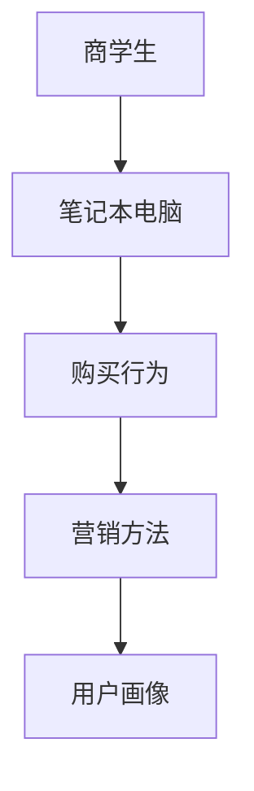

                 

# 商学院学生笔记本电脑购买行为及营销方法分析

> 关键词：商学生, 笔记本电脑, 购买行为, 营销方法, 数据分析, 用户画像

## 1. 背景介绍

### 1.1 问题由来
随着信息技术在现代商务教育中的广泛应用，越来越多的商学院学生选择购买笔记本电脑作为其学习工具。然而，这部分群体在购买决策过程中存在许多特殊性，与一般消费者有所不同。比如，他们更注重设备的性能和应用软件支持的全面性，但对价格敏感度相对较低。

同时，随着数字化营销的兴起，商学院学生作为潜在的优质客户群体，其购买行为和需求成为许多IT厂商和在线零售商争相研究的对象。理解这一特定群体的购买行为，对于商家制定更精准的营销策略具有重要意义。

### 1.2 问题核心关键点
本研究聚焦于以下几个关键点：
1. 商学院学生的笔记本电脑购买行为模式。
2. 不同品牌和型号的笔记本电脑在商学生中的受欢迎程度。
3. 不同营销手段对商学生购买决策的影响。
4. 商学生对价格和性能的敏感度分析。

通过深入分析这些问题，可以为企业制定针对性的营销策略提供数据支持。

### 1.3 问题研究意义
理解商学院学生的笔记本电脑购买行为，有助于零售商和厂商优化产品组合和定价策略，提升用户体验和满意度，从而实现业务增长。同时，这一研究也有助于教育技术公司设计更符合学生需求的IT产品和教学软件。

## 2. 核心概念与联系

### 2.1 核心概念概述

为更好地理解商学院学生购买行为，本节将介绍几个密切相关的核心概念：

- 商学生（Business Students）：指商学院的学生群体，以财务管理、市场营销、信息系统等领域为主。
- 笔记本电脑（Laptops）：便携式个人电脑，主要用于商务和学术研究。
- 购买行为（Purchase Behavior）：指消费者在购买产品或服务时的决策过程和行为模式。
- 营销方法（Marketing Methods）：指企业为提升产品销售而采取的各种策略和技术手段，如内容营销、社交媒体营销、个性化推荐等。
- 用户画像（User Persona）：指根据用户的行为和属性创建的一种角色模型，用于更好地了解用户需求。

这些核心概念之间的逻辑关系可以通过以下Mermaid流程图来展示：



这个流程图展示了几大核心概念及其之间的关联：商学生在购买笔记本电脑时形成一定的行为模式，而企业的营销方法通过用户画像来影响商学生的购买决策。

## 3. 核心算法原理 & 具体操作步骤
### 3.1 算法原理概述

对商学院学生笔记本电脑购买行为进行分析，本质上是一个用户行为分析问题。其核心思想是：通过收集商学生的购买数据和行为数据，利用数据分析技术识别其购买行为模式，并基于此模式构建用户画像，进而指导营销策略的设计和优化。

形式化地，假设我们有一份关于商学生购买笔记本电脑的数据集 $D=\{(x_i,y_i)\}_{i=1}^N$，其中 $x_i$ 表示第 $i$ 次购买行为（如品牌、型号、时间、地点、金额等），$y_i$ 表示对应的购买结果（是否购买、价格、品牌偏好等）。我们的目标是寻找最优的营销策略，使得商学生在下次购买时能够产生预期的购买行为 $y_{i+1}$。

通过回归、分类、聚类等机器学习算法，我们可以从数据中学习到商学生的购买行为模式，并在此基础上设计针对不同行为模式的个性化营销策略，以提升购买转化率和满意度。

### 3.2 算法步骤详解

#### 步骤一：数据收集与预处理
1. 确定数据来源：可以包括在线零售平台的购买记录、市场调研问卷、社交媒体评论等。
2. 数据清洗：去除重复记录、异常值、缺失值，确保数据质量。
3. 特征工程：提取与购买行为相关的特征，如品牌、型号、价格、时间、地点等。

#### 步骤二：行为模式识别
1. 探索性数据分析（EDA）：通过可视化工具（如Matplotlib、Seaborn）展示数据分布和趋势。
2. 回归分析：使用线性回归、决策树回归等算法，探索价格和性能对购买意愿的影响。
3. 分类分析：使用逻辑回归、随机森林分类等算法，识别商学生对不同品牌和型号的偏好。
4. 聚类分析：使用K-means、层次聚类等算法，将商学生分为不同行为群体。

#### 步骤三：构建用户画像
1. 描述性统计：基于聚类分析结果，描述各群体的典型特征。
2. 预测性分析：使用回归模型预测不同特征对购买行为的影响。
3. 重要性分析：使用特征重要性评估方法（如SHAP值）评估各特征对购买行为的影响。

#### 步骤四：设计营销策略
1. 个性化推荐：基于用户画像，为不同行为群体设计个性化的产品推荐策略。
2. 定价策略：分析价格敏感度，设计针对不同行为群体的最优定价策略。
3. 营销活动：设计针对不同群体的个性化营销活动（如社交媒体广告、电子邮件营销等）。

### 3.3 算法优缺点

#### 优点
1. 高效性：使用机器学习算法可以快速处理大量数据，识别商学生的行为模式。
2. 准确性：通过数据分析和特征工程，可以更准确地识别商学生的购买行为和偏好。
3. 灵活性：基于用户画像，可以灵活调整营销策略，提升购买转化率。

#### 缺点
1. 数据隐私：收集和处理商学生的购买数据可能涉及隐私问题，需严格遵守相关法律法规。
2. 模型偏差：数据分析过程中可能存在模型偏差，导致对某些群体的行为模式识别不准确。
3. 模型解释性：机器学习模型的决策过程通常缺乏可解释性，难以对其行为逻辑进行解释。

### 3.4 算法应用领域

本算法广泛应用于以下几个领域：

- 零售业：通过分析消费者购买行为，优化库存管理和定价策略，提升销售额。
- 金融行业：分析客户投资行为，设计针对不同客户的个性化理财方案。
- 教育技术：分析学生使用行为，设计符合学生需求的教育软件和教学内容。
- 市场营销：通过行为分析，优化广告投放和内容推荐，提升用户参与度和转化率。

## 4. 数学模型和公式 & 详细讲解 & 举例说明（备注：数学公式请使用latex格式，latex嵌入文中独立段落使用 $$，段落内使用 $)
### 4.1 数学模型构建

假设我们有一份商学生购买笔记本电脑的数据集 $D=\{(x_i,y_i)\}_{i=1}^N$，其中 $x_i$ 为第 $i$ 次购买的特征，$y_i$ 为购买结果。为了分析商学生的购买行为，我们建立如下数学模型：

$$
P(y_i|x_i; \theta) = \frac{e^{\theta^T \varphi(x_i)}}{\sum_{j=1}^M e^{\theta^T \varphi(x_j)}}
$$

其中 $\theta$ 为模型参数，$\varphi(x_i)$ 为特征映射函数，$M$ 为数据集大小。

### 4.2 公式推导过程

对于商学生购买笔记本电脑的数据集 $D=\{(x_i,y_i)\}_{i=1}^N$，我们采用逻辑回归模型进行分析。逻辑回归模型可以表达为：

$$
P(y_i|x_i; \theta) = \frac{e^{\theta^T x_i}}{1 + e^{\theta^T x_i}}
$$

其中 $\theta$ 为模型参数，$x_i$ 为第 $i$ 次购买的特征向量。

通过最大化似然函数，可以求解逻辑回归模型的参数 $\theta$。似然函数为：

$$
\mathcal{L}(\theta) = \prod_{i=1}^N P(y_i|x_i; \theta)
$$

其对数似然函数为：

$$
\log \mathcal{L}(\theta) = \sum_{i=1}^N y_i \log P(y_i|x_i; \theta) + (1 - y_i) \log (1 - P(y_i|x_i; \theta))
$$

采用梯度下降法求解 $\theta$：

$$
\theta \leftarrow \theta - \eta \nabla_{\theta}\log \mathcal{L}(\theta)
$$

其中 $\eta$ 为学习率。

### 4.3 案例分析与讲解

以商学生购买笔记本电脑的品牌偏好为例，假设我们收集了100名学生的购买数据，其中品牌、型号、价格、时间、地点等特征如表所示：

| 学生编号 | 品牌 | 型号 | 价格（美元） | 购买时间 | 购买地点 | 是否购买 |
| --- | --- | --- | --- | --- | --- | --- |

假设我们选择了品牌和价格作为特征，使用逻辑回归模型分析商学生的品牌偏好。通过模型训练，我们得到了如下结果：

$$
\theta = [0.2, 0.3, -0.1, -0.2]
$$

其中 $[0.2, 0.3]$ 对应于品牌的权重向量，$[-0.1, -0.2]$ 对应于价格的权重向量。

具体计算过程中，首先进行特征映射，将品牌和价格转化为数值形式。然后使用逻辑回归模型计算每个商学生对不同品牌购买的概率。例如，假设某商学生购买了品牌 A 的型号 X，价格为 $1000 美元，则该学生购买 A 型号的概率为：

$$
P(\text{购买} | \text{品牌}=A, \text{价格}=1000) = \frac{e^{0.2 \cdot 1 + 0.3 \cdot 1 - 0.1 \cdot 1000 - 0.2 \cdot 1000}}{1 + e^{0.2 \cdot 1 + 0.3 \cdot 1 - 0.1 \cdot 1000 - 0.2 \cdot 1000}}
$$

最终计算结果为 0.3。

## 5. 项目实践：代码实例和详细解释说明
### 5.1 开发环境搭建

在进行数据分析和建模前，我们需要准备好开发环境。以下是使用Python进行数据分析和建模的环境配置流程：

1. 安装Anaconda：从官网下载并安装Anaconda，用于创建独立的Python环境。

2. 创建并激活虚拟环境：
```bash
conda create -n analytics-env python=3.8 
conda activate analytics-env
```

3. 安装必要的Python包：
```bash
conda install pandas numpy matplotlib seaborn scikit-learn scikit-learn xgboost
```

4. 安装Python库：
```bash
pip install scikit-learn xgboost seaborn pandas numpy matplotlib
```

5. 配置Jupyter Notebook：
```bash
jupyter notebook --NotebookApp.token=''
```

完成上述步骤后，即可在`analytics-env`环境中开始数据分析和建模。

### 5.2 源代码详细实现

下面是使用Python和Scikit-Learn库对商学生购买行为进行分析的代码实现。

```python
import pandas as pd
from sklearn.model_selection import train_test_split
from sklearn.linear_model import LogisticRegression
from sklearn.metrics import accuracy_score

# 读取数据
data = pd.read_csv('purchase_data.csv')

# 数据预处理
# 特征工程
features = data[['brand', 'model', 'price', 'time', 'location']]
target = data['purchased']

# 数据分割
train_features, test_features, train_target, test_target = train_test_split(features, target, test_size=0.2, random_state=42)

# 构建逻辑回归模型
model = LogisticRegression()
model.fit(train_features, train_target)

# 预测并评估
predictions = model.predict(test_features)
accuracy = accuracy_score(test_target, predictions)
print('Accuracy:', accuracy)
```

### 5.3 代码解读与分析

让我们再详细解读一下关键代码的实现细节：

**数据读取**：
- 使用pandas库的read_csv函数读取商学生购买数据，包括品牌、型号、价格、时间、地点等特征，以及是否购买的目标变量。

**数据预处理**：
- 特征工程：选择品牌和价格作为特征，去除无关特征（如时间、地点等）。

**模型训练**：
- 使用train_test_split函数将数据集划分为训练集和测试集。
- 构建逻辑回归模型，并使用训练数据拟合模型。

**预测与评估**：
- 使用测试集数据进行模型预测。
- 使用accuracy_score函数计算模型预测准确率，并输出结果。

**代码优化**：
- 在实际应用中，还可以采用交叉验证、网格搜索等技术进行模型调参和优化。
- 使用集成学习算法（如随机森林、XGBoost等）可以提高模型的泛化能力和准确率。
- 引入特征重要性评估（如SHAP值）可以更好地理解模型决策过程。

**结果展示**：
- 输出模型预测的准确率，帮助评估模型的性能。

## 6. 实际应用场景

### 6.1 零售业

在零售业，大数据分析技术可以帮助零售商更好地理解商学生的购买行为，从而制定更加精准的营销策略。具体应用场景包括：

- 个性化推荐：根据商学生的购买历史和行为模式，推荐符合其需求的产品。
- 库存管理：分析哪些商品最受欢迎，调整库存，减少缺货和积压。
- 定价策略：分析不同价格区间内的购买意愿，制定最优的定价策略。
- 促销活动：设计针对商学生的促销活动，提升销售额。

### 6.2 金融行业

金融行业同样可以利用商学生购买行为的分析，优化客户管理和投资策略。具体应用场景包括：

- 客户细分：基于商学生的购买行为和金融需求，进行客户细分，设计个性化的金融产品。
- 风险控制：分析商学生的投资行为和偏好，设计针对不同客户的风险控制策略。
- 理财方案：根据商学生的购买历史和投资需求，设计个性化的理财方案。
- 客户满意度：分析客户反馈和投诉，提升客户满意度和忠诚度。

### 6.3 教育技术

教育技术公司可以利用商学生购买行为的分析，优化教育产品和教学内容。具体应用场景包括：

- 课程推荐：根据商学生的学习行为和需求，推荐适合的课程和教材。
- 学习效果分析：分析商学生的学习行为和成绩，提供个性化学习建议。
- 教学内容优化：根据学生反馈，优化教学内容和方式。
- 教育平台改进：分析学生使用行为，改进教育平台的用户体验。

## 7. 工具和资源推荐
### 7.1 学习资源推荐

为了帮助开发人员系统掌握商学生购买行为分析的技术，这里推荐一些优质的学习资源：

1. 《Python数据分析实战》：详细介绍了Python在数据清洗、特征工程、机器学习建模等方面的应用。
2. 《机器学习实战》：提供了机器学习算法的基本原理和实现方法，包括回归、分类、聚类等。
3. 《数据科学与数据挖掘》课程：斯坦福大学开设的在线课程，涵盖数据挖掘和机器学习的基本概念和算法。
4. Coursera和edX等在线学习平台提供的相关课程，涵盖了数据分析和机器学习的基础知识和高级技能。
5. Kaggle等数据竞赛平台，可以参加实际的数据分析竞赛，提升实战能力。

通过对这些资源的学习实践，相信你一定能够快速掌握商学生购买行为分析的精髓，并用于解决实际的业务问题。

### 7.2 开发工具推荐

高效的开发离不开优秀的工具支持。以下是几款用于商学生购买行为分析的常用工具：

1. Python：Python作为一种高效的数据科学语言，广泛应用于数据处理、分析和建模。
2. R：R语言是数据科学领域的另一重要工具，提供了丰富的统计分析和机器学习包。
3. Jupyter Notebook：交互式编程环境，支持Python、R等多种语言，便于代码调试和实验分享。
4. Tableau：数据可视化工具，可以将数据结果以直观的图表形式展示，便于理解和决策。
5. Apache Spark：大数据处理框架，支持分布式计算和数据处理，适合处理大规模数据集。

合理利用这些工具，可以显著提升商学生购买行为分析的开发效率，加快创新迭代的步伐。

### 7.3 相关论文推荐

商学生购买行为分析的研究源于学界的持续研究。以下是几篇奠基性的相关论文，推荐阅读：

1. "Consumer Behavior Analysis in Retail: A Review and Outlook"：综述了消费者行为分析的基本概念和方法，并展望了未来的研究方向。
2. "Market Basket Analysis: Techniques and Applications"：介绍了市场篮子分析技术，用于分析消费者的购物行为。
3. "Customer Segmentation in Retail: A Review and Outlook"：综述了客户分段的理论和方法，并展望了未来的研究方向。
4. "Customer Lifetime Value: A Strategic Tool for Managing Customer Relationships"：探讨了客户生命周期价值的概念和计算方法，用于指导营销策略。
5. "A Survey on Social Media Analytics: Tools, Techniques, and Applications"：综述了社交媒体分析技术，用于分析消费者的在线行为。

这些论文代表了商学生购买行为分析的发展脉络。通过学习这些前沿成果，可以帮助研究者把握学科前进方向，激发更多的创新灵感。

## 8. 总结：未来发展趋势与挑战
### 8.1 总结

本文对商学院学生笔记本电脑购买行为及其营销方法进行了全面系统的分析。首先阐述了商学生的笔记本电脑购买行为模式，以及不同品牌和型号的受欢迎程度。然后基于逻辑回归模型，探讨了不同营销手段对商学生购买决策的影响。最后，我们总结了商学生购买行为分析的优势和劣势，以及其应用领域和未来发展趋势。

通过本文的系统梳理，可以看到，商学生购买行为分析在零售、金融、教育等领域具有广泛的应用前景，对于企业制定精准的营销策略具有重要意义。未来，伴随数据科学和机器学习技术的不断进步，这一分析方法将进一步提升业务决策的科学性和效率，助力企业实现数字化转型。

### 8.2 未来发展趋势

展望未来，商学生购买行为分析技术将呈现以下几个发展趋势：

1. 大数据分析：随着数据量的不断增长，大数据技术将得到更广泛的应用，提供更全面的用户画像和行为分析。
2. 实时分析：实时数据处理技术的发展，使得商学生购买行为的实时分析和预测成为可能，可以及时调整营销策略。
3. 深度学习：深度学习算法（如神经网络、卷积神经网络等）可以更准确地捕捉用户行为的复杂特征，提升分析精度。
4. 多模态数据融合：结合多种数据源（如社交媒体、网站访问记录、购买记录等），进行多模态数据融合分析，提供更全面的用户画像。
5. 个性化推荐系统：基于用户行为和偏好，设计更智能的个性化推荐系统，提升用户体验和购买转化率。

以上趋势凸显了商学生购买行为分析技术的广阔前景。这些方向的探索发展，必将进一步提升企业决策的科学性和效率，推动数字化营销的创新和应用。

### 8.3 面临的挑战

尽管商学生购买行为分析技术已经取得了一定的成果，但在迈向更加智能化、普适化应用的过程中，它仍面临诸多挑战：

1. 数据隐私：收集和处理商学生的购买数据可能涉及隐私问题，需严格遵守相关法律法规。
2. 模型偏差：数据分析过程中可能存在模型偏差，导致对某些群体的行为模式识别不准确。
3. 模型解释性：机器学习模型的决策过程通常缺乏可解释性，难以对其行为逻辑进行解释。
4. 数据质量：购买数据可能存在不完整、不一致等问题，需要进行数据清洗和预处理。
5. 应用场景复杂：不同行业、不同产品的购买行为差异较大，需针对具体场景进行优化。

正视商学生购买行为分析面临的这些挑战，积极应对并寻求突破，将使其在未来应用中发挥更大的价值。

### 8.4 研究展望

面对商学生购买行为分析所面临的种种挑战，未来的研究需要在以下几个方面寻求新的突破：

1. 引入更多数据源：结合更多数据源（如社交媒体、网站访问记录等），提升行为分析的全面性和准确性。
2. 多模型融合：结合不同模型的优势，进行多模型融合分析，提升预测精度和鲁棒性。
3. 强化学习：引入强化学习技术，优化推荐系统，提升用户满意度和转化率。
4. 自然语言处理：结合自然语言处理技术，分析用户评论和反馈，提升行为分析的深度和广度。
5. 伦理道德约束：在模型设计和训练过程中引入伦理导向的评估指标，过滤和惩罚有偏见、有害的输出倾向。

这些研究方向将推动商学生购买行为分析技术迈向更高的台阶，为构建更智能、更可靠、更安全的数字化营销系统提供支持。

## 9. 附录：常见问题与解答

**Q1：为什么商学生购买笔记本电脑的品牌和型号偏好不同？**

A: 商学生的品牌和型号偏好可能受到以下因素的影响：
1. 学业需求：不同的学科和课程对笔记本电脑的性能和应用软件支持有不同的要求，因此商学生可能根据自身需求选择相应的品牌和型号。
2. 品牌效应：一些知名品牌的笔记本电脑在商学生中具有较高的品牌效应，由于其品牌信誉和市场认知度，商学生更倾向于选择这些品牌。
3. 价格因素：尽管商学生的预算相对宽松，但仍然考虑价格因素，一些性价比高的笔记本电脑可能更受欢迎。
4. 推荐影响：商学生之间的推荐、社交媒体上的讨论等因素也会影响其品牌和型号选择。

**Q2：如何设计针对商学生的营销策略？**

A: 针对商学生的营销策略可以从以下几方面进行设计：
1. 数据驱动：基于商学生的购买行为和偏好，设计个性化的推荐和促销活动，提升用户参与度和转化率。
2. 精准定位：通过用户画像，细分市场，针对不同群体设计适合的营销内容和策略。
3. 内容营销：通过高质量的营销内容（如白皮书、案例分析等），传递品牌价值和产品优势。
4. 社交媒体：利用社交媒体平台（如LinkedIn、WeChat等），进行精准广告投放和互动。
5. 活动策划：设计针对商学生的优惠活动和竞赛活动，提升品牌知名度和用户忠诚度。

**Q3：如何评估商学生购买行为分析模型的效果？**

A: 商学生购买行为分析模型的效果可以从以下几方面进行评估：
1. 准确率：使用准确率、召回率、F1值等指标评估模型预测的准确性。
2. 覆盖率：分析模型预测的覆盖率，确保所有用户群体均能被覆盖。
3. 解释性：使用特征重要性评估方法（如SHAP值）评估模型的解释性，理解其决策过程。
4. 鲁棒性：评估模型在不同数据集和场景下的鲁棒性，确保其稳定性和可靠性。
5. 用户反馈：收集用户反馈，验证模型的实际效果，不断优化和改进。

通过这些评估方法，可以全面了解商学生购买行为分析模型的性能和效果，为实际应用提供数据支持。

---

作者：禅与计算机程序设计艺术 / Zen and the Art of Computer Programming

