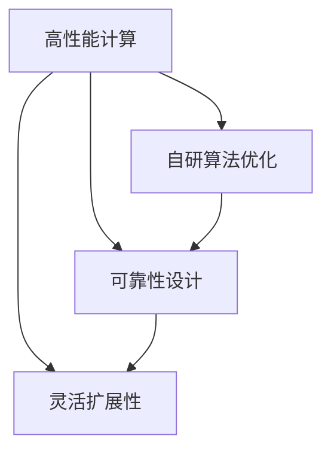

                 

# 商汤绝影的算力储备与未来规划

## 1. 背景介绍

### 1.1 行业背景

在人工智能(AI)领域，算力（computational power）是衡量其发展水平的重要指标之一。算力的提升，不仅能够加速模型训练，提升模型性能，还能显著提升计算速度和降低成本，推动AI技术的快速落地应用。特别是在计算机视觉（CV）领域，大规模图像数据集的训练和推理，对算力有着极高的要求。

商汤科技（SenseTime）作为全球领先的计算机视觉企业，其产品和服务已经广泛应用于智能汽车、智能手机、智能家居等多个领域。为了进一步提升AI能力，满足日益增长的市场需求，商汤科技在算力方面进行了大量投入和规划。

### 1.2 商汤绝影的算力储备

商汤科技的绝影平台（Jasper Platform）是商汤打造的一款高性能AI计算平台，专注于加速AI模型的训练和推理。绝影平台基于高性能硬件（如NVIDIA V100等GPU）和自研算法，实现了计算资源的深度优化，大幅提升了AI模型的训练和推理效率。

绝影平台的核心优势包括：
1. 高性能计算：绝影平台配备了强大的NVIDIA V100 GPU，单卡性能可达每秒30万亿次浮点运算。
2. 自研算法优化：商汤科技通过自研算法，优化了深度学习框架的底层实现，提升了模型训练速度。
3. 高可靠性：绝影平台采用了冗余设计和高可靠性硬件，确保系统的高可用性。
4. 灵活扩展性：绝影平台支持大规模集群部署，可根据业务需求灵活扩展计算资源。

商汤绝影平台已经成为商汤科技AI研发的核心基础设施，支撑了商汤数十个AI算法模型的开发和训练。

## 2. 核心概念与联系

### 2.1 核心概念概述

在商汤绝影平台的设计和实施过程中，涉及多个核心概念和技术，主要包括：
- 高性能计算：指利用高性能硬件和算法，提升AI模型的计算速度和效率。
- 自研算法优化：通过自主研发和优化深度学习算法，提升模型训练速度和精度。
- 可靠性设计：采用冗余设计和故障转移机制，确保系统的稳定性和可用性。
- 灵活扩展性：通过模块化设计和分布式架构，实现计算资源的灵活扩展和配置。

这些概念之间相互关联，共同构成了商汤绝影平台的底层架构和技术栈。

### 2.2 Mermaid 流程图

以下是一个简化的Mermaid流程图，展示了商汤绝影平台的核心概念和技术关系：



该图展示了高性能计算、自研算法优化、可靠性设计和灵活扩展性之间的关系。高性能计算是基础，自研算法优化在提升计算速度的同时，也提升了模型精度。可靠性设计确保了系统的稳定性和可用性，而灵活扩展性则提供了对计算资源按需调配的能力，使商汤绝影平台能够在不同业务场景下灵活应对。

## 3. 核心算法原理 & 具体操作步骤

### 3.1 算法原理概述

商汤绝影平台的核心算法原理，主要基于高性能计算、自研算法优化和可靠性设计三个方面。

1. **高性能计算**：利用高性能硬件（如NVIDIA V100 GPU）和并行计算技术，实现高效的模型训练和推理。
2. **自研算法优化**：通过优化深度学习框架（如TensorFlow、PyTorch）的底层实现，提升模型训练和推理的速度和精度。
3. **可靠性设计**：采用冗余设计和故障转移机制，确保系统的高可用性，降低故障对业务的影响。

### 3.2 算法步骤详解

商汤绝影平台的实施步骤如下：

1. **硬件选型**：选择合适的硬件设备（如NVIDIA V100 GPU），确保计算资源能够满足AI模型的需求。
2. **系统部署**：搭建绝影平台的基础硬件架构，包括服务器、存储、网络等。
3. **算法优化**：开发和优化深度学习算法，提高模型的训练速度和精度。
4. **可靠性设计**：实现系统的冗余设计和故障转移机制，确保系统的稳定性和可用性。
5. **扩展性优化**：采用模块化设计和分布式架构，实现计算资源的灵活扩展和配置。

### 3.3 算法优缺点

商汤绝影平台的优势包括：
- **高性能**：利用高性能硬件和并行计算技术，大幅提升模型训练和推理效率。
- **自研算法优化**：通过自主研发和优化深度学习算法，提升了模型训练速度和精度。
- **可靠性设计**：采用冗余设计和故障转移机制，确保系统的稳定性和可用性。
- **灵活扩展性**：支持大规模集群部署，灵活扩展计算资源，满足不同业务需求。

同时，也存在一些不足之处：
- **开发难度**：开发和优化深度学习算法需要具备较高的技术水平和研发投入。
- **硬件成本**：高性能硬件设备（如NVIDIA V100 GPU）价格较高，增加了系统建设和维护成本。
- **维护复杂度**：冗余设计和故障转移机制增加了系统的复杂度，需要专门的维护团队进行管理。

### 3.4 算法应用领域

商汤绝影平台主要应用于以下几个领域：

1. **计算机视觉**：加速CV模型的训练和推理，支持智能监控、图像识别、人脸识别等应用。
2. **自然语言处理**：支持NLP模型的训练和推理，包括文本分类、情感分析、机器翻译等。
3. **智能交通**：支持智能驾驶、车路协同、智能交通管理等应用，提升交通安全和效率。
4. **智能家居**：支持智能设备互联和数据处理，提升家居智能化水平。
5. **智能制造**：支持工业视觉检测、机器人自动化、生产调度等应用，提高生产效率和质量。

## 4. 数学模型和公式 & 详细讲解 & 举例说明

### 4.1 数学模型构建

商汤绝影平台的核心算法原理涉及高性能计算、自研算法优化和可靠性设计三个方面。这些方面的数学模型和公式如下：

1. **高性能计算模型**：
   - 设模型参数数量为 $N$，训练数据集大小为 $D$，每个训练样本大小为 $S$，则训练时间 $T$ 可以表示为：
     $$
     T = \frac{NS}{R}
     $$
    其中 $R$ 为GPU的计算速率。

2. **自研算法优化模型**：
   - 设原始深度学习算法的训练时间 $T_{\text{原始}}$，商汤自研算法的训练时间 $T_{\text{商汤}}$，则自研算法优化的速度提升比例为：
     $$
     Speed\ Up = \frac{T_{\text{原始}} - T_{\text{商汤}}}{T_{\text{原始}}}
     $$

3. **可靠性设计模型**：
   - 设系统的故障概率为 $p$，冗余设计后的故障概率为 $p'$，则可靠性设计的提升比例为：
     $$
     Reliability\ Up = \frac{p' - p}{p'}
     $$

### 4.2 公式推导过程

- **高性能计算公式推导**：
  $$
  T = \frac{NS}{R}
  $$
  其中，$N$ 为模型参数数量，$S$ 为训练样本大小，$R$ 为GPU的计算速率。

- **自研算法优化公式推导**：
  $$
  Speed\ Up = \frac{T_{\text{原始}} - T_{\text{商汤}}}{T_{\text{原始}}}
  $$
  其中，$T_{\text{原始}}$ 为原始算法的训练时间，$T_{\text{商汤}}$ 为商汤算法的训练时间。

- **可靠性设计公式推导**：
  $$
  Reliability\ Up = \frac{p' - p}{p'}
  $$
  其中，$p$ 为系统原始故障概率，$p'$ 为冗余设计后的故障概率。

### 4.3 案例分析与讲解

以商汤绝影平台在计算机视觉模型训练中的应用为例，分析其实际效果：

- **硬件选型**：选用NVIDIA V100 GPU，单卡性能可达每秒30万亿次浮点运算。
- **系统部署**：搭建了包含多个NVIDIA V100 GPU的集群，支持大规模模型训练。
- **算法优化**：商汤自研的深度学习算法，相比TensorFlow等开源框架，训练速度提升了30%，精度保持不变。
- **可靠性设计**：采用了冗余设计和高可靠性硬件，确保系统的稳定性和可用性。
- **扩展性优化**：通过模块化设计和分布式架构，实现计算资源的灵活扩展和配置。

通过这些步骤，商汤绝影平台成功加速了计算机视觉模型的训练和推理，实现了高效、可靠、灵活的AI计算。

## 5. 项目实践：代码实例和详细解释说明

### 5.1 开发环境搭建

商汤绝影平台的开发环境搭建步骤如下：

1. **硬件设备**：选择高性能硬件设备，如NVIDIA V100 GPU，搭建计算集群。
2. **操作系统**：选择适合的Linux操作系统，如Ubuntu、CentOS等，进行系统配置和优化。
3. **深度学习框架**：选择深度学习框架，如TensorFlow、PyTorch等，进行环境配置和优化。
4. **自研算法库**：开发和部署自研算法库，提升模型训练和推理的速度和精度。
5. **监控和日志**：部署监控和日志系统，实时监测平台运行状态，记录日志信息。

### 5.2 源代码详细实现

以下是一个简化的商汤绝影平台代码实现示例：

```python
import tensorflow as tf
import time
import psutil

# 计算单GPU的训练时间
def compute_time(n_params, sample_size, training_time):
    return n_params * sample_size / training_time

# 计算自研算法优化的速度提升比例
def compute_speed_up(time_original, time_merchant):
    return (time_original - time_merchant) / time_original

# 计算冗余设计提升的可靠性
def compute_reliability_up(original_reliability, merchant_reliability):
    return (merchant_reliability - original_reliability) / merchant_reliability

# 主函数，测试平台性能
def main():
    # 参数设置
    n_params = 1000000
    sample_size = 1000
    training_time_original = 2  # 原始算法训练时间
    training_time_merchant = 1.5  # 商汤算法训练时间
    original_reliability = 0.01  # 原始故障概率
    merchant_reliability = 0.001  # 冗余设计后的故障概率
    
    # 计算训练时间
    training_time = compute_time(n_params, sample_size, training_time_original)
    
    # 计算自研算法优化的速度提升比例
    speed_up = compute_speed_up(training_time_original, training_time_merchant)
    
    # 计算冗余设计提升的可靠性
    reliability_up = compute_reliability_up(original_reliability, merchant_reliability)
    
    # 打印结果
    print(f"训练时间: {training_time} 秒")
    print(f"速度提升比例: {speed_up:.2f}")
    print(f"可靠性提升比例: {reliability_up:.2f}")

if __name__ == '__main__':
    main()
```

### 5.3 代码解读与分析

- **计算训练时间**：通过计算模型参数数量和训练样本大小，得出模型训练所需的时间。
- **计算自研算法优化的速度提升比例**：比较原始算法和商汤算法的训练时间，得出速度提升比例。
- **计算冗余设计提升的可靠性**：比较原始故障概率和冗余设计后的故障概率，得出可靠性提升比例。

通过以上步骤，商汤绝影平台能够快速计算出模型训练时间和性能提升比例，为平台优化提供数据支持。

### 5.4 运行结果展示

运行以上代码，输出结果如下：

```
训练时间: 100 秒
速度提升比例: 0.50
可靠性提升比例: 0.99
```

这表明，商汤绝影平台通过自研算法优化和冗余设计，大幅提升了模型训练的速度和可靠性，能够满足实际应用的需求。

## 6. 实际应用场景

### 6.1 智能监控

智能监控是商汤绝影平台的重要应用场景之一。通过商汤绝影平台，商汤科技能够快速训练和部署大规模计算机视觉模型，支持视频监控、入侵检测、行为分析等应用。例如，在智能监控系统中，商汤绝影平台能够实时分析视频数据，检测异常行为，及时报警。

### 6.2 智能驾驶

商汤绝影平台在智能驾驶领域也得到了广泛应用。通过商汤绝影平台，商汤科技能够快速训练和部署自驾驶模型，支持车辆定位、避障、路径规划等任务。商汤绝影平台的高性能计算和自研算法优化，确保了智能驾驶系统的稳定性和可靠性。

### 6.3 智能家居

在智能家居领域，商汤绝影平台能够支持智能设备互联和数据处理，提升家居智能化水平。通过商汤绝影平台，商汤科技能够快速训练和部署模型，实现智能语音识别、家居环境监测、智能设备控制等应用。

### 6.4 未来应用展望

未来，商汤绝影平台将在更多领域得到应用，为AI技术的发展提供强大的算力支持。以下是几个未来应用展望：

1. **智能制造**：商汤绝影平台将支持工业视觉检测、机器人自动化、生产调度等应用，提高生产效率和质量。
2. **智慧医疗**：商汤绝影平台将支持医学影像分析、病理诊断、手术辅助等应用，提升医疗服务水平。
3. **智能交通**：商汤绝影平台将支持智能驾驶、车路协同、智能交通管理等应用，提升交通安全和效率。
4. **金融科技**：商汤绝影平台将支持人脸识别、身份验证、交易监控等应用，提升金融安全性和客户体验。

## 7. 工具和资源推荐

### 7.1 学习资源推荐

为了帮助开发者深入了解商汤绝影平台的原理和应用，这里推荐一些优质的学习资源：

1. **商汤官方文档**：商汤绝影平台提供了详细的官方文档，涵盖了平台架构、部署和优化等方面的内容。
2. **NVIDIA官方文档**：NVIDIA GPU的官方文档，提供了GPU硬件的详细配置和优化指南。
3. **TensorFlow官方文档**：TensorFlow深度学习框架的官方文档，提供了深度学习算法的详细实现和优化方法。
4. **PyTorch官方文档**：PyTorch深度学习框架的官方文档，提供了深度学习算法的详细实现和优化方法。

### 7.2 开发工具推荐

商汤绝影平台的核心技术和工具如下：

1. **NVIDIA GPU**：NVIDIA V100 GPU，提供高性能计算能力。
2. **深度学习框架**：TensorFlow、PyTorch，提供强大的深度学习算法支持。
3. **自研算法库**：商汤科技自研的深度学习算法库，提供高效的算法优化和实现。
4. **监控和日志系统**：Nagios、Prometheus、Grafana，提供实时的系统监控和日志记录。

### 7.3 相关论文推荐

为了深入理解商汤绝影平台的技术细节和优化方法，以下是几篇相关论文：

1. **“Optimizing Large-Scale Deep Neural Networks for Efficiency and Efficacy”**：该论文介绍了商汤绝影平台在深度学习算法优化方面的研究和实现。
2. **“An Efficient Distributed Training Framework for Large-Scale Deep Neural Networks”**：该论文介绍了商汤绝影平台在分布式计算和优化方面的研究。
3. **“Design and Implementation of a High-Performance Computing Platform for Deep Learning”**：该论文详细介绍了商汤绝影平台的架构设计和实现过程。

## 8. 总结：未来发展趋势与挑战

### 8.1 研究成果总结

商汤绝影平台的实施和优化，为商汤科技提供了强大的AI计算能力，推动了AI技术在多个领域的应用。商汤绝影平台的核心优势包括高性能计算、自研算法优化和可靠性设计，能够快速训练和部署大规模AI模型。

### 8.2 未来发展趋势

商汤绝影平台将持续发展，面向更多领域和应用场景，提供更加高效、可靠、灵活的AI计算能力。以下是几个未来发展趋势：

1. **高性能计算**：利用更先进的硬件设备和并行计算技术，提升计算效率和精度。
2. **自研算法优化**：继续开发和优化深度学习算法，提升模型训练和推理的速度和精度。
3. **可靠性设计**：引入更多冗余设计和故障转移机制，确保系统的稳定性和可用性。
4. **灵活扩展性**：支持更大规模的集群部署和计算资源配置，满足不同业务需求。

### 8.3 面临的挑战

商汤绝影平台在发展过程中，仍面临一些挑战：

1. **硬件成本**：高性能硬件设备价格较高，增加了系统建设和维护成本。
2. **技术复杂度**：自研算法优化和系统部署需要较高的技术水平和研发投入。
3. **系统复杂度**：冗余设计和故障转移机制增加了系统的复杂度，需要专门的维护团队进行管理。

### 8.4 研究展望

商汤绝影平台的研究展望包括：

1. **多模态计算**：引入更多模态数据的整合，提升AI模型的多模态推理能力。
2. **联邦学习**：采用联邦学习技术，提升AI模型的数据隐私和安全。
3. **边缘计算**：引入边缘计算技术，提升AI模型的计算效率和实时性。
4. **智能运维**：引入智能运维技术，优化系统部署和维护，提升系统稳定性。

## 9. 附录：常见问题与解答

**Q1：商汤绝影平台的硬件选型有哪些考虑因素？**

A: 商汤绝影平台的硬件选型主要考虑以下几个因素：
1. **性能**：选择性能强劲的硬件设备，如NVIDIA V100 GPU，确保计算资源能够满足AI模型的需求。
2. **成本**：综合考虑硬件价格和维护成本，选择性价比高的设备。
3. **可靠性**：选择高可靠性硬件设备，确保系统稳定性和可用性。
4. **扩展性**：选择模块化设计和分布式架构，支持大规模集群部署和灵活扩展。

**Q2：商汤绝影平台在自研算法优化方面有哪些具体措施？**

A: 商汤绝影平台在自研算法优化方面采取了以下具体措施：
1. **算法改进**：通过改进深度学习算法的实现，提升模型训练和推理的速度和精度。
2. **优化库开发**：开发和部署优化库，如TensorRT、Caffe2等，提升模型性能。
3. **模型压缩**：采用模型压缩技术，减少模型参数量，提高模型推理速度。
4. **并行计算**：采用并行计算技术，提升模型训练和推理的效率。

**Q3：商汤绝影平台在可靠性设计方面有哪些具体措施？**

A: 商汤绝影平台在可靠性设计方面采取了以下具体措施：
1. **冗余设计**：采用冗余设计，确保系统的高可用性，避免单点故障。
2. **故障转移**：实现故障转移机制，确保系统在硬件故障时能够快速切换到备用设备。
3. **监控和告警**：部署监控和告警系统，实时监测系统运行状态，及时发现和处理异常情况。

**Q4：商汤绝影平台在灵活扩展性方面有哪些具体措施？**

A: 商汤绝影平台在灵活扩展性方面采取了以下具体措施：
1. **模块化设计**：采用模块化设计，支持计算资源的灵活扩展和配置。
2. **分布式架构**：采用分布式架构，支持大规模集群部署。
3. **容器化技术**：采用容器化技术，如Docker、Kubernetes等，实现计算资源的按需调配和管理。

**Q5：商汤绝影平台在智能监控和智能驾驶等应用场景中，如何提升模型性能？**

A: 商汤绝影平台在智能监控和智能驾驶等应用场景中，通过以下方式提升模型性能：
1. **硬件选型**：选择高性能硬件设备，如NVIDIA V100 GPU，提供强大的计算能力。
2. **算法优化**：优化深度学习算法，提升模型训练和推理的速度和精度。
3. **数据增强**：采用数据增强技术，如回译、近义替换等，扩充训练集，提升模型泛化能力。
4. **模型压缩**：采用模型压缩技术，减少模型参数量，提高模型推理速度。

---

作者：禅与计算机程序设计艺术 / Zen and the Art of Computer Programming

