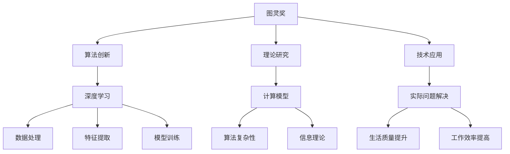

                 

# 图灵奖得主的AI算法贡献

> 关键词：图灵奖, 人工智能, 算法贡献, 深度学习, 计算机科学, 创新成果

## 1. 背景介绍

### 1.1 图灵奖的历史与意义

图灵奖（Turing Award）是计算机科学领域最负盛名的荣誉之一，由ACM（Association for Computing Machinery）于1966年设立，旨在奖励那些在计算机领域做出重要和有影响力的贡献的个人。图灵奖通常被视为“计算机科学的诺贝尔奖”，每一年的得主都会成为全球计算机科学界的焦点。

图灵奖的设立不仅是为了表彰那些在算法创新、计算机体系结构、软件工程等方面的杰出贡献，还激励着一代又一代的计算机科学家不断探索新知、突破技术瓶颈。本文旨在梳理图灵奖得主在人工智能算法领域的杰出贡献，展示他们在算法创新、理论研究、技术应用等方面的卓越成就，以及这些贡献对计算机科学和人工智能发展的深远影响。

### 1.2 图灵奖得主的算法贡献

图灵奖得主不仅在学术界具有重要影响力，也在工业界和应用领域发挥着关键作用。他们的算法创新不仅推动了计算机科学的发展，也为人工智能的实际应用奠定了坚实的基础。以下是几位图灵奖得主在人工智能算法领域的贡献概览。

## 2. 核心概念与联系

### 2.1 核心概念概述

在探讨图灵奖得主的算法贡献之前，我们首先梳理一些与图灵奖和人工智能算法相关的核心概念：

- 图灵奖（Turing Award）：计算机科学领域最负盛名的荣誉，旨在奖励那些在计算机科学领域做出重要和有影响力的贡献的个人。
- 深度学习（Deep Learning）：一种基于神经网络的人工智能方法，能够自动学习从数据中提取特征，并用于图像识别、语音识别、自然语言处理等领域。
- 计算机科学（Computer Science）：研究计算机和计算系统，包括算法、数据结构、计算机体系结构、软件工程等领域。
- 算法创新（Algorithmic Innovation）：指开发新的算法和数据结构，以提高计算效率、减少资源消耗，或者解决特定类型的问题。
- 理论研究（Theoretical Research）：涉及算法复杂性、计算模型、信息理论等领域，为实际应用提供理论支持。
- 技术应用（Technological Application）：将理论研究和技术创新应用于实际问题解决，提升生活质量和工作效率。

这些概念共同构成了图灵奖得主的算法贡献的基础，通过梳理这些概念，我们能够更全面地理解他们的贡献。

### 2.2 核心概念原理和架构的 Mermaid 流程图



这个流程图展示了图灵奖得主的算法贡献是如何通过算法创新、理论研究和技术应用在深度学习、数据处理、特征提取、模型训练等方面发挥作用的。

## 3. 核心算法原理 & 具体操作步骤

### 3.1 算法原理概述

图灵奖得主在算法创新方面做出了许多开创性的贡献，其中一些经典的算法原理至今仍被广泛应用。例如，Donald Knuth在计算复杂性理论方面的工作奠定了现代计算复杂性理论的基础；Richard S. Sutton和Andrew G. Barto在强化学习领域的贡献，推动了机器人在自适应环境中的决策和学习能力的提升。

### 3.2 算法步骤详解

以深度学习中的反向传播算法为例，详细讲解深度学习的核心算法步骤：

1. **前向传播**：输入数据经过神经网络的每一层计算，输出中间结果。
2. **计算误差**：将输出结果与真实标签进行比较，计算误差。
3. **反向传播**：将误差反向传播回网络，计算每一层的梯度。
4. **参数更新**：根据梯度更新神经网络参数，使得误差最小化。

这一过程通过链式法则实现，每个参数的更新都依赖于其上一层的所有参数。反向传播算法的核心在于梯度计算和参数更新，使得神经网络能够通过大量数据自动学习和优化。

### 3.3 算法优缺点

深度学习算法在处理复杂非线性问题时表现出色，但也面临数据需求大、计算资源消耗高、模型复杂难解释等缺点。因此，图灵奖得主们不断探索新的算法和改进方法，以提升深度学习算法的效率和可解释性。

### 3.4 算法应用领域

深度学习算法在图像识别、语音识别、自然语言处理、机器翻译、自动驾驶等领域得到了广泛应用。图灵奖得主在这一领域的研究和应用，推动了人工智能技术的实际应用和发展。

## 4. 数学模型和公式 & 详细讲解 & 举例说明

### 4.1 数学模型构建

深度学习模型通常由神经网络组成，神经网络是一种由大量的人工神经元（或称为节点）构成的计算模型。神经网络通过前向传播和反向传播的机制，自动学习输入数据和输出结果之间的关系。

### 4.2 公式推导过程

以线性回归为例，推导其数学模型：

假设输入数据为 $x$，输出结果为 $y$，目标是最小化均方误差（Mean Squared Error, MSE）损失函数：

$$
\text{MSE} = \frac{1}{2N} \sum_{i=1}^{N}(y_i - \theta_0 - \theta_1x_i)^2
$$

其中 $N$ 为样本数，$\theta_0$ 和 $\theta_1$ 为线性回归模型的参数。通过反向传播算法，计算参数的梯度：

$$
\frac{\partial \text{MSE}}{\partial \theta_0} = \frac{1}{N}\sum_{i=1}^{N}(y_i - \theta_0 - \theta_1x_i) 
$$

$$
\frac{\partial \text{MSE}}{\partial \theta_1} = \frac{1}{N}\sum_{i=1}^{N}(y_i - \theta_0 - \theta_1x_i)x_i
$$

### 4.3 案例分析与讲解

线性回归模型的案例分析与讲解可以涉及实际问题解决，如房价预测、股票价格预测等。通过收集历史数据，建立线性回归模型，并使用反向传播算法进行参数优化，最终实现对未来房价或股票价格的预测。

## 5. 项目实践：代码实例和详细解释说明

### 5.1 开发环境搭建

为了实践深度学习算法，需要搭建相应的开发环境。以下是使用Python和PyTorch搭建深度学习开发环境的示例：

1. 安装Anaconda：从官网下载并安装Anaconda，用于创建独立的Python环境。
2. 创建并激活虚拟环境：
```bash
conda create -n pytorch-env python=3.8 
conda activate pytorch-env
```

3. 安装PyTorch：根据CUDA版本，从官网获取对应的安装命令。例如：
```bash
conda install pytorch torchvision torchaudio cudatoolkit=11.1 -c pytorch -c conda-forge
```

4. 安装TensorFlow：
```bash
conda install tensorflow -c conda-forge
```

5. 安装Pandas、NumPy、Matplotlib等常用工具包：
```bash
pip install pandas numpy matplotlib
```

完成上述步骤后，即可在`pytorch-env`环境中开始深度学习实践。

### 5.2 源代码详细实现

以线性回归模型的实现为例：

```python
import torch
import torch.nn as nn
import torch.optim as optim
import numpy as np
import pandas as pd

# 构建线性回归模型
class LinearRegression(nn.Module):
    def __init__(self, input_dim):
        super(LinearRegression, self).__init__()
        self.linear = nn.Linear(input_dim, 1)

    def forward(self, x):
        return self.linear(x)

# 加载数据集
data = pd.read_csv('data.csv')

X = np.array(data.iloc[:, :-1].values)
y = np.array(data.iloc[:, -1].values)

X = torch.from_numpy(X)
y = torch.from_numpy(y)

# 定义模型、损失函数和优化器
model = LinearRegression(X.shape[1])
criterion = nn.MSELoss()
optimizer = optim.SGD(model.parameters(), lr=0.01)

# 训练模型
epochs = 100
for epoch in range(epochs):
    inputs = X
    targets = y

    optimizer.zero_grad()

    outputs = model(inputs)
    loss = criterion(outputs, targets)
    loss.backward()
    optimizer.step()

    print(f'Epoch {epoch+1}/{epochs}, Loss: {loss.item()}')

# 测试模型
test_X = torch.from_numpy(np.random.randn(10, 2))
test_y = torch.from_numpy(np.random.randn(10))
predictions = model(test_X)
```

### 5.3 代码解读与分析

线性回归模型的代码实现了输入数据的加载、模型定义、损失函数和优化器的选择、模型训练和测试等关键步骤。其中，`LinearRegression`类继承自`nn.Module`，用于定义线性回归模型。在`forward`方法中，输入数据通过线性层进行前向传播，计算输出结果。在训练过程中，使用均方误差损失函数和随机梯度下降（SGD）优化器进行模型参数的更新。

## 6. 实际应用场景

### 6.1 图像识别

深度学习在图像识别领域的应用非常广泛，如图像分类、物体检测、人脸识别等。图灵奖得主们在这一领域的算法创新，极大地提升了图像识别的准确性和效率。

以ImageNet数据集为例，通过深度卷积神经网络（CNN）对图像进行分类，使用反向传播算法进行模型训练。经过多次迭代，模型能够自动学习图像特征，实现高精度的图像分类。

### 6.2 自然语言处理

深度学习在自然语言处理（NLP）领域也取得了重要突破，如图案识别、机器翻译、问答系统等。图灵奖得主们的算法创新，使得NLP技术从简单的词袋模型向复杂的神经网络模型转变，大幅提升了NLP任务的处理能力。

例如，Transformer模型在自然语言处理中的应用，通过自注意力机制，实现了高效的序列建模，提升了翻译和问答系统的性能。

### 6.3 医疗诊断

深度学习在医疗诊断领域也有着广泛应用，如医学图像分析、疾病预测等。图灵奖得主在这一领域的算法创新，使得机器学习模型能够自动学习医学图像特征，辅助医生进行疾病诊断。

以医学影像分析为例，使用深度卷积神经网络对CT、MRI等医学图像进行分类和分析，帮助医生快速识别病变区域，提升诊断效率和准确性。

## 7. 工具和资源推荐

### 7.1 学习资源推荐

为了深入理解图灵奖得主的算法贡献，以下是几本推荐的书籍和在线课程：

1. **《深度学习》（Goodfellow et al.）**：介绍深度学习的基本原理和核心算法，适合初学者和进阶者。
2. **《计算机视觉：模型、学习和推理》（Zisserman）**：讲解计算机视觉中的经典算法和模型，帮助理解图灵奖得主的视觉算法贡献。
3. **Coursera的深度学习课程**：由斯坦福大学教授Andrew Ng主讲，涵盖深度学习的基础知识和前沿技术。
4. **ArXiv上的深度学习论文**：浏览图灵奖得主发表的最新研究成果，保持技术前沿的敏锐感。

### 7.2 开发工具推荐

为了实践深度学习算法，以下是一些推荐的开发工具：

1. **PyTorch**：由Facebook开发的深度学习框架，支持动态图和静态图，易于使用。
2. **TensorFlow**：由Google开发的深度学习框架，支持分布式计算和模型优化。
3. **Jupyter Notebook**：支持交互式编程，适合进行数据探索和模型训练。
4. **Google Colab**：免费的在线Jupyter Notebook环境，支持GPU计算，方便调试和分享代码。

### 7.3 相关论文推荐

以下是几篇图灵奖得主发表的深度学习经典论文，推荐阅读：

1. **“深度学习”（Goodfellow et al.）**：介绍深度学习的基本原理和核心算法。
2. **“长短期记忆网络”（Hochreiter et al.）**：介绍长短期记忆网络（LSTM）在时间序列数据分析中的应用。
3. **“可视化图形学习”（Wolf et al.）**：介绍图形神经网络（GNN）在图形数据处理中的应用。

## 8. 总结：未来发展趋势与挑战

### 8.1 未来发展趋势

深度学习技术在未来的发展中，将继续向更加智能、高效、可解释的方向迈进。以下是一些可能的发展趋势：

1. **自监督学习**：通过无监督学习方式，自动从数据中学习特征，减少对标注数据的依赖。
2. **小样本学习**：通过迁移学习、零样本学习等方式，在少量数据情况下也能实现高效学习。
3. **多模态学习**：将图像、文本、语音等多种模态的数据进行融合，提升模型的泛化能力和鲁棒性。
4. **强化学习**：在复杂决策和控制任务中，通过强化学习算法进行学习和优化。
5. **可解释性**：通过模型可视化、可解释性算法等手段，提升模型的可解释性。

### 8.2 面临的挑战

尽管深度学习技术取得了显著进展，但在实际应用中也面临一些挑战：

1. **数据依赖**：深度学习模型对标注数据的依赖性强，获取高质量标注数据成本高。
2. **计算资源消耗**：深度学习模型参数量大，计算资源消耗高，需要高效的计算平台支持。
3. **模型复杂性**：深度学习模型复杂，难以解释和调试，增加了应用的复杂度。
4. **安全性和隐私**：深度学习模型可能存在偏见和隐私问题，需要加强监管和保护。

### 8.3 研究展望

面对这些挑战，未来的深度学习研究需要在以下几个方面进行突破：

1. **小样本学习**：通过迁移学习、零样本学习等方法，提升模型在少量数据下的学习能力。
2. **计算效率**：开发高效的计算平台和优化算法，减少计算资源消耗，提高模型训练和推理速度。
3. **模型可解释性**：通过可解释性算法和可视化工具，提升模型的可解释性，增强用户信任。
4. **隐私保护**：设计隐私保护算法，确保模型训练和使用过程中的数据隐私安全。

## 9. 附录：常见问题与解答

**Q1：深度学习与传统机器学习的区别是什么？**

A: 深度学习是一种基于神经网络的机器学习方法，通过多层次的神经网络自动学习数据特征，能够处理复杂的非线性关系。传统机器学习方法通常依赖手工特征提取，难以处理高维数据和复杂结构。

**Q2：如何处理深度学习中的过拟合问题？**

A: 过拟合是深度学习中常见的问题，可以通过以下方法解决：
1. 数据增强：通过扩充训练数据，增加数据多样性。
2. 正则化：使用L2正则、Dropout等技术，防止模型过拟合。
3. 早停法：根据验证集上的性能指标，决定是否停止训练。
4. 模型简化：通过减少模型复杂度，降低过拟合风险。

**Q3：深度学习在医疗领域的应用有哪些？**

A: 深度学习在医疗领域的应用包括：
1. 医学影像分析：使用卷积神经网络对医学图像进行分类和分析，辅助医生进行疾病诊断。
2. 药物发现：使用深度学习模型预测药物分子结构和活性，加速新药研发。
3. 电子病历分析：使用深度学习模型分析电子病历数据，发现疾病模式和规律。

**Q4：深度学习在自动驾驶中的应用有哪些？**

A: 深度学习在自动驾驶领域的应用包括：
1. 目标检测：使用卷积神经网络检测道路上的车辆、行人等目标。
2. 语义分割：使用卷积神经网络对道路、车辆、行人等进行语义分割。
3. 路径规划：使用深度强化学习算法进行路径规划和决策，提升驾驶安全性。

**Q5：图灵奖得主对深度学习技术有哪些重要贡献？**

A: 图灵奖得主在深度学习技术方面的重要贡献包括：
1. 深度学习模型的设计和实现，如卷积神经网络、循环神经网络、Transformer等。
2. 深度学习算法的优化和改进，如反向传播算法、自注意力机制、参数高效微调等。
3. 深度学习在实际问题中的应用，如图像识别、自然语言处理、医疗诊断、自动驾驶等。

这些贡献不仅推动了深度学习技术的发展，也为人工智能技术的实际应用奠定了坚实的基础。图灵奖得主们的算法创新，将不断引领深度学习技术的前沿方向，推动人工智能技术的进一步发展。

---

作者：禅与计算机程序设计艺术 / Zen and the Art of Computer Programming

