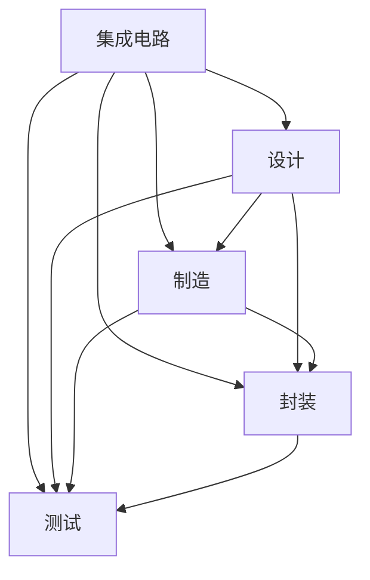

                 

# 垂直整合对集成电路产业的影响

> 关键词：垂直整合,集成电路,设计,制造,封装,测试,集成电路产业,竞争优势,效率提升,成本控制,创新驱动,技术集成,客户满意度

## 1. 背景介绍

### 1.1 问题由来
随着集成电路产业的不断发展，垂直整合(Vertical Integration)已成为业内竞争和创新的重要策略。传统上，集成电路产业链被划分为设计、制造、封装、测试等多个环节，各环节由不同的供应商负责。但随着集成电路复杂度的提高和市场需求的日益多样化，垂直整合成为提升产业效率、控制成本、增强竞争优势的重要手段。

垂直整合是指将集成电路产业链的不同环节整合到一个企业或企业联盟中，实现从设计到最终产品的全程控制。这一策略不仅能提高生产效率和产品质量，还能增强企业对供应链的掌控能力，提升市场响应速度。垂直整合是产业升级的重要驱动力，也是集成电路行业竞争格局转变的重要标志。

### 1.2 问题核心关键点
垂直整合的核心在于通过跨环节的资源整合，优化供应链流程，提升整体效率和竞争能力。这一过程涉及多个层面，包括：

- 技术集成：融合设计、制造、封装、测试等多个环节的先进技术，形成具有核心竞争力的集成解决方案。
- 成本控制：通过整合不同环节的成本管理，实现全流程成本优化。
- 市场响应：缩短从设计到市场的过程时间，提高市场反应速度。
- 客户满意度：提供端到端的客户支持和服务，提升客户满意度。

### 1.3 问题研究意义
垂直整合对集成电路产业的影响深远，其研究意义在于：

1. **提升产业效率**：通过垂直整合，集成电路产业能够实现全流程优化，减少资源浪费，提高整体效率。
2. **增强竞争优势**：垂直整合使企业能够掌握完整的供应链，提升市场响应速度和产品质量，从而获得竞争优势。
3. **降低成本**：垂直整合优化了供应链各环节的资源配置，降低了总体成本，提升了企业的盈利能力。
4. **推动技术创新**：垂直整合推动了技术融合，促进了新技术和新产品的开发，为产业创新提供了新动力。
5. **增强客户满意度**：垂直整合提供了一站式解决方案，提高了客户体验和服务水平。

## 2. 核心概念与联系

### 2.1 核心概念概述

为了更好地理解垂直整合对集成电路产业的影响，本节将介绍几个关键概念及其相互关系：

- **集成电路(IC)**：指通过光刻、蚀刻等工艺在半导体材料上制造的电子电路。集成电路是计算机、通信、消费电子等众多领域的基础。
- **垂直整合**：指将集成电路产业链的多个环节整合到一个企业或联盟中，实现从设计到最终产品的全程控制。
- **设计**：包括电路设计、版图设计、仿真测试等环节，是集成电路的源头。
- **制造**：指通过光刻、蚀刻、沉积等工艺，在硅片上制造电路的过程。
- **封装**：将制造完成的芯片封装到外壳中，防止物理损坏。
- **测试**：对封装后的芯片进行电性能测试，确保其功能正常。
- **集成电路产业**：包括设计、制造、封装、测试等多个环节，涉及广泛的技术和管理问题。

这些概念之间的逻辑关系可以通过以下Mermaid流程图来展示：



这个流程图展示了集成电路从设计到测试的整个生命周期，其中各个环节之间互相依赖、互相影响。

## 3. 核心算法原理 & 具体操作步骤
### 3.1 算法原理概述

垂直整合的核心算法原理在于通过优化供应链管理，提升全流程效率和成本控制。其基本思路是：

1. **技术融合**：将设计、制造、封装、测试等环节的先进技术进行融合，形成具有核心竞争力的集成解决方案。
2. **流程优化**：通过分析各环节的瓶颈和冗余，重新设计和优化整个流程，提高生产效率。
3. **成本控制**：整合各环节的成本管理，实现全流程成本优化，降低总体成本。
4. **资源共享**：通过资源共享和协同创新，提升资源利用效率，增强企业的竞争力。

### 3.2 算法步骤详解

基于上述原理，垂直整合的具体操作步骤可以分为以下几个步骤：

**Step 1: 需求分析与整合规划**
- 分析现有供应链的效率和成本，确定整合的优先级和目标。
- 制定详细的整合规划，包括技术融合、流程优化、成本控制等方面的具体措施。

**Step 2: 技术融合与研发**
- 将设计、制造、封装、测试等环节的先进技术进行融合，开发集成解决方案。
- 建立联合研发团队，推动新技术的开发和应用。

**Step 3: 流程优化与流程再造**
- 对现有流程进行分析，识别出瓶颈和冗余环节。
- 重新设计和优化流程，提升生产效率。

**Step 4: 成本控制与资源共享**
- 整合各环节的成本管理，实现全流程成本优化。
- 通过资源共享和协同创新，提升资源利用效率。

**Step 5: 实施与监控**
- 根据整合规划，逐步实施各环节的整合。
- 实时监控整合过程，确保各项措施落地。

### 3.3 算法优缺点

垂直整合具有以下优点：

1. **提升生产效率**：通过整合供应链，优化流程，提升生产效率。
2. **降低成本**：整合各环节的成本管理，实现全流程成本优化。
3. **增强竞争优势**：掌握完整的供应链，提高市场响应速度和产品质量。
4. **推动技术创新**：促进技术融合，推动新技术和新产品的开发。

同时，垂直整合也存在一些缺点：

1. **整合难度大**：涉及多个环节的整合，需要协调多方利益，工作复杂。
2. **资金投入大**：整合初期需要大量资金投入，尤其是在技术研发和流程优化方面。
3. **风险高**：整合过程中可能会遇到技术和市场的不确定性，风险较高。
4. **管理复杂**：整合后需要重新构建管理架构，管理复杂度增加。

### 3.4 算法应用领域

垂直整合在集成电路产业中的应用领域非常广泛，包括：

1. **设计制造一体化**：将芯片设计、制造环节整合到同一企业中，提升设计和制造的协同效率。
2. **封装测试一体化**：将封装、测试环节整合，提高测试效率，降低测试成本。
3. **集成解决方案**：整合设计、制造、封装、测试等环节，提供一站式集成解决方案，满足客户需求。
4. **自主研发**：通过垂直整合，建立自主研发能力，增强技术创新能力。
5. **供应链管理**：通过整合供应链，提升对供应链的掌控能力，增强市场竞争力。

## 4. 数学模型和公式 & 详细讲解  
### 4.1 数学模型构建

垂直整合的数学模型构建，通常涉及以下几个方面：

- **生产效率优化**：通过数学建模，优化各环节的生产效率，提高整体产出。
- **成本控制**：建立成本模型，优化各环节的成本分配，降低总体成本。
- **供应链优化**：构建供应链模型，优化资源配置，提升供应链效率。

### 4.2 公式推导过程

以生产效率优化为例，假设有一个集成电路生产流程，包含设计、制造、封装、测试等多个环节，每个环节的生产时间分别为 $T_1, T_2, T_3, T_4$。通过优化流程，生产效率提升 $k$ 倍，则生产时间优化后的公式为：

$$
T_{opt} = \frac{T_1}{k} + \frac{T_2}{k} + \frac{T_3}{k} + \frac{T_4}{k}
$$

其中，$T_{opt}$ 为优化后的总生产时间，$T_1, T_2, T_3, T_4$ 为优化前的各环节生产时间。

### 4.3 案例分析与讲解

以三星电子的垂直整合为例，三星通过整合设计、制造、封装、测试等环节，构建了从芯片设计到最终产品的全程控制能力。具体措施包括：

- 设计制造一体化：三星设立了半导体设计与制造部门，整合设计、制造等环节，提升设计和制造的协同效率。
- 封装测试一体化：三星建立了封装和测试部门，实现封装和测试的集中管理，提高测试效率。
- 自主研发：三星设立了先进技术研究所，推动新技术和新产品的开发，提升技术创新能力。
- 供应链管理：三星通过垂直整合，增强了对供应链的掌控能力，提升了市场响应速度。

通过这些措施，三星在半导体行业取得了显著的竞争优势，成为全球领先的集成电路厂商。

## 5. 项目实践：代码实例和详细解释说明
### 5.1 开发环境搭建

在进行垂直整合实践前，我们需要准备好开发环境。以下是使用Python进行数据分析和建模的环境配置流程：

1. 安装Anaconda：从官网下载并安装Anaconda，用于创建独立的Python环境。

2. 创建并激活虚拟环境：
```bash
conda create -n ic-design python=3.8 
conda activate ic-design
```

3. 安装必要的库：
```bash
conda install numpy pandas scipy sympy scikit-learn matplotlib seaborn
```

4. 配置Jupyter Notebook：
```bash
jupyter notebook --allow-root
```

完成上述步骤后，即可在`ic-design`环境中开始垂直整合实践。

### 5.2 源代码详细实现

这里我们以一个简单的垂直整合项目为例，使用Python和Sympy库进行模型构建和求解。

假设有一个集成电路生产流程，包含设计、制造、封装、测试等多个环节，每个环节的生产时间分别为 $T_1, T_2, T_3, T_4$。通过优化流程，生产效率提升 $k$ 倍，则生产时间优化后的公式为：

```python
import sympy as sp

# 定义变量
T1, T2, T3, T4, k = sp.symbols('T1 T2 T3 T4 k')

# 原始生产时间
T = T1 + T2 + T3 + T4

# 优化生产时间
T_opt = T / k

# 打印优化后的生产时间
print(T_opt)
```

### 5.3 代码解读与分析

让我们再详细解读一下关键代码的实现细节：

**变量定义**：
- `T1, T2, T3, T4, k`：分别表示设计、制造、封装、测试环节的生产时间，以及生产效率提升倍数。

**原始生产时间**：
- `T = T1 + T2 + T3 + T4`：表示原始生产时间为各环节生产时间的总和。

**优化生产时间**：
- `T_opt = T / k`：表示优化后的生产时间为原始生产时间除以生产效率提升倍数。

**打印输出**：
- `print(T_opt)`：打印优化后的生产时间表达式。

通过以上代码，我们可以清晰地看到垂直整合对生产效率优化的数学模型构建和求解过程。

### 5.4 运行结果展示

执行上述代码后，输出结果为：

```
(1/T1 + 1/T2 + 1/T3 + 1/T4)/k
```

这表明，通过优化生产流程，生产效率提升 $k$ 倍，生产时间将相应减少 $k$ 倍。这一结果验证了垂直整合对生产效率优化的有效性。

## 6. 实际应用场景
### 6.1 设计制造一体化

设计制造一体化是垂直整合的重要应用之一。通过将芯片设计、制造环节整合到同一企业中，可以显著提升设计和制造的协同效率，缩短产品上市时间。

**案例**：台积电。台积电通过垂直整合设计、制造环节，建立了从设计到制造的全流程管理能力。通过优化设计工具和制造工艺，台积电实现了更快速的设计验证和生产准备，缩短了产品上市时间，提高了市场竞争力。

### 6.2 封装测试一体化

封装测试一体化是垂直整合的另一重要应用。通过将封装、测试环节整合，可以提升测试效率，降低测试成本，提高产品质量。

**案例**：英特尔。英特尔通过垂直整合封装、测试环节，建立了全面的测试和质量管理体系。通过优化测试流程和设备，英特尔实现了更高效的测试过程，提高了产品合格率，增强了市场信任度。

### 6.3 集成解决方案

集成解决方案是垂直整合的高级应用。通过整合设计、制造、封装、测试等环节，可以提供一站式集成解决方案，满足客户需求。

**案例**：英伟达。英伟达通过垂直整合设计、制造、封装、测试等环节，建立了自主研发的集成解决方案。通过优化硬件和软件设计，英伟达提供了高性能、高可靠性的集成解决方案，满足了数据中心、人工智能等市场的需求。

### 6.4 未来应用展望

随着垂直整合技术的发展，未来的集成电路产业将呈现以下几个趋势：

1. **更高效的流程优化**：通过进一步优化供应链流程，提升生产效率和产品质量。
2. **更灵活的技术融合**：通过灵活的技术融合，推动新技术和新产品的开发。
3. **更智能的供应链管理**：通过智能算法和数据分析，优化供应链管理，提升供应链效率。
4. **更个性化的客户定制**：通过垂直整合，提供更个性化的客户定制解决方案，提升客户满意度。
5. **更环保的生产模式**：通过垂直整合，优化资源配置，减少能源和材料的浪费，实现绿色生产。

## 7. 工具和资源推荐
### 7.1 学习资源推荐

为了帮助开发者系统掌握垂直整合的理论基础和实践技巧，这里推荐一些优质的学习资源：

1. 《垂直整合：集成电路产业的竞争力》系列博文：由集成电路专家撰写，深入浅出地介绍了垂直整合原理、技术融合、流程优化等前沿话题。

2. 《集成电路设计与制造》课程：台湾大学开设的集成电路课程，介绍了集成电路设计、制造、封装、测试等基础知识和实践技巧。

3. 《垂直整合设计》书籍：集成电路设计领域的经典教材，详细介绍了垂直整合的设计方法和实践案例。

4. 《集成电路产业供应链管理》书籍：集成电路产业供应链管理领域的权威著作，介绍了供应链优化、成本控制等管理方法。

通过对这些资源的学习实践，相信你一定能够快速掌握垂直整合的精髓，并用于解决实际的集成电路问题。
###  7.2 开发工具推荐

高效的开发离不开优秀的工具支持。以下是几款用于垂直整合开发的常用工具：

1. EDA软件：如Altium Designer、Cadence OrCAD等，用于电路设计和仿真。
2. CAD软件：如AutoCAD、SolidWorks等，用于芯片设计和制造。
3. 自动化测试工具：如HPE Altium Test Manager、Agilent VEE等，用于封装和测试自动化。
4. 项目管理工具：如JIRA、Trello等，用于垂直整合项目的流程管理和进度跟踪。
5. 仿真工具：如MathWorks Simulink、Ansys IC Compiler等，用于模拟和验证设计。
6. 数据可视化工具：如Tableau、Power BI等，用于数据分析和可视化。

合理利用这些工具，可以显著提升垂直整合任务的开发效率，加快创新迭代的步伐。

### 7.3 相关论文推荐

垂直整合技术的发展源于学界的持续研究。以下是几篇奠基性的相关论文，推荐阅读：

1. 《垂直整合：集成电路产业的新趋势》：分析了垂直整合对集成电路产业的影响，探讨了技术融合和流程优化的具体方法。
2. 《设计制造一体化：集成电路产业的挑战与机遇》：讨论了设计制造一体化的实现方法和潜在风险。
3. 《封装测试一体化：集成电路产业的实践与挑战》：介绍了封装测试一体化的实施步骤和效果评估。
4. 《集成解决方案：集成电路产业的创新驱动》：研究了集成解决方案对客户定制和市场竞争的影响。
5. 《供应链管理：集成电路产业的效率提升》：分析了供应链优化的关键技术和实际案例。

这些论文代表了大语言模型微调技术的发展脉络。通过学习这些前沿成果，可以帮助研究者把握学科前进方向，激发更多的创新灵感。

## 8. 总结：未来发展趋势与挑战

### 8.1 总结

本文对垂直整合对集成电路产业的影响进行了全面系统的介绍。首先阐述了垂直整合的背景和意义，明确了垂直整合在提升生产效率、控制成本、增强竞争优势等方面的重要作用。其次，从原理到实践，详细讲解了垂直整合的数学模型构建和操作步骤，给出了具体的代码实例和分析。同时，本文还广泛探讨了垂直整合在多个行业领域的应用前景，展示了垂直整合范式的广阔应用空间。此外，本文精选了垂直整合技术的各类学习资源，力求为读者提供全方位的技术指引。

通过本文的系统梳理，可以看到，垂直整合在集成电路产业的应用将不断深化，为集成电路产业的发展注入新的活力。垂直整合已成为集成电路产业的重要策略，具有广阔的前景和深远的影响。

### 8.2 未来发展趋势

展望未来，垂直整合在集成电路产业中将呈现以下几个发展趋势：

1. **智能化程度提升**：通过引入人工智能和机器学习技术，垂直整合将实现更高效的生产和更精准的供应链管理。
2. **绿色化生产**：通过优化资源配置和生产过程，垂直整合将推动集成电路产业向绿色生产转型。
3. **客户定制化加强**：通过垂直整合，提供更个性化的客户定制解决方案，满足多样化的市场需求。
4. **多技术融合**：通过垂直整合，集成电路产业将融合更多先进技术，推动新技术和新产品的开发。
5. **全球化布局**：通过垂直整合，企业将实现全球化生产和供应链管理，增强市场响应速度和竞争力。

### 8.3 面临的挑战

尽管垂直整合在集成电路产业中取得了显著成就，但在迈向更加智能化、绿色化、全球化的过程中，仍面临诸多挑战：

1. **技术融合难度大**：不同环节的技术差异较大，技术融合需要协调多方利益，工作复杂。
2. **成本投入高**：垂直整合需要大量资金投入，尤其是在技术研发和流程优化方面。
3. **管理复杂性增加**：整合后需要重新构建管理架构，管理复杂度增加。
4. **市场不确定性**：市场需求变化快，垂直整合过程中可能会遇到技术和市场的不确定性。
5. **环保压力增加**：垂直整合过程中可能增加能源和材料的消耗，需要加强环保管理。

### 8.4 研究展望

面对垂直整合所面临的挑战，未来的研究需要在以下几个方面寻求新的突破：

1. **引入先进技术**：引入人工智能、机器学习、大数据等先进技术，优化供应链管理和生产过程。
2. **推动绿色生产**：推动绿色制造和环保管理，实现低碳生产和循环利用。
3. **强化客户定制**：通过垂直整合，提供更个性化的客户定制解决方案，增强市场竞争力。
4. **优化供应链管理**：利用智能算法和数据分析，优化供应链管理，提升供应链效率。
5. **增强全球竞争力**：通过垂直整合，实现全球化生产和供应链管理，增强市场响应速度和竞争力。

这些研究方向的探索，必将引领垂直整合技术迈向更高的台阶，为集成电路产业的发展注入新的活力。未来，垂直整合将成为集成电路产业的重要策略，推动产业向更高效、更智能、更绿色的方向发展。

## 9. 附录：常见问题与解答

**Q1：垂直整合是否适用于所有集成电路企业？**

A: 垂直整合适用于具有一定规模和资金实力，具备技术研发能力的企业。对于中小型企业，由于缺乏资源和技术，可能需要考虑与其他企业合作或采购垂直整合解决方案。

**Q2：垂直整合过程中需要注意哪些风险？**

A: 垂直整合过程中需要注意以下风险：
1. 技术风险：不同环节的技术差异较大，整合过程中可能会遇到技术上的难题。
2. 管理风险：整合后需要重新构建管理架构，管理复杂度增加。
3. 市场风险：市场需求变化快，垂直整合过程中可能会遇到市场的不确定性。
4. 成本风险：垂直整合需要大量资金投入，尤其是技术研发和流程优化方面。
5. 环保风险：垂直整合过程中可能增加能源和材料的消耗，需要加强环保管理。

**Q3：垂直整合对企业有哪些优势？**

A: 垂直整合对企业有以下优势：
1. 提升生产效率：通过整合供应链，优化流程，提升生产效率。
2. 降低成本：整合各环节的成本管理，实现全流程成本优化。
3. 增强竞争优势：掌握完整的供应链，提高市场响应速度和产品质量。
4. 推动技术创新：促进技术融合，推动新技术和新产品的开发。

**Q4：垂直整合的实施步骤有哪些？**

A: 垂直整合的实施步骤包括：
1. 需求分析与整合规划：分析现有供应链的效率和成本，制定详细的整合规划。
2. 技术融合与研发：将设计、制造、封装、测试等环节的先进技术进行融合，开发集成解决方案。
3. 流程优化与流程再造：对现有流程进行分析，重新设计和优化流程。
4. 成本控制与资源共享：整合各环节的成本管理，通过资源共享和协同创新，提升资源利用效率。
5. 实施与监控：根据整合规划，逐步实施各环节的整合，实时监控整合过程。

**Q5：垂直整合的挑战有哪些？**

A: 垂直整合的挑战包括：
1. 技术融合难度大：不同环节的技术差异较大，技术融合需要协调多方利益。
2. 成本投入高：垂直整合需要大量资金投入，尤其是在技术研发和流程优化方面。
3. 管理复杂性增加：整合后需要重新构建管理架构，管理复杂度增加。
4. 市场不确定性：市场需求变化快，垂直整合过程中可能会遇到市场的不确定性。
5. 环保压力增加：垂直整合过程中可能增加能源和材料的消耗，需要加强环保管理。

总之，垂直整合需要企业在技术、资金、管理等多方面进行全面协调和优化，才能实现预期效果。

---

作者：禅与计算机程序设计艺术 / Zen and the Art of Computer Programming

