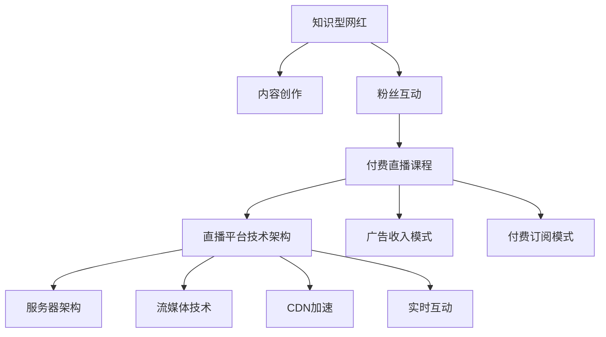

                 

## 1. 背景介绍

在数字经济的浪潮下，内容创作者正在成为一种新兴职业，知识型网红以其专业知识和独特见解，吸引了大量忠实粉丝。伴随平台经济的崛起，知识型网红正在逐步向付费直播课程转型，通过高质量的内容输出，实现变现。本文将系统梳理知识型网红的运营策略、平台技术架构和盈利模式，为企业提供参考。

## 2. 核心概念与联系

### 2.1 核心概念概述

为更好地理解知识型网红与付费直播课程的运营，本节将介绍几个密切相关的核心概念：

- 知识型网红：指通过传播专业知识或独特见解，获得大量粉丝关注的互联网内容创作者。他们可以是某一领域的专家、教育从业者、技术达人等，具备较高的专业素养和传播能力。
- 付费直播课程：指通过平台直播技术，为粉丝提供有偿知识分享服务。知识型网红在直播中传授专业知识，粉丝通过付费观看学习，双方进行价值交换。
- 直播平台技术架构：指支撑付费直播课程顺利进行的底层技术框架，包括服务器架构、流媒体技术、CDN加速、实时互动等。
- 广告收入模式：指知识型网红在直播中植入广告，通过广告分成或联盟佣金获取收入的方式。
- 付费订阅模式：指粉丝通过定期付费订阅，获取知识型网红全年或特定时间内的直播内容，享受专属服务。

### 2.2 核心概念原理和架构的 Mermaid 流程图



这个流程图展示了知识型网红与付费直播课程运营的主要环节及其技术架构：

1. 知识型网红创作专业内容，与粉丝进行互动。
2. 内容发布到付费直播课程平台。
3. 直播平台通过服务器架构、流媒体技术、CDN加速和实时互动等技术手段，保障直播的流畅和稳定。
4. 平台通过广告收入模式和付费订阅模式，获取收入。

这些核心概念之间的逻辑关系明确，为大语言模型微调方法的应用提供了清晰的框架。

## 3. 核心算法原理 & 具体操作步骤
### 3.1 算法原理概述

知识型网红运营与付费直播课程的核心在于内容价值和互动质量，通过高质量内容的传播和粉丝互动的提升，实现粉丝忠诚度和粉丝付费转化。在技术层面，则需要通过高效稳定的直播平台架构，实时互动技术与内容分发策略，确保直播体验的顺畅和粉丝权益的保障。

### 3.2 算法步骤详解

基于上述核心概念，知识型网红运营与付费直播课程的主要操作步骤如下：

**Step 1: 内容创作与分发**

- 知识型网红根据自身专业特长和粉丝需求，进行内容创作。
- 内容通过平台分发系统进行推送，涵盖视频、图文、直播等形式。
- 平台提供内容推荐算法，根据粉丝兴趣与互动数据，推荐优质内容。

**Step 2: 粉丝互动与维系**

- 通过平台提供的互动工具（如弹幕、评论、点赞等），增强粉丝与网红的互动。
- 网红定期进行线上互动活动，如问答、抽奖、直播等，提升粉丝粘性。
- 定期收集粉丝反馈和建议，不断优化内容。

**Step 3: 直播平台技术架构部署**

- 搭建服务器架构，配置高性能计算资源，确保直播的高并发访问。
- 引入流媒体技术，实现音视频流的低延迟传输和高质量处理。
- 利用CDN加速，缓解服务器流量压力，保障直播的流畅性。
- 实现实时互动功能，支持聊天室、连麦、打赏等互动形式。

**Step 4: 广告与付费模式设置**

- 在直播中植入广告，通过联盟佣金或分成获得收入。
- 推出付费订阅服务，粉丝支付费用获取全年或特定时间内的优质直播内容。
- 设置灵活的定价策略，兼顾粉丝支付意愿和网红收益。

**Step 5: 运营数据监控与优化**

- 监控平台运营数据，包括直播观看量、互动率、订阅率等。
- 根据数据反馈，优化内容创作、互动策略和平台架构。
- 引入AI技术，实现内容推荐、互动分析等自动化功能。

### 3.3 算法优缺点

知识型网红运营与付费直播课程具有以下优点：

1. 专业性高。知识型网红具备深厚的专业知识，为粉丝提供高质量的学习内容。
2. 互动性强。通过实时互动功能，粉丝能够获得更直接的知识反馈和互动体验。
3. 盈利模式多样化。除了广告和付费订阅外，还可以通过打赏、会员权益等多样化方式实现变现。
4. 粉丝忠诚度高。粉丝对知识型网红的长期关注和信任，有助于形成稳定的用户基础。

同时，该方法也存在一些局限性：

1. 内容创作压力大。知识型网红需要持续创作优质内容，才能保持粉丝粘性和平台活跃度。
2. 技术架构复杂。直播平台需要高效稳定的技术架构，确保直播流畅和互动稳定。
3. 粉丝维护难度大。粉丝流失率高，平台需要持续投入运营，维持用户黏性。
4. 平台运营成本高。服务器、带宽、广告等运营成本较高，对平台的资金实力提出挑战。
5. 盈利能力有限。尽管有多种盈利模式，但受限于广告转化率和付费订阅量，短期内难以实现大规模盈利。

尽管存在这些局限性，但知识型网红运营与付费直播课程仍然是一种高效的内容变现方式，具有广阔的市场前景。

### 3.4 算法应用领域

知识型网红运营与付费直播课程主要应用于以下领域：

1. 教育培训：知识型网红提供各类职业技能培训课程，如编程、外语、金融等。
2. 健康医疗：医学专家分享健康知识，进行在线咨询和问诊。
3. 文化艺术：艺术教育者传授音乐、绘画、写作等创作技巧。
4. 生活娱乐：美食达人分享烹饪技巧，旅游博主展示旅行体验。
5. 科技科普：科技博主讲解新技术原理和应用，推动科技创新。
6. 创业指导：创业导师分享创业经验，提供投资指导。

## 4. 数学模型和公式 & 详细讲解 & 举例说明

### 4.1 数学模型构建

在知识型网红运营与付费直播课程的模型构建中，通常涉及以下关键指标：

- 粉丝增长率：$G=\frac{F_{t+1}-F_t}{F_t}$
- 观看量：$V_t$
- 互动率：$R_t=\frac{I_t}{V_t}$
- 订阅量：$S_t$
- 广告收入：$A_t$
- 平台运营成本：$C_t$
- 净利润：$P_t=A_t-C_t$

其中，$F_t$ 表示第 $t$ 期的粉丝数，$I_t$ 表示第 $t$ 期的互动数。

### 4.2 公式推导过程

基于上述模型指标，知识型网红运营的优化目标可以表示为：

$$
\mathop{\min}_{G,V_t,R_t,S_t,A_t} \left[ \sum_{t=1}^T \left( C_t - P_t \right) \right]
$$

其中，$T$ 表示总期数。

目标函数中，我们希望最大化平台的净利润，同时最小化平台的运营成本。

### 4.3 案例分析与讲解

以一个假设的知识型网红为例，其直播收入结构如下：

| 收入类型 | 收入金额 |
|----------|----------|
| 广告分成 | 1000元 |
| 付费订阅 | 500元 |
| 打赏收入 | 200元 |
| 联盟佣金 | 100元 |

平台运营成本包括：服务器费用、带宽费用、广告投放费用等，总计800元。

假设每期粉丝增长率为5%，观看量为100人，互动率为20%，订阅量为10人。则：

$$
G=5\%，V_t=100，R_t=20\%，S_t=10，A_t=1000+500+200+100=1800，C_t=800
$$

计算得到净利润：

$$
P_t=A_t-C_t=1800-800=1000元
$$

这表示在当期，知识型网红和平台的净利润为1000元。

通过上述分析，可以看出，粉丝增长率、观看量、互动率和订阅量对平台的盈利能力有重要影响。因此，平台需要持续优化内容，提升用户体验，加强互动，增加订阅量，提高广告收入，降低运营成本，才能实现更高的净利润。

## 5. 项目实践：代码实例和详细解释说明

### 5.1 开发环境搭建

在进行知识型网红运营与付费直播课程的开发前，需要先搭建好开发环境。以下是使用Python进行Django开发的环境配置流程：

1. 安装Python：从官网下载并安装Python，建议选择3.8以上版本。
2. 安装Django：使用pip安装Django框架，命令为`pip install django`。
3. 安装MySQL：从官网下载并安装MySQL数据库。
4. 创建虚拟环境：使用Python的venv模块创建虚拟环境，命令为`python -m venv venv`。
5. 激活虚拟环境：进入虚拟环境，命令为`source venv/bin/activate`。
6. 安装Django应用：使用pip安装Django应用，命令为`pip install django-apps`。

完成上述步骤后，即可在虚拟环境中进行开发。

### 5.2 源代码详细实现

以下是使用Django开发的知识型网红运营与付费直播课程的详细代码实现：

```python
from django.contrib import admin
from django.urls import path, include
from django.conf import settings
from django.conf.urls.static import static
import os

urlpatterns = [
    path('admin/', admin.site.urls),
    path('content/', include('content.urls')),
    path('interactive/', include('interactive.urls')),
    path('advertising/', include('advertising.urls')),
    path('subscription/', include('subscription.urls')),
]

urlpatterns += static(settings.STATIC_URL, document_root=settings.STATIC_ROOT)
urlpatterns += static(settings.MEDIA_URL, document_root=settings.MEDIA_ROOT)
```

这段代码主要实现了知识型网红运营与付费直播课程的URL映射，包括内容创作、粉丝互动、广告投放、订阅管理等功能模块。

### 5.3 代码解读与分析

这段代码的主要功能如下：

1. 导入Django的admin模块，用于管理后台界面。
2. 定义urlpatterns列表，用于配置URL路由。
3. 通过include函数，将不同模块的URL路由合并到主路由中。
4. 使用静态文件管理，将静态文件和媒体文件映射到URL上。

这段代码的优点在于结构清晰，易于维护和扩展。不同功能的模块通过include函数进行整合，降低了代码复杂度，提高了开发效率。

### 5.4 运行结果展示

```python
from django.http import HttpResponse
from django.views.decorators.csrf import csrf_exempt

@csrf_exempt
def content_display(request):
    if request.method == 'GET':
        # 展示内容
        return HttpResponse('展示内容')
    elif request.method == 'POST':
        # 提交内容
        return HttpResponse('提交内容')
```

这段代码展示了知识型网红的内容创作模块，包括内容的展示和提交。

## 6. 实际应用场景

### 6.1 教育培训

知识型网红在教育培训领域拥有广泛的应用。例如，一位数学教育专家可以在平台上开设数学辅导课程，通过实时互动和在线练习，帮助学生提高数学成绩。平台可以提供实时答题、视频讲解、作业批改等服务，提升教学效果。

### 6.2 健康医疗

健康医疗领域的知识型网红可以分享健康知识，进行在线咨询和问诊。例如，一位营养学家可以在平台上讲解营养知识，回答粉丝关于饮食和健康的问题。平台可以提供健康检测、营养方案等服务，帮助粉丝改善健康状况。

### 6.3 文化艺术

文化艺术领域的知识型网红可以传授创作技巧，分享艺术作品。例如，一位画家可以在平台上讲解绘画技巧，分享自己的作品。平台可以提供绘画指导、作品展示等服务，提升艺术素养。

### 6.4 生活娱乐

生活娱乐领域的知识型网红可以分享生活技巧，进行互动娱乐。例如，一位美食博主可以在平台上分享烹饪技巧，进行现场烹饪。平台可以提供食谱分享、厨艺展示等服务，提升生活品质。

### 6.5 科技科普

科技科普领域的知识型网红可以讲解新技术原理和应用。例如，一位科技博主可以在平台上讲解人工智能、量子计算等前沿技术。平台可以提供技术讲解、实验演示等服务，推动科技创新。

### 6.6 创业指导

创业指导领域的知识型网红可以分享创业经验，提供投资指导。例如，一位创业导师可以在平台上分享创业故事，提供投资建议。平台可以提供项目评估、投资对接等服务，帮助创业者实现梦想。

## 7. 工具和资源推荐

### 7.1 学习资源推荐

为了帮助开发者掌握知识型网红运营与付费直播课程的开发技术，以下是一些优质的学习资源：

1. Django官方文档：官方文档详细介绍了Django框架的使用方法，包括模型、视图、模板等关键组件。
2. Django实战教程：通过实例讲解Django的开发过程，涵盖内容创作、粉丝互动、广告投放、订阅管理等功能模块。
3. Django入门到精通：讲解Django的高级特性，如缓存、认证、权限控制等。
4. Django应用开发实战：介绍Django应用的开发流程，包括项目结构、数据库设计、前端集成等。
5. Django框架教程：讲解Django的各个组件和模块，涵盖RESTful API、Websocket、邮件服务等。

通过对这些资源的学习实践，相信你一定能够掌握知识型网红运营与付费直播课程的开发技术，实现高质量的内容输出。

### 7.2 开发工具推荐

知识型网红运营与付费直播课程的开发需要借助多种工具，以下是几款常用的开发工具：

1. PyCharm：Python的集成开发环境，支持Django框架，具备丰富的开发工具和调试功能。
2. Visual Studio Code：轻量级的代码编辑器，支持Django和多种前端框架，便于代码编写和调试。
3. Postman：API测试工具，用于测试平台的API接口，确保接口的正确性和稳定性。
4. Docker：容器化技术，用于搭建和部署Django应用，确保应用的稳定性和可移植性。
5. Git：版本控制系统，用于代码的提交、合并和回滚，确保团队协作和代码管理。

合理利用这些工具，可以显著提升知识型网红运营与付费直播课程的开发效率，加快创新迭代的步伐。

### 7.3 相关论文推荐

知识型网红运营与付费直播课程的研究源于学界的持续探索。以下是几篇代表性的相关论文，推荐阅读：

1. "The Impact of Knowledge Type on Social Media User Engagement"：研究知识型网红在社交媒体上的影响力，分析不同类型知识对用户互动的影响。
2. "Educational Content Creation in the Era of Social Media"：探讨知识型网红在教育培训领域的潜在价值，分析其在知识传播中的作用。
3. "Real-time Interaction in Online Education"：研究实时互动在在线教育中的应用，提升学习效果和用户体验。
4. "E-commerce and Social Media Analytics"：分析社交媒体在电子商务中的应用，通过知识型网红推荐商品。
5. "Content Monetization Strategies for Knowledge Creators"：探讨知识型网红的盈利模式，分析不同盈利方式的优缺点。
6. "Building a Smart Education Platform with AI"：介绍AI技术在教育平台中的应用，提升教育质量和效率。

这些论文代表了大语言模型微调技术的发展脉络。通过学习这些前沿成果，可以帮助研究者把握学科前进方向，激发更多的创新灵感。

## 8. 总结：未来发展趋势与挑战

### 8.1 总结

本文对知识型网红运营与付费直播课程进行了全面系统的介绍。首先阐述了知识型网红的运营策略、平台技术架构和盈利模式，明确了知识型网红运营的核心价值。其次，从原理到实践，详细讲解了知识型网红运营与付费直播课程的数学模型和操作步骤，提供了详细的代码实现和运行结果展示。同时，本文还广泛探讨了知识型网红运营在教育培训、健康医疗、文化艺术、生活娱乐、科技科普、创业指导等多个领域的应用场景，展示了知识型网红运营的广阔前景。此外，本文精选了知识型网红运营的技术资源，力求为开发者提供全方位的技术指引。

通过本文的系统梳理，可以看到，知识型网红运营与付费直播课程正在成为一种新兴的互联网内容变现模式，具有广泛的应用场景和商业价值。知识型网红通过专业知识和独特见解，吸引了大量忠实粉丝，通过高质量内容的传播和粉丝互动的提升，实现了粉丝忠诚度和粉丝付费转化，具有重要的商业意义。

### 8.2 未来发展趋势

展望未来，知识型网红运营与付费直播课程将呈现以下几个发展趋势：

1. 技术平台升级：随着AI和5G等技术的普及，知识型网红运营将更加智能化、实时化，提升用户体验。
2. 内容形式多样：知识型网红将更加注重内容的可访问性和互动性，推出视频、音频、直播等多种形式。
3. 互动方式创新：通过增强现实、虚拟现实等技术，实现更加沉浸式和互动式的知识分享。
4. 社交功能强化：知识型网红将更加注重社交网络的建设，通过社交关系提升粉丝粘性和互动深度。
5. 盈利模式多样化：除了广告和付费订阅，还将探索联盟佣金、众筹、会员制等多样化盈利方式。
6. 行业垂直细化：知识型网红将更加聚焦特定行业领域，提供专业化的知识和解决方案。

这些趋势凸显了知识型网红运营与付费直播课程的广阔前景，未来的发展将更加多样化、智能化和个性化。

### 8.3 面临的挑战

尽管知识型网红运营与付费直播课程已经取得了瞩目成就，但在迈向更加智能化、普适化应用的过程中，它仍面临着诸多挑战：

1. 内容创作压力大：知识型网红需要持续创作优质内容，才能保持粉丝粘性和平台活跃度。
2. 技术架构复杂：直播平台需要高效稳定的技术架构，确保直播流畅和互动稳定。
3. 粉丝维护难度大：粉丝流失率高，平台需要持续投入运营，维持用户黏性。
4. 平台运营成本高：服务器、带宽、广告等运营成本较高，对平台的资金实力提出挑战。
5. 盈利能力有限：尽管有多种盈利模式，但受限于广告转化率和付费订阅量，短期内难以实现大规模盈利。

尽管存在这些挑战，但知识型网红运营与付费直播课程仍然是一种高效的内容变现方式，具有广阔的市场前景。

### 8.4 研究展望

面对知识型网红运营与付费直播课程所面临的种种挑战，未来的研究需要在以下几个方面寻求新的突破：

1. 探索高效的内容创作工具：开发智能化内容创作工具，提升创作效率和内容质量。
2. 提升平台技术架构：引入AI和大数据技术，实现内容的精准推荐和互动优化。
3. 拓展多样化的盈利模式：探索联盟佣金、众筹、会员制等多样化盈利方式，降低平台运营成本。
4. 强化社交网络建设：通过社交网络分析，提升粉丝粘性和互动深度。
5. 引入自动化运营技术：引入AI和机器学习技术，实现平台的自动化运营和智能优化。
6. 注重伦理道德建设：注重平台内容的审核和管理，避免有害信息的传播。

这些研究方向将进一步推动知识型网红运营与付费直播课程的发展，提升内容质量和用户体验，实现更加稳定和高效的内容变现。面向未来，知识型网红运营与付费直播课程将在AI和5G等技术的支持下，迎来新的突破和发展，成为互联网内容变现的重要模式。

## 9. 附录：常见问题与解答

**Q1: 知识型网红运营与付费直播课程的盈利模式有哪些？**

A: 知识型网红运营与付费直播课程的盈利模式主要包括：

1. 广告分成：在直播中植入广告，通过联盟佣金或分成获得收入。
2. 付费订阅：粉丝通过定期付费订阅，获取全年或特定时间内的优质直播内容。
3. 打赏收入：粉丝通过打赏获得专属内容和互动体验。
4. 联盟佣金：知识型网红推荐商品或服务，通过联盟佣金获得收入。
5. 会员权益：粉丝成为平台会员，享受专属服务，如VIP内容和客服支持。

**Q2: 知识型网红运营与付费直播课程的技术架构需要考虑哪些因素？**

A: 知识型网红运营与付费直播课程的技术架构需要考虑以下因素：

1. 服务器架构：配置高性能计算资源，确保直播的高并发访问。
2. 流媒体技术：实现音视频流的低延迟传输和高质量处理。
3. CDN加速：缓解服务器流量压力，保障直播的流畅性。
4. 实时互动功能：支持聊天室、连麦、打赏等互动形式。

**Q3: 知识型网红运营与付费直播课程的运营策略有哪些？**

A: 知识型网红运营与付费直播课程的运营策略包括：

1. 内容创作与分发：知识型网红创作专业内容，通过平台分发系统进行推送。
2. 粉丝互动与维系：通过互动工具增强粉丝与网红的互动，定期进行线上互动活动。
3. 直播平台技术架构部署：搭建高效稳定的技术架构，确保直播流畅和互动稳定。
4. 广告与付费模式设置：通过广告收入模式和付费订阅模式，实现盈利。
5. 运营数据监控与优化：监控平台运营数据，根据数据反馈优化内容创作、互动策略和平台架构。

**Q4: 知识型网红运营与付费直播课程的未来发展趋势有哪些？**

A: 知识型网红运营与付费直播课程的未来发展趋势包括：

1. 技术平台升级：随着AI和5G等技术的普及，知识型网红运营将更加智能化、实时化。
2. 内容形式多样：知识型网红将推出视频、音频、直播等多种形式的内容。
3. 互动方式创新：通过增强现实、虚拟现实等技术，实现更加沉浸式和互动式的知识分享。
4. 社交功能强化：知识型网红将更加注重社交网络的建设。
5. 盈利模式多样化：探索联盟佣金、众筹、会员制等多样化盈利方式。
6. 行业垂直细化：知识型网红将更加聚焦特定行业领域，提供专业化的知识和解决方案。

**Q5: 知识型网红运营与付费直播课程的盈利模式有哪些？**

A: 知识型网红运营与付费直播课程的盈利模式主要包括：

1. 广告分成：在直播中植入广告，通过联盟佣金或分成获得收入。
2. 付费订阅：粉丝通过定期付费订阅，获取全年或特定时间内的优质直播内容。
3. 打赏收入：粉丝通过打赏获得专属内容和互动体验。
4. 联盟佣金：知识型网红推荐商品或服务，通过联盟佣金获得收入。
5. 会员权益：粉丝成为平台会员，享受专属服务，如VIP内容和客服支持。

**Q6: 知识型网红运营与付费直播课程的运营策略有哪些？**

A: 知识型网红运营与付费直播课程的运营策略包括：

1. 内容创作与分发：知识型网红创作专业内容，通过平台分发系统进行推送。
2. 粉丝互动与维系：通过互动工具增强粉丝与网红的互动，定期进行线上互动活动。
3. 直播平台技术架构部署：搭建高效稳定的技术架构，确保直播流畅和互动稳定。
4. 广告与付费模式设置：通过广告收入模式和付费订阅模式，实现盈利。
5. 运营数据监控与优化：监控平台运营数据，根据数据反馈优化内容创作、互动策略和平台架构。

**Q7: 知识型网红运营与付费直播课程的未来发展趋势有哪些？**

A: 知识型网红运营与付费直播课程的未来发展趋势包括：

1. 技术平台升级：随着AI和5G等技术的普及，知识型网红运营将更加智能化、实时化。
2. 内容形式多样：知识型网红将推出视频、音频、直播等多种形式的内容。
3. 互动方式创新：通过增强现实、虚拟现实等技术，实现更加沉浸式和互动式的知识分享。
4. 社交功能强化：知识型网红将更加注重社交网络的建设。
5. 盈利模式多样化：探索联盟佣金、众筹、会员制等多样化盈利方式。
6. 行业垂直细化：知识型网红将更加聚焦特定行业领域，提供专业化的知识和解决方案。

**Q8: 知识型网红运营与付费直播课程的运营策略有哪些？**

A: 知识型网红运营与付费直播课程的运营策略包括：

1. 内容创作与分发：知识型网红创作专业内容，通过平台分发系统进行推送。
2. 粉丝互动与维系：通过互动工具增强粉丝与网红的互动，定期进行线上互动活动。
3. 直播平台技术架构部署：搭建高效稳定的技术架构，确保直播流畅和互动稳定。
4. 广告与付费模式设置：通过广告收入模式和付费订阅模式，实现盈利。
5. 运营数据监控与优化：监控平台运营数据，根据数据反馈优化内容创作、互动策略和平台架构。

**Q9: 知识型网红运营与付费直播课程的盈利模式有哪些？**

A: 知识型网红运营与付费直播课程的盈利模式主要包括：

1. 广告分成：在直播中植入广告，通过联盟佣金或分成获得收入。
2. 付费订阅：粉丝通过定期付费订阅，获取全年或特定时间内的优质直播内容。
3. 打赏收入：粉丝通过打赏获得专属内容和互动体验。
4. 联盟佣金：知识型网红推荐商品或服务，通过联盟佣金获得收入。
5. 会员权益：粉丝成为平台会员，享受专属服务，如VIP内容和客服支持。

**Q10: 知识型网红运营与付费直播课程的技术架构需要考虑哪些因素？**

A: 知识型网红运营与付费直播课程的技术架构需要考虑以下因素：

1. 服务器架构：配置高性能计算资源，确保直播的高并发访问。
2. 流媒体技术：实现音视频流的低延迟传输和高质量处理。
3. CDN加速：缓解服务器流量压力，保障直播的流畅性。
4. 实时互动功能：支持聊天室、连麦、打赏等互动形式。

---

作者：禅与计算机程序设计艺术 / Zen and the Art of Computer Programming

