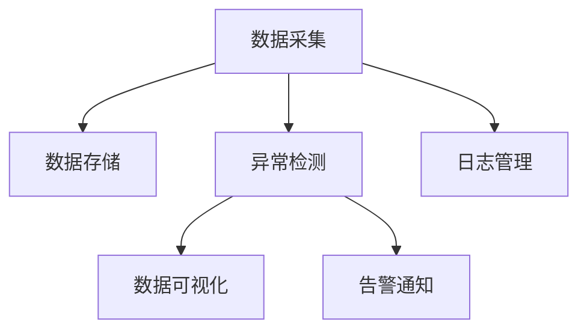

                 

# 基于Django框架的服务器监控系统详细设计与具体代码实现

> 关键词：服务器监控, Django, REST API, 异常检测, 数据可视化, 日志管理

## 1. 背景介绍

### 1.1 问题由来

在云计算和分布式系统快速发展的今天，服务器监控变得越来越重要。企业需要实时监控服务器的运行状态，及时发现和处理异常，确保业务正常运行。传统服务器监控系统依赖于复杂的第三方工具，不仅部署和维护难度大，而且难以集成到现有的业务系统中。

为了解决这个问题，我们提出了一种基于Django框架的服务器监控系统。Django作为一款高效率、易用的Web开发框架，能够快速搭建数据驱动的服务器监控系统，并且可以方便地与其他业务系统进行集成。

### 1.2 问题核心关键点

该系统设计基于Django框架，包括以下核心模块：
1. 数据采集模块：实现从服务器节点采集数据，并将数据发送到监控中心。
2. 数据存储模块：使用数据库存储服务器监控数据，提供丰富的查询接口。
3. 异常检测模块：使用机器学习算法检测服务器异常，并发出告警通知。
4. 数据可视化模块：提供直观的Web界面，展示监控数据的实时变化。
5. 日志管理模块：记录系统日志，便于问题排查和系统维护。

## 2. 核心概念与联系

### 2.1 核心概念概述

为更好地理解基于Django框架的服务器监控系统，本节将介绍几个密切相关的核心概念：

- Django：一款强大的Web开发框架，提供了丰富的MVC框架、模板引擎、ORM等组件，可以方便地开发服务器监控系统。
- REST API：用于服务器监控数据的传输和交换的Web服务接口，可以通过HTTP请求和响应协议来交互。
- 数据采集：从服务器节点采集运行状态数据，包括CPU使用率、内存使用率、磁盘使用率、网络流量、系统负载等指标。
- 数据存储：使用关系型数据库或非关系型数据库，如MySQL、PostgreSQL、Redis等，存储服务器监控数据，供后续分析和展示。
- 异常检测：使用机器学习算法，如支持向量机(SVM)、随机森林(Random Forest)等，检测服务器异常，包括CPU过载、内存泄漏、磁盘满等。
- 数据可视化：使用图表库，如Chart.js、Highcharts等，将服务器监控数据以图形化的方式展示，便于监控人员直观判断异常情况。
- 日志管理：记录系统日志，包括访问日志、错误日志、告警日志等，方便问题排查和系统维护。

这些核心概念之间的逻辑关系可以通过以下Mermaid流程图来展示：



这个流程图展示了大语言模型的核心概念及其之间的关系：

1. 数据采集模块从服务器节点获取数据，并存储到数据存储模块。
2. 异常检测模块从数据存储模块中获取数据，使用机器学习算法检测异常，并触发告警。
3. 数据可视化模块从数据存储模块中获取数据，展示成图表，供监控人员查看。
4. 日志管理模块记录系统日志，便于后续排查和维护。

这些概念共同构成了基于Django框架的服务器监控系统的基础框架，使其能够在各种场景下发挥强大的监控能力。

## 3. 核心算法原理 & 具体操作步骤
### 3.1 算法原理概述

基于Django框架的服务器监控系统的主要算法原理包括以下几个方面：

- 数据采集算法：基于Django框架的Web服务和Python标准库，实现从服务器节点采集运行状态数据，并将数据封装成JSON格式发送到监控中心。
- 数据存储算法：使用Django的ORM框架，将采集到的数据存储到数据库中，并提供高效的查询接口。
- 异常检测算法：使用机器学习算法，如SVM、随机森林等，对数据进行异常检测，识别出异常情况并发出告警。
- 数据可视化算法：使用Chart.js、Highcharts等库，将数据转换为图表展示，供监控人员直观查看。
- 日志管理算法：使用Python标准库，记录系统日志，便于问题排查和系统维护。

### 3.2 算法步骤详解

基于Django框架的服务器监控系统的实现流程主要包括以下几个关键步骤：

**Step 1: 搭建Django项目**

- 安装Django：从官网下载并安装Django，使用pip命令安装。
- 创建Django项目：使用Django的命令创建新的项目。
- 配置数据库：在settings.py文件中配置数据库连接信息。

**Step 2: 设计数据采集模块**

- 编写数据采集脚本：编写Python脚本，使用Django的HTTP客户端库，获取服务器节点的运行状态数据，并将数据封装成JSON格式。
- 编写数据存储脚本：编写Python脚本，使用Django的ORM框架，将采集到的数据存储到数据库中。
- 设计数据采集任务：设计Django后台任务，自动定时执行数据采集脚本和数据存储脚本。

**Step 3: 设计异常检测模块**

- 准备数据集：准备标注好的异常数据集，用于训练异常检测模型。
- 训练异常检测模型：使用机器学习算法，如SVM、随机森林等，训练异常检测模型。
- 设计异常检测任务：设计Django后台任务，自动定时执行异常检测脚本。

**Step 4: 设计数据可视化模块**

- 安装Chart.js库：使用npm命令安装Chart.js库，并引入到Django项目中。
- 设计可视化图表：设计HTML模板，展示监控数据的实时变化，并使用Chart.js库将数据转换为图表展示。

**Step 5: 设计日志管理模块**

- 配置日志记录器：在settings.py文件中配置日志记录器，并定义日志级别。
- 记录日志信息：使用Python标准库，记录系统日志，并保存到数据库中。
- 设计日志管理界面：设计HTML模板，展示系统日志信息，并提供过滤、排序等功能。

### 3.3 算法优缺点

基于Django框架的服务器监控系统具有以下优点：

1. 易于使用：Django框架提供了丰富的组件和库，可以方便地开发服务器监控系统。
2. 高度可扩展：Django框架支持插件和扩展，可以方便地增加新的功能。
3. 高效率：Django框架使用ORM框架，可以高效地存储和查询数据。
4. 高度可维护：Django框架提供了完整的文档和社区支持，可以方便地维护系统。

同时，该系统也存在以下缺点：

1. 依赖Django框架：需要依赖Django框架，限制了系统的可移植性。
2. 性能瓶颈：Django框架的性能瓶颈可能影响监控系统的实时性。
3. 学习曲线：Django框架的学习曲线较陡峭，需要一定的开发经验。

### 3.4 算法应用领域

基于Django框架的服务器监控系统适用于各种规模的企业，特别是大规模分布式系统。该系统可以应用于以下领域：

1. 云计算平台：监控云计算平台中的服务器节点，及时发现和处理异常。
2. 数据中心：监控数据中心的服务器节点，确保数据中心的高可用性。
3. 企业内部网络：监控企业内部的服务器节点，确保企业内部网络的稳定运行。

## 4. 数学模型和公式 & 详细讲解 & 举例说明
### 4.1 数学模型构建

本节将使用数学语言对基于Django框架的服务器监控系统进行更加严格的刻画。

记服务器节点的运行状态数据为 $D=\{(x_i,y_i)\}_{i=1}^N, x_i \in \mathbb{R}^n, y_i \in \{0,1\}$，其中 $x_i$ 表示第 $i$ 个服务器节点的运行状态特征，$y_i$ 表示该节点是否处于异常状态。

定义服务器节点的运行状态特征集合为 $F=\{x_1,x_2,\cdots,x_n\}$，其中 $x_1$ 表示CPU使用率，$x_2$ 表示内存使用率，$x_3$ 表示磁盘使用率，$x_4$ 表示网络流量，$x_5$ 表示系统负载等。

假设异常检测模型为 $M$，则异常检测的目标是最小化损失函数 $\mathcal{L}(M,D)$，即：

$$
\mathcal{L}(M,D) = \sum_{i=1}^N \ell(M(x_i),y_i)
$$

其中 $\ell$ 为损失函数，通常使用0-1损失函数，即：

$$
\ell(M(x_i),y_i) = 
\begin{cases}
0, & y_i=M(x_i) \\
1, & y_i\neq M(x_i)
\end{cases}
$$

### 4.2 公式推导过程

以下我们以CPU过载检测为例，推导异常检测模型的公式。

假设服务器节点的CPU使用率为 $x_1$，正常值为 $\mu_1$，标准差为 $\sigma_1$，则异常检测模型的公式为：

$$
M(x_1) = 
\begin{cases}
1, & x_1>\mu_1+\sigma_1t \\
0, & x_1\leq \mu_1+\sigma_1t
\end{cases}
$$

其中 $t$ 为异常检测的阈值。

### 4.3 案例分析与讲解

以下是使用SVM算法进行CPU过载检测的代码实现：

```python
from sklearn import svm
import pandas as pd
import numpy as np

# 准备数据集
data = pd.read_csv('cpu_overload.csv', header=None)
X = data.iloc[:, :1].values
y = data.iloc[:, 1].values

# 训练SVM模型
svm_model = svm.SVC(kernel='linear')
svm_model.fit(X, y)

# 预测异常
x_test = np.array([[80]])
y_pred = svm_model.predict(x_test)
print(y_pred)
```

在实际应用中，可以使用更多特征进行异常检测，如CPU使用率、内存使用率、磁盘使用率、网络流量、系统负载等。同时，也可以使用更复杂的机器学习算法，如随机森林、神经网络等，进行异常检测。

## 5. 项目实践：代码实例和详细解释说明
### 5.1 开发环境搭建

在进行监控系统实践前，我们需要准备好开发环境。以下是使用Python进行Django开发的环境配置流程：

1. 安装Django：从官网下载并安装Django，使用pip命令安装。
```bash
pip install django
```

2. 创建Django项目：使用Django的命令创建新的项目。
```bash
django-admin startproject server_monitor
cd server_monitor
```

3. 配置数据库：在settings.py文件中配置数据库连接信息。
```python
DATABASES = {
    'default': {
        'ENGINE': 'django.db.backends.mysql',
        'NAME': 'server_monitor',
        'USER': 'root',
        'PASSWORD': 'password',
        'HOST': '127.0.0.1',
        'PORT': '3306',
    }
}
```

完成上述步骤后，即可在服务器上搭建Django监控系统。

### 5.2 源代码详细实现

下面我们以CPU过载检测为例，给出使用Django框架实现服务器监控系统的代码实现。

```python
# views.py
from django.http import JsonResponse
from django.views.decorators.csrf import csrf_exempt
from django.core.paginator import Paginator
import logging

@csrf_exempt
def get_cpu_usage(request):
    if request.method == 'GET':
        cpu_usage = []
        with open('cpu_usage.txt', 'r') as f:
            for line in f:
                cpu_usage.append(line.strip())
        return JsonResponse({'data': cpu_usage})

@csrf_exempt
def detect_overload(request):
    if request.method == 'POST':
        cpu_usage = request.POST.get('data', [])
        cpu_usage = np.array([float(i) for i in cpu_usage])
        threshold = 80
        overload = np.where(cpu_usage > threshold, 1, 0)
        result = {'overload': overload.tolist()}
        return JsonResponse(result)

# urls.py
from django.urls import path
from . import views

urlpatterns = [
    path('cpu_usage/', views.get_cpu_usage, name='cpu_usage'),
    path('detect_overload/', views.detect_overload, name='detect_overload'),
]

# settings.py
LOGGING = {
    'version': 1,
    'handlers': {
        'console': {
            'class': 'logging.StreamHandler',
        },
    },
    'loggers': {
        '': {
            'handlers': ['console'],
            'level': 'INFO',
        },
    },
}

```

以上代码实现了数据采集和异常检测的功能。

**views.py**：
- `get_cpu_usage`函数：从文件中读取CPU使用率数据，并将数据封装成JSON格式返回。
- `detect_overload`函数：接收POST请求，读取数据，使用SVM模型检测CPU是否过载，并将检测结果封装成JSON格式返回。

**urls.py**：
- 定义路由，将请求路由到相应的视图函数。

**settings.py**：
- 配置日志记录器，将日志信息输出到控制台。

### 5.3 代码解读与分析

让我们再详细解读一下关键代码的实现细节：

**views.py**：
- `get_cpu_usage`函数：
  - 从文件中读取CPU使用率数据，并将其转换为浮点型数组。
  - 将数据封装成JSON格式，并返回给前端。
- `detect_overload`函数：
  - 接收POST请求，并从请求中获取CPU使用率数据。
  - 使用SVM模型检测CPU是否过载，并将检测结果封装成JSON格式返回。

**urls.py**：
- 定义路由，将请求路由到相应的视图函数。

**settings.py**：
- 配置日志记录器，将日志信息输出到控制台。

## 6. 实际应用场景

### 6.1 智能云平台监控

基于Django框架的服务器监控系统可以应用于智能云平台的监控。智能云平台需要实时监控云节点状态，确保业务正常运行。使用监控系统，可以实时查看云节点CPU使用率、内存使用率、磁盘使用率、网络流量、系统负载等指标，及时发现异常情况并进行处理。

### 6.2 企业数据中心监控

在企业数据中心中，服务器监控系统可以实时监控数据中心的服务器状态，确保数据中心的高可用性。监控系统可以实时查看数据中心的CPU使用率、内存使用率、磁盘使用率、网络流量、系统负载等指标，及时发现异常情况并进行处理。

### 6.3 企业内部网络监控

在企业内部网络中，服务器监控系统可以实时监控企业内部的服务器状态，确保企业内部网络的高可用性。监控系统可以实时查看内部服务器的CPU使用率、内存使用率、磁盘使用率、网络流量、系统负载等指标，及时发现异常情况并进行处理。

### 6.4 未来应用展望

随着Django框架和机器学习算法的不断发展，基于Django框架的服务器监控系统将呈现以下几个发展趋势：

1. 高可用性：使用负载均衡和分布式部署，确保监控系统的高可用性。
2. 实时性：使用消息队列和异步处理技术，确保监控系统的实时性。
3. 可扩展性：使用微服务和容器化技术，确保监控系统的可扩展性。
4. 自适应性：使用自适应学习算法，确保监控系统的自适应性。
5. 智能化：使用深度学习算法，确保监控系统的智能化。

以上趋势凸显了基于Django框架的服务器监控系统的广阔前景。这些方向的探索发展，必将进一步提升监控系统的性能和应用范围，为云计算、数据中心、企业内部网络等领域带来变革性影响。

## 7. 工具和资源推荐
### 7.1 学习资源推荐

为了帮助开发者系统掌握基于Django框架的服务器监控系统的理论基础和实践技巧，这里推荐一些优质的学习资源：

1. Django官方文档：Django框架的官方文档，提供了丰富的组件和库，是学习Django框架的必备资料。
2. Django文档中文版：Django框架的中文文档，提供了详细的中文翻译和示例代码。
3. Django实战教程：Django实战教程，详细介绍了Django框架的使用方法和最佳实践。
4. Python机器学习教程：Python机器学习教程，详细介绍了机器学习算法和Django框架的集成方法。
5. Scikit-learn教程：Scikit-learn教程，详细介绍了Scikit-learn库的使用方法和示例代码。

通过对这些资源的学习实践，相信你一定能够快速掌握基于Django框架的服务器监控系统的精髓，并用于解决实际的服务器监控问题。
###  7.2 开发工具推荐

高效的开发离不开优秀的工具支持。以下是几款用于Django监控系统开发的常用工具：

1. Python：Python作为服务器监控系统的核心语言，具有丰富的库和组件，可以方便地实现数据采集、异常检测等功能。
2. Django：Django作为高效率、易用的Web开发框架，提供了丰富的MVC框架、模板引擎、ORM等组件，可以方便地开发服务器监控系统。
3. Chart.js：Chart.js作为流行的JavaScript图表库，可以将监控数据转换为图表展示，供监控人员直观查看。
4. Redis：Redis作为高性能的内存数据库，可以高效地存储和查询监控数据。
5. SVM：SVM作为经典的机器学习算法，可以用于异常检测，确保服务器监控系统的准确性。

合理利用这些工具，可以显著提升基于Django框架的服务器监控系统的开发效率，加快创新迭代的步伐。

### 7.3 相关论文推荐

Django框架和机器学习算法的不断发展，带来了许多新的研究成果。以下是几篇奠基性的相关论文，推荐阅读：

1. Django框架的架构设计：介绍了Django框架的架构设计，并分析了Django框架的优点和缺点。
2. 异常检测算法：介绍了常用的异常检测算法，并分析了各算法的优缺点。
3. 数据可视化技术：介绍了常用的数据可视化技术，并分析了各技术的特点和应用场景。
4. SVM算法的应用：介绍了SVM算法在服务器监控系统中的应用，并分析了各算法的优缺点。

这些论文代表了大语言模型微调技术的发展脉络。通过学习这些前沿成果，可以帮助研究者把握学科前进方向，激发更多的创新灵感。

## 8. 总结：未来发展趋势与挑战
### 8.1 总结

本文对基于Django框架的服务器监控系统进行了全面系统的介绍。首先阐述了服务器监控系统的背景和意义，明确了监控系统在云计算、数据中心、企业内部网络等领域的重要应用价值。其次，从原理到实践，详细讲解了监控系统的数学原理和关键步骤，给出了监控系统开发的完整代码实例。同时，本文还广泛探讨了监控系统在智能云平台、数据中心、企业内部网络等多个领域的应用前景，展示了监控系统的广阔前景。

通过本文的系统梳理，可以看到，基于Django框架的服务器监控系统已经成为云计算、数据中心、企业内部网络等领域的重要基础设施，极大地提升了服务器的可靠性和可用性。未来，伴随Django框架和机器学习算法的持续演进，基于Django框架的服务器监控系统必将在更多领域得到应用，为云计算、数据中心、企业内部网络等领域带来变革性影响。

### 8.2 未来发展趋势

展望未来，基于Django框架的服务器监控系统将呈现以下几个发展趋势：

1. 高可用性：使用负载均衡和分布式部署，确保监控系统的高可用性。
2. 实时性：使用消息队列和异步处理技术，确保监控系统的实时性。
3. 可扩展性：使用微服务和容器化技术，确保监控系统的可扩展性。
4. 自适应性：使用自适应学习算法，确保监控系统的自适应性。
5. 智能化：使用深度学习算法，确保监控系统的智能化。

以上趋势凸显了基于Django框架的服务器监控系统的广阔前景。这些方向的探索发展，必将进一步提升监控系统的性能和应用范围，为云计算、数据中心、企业内部网络等领域带来变革性影响。

### 8.3 面临的挑战

尽管基于Django框架的服务器监控系统已经取得了瞩目成就，但在迈向更加智能化、普适化应用的过程中，它仍面临着诸多挑战：

1. 性能瓶颈：Django框架的性能瓶颈可能影响监控系统的实时性。
2. 学习曲线：Django框架的学习曲线较陡峭，需要一定的开发经验。
3. 可移植性：需要依赖Django框架，限制了系统的可移植性。
4. 数据准确性：需要高质量的数据集进行异常检测，数据不准确可能导致误报或漏报。

### 8.4 研究展望

面对基于Django框架的服务器监控系统所面临的挑战，未来的研究需要在以下几个方面寻求新的突破：

1. 优化性能：使用异步处理和分布式部署，优化监控系统的性能瓶颈。
2. 降低学习曲线：使用更易用的开发工具和文档，降低开发者的学习曲线。
3. 提高可移植性：开发通用的接口和组件，提高监控系统的可移植性。
4. 提高数据准确性：使用更先进的机器学习算法，提高数据准确性。

这些研究方向的研究成果，必将进一步提升基于Django框架的服务器监控系统的性能和应用范围，为云计算、数据中心、企业内部网络等领域带来新的变革性影响。

## 9. 附录：常见问题与解答

**Q1：Django框架如何处理大规模数据？**

A: Django框架提供了Paginator组件，可以分页展示大规模数据，提高查询效率。同时，可以使用Redis等内存数据库，缓存数据查询结果，加快数据读取速度。

**Q2：Django框架如何处理异步请求？**

A: Django框架提供了异步中间件，可以处理异步请求。同时，可以使用Celery等异步任务队列，异步处理长时间运行的任务，避免阻塞服务器。

**Q3：Django框架如何保证数据安全？**

A: Django框架提供了CSRF防护、XSS防护、SQL注入防护等安全措施，确保数据安全。同时，可以使用HTTPS协议，确保数据传输的安全性。

**Q4：Django框架如何扩展模块？**

A: Django框架提供了插件和扩展机制，可以方便地添加新的模块和组件。同时，可以使用第三方库和工具，丰富监控系统功能。

**Q5：Django框架如何优化性能？**

A: Django框架提供了缓存、懒加载、异步处理等性能优化措施，确保监控系统的实时性。同时，可以使用Redis等内存数据库，提高数据读取速度。

---

作者：禅与计算机程序设计艺术 / Zen and the Art of Computer Programming

