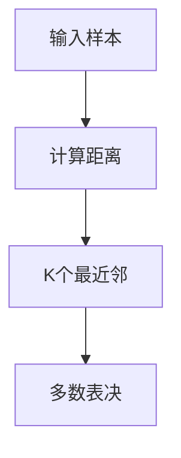

                 

## 1. 背景介绍

在机器学习领域，分类器（Classifier）是一种常见而重要的算法，用于将未知样本分到预定义的类别中。传统的分类算法，如决策树（Decision Tree）、支持向量机（Support Vector Machine, SVM）和朴素贝叶斯（Naive Bayes），对于小规模数据集往往表现良好。然而，随着数据量的增加，这些算法的计算复杂度迅速上升，性能受到影响。

为了解决这一问题，一种高效且易于实现的分类算法应运而生——K-最近邻算法（K-Nearest Neighbor, KNN）。KNN算法利用样本之间的距离度量，通过选取距离最近的K个邻居进行分类。由于其简单直观、易于实现、且在大规模数据集上表现优异，KNN算法成为机器学习初学者入门的首选算法之一。

本博客将对基于KNN的数字分类器进行深入探讨，包括其原理、实现、应用及未来发展方向。

## 2. 核心概念与联系

### 2.1 核心概念概述

为了更好地理解基于KNN的数字分类器，首先介绍一些相关核心概念：

- **KNN算法**：基于样本之间距离度量进行分类的算法。给定一个测试样本，通过计算其与训练集样本的距离，选择距离最近的K个邻居进行多数表决，即可得到该样本的分类。

- **距离度量**：度量样本之间相似性的一种方法。常用的距离度量包括欧式距离、曼哈顿距离和余弦相似度等。

- **预处理**：在使用KNN算法前，通常需要对数据进行标准化、归一化等预处理，以保证各个特征之间在相同的尺度和范围内。

- **超参数**：KNN算法中需调整的参数，如K值、距离度量等。这些参数的选择直接影响算法的性能。

- **多分类**：当训练集中包含多个类别时，KNN算法需要进行多分类处理，即将KNN算法应用于每一个类别。

### 2.2 核心概念原理和架构的 Mermaid 流程图



上图中，A为输入样本，B为计算距离，C为选择K个最近邻，D为多数表决，表示KNN算法的核心流程。

## 3. 核心算法原理 & 具体操作步骤

### 3.1 算法原理概述

KNN算法的核心思想是利用样本之间的距离度量，选取距离最近的K个邻居进行分类。在多分类任务中，对于每个类别，KNN算法分别计算测试样本与训练集中属于该类别的样本的距离，并将距离最近的K个邻居进行多数表决。

具体来说，对于一个测试样本 $x$，KNN算法的流程如下：
1. 计算 $x$ 与训练集中所有样本的距离。
2. 选取距离最近的K个样本。
3. 对这K个样本所属的类别进行统计，得到每个类别的投票数。
4. 根据投票数，选择得票最多的类别作为 $x$ 的分类。

### 3.2 算法步骤详解

以下是KNN算法的详细步骤：

1. **数据准备**：收集并准备训练集 $D=\{(x_i, y_i)\}_{i=1}^n$，其中 $x_i$ 表示样本特征，$y_i$ 表示样本标签。

2. **标准化**：对训练集进行特征标准化或归一化处理，以确保各个特征在相同的尺度和范围内。

3. **计算距离**：计算测试样本 $x_t$ 与训练集中所有样本 $x_i$ 的距离。距离度量可以选用欧式距离、曼哈顿距离或余弦相似度等。

4. **选择K值**：选择合适的K值，即将距离最近的K个邻居用于分类。通常K值的选择需要根据具体问题进行调整，一般来说，K值不宜太小（避免过拟合），也不宜太大（避免欠拟合）。

5. **选择最近邻**：在训练集中选取距离最近的K个邻居。

6. **多数表决**：对K个最近邻的标签进行统计，得票最多的类别即为测试样本的分类。

### 3.3 算法优缺点

**优点**：
1. **简单易实现**：KNN算法简单易懂，实现难度较低，适合初学者入门。
2. **灵活性高**：可以根据具体问题调整K值和距离度量，适应性较强。
3. **准确率高**：在低维数据集上表现优异，准确率高。

**缺点**：
1. **计算复杂度高**：KNN算法在大规模数据集上的计算复杂度较高，需要计算每个测试样本与所有训练样本的距离，耗时较长。
2. **内存占用大**：需要存储所有训练样本，内存占用较大。
3. **易受噪声影响**：KNN算法对于噪声样本的敏感性较高，可能影响分类结果。

### 3.4 算法应用领域

KNN算法广泛应用于各类数字分类任务，如手写数字识别、图像分类、文本分类等。以下是一些具体应用领域：

- **手写数字识别**：通过计算测试样本与训练集中每个样本的欧式距离，选择距离最近的K个样本进行多数表决，即可得到测试样本的数字类别。

- **图像分类**：将图像转换为向量表示，计算测试图像与训练集中所有图像的距离，选取距离最近的K个图像进行分类。

- **文本分类**：将文本转换为向量表示，计算测试文本与训练集中所有文本的距离，选取距离最近的K个文本进行分类。

## 4. 数学模型和公式 & 详细讲解

### 4.1 数学模型构建

KNN算法可以用于分类和回归任务。本节将重点讨论KNN算法在分类任务中的应用，并详细阐述其数学模型。

假设训练集 $D=\{(x_i, y_i)\}_{i=1}^n$，其中 $x_i \in \mathbb{R}^d$ 表示特征向量，$y_i \in \{1, 2, \ldots, K\}$ 表示类别标签。对于测试样本 $x_t \in \mathbb{R}^d$，KNN算法的分类模型为：

$$y_t = \arg\min_{k=1,\ldots,K} \sum_{i=1}^n \mathbb{I}(y_i = k) \|x_t - x_i\|^p$$

其中 $\|x_t - x_i\|$ 表示测试样本 $x_t$ 与训练样本 $x_i$ 之间的距离，$p$ 为距离度量指数。$\mathbb{I}(y_i = k)$ 为示性函数，当 $y_i = k$ 时，$\mathbb{I}(y_i = k) = 1$，否则 $\mathbb{I}(y_i = k) = 0$。

### 4.2 公式推导过程

以欧式距离为例，计算测试样本 $x_t$ 与训练集中所有样本 $x_i$ 的距离，并进行K值选择和多数表决。

1. **计算距离**：
$$d(x_t, x_i) = \sqrt{\sum_{j=1}^d (x_{t,j} - x_{i,j})^2}$$

2. **选择K值**：
$$k = \arg\min_{k=1,\ldots,K} \sum_{i=1}^n \mathbb{I}(y_i = k) d(x_t, x_i)^p$$

3. **多数表决**：
$$y_t = \arg\min_{k=1,\ldots,K} \sum_{i=1}^n \mathbb{I}(y_i = k) \delta_k(d(x_t, x_i)^p)$$

其中 $\delta_k(d(x_t, x_i)^p)$ 为距离度量函数的导数，用于表示距离越小，权重越大的特性。

### 4.3 案例分析与讲解

假设有一个二分类问题，训练集为 $\{(x_1, y_1), (x_2, y_2), (x_3, y_3), (x_4, y_4)\}$，其中 $x_1=(1,1), x_2=(1,0), x_3=(0,1), x_4=(0,0)$，$y_1=y_2=1, y_3=y_4=0$。测试样本为 $x_t=(0.5,0.5)$。

1. **计算距离**：
$$
\begin{align*}
d(x_t, x_1) &= \sqrt{(0.5-1)^2 + (0.5-1)^2} = 1\\
d(x_t, x_2) &= \sqrt{(0.5-1)^2 + (0.5-0)^2} = \sqrt{1.5} \\
d(x_t, x_3) &= \sqrt{(0.5-0)^2 + (0.5-1)^2} = \sqrt{1.5} \\
d(x_t, x_4) &= \sqrt{(0.5-0)^2 + (0.5-0)^2} = 1
\end{align*}
$$

2. **选择K值**：
假设 $p=2$，计算距离度量，得到 $d(x_t, x_1)^2 = 1, d(x_t, x_2)^2 = 1.5, d(x_t, x_3)^2 = 1.5, d(x_t, x_4)^2 = 1$。选择距离最近的K个样本，假设 $K=3$，则选 $x_1, x_2, x_3$。

3. **多数表决**：
$$
\begin{align*}
\text{类别1的投票数} &= \mathbb{I}(y_1=1)\delta_1(1) + \mathbb{I}(y_2=1)\delta_1(1.5) + \mathbb{I}(y_3=1)\delta_1(1.5) = 2 + 0 + 0 = 2 \\
\text{类别0的投票数} &= \mathbb{I}(y_4=0)\delta_0(1) + \mathbb{I}(y_1=0)\delta_0(1.5) + \mathbb{I}(y_2=0)\delta_0(1.5) = 0 + 1 + 1 = 2
\end{align*}
$$

最终，根据投票数，选择得票最多的类别作为 $x_t$ 的分类，即 $y_t = 1$。

## 5. 项目实践：代码实例和详细解释说明

### 5.1 开发环境搭建

在Python中使用Scikit-learn库实现KNN算法。安装Scikit-learn库：

```bash
pip install scikit-learn
```

### 5.2 源代码详细实现

以下是一个简单的基于KNN算法的数字分类器示例代码：

```python
from sklearn.neighbors import KNeighborsClassifier
from sklearn.datasets import load_digits
from sklearn.model_selection import train_test_split
from sklearn.metrics import accuracy_score

# 加载手写数字数据集
digits = load_digits()
X, y = digits.data, digits.target

# 数据集划分
X_train, X_test, y_train, y_test = train_test_split(X, y, test_size=0.2, random_state=42)

# 创建KNN分类器，K值为5
knn = KNeighborsClassifier(n_neighbors=5)

# 训练模型
knn.fit(X_train, y_train)

# 预测测试集结果
y_pred = knn.predict(X_test)

# 计算准确率
accuracy = accuracy_score(y_test, y_pred)
print(f"Accuracy: {accuracy}")
```

### 5.3 代码解读与分析

**sklearn库的使用**：
- `load_digits()`函数加载手写数字数据集。
- `train_test_split()`函数将数据集划分为训练集和测试集。
- `KNeighborsClassifier()`函数创建KNN分类器，`n_neighbors`参数设置K值。
- `fit()`函数训练模型。
- `predict()`函数预测测试集结果。
- `accuracy_score()`函数计算准确率。

**训练流程**：
- 加载数据集，划分训练集和测试集。
- 创建KNN分类器，设置K值为5。
- 训练模型。
- 预测测试集结果，并计算准确率。

**结果分析**：
- 运行上述代码，输出准确率。
- 准确率越高，表示模型分类效果越好。

## 6. 实际应用场景

KNN算法在大规模数字分类任务中表现优异，适用于各类实际应用场景。

### 6.1 智能推荐系统

在智能推荐系统中，KNN算法可以用于为用户推荐相似物品。假设用户对某个物品的评分已知，系统可以根据用户的历史评分数据和物品的特征，选择K个最近邻用户，计算这些用户对该物品的评分，并进行加权平均，得到预测评分。根据评分高低，推荐最相关的物品给用户。

### 6.2 图像识别

在图像识别任务中，KNN算法可以用于识别图像中的对象。将图像转换为向量表示，计算测试图像与训练集中所有图像的距离，选取距离最近的K个图像，通过多数表决进行分类。

### 6.3 客户细分

在客户细分任务中，KNN算法可以用于将客户分为不同的群体。将客户的基本信息和行为数据转换为向量表示，计算测试客户与训练集中所有客户的距离，选取距离最近的K个客户，通过多数表决进行分类。

### 6.4 未来应用展望

未来，KNN算法将在更多领域得到应用，如金融风险评估、医疗诊断、智能交通等。随着计算能力的提升和数据量的增加，KNN算法将在处理大规模数据集时表现更加出色。

## 7. 工具和资源推荐

### 7.1 学习资源推荐

- **Scikit-learn官方文档**：详细介绍KNN算法，包含各种参数设置和优化方法。
- **《机器学习实战》**：由Peter Harrington所著，详细介绍KNN算法的实现及应用。
- **《Python机器学习》**：由Sebastian Raschka所著，详细讲解Scikit-learn库及其实现的机器学习算法。

### 7.2 开发工具推荐

- **Jupyter Notebook**：用于编写和运行Python代码，可视化模型训练过程和结果。
- **PyCharm**：Python开发环境，提供调试、优化、版本控制等功能。
- **SciPy**：用于科学计算和数据分析，包含各种优化算法和统计函数。

### 7.3 相关论文推荐

- **A Survey on KNN-Based Recommendation Systems**：总结了KNN算法在推荐系统中的应用和优化方法。
- **An Overview of KNN Algorithms and Their Applications**：综述了KNN算法的原理和应用，包括多分类、稠密和稀疏数据处理等。
- **KNN-based Customer Segmentation**：介绍KNN算法在客户细分中的应用及实现。

## 8. 总结：未来发展趋势与挑战

### 8.1 研究成果总结

KNN算法作为一种简单高效的分类算法，在实际应用中表现优异。其简单易实现、灵活性高、适应性强等特点，使其在各类数字分类任务中得到广泛应用。然而，KNN算法在大规模数据集上的计算复杂度高、内存占用大、易受噪声影响等缺点，限制了其在某些场景中的应用。

### 8.2 未来发展趋势

未来，KNN算法将在以下几个方面进一步发展：

1. **高效实现**：随着计算能力的提升和硬件的发展，KNN算法的计算效率将得到显著提升，适用于更大规模数据集的分类任务。

2. **应用扩展**：KNN算法将在更多领域得到应用，如金融风险评估、医疗诊断、智能交通等。

3. **优化算法**：研究新的优化算法，提高KNN算法的收敛速度和准确率。

4. **多模态融合**：将KNN算法与其他算法结合，进行多模态数据融合，提升分类效果。

### 8.3 面临的挑战

尽管KNN算法具有诸多优点，但仍面临以下挑战：

1. **计算复杂度高**：KNN算法在大规模数据集上的计算复杂度高，需要优化算法和硬件支持。

2. **内存占用大**：KNN算法需要存储所有训练样本，内存占用较大，需要优化算法以减少内存消耗。

3. **易受噪声影响**：KNN算法对于噪声样本的敏感性较高，可能影响分类结果，需要进一步研究噪声处理和优化方法。

4. **模型解释性差**：KNN算法的黑盒特性，使得其解释性较差，难以理解其内部工作机制。

### 8.4 研究展望

未来，KNN算法的研究方向包括：

1. **优化算法**：研究新的优化算法，提高KNN算法的收敛速度和准确率。

2. **多模态融合**：将KNN算法与其他算法结合，进行多模态数据融合，提升分类效果。

3. **模型解释性**：研究KNN算法的解释性，提供更加透明的模型解释，提升算法可信度。

4. **大数据处理**：研究如何在大规模数据集上高效实现KNN算法，提升算法在大数据环境下的性能。

## 9. 附录：常见问题与解答

**Q1：KNN算法如何处理大规模数据集？**

A: 处理大规模数据集时，可以使用KD树等数据结构优化KNN算法。KD树是一种树形数据结构，用于高效地存储和查询高维数据。通过构建KD树，可以将数据集划分为多个子集，从而在查找最近邻时显著降低计算复杂度。

**Q2：KNN算法在分类时如何处理多分类问题？**

A: 对于多分类问题，可以使用多类KNN算法。多类KNN算法分别对每个类别进行训练，计算测试样本与所有类别的距离，选择距离最近的K个样本进行多数表决，得到最终的分类结果。

**Q3：KNN算法如何处理稀疏数据？**

A: 对于稀疏数据，可以使用稀疏矩阵表示数据，并使用稀疏矩阵库如scipy.sparse优化计算。稀疏矩阵能够节省存储空间，提升计算效率。

**Q4：KNN算法在实际应用中有哪些局限性？**

A: KNN算法的局限性包括计算复杂度高、内存占用大、易受噪声影响等。在大规模数据集上，KNN算法可能面临计算资源不足的问题。此外，KNN算法对于噪声样本的敏感性较高，可能影响分类结果。

**Q5：KNN算法与支持向量机（SVM）相比，有哪些优缺点？**

A: KNN算法与SVM相比，优点在于简单易实现、适应性强、对于非线性问题表现良好。缺点在于计算复杂度高、内存占用大、易受噪声影响等。SVM算法在处理高维数据时表现较好，但对于小规模数据集，KNN算法可能更优。

---

作者：禅与计算机程序设计艺术 / Zen and the Art of Computer Programming

