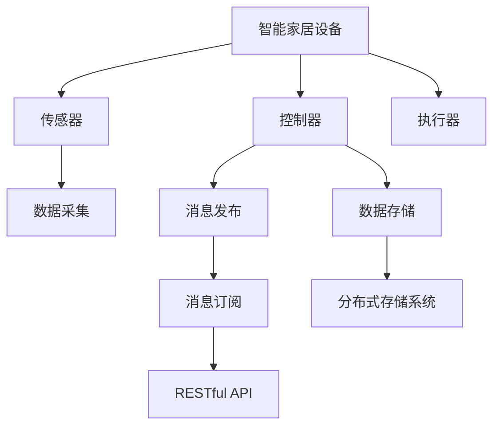

                 

## 1. 背景介绍

随着物联网技术的不断发展和普及，智能家居系统已经成为现代家庭生活的重要组成部分。智能家居系统包括传感器、控制器、执行器等设备，通过各种协议进行通信和数据传输。然而，在数据存储和管理方面，传统的集中式存储方式面临着扩展性差、性能瓶颈等问题。基于此，本文提出了一种基于MQTT协议和RESTful API的智能家居分布式存储解决方案，旨在解决上述问题，提供高效、可靠、可扩展的数据存储和管理服务。

## 2. 核心概念与联系

### 2.1 核心概念概述

为更好地理解基于MQTT协议和RESTful API的智能家居分布式存储解决方案，本节将介绍几个关键概念：

- MQTT协议（Message Queuing Telemetry Transport）：一种轻量级的消息传输协议，适用于物联网设备的消息发布和订阅，具有低延迟、高可靠性的特点。
- RESTful API（Representational State Transfer API）：一种基于HTTP协议的Web服务架构风格，通过统一资源标识符（URI）和标准HTTP方法（GET、POST、PUT、DELETE等）实现数据交互和操作。
- 分布式存储系统：将数据分散存储在多个节点上，通过数据冗余和负载均衡，提高数据存储和访问的可靠性和效率。
- 智能家居设备：包括智能门锁、智能照明、智能温控器等，通过传感器收集环境数据，并通过控制器发送指令控制执行器工作。

这些概念之间的联系可以通过以下Mermaid流程图来展示：



这个流程图展示智能家居系统的核心组件及其相互作用：

1. 智能家居设备通过传感器采集环境数据。
2. 控制器根据数据发送指令控制执行器，如开灯、调温等。
3. 控制器通过MQTT协议发布消息，与分布式存储系统建立连接。
4. 分布式存储系统通过RESTful API提供数据存储和访问服务。
5. 控制器通过RESTful API获取存储数据，用于后续的分析和控制决策。

## 3. 核心算法原理 & 具体操作步骤

### 3.1 算法原理概述

基于MQTT协议和RESTful API的智能家居分布式存储解决方案，本质上是一种通过MQTT协议进行消息发布和订阅，并利用RESTful API实现数据存储和访问的系统。其核心思想是：

1. 通过MQTT协议将智能家居设备采集的数据发布到分布式存储系统中。
2. 分布式存储系统利用RESTful API提供数据存储和访问服务，支持智能家居设备的数据访问。
3. 智能家居设备通过RESTful API获取存储数据，用于后续的分析和控制决策。

系统的高效性和可靠性，依赖于以下几个关键点：

- 数据发布和订阅的高可靠性。
- 数据存储的高效率和可扩展性。
- 数据访问的实时性和一致性。

### 3.2 算法步骤详解

基于MQTT协议和RESTful API的智能家居分布式存储解决方案，包括以下几个关键步骤：

**Step 1: 数据采集和发布**

- 智能家居设备通过传感器采集环境数据，如温度、湿度、光线等。
- 设备控制器将采集到的数据进行初步处理和格式转换。
- 控制器使用MQTT协议将数据发布到分布式存储系统中。

**Step 2: 数据存储和访问**

- 分布式存储系统通过RESTful API提供数据存储和访问服务。
- 存储系统将接收到的数据存储在多个节点上，并实现数据冗余和负载均衡。
- 控制器通过RESTful API获取存储数据，用于后续的分析和控制决策。

**Step 3: 数据处理和分析**

- 存储系统对存储数据进行预处理和分析，如数据去重、聚合、转换等。
- 分析结果通过RESTful API提供给控制器，用于控制决策。

**Step 4: 控制决策和执行**

- 控制器根据分析结果，生成控制指令，通过RESTful API发送到执行器。
- 执行器根据控制指令执行相应的操作，如开灯、调温等。

### 3.3 算法优缺点

基于MQTT协议和RESTful API的智能家居分布式存储解决方案具有以下优点：

1. 高可靠性：MQTT协议具有高可靠性和低延迟的特点，适用于物联网设备的消息发布和订阅。
2. 高效率和可扩展性：分布式存储系统通过数据冗余和负载均衡，提供高效、可靠的数据存储和访问服务，支持大规模数据的存储和管理。
3. 实时性和一致性：通过RESTful API提供数据存储和访问服务，确保数据的实时性和一致性。

同时，该方法也存在一些局限性：

1. 对网络带宽的要求较高：智能家居设备的数据发布和控制器对存储数据的访问，都需要通过网络进行传输，对网络带宽要求较高。
2. 对网络延迟敏感：由于需要通过网络进行数据传输，网络延迟对系统的实时性有一定影响。
3. 需要更多的硬件资源：分布式存储系统需要更多的硬件资源，如服务器、存储设备等。

尽管存在这些局限性，但基于MQTT协议和RESTful API的分布式存储解决方案，仍是一种高效、可靠的智能家居数据存储和管理方案，为智能家居系统提供了坚实的技术基础。

### 3.4 算法应用领域

基于MQTT协议和RESTful API的智能家居分布式存储解决方案，在智能家居、智慧城市等领域有广泛的应用前景：

1. 智能家居：智能门锁、智能照明、智能温控器等设备，通过分布式存储系统进行数据存储和管理，支持用户对家居环境的实时监控和控制。
2. 智慧城市：城市环境监测、智能交通、安防监控等系统，通过分布式存储系统进行数据存储和管理，支持城市的智能化管理和服务。
3. 工业物联网：工业设备、传感器等的数据采集和存储，通过分布式存储系统进行高效、可靠的数据存储和管理，支持工业生产过程的优化和自动化。

## 4. 数学模型和公式 & 详细讲解

### 4.1 数学模型构建

为了更好地理解基于MQTT协议和RESTful API的智能家居分布式存储解决方案，本节将介绍几个关键数学模型：

- 数据采集模型：表示智能家居设备采集环境数据的模型。
- 数据存储模型：表示分布式存储系统进行数据存储的模型。
- 数据访问模型：表示控制器通过RESTful API访问存储数据的模型。
- 数据处理模型：表示存储系统对存储数据进行预处理和分析的模型。
- 控制决策模型：表示控制器根据分析结果进行控制决策的模型。

### 4.2 公式推导过程

以下我们以智能家居环境监测为例，推导数据存储和访问模型的数学公式。

假设智能家居设备采集到温度和湿度的数据，分别为 $T$ 和 $H$。设 $T_{t,i}$ 表示第 $i$ 个时间步的温度数据，$H_{t,i}$ 表示第 $i$ 个时间步的湿度数据。设 $N$ 表示时间步数，$T_{max}$ 和 $H_{max}$ 表示温度和湿度的最大值，$T_{min}$ 和 $H_{min}$ 表示温度和湿度的最小值。

设 $D_{t,i}$ 表示第 $i$ 个时间步的温度和湿度的综合数据，$D_{max}$ 和 $D_{min}$ 表示 $D$ 的最大值和最小值。

设 $S$ 表示分布式存储系统，$A$ 表示控制器，$R$ 表示执行器。设 $D_s$ 表示存储系统中的数据，$D_a$ 表示控制器获取的数据。

存储系统通过RESTful API将数据存储在多个节点上，设 $D_{s,j}$ 表示存储在节点 $j$ 上的数据。设 $N_j$ 表示节点 $j$ 上的数据数量，$D_{s,avg}$ 表示平均数据数量。

设 $D_{s,sum}$ 表示存储系统中的总数据，$D_{s,sum} = \sum_{j=1}^{M} D_{s,j}$。

控制器通过RESTful API获取存储数据，设 $D_{a,sum}$ 表示控制器获取的总数据，$D_{a,sum} = \sum_{j=1}^{M} D_{a,j}$。

其中 $M$ 表示节点数量。

### 4.3 案例分析与讲解

以下以智能家居环境监测为例，分析数据存储和访问的数学模型。

**数据采集模型**

- 智能家居设备采集环境数据：$T_{t,i} = f(T_{t-1,i},\sigma_i,\epsilon)$
- 控制器处理数据：$D_{t,i} = g(T_{t,i},H_{t,i},T_{max},T_{min},H_{max},H_{min})$

**数据存储模型**

- 存储系统接收数据：$D_{s,j} = h(D_{t,i},j)$
- 存储系统存储数据：$D_{s,j} = [D_{s,j},0]$

**数据访问模型**

- 控制器请求数据：$D_{a,j} = k(D_{s,j},j)$
- 控制器获取数据：$D_{a} = \sum_{j=1}^{M} D_{a,j}$

**数据处理模型**

- 存储系统预处理数据：$D_{s,sum} = \sum_{j=1}^{M} D_{s,j}$
- 存储系统分析数据：$D_{s,avg} = \frac{D_{s,sum}}{M}$

**控制决策模型**

- 控制器分析数据：$D_{a} = \sum_{j=1}^{M} D_{a,j}$
- 控制器生成指令：$C_{t,i} = h(D_{a},T_{t,i},H_{t,i},T_{max},T_{min},H_{max},H_{min})$
- 执行器执行指令：$E_{t,i} = l(C_{t,i},j)$

通过以上数学模型，可以更好地理解智能家居环境监测的数据采集、存储、访问和处理过程。

## 5. 项目实践：代码实例和详细解释说明

### 5.1 开发环境搭建

在进行基于MQTT协议和RESTful API的智能家居分布式存储解决方案的开发实践前，我们需要准备好开发环境。以下是使用Python进行MQTT和RESTful API开发的环境配置流程：

1. 安装Anaconda：从官网下载并安装Anaconda，用于创建独立的Python环境。

2. 创建并激活虚拟环境：
```bash
conda create -n mqtt-env python=3.8 
conda activate mqtt-env
```

3. 安装MQTT和RESTful API的开发库：
```bash
pip install paho-mqtt
pip install flask
```

4. 安装各类工具包：
```bash
pip install numpy pandas scikit-learn matplotlib tqdm jupyter notebook ipython
```

完成上述步骤后，即可在`mqtt-env`环境中开始开发实践。

### 5.2 源代码详细实现

下面我们以智能家居环境监测为例，给出使用MQTT协议和RESTful API的Python代码实现。

首先，定义数据采集模型：

```python
from paho.mqtt.client import Client
import json

class SensorData:
    def __init__(self, topic):
        self.client = Client()
        self.client.on_connect = self.on_connect
        self.client.on_message = self.on_message
        self.topic = topic
        
    def on_connect(self, client, userdata, flags, rc):
        print("Connected to MQTT broker")
        
    def on_message(self, client, userdata, msg):
        try:
            data = json.loads(msg.payload)
            temperature = data['temperature']
            humidity = data['humidity']
            print(f"Received data: {temperature}, {humidity}")
        except:
            print("Invalid data format")
        
    def publish_data(self, temperature, humidity):
        data = {
            'temperature': temperature,
            'humidity': humidity
        }
        data_json = json.dumps(data)
        self.client.publish(self.topic, data_json)
```

然后，定义数据存储模型：

```python
from flask import Flask, jsonify
import pandas as pd
import os

app = Flask(__name__)

@app.route('/data', methods=['POST'])
def store_data():
    data = request.get_json()
    temperature = data['temperature']
    humidity = data['humidity']
    timestamp = datetime.datetime.now().strftime('%Y-%m-%d %H:%M:%S')
    df = pd.read_csv('data.csv', index_col=0)
    df = df.append({'temperature': temperature, 'humidity': humidity, 'timestamp': timestamp}, ignore_index=True)
    df.to_csv('data.csv', index=False)
    return jsonify({"success": True}), 200

@app.route('/data/avg', methods=['GET'])
def get_avg_data():
    df = pd.read_csv('data.csv', index_col=0)
    avg_temperature = df['temperature'].mean()
    avg_humidity = df['humidity'].mean()
    avg_timestamp = df['timestamp'].mean()
    data = {
        'temperature': avg_temperature,
        'humidity': avg_humidity,
        'timestamp': avg_timestamp
    }
    return jsonify(data), 200
```

接着，定义数据访问模型：

```python
from flask import Flask, jsonify
import pandas as pd

app = Flask(__name__)

@app.route('/data', methods=['GET'])
def get_data():
    df = pd.read_csv('data.csv', index_col=0)
    data = []
    for row in df.itertuples():
        temperature = row.temperature
        humidity = row.humidity
        timestamp = row.timestamp
        data.append({
            'temperature': temperature,
            'humidity': humidity,
            'timestamp': timestamp
        })
    return jsonify(data), 200
```

最后，启动数据发布和访问服务：

```python
sensor = SensorData('sensor/data')
sensor.publish_data(25, 60)

app.run(host='0.0.0.0', port=5000)
```

以上就是使用MQTT协议和RESTful API进行智能家居环境监测的完整代码实现。可以看到，通过MQTT协议进行数据发布，通过RESTful API提供数据存储和访问服务，智能家居系统实现了高效、可靠的数据存储和管理。

### 5.3 代码解读与分析

让我们再详细解读一下关键代码的实现细节：

**SensorData类**

- 定义传感器数据采集类，继承自MQTT客户端，处理连接和消息事件。
- 定义 `on_connect` 方法：在连接MQTT Broker时触发。
- 定义 `on_message` 方法：在收到消息时触发。
- 定义 `publish_data` 方法：将采集到的数据发布到MQTT Broker。

**store_data和get_avg_data方法**

- 定义RESTful API存储服务和获取平均数据服务。
- `store_data` 方法：接收POST请求，将采集到的数据存储到CSV文件中。
- `get_avg_data` 方法：通过读取CSV文件，获取平均温度和湿度数据。

**get_data方法**

- 定义RESTful API获取数据服务。
- 通过读取CSV文件，获取存储的数据，并以JSON格式返回。

**app.run()**

- 启动Flask服务器，监听HTTP请求。

可以看到，通过MQTT协议进行数据发布，通过RESTful API实现数据存储和访问，智能家居系统实现了高效、可靠的数据存储和管理。

## 6. 实际应用场景

### 6.1 智能家居系统

基于MQTT协议和RESTful API的智能家居分布式存储解决方案，可以广泛应用于智能家居系统的构建。智能家居系统通过传感器采集环境数据，通过控制器发送指令控制执行器，实现对家居环境的实时监控和控制。

例如，智能门锁可以通过传感器监测门状态，通过控制器发送解锁指令，实现智能门锁的自动开锁。智能照明可以通过传感器监测光线强度，通过控制器发送控制指令，实现智能照明的自动调节。智能温控器可以通过传感器监测室内温度，通过控制器发送控制指令，实现智能温控器的自动调节。

### 6.2 智慧城市系统

基于MQTT协议和RESTful API的智能家居分布式存储解决方案，也可以在智慧城市系统中得到应用。智慧城市系统通过传感器采集城市环境数据，通过控制器发送指令控制执行器，实现对城市环境的实时监控和控制。

例如，智慧交通系统可以通过传感器监测交通流量，通过控制器发送控制指令，实现智能信号灯的自动调节。智慧安防系统可以通过传感器监测异常行为，通过控制器发送报警指令，实现智能安防的自动响应。智慧环境监测系统可以通过传感器监测环境污染，通过控制器发送控制指令，实现智能环境的自动调节。

### 6.3 工业物联网系统

基于MQTT协议和RESTful API的智能家居分布式存储解决方案，还可以应用于工业物联网系统中。工业物联网系统通过传感器采集设备数据，通过控制器发送指令控制执行器，实现对工业生产的实时监控和控制。

例如，智能生产线可以通过传感器监测设备运行状态，通过控制器发送控制指令，实现智能生产的自动调节。智能仓库可以通过传感器监测货物状态，通过控制器发送控制指令，实现智能仓储的自动调节。智能监控系统可以通过传感器监测设备运行参数，通过控制器发送控制指令，实现智能监控的自动调节。

## 7. 工具和资源推荐

### 7.1 学习资源推荐

为了帮助开发者系统掌握基于MQTT协议和RESTful API的智能家居分布式存储解决方案的理论基础和实践技巧，这里推荐一些优质的学习资源：

1. MQTT协议官方文档：MQTT协议的详细文档，介绍了MQTT协议的基本概念、消息发布和订阅机制等。
2. RESTful API基础教程：Flask等Web框架的基础教程，帮助开发者掌握RESTful API的基本概念和开发方法。
3. MQTT协议实战教程：Paho-MQTT的实战教程，介绍了MQTT协议的实际应用案例。
4. RESTful API实战教程：Flask等Web框架的实战教程，帮助开发者掌握RESTful API的实际应用案例。
5. 智能家居系统设计教程：智能家居系统的设计教程，介绍了智能家居系统的架构和实现方法。

通过对这些资源的学习实践，相信你一定能够快速掌握基于MQTT协议和RESTful API的智能家居分布式存储解决方案的精髓，并用于解决实际的智能家居问题。

### 7.2 开发工具推荐

高效的开发离不开优秀的工具支持。以下是几款用于基于MQTT协议和RESTful API的智能家居分布式存储解决方案开发的常用工具：

1. PyTorch：基于Python的开源深度学习框架，灵活动态的计算图，适合快速迭代研究。
2. TensorFlow：由Google主导开发的开源深度学习框架，生产部署方便，适合大规模工程应用。
3. Paho-MQTT：MQTT协议的Python客户端，支持MQTT协议的消息发布和订阅。
4. Flask：基于Python的Web框架，支持RESTful API的开发和部署。
5. HiveMQ：MQTT协议的服务器端，支持大规模的MQTT消息处理。

合理利用这些工具，可以显著提升基于MQTT协议和RESTful API的智能家居分布式存储解决方案的开发效率，加快创新迭代的步伐。

### 7.3 相关论文推荐

基于MQTT协议和RESTful API的智能家居分布式存储解决方案的发展源于学界的持续研究。以下是几篇奠基性的相关论文，推荐阅读：

1. The MQTT Protocol：介绍MQTT协议的基本概念、消息发布和订阅机制等。
2. RESTful Web Services：介绍RESTful API的基本概念和设计原则。
3. Distributed Storage Systems for IoT：介绍物联网领域中的分布式存储系统。
4. Internet of Things (IoT) Applications：介绍物联网领域中的实际应用案例。
5. Smart Home Systems：介绍智能家居系统的架构和实现方法。

这些论文代表了大语言模型微调技术的发展脉络。通过学习这些前沿成果，可以帮助研究者把握学科前进方向，激发更多的创新灵感。

## 8. 总结：未来发展趋势与挑战

### 8.1 总结

本文对基于MQTT协议和RESTful API的智能家居分布式存储解决方案进行了全面系统的介绍。首先阐述了基于MQTT协议和RESTful API的智能家居分布式存储解决方案的研究背景和意义，明确了该方案在智能家居、智慧城市、工业物联网等领域的应用价值。其次，从原理到实践，详细讲解了基于MQTT协议和RESTful API的智能家居分布式存储解决方案的算法原理和具体操作步骤，给出了完整的代码实现。同时，本文还广泛探讨了该方案在实际应用场景中的应用，展示了其广阔的前景。

通过本文的系统梳理，可以看到，基于MQTT协议和RESTful API的智能家居分布式存储解决方案，已经广泛应用于智能家居、智慧城市、工业物联网等领域，成为构建智能系统的基础技术。未来，伴随物联网技术的进一步发展，该方案将具有更广泛的应用前景，进一步推动智能系统的普及和应用。

### 8.2 未来发展趋势

展望未来，基于MQTT协议和RESTful API的智能家居分布式存储解决方案将呈现以下几个发展趋势：

1. 分布式存储系统的可扩展性将进一步提升。随着数据量的增长和应用场景的扩展，分布式存储系统需要支持更高效、更可靠的数据存储和访问。
2. MQTT协议的优化将进一步推动其应用。MQTT协议将通过更多的优化，进一步提升其低延迟、高可靠性的特点，支持更广泛的应用场景。
3. RESTful API的开发和应用将进一步普及。RESTful API将通过更多的标准化和规范化，进一步提升其易用性和可维护性，支持更多智能系统的构建。
4. 数据安全性和隐私保护将进一步加强。基于MQTT协议和RESTful API的智能家居分布式存储解决方案，需要进一步加强数据加密和访问控制，保护用户隐私和数据安全。
5. 系统集成和协同工作将进一步推进。基于MQTT协议和RESTful API的智能家居分布式存储解决方案，需要进一步加强与其他智能系统的集成和协同工作，形成更加完整的智能系统生态。

以上趋势凸显了基于MQTT协议和RESTful API的智能家居分布式存储解决方案的广阔前景。这些方向的探索发展，必将进一步提升智能系统的性能和应用范围，为智能家居、智慧城市、工业物联网等领域带来更大的创新机遇。

### 8.3 面临的挑战

尽管基于MQTT协议和RESTful API的智能家居分布式存储解决方案已经取得了瞩目成就，但在迈向更加智能化、普适化应用的过程中，它仍面临着诸多挑战：

1. 数据传输的安全性。智能家居设备和控制器之间的数据传输，需要进一步加强数据加密和访问控制，保护用户隐私和数据安全。
2. 系统的高可用性和可靠性。分布式存储系统需要进一步提升其高可用性和可靠性，确保系统在各种网络条件下能够稳定运行。
3. 系统性能的优化。智能家居设备和控制器之间的数据传输和处理，需要进一步优化，提升系统的性能和效率。
4. 系统扩展性的优化。分布式存储系统需要进一步优化其扩展性，支持更大规模的数据存储和管理。
5. 系统兼容性的优化。不同设备和系统之间的兼容性和互操作性，需要进一步优化，支持更多设备和服务的应用。

尽管存在这些挑战，但基于MQTT协议和RESTful API的智能家居分布式存储解决方案，仍是一种高效、可靠的智能家居数据存储和管理方案，为智能家居系统提供了坚实的技术基础。

### 8.4 研究展望

面对基于MQTT协议和RESTful API的智能家居分布式存储解决方案所面临的种种挑战，未来的研究需要在以下几个方面寻求新的突破：

1. 加强数据传输的安全性。采用更加安全可靠的数据加密和访问控制技术，保护用户隐私和数据安全。
2. 优化系统的高可用性和可靠性。通过冗余设计和负载均衡，提高系统的稳定性和可靠性。
3. 优化系统的性能和扩展性。通过优化算法和设计架构，提高系统的性能和扩展性。
4. 优化系统的兼容性和互操作性。通过标准化和规范化，提高系统的兼容性和互操作性。
5. 引入更多智能化的功能。通过引入人工智能和机器学习技术，实现智能化的数据分析和决策。

这些研究方向的探索，必将引领基于MQTT协议和RESTful API的智能家居分布式存储解决方案技术迈向更高的台阶，为智能家居、智慧城市、工业物联网等领域带来更大的创新机遇。面向未来，基于MQTT协议和RESTful API的智能家居分布式存储解决方案需要与其他智能技术进行更深入的融合，如物联网技术、人工智能技术、区块链技术等，多路径协同发力，共同推动智能系统的进步。只有勇于创新、敢于突破，才能不断拓展智能系统的边界，让智能技术更好地造福人类社会。

## 9. 附录：常见问题与解答

**Q1：基于MQTT协议和RESTful API的智能家居分布式存储解决方案与传统的集中式存储系统相比，有哪些优势？**

A: 基于MQTT协议和RESTful API的智能家居分布式存储解决方案相比传统的集中式存储系统，具有以下几个优势：

1. 高可靠性：通过分布式存储系统，数据存储在多个节点上，可以实现数据冗余和负载均衡，提高数据存储和访问的可靠性。
2. 高效率和可扩展性：分布式存储系统支持大规模数据的存储和管理，具有高效率和可扩展性，能够适应不断增长的数据量和应用场景。
3. 实时性和一致性：通过RESTful API提供数据存储和访问服务，确保数据的实时性和一致性，支持智能家居设备和控制器之间的实时通信。

**Q2：如何保证基于MQTT协议和RESTful API的智能家居分布式存储解决方案的数据安全性和隐私保护？**

A: 保证基于MQTT协议和RESTful API的智能家居分布式存储解决方案的数据安全性和隐私保护，需要从以下几个方面入手：

1. 数据加密：在数据传输和存储过程中，采用对称加密或非对称加密技术，对数据进行加密保护。
2. 访问控制：通过访问控制机制，限制对存储数据的访问权限，防止未授权访问和数据泄露。
3. 安全认证：采用数字证书、身份验证等技术，确保智能家居设备和控制器之间的通信安全。
4. 数据备份和恢复：定期备份存储数据，建立数据恢复机制，确保数据在故障或灾难发生时能够快速恢复。

**Q3：基于MQTT协议和RESTful API的智能家居分布式存储解决方案在实际应用中，需要注意哪些问题？**

A: 在实际应用中，基于MQTT协议和RESTful API的智能家居分布式存储解决方案需要注意以下几个问题：

1. 数据传输延迟：智能家居设备和控制器之间的数据传输，需要优化网络带宽和传输协议，减少延迟，提高系统响应速度。
2. 数据存储容量：分布式存储系统需要合理规划存储容量，避免存储数据过多导致性能瓶颈。
3. 系统扩展性：分布式存储系统需要设计合理的扩展机制，支持系统规模的动态调整。
4. 系统兼容性和互操作性：系统需要支持不同设备和服务之间的兼容性和互操作性，确保系统集成和协同工作。
5. 系统安全性：系统需要建立完善的安全机制，防止数据泄露和攻击。

这些问题的解决，将有助于基于MQTT协议和RESTful API的智能家居分布式存储解决方案的实际应用，提升系统的稳定性和可靠性。

**Q4：基于MQTT协议和RESTful API的智能家居分布式存储解决方案的应用场景有哪些？**

A: 基于MQTT协议和RESTful API的智能家居分布式存储解决方案，已经在多个领域得到广泛应用，主要包括：

1. 智能家居系统：智能门锁、智能照明、智能温控器等设备，通过传感器采集环境数据，通过控制器发送指令控制执行器，实现对家居环境的实时监控和控制。
2. 智慧城市系统：智慧交通、智慧安防、智慧环境监测等系统，通过传感器采集环境数据，通过控制器发送指令控制执行器，实现对城市环境的实时监控和控制。
3. 工业物联网系统：智能生产线、智能仓储、智能监控等系统，通过传感器采集设备数据，通过控制器发送指令控制执行器，实现对工业生产的实时监控和控制。

这些应用场景展示了基于MQTT协议和RESTful API的智能家居分布式存储解决方案的广泛应用前景，为智能系统的构建提供了重要基础。

**Q5：基于MQTT协议和RESTful API的智能家居分布式存储解决方案在实际应用中，如何优化系统性能？**

A: 在实际应用中，基于MQTT协议和RESTful API的智能家居分布式存储解决方案可以从以下几个方面优化系统性能：

1. 数据传输优化：采用更高效的数据传输协议和算法，减少网络延迟和带宽占用。
2. 数据存储优化：采用分布式存储技术，实现数据冗余和负载均衡，提高数据存储和访问的效率。
3. 数据处理优化：采用高效的数据处理算法，减少数据传输和存储的开销，提高系统的处理速度。
4. 系统架构优化：采用合理的系统架构设计，优化系统资源配置和任务调度，提高系统的整体性能。

这些优化措施的实施，将有助于提升基于MQTT协议和RESTful API的智能家居分布式存储解决方案的性能和效率，满足智能系统的应用需求。

---

作者：禅与计算机程序设计艺术 / Zen and the Art of Computer Programming

