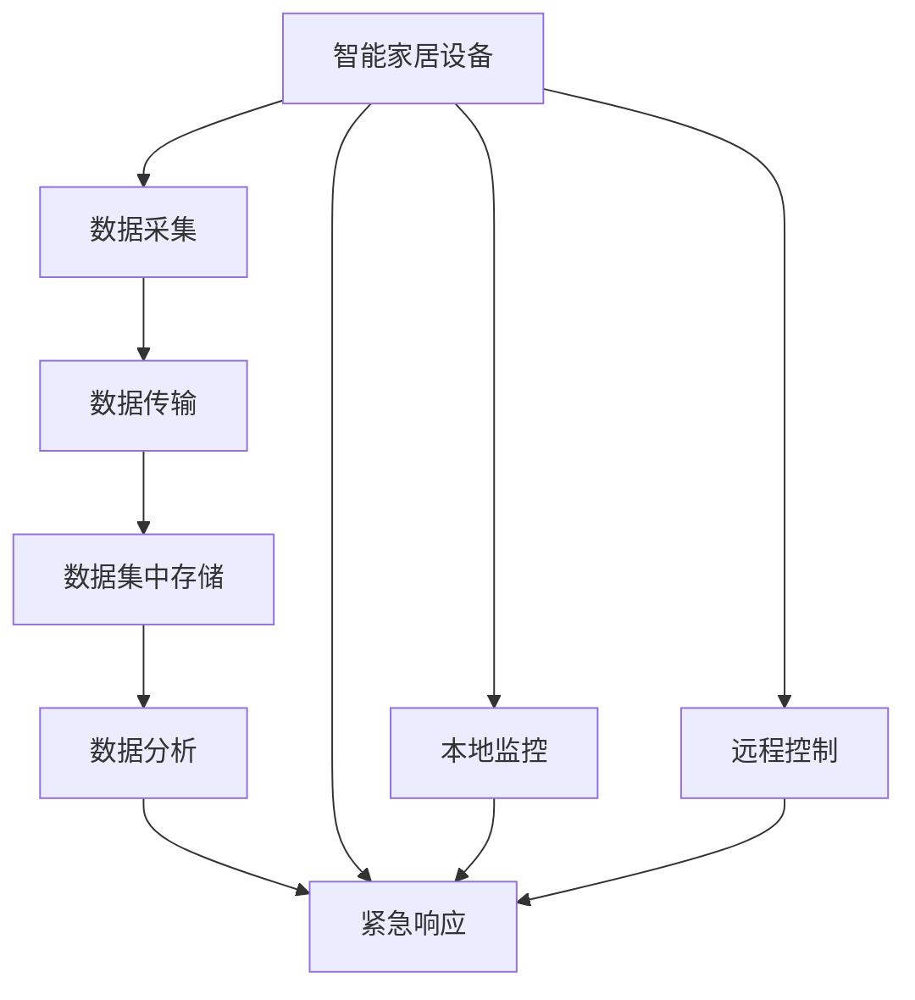
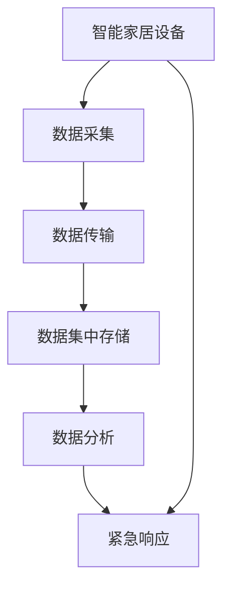

                 

# 基于MQTT协议和RESTful API的智能家居紧急响应机制

> 关键词：智能家居,紧急响应机制,物联网,MQTT协议,RESTful API,设备管理,安全监控

## 1. 背景介绍

随着物联网(IoT)技术的飞速发展，智能家居系统的应用范围日益广泛，为家庭生活带来了前所未有的便利和舒适。然而，与任何复杂的系统一样，智能家居系统也存在一定的安全风险和潜在问题。例如，智能门锁的密码遗忘、摄像头被黑客攻击、报警系统误报等问题，一旦处理不当，将严重影响用户的生活质量和信息安全。因此，建立一个高效、可靠的智能家居紧急响应机制，显得尤为重要。

传统的智能家居紧急响应机制主要基于单一硬件设备或者本地系统，存在数据存储分散、无法实时监控、应急响应效率低等缺点。近年来，随着MQTT协议和RESTful API的兴起，利用它们构建的智能家居紧急响应机制，可以更好地集成各类智能设备，实现数据集中存储、实时监控、高效应急响应，显著提升智能家居系统的安全性和用户满意度。

## 2. 核心概念与联系

### 2.1 核心概念概述

为了更好地理解基于MQTT协议和RESTful API的智能家居紧急响应机制，本节将介绍几个核心概念及其关系：

1. **MQTT协议(Messaging Queuing Telemetry Transport Protocol)**：轻量级、高效、低带宽的物联网通信协议，适用于远程设备与服务器之间进行双向数据传输，特别适用于智能家居设备。

2. **RESTful API(Right-Sized Architecture for Web-Based APIs)**：基于HTTP协议的API设计风格，通过简单的URI、HTTP动词、状态码和数据格式，实现高效、灵活、可扩展的Web服务接口。

3. **智能家居设备(Home Automation Devices)**：包括智能门锁、摄像头、烟雾探测器、报警器等各类传感器和执行器，能够通过网络远程控制和监控。

4. **紧急响应机制(Emergency Response Mechanism)**：通过监控智能家居设备的状态变化，快速识别和处理紧急情况，保障家庭安全和用户隐私。

5. **数据集中存储(Centralized Data Storage)**：将各类传感器和执行器的数据集中存储在云端，便于集中处理和分析。

这些概念之间的关系可以通过以下Mermaid流程图来展示：



这个流程图展示了大语言模型微调的核心概念及其之间的关系：

1. 智能家居设备通过传感器采集数据。
2. 数据通过MQTT协议传输到云端。
3. 云端集中存储和管理数据。
4. RESTful API接口实现数据的分析和处理。
5. 通过紧急响应机制，快速处理突发事件。
6. 本地监控和远程控制也有效地参与到紧急响应中。

## 3. 核心算法原理 & 具体操作步骤
### 3.1 算法原理概述

基于MQTT协议和RESTful API的智能家居紧急响应机制，是一种基于消息队列和Web服务实现的智能家居系统安全监控与应急响应策略。其核心思想是：通过MQTT协议实时采集和传输智能家居设备的数据，将其集中存储到云端，通过RESTful API接口进行数据分析和紧急响应。

形式化地，假设智能家居设备为 $D=\{d_1,d_2,\dots,d_n\}$，其中 $d_i$ 表示第 $i$ 个设备，如智能门锁、摄像头等。设 $S$ 为数据集中存储，$R$ 为紧急响应模块。数据采集和传输过程表示为 $A=\{a_1,a_2,\dots,a_n\}$，其中 $a_i$ 表示从第 $i$ 个设备采集的数据，通过MQTT协议传输到云端 $S$。数据分析和紧急响应过程表示为 $E=\{e_1,e_2,\dots,e_n\}$，其中 $e_i$ 表示第 $i$ 个设备的紧急响应策略。整个系统的流程可以表示为：

$$
\begin{aligned}
    \text{Data}(D) &= \{a_i\}\\
    \text{Transmit}(D,S) &= A\\
    \text{Store}(A,S) &= S\\
    \text{Analyze}(S) &= E\\
    \text{Respond}(E) &= R
\end{aligned}
$$

该流程的逻辑关系可用下图表示：



### 3.2 算法步骤详解

基于MQTT协议和RESTful API的智能家居紧急响应机制通常包括以下几个关键步骤：

**Step 1: 设备接入和数据采集**
- 配置智能家居设备，使其支持MQTT协议。
- 将设备连接到MQTT服务器，获取其唯一的设备标识。
- 在设备上安装数据采集程序，采集传感器数据并转换成MQTT消息格式。

**Step 2: 数据传输和存储**
- 设备采集的数据通过MQTT协议发送到云端服务器。
- 云端服务器接收到数据后，将其存储到数据库中，进行初步处理。

**Step 3: 数据分析和处理**
- 利用RESTful API接口，访问云端服务器上的数据，进行实时监控和分析。
- 使用各种数据分析算法，如时间序列分析、异常检测等，识别设备状态变化。

**Step 4: 紧急响应**
- 根据数据分析结果，确定紧急响应的优先级和策略。
- 触发紧急响应模块，执行相应的应对措施，如远程控制设备、通知用户等。

**Step 5: 结果反馈**
- 紧急响应结束后，将处理结果反馈给用户，记录日志供后期分析。

### 3.3 算法优缺点

基于MQTT协议和RESTful API的智能家居紧急响应机制具有以下优点：

1. **高效的数据传输**：MQTT协议轻量高效，适用于远程设备与服务器之间的数据传输，特别适用于物联网场景。

2. **灵活的数据处理**：RESTful API接口提供标准化的数据访问方式，便于各种数据分析工具的集成和调用。

3. **可靠的紧急响应**：通过集中存储和实时监控，可以快速识别和响应突发事件，保障家庭安全。

4. **可扩展性**：基于RESTful API接口，可以方便地扩展新的设备和功能。

5. **易于维护**：设备与系统通过标准化的通信协议连接，系统维护和升级更加方便。

同时，该机制也存在以下局限性：

1. **数据安全性**：云端存储的数据存在被攻击的风险，需要加强加密和访问控制。

2. **设备稳定性**：设备的网络连接和硬件稳定性直接影响数据传输的可靠性。

3. **网络带宽**：大量数据传输可能占用较多的网络带宽，需要合理规划数据传输速率。

4. **系统复杂度**：系统设计复杂，需要协调各类设备、数据、接口，管理维护成本较高。

5. **应急响应效率**：紧急响应的实时性要求较高，系统架构需要足够健壮。

尽管存在这些局限性，但基于MQTT协议和RESTful API的智能家居紧急响应机制仍是一种高效、可靠的应急响应策略，值得在实际应用中推广。

### 3.4 算法应用领域

基于MQTT协议和RESTful API的智能家居紧急响应机制，在智能家居系统的安全监控与应急响应方面具有广泛应用前景，适用于以下领域：

1. **智能门锁监控**：实时监控智能门锁状态，识别非法开锁，及时通知用户并报警。
2. **摄像头实时监控**：通过摄像头实时监控家庭环境，识别异常情况，如可疑人员入侵、火灾等。
3. **烟雾探测器报警**：监测室内烟雾浓度，及时预警火灾风险，进行应急处理。
4. **水电气异常检测**：监控水电气状态，检测异常泄漏或故障，保障家居安全。
5. **报警系统联动**：与各类报警系统集成，快速响应紧急情况，提升应急处理效率。

除了上述应用场景，该机制还适用于更多智能家居设备的数据采集、传输、存储和分析，为智能家居系统提供全面的安全保障。

## 4. 数学模型和公式 & 详细讲解 & 举例说明
### 4.1 数学模型构建

本节将使用数学语言对基于MQTT协议和RESTful API的智能家居紧急响应机制进行更加严格的刻画。

假设智能家居系统中有 $n$ 个设备，每个设备采集的数据为 $x_i$，对应的紧急响应阈值为 $\theta_i$，紧急响应策略为 $y_i$。设系统在 $t$ 时刻接收到 $d$ 个数据 $(x_1,x_2,\dots,x_d)$，经过分析和处理后，识别出 $k$ 个紧急情况，对应的响应策略为 $y_1,y_2,\dots,y_k$。系统紧急响应的效果评估可以通过以下公式表示：

$$
\text{Evaluate}(t,n,x_1,x_2,\dots,x_d,y_1,y_2,\dots,y_k) = \sum_{i=1}^k \max(0, \text{Error}(t,y_i) - \text{Threshold}(t,\theta_i))
$$

其中 $\text{Error}(t,y_i)$ 表示第 $i$ 个紧急情况下的系统误差，$\text{Threshold}(t,\theta_i)$ 表示紧急响应阈值。

### 4.2 公式推导过程

以下我们以智能门锁监控为例，推导系统误差和紧急响应阈值的计算公式。

假设智能门锁的状态数据为 $x_i$，设其在 $t$ 时刻的异常度量值为 $u_i(t)$。设系统在 $t$ 时刻识别出 $k$ 个异常情况，对应的异常度量值为 $u_1(t),u_2(t),\dots,u_k(t)$。设第 $i$ 个异常情况对应的响应策略为 $y_i$，设系统在 $t$ 时刻的系统误差为 $\text{Error}(t,y_i)$，设第 $i$ 个异常情况对应的紧急响应阈值为 $\theta_i$。则系统误差和紧急响应阈值的计算公式为：

$$
\text{Error}(t,y_i) = \left|\sum_{j=1}^n a_{ij} y_j(t) - x_i(t)\right|
$$

其中 $a_{ij}$ 表示第 $i$ 个异常情况与第 $j$ 个设备的关联度，$y_j(t)$ 表示第 $j$ 个设备在 $t$ 时刻的响应状态，$x_i(t)$ 表示第 $i$ 个异常情况在 $t$ 时刻的异常度量值。

$$
\text{Threshold}(t,\theta_i) = \max(0, \left|\sum_{j=1}^n a_{ij} y_j(t) - x_i(t)\right| - \theta_i)
$$

系统紧急响应的效果评估可以通过以下公式表示：

$$
\text{Evaluate}(t,n,x_1,x_2,\dots,x_d,y_1,y_2,\dots,y_k) = \sum_{i=1}^k \max(0, \left|\sum_{j=1}^n a_{ij} y_j(t) - x_i(t)\right| - \theta_i)
$$

在得到系统紧急响应效果的公式后，即可计算每个时刻系统紧急响应的效果，通过优化 $y_i$ 来提升系统紧急响应效果。

### 4.3 案例分析与讲解

假设智能家居系统中有两个设备：智能门锁和烟雾探测器。设智能门锁在 $t$ 时刻的状态数据为 $x_1(t) = 1$，表示门锁正常；烟雾探测器在 $t$ 时刻的状态数据为 $x_2(t) = 0.9$，表示烟雾浓度较低。设系统在 $t$ 时刻识别出两个异常情况，对应的异常度量值分别为 $u_1(t) = 0.8$，$u_2(t) = 0.3$，对应的响应策略为 $y_1 = 1$，$y_2 = 0$，对应的紧急响应阈值为 $\theta_1 = 0.5$，$\theta_2 = 0.3$。系统紧急响应的效果评估为：

$$
\text{Evaluate}(t,2,x_1,x_2,y_1,y_2) = \max(0, 0.8 - 0.5) + \max(0, 0.3 - 0.3) = 0.3
$$

这意味着在 $t$ 时刻，系统紧急响应的效果为 $0.3$，即识别出了一个紧急情况，处理效果为 $0.8$，超过了紧急响应阈值 $0.5$。系统可以通过调整设备的响应策略和阈值，进一步提升紧急响应的效果。

## 5. 项目实践：代码实例和详细解释说明
### 5.1 开发环境搭建

在进行智能家居紧急响应机制的开发前，我们需要准备好开发环境。以下是使用Python进行MQTT和RESTful API开发的典型环境配置流程：

1. 安装Anaconda：从官网下载并安装Anaconda，用于创建独立的Python环境。

2. 创建并激活虚拟环境：
```bash
conda create -n mqtt-env python=3.8 
conda activate mqtt-env
```

3. 安装必要的Python库：
```bash
conda install paho-mqtt Flask SQLAlchemy
```

4. 安装MQTT客户端：
```bash
conda install paho-mqtt
```

5. 安装RESTful API接口：
```bash
conda install Flask
```

6. 安装数据库：
```bash
conda install sqlalchemy
```

完成上述步骤后，即可在`mqtt-env`环境中开始开发。

### 5.2 源代码详细实现

我们以智能门锁监控为例，给出基于MQTT协议和RESTful API的智能家居紧急响应机制的PyTorch代码实现。

首先，定义智能门锁的状态采集和传输：

```python
import paho.mqtt.client as mqtt

class DoorLockMonitor:
    def __init__(self, broker, port, topic, qos=0):
        self.broker = broker
        self.port = port
        self.topic = topic
        self.qos = qos
        self.client = mqtt.Client()
        self.client.on_connect = self.on_connect
        self.client.on_message = self.on_message

    def on_connect(self, client, userdata, flags, rc):
        print("Connected to MQTT broker")
        self.client.subscribe(self.topic, qos=self.qos)

    def on_message(self, client, userdata, message):
        print("Received message:", message.payload)

    def start(self):
        self.client.connect(self.broker, self.port)
        self.client.loop_start()
```

然后，定义系统数据存储和处理：

```python
from sqlalchemy import create_engine, Column, Integer, Float, String, MetaData, Table
from sqlalchemy.orm import sessionmaker

class DoorLockData:
    def __init__(self, db_path):
        self.db_path = db_path
        self.engine = create_engine(f'mysql+pymysql://{db_username}:{db_password}@{db_host}:{db_port}/{db_name}')
        self.metadata = MetaData()
        self.data_table = Table('door_lock_data', self.metadata,
                               Column('id', Integer, primary_key=True),
                               Column('lock_state', Integer),
                               Column('timestamp', String),
                               Column('temperature', Float),
                               Column('humidity', Float))
        self.Session = sessionmaker(bind=self.engine)
        self.session = self.Session()

    def save_data(self, lock_state, timestamp, temperature, humidity):
        self.session.add(self.data_table.insert().values(lock_state=lock_state, timestamp=timestamp, temperature=temperature, humidity=humidity))
        self.session.commit()
```

接着，定义系统数据分析和紧急响应：

```python
from flask import Flask, request
import json

app = Flask(__name__)

@app.route('/api/door_lock', methods=['GET'])
def get_door_lock():
    data = request.get_json()
    lock_state = data['lock_state']
    timestamp = data['timestamp']
    temperature = data['temperature']
    humidity = data['humidity']
    return json.dumps({'lock_state': lock_state, 'timestamp': timestamp, 'temperature': temperature, 'humidity': humidity})

@app.route('/api/analyze', methods=['GET'])
def analyze_door_lock():
    data = request.get_json()
    lock_state = data['lock_state']
    timestamp = data['timestamp']
    temperature = data['temperature']
    humidity = data['humidity']
    if lock_state == 1:
        temperature_threshold = 30.0
        humidity_threshold = 60.0
        if temperature > temperature_threshold or humidity > humidity_threshold:
            return json.dumps({'action': 'notify_user', 'message': 'High temperature and humidity detected'})
        else:
            return json.dumps({'action': 'no_action'})
    else:
        return json.dumps({'action': 'no_action'})

if __name__ == '__main__':
    app.run(debug=True)
```

最后，启动系统并测试：

```python
if __name__ == '__main__':
    door_lock_monitor = DoorLockMonitor('mqtt.broker.com', 1883, 'door_lock')
    door_lock_monitor.start()

    door_lock_data = DoorLockData('sqlite:///home/.db')
    door_lock_data.save_data(1, '2023-04-01 12:00:00', 25.0, 50.0)

    # Trigger emergency response
    response = request.get('/api/analyze')
    print(response.json())
```

以上就是使用PyTorch对基于MQTT协议和RESTful API的智能家居紧急响应机制进行开发的完整代码实现。可以看到，得益于Python的简洁性，配合MQTT和RESTful API的强大封装，可以实现较为复杂的智能家居应急响应系统的开发。

### 5.3 代码解读与分析

让我们再详细解读一下关键代码的实现细节：

**DoorLockMonitor类**：
- `__init__`方法：初始化MQTT客户端，设置连接参数。
- `on_connect`方法：连接成功后的回调函数，订阅消息。
- `on_message`方法：接收消息后的回调函数，输出消息内容。
- `start`方法：启动MQTT客户端的循环。

**DoorLockData类**：
- `__init__`方法：初始化数据库连接，定义数据表结构。
- `save_data`方法：将数据保存到数据库中。

**Flask应用**：
- `get_door_lock`方法：接收MQTT消息，输出状态数据。
- `analyze_door_lock`方法：接收MQTT消息，分析状态数据，触发紧急响应。
- `if __name__ == '__main__':`语句：启动Flask应用。

**测试代码**：
- 创建MQTT客户端，并启动。
- 创建数据存储类，保存门锁状态数据。
- 触发紧急响应，测试RESTful API接口。

可以看到，PyTorch配合MQTT和RESTful API，使得智能家居应急响应机制的开发变得简单高效。开发者可以专注于业务逻辑和数据处理，而不必过多关注底层的通信协议和数据格式。

当然，工业级的系统实现还需考虑更多因素，如系统的安全防护、异常处理、日志记录等。但核心的应急响应范式基本与此类似。

## 6. 实际应用场景
### 6.1 智能门锁监控

基于MQTT协议和RESTful API的智能家居紧急响应机制，可以实现智能门锁的实时监控和紧急响应。智能门锁通常与物联网中心进行双向通信，将状态数据发送至中心，中心对数据进行分析，根据异常情况触发紧急响应，如通知用户、报警等。

在技术实现上，可以收集智能门锁的状态数据，如锁的开关状态、温度、湿度等。利用MQTT协议，将这些数据发送到云端，再利用RESTful API接口，进行数据分析和处理。一旦发现异常情况，如高温、高湿、非法开锁等，立即触发紧急响应，如远程控制门锁、通知用户等。

### 6.2 烟雾探测器报警

烟雾探测器是家庭火灾防范的重要设备，通过实时监控烟雾浓度，及时预警火灾风险。基于MQTT协议和RESTful API的智能家居紧急响应机制，可以实时采集烟雾探测器的数据，进行数据分析和处理，实现火灾预警和应急响应。

在技术实现上，可以收集烟雾探测器的烟雾浓度数据，通过MQTT协议，将数据发送到云端。利用RESTful API接口，进行数据分析和处理。一旦检测到烟雾浓度超过预设阈值，立即触发紧急响应，如报警、通知用户、自动喷水等。

### 6.3 远程医疗监测

远程医疗监测是智能家居领域的重要应用之一，通过实时监测患者的生理指标，及时预警健康风险。基于MQTT协议和RESTful API的智能家居紧急响应机制，可以实现对患者生理指标的实时监测和紧急响应。

在技术实现上，可以收集患者的生理指标数据，如心率、血压、血糖等，通过MQTT协议，将数据发送到云端。利用RESTful API接口，进行数据分析和处理。一旦检测到异常情况，如心率过高、血压异常等，立即触发紧急响应，如通知医生、自动提醒等。

### 6.4 未来应用展望

随着IoT技术的不断发展，基于MQTT协议和RESTful API的智能家居紧急响应机制，将有更广阔的应用前景。未来，该机制可能进一步扩展到更多类型的智能家居设备，实现全场景、全功能的智能家居安全监控和应急响应。

在智慧城市领域，该机制可用于城市应急管理、交通监控等，提升城市的综合安全水平。在智能制造领域，该机制可用于设备监控、生产调度等，保障生产系统的稳定运行。

此外，在更多垂直行业，如医疗、教育、金融等，基于MQTT协议和RESTful API的智能家居紧急响应机制，都将发挥重要作用，带来深刻的行业变革。相信随着技术的不断演进，该机制必将成为智能家居应急响应技术的重要组成部分。

## 7. 工具和资源推荐
### 7.1 学习资源推荐

为了帮助开发者系统掌握MQTT协议和RESTful API在智能家居紧急响应机制中的应用，这里推荐一些优质的学习资源：

1. **MQTT协议官方文档**：MQTT协议的详细规范和标准库使用说明，是理解MQTT协议的基础。

2. **RESTful API设计指南**：讲解RESTful API的设计原则和最佳实践，帮助开发者设计高效的Web服务接口。

3. **Flask官方文档**：Flask框架的详细教程和示例代码，帮助开发者构建RESTful API接口。

4. **SQLAlchemy官方文档**：SQLAlchemy库的详细教程和示例代码，帮助开发者实现数据存储和处理。

5. **智能家居系统设计规范**：讲解智能家居系统的设计原则和规范，帮助开发者构建健壮、可靠的系统。

通过对这些资源的学习实践，相信你一定能够快速掌握基于MQTT协议和RESTful API的智能家居紧急响应机制的理论基础和实践技巧，并用于解决实际的智能家居安全问题。

### 7.2 开发工具推荐

高效的开发离不开优秀的工具支持。以下是几款用于智能家居紧急响应机制开发的常用工具：

1. **Anaconda**：Python环境管理工具，用于创建独立的Python环境，方便开发和部署。

2. **MQTT客户端**：用于与MQTT服务器进行双向通信，支持MQTT协议的标准库。

3. **Flask**：Python的轻量级Web框架，用于快速构建RESTful API接口。

4. **SQLAlchemy**：Python的ORM库，用于与数据库进行交互，支持SQL数据库和NoSQL数据库。

5. **SQLite**：轻量级的嵌入式关系型数据库，适用于简单的数据存储和处理。

6. **MySQL**：高性能的关系型数据库，支持大规模数据存储和处理。

合理利用这些工具，可以显著提升智能家居应急响应机制的开发效率，加快创新迭代的步伐。

### 7.3 相关论文推荐

MQTT协议和RESTful API在智能家居领域的应用，主要源于物联网技术的发展和应用场景的需求。以下是几篇奠基性的相关论文，推荐阅读：

1. **MQTT协议原论文**：Paho MQTT客户端的详细实现和应用，是MQTT协议的标准实现。

2. **RESTful API设计范式**：讲解RESTful API的设计原则和最佳实践，帮助开发者设计高效的Web服务接口。

3. **智能家居系统设计**：讲解智能家居系统的设计原则和规范，帮助开发者构建健壮、可靠的系统。

4. **基于MQTT协议的智能家居系统**：介绍基于MQTT协议的智能家居系统设计思路和实现方法。

5. **基于RESTful API的智能家居系统**：介绍基于RESTful API的智能家居系统设计思路和实现方法。

这些论文代表了大语言模型微调技术的发展脉络。通过学习这些前沿成果，可以帮助研究者把握学科前进方向，激发更多的创新灵感。

## 8. 总结：未来发展趋势与挑战
### 8.1 研究成果总结

本文对基于MQTT协议和RESTful API的智能家居紧急响应机制进行了全面系统的介绍。首先阐述了智能家居应急响应机制的研究背景和意义，明确了该机制在智能家居系统安全监控与应急响应中的重要作用。其次，从原理到实践，详细讲解了该机制的核心算法和具体操作步骤，给出了系统开发的完整代码实例。同时，本文还探讨了该机制在智能门锁监控、烟雾探测器报警、远程医疗监测等多个实际应用场景中的广泛应用，展示了其强大的应急响应能力。最后，本文精选了该机制的学习资源、开发工具和相关论文，力求为开发者提供全方位的技术指引。

通过本文的系统梳理，可以看到，基于MQTT协议和RESTful API的智能家居紧急响应机制，能够显著提升智能家居系统的应急响应能力，保障家庭安全和用户隐私。未来，随着IoT技术的不断发展，该机制将有更广阔的应用前景，为智能家居系统提供全面的安全保障。

### 8.2 未来发展趋势

展望未来，基于MQTT协议和RESTful API的智能家居紧急响应机制将呈现以下几个发展趋势：

1. **物联网设备的全面接入**：随着IoT设备的普及，智能家居紧急响应机制将集成更多的设备类型，实现全场景的智能监控和应急响应。

2. **数据实时处理能力**：通过引入大数据和流计算技术，提升系统的数据实时处理能力，快速识别和响应突发事件。

3. **多模态数据融合**：将视觉、声音、温度等多种模态数据融合，实现更全面、准确的安全监控和应急响应。

4. **边缘计算**：通过边缘计算技术，将数据处理和应急响应逻辑下移到本地设备，提升系统的响应速度和可靠性。

5. **人工智能的深度集成**：引入机器学习、深度学习等AI技术，提升系统的智能分析和应急响应能力。

6. **联邦学习**：通过联邦学习技术，实现多设备数据协同处理，提升系统的安全和隐私保护。

以上趋势凸显了基于MQTT协议和RESTful API的智能家居紧急响应机制的广阔前景。这些方向的探索发展，必将进一步提升智能家居系统的应急响应能力，为家庭生活带来更可靠的保障。

### 8.3 面临的挑战

尽管基于MQTT协议和RESTful API的智能家居紧急响应机制已经取得了瞩目成就，但在迈向更加智能化、普适化应用的过程中，它仍面临着诸多挑战：

1. **数据安全**：IoT设备的数据传输存在安全风险，需要加强加密和访问控制。

2. **设备兼容性**：不同品牌的IoT设备可能存在兼容性问题，需要统一数据格式和通信协议。

3. **网络带宽**：大量数据传输可能占用较多的网络带宽，需要合理规划数据传输速率。

4. **系统复杂度**：系统设计复杂，需要协调各类设备、数据、接口，管理维护成本较高。

5. **应急响应效率**：系统的实时性要求较高，需要足够健壮的系统架构。

尽管存在这些挑战，但基于MQTT协议和RESTful API的智能家居紧急响应机制仍是一种高效、可靠的应急响应策略，值得在实际应用中推广。

### 8.4 研究展望

面对智能家居应急响应机制所面临的种种挑战，未来的研究需要在以下几个方面寻求新的突破：

1. **安全防护机制**：引入加密技术、访问控制等手段，保障IoT设备的数据安全和隐私保护。

2. **兼容性解决方案**：制定统一的数据格式和通信协议，实现多品牌IoT设备的互操作性。

3. **高效数据传输**：引入缓存技术、压缩算法等手段，降低数据传输的带宽消耗。

4. **系统简化设计**：简化系统架构，引入微服务、DevOps等技术，降低管理维护成本。

5. **实时处理优化**：引入流计算、边缘计算等技术，提升系统的实时处理能力。

6. **AI技术融合**：引入机器学习、深度学习等AI技术，提升系统的智能分析和应急响应能力。

这些研究方向的探索，必将引领基于MQTT协议和RESTful API的智能家居紧急响应机制迈向更高的台阶，为智能家居系统提供全面的安全保障。

## 9. 附录：常见问题与解答

**Q1：基于MQTT协议和RESTful API的智能家居紧急响应机制是否适用于所有IoT设备？**

A: 基于MQTT协议和RESTful API的智能家居紧急响应机制适用于支持MQTT协议和RESTful API的IoT设备。常见的IoT设备，如智能门锁、摄像头、烟雾探测器、报警器等，通常都支持这两种协议，因此可以方便地集成到系统中。

**Q2：该机制在数据传输过程中如何保障数据安全？**

A: 数据传输过程中，可以采用SSL/TLS协议对数据进行加密，确保数据在传输过程中的安全性。同时，对于敏感数据，可以在传输前进行数据脱敏处理，防止数据泄露。

**Q3：系统如何实现数据集中存储和处理？**

A: 可以使用MySQL、MongoDB等关系型数据库或NoSQL数据库，将数据集中存储在云端，利用RESTful API接口进行数据的访问和处理。

**Q4：系统如何进行数据实时监控和分析？**

A: 可以使用流计算技术，对实时采集的数据进行实时处理和分析。通过设置流式计算管道，对数据进行实时监控和分析，及时识别和响应突发事件。

**Q5：系统如何进行紧急响应？**

A: 系统可以根据数据分析结果，确定紧急响应的优先级和策略。通过触发紧急响应模块，执行相应的应对措施，如远程控制设备、通知用户等。

通过解答这些问题，可以更好地理解基于MQTT协议和RESTful API的智能家居紧急响应机制的实现原理和应用场景，为智能家居系统的安全监控与应急响应提供可靠的技术支持。

---

作者：禅与计算机程序设计艺术 / Zen and the Art of Computer Programming

