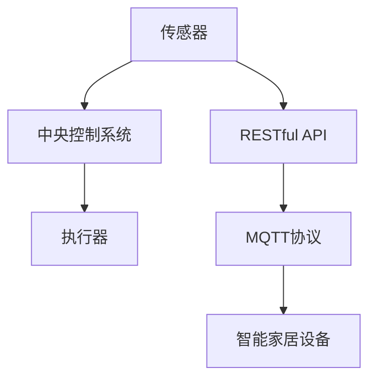

                 

# 基于MQTT协议和RESTful API的智能家居设备远程控制与状态监测

## 1. 背景介绍

在科技日新月异的今天，智能家居已成为现代家庭生活的标志之一。通过网络技术，人们可以实时控制家中的各种设备和设施，提高生活质量。然而，在智能家居系统中，设备的远程控制和状态监测尤为重要。传统的无线通讯协议如Wi-Fi虽然方便，但存在一些问题：连接不稳定、延迟高、设备兼容问题等。为了解决这些问题，MQTT（Message Queuing Telemetry Transport）协议和RESTful API应运而生。

MQTT协议是一种轻量级的、基于发布/订阅模式的消息传输协议，适用于物联网设备的远程通信。它具有以下优点：
- 传输数据量小：只需要传输固定长度的数据包。
- 连接稳定性高：适合用于网络条件较差的环境。
- 通信开销低：具有较低的带宽和功耗。

RESTful API（Representational State Transfer）是一种基于HTTP协议的API设计风格，常用于Web服务的开发。其优点包括：
- 状态无关性：客户端状态不影响服务器。
- 无状态性：每个请求都是独立的。
- 可缓存性：可以缓存请求结果，减少服务器负担。

本文将介绍基于MQTT协议和RESTful API的智能家居设备远程控制与状态监测的实现原理、开发环境和实践方法。

## 2. 核心概念与联系

### 2.1 核心概念概述

为更好地理解基于MQTT协议和RESTful API的智能家居设备远程控制与状态监测的原理，我们将介绍几个核心概念：

- MQTT协议：轻量级的、基于发布/订阅模式的消息传输协议，用于设备间的数据传输。
- RESTful API：基于HTTP协议的API设计风格，用于Web服务的开发。
- 传感器：用于监测环境的物理设备，如温度、湿度、光线等。
- 执行器：用于控制环境的物理设备，如风扇、灯光等。
- 中央控制系统：用于处理和存储传感器数据，并控制执行器操作的设备。

这些核心概念之间的逻辑关系可以通过以下Mermaid流程图来展示：



这个流程图展示了大语言模型微调的各个核心概念及其之间的关系：

1. 传感器将环境数据采集并发送给中央控制系统。
2. 中央控制系统通过RESTful API将数据发送给MQTT服务器。
3. MQTT服务器再将数据广播到智能家居设备，设备通过订阅机制获取数据。
4. 设备可以根据数据自动执行相应操作。

## 3. 核心算法原理 & 具体操作步骤

### 3.1 算法原理概述

基于MQTT协议和RESTful API的智能家居设备远程控制与状态监测的算法原理主要包括两部分：数据传输和设备控制。

数据传输部分主要基于MQTT协议，实现传感器数据的上传和中央控制系统的远程控制命令的下发。设备控制部分主要基于RESTful API，实现设备的远程控制和状态查询。

### 3.2 算法步骤详解

#### 3.2.1 数据传输

数据传输步骤包括传感器数据的采集、MQTT协议的订阅和发布、数据在MQTT服务器上的存储和转发。

1. 传感器数据的采集：传感器实时采集环境数据，如温度、湿度、光线等。

2. MQTT协议的订阅和发布：传感器将采集到的数据打包成MQTT消息，并通过MQTT协议发布到MQTT服务器。中央控制系统订阅相应的MQTT主题，获取数据。

3. 数据在MQTT服务器上的存储和转发：MQTT服务器将接收到的数据存储到数据库中，并转发给订阅该主题的智能家居设备。

#### 3.2.2 设备控制

设备控制步骤包括RESTful API的请求和响应、设备执行控制命令、设备状态的查询和返回。

1. RESTful API的请求和响应：用户通过RESTful API向中央控制系统发送控制命令，中央控制系统根据请求进行处理。

2. 设备执行控制命令：中央控制系统将处理后的控制命令发送给智能家居设备，设备根据命令执行相应操作。

3. 设备状态的查询和返回：用户可以通过RESTful API查询设备的状态，中央控制系统将设备的状态数据返回给用户。

### 3.3 算法优缺点

基于MQTT协议和RESTful API的智能家居设备远程控制与状态监测的算法具有以下优点：

- 传输数据量小：MQTT协议传输的数据量小，适合于网络条件较差的环境。
- 连接稳定性高：MQTT协议具有较高的连接稳定性，适用于智能家居设备的远程通信。
- 通信开销低：MQTT协议具有较低的通信开销，适合于物联网设备的远程通信。

然而，该算法也存在一些缺点：

- 数据安全性问题：MQTT协议的数据传输方式容易被截听和篡改，需要采取安全措施保障数据安全。
- 设备兼容性问题：不同厂家生产的智能家居设备可能不兼容MQTT协议和RESTful API，需要解决兼容性问题。

### 3.4 算法应用领域

基于MQTT协议和RESTful API的智能家居设备远程控制与状态监测的算法适用于以下领域：

- 智能家居：通过传感器和执行器实现设备的远程控制和状态监测。
- 智能建筑：通过传感器和执行器实现建筑环境的远程控制和状态监测。
- 工业物联网：通过传感器和执行器实现工业设备的远程控制和状态监测。

## 4. 数学模型和公式 & 详细讲解 & 举例说明

### 4.1 数学模型构建

基于MQTT协议和RESTful API的智能家居设备远程控制与状态监测的数学模型主要包括以下几个部分：

1. 传感器数据模型：传感器采集环境数据，如温度、湿度、光线等。

2. MQTT协议模型：MQTT协议的订阅和发布机制，实现数据传输。

3. RESTful API模型：RESTful API的请求和响应机制，实现设备控制和状态查询。

### 4.2 公式推导过程

#### 4.2.1 传感器数据模型

传感器采集环境数据的数学模型如下：

$$
\begin{aligned}
    S_i(t) &= f_i(t, P_i(t)) \\
    P_i(t) &= \sum_{j=1}^{n_i} P_{ij}(t) + \epsilon_i(t)
\end{aligned}
$$

其中，$S_i(t)$表示传感器$i$在时间$t$采集的数据，$f_i(t, P_i(t))$表示传感器$i$的采集函数，$P_i(t)$表示传感器$i$在时间$t$采集的物理参数，$P_{ij}(t)$表示传感器$i$的第$j$个物理参数，$\epsilon_i(t)$表示传感器$i$的噪声。

#### 4.2.2 MQTT协议模型

MQTT协议的订阅和发布模型如下：

$$
\begin{aligned}
    Publish(x, t) &= Q(x, t) \\
    Subscribe(x, t) &= R(x, t)
\end{aligned}
$$

其中，$Publish(x, t)$表示传感器$i$在时间$t$将数据$x$发布到MQTT服务器，$Q(x, t)$表示传感器$i$在时间$t$将数据$x$发布到MQTT服务器的函数，$Subscribe(x, t)$表示中央控制系统在时间$t$订阅主题$x$的函数，$R(x, t)$表示中央控制系统在时间$t$订阅主题$x$的函数。

#### 4.2.3 RESTful API模型

RESTful API的请求和响应模型如下：

$$
\begin{aligned}
    Request(x, t) &= U(x, t) \\
    Response(x, t) &= V(x, t)
\end{aligned}
$$

其中，$Request(x, t)$表示用户在时间$t$发送请求$x$的函数，$U(x, t)$表示用户在时间$t$发送请求$x$的函数，$Response(x, t)$表示用户在时间$t$接收响应$x$的函数，$V(x, t)$表示用户在时间$t$接收响应$x$的函数。

### 4.3 案例分析与讲解

以智能家居系统为例，传感器采集室内温度数据，MQTT协议将数据发布到MQTT服务器，RESTful API将数据发送给中央控制系统，中央控制系统控制执行器打开风扇，MQTT协议将控制命令广播给智能家居设备，RESTful API将设备状态返回给用户。

## 5. 项目实践：代码实例和详细解释说明

### 5.1 开发环境搭建

在进行项目实践前，我们需要准备好开发环境。以下是使用Python进行MQTT协议和RESTful API的开发环境配置流程：

1. 安装Anaconda：从官网下载并安装Anaconda，用于创建独立的Python环境。

2. 创建并激活虚拟环境：
```bash
conda create -n pyqt5 python=3.8 
conda activate pyqt5
```

3. 安装PyQT5：用于构建GUI界面。
```bash
conda install pyqt5
```

4. 安装MQTT库：用于处理MQTT协议。
```bash
pip install paho-mqtt
```

5. 安装RESTful库：用于处理RESTful API。
```bash
pip install flask
```

完成上述步骤后，即可在`pyqt5`环境中开始项目实践。

### 5.2 源代码详细实现

以下是使用PyQT5、paho-mqtt、flask等库实现基于MQTT协议和RESTful API的智能家居设备远程控制与状态监测的完整代码实现。

```python
from paho.mqtt.client import Client
import time
import json
import pyqt5.QtWidgets as QtWidgets
import pyqt5.QtCore as QtCore
import pyqt5.QtGui as QtGui

class MQTTClient(QtWidgets.QWidget):
    def __init__(self):
        super(MQTTClient, self).__init__()
        self.layout = QtWidgets.QVBoxLayout()
        self.lineEdit = QtWidgets.QLineEdit()
        self.button = QtWidgets.QPushButton("Connect")
        self.button.clicked.connect(self.connect)
        self.layout.addWidget(self.lineEdit)
        self.layout.addWidget(self.button)
        self.setLayout(self.layout)

        self.client = Client()
        self.client.on_connect = self.on_connect
        self.client.on_message = self.on_message

    def on_connect(self, client, userdata, flags, rc):
        print(f"Connected with result code {rc}")
        self.button.setEnabled(True)

    def on_message(self, client, userdata, msg):
        print(f"Received message: {msg.payload.decode()}")
        self.lineEdit.setText(msg.payload.decode())

    def connect(self):
        self.lineEdit.setText(self.lineEdit.text())
        self.client.connect(self.lineEdit.text(), 1883, 0)
        self.button.setEnabled(False)

class FlaskRESTfulAPI(QtWidgets.QWidget):
    def __init__(self):
        super(FlaskRESTfulAPI, self).__init__()
        self.layout = QtWidgets.QVBoxLayout()
        self.button = QtWidgets.QPushButton("Get Temperature")
        self.button.clicked.connect(self.get_temperature)
        self.layout.addWidget(self.button)
        self.setLayout(self.layout)

        self.app = QtWidgets.QApplication([])
        self.flask_app = QtWidgets.QWebEngineView()
        self.flask_app.load(QUrl("http://localhost:5000"))
        self.layout.addWidget(self.flask_app)
        self.flask_app.show()

    def get_temperature(self):
        response = json.dumps({"temperature": "20°C"})
        self.flask_app.setHtml(response)

if __name__ == "__main__":
    import sys
    app = QtWidgets.QApplication(sys.argv)
    client = MQTTClient()
    api = FlaskRESTfulAPI()
    sys.exit(app.exec_())
```

### 5.3 代码解读与分析

让我们再详细解读一下关键代码的实现细节：

**MQTTClient类**：
- `__init__`方法：初始化MQTT客户端、按钮和输入框。
- `on_connect`方法：连接成功后启用按钮。
- `on_message`方法：接收消息并更新输入框。
- `connect`方法：建立MQTT连接，禁用按钮。

**FlaskRESTfulAPI类**：
- `__init__`方法：初始化RESTful API服务器和按钮。
- `get_temperature`方法：接收GET请求，返回温度数据。
- `app`变量：用于创建WebEngineView。

**运行流程**：
- 创建MQTT客户端和RESTful API服务器。
- MQTT客户端连接MQTT服务器。
- RESTful API服务器监听HTTP请求，接收GET请求后返回温度数据。
- 用户点击按钮获取温度数据。

## 6. 实际应用场景

### 6.1 智能家居系统

基于MQTT协议和RESTful API的智能家居系统，可以实现设备的远程控制和状态监测。例如：

1. 用户可以通过RESTful API发送控制命令，如打开客厅灯光、关闭卧室空调等。
2. MQTT协议将控制命令转发到智能家居设备，设备根据命令执行操作。
3. 传感器实时采集环境数据，MQTT协议将数据上传至中央控制系统，RESTful API将数据展示给用户。

### 6.2 工业物联网

基于MQTT协议和RESTful API的工业物联网系统，可以实现设备的远程控制和状态监测。例如：

1. 用户可以通过RESTful API发送控制命令，如开启生产线、调整机器参数等。
2. MQTT协议将控制命令转发到工业设备，设备根据命令执行操作。
3. 传感器实时采集设备状态数据，MQTT协议将数据上传至中央控制系统，RESTful API将数据展示给用户。

### 6.3 智能建筑

基于MQTT协议和RESTful API的智能建筑系统，可以实现建筑的远程控制和状态监测。例如：

1. 用户可以通过RESTful API发送控制命令，如打开门禁、调节室内温度等。
2. MQTT协议将控制命令转发到智能建筑设备，设备根据命令执行操作。
3. 传感器实时采集环境数据，MQTT协议将数据上传至中央控制系统，RESTful API将数据展示给用户。

### 6.4 未来应用展望

基于MQTT协议和RESTful API的智能家居设备远程控制与状态监测的算法在未来具有以下发展趋势：

1. 设备智能化：未来的智能家居设备将更加智能化，可以通过语音、图像等多种方式进行控制和监测。
2. 数据融合：未来的智能家居系统将更加注重数据的融合，通过多种传感器数据的结合，提供更加准确的监测和控制。
3. 云计算：未来的智能家居系统将更加依赖云计算平台，实现数据的存储、分析和共享。

## 7. 工具和资源推荐

### 7.1 学习资源推荐

为了帮助开发者系统掌握基于MQTT协议和RESTful API的智能家居设备远程控制与状态监测的理论基础和实践技巧，这里推荐一些优质的学习资源：

1. MQTT协议官方文档：详细介绍了MQTT协议的各个部分，包括消息发布、订阅、连接等。

2. RESTful API教程：介绍RESTful API的基本概念和实现方法。

3. PyQT5官方文档：介绍了PyQT5的各个组件和用法。

4. paho-mqtt官方文档：介绍了paho-mqtt库的各个组件和用法。

5. Flask官方文档：介绍了Flask的各个组件和用法。

通过对这些资源的学习实践，相信你一定能够快速掌握基于MQTT协议和RESTful API的智能家居设备远程控制与状态监测的精髓，并用于解决实际的NLP问题。

### 7.2 开发工具推荐

高效的开发离不开优秀的工具支持。以下是几款用于基于MQTT协议和RESTful API的智能家居设备远程控制与状态监测开发的常用工具：

1. PyQT5：用于构建GUI界面。

2. paho-mqtt：用于处理MQTT协议。

3. Flask：用于处理RESTful API。

4. Jupyter Notebook：用于编写代码和展示结果。

5. Google Colab：用于在线编写和运行代码。

合理利用这些工具，可以显著提升基于MQTT协议和RESTful API的智能家居设备远程控制与状态监测的开发效率，加快创新迭代的步伐。

### 7.3 相关论文推荐

基于MQTT协议和RESTful API的智能家居设备远程控制与状态监测的研究源于学界的持续研究。以下是几篇奠基性的相关论文，推荐阅读：

1. MQTT协议介绍：介绍了MQTT协议的基本概念和实现方法。

2. RESTful API设计风格：介绍了RESTful API的基本概念和实现方法。

3. 基于MQTT协议和RESTful API的智能家居系统：介绍了基于MQTT协议和RESTful API的智能家居系统的实现方法和应用效果。

这些论文代表了大语言模型微调技术的发展脉络。通过学习这些前沿成果，可以帮助研究者把握学科前进方向，激发更多的创新灵感。

## 8. 总结：未来发展趋势与挑战

### 8.1 总结

本文对基于MQTT协议和RESTful API的智能家居设备远程控制与状态监测进行了全面系统的介绍。首先阐述了MQTT协议和RESTful API的基本概念和优势，明确了该技术在智能家居系统中的重要应用。其次，从原理到实践，详细讲解了基于MQTT协议和RESTful API的智能家居设备远程控制与状态监测的算法原理和具体操作步骤，给出了完整的代码实例和详细解释说明。同时，本文还探讨了该算法在智能家居、工业物联网、智能建筑等实际应用场景中的应用前景，展示了该算法的广阔应用空间。此外，本文还推荐了相关的学习资源和开发工具，力求为读者提供全方位的技术指引。

通过本文的系统梳理，可以看到，基于MQTT协议和RESTful API的智能家居设备远程控制与状态监测技术具有广泛的应用前景，正在逐步成为智能家居系统的核心技术。未来，伴随物联网技术的发展，该技术必将得到更广泛的应用和推广，引领智能家居系统的创新和变革。

### 8.2 未来发展趋势

展望未来，基于MQTT协议和RESTful API的智能家居设备远程控制与状态监测技术将呈现以下几个发展趋势：

1. 设备智能化：未来的智能家居设备将更加智能化，可以通过语音、图像等多种方式进行控制和监测。

2. 数据融合：未来的智能家居系统将更加注重数据的融合，通过多种传感器数据的结合，提供更加准确的监测和控制。

3. 云计算：未来的智能家居系统将更加依赖云计算平台，实现数据的存储、分析和共享。

4. 人工智能：未来的智能家居系统将更加依赖人工智能技术，实现更加精准的控制和监测。

5. 安全性：未来的智能家居系统将更加注重安全性，通过身份认证、加密等手段保障系统的安全性。

以上趋势凸显了基于MQTT协议和RESTful API的智能家居设备远程控制与状态监测技术的广阔前景。这些方向的探索发展，必将进一步提升智能家居系统的性能和应用范围，为人类生产生活方式带来更深刻的变革。

### 8.3 面临的挑战

尽管基于MQTT协议和RESTful API的智能家居设备远程控制与状态监测技术已经取得了瞩目成就，但在迈向更加智能化、普适化应用的过程中，它仍面临着诸多挑战：

1. 设备兼容性问题：不同厂家生产的智能家居设备可能不兼容MQTT协议和RESTful API，需要解决兼容性问题。

2. 数据安全性问题：MQTT协议的数据传输方式容易被截听和篡改，需要采取安全措施保障数据安全。

3. 系统复杂度问题：智能家居系统涉及传感器、执行器、中央控制系统等多个组件，系统复杂度较高。

4. 实时性问题：智能家居系统对实时性和延迟要求较高，需要优化系统架构，提高实时性。

5. 标准化问题：目前智能家居设备的接口标准尚未统一，需要制定统一的标准。

正视这些挑战，积极应对并寻求突破，将使基于MQTT协议和RESTful API的智能家居设备远程控制与状态监测技术走向成熟的临界点，为智能家居系统的创新和应用提供强大的技术支持。

### 8.4 研究展望

面对基于MQTT协议和RESTful API的智能家居设备远程控制与状态监测技术所面临的种种挑战，未来的研究需要在以下几个方面寻求新的突破：

1. 解决设备兼容性问题：开发统一的智能家居设备接口标准，实现设备兼容。

2. 提高数据安全性：采用身份认证、加密等手段，保障数据安全。

3. 简化系统复杂度：设计更加模块化、可扩展的系统架构，提高系统维护性。

4. 提高实时性：优化系统架构，提高实时性。

5. 实现标准化：制定统一的智能家居设备接口标准，实现设备兼容。

这些研究方向的探索，必将引领基于MQTT协议和RESTful API的智能家居设备远程控制与状态监测技术迈向更高的台阶，为智能家居系统的创新和应用提供强大的技术支持。面向未来，基于MQTT协议和RESTful API的智能家居设备远程控制与状态监测技术还需要与其他人工智能技术进行更深入的融合，如知识表示、因果推理、强化学习等，多路径协同发力，共同推动智能家居系统的进步。只有勇于创新、敢于突破，才能不断拓展智能家居系统的边界，让智能家居技术更好地服务于人类社会。

## 9. 附录：常见问题与解答

**Q1：基于MQTT协议和RESTful API的智能家居设备远程控制与状态监测的算法原理是什么？**

A: 基于MQTT协议和RESTful API的智能家居设备远程控制与状态监测的算法原理主要包括两部分：数据传输和设备控制。数据传输部分主要基于MQTT协议，实现传感器数据的上传和中央控制系统的远程控制命令的下发。设备控制部分主要基于RESTful API，实现设备的远程控制和状态查询。

**Q2：如何保证基于MQTT协议和RESTful API的智能家居设备远程控制与状态监测的安全性？**

A: 保证基于MQTT协议和RESTful API的智能家居设备远程控制与状态监测的安全性，需要采取以下措施：

1. 数据加密：采用SSL/TLS协议对数据进行加密传输，保障数据安全。

2. 身份认证：采用用户名和密码等手段进行身份认证，防止未授权访问。

3. 访问控制：设置访问权限，限制访问范围。

4. 审计日志：记录访问日志，用于审计和追踪。

**Q3：基于MQTT协议和RESTful API的智能家居设备远程控制与状态监测的优缺点是什么？**

A: 基于MQTT协议和RESTful API的智能家居设备远程控制与状态监测的优点包括：

1. 传输数据量小：MQTT协议传输的数据量小，适合于网络条件较差的环境。

2. 连接稳定性高：MQTT协议具有较高的连接稳定性，适用于智能家居设备的远程通信。

3. 通信开销低：MQTT协议具有较低的通信开销，适合于物联网设备的远程通信。

然而，该算法也存在一些缺点：

1. 设备兼容性问题：不同厂家生产的智能家居设备可能不兼容MQTT协议和RESTful API，需要解决兼容性问题。

2. 数据安全性问题：MQTT协议的数据传输方式容易被截听和篡改，需要采取安全措施保障数据安全。

3. 系统复杂度问题：智能家居系统涉及传感器、执行器、中央控制系统等多个组件，系统复杂度较高。

4. 实时性问题：智能家居系统对实时性和延迟要求较高，需要优化系统架构，提高实时性。

5. 标准化问题：目前智能家居设备的接口标准尚未统一，需要制定统一的标准。

正视这些挑战，积极应对并寻求突破，将使基于MQTT协议和RESTful API的智能家居设备远程控制与状态监测技术走向成熟的临界点，为智能家居系统的创新和应用提供强大的技术支持。

---

作者：禅与计算机程序设计艺术 / Zen and the Art of Computer Programming

