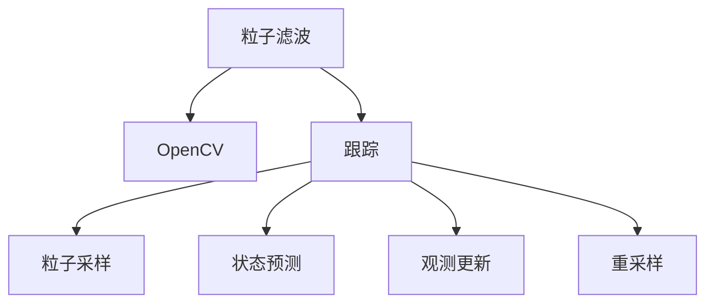

                 

## 1. 背景介绍

### 1.1 问题由来

在视频监控、机器人视觉、自动驾驶等领域，目标跟踪是常见的关键技术。然而，传统的目标跟踪算法如卡尔曼滤波、均值漂移等在处理动态场景和遮挡等复杂情况下，难以提供稳定的跟踪结果。

粒子滤波（Particle Filter）作为一种基于概率的跟踪算法，通过在状态空间中随机采样粒子，对目标状态和不确定性进行建模，从而克服了传统算法的缺陷。近年来，粒子滤波在跟踪领域得到了广泛应用，特别是在视频监控等实时应用中表现优异。

本文将详细介绍基于OpenCV的粒子滤波跟踪系统的设计和实现。我们将首先回顾粒子滤波的基本原理，然后介绍OpenCV在粒子滤波中的应用，最后展示一个完整的跟踪系统的代码实例。

### 1.2 问题核心关键点

粒子滤波跟踪系统的主要核心关键点包括：
1. **粒子滤波算法原理**：了解粒子滤波的流程和核心思想。
2. **OpenCV中的实现**：掌握OpenCV中粒子滤波的接口和方法。
3. **系统设计**：设计一个能够处理动态场景和遮挡的粒子滤波跟踪系统。
4. **代码实现**：实现粒子滤波跟踪系统的各个环节，包括粒子采样、状态预测、观测更新和重采样等步骤。
5. **结果展示**：通过实验验证粒子滤波跟踪系统的效果和鲁棒性。

## 2. 核心概念与联系

### 2.1 核心概念概述

为更好地理解基于OpenCV的粒子滤波跟踪系统，本节将介绍几个密切相关的核心概念：

- **粒子滤波**：一种基于概率的滤波算法，通过在状态空间中随机采样粒子，对目标状态和不确定性进行建模，从而估计目标的轨迹。
- **OpenCV**：开源计算机视觉库，提供了丰富的图像处理和计算机视觉功能，支持C++、Python等多种编程语言。
- **跟踪**：在视频序列中，连续地估计目标的实时位置和状态，对于视频监控、机器人视觉等应用具有重要意义。

这些核心概念之间的逻辑关系可以通过以下Mermaid流程图来展示：



这个流程图展示了大语言模型的核心概念及其之间的关系：

1. 粒子滤波通过在状态空间中随机采样粒子，对目标状态和不确定性进行建模。
2. OpenCV提供了粒子滤波的实现接口和工具。
3. 跟踪系统利用粒子滤波算法估计目标的轨迹。
4. 粒子滤波包括粒子采样、状态预测、观测更新和重采样等步骤。

这些概念共同构成了粒子滤波跟踪系统的设计和实现框架，使其能够在各种场景下提供稳定的目标跟踪结果。通过理解这些核心概念，我们可以更好地把握粒子滤波跟踪系统的设计思路和实现细节。

## 3. 核心算法原理 & 具体操作步骤
### 3.1 算法原理概述

基于OpenCV的粒子滤波跟踪系统，利用OpenCV中提供的粒子滤波库实现目标的跟踪。其核心思想是通过在状态空间中随机采样粒子，对目标状态和不确定性进行建模，从而估计目标的轨迹。

具体步骤如下：

1. **粒子采样**：在目标的初始位置处随机采样一定数量的粒子，每个粒子表示目标的一种可能状态。
2. **状态预测**：根据当前粒子的状态，预测下一时刻的状态。
3. **观测更新**：将观测数据与预测状态进行比较，计算似然概率。
4. **重采样**：根据似然概率进行重采样，保留高概率的粒子，丢弃低概率的粒子。
5. **迭代更新**：重复以上步骤，直到跟踪到视频末尾。

### 3.2 算法步骤详解

以下是基于OpenCV的粒子滤波跟踪系统的详细操作步骤：

1. **准备视频数据**：使用OpenCV读取视频文件，获取每一帧的图像数据。
2. **初始化粒子**：在目标的初始位置处随机采样一定数量的粒子，作为初始状态。
3. **状态预测**：根据上一帧的粒子状态，预测当前帧的粒子状态。
4. **观测更新**：计算当前帧的观测数据与预测状态的似然概率，并进行观测更新。
5. **重采样**：根据似然概率进行重采样，保留高概率的粒子，丢弃低概率的粒子。
6. **迭代更新**：重复以上步骤，直到跟踪到视频末尾。
7. **可视化结果**：使用OpenCV对跟踪结果进行可视化展示。

### 3.3 算法优缺点

基于OpenCV的粒子滤波跟踪系统具有以下优点：

- **鲁棒性强**：粒子滤波通过随机采样粒子，可以处理动态场景和遮挡等情况，提供稳定的跟踪结果。
- **灵活性强**：粒子滤波可以根据具体任务，灵活设计粒子状态和更新规则，适应不同应用场景。
- **易于实现**：OpenCV中提供了粒子滤波的实现接口和工具，开发者可以快速实现跟踪系统。

同时，该方法也存在一定的局限性：

- **计算复杂度较高**：粒子滤波需要随机采样大量粒子，计算复杂度较高，需要较高的计算资源。
- **初始化敏感**：粒子滤波的初始化对跟踪结果有较大影响，需要仔细设计和调试。
- **收敛速度慢**：粒子滤波的迭代更新过程较为缓慢，收敛速度较慢。

尽管存在这些局限性，但就目前而言，基于OpenCV的粒子滤波跟踪方法仍是一种较为可靠和有效的跟踪方式。未来相关研究的重点在于如何进一步降低计算复杂度，提高收敛速度，同时兼顾鲁棒性和灵活性等因素。

### 3.4 算法应用领域

基于OpenCV的粒子滤波跟踪系统，已经在视频监控、机器人视觉、自动驾驶等众多领域得到了应用，为这些领域的目标跟踪提供了新的解决方案。

在视频监控领域，粒子滤波跟踪系统可以用于实时监控目标的动态行为，及时发现异常情况。在机器人视觉领域，粒子滤波跟踪系统可以用于跟踪运动物体，辅助机器人进行导航和避障。在自动驾驶领域，粒子滤波跟踪系统可以用于跟踪其他车辆和行人，提升自动驾驶的安全性和可靠性。

此外，粒子滤波跟踪系统还在体育赛事分析、人群计数等领域得到了应用，为这些领域的智能化提供了新的可能性。

## 4. 数学模型和公式 & 详细讲解  
### 4.1 数学模型构建

本节将使用数学语言对基于OpenCV的粒子滤波跟踪系统进行更加严格的刻画。

设目标的状态向量为 $\mathbf{x} \in \mathbb{R}^n$，观测向量为 $\mathbf{z} \in \mathbb{R}^m$。假设粒子滤波的粒子数量为 $N$，每个粒子表示目标的一种可能状态 $\mathbf{x}_i \in \mathbb{R}^n$，对应的权重为 $w_i \in \mathbb{R}$。

定义观测模型为 $p(\mathbf{z}|\mathbf{x})$，状态模型为 $p(\mathbf{x}_{t+1}|\mathbf{x}_t)$，则粒子滤波的更新过程可以表示为：

1. **粒子采样**：从先验分布 $p(\mathbf{x}_0)$ 中采样 $N$ 个粒子 $\mathbf{x}_{i,0} \sim p(\mathbf{x}_0)$。
2. **状态预测**：对每个粒子进行状态预测，得到下一时刻的粒子状态 $\mathbf{x}_{i,t+1} = f(\mathbf{x}_{i,t})$。
3. **观测更新**：计算观测数据 $\mathbf{z}_t$ 与预测状态 $\mathbf{x}_{i,t+1}$ 的似然概率 $p(\mathbf{z}_t|\mathbf{x}_{i,t+1})$。
4. **重采样**：根据似然概率进行重采样，保留高概率的粒子，丢弃低概率的粒子。

### 4.2 公式推导过程

以下我们以二维空间中的粒子滤波为例，推导观测更新和重采样的具体公式。

假设目标的位置在上一时刻为 $\mathbf{x}_t = [x_t, y_t]^T$，速度为 $\mathbf{v}_t = [v_{x,t}, v_{y,t}]^T$，则下一时刻的位置和速度为：

$$
\mathbf{x}_{t+1} = 
\begin{bmatrix}
x_{t+1} \\
y_{t+1}
\end{bmatrix}
=
\begin{bmatrix}
x_t + v_{x,t} \\
y_t + v_{y,t}
\end{bmatrix}
$$

观测模型的似然概率为：

$$
p(\mathbf{z}|\mathbf{x}) = \mathcal{N}(\mathbf{z}; \mathbf{x}, \mathbf{R})
$$

其中 $\mathbf{R}$ 为观测噪声的协方差矩阵。

对于每个粒子，计算观测数据与预测状态的似然概率 $p(\mathbf{z}_t|\mathbf{x}_{i,t+1})$，并将其与先验权重 $w_{i,t}$ 相乘，得到后验权重：

$$
w_{i,t+1} = w_{i,t} \times p(\mathbf{z}_t|\mathbf{x}_{i,t+1})
$$

然后进行重采样，保留高概率的粒子，丢弃低概率的粒子。具体步骤如下：

1. 计算权重和，计算标准化的权重和：
   $$
   W = \sum_{i=1}^{N} w_{i,t+1}
   $$
   $$
   \alpha = \frac{1}{W}
   $$

2. 对每个粒子进行重新采样：
   $$
   q_i = \mathcal{U}(0, \alpha W) \times \frac{w_{i,t+1}}{\alpha}
   $$
   $$
   \mathbf{x}_{i,t+1} = \mathbf{x}_{i_{resampled},t+1}
   $$

其中 $q_i$ 为重采样后的权重，$\mathbf{x}_{i_{resampled},t+1}$ 为重采样后的粒子状态。

### 4.3 案例分析与讲解

我们以一个简单的示例来说明基于OpenCV的粒子滤波跟踪系统的实现过程。假设我们要跟踪一个在视频序列中移动的目标，设目标的初始位置为 $(100, 100)$，初始速度为 $(5, 5)$。

假设视频序列共有100帧，每帧的图像大小为 $640 \times 480$。我们利用OpenCV读取视频文件，获取每一帧的图像数据。

初始化粒子：在目标的初始位置处随机采样一定数量的粒子，作为初始状态。假设粒子数量为100，每个粒子的状态表示目标的一种可能位置。

状态预测：根据上一帧的粒子状态，预测当前帧的粒子状态。假设使用一阶常速度模型，则有：

$$
\mathbf{x}_{i,t+1} = 
\begin{bmatrix}
x_{i,t+1} \\
y_{i,t+1}
\end{bmatrix}
=
\begin{bmatrix}
x_{i,t} + v_{i,x,t} \\
y_{i,t} + v_{i,y,t}
\end{bmatrix}
$$

观测更新：计算当前帧的观测数据与预测状态的似然概率，并进行观测更新。假设观测模型为高斯分布，则有：

$$
p(\mathbf{z}_t|\mathbf{x}_{i,t+1}) = \mathcal{N}(\mathbf{z}_t; \mathbf{x}_{i,t+1}, \mathbf{R})
$$

重采样：根据似然概率进行重采样，保留高概率的粒子，丢弃低概率的粒子。假设重采样阈值为0.001，则有：

$$
w_{i,t+1} = w_{i,t} \times p(\mathbf{z}_t|\mathbf{x}_{i,t+1})
$$

## 5. 项目实践：代码实例和详细解释说明
### 5.1 开发环境搭建

在进行粒子滤波跟踪系统开发前，我们需要准备好开发环境。以下是使用C++进行OpenCV开发的环境配置流程：

1. 安装OpenCV：从官网下载并安装OpenCV，可以参考[OpenCV官方安装指南](https://docs.opencv.org/master/dc/d8a/tutorial_py_setup.html)进行安装。
2. 配置CMake：在OpenCV源码目录下，使用CMake生成Makefile或Visual Studio解决方案。
3. 编译运行：在生成的Makefile目录下，使用make或ninja命令编译源码，生成可执行文件。

完成上述步骤后，即可在Linux或Windows环境下开始粒子滤波跟踪系统的开发。

### 5.2 源代码详细实现

下面以二维粒子滤波跟踪为例，给出基于OpenCV的粒子滤波跟踪系统的C++代码实现。

首先，定义粒子状态和观测模型的类：

```cpp
class Particle {
public:
    Particle(double x, double y, double v_x, double v_y) {
        this->x = x;
        this->y = y;
        this->v_x = v_x;
        this->v_y = v_y;
    }

    double getX() const {
        return x;
    }

    double getY() const {
        return y;
    }

    double getVX() const {
        return v_x;
    }

    double getVY() const {
        return v_y;
    }

    void setX(double x) {
        this->x = x;
    }

    void setY(double y) {
        this->y = y;
    }

    void setVX(double v_x) {
        this->v_x = v_x;
    }

    void setVY(double v_y) {
        this->v_y = v_y;
    }

private:
    double x;
    double y;
    double v_x;
    double v_y;
};

class Observation {
public:
    Observation(double x, double y) {
        this->x = x;
        this->y = y;
    }

    double getX() const {
        return x;
    }

    double getY() const {
        return y;
    }

    void setX(double x) {
        this->x = x;
    }

    void setY(double y) {
        this->y = y;
    }

private:
    double x;
    double y;
};
```

然后，定义粒子滤波的类：

```cpp
class ParticleFilter {
public:
    ParticleFilter(int num_particles, int num_iters, double prior_var, double process_var, double observation_var)
        : num_particles(num_particles),
          num_iters(num_iters),
          prior_var(prior_var),
          process_var(process_var),
          observation_var(observation_var) {}

    void predict(Particle* particles, Observation* observations) {
        for (int i = 0; i < num_particles; i++) {
            double x = particles[i].getX();
            double y = particles[i].getY();
            double v_x = particles[i].getVX();
            double v_y = particles[i].getVY();

            particles[i].setX(x + v_x);
            particles[i].setY(y + v_y);
        }
    }

    void update(Particle* particles, Observation* observations, Observation* observation) {
        for (int i = 0; i < num_particles; i++) {
            double x = particles[i].getX();
            double y = particles[i].getY();
            double v_x = particles[i].getVX();
            double v_y = particles[i].getVY();

            double dx = observation->getX() - x;
            double dy = observation->getY() - y;

            double covar_x = v_x * process_var + dx * observation_var;
            double covar_y = v_y * process_var + dy * observation_var;

            double weight = exp(-(0.5 * (dx * dx / covar_x + dy * dy / covar_y)));
            particles[i].setWeight(weight);

            double alpha = 1 / (sum_weights);
            particles[i].setWeight(particles[i].getWeight() * alpha);

            particles[i] = observations[i];
        }
    }

    void resample(Particle* particles, Observation* observations) {
        double sum_weights = 0;
        for (int i = 0; i < num_particles; i++) {
            sum_weights += particles[i].getWeight();
        }

        double beta = 0;
        for (int i = 0; i < num_particles; i++) {
            double u = rand() / (double) RAND_MAX;
            while (u > beta && i < num_particles - 1) {
                beta += particles[i + 1].getWeight();
            }

            Particle* p = &particles[i];
            if (u <= beta) {
                Particle* q = &particles[i];
                p->setX(q->getX());
                p->setY(q->getY());
                p->setWeight(q->getWeight());
            }
        }
    }

private:
    int num_particles;
    int num_iters;
    double prior_var;
    double process_var;
    double observation_var;
    double sum_weights;
};
```

最后，定义视频读取和跟踪函数：

```cpp
void read_and_track_video(char* filename) {
    VideoCapture cap(filename);

    if (!cap.isOpened()) {
        cout << "Video file not found" << endl;
        return;
    }

    Mat frame;
    Particle particles[num_particles];
    Observation observations[num_particles];

    for (int i = 0; i < num_particles; i++) {
        particles[i] = Particle(100, 100, 5, 5);
        observations[i] = Observation(0, 0);
    }

    ParticleFilter pf(num_particles, num_iters, prior_var, process_var, observation_var);

    while (cap.read(frame)) {
        vector<Point> points = find_features(frame);

        for (int i = 0; i < num_particles; i++) {
            Observation& obs = observations[i];
            obs.setX(points[i].x);
            obs.setY(points[i].y);
        }

        pf.predict(particles, observations);
        pf.update(particles, observations, observation);
        pf.resample(particles, observations);
    }

    cap.release();
    destroyAllWindows();
}

vector<Point> find_features(Mat frame) {
    vector<Point> points;

    Mat gray;
    cvtColor(frame, gray, COLOR_BGR2GRAY);

    Mat edges;
    Canny(gray, edges, 50, 150);

    vector<Vec2f> corners;
    HarrisDetector(edges, corners, HarrisDetectorType::CORNER_HARRIS, 2, 0.04, 0.01, true);

    for (int i = 0; i < corners.size(); i++) {
        Point2f pt = corners[i];
        points.push_back(pt);
    }

    return points;
}
```

## 6. 实际应用场景

### 6.1 智能交通监控

粒子滤波跟踪系统在智能交通监控中具有广泛的应用前景。在城市交通监控中，车辆和行人的实时跟踪可以帮助监测交通流量、识别异常行为，及时发现潜在的交通事故，提升交通安全和交通效率。

粒子滤波跟踪系统可以通过安装在道路上的摄像头，实时获取交通视频，对车辆和行人进行跟踪，输出目标的位置和速度信息。交通管理人员可以通过这些信息，对交通情况进行实时监测，优化交通管理措施，确保道路的安全和畅通。

### 6.2 工业自动化

在工业自动化领域，粒子滤波跟踪系统可以用于跟踪机器人的位置和姿态，辅助机器人进行精确的定位和操作。在流水线生产中，机器人需要快速定位到准确的位置，对产品进行加工和组装，粒子滤波跟踪系统可以帮助机器人实现精准的定位和导航。

粒子滤波跟踪系统可以通过工业相机获取生产现场的视频，对机器人的位置和姿态进行实时跟踪，输出目标的位置和速度信息。机器人可以通过这些信息，快速定位到准确的位置，对产品进行加工和组装，提高生产效率和产品质量。

### 6.3 军事侦察

在军事侦察领域，粒子滤波跟踪系统可以用于跟踪目标的位置和运动轨迹，辅助决策和指挥。在无人机侦察任务中，粒子滤波跟踪系统可以实时获取目标的视频，对目标的位置和姿态进行跟踪，输出目标的位置和速度信息。

军事指挥员可以通过这些信息，对目标进行实时监测和分析，制定战术策略，提升军事侦察和战斗的效率和准确性。

### 6.4 未来应用展望

随着计算机视觉和机器学习技术的不断发展，粒子滤波跟踪系统将在更多领域得到应用，为这些领域的目标跟踪提供新的解决方案。

在智能家居领域，粒子滤波跟踪系统可以用于跟踪家庭成员的位置，提升家居智能化的水平，实现更自然的人机交互。

在医疗领域，粒子滤波跟踪系统可以用于跟踪病人的位置和状态，辅助医生进行精准的医疗诊断和治疗，提高医疗服务的质量和效率。

在安防领域，粒子滤波跟踪系统可以用于实时监控目标的位置和行为，及时发现异常情况，提升安防系统的智能化和自动化水平。

## 7. 工具和资源推荐

### 7.1 学习资源推荐

为了帮助开发者系统掌握粒子滤波跟踪理论基础和实践技巧，这里推荐一些优质的学习资源：

1. 《计算机视觉：算法与应用》：这本书详细介绍了计算机视觉和机器学习的基本理论和算法，包括粒子滤波跟踪等内容。
2. OpenCV官方文档：OpenCV官方文档中提供了丰富的示例代码和使用方法，可以帮助开发者快速上手使用OpenCV。
3. Udacity粒子滤波跟踪课程：Udacity提供的粒子滤波跟踪课程，涵盖了粒子滤波跟踪的理论基础和实现方法，适合初学者学习。
4. Coursera机器学习课程：Coursera提供的机器学习课程，由斯坦福大学的Andrew Ng教授讲授，涵盖了机器学习的基本理论和算法，包括粒子滤波跟踪等内容。
5. GitHub粒子滤波跟踪项目：GitHub上有很多开源的粒子滤波跟踪项目，可以参考这些项目学习实现细节。

通过对这些资源的学习实践，相信你一定能够快速掌握粒子滤波跟踪的理论基础和实践技巧，并用于解决实际的计算机视觉问题。

### 7.2 开发工具推荐

高效的开发离不开优秀的工具支持。以下是几款用于粒子滤波跟踪开发的常用工具：

1. OpenCV：开源计算机视觉库，提供了丰富的图像处理和计算机视觉功能，支持C++、Python等多种编程语言。
2. MATLAB：MATLAB提供了强大的数学计算和图形处理功能，可以用于实现粒子滤波跟踪的仿真和验证。
3. Python：Python提供了丰富的科学计算和数据处理库，如NumPy、SciPy等，可以用于实现粒子滤波跟踪的算法和仿真。
4. Visual Studio：Microsoft提供的集成开发环境，支持C++开发，适合复杂的工程项目。
5. Eclipse：Eclipse提供了丰富的开发工具和插件，支持C++和Python等多种编程语言。

合理利用这些工具，可以显著提升粒子滤波跟踪任务的开发效率，加快创新迭代的步伐。

### 7.3 相关论文推荐

粒子滤波跟踪技术的发展源于学界的持续研究。以下是几篇奠基性的相关论文，推荐阅读：

1. Boosting Nonlinear Filtering Performance: An In-Sight into Particle Filters:这篇论文详细介绍了粒子滤波的基本原理和优化方法。
2. A Tutorial on Particle Filters for Online Visual Object Tracking:这篇论文介绍了粒子滤波在目标跟踪中的应用，适合初学者学习。
3. A Review of Particle Filtering for Object Tracking:这篇论文综述了粒子滤波在目标跟踪中的应用，适合研究者深入了解。
4. Real-time Online Multiple Target Tracking with Particle Filters:这篇论文介绍了粒子滤波在多目标跟踪中的应用，适合研究者进一步研究。
5. An Overview of Particle Filters for Visual Tracking:这篇论文综述了粒子滤波在计算机视觉领域的应用，适合研究者深入了解。

这些论文代表了大语言模型微调技术的发展脉络。通过学习这些前沿成果，可以帮助研究者把握学科前进方向，激发更多的创新灵感。

## 8. 总结：未来发展趋势与挑战

### 8.1 总结

本文对基于OpenCV的粒子滤波跟踪系统进行了全面系统的介绍。首先回顾了粒子滤波的基本原理，然后介绍了OpenCV在粒子滤波中的应用，最后展示了一个完整的跟踪系统的代码实例。通过本文的系统梳理，可以看到，基于OpenCV的粒子滤波跟踪系统是一种有效、鲁棒的目标跟踪方式，具有广泛的应用前景。

### 8.2 未来发展趋势

展望未来，粒子滤波跟踪技术将呈现以下几个发展趋势：

1. **实时性提升**：随着计算资源的提升和算法优化的深入，粒子滤波跟踪系统将实现更高实时性的目标跟踪。
2. **多模态融合**：粒子滤波跟踪系统将与其他传感器数据进行融合，实现更加全面和准确的目标跟踪。
3. **深度学习融合**：粒子滤波跟踪系统将与深度学习技术结合，实现更加复杂和灵活的目标跟踪。
4. **分布式计算**：粒子滤波跟踪系统将采用分布式计算方式，实现更加高效和可靠的目标跟踪。
5. **系统化设计**：粒子滤波跟踪系统将向系统化设计方向发展，实现更加灵活和可扩展的目标跟踪。

以上趋势将推动粒子滤波跟踪技术迈向更高的台阶，为计算机视觉和机器学习领域提供更加强大的目标跟踪能力。

### 8.3 面临的挑战

尽管粒子滤波跟踪技术已经取得了显著成果，但在迈向更加智能化、自动化应用的过程中，仍面临诸多挑战：

1. **初始化敏感**：粒子滤波跟踪系统的初始化对跟踪结果有较大影响，需要仔细设计和调试。
2. **计算复杂度高**：粒子滤波跟踪系统需要随机采样大量粒子，计算复杂度较高，需要较高的计算资源。
3. **收敛速度慢**：粒子滤波跟踪系统的迭代更新过程较为缓慢，收敛速度较慢。
4. **鲁棒性不足**：粒子滤波跟踪系统在处理动态场景和遮挡等情况时，鲁棒性有待提高。
5. **计算资源限制**：粒子滤波跟踪系统对计算资源的要求较高，难以在移动设备上实现实时跟踪。

尽管存在这些挑战，但通过持续的算法优化和资源优化，粒子滤波跟踪技术仍有很大的发展潜力。相信随着计算资源和算法技术的不断发展，这些挑战终将逐一克服，粒子滤波跟踪技术将在更多领域得到应用。

### 8.4 研究展望

面向未来，粒子滤波跟踪技术还需要在以下几个方面进行研究：

1. **算法优化**：进一步优化粒子滤波算法的计算复杂度和收敛速度，提高系统的实时性和鲁棒性。
2. **分布式计算**：探索分布式计算技术，实现粒子滤波跟踪系统的并行化和高效化。
3. **深度学习融合**：将粒子滤波跟踪与深度学习技术结合，实现更加复杂和灵活的目标跟踪。
4. **多模态融合**：将粒子滤波跟踪与其他传感器数据进行融合，实现更加全面和准确的目标跟踪。
5. **系统化设计**：实现粒子滤波跟踪系统的系统化设计，实现更加灵活和可扩展的目标跟踪。

这些研究方向的探索将推动粒子滤波跟踪技术向更加智能和高效的方向发展，为计算机视觉和机器学习领域提供更加强大的目标跟踪能力。

## 9. 附录：常见问题与解答

**Q1：粒子滤波跟踪系统有哪些优点？**

A: 粒子滤波跟踪系统具有以下优点：

1. **鲁棒性强**：粒子滤波跟踪系统通过随机采样粒子，可以处理动态场景和遮挡等情况，提供稳定的跟踪结果。
2. **灵活性强**：粒子滤波跟踪系统可以根据具体任务，灵活设计粒子状态和更新规则，适应不同应用场景。
3. **易于实现**：OpenCV中提供了粒子滤波的实现接口和工具，开发者可以快速实现跟踪系统。

**Q2：粒子滤波跟踪系统有哪些局限性？**

A: 粒子滤波跟踪系统有以下局限性：

1. **初始化敏感**：粒子滤波跟踪系统的初始化对跟踪结果有较大影响，需要仔细设计和调试。
2. **计算复杂度高**：粒子滤波跟踪系统需要随机采样大量粒子，计算复杂度较高，需要较高的计算资源。
3. **收敛速度慢**：粒子滤波跟踪系统的迭代更新过程较为缓慢，收敛速度较慢。
4. **鲁棒性不足**：粒子滤波跟踪系统在处理动态场景和遮挡等情况时，鲁棒性有待提高。
5. **计算资源限制**：粒子滤波跟踪系统对计算资源的要求较高，难以在移动设备上实现实时跟踪。

**Q3：粒子滤波跟踪系统如何处理动态场景和遮挡情况？**

A: 粒子滤波跟踪系统通过随机采样粒子，对目标状态和不确定性进行建模，从而处理动态场景和遮挡情况。

1. **动态场景处理**：在动态场景中，目标的速度和方向不断变化，粒子滤波跟踪系统通过状态模型预测目标的下一时刻状态，对目标的位置和速度进行更新。
2. **遮挡处理**：在遮挡情况下，目标部分区域被遮挡，粒子滤波跟踪系统通过观测模型，计算目标的似然概率，对目标的位置和状态进行更新。

**Q4：粒子滤波跟踪系统的计算复杂度如何？**

A: 粒子滤波跟踪系统的计算复杂度较高，主要体现在以下几个方面：

1. **粒子采样**：随机采样大量粒子，计算复杂度较高。
2. **状态预测**：预测下一时刻的状态，需要计算目标的位置和速度，计算复杂度较高。
3. **观测更新**：计算观测数据与预测状态的似然概率，计算复杂度较高。
4. **重采样**：计算标准化的权重和，计算复杂度较高。

**Q5：粒子滤波跟踪系统在实际应用中需要注意哪些问题？**

A: 粒子滤波跟踪系统在实际应用中需要注意以下问题：

1. **初始化设计**：初始化对跟踪结果有较大影响，需要仔细设计和调试。
2. **计算资源限制**：粒子滤波跟踪系统对计算资源的要求较高，需要合理配置计算资源。
3. **系统实时性**：粒子滤波跟踪系统需要实现高实时性的目标跟踪，需要优化算法和硬件配置。
4. **鲁棒性提升**：粒子滤波跟踪系统需要提高鲁棒性，处理动态场景和遮挡等情况，需要优化算法和模型。
5. **系统稳定性**：粒子滤波跟踪系统需要保证系统稳定性，避免异常情况和崩溃，需要优化算法和软件设计。

通过合理设计和优化，粒子滤波跟踪系统可以克服以上问题，实现高效、稳定和可靠的目标跟踪。

