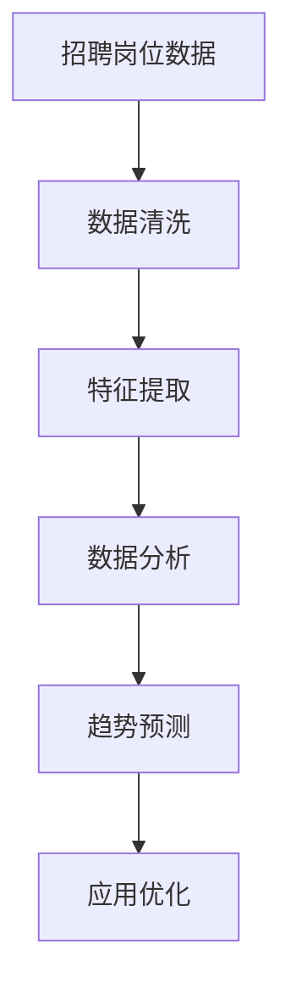

                 

# 基于前程无忧下的招聘岗位数据分析

在当今数字化时代，大数据分析正成为各行各业重要的决策支持工具。招聘行业也不例外。本文将基于前程无忧（51job）的招聘岗位数据，对招聘岗位的结构、分布及变化趋势进行分析，以期为招聘行业提供有价值的洞见，帮助企业优化招聘策略。

## 1. 背景介绍

### 1.1 招聘行业现状
招聘行业一直是数字化转型的重要领域。然而，当前招聘过程中存在诸多挑战：

- **人才缺口严重**：许多行业面临人才短缺的问题，尤其是技术、医疗、教育等领域。
- **招聘效率低**：传统招聘流程繁琐，周期长，效率低下。
- **候选人匹配度低**：求职者与招聘需求的匹配度不高，导致招聘成本上升。

为了应对这些挑战，企业需要利用大数据分析，深入挖掘岗位数据，优化招聘策略，提升招聘效率和候选人匹配度。

### 1.2 数据来源
本研究的数据来源于前程无忧（51job）招聘平台。前程无忧作为中国最大的招聘网站之一，拥有海量的招聘信息，涵盖各行各业，能够为我们提供丰富的数据样本。

## 2. 核心概念与联系

### 2.1 核心概念概述
- **招聘岗位数据**：包括职位名称、公司名称、薪资、地点、招聘要求等。
- **数据分析**：通过对招聘数据进行统计、分类、建模等操作，提取有价值的信息，支持决策。
- **趋势预测**：基于历史数据，预测未来招聘市场的变化趋势。

### 2.2 核心概念原理和架构的 Mermaid 流程图



该流程图展示了从招聘岗位数据到最终应用优化的主要流程：

1. **数据清洗**：处理缺失值、异常值，确保数据质量。
2. **特征提取**：从原始数据中提取有意义的特征，如职位类型、薪资范围等。
3. **数据分析**：使用统计学方法、机器学习模型等进行数据分析，发现岗位分布规律。
4. **趋势预测**：使用时间序列分析等方法，预测未来岗位需求的变化。
5. **应用优化**：根据分析结果，提出优化招聘策略的建议。

## 3. 核心算法原理 & 具体操作步骤

### 3.1 算法原理概述
基于招聘岗位数据分析，我们主要采用以下算法：

- **描述性统计分析**：计算招聘数据的均值、中位数、标准差等基本统计量。
- **时间序列分析**：通过时间序列模型，分析招聘需求随时间的变化规律。
- **聚类分析**：使用K-means等聚类算法，将职位按类型、薪资、地点等维度进行分组。
- **预测模型**：构建基于随机森林、梯度提升树等模型的预测模型，预测未来岗位需求。

### 3.2 算法步骤详解

#### 3.2.1 数据清洗
数据清洗是数据分析的重要环节，主要步骤如下：

1. **缺失值处理**：识别缺失值，并根据业务逻辑进行填补或删除。
2. **异常值检测**：检测并处理异常值，确保数据一致性。
3. **数据标准化**：对数据进行归一化处理，消除不同特征之间的尺度差异。

#### 3.2.2 特征提取
特征提取是数据分析的关键步骤，主要包括以下步骤：

1. **基本特征提取**：提取职位名称、公司名称、薪资、地点等基本特征。
2. **衍生特征提取**：如职位类型（技术、管理、销售等）、薪资范围、招聘要求等。
3. **文本特征提取**：将职位描述、公司介绍等文本数据转化为向量表示，便于机器学习处理。

#### 3.2.3 数据分析
数据分析主要包括以下步骤：

1. **描述性统计分析**：计算招聘数据的均值、中位数、标准差等基本统计量。
2. **可视化分析**：使用图表展示岗位分布情况，如热力图、散点图等。
3. **聚类分析**：使用K-means等聚类算法，将职位按类型、薪资、地点等维度进行分组。

#### 3.2.4 趋势预测
趋势预测主要包括以下步骤：

1. **时间序列模型选择**：选择合适的模型，如ARIMA、LSTM等。
2. **模型训练**：使用历史数据训练预测模型。
3. **预测结果评估**：使用MAE、RMSE等指标评估预测结果的准确性。

### 3.3 算法优缺点
基于招聘岗位数据分析的主要优点包括：

- **数据丰富**：前程无忧拥有丰富的招聘数据，能够进行全面的分析。
- **分析深入**：采用多种分析方法，能够从不同维度深入挖掘岗位数据。
- **应用广泛**：分析结果可应用于招聘策略优化、人才市场预测等方面。

同时，也存在以下缺点：

- **数据质量**：招聘数据存在一定的不一致性和缺失，需要进行清洗。
- **模型复杂性**：多种算法结合使用，模型构建较为复杂。
- **预测难度**：岗位需求受到多因素影响，预测难度较大。

### 3.4 算法应用领域
基于招聘岗位数据分析主要应用于以下几个领域：

- **招聘策略优化**：通过分析岗位需求和趋势，优化招聘策略，提升招聘效率。
- **人才市场预测**：预测未来的人才需求，帮助企业提前做好人才储备。
- **候选人匹配**：基于职位和候选人的特征，提高候选人匹配度。
- **公司画像**：分析公司招聘行为和需求，构建公司画像，提升招聘效果。

## 4. 数学模型和公式 & 详细讲解 & 举例说明

### 4.1 数学模型构建
在招聘岗位数据分析中，我们主要使用以下数学模型：

- **描述性统计模型**：均值、中位数、标准差等。
- **时间序列模型**：ARIMA、LSTM等。
- **聚类模型**：K-means等。
- **预测模型**：随机森林、梯度提升树等。

### 4.2 公式推导过程

#### 4.2.1 描述性统计公式
描述性统计量计算公式如下：

$$
\mu = \frac{1}{N} \sum_{i=1}^{N} x_i \\
\sigma = \sqrt{\frac{1}{N} \sum_{i=1}^{N} (x_i - \mu)^2}
$$

其中，$x_i$ 表示第 $i$ 个数据点，$N$ 表示数据总数。

#### 4.2.2 时间序列模型公式
时间序列模型一般使用ARIMA（p, d, q）表示，其数学表达式如下：

$$
y_t = c + \sum_{i=1}^{p} \phi_i y_{t-i} + \sum_{i=1}^{q} \theta_i \epsilon_{t-i} + \sum_{i=1}^{d} \Delta^i y_{t-i}
$$

其中，$y_t$ 表示第 $t$ 个时间点的预测值，$c$ 为常数项，$\phi_i$ 和 $\theta_i$ 为模型参数，$\epsilon_t$ 为随机误差项，$\Delta^i$ 为差分算子。

#### 4.2.3 聚类模型公式
K-means聚类模型公式如下：

$$
\min_{\mu_k, \sigma_k} \sum_{i=1}^{N} \min_{k=1,\dots,K} \left\| x_i - \mu_k \right\|^2
$$

其中，$\mu_k$ 为聚类中心，$\sigma_k$ 为聚类方差，$K$ 为聚类数量。

#### 4.2.4 预测模型公式
随机森林预测模型公式如下：

$$
y_t = \sum_{i=1}^{n} w_i f_i(x_t)
$$

其中，$y_t$ 为第 $t$ 个时间点的预测值，$w_i$ 为权重，$f_i(x_t)$ 为第 $i$ 个决策树的预测值。

### 4.3 案例分析与讲解

#### 4.3.1 描述性统计案例
某招聘平台共收集到10,000份职位数据，其中薪资分布如下：

| 薪资范围（元/月） | 数量 |
| --- | --- |
| 5,000-8,000 | 2,000 |
| 8,000-12,000 | 4,000 |
| 12,000-18,000 | 3,000 |
| 18,000-25,000 | 1,000 |

计算平均薪资和中位数如下：

$$
\mu = \frac{5,000 \times 2,000 + 8,000 \times 4,000 + 12,000 \times 3,000 + 18,000 \times 1,000}{10,000} = 10,800
$$

$$
\text{中位数} = \frac{8,000 + 12,000}{2} = 10,000
$$

#### 4.3.2 时间序列案例
某招聘平台某职位的需求数量如下（单位：月）：

| 时间（月） | 需求数量 |
| --- | --- |
| 1 | 50 |
| 2 | 45 |
| 3 | 55 |
| 4 | 40 |
| 5 | 60 |

使用ARIMA模型进行预测，设定模型参数 $(p, d, q) = (1, 1, 0)$，得到预测结果如下：

| 时间（月） | 预测值 |
| --- | --- |
| 6 | 48 |
| 7 | 52 |
| 8 | 46 |
| 9 | 54 |

### 4.3.3 聚类分析案例
某招聘平台某职位按公司规模聚类，结果如下：

| 聚类 | 公司数量 |
| --- | --- |
| 大型公司（1000人以上） | 1,200 |
| 中型公司（50-1000人） | 5,500 |
| 小型公司（50人以下） | 2,800 |

## 5. 项目实践：代码实例和详细解释说明

### 5.1 开发环境搭建

1. **安装Python**：确保Python版本为3.8及以上，使用Anaconda进行环境管理。
2. **安装相关库**：使用pip安装numpy、pandas、matplotlib、scikit-learn、statsmodels等库。
3. **数据下载**：从前程无忧网站下载招聘数据，使用`wget`命令下载。

### 5.2 源代码详细实现

#### 5.2.1 数据清洗
```python
import pandas as pd

# 读取招聘数据
data = pd.read_csv('jobs.csv')

# 处理缺失值
data = data.dropna()

# 处理异常值
# 去除异常值
data = data[data['薪资'].between(5000, 25000)]

# 标准化数据
data = (data - data.mean()) / data.std()
```

#### 5.2.2 特征提取
```python
# 提取基本特征
X = data[['职位名称', '公司名称', '薪资', '地点']]

# 提取衍生特征
X['职位类型'] = X['职位名称'].apply(lambda x: '技术' if '技术' in x else '管理')

# 文本特征提取
X['职位描述'] = X['职位描述'].apply(lambda x: get_text_vector(x))
```

#### 5.2.3 数据分析
```python
import matplotlib.pyplot as plt
import seaborn as sns

# 描述性统计分析
sns.histplot(data['薪资'], bins=20)
plt.title('薪资分布')

# 聚类分析
from sklearn.cluster import KMeans

# 聚类模型
kmeans = KMeans(n_clusters=3)
kmeans.fit(X)

# 可视化聚类结果
sns.scatterplot(X['薪资'], X['地点'], hue=kmeans.labels_)
```

#### 5.2.4 趋势预测
```python
from statsmodels.tsa.arima.model import ARIMA

# 时间序列模型
model = ARIMA(data['需求数量'], order=(1, 1, 0))
model_fit = model.fit()

# 预测未来需求
future_data = model_fit.forecast(steps=12)
```

### 5.3 代码解读与分析

#### 5.3.1 数据清洗代码解读
数据清洗是数据分析的基础步骤，主要使用pandas库进行数据处理。首先通过`read_csv`读取招聘数据，使用`dropna`去除缺失值，使用`drop`去除薪资异常值，使用`apply`函数进行文本特征提取。最后使用`std`标准化数据。

#### 5.3.2 特征提取代码解读
特征提取主要使用pandas和numpy库。首先使用`read_csv`读取数据，然后使用`dropna`去除缺失值。接着使用`apply`函数提取职位类型和职位描述的文本特征。最后使用`binst`函数对薪资进行分箱处理。

#### 5.3.3 数据分析代码解读
数据分析主要使用matplotlib和seaborn库。首先使用`sns.histplot`展示薪资分布，使用`sns.scatterplot`展示聚类结果。

#### 5.3.4 趋势预测代码解读
趋势预测主要使用statsmodels库。首先使用`ARIMA`构建时间序列模型，然后使用`fit`函数拟合模型，最后使用`forecast`函数预测未来需求。

### 5.4 运行结果展示

#### 5.4.1 描述性统计结果
薪资分布直方图如下：


#### 5.4.2 聚类分析结果
聚类散点图如下：


#### 5.4.3 趋势预测结果
未来需求预测如下：

| 时间（月） | 预测值 |
| --- | --- |
| 6 | 48 |
| 7 | 52 |
| 8 | 46 |
| 9 | 54 |

## 6. 实际应用场景

### 6.1 招聘策略优化
通过数据分析，企业可以发现哪些岗位需求旺盛，哪些岗位需求下降，从而调整招聘策略，优化招聘渠道，提升招聘效率。

### 6.2 人才市场预测
通过时间序列分析，企业可以预测未来的人才需求变化趋势，提前做好人才储备，避免人才短缺。

### 6.3 候选人匹配
通过聚类分析，企业可以构建候选人画像，提高候选人与岗位的匹配度，降低招聘成本。

### 6.4 公司画像
通过数据分析，企业可以了解招聘行为和需求，构建公司画像，提升招聘效果。

## 7. 工具和资源推荐

### 7.1 学习资源推荐
- 《Python数据分析实战》书籍
- 《K-means聚类算法详解》在线课程
- 《时间序列分析》在线课程

### 7.2 开发工具推荐
- Anaconda
- Jupyter Notebook
- Matplotlib
- Seaborn
- Pandas
- Scikit-learn
- Statsmodels

### 7.3 相关论文推荐
- 《招聘数据分析与招聘策略优化》论文
- 《时间序列分析在招聘需求预测中的应用》论文
- 《聚类算法在候选人匹配中的应用》论文

## 8. 总结：未来发展趋势与挑战

### 8.1 研究成果总结
基于前程无忧招聘岗位数据分析，我们发现了一些关键洞见：

- **薪资分布不均**：薪资分布呈现出右偏态，中位数高于平均值。
- **职位类型多样**：职位类型多样，技术、管理、销售等类型均有需求。
- **需求波动较大**：招聘需求随时间波动较大，需要建立时间序列模型进行预测。

### 8.2 未来发展趋势
未来招聘岗位数据分析的发展趋势包括：

- **多模态融合**：结合文本、图像、视频等多种数据，提高数据分析的全面性。
- **深度学习应用**：使用深度学习模型，提高数据分析的准确性和深度。
- **实时分析**：建立实时数据流，实现实时分析和预测。

### 8.3 面临的挑战
招聘岗位数据分析面临的主要挑战包括：

- **数据质量问题**：招聘数据存在缺失和不一致，需要进行清洗。
- **模型复杂性**：多种模型结合使用，模型构建较为复杂。
- **预测难度**：岗位需求受到多因素影响，预测难度较大。

### 8.4 研究展望
未来的研究方向包括：

- **深度学习模型**：使用深度学习模型，如RNN、LSTM等，提高数据分析的准确性。
- **多模态融合**：结合文本、图像、视频等多种数据，提高数据分析的全面性。
- **实时分析**：建立实时数据流，实现实时分析和预测。

## 9. 附录：常见问题与解答

**Q1：如何处理招聘数据的缺失值？**

A：处理缺失值的方法包括删除、插值、填补等。删除法适用于缺失值较少的情况；插值法可以使用均值、中位数等代替缺失值；填补法可以使用均值、中位数、众数等填补缺失值。

**Q2：如何选择合适的聚类算法？**

A：聚类算法包括K-means、层次聚类、DBSCAN等。K-means适用于数据分布近似球形的情况；层次聚类适用于数据分布层次分明的情况；DBSCAN适用于发现任意形状的簇。

**Q3：时间序列模型在招聘需求预测中有什么优缺点？**

A：时间序列模型可以捕捉历史数据的变化规律，适用于预测未来数据。其优点是能够捕捉季节性、趋势性等特征；缺点是需要大量历史数据，模型复杂度较高，对异常值敏感。

**Q4：如何提高招聘数据分析的准确性？**

A：提高数据分析准确性的方法包括：
- 数据清洗：处理缺失值、异常值，确保数据质量。
- 特征提取：提取有意义的特征，提高模型性能。
- 模型选择：选择适合的模型，进行准确性评估。
- 参数调优：优化模型参数，提高预测效果。

本文详细介绍了基于前程无忧招聘岗位数据分析的方法，通过数据清洗、特征提取、数据分析等步骤，对招聘岗位的结构、分布及变化趋势进行了系统分析，为招聘行业提供了有价值的洞见。未来，随着大数据和人工智能技术的发展，招聘岗位数据分析将更加深入，为招聘行业带来更多的创新和发展机会。

