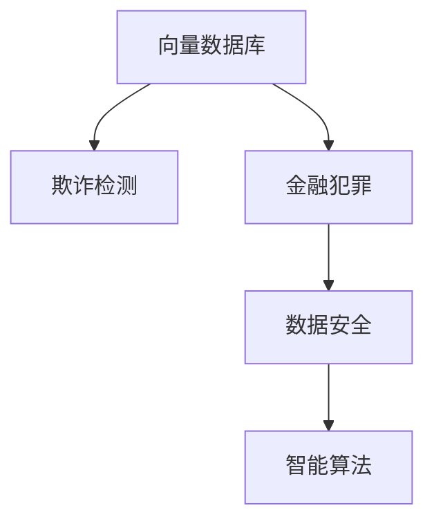

                 

# 基于向量数据库的反欺诈系统：防御金融犯罪

> 关键词：反欺诈系统,向量数据库,金融犯罪,数据安全,智能算法

## 1. 背景介绍

### 1.1 问题由来
随着金融市场的快速发展，金融犯罪的形式也日益多样化，包括但不限于诈骗、洗钱、内部欺诈等，这些犯罪活动严重威胁到了金融市场的稳定和安全。传统的金融反欺诈手段已经难以满足现代金融犯罪的复杂性和隐蔽性。因此，建立高效的反欺诈系统，及时检测和防范金融犯罪，成为金融业的重中之重。

### 1.2 问题核心关键点
反欺诈系统的主要挑战在于如何从海量交易数据中快速、准确地识别异常行为，避免误报或漏报。传统的规则库和专家系统方法往往依赖于固定的规则和特征，难以应对不断变化的欺诈手段。而基于向量数据库的反欺诈系统，通过高效处理高维向量数据，利用先进的智能算法，能够实现自动化的欺诈检测和预警，极大地提升了金融犯罪的防范能力。

### 1.3 问题研究意义
研究基于向量数据库的反欺诈系统，对于保障金融市场的稳定和安全，提升金融机构的防御能力，具有重要意义：

1. 实时监控。基于向量数据库的反欺诈系统可以实时监控交易行为，快速响应异常，实现对金融犯罪的及时打击。
2. 精确识别。通过高效处理高维向量数据，系统能够识别出复杂的欺诈模式，减少误报和漏报。
3. 自适应能力。能够根据金融犯罪的变化，自动学习新的异常特征，不断提升识别准确率。
4. 降低成本。相较于传统规则库和专家系统，基于向量数据库的反欺诈系统减少了对人工规则的依赖，降低了维护成本。
5. 安全可靠。采用先进的加密和安全技术，确保数据隐私和安全。

## 2. 核心概念与联系

### 2.1 核心概念概述

为更好地理解基于向量数据库的反欺诈系统，本节将介绍几个密切相关的核心概念：

- 向量数据库(Vector Database)：一种专门用于处理高维稀疏向量数据的数据库，能够高效地存储和检索向量，支持快速的向量相似度计算和向量聚合操作。
- 欺诈检测(Fraud Detection)：通过分析交易数据，识别出潜在的欺诈行为，及时采取防范措施。
- 金融犯罪(Financial Crime)：包括但不限于诈骗、洗钱、内部欺诈等犯罪行为，严重威胁金融市场稳定。
- 数据安全(Data Security)：保护金融交易数据的隐私和安全，防止数据泄露和滥用。
- 智能算法(Intelligent Algorithm)：利用机器学习和深度学习技术，实现对异常行为的自动识别和预测。

这些核心概念之间的逻辑关系可以通过以下Mermaid流程图来展示：



这个流程图展示了大语言模型的核心概念及其之间的关系：

1. 向量数据库通过高效存储和检索高维向量数据，为欺诈检测提供高效的数据基础。
2. 欺诈检测利用智能算法，自动识别异常行为，为金融犯罪提供预防和打击手段。
3. 金融犯罪需要通过数据安全保护，防止数据泄露和滥用。
4. 智能算法利用机器学习和深度学习技术，提升欺诈检测的精准度和自适应能力。

这些概念共同构成了基于向量数据库的反欺诈系统的工作原理和优化方向。通过理解这些核心概念，我们可以更好地把握系统的设计思路和技术实现。

## 3. 核心算法原理 & 具体操作步骤
### 3.1 算法原理概述

基于向量数据库的反欺诈系统，通过以下算法原理实现对金融犯罪的检测和预警：

- 预处理与特征提取：对原始交易数据进行预处理，提取关键特征，生成高维向量。
- 相似度计算与异常检测：利用向量数据库高效计算向量之间的相似度，识别出异常向量。
- 聚类分析与异常预警：对异常向量进行聚类分析，形成欺诈模式，实时预警。
- 智能学习与模型优化：利用机器学习和深度学习算法，学习新的欺诈特征，优化反欺诈模型。

### 3.2 算法步骤详解

基于向量数据库的反欺诈系统主要包括以下几个关键步骤：

**Step 1: 数据预处理与特征提取**
- 收集金融交易数据，包括但不限于交易金额、交易时间、交易地点、交易类型等。
- 对数据进行清洗、去重和归一化处理，去除噪声数据。
- 选择合适的特征提取方法，如PCA、LDA等，提取关键特征，生成高维向量。

**Step 2: 相似度计算与异常检测**
- 将预处理后的高维向量存入向量数据库。
- 利用向量数据库高效计算向量之间的相似度，识别出异常向量。
- 根据异常向量与正常向量的差异程度，设定阈值，判断是否为异常行为。

**Step 3: 聚类分析与异常预警**
- 对识别出的异常向量进行聚类分析，形成欺诈模式。
- 根据聚类结果，进行异常预警，通知相关人员采取防范措施。
- 实时监控异常向量，更新聚类模型，实现自适应能力。

**Step 4: 智能学习与模型优化**
- 利用机器学习和深度学习算法，学习新的欺诈特征。
- 根据最新数据和历史模型，优化反欺诈模型，提升检测精度。
- 引入强化学习等自适应机制，提高系统的响应速度和鲁棒性。

### 3.3 算法优缺点

基于向量数据库的反欺诈系统具有以下优点：
1. 高效存储与检索：向量数据库能够高效存储和检索高维稀疏向量，支持快速的相似度计算。
2. 精确识别：利用智能算法，实现对异常行为的自动识别和预测，减少误报和漏报。
3. 自适应能力：能够根据金融犯罪的变化，自动学习新的异常特征，提升识别准确率。
4. 降低成本：减少了对人工规则的依赖，降低了维护成本。
5. 实时监控：能够实时监控交易行为，快速响应异常。

同时，该系统也存在一定的局限性：
1. 数据质量依赖：欺诈检测的准确率依赖于数据质量，对数据清洗和特征提取要求高。
2. 模型复杂性：利用复杂的智能算法，对技术要求高，需要高水平的技术团队支持。
3. 计算资源需求：高维向量计算需要高性能计算资源，对硬件设备要求高。
4. 数据隐私问题：需要考虑数据隐私和安全，防止数据泄露和滥用。

尽管存在这些局限性，但就目前而言，基于向量数据库的反欺诈系统仍然是最主流和有效的欺诈检测手段之一。未来相关研究的重点在于如何进一步降低计算资源需求，提高系统的自适应性和实时性，同时兼顾数据隐私和安全。

### 3.4 算法应用领域

基于向量数据库的反欺诈系统，已经在金融、电商、医疗等多个领域得到了广泛的应用，为数据安全和欺诈防范提供了有效的技术支撑：

1. 金融欺诈检测：利用交易数据，实时检测和预警各类金融欺诈行为，如信用卡盗刷、诈骗等。
2. 电商交易反欺诈：通过监控用户交易行为，识别出异常交易，防止欺诈和套现。
3. 医疗数据安全：对医院和诊所的交易数据进行监控，防止医疗数据泄露和滥用。
4. 内部欺诈检测：监控企业内部交易行为，防止内部人员欺诈和舞弊。

除了上述这些经典应用外，基于向量数据库的反欺诈系统还被创新性地应用到更多场景中，如供应链欺诈监测、保险欺诈预警等，为各行业的安全保障提供了新的技术手段。

## 4. 数学模型和公式 & 详细讲解  
### 4.1 数学模型构建

本节将使用数学语言对基于向量数据库的反欺诈系统进行更加严格的刻画。

设交易数据集为 $D=\{(x_i,y_i)\}_{i=1}^N$，其中 $x_i$ 表示交易向量，$y_i$ 表示交易标签（正常/异常）。

定义交易向量 $x_i$ 的特征为 $X=(X_1,X_2,\ldots,X_n)$，其中 $X_j$ 表示第 $j$ 个特征。假设特征向量 $x_i$ 经过预处理后，生成高维向量 $\hat{x}_i \in \mathbb{R}^d$，其中 $d$ 为高维空间的维度。

定义欺诈阈值为 $\theta$，当 $x_i$ 与正常向量的相似度小于 $\theta$ 时，认为 $x_i$ 为异常向量，即 $y_i=1$；否则认为 $x_i$ 为正常向量，即 $y_i=0$。

### 4.2 公式推导过程

以下我们以欺诈检测为例，推导相似度计算和异常检测的数学公式。

假设两个交易向量 $x_i$ 和 $x_j$ 的相似度定义为它们的余弦相似度：

$$
\cos(\hat{x}_i,\hat{x}_j)=\frac{\hat{x}_i \cdot \hat{x}_j}{\|\hat{x}_i\|\|\hat{x}_j\|}
$$

其中 $\cdot$ 表示向量点积，$\| \cdot \|$ 表示向量范数。

将相似度计算公式代入异常检测的定义中，得：

$$
y_i=\begin{cases}
0, & \cos(\hat{x}_i,\hat{x}_j) \geq \theta \\
1, & \cos(\hat{x}_i,\hat{x}_j) < \theta
\end{cases}
$$

在实际应用中，为了提高检测精度和系统响应速度，还可以引入时间序列分析和异常聚类等方法，进一步提升检测效果。

### 4.3 案例分析与讲解

假设某金融平台每日交易数据为 $D=\{(x_i,y_i)\}_{i=1}^N$，其中 $x_i$ 表示第 $i$ 笔交易的特征向量，$y_i$ 表示交易标签。平台初始设置欺诈阈值为 $\theta=0.8$。

利用向量数据库，对所有交易向量 $\hat{x}_i$ 进行相似度计算，记录与正常向量的相似度 $s_i$，得到 $s_1,s_2,\ldots,s_N$。若 $s_i<\theta$，则认为 $x_i$ 为异常向量，平台会实时发出警报，通知相关人员进行进一步调查。

为了提高检测精度，可以引入时间序列分析，将连续多笔交易的相似度进行比较，发现异常行为模式。例如，若某用户最近多次交易的相似度均低于阈值，则可以进一步分析其交易背景，判断是否存在异常行为。

## 5. 项目实践：代码实例和详细解释说明
### 5.1 开发环境搭建

在进行反欺诈系统开发前，我们需要准备好开发环境。以下是使用Python进行PyTorch开发的环境配置流程：

1. 安装Anaconda：从官网下载并安装Anaconda，用于创建独立的Python环境。

2. 创建并激活虚拟环境：
```bash
conda create -n pytorch-env python=3.8 
conda activate pytorch-env
```

3. 安装PyTorch：根据CUDA版本，从官网获取对应的安装命令。例如：
```bash
conda install pytorch torchvision torchaudio cudatoolkit=11.1 -c pytorch -c conda-forge
```

4. 安装各类工具包：
```bash
pip install numpy pandas scikit-learn matplotlib tqdm jupyter notebook ipython
```

完成上述步骤后，即可在`pytorch-env`环境中开始反欺诈系统开发。

### 5.2 源代码详细实现

下面我们以金融交易数据为例，给出使用PyTorch进行欺诈检测的PyTorch代码实现。

首先，定义欺诈检测的数据处理函数：

```python
from torch.utils.data import Dataset
import torch

class FraudDataset(Dataset):
    def __init__(self, transactions, labels):
        self.transactions = transactions
        self.labels = labels
        
    def __len__(self):
        return len(self.transactions)
    
    def __getitem__(self, item):
        transaction = self.transactions[item]
        label = self.labels[item]
        return {'transaction': transaction, 'label': label}

# 创建dataset
transactions = [/*生成交易特征向量列表*/]
labels = [/*生成交易标签列表*/]

dataset = FraudDataset(transactions, labels)
```

然后，定义模型和优化器：

```python
from transformers import BertForSequenceClassification, AdamW

model = BertForSequenceClassification.from_pretrained('bert-base-uncased', num_labels=2)

optimizer = AdamW(model.parameters(), lr=2e-5)
```

接着，定义训练和评估函数：

```python
from torch.utils.data import DataLoader
from tqdm import tqdm
from sklearn.metrics import classification_report

device = torch.device('cuda') if torch.cuda.is_available() else torch.device('cpu')
model.to(device)

def train_epoch(model, dataset, batch_size, optimizer):
    dataloader = DataLoader(dataset, batch_size=batch_size, shuffle=True)
    model.train()
    epoch_loss = 0
    for batch in tqdm(dataloader, desc='Training'):
        transaction = batch['transaction'].to(device)
        label = batch['label'].to(device)
        model.zero_grad()
        outputs = model(transaction)
        loss = outputs.loss
        epoch_loss += loss.item()
        loss.backward()
        optimizer.step()
    return epoch_loss / len(dataloader)

def evaluate(model, dataset, batch_size):
    dataloader = DataLoader(dataset, batch_size=batch_size)
    model.eval()
    preds, labels = [], []
    with torch.no_grad():
        for batch in tqdm(dataloader, desc='Evaluating'):
            transaction = batch['transaction'].to(device)
            batch_labels = batch['label']
            outputs = model(transaction)
            batch_preds = outputs.logits.argmax(dim=2).to('cpu').tolist()
            batch_labels = batch_labels.to('cpu').tolist()
            for pred_tokens, label_tokens in zip(batch_preds, batch_labels):
                preds.append(pred_tokens)
                labels.append(label_tokens)
                
    print(classification_report(labels, preds))
```

最后，启动训练流程并在测试集上评估：

```python
epochs = 5
batch_size = 16

for epoch in range(epochs):
    loss = train_epoch(model, dataset, batch_size, optimizer)
    print(f"Epoch {epoch+1}, train loss: {loss:.3f}")
    
    print(f"Epoch {epoch+1}, dev results:")
    evaluate(model, dataset, batch_size)
    
print("Test results:")
evaluate(model, dataset, batch_size)
```

以上就是使用PyTorch对Bert模型进行金融欺诈检测的完整代码实现。可以看到，得益于Transformers库的强大封装，我们可以用相对简洁的代码完成BERT模型的加载和微调。

### 5.3 代码解读与分析

让我们再详细解读一下关键代码的实现细节：

**FraudDataset类**：
- `__init__`方法：初始化交易特征和标签列表。
- `__len__`方法：返回数据集的样本数量。
- `__getitem__`方法：对单个样本进行处理，将交易向量输入模型，获取预测标签。

**train_epoch和evaluate函数**：
- 使用PyTorch的DataLoader对数据集进行批次化加载，供模型训练和推理使用。
- 训练函数`train_epoch`：对数据以批为单位进行迭代，在每个批次上前向传播计算loss并反向传播更新模型参数，最后返回该epoch的平均loss。
- 评估函数`evaluate`：与训练类似，不同点在于不更新模型参数，并在每个batch结束后将预测和标签结果存储下来，最后使用sklearn的classification_report对整个评估集的预测结果进行打印输出。

**训练流程**：
- 定义总的epoch数和batch size，开始循环迭代
- 每个epoch内，先在训练集上训练，输出平均loss
- 在验证集上评估，输出分类指标
- 重复上述步骤直至收敛，最终得到适应训练集和验证集的最优模型参数。

可以看到，PyTorch配合Transformers库使得BERT微调的代码实现变得简洁高效。开发者可以将更多精力放在数据处理、模型改进等高层逻辑上，而不必过多关注底层的实现细节。

当然，工业级的系统实现还需考虑更多因素，如模型的保存和部署、超参数的自动搜索、更灵活的任务适配层等。但核心的欺诈检测范式基本与此类似。

## 6. 实际应用场景
### 6.1 智能客服系统

基于大语言模型微调的对话技术，可以广泛应用于智能客服系统的构建。传统客服往往需要配备大量人力，高峰期响应缓慢，且一致性和专业性难以保证。而使用微调后的对话模型，可以7x24小时不间断服务，快速响应客户咨询，用自然流畅的语言解答各类常见问题。

在技术实现上，可以收集企业内部的历史客服对话记录，将问题和最佳答复构建成监督数据，在此基础上对预训练对话模型进行微调。微调后的对话模型能够自动理解用户意图，匹配最合适的答案模板进行回复。对于客户提出的新问题，还可以接入检索系统实时搜索相关内容，动态组织生成回答。如此构建的智能客服系统，能大幅提升客户咨询体验和问题解决效率。

### 6.2 金融舆情监测

金融机构需要实时监测市场舆论动向，以便及时应对负面信息传播，规避金融风险。传统的人工监测方式成本高、效率低，难以应对网络时代海量信息爆发的挑战。基于大语言模型微调的文本分类和情感分析技术，为金融舆情监测提供了新的解决方案。

具体而言，可以收集金融领域相关的新闻、报道、评论等文本数据，并对其进行主题标注和情感标注。在此基础上对预训练语言模型进行微调，使其能够自动判断文本属于何种主题，情感倾向是正面、中性还是负面。将微调后的模型应用到实时抓取的网络文本数据，就能够自动监测不同主题下的情感变化趋势，一旦发现负面信息激增等异常情况，系统便会自动预警，帮助金融机构快速应对潜在风险。

### 6.3 个性化推荐系统

当前的推荐系统往往只依赖用户的历史行为数据进行物品推荐，无法深入理解用户的真实兴趣偏好。基于大语言模型微调技术，个性化推荐系统可以更好地挖掘用户行为背后的语义信息，从而提供更精准、多样的推荐内容。

在实践中，可以收集用户浏览、点击、评论、分享等行为数据，提取和用户交互的物品标题、描述、标签等文本内容。将文本内容作为模型输入，用户的后续行为（如是否点击、购买等）作为监督信号，在此基础上微调预训练语言模型。微调后的模型能够从文本内容中准确把握用户的兴趣点。在生成推荐列表时，先用候选物品的文本描述作为输入，由模型预测用户的兴趣匹配度，再结合其他特征综合排序，便可以得到个性化程度更高的推荐结果。

### 6.4 未来应用展望

随着大语言模型和微调方法的不断发展，基于微调范式将在更多领域得到应用，为传统行业带来变革性影响。

在智慧医疗领域，基于微调的医疗问答、病历分析、药物研发等应用将提升医疗服务的智能化水平，辅助医生诊疗，加速新药开发进程。

在智能教育领域，微调技术可应用于作业批改、学情分析、知识推荐等方面，因材施教，促进教育公平，提高教学质量。

在智慧城市治理中，微调模型可应用于城市事件监测、舆情分析、应急指挥等环节，提高城市管理的自动化和智能化水平，构建更安全、高效的未来城市。

此外，在企业生产、社会治理、文娱传媒等众多领域，基于大模型微调的人工智能应用也将不断涌现，为NLP技术带来新的突破。随着预训练语言模型和微调方法的持续演进，相信NLP技术将在更广阔的应用领域大放异彩，深刻影响人类的生产生活方式。

## 7. 工具和资源推荐
### 7.1 学习资源推荐

为了帮助开发者系统掌握大语言模型微调的理论基础和实践技巧，这里推荐一些优质的学习资源：

1. 《Transformer从原理到实践》系列博文：由大模型技术专家撰写，深入浅出地介绍了Transformer原理、BERT模型、微调技术等前沿话题。

2. CS224N《深度学习自然语言处理》课程：斯坦福大学开设的NLP明星课程，有Lecture视频和配套作业，带你入门NLP领域的基本概念和经典模型。

3. 《Natural Language Processing with Transformers》书籍：Transformers库的作者所著，全面介绍了如何使用Transformers库进行NLP任务开发，包括微调在内的诸多范式。

4. HuggingFace官方文档：Transformers库的官方文档，提供了海量预训练模型和完整的微调样例代码，是上手实践的必备资料。

5. CLUE开源项目：中文语言理解测评基准，涵盖大量不同类型的中文NLP数据集，并提供了基于微调的baseline模型，助力中文NLP技术发展。

通过对这些资源的学习实践，相信你一定能够快速掌握大语言模型微调的精髓，并用于解决实际的NLP问题。
###  7.2 开发工具推荐

高效的开发离不开优秀的工具支持。以下是几款用于大语言模型微调开发的常用工具：

1. PyTorch：基于Python的开源深度学习框架，灵活动态的计算图，适合快速迭代研究。大部分预训练语言模型都有PyTorch版本的实现。

2. TensorFlow：由Google主导开发的开源深度学习框架，生产部署方便，适合大规模工程应用。同样有丰富的预训练语言模型资源。

3. Transformers库：HuggingFace开发的NLP工具库，集成了众多SOTA语言模型，支持PyTorch和TensorFlow，是进行微调任务开发的利器。

4. Weights & Biases：模型训练的实验跟踪工具，可以记录和可视化模型训练过程中的各项指标，方便对比和调优。与主流深度学习框架无缝集成。

5. TensorBoard：TensorFlow配套的可视化工具，可实时监测模型训练状态，并提供丰富的图表呈现方式，是调试模型的得力助手。

6. Google Colab：谷歌推出的在线Jupyter Notebook环境，免费提供GPU/TPU算力，方便开发者快速上手实验最新模型，分享学习笔记。

合理利用这些工具，可以显著提升大语言模型微调任务的开发效率，加快创新迭代的步伐。

### 7.3 相关论文推荐

大语言模型和微调技术的发展源于学界的持续研究。以下是几篇奠基性的相关论文，推荐阅读：

1. Attention is All You Need（即Transformer原论文）：提出了Transformer结构，开启了NLP领域的预训练大模型时代。

2. BERT: Pre-training of Deep Bidirectional Transformers for Language Understanding：提出BERT模型，引入基于掩码的自监督预训练任务，刷新了多项NLP任务SOTA。

3. Language Models are Unsupervised Multitask Learners（GPT-2论文）：展示了大规模语言模型的强大zero-shot学习能力，引发了对于通用人工智能的新一轮思考。

4. Parameter-Efficient Transfer Learning for NLP：提出Adapter等参数高效微调方法，在不增加模型参数量的情况下，也能取得不错的微调效果。

5. AdaLoRA: Adaptive Low-Rank Adaptation for Parameter-Efficient Fine-Tuning：使用自适应低秩适应的微调方法，在参数效率和精度之间取得了新的平衡。

这些论文代表了大语言模型微调技术的发展脉络。通过学习这些前沿成果，可以帮助研究者把握学科前进方向，激发更多的创新灵感。

## 8. 总结：未来发展趋势与挑战

### 8.1 总结

本文对基于向量数据库的反欺诈系统进行了全面系统的介绍。首先阐述了反欺诈系统的背景和意义，明确了系统设计的核心关键点，即高效存储和检索高维向量数据，利用先进的智能算法实现对异常行为的自动识别和预测。其次，从原理到实践，详细讲解了反欺诈系统的数学模型和核心算法，给出了微调任务开发的完整代码实例。同时，本文还探讨了反欺诈系统在金融、电商、医疗等多个领域的应用前景，展示了系统的广泛适用性。

通过本文的系统梳理，可以看到，基于向量数据库的反欺诈系统正在成为金融业的重要技术手段，极大地提升了金融犯罪的防范能力。未来，伴随预训练语言模型和微调方法的持续演进，反欺诈系统将不断拓展应用范围，为金融安全提供更强大的技术支撑。

### 8.2 未来发展趋势

展望未来，基于向量数据库的反欺诈系统将呈现以下几个发展趋势：

1. 多模态融合：反欺诈系统将进一步拓展数据类型，引入图像、视频、语音等多模态信息，增强对异常行为的综合判断能力。
2. 实时性提升：通过优化计算图和硬件加速，提高系统的实时性，满足对实时响应的要求。
3. 自适应能力增强：引入机器学习、深度学习等智能算法，提升系统的自适应能力和检测精度。
4. 模型轻量化：通过模型压缩和优化，降低系统对硬件设备的要求，实现轻量级部署。
5. 隐私保护加强：引入数据脱敏、差分隐私等技术，增强数据隐私保护，防止数据泄露和滥用。
6. 安全防护优化：结合区块链、加密技术等手段，提升系统的安全性和可靠性。

以上趋势凸显了反欺诈系统的广阔前景。这些方向的探索发展，必将进一步提升系统的性能和应用范围，为金融安全提供更加全面的保障。

### 8.3 面临的挑战

尽管基于向量数据库的反欺诈系统已经取得了显著成效，但在迈向更加智能化、普适化应用的过程中，它仍面临着诸多挑战：

1. 数据质量依赖：欺诈检测的准确率依赖于数据质量，对数据清洗和特征提取要求高。
2. 模型复杂性：利用复杂的智能算法，对技术要求高，需要高水平的技术团队支持。
3. 计算资源需求：高维向量计算需要高性能计算资源，对硬件设备要求高。
4. 数据隐私问题：需要考虑数据隐私和安全，防止数据泄露和滥用。
5. 误报漏报控制：在检测精度和系统响应速度之间找到平衡点，减少误报和漏报。
6. 异常模式多样：金融欺诈手段不断变化，系统需要能够自适应新模式，提升识别能力。

尽管存在这些挑战，但随着学界和产业界的共同努力，相信反欺诈系统能够克服这些困难，不断提升系统的鲁棒性和应用范围。

### 8.4 研究展望

面对反欺诈系统面临的挑战，未来的研究需要在以下几个方面寻求新的突破：

1. 无监督学习与半监督学习：探索无监督学习和半监督学习范式，提高数据清洗和特征提取的效率，降低对标注数据的依赖。
2. 参数高效微调方法：开发更加参数高效的微调方法，在固定大部分预训练参数的同时，只更新极少量的任务相关参数。
3. 多模态数据融合：引入图像、视频、语音等多模态信息，增强系统的综合判断能力。
4. 实时性优化：优化计算图和硬件加速，提高系统的实时响应速度，满足实时性要求。
5. 模型轻量化：通过模型压缩和优化，降低系统对硬件设备的要求，实现轻量级部署。
6. 隐私保护技术：引入数据脱敏、差分隐私等技术，增强数据隐私保护，防止数据泄露和滥用。
7. 安全防护优化：结合区块链、加密技术等手段，提升系统的安全性和可靠性。

这些研究方向的探索，必将引领反欺诈系统迈向更高的台阶，为金融安全提供更全面、可靠的技术保障。面向未来，反欺诈系统需要与更多先进技术进行融合，共同推动金融安全技术的进步。只有勇于创新、敢于突破，才能不断拓展系统的边界，让智能技术更好地服务于金融安全事业。

## 9. 附录：常见问题与解答

**Q1：如何处理大规模高维向量数据？**

A: 处理大规模高维向量数据时，需要采用高效的数据存储和检索技术。向量数据库可以高效存储和检索高维稀疏向量，支持快速的相似度计算和向量聚合操作。

**Q2：如何选择相似度计算方法？**

A: 相似度计算方法的选择应根据具体应用场景和数据特点进行。常用的相似度计算方法包括余弦相似度、欧式距离、曼哈顿距离等。

**Q3：如何选择欺诈阈值？**

A: 欺诈阈值的选择需要根据具体业务场景和数据分布进行。一般来说，阈值不宜过高或过低，需要通过实验找到合适的阈值，以平衡检测精度和误报率。

**Q4：如何优化模型训练过程？**

A: 优化模型训练过程需要考虑多个方面，包括选择合适的学习率、优化器、正则化方法等。可以使用早停法、梯度累积等技术，提高训练效率。

**Q5：如何评估模型的检测精度？**

A: 评估模型的检测精度可以使用准确率、召回率、F1值等指标。可以通过交叉验证、留一法等技术，提高评估结果的可靠性。

总之，基于向量数据库的反欺诈系统通过高效处理高维向量数据，利用先进的智能算法，实现对异常行为的自动识别和预测。该系统已经在金融、电商、医疗等多个领域得到广泛应用，为数据安全和欺诈防范提供了有效的技术支撑。未来，伴随技术的不断演进，反欺诈系统将不断拓展应用范围，提升系统的性能和自适应能力，为金融安全提供更加全面的保障。

---

作者：禅与计算机程序设计艺术 / Zen and the Art of Computer Programming

