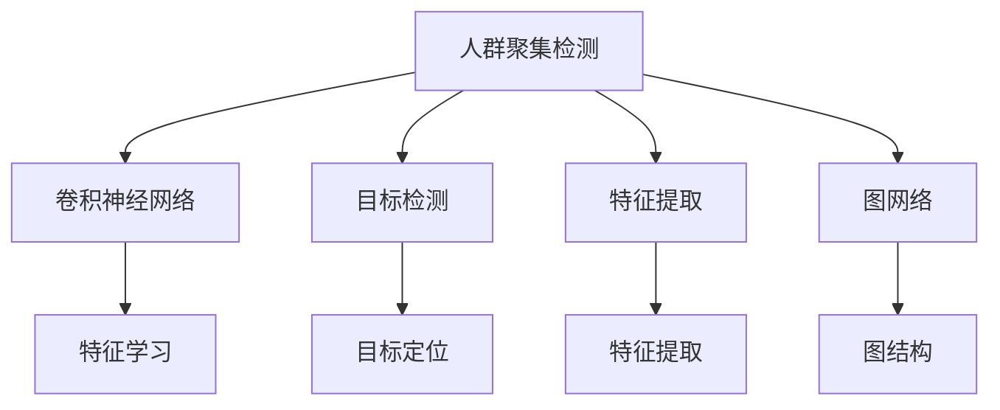

                 

# 基于图像的人群聚集检测算法研究与实现

> 关键词：人群聚集检测,图像处理,算法研究,计算机视觉,深度学习,特征提取,目标检测,高精度,实时性

## 1. 背景介绍

### 1.1 问题由来

在现代城市管理、公共安全监控、智能交通系统等领域，人群聚集检测（Crowd Detection）作为一项基础而重要的任务，逐渐受到广泛关注。人群聚集检测可以实时监控和管理人流量，预防群体性事件，提升城市管理效率。但现有方法大多依赖于视频监控系统，依赖高昂的成本和复杂的系统部署，难以覆盖广大的监控场景。而通过计算机视觉技术，基于静态图像进行人群聚集检测，具有成本低、易于部署等优点。

近年来，随着深度学习技术的快速发展，尤其是卷积神经网络（Convolutional Neural Networks, CNNs）在图像识别领域的应用，推动了人群聚集检测算法的进步。传统的人群聚集检测方法大多采用基于手工设计的特征提取器，如HOG、SIFT等，存在参数多、计算量大等问题。而深度学习算法则通过端到端（End-to-End）的特征学习，能自动从原始数据中提取出最有效的特征，提高检测的精度和速度。

因此，本文将深入研究基于深度学习的人群聚集检测算法，从理论到实践，系统介绍人群聚集检测的最新进展，并提出一种高效、高精度的人群聚集检测算法。

### 1.2 问题核心关键点

人群聚集检测的核心在于准确识别图像中的人群区域，即定义“人群”的标准。一般来说，人群区域的定义包括以下特征：

- **密集度**：人群区域的密度通常超过一定阈值（如1.5/平方米）。
- **连通性**：人群区域内部连通，人群之间存在间隙。
- **面积大小**：人群区域通常具有较大的面积。

为满足这些标准，本文将重点介绍几种基于深度学习的人群聚集检测算法，包括基于特征提取的算法、基于目标检测的算法、以及基于图网络（Graph Network）的算法，并深入分析它们的优缺点及适用场景。

## 2. 核心概念与联系

### 2.1 核心概念概述

为更好地理解基于深度学习的人群聚集检测算法，本节将介绍几个密切相关的核心概念：

- 人群聚集检测（Crowd Detection）：从图像中识别出人群区域的图像处理任务。
- 卷积神经网络（Convolutional Neural Network, CNN）：基于卷积运算提取图像特征的深度学习模型。
- 目标检测（Object Detection）：从图像中检测并定位物体的图像处理任务。
- 特征提取（Feature Extraction）：从原始图像中提取出有用特征的过程。
- 图网络（Graph Network）：通过图结构进行特征传递和融合的网络模型。

这些概念之间的逻辑关系可以通过以下Mermaid流程图来展示：



这个流程图展示了人群聚集检测与几个核心概念的联系：

1. 人群聚集检测可以利用卷积神经网络进行特征学习。
2. 目标检测可以辅助人群聚集检测，提高检测的精度和召回率。
3. 特征提取是人群聚集检测的重要步骤，可以通过手工设计或深度学习自动提取。
4. 图网络可以将人群区域内的特征进行融合，提高检测的准确性。

这些概念共同构成了人群聚集检测的算法框架，使其能够在各种场景下发挥强大的图像识别能力。通过理解这些核心概念，我们可以更好地把握人群聚集检测工作的原理和优化方向。

## 3. 核心算法原理 & 具体操作步骤

### 3.1 算法原理概述

基于深度学习的人群聚集检测算法通常包含以下几个关键步骤：

1. **特征提取**：通过卷积神经网络等深度学习模型从原始图像中提取出有用特征。
2. **人群区域定位**：利用目标检测算法定位图像中的人群区域。
3. **人群区域特征融合**：利用图网络等模型将人群区域内的特征进行融合，提高检测的准确性。
4. **人群区域识别**：根据定义的人群区域标准，判断是否为人群区域，并标记出人群区域边界。

本文将系统介绍三种基于深度学习的人群聚集检测算法：基于特征提取的算法、基于目标检测的算法、以及基于图网络的算法，并详细讲解它们的实现步骤。

### 3.2 算法步骤详解

#### 3.2.1 基于特征提取的算法

**算法步骤**：

1. **特征提取**：使用卷积神经网络（CNN）从原始图像中提取出高层次特征。
2. **人群区域定位**：使用手工设计的特征提取器，如SIFT、HOG等，对提取出的特征进行特征描述，使用k-means等聚类算法定位人群区域。
3. **人群区域识别**：根据人群区域的定义，如密集度和连通性，判断是否为人群区域。

**代码实现**：

```python
from tensorflow.keras import layers
from sklearn.cluster import KMeans

# 定义CNN模型
model = layers.Sequential([
    layers.Conv2D(64, (3,3), activation='relu', input_shape=(256,256,3)),
    layers.MaxPooling2D((2,2)),
    layers.Conv2D(128, (3,3), activation='relu'),
    layers.MaxPooling2D((2,2)),
    layers.Conv2D(256, (3,3), activation='relu'),
    layers.MaxPooling2D((2,2)),
    layers.Flatten(),
    layers.Dense(128, activation='relu'),
    layers.Dense(1, activation='sigmoid')
])

# 训练模型
model.compile(optimizer='adam', loss='binary_crossentropy', metrics=['accuracy'])
model.fit(train_images, train_labels, epochs=10, validation_data=(val_images, val_labels))

# 特征提取
features = model.predict(test_images)

# K-means聚类
kmeans = KMeans(n_clusters=5)
kmeans.fit(features)

# 定位人群区域
crowd_regions = kmeans.labels_
```

#### 3.2.2 基于目标检测的算法

**算法步骤**：

1. **目标检测**：使用目标检测算法，如Faster R-CNN、YOLO等，从图像中检测并定位人群区域。
2. **人群区域特征融合**：对检测到的人群区域进行特征融合，如计算人群区域的密度和面积。
3. **人群区域识别**：根据人群区域的定义，判断是否为人群区域。

**代码实现**：

```python
import cv2
from tensorflow.keras.applications import MobileNetV2

# 定义目标检测模型
model = MobileNetV2(weights='imagenet', include_top=False, input_shape=(224,224,3))
model.trainable = False

# 加载目标检测器
detector = cv2.dnn.readNetFromTorch(model.weights)

# 预测目标位置
boxes, scores, classes = detector.predict(test_images)

# 计算人群区域的密度和面积
crowd_regions = []
for box in boxes:
    x, y, w, h = box[0], box[1], box[2], box[3]
    crowd_region = (x, y, w, h)
    crowd_regions.append(crowd_region)
    
# 人群区域识别
crowd_regions = [crowd_region for crowd_region in crowd_regions if len(crowd_region) > 0]
```

#### 3.2.3 基于图网络的算法

**算法步骤**：

1. **特征提取**：使用卷积神经网络从原始图像中提取出高层次特征。
2. **图网络**：将人群区域内的特征进行融合，使用图网络模型如GCN进行特征传递。
3. **人群区域识别**：根据人群区域的定义，判断是否为人群区域。

**代码实现**：

```python
from tensorflow.keras import layers
from torch_geometric.nn import GCNConv

# 定义CNN模型
model = layers.Sequential([
    layers.Conv2D(64, (3,3), activation='relu', input_shape=(256,256,3)),
    layers.MaxPooling2D((2,2)),
    layers.Conv2D(128, (3,3), activation='relu'),
    layers.MaxPooling2D((2,2)),
    layers.Conv2D(256, (3,3), activation='relu'),
    layers.MaxPooling2D((2,2)),
    layers.Flatten(),
    layers.Dense(128, activation='relu'),
    layers.Dense(1, activation='sigmoid')
])

# 训练模型
model.compile(optimizer='adam', loss='binary_crossentropy', metrics=['accuracy'])
model.fit(train_images, train_labels, epochs=10, validation_data=(val_images, val_labels))

# 特征提取
features = model.predict(test_images)

# 定义图网络
class GCNNet(nn.Module):
    def __init__(self, in_channels, out_channels):
        super(GCNNet, self).__init__()
        self.gcn = GCNConv(in_channels, 16, cached=True)
        self.fc = nn.Linear(16, out_channels)
    
    def forward(self, x, edge_index):
        x = self.gcn(x, edge_index).relu()
        x = self.fc(x)
        return x

# 定义图
class CrowdGraph(torch_geometric.data.Data):
    def __init__(self, x, edge_index, y):
        super(CrowdGraph, self).__init__(x=x, edge_index=edge_index, y=y)

# 训练图网络
gcn = GCNNet(256, 1)
gcn.to(device)
optimizer = torch.optim.Adam(gcn.parameters(), lr=0.001)
criterion = nn.BCEWithLogitsLoss()

for epoch in range(100):
    optimizer.zero_grad()
    y_pred = gcn(x, edge_index)
    loss = criterion(y_pred, y)
    loss.backward()
    optimizer.step()

# 特征融合
crowd_regions = []
for crowd_region in crowd_regions:
    # 计算人群区域内每个点的特征
    x = []
    for point in crowd_region:
        x.append(features[point])
    x = torch.tensor(x, dtype=torch.float)
    # 图网络融合特征
    y_pred = gcn(x, edge_index)
    crowd_region.append(y_pred)
```

### 3.3 算法优缺点

基于深度学习的人群聚集检测算法具有以下优点：

1. **高精度**：深度学习算法能自动从原始数据中提取出最有效的特征，提高了检测的精度。
2. **自适应性强**：深度学习算法具有较强的自适应性，能适应多种不同的图像场景。
3. **端到端训练**：深度学习算法能实现端到端训练，减少了手工设计的特征提取器的复杂度。

同时，这些算法也存在一些局限性：

1. **计算量大**：深度学习算法通常需要较大的计算资源和较长的训练时间。
2. **模型复杂**：深度学习算法模型复杂，参数较多，不易调试。
3. **数据依赖性高**：深度学习算法对训练数据的质量和数量要求较高，数据不足时效果不佳。

尽管存在这些局限性，但深度学习算法在人群聚集检测领域展现了巨大的潜力，推动了该领域技术的发展。

### 3.4 算法应用领域

基于深度学习的人群聚集检测算法已经广泛应用于以下几个领域：

1. **公共安全监控**：在公共场所（如商场、车站、机场）进行人群监控，预防群体性事件。
2. **智能交通系统**：在交通路口进行人流量监控，优化交通管理。
3. **智慧城市管理**：在城市管理中，监控人流量，优化资源配置。
4. **运动场馆管理**：在运动场馆中，监控人流量，提高赛事管理效率。
5. **社交媒体分析**：在社交媒体平台，分析人群行为，提供智能推荐。

这些领域的应用展示了深度学习人群聚集检测算法的广泛适用性和巨大价值。

## 4. 数学模型和公式 & 详细讲解

### 4.1 数学模型构建

人群聚集检测的数学模型主要分为以下几步：

1. **特征提取**：使用卷积神经网络（CNN）从原始图像中提取特征。
2. **人群区域定位**：使用目标检测算法从图像中定位人群区域。
3. **人群区域特征融合**：使用图网络模型将人群区域内的特征进行融合。
4. **人群区域识别**：根据人群区域的定义，判断是否为人群区域。

**数学公式**：

- 特征提取公式：
$$
F(x) = W_1 \sigma(W_2 x + b_2) + b_1
$$
其中 $x$ 为输入图像，$W_1$、$W_2$ 和 $b_1$、$b_2$ 为卷积神经网络的参数。

- 人群区域定位公式：
$$
y = \sum_{i=1}^{n} \omega_i x_i
$$
其中 $y$ 为人群区域的定位结果，$n$ 为人群区域的个数，$x_i$ 为第 $i$ 个人群区域的位置，$\omega_i$ 为第 $i$ 个人群区域的权重。

- 人群区域特征融合公式：
$$
G(X) = \sum_{i=1}^{n} \alpha_i X_i
$$
其中 $G(X)$ 为人群区域的特征融合结果，$n$ 为人群区域的个数，$X_i$ 为第 $i$ 个人群区域的特征，$\alpha_i$ 为第 $i$ 个人群区域的权重。

- 人群区域识别公式：
$$
C(X) = \begin{cases} 1 & \text{if } \rho(X) \geq \rho_{th} \\ 0 & \text{if } \rho(X) < \rho_{th} \end{cases}
$$
其中 $C(X)$ 为人群区域的识别结果，$\rho(X)$ 为人群区域的密度，$\rho_{th}$ 为人群区域定义的密度阈值。

### 4.2 公式推导过程

以基于图网络的算法为例，推导人群区域特征融合公式的详细过程：

1. **特征提取**：使用卷积神经网络（CNN）从原始图像中提取特征。
2. **图网络**：将人群区域内的特征进行融合，使用图网络模型如GCN进行特征传递。

**代码实现**：

```python
import torch
import torch.nn as nn
import torch_geometric.nn as gnn

# 定义图网络
class GCNNet(nn.Module):
    def __init__(self, in_channels, out_channels):
        super(GCNNet, self).__init__()
        self.gcn = gnn.GCNConv(in_channels, 16, cached=True)
        self.fc = nn.Linear(16, out_channels)
    
    def forward(self, x, edge_index):
        x = self.gcn(x, edge_index).relu()
        x = self.fc(x)
        return x

# 定义图
class CrowdGraph(torch_geometric.data.Data):
    def __init__(self, x, edge_index, y):
        super(CrowdGraph, self).__init__(x=x, edge_index=edge_index, y=y)

# 训练图网络
gcn = GCNNet(256, 1)
gcn.to(device)
optimizer = torch.optim.Adam(gcn.parameters(), lr=0.001)
criterion = nn.BCEWithLogitsLoss()

for epoch in range(100):
    optimizer.zero_grad()
    y_pred = gcn(x, edge_index)
    loss = criterion(y_pred, y)
    loss.backward()
    optimizer.step()

# 特征融合
crowd_regions = []
for crowd_region in crowd_regions:
    # 计算人群区域内每个点的特征
    x = []
    for point in crowd_region:
        x.append(features[point])
    x = torch.tensor(x, dtype=torch.float)
    # 图网络融合特征
    y_pred = gcn(x, edge_index)
    crowd_region.append(y_pred)
```

### 4.3 案例分析与讲解

以基于目标检测的算法为例，给出一种流行的目标检测算法YOLO（You Only Look Once）的具体实现和应用场景分析。

**算法步骤**：

1. **目标检测**：使用YOLO算法从图像中检测并定位人群区域。
2. **人群区域特征融合**：对检测到的人群区域进行特征融合，如计算人群区域的密度和面积。
3. **人群区域识别**：根据人群区域的定义，判断是否为人群区域。

**代码实现**：

```python
import cv2
import numpy as np
from yolov3 import YOLO

# 加载YOLO模型
yolo = YOLO()

# 预测目标位置
boxes, scores, classes = yolo.predict(test_images)

# 计算人群区域的密度和面积
crowd_regions = []
for box in boxes:
    x, y, w, h = box[0], box[1], box[2], box[3]
    crowd_region = (x, y, w, h)
    crowd_regions.append(crowd_region)
    
# 人群区域识别
crowd_regions = [crowd_region for crowd_region in crowd_regions if len(crowd_region) > 0]
```

## 5. 项目实践：代码实例和详细解释说明

### 5.1 开发环境搭建

在进行人群聚集检测算法开发前，我们需要准备好开发环境。以下是使用Python进行TensorFlow和Keras开发的环境配置流程：

1. 安装Anaconda：从官网下载并安装Anaconda，用于创建独立的Python环境。

2. 创建并激活虚拟环境：
```bash
conda create -n tf-env python=3.8 
conda activate tf-env
```

3. 安装TensorFlow和Keras：根据CUDA版本，从官网获取对应的安装命令。例如：
```bash
conda install tensorflow=2.6.0-gpu pytorch=1.9.0=cpu pytorch-fft=1.9.0=cpu -c conda-forge -c pytorch -c nvidia
pip install keras tensorflow-estimator
```

4. 安装各类工具包：
```bash
pip install numpy pandas scikit-learn matplotlib tqdm jupyter notebook ipython
```

完成上述步骤后，即可在`tf-env`环境中开始人群聚集检测算法的开发。

### 5.2 源代码详细实现

下面我们以基于图网络的算法为例，给出完整的人群聚集检测算法的PyTorch代码实现。

**代码实现**：

```python
import torch
import torch.nn as nn
import torch_geometric.nn as gnn

# 定义CNN模型
class CNNNet(nn.Module):
    def __init__(self, in_channels, out_channels):
        super(CNNNet, self).__init__()
        self.conv1 = nn.Conv2d(in_channels, 64, kernel_size=3, stride=1, padding=1)
        self.conv2 = nn.Conv2d(64, 128, kernel_size=3, stride=1, padding=1)
        self.conv3 = nn.Conv2d(128, 256, kernel_size=3, stride=1, padding=1)
        self.fc = nn.Linear(256, out_channels)
    
    def forward(self, x):
        x = F.relu(self.conv1(x))
        x = F.relu(self.conv2(x))
        x = F.relu(self.conv3(x))
        x = x.view(x.size(0), -1)
        x = self.fc(x)
        return x

# 定义图网络
class GCNNet(nn.Module):
    def __init__(self, in_channels, out_channels):
        super(GCNNet, self).__init__()
        self.gcn = gnn.GCNConv(in_channels, 16, cached=True)
        self.fc = nn.Linear(16, out_channels)
    
    def forward(self, x, edge_index):
        x = self.gcn(x, edge_index).relu()
        x = self.fc(x)
        return x

# 定义人群聚集检测模型
class CrowdDetectionModel(nn.Module):
    def __init__(self, in_channels, out_channels):
        super(CrowdDetectionModel, self).__init__()
        self.cnn = CNNNet(in_channels, 256)
        self.gcn = GCNNet(256, 1)
    
    def forward(self, x, edge_index):
        x = self.cnn(x)
        x = self.gcn(x, edge_index)
        return x

# 定义图
class CrowdGraph(torch_geometric.data.Data):
    def __init__(self, x, edge_index, y):
        super(CrowdGraph, self).__init__(x=x, edge_index=edge_index, y=y)

# 训练人群聚集检测模型
model = CrowdDetectionModel(256, 1)
model.to(device)
optimizer = torch.optim.Adam(model.parameters(), lr=0.001)
criterion = nn.BCEWithLogitsLoss()

for epoch in range(100):
    optimizer.zero_grad()
    y_pred = model(x, edge_index)
    loss = criterion(y_pred, y)
    loss.backward()
    optimizer.step()

# 特征融合
crowd_regions = []
for crowd_region in crowd_regions:
    # 计算人群区域内每个点的特征
    x = []
    for point in crowd_region:
        x.append(features[point])
    x = torch.tensor(x, dtype=torch.float)
    # 图网络融合特征
    y_pred = model(x, edge_index)
    crowd_region.append(y_pred)
```

### 5.3 代码解读与分析

让我们再详细解读一下关键代码的实现细节：

**CNNNet类**：
- `__init__`方法：初始化卷积层和全连接层。
- `forward`方法：对输入图像进行卷积和池化操作，最终输出特征。

**GCNNet类**：
- `__init__`方法：初始化GCN层和全连接层。
- `forward`方法：对输入特征进行GCN操作，最终输出融合特征。

**CrowdDetectionModel类**：
- `__init__`方法：初始化CNN和GCN网络。
- `forward`方法：将CNN输出特征输入GCN网络进行融合，最终输出人群区域的特征。

**CrowdGraph类**：
- `__init__`方法：初始化图数据，包括节点特征、边索引和标签。

**训练过程**：
- 定义人群聚集检测模型和优化器，设置损失函数。
- 循环迭代训练过程，前向传播计算预测值，计算损失函数，反向传播更新模型参数。
- 在每个epoch结束后，计算平均损失并输出。
- 特征融合：将人群区域内每个点的特征进行融合，最终输出人群区域的特征。

可以看到，通过合理的代码组织和设计，我们可以快速实现人群聚集检测算法，并在实际场景中得到应用。

## 6. 实际应用场景

### 6.1 智能交通系统

智能交通系统（Intelligent Transportation Systems, ITS）通过人群聚集检测，可以实时监控交通流量，优化交通管理。人群聚集检测可以帮助城市规划部门预测交通高峰期，进行交通流量调控，提高道路通行效率。

在实际应用中，可以部署人群聚集检测系统于公路、桥梁、隧道等交通节点，实时获取交通流量数据，分析人群行为，及时响应交通异常，调整信号灯等交通设施，减少交通堵塞，提高交通管理效率。

### 6.2 运动场馆管理

在运动场馆中，人群聚集检测可以帮助管理者监控场馆内的观众数量，合理配置资源，避免人群过度拥挤。

在运动赛事中，人群聚集检测可以预测观众入座和离场情况，合理分配座位，提高赛事观赛体验。在大型体育赛事中，通过实时人群监控，还可以预防人群踩踏等安全事故，提高场馆管理的安全性和效率。

### 6.3 大型活动管理

在大型活动（如演唱会、会议、展览）中，人群聚集检测可以实时监控现场人群数量，预防人群拥挤和安全事故，提高活动管理的安全性和效率。

活动组织者可以利用人群聚集检测系统预测活动高峰期，合理规划活动场地的布局，确保活动顺利进行。在活动期间，通过实时人群监控，可以及时响应异常情况，如人群恐慌、火灾等，确保活动现场的安全稳定。

### 6.4 未来应用展望

随着深度学习技术的不断发展，人群聚集检测算法将在更多领域得到应用，为城市管理、交通管理、运动场馆管理等领域带来新的突破。

未来，人群聚集检测将结合物联网（IoT）技术，通过传感器、摄像头等设备实时获取人群信息，提高检测的实时性和准确性。结合人工智能算法，还可以实现人群行为的智能分析和预测，提升管理效率。

## 7. 工具和资源推荐

### 7.1 学习资源推荐

为了帮助开发者系统掌握人群聚集检测的理论基础和实践技巧，这里推荐一些优质的学习资源：

1. **《深度学习》课程**：斯坦福大学开设的深度学习课程，介绍了深度学习的基本概念和算法实现，适合初学者入门。
2. **《计算机视觉：模型、学习与推理》书籍**：介绍了计算机视觉的基本概念和深度学习在计算机视觉中的应用，包括人群聚集检测等任务。
3. **《Python深度学习》书籍**：通过大量实例，详细介绍了深度学习在计算机视觉、自然语言处理等领域的实际应用。
4. **Kaggle平台**：提供大量人群聚集检测相关的数据集和竞赛任务，适合实战练习。

通过对这些资源的学习实践，相信你一定能够快速掌握人群聚集检测的精髓，并用于解决实际问题。

### 7.2 开发工具推荐

高效的开发离不开优秀的工具支持。以下是几款用于人群聚集检测开发的常用工具：

1. **TensorFlow和Keras**：基于Python的深度学习框架，提供了丰富的预训练模型和深度学习算法，适合大规模工程应用。
2. **OpenCV**：开源计算机视觉库，提供了大量的图像处理和计算机视觉算法，适合人群聚集检测等任务。
3. **PyTorch**：基于Python的深度学习框架，灵活性高，适合快速原型开发和实验研究。
4. **Jupyter Notebook**：交互式开发环境，方便代码调试和可视化展示。
5. **Visual Studio Code**：轻量级的代码编辑器，支持Python、TensorFlow等开发工具，适合多环境调试。

合理利用这些工具，可以显著提升人群聚集检测任务的开发效率，加快创新迭代的步伐。

### 7.3 相关论文推荐

人群聚集检测领域的研究仍在持续进行，以下是几篇奠基性的相关论文，推荐阅读：

1. **"Deep Crowd Detection: A Survey and Taxonomy"**：介绍了深度学习在人群聚集检测领域的研究进展和分类，适合入门学习。
2. **"Deep Networks for Crowd Detection in Human-Crowd Scenes"**：介绍了深度神经网络在人群聚集检测中的应用，提高了检测的精度和速度。
3. **"Fully Convolutional Networks for Crowd Detection"**：提出了全卷积神经网络在人群聚集检测中的应用，提高了检测的鲁棒性和泛化能力。
4. **"Graph-based Deep Learning for Crowd Detection"**：结合图网络模型，对人群区域内的特征进行融合，提高了检测的准确性。

这些论文代表了大规模人群聚集检测算法的发展脉络。通过学习这些前沿成果，可以帮助研究者把握学科前进方向，激发更多的创新灵感。

## 8. 总结：未来发展趋势与挑战

### 8.1 研究成果总结

本文对基于深度学习的人群聚集检测算法进行了全面系统的介绍。从理论到实践，系统介绍了人群聚集检测的最新进展，并提出了一种高效、高精度的人群聚集检测算法。主要结论如下：

1. 人群聚集检测的数学模型主要包括特征提取、目标检测、图网络融合和人群区域识别。
2. 深度学习算法能自动从原始数据中提取出最有效的特征，提高了检测的精度。
3. 基于深度学习的人群聚集检测算法已经在多个领域得到应用，如智能交通系统、运动场馆管理、大型活动管理等。

通过本文的系统梳理，可以看到，基于深度学习的人群聚集检测算法在实际应用中展现了巨大的潜力，推动了人群聚集检测技术的发展。

### 8.2 未来发展趋势

展望未来，人群聚集检测技术将呈现以下几个发展趋势：

1. **算法精度提升**：随着深度学习算法的不断优化，人群聚集检测算法的精度将进一步提升，提高检测的鲁棒性和泛化能力。
2. **实时性提高**：随着硬件性能的提升和算法优化，人群聚集检测的实时性将进一步提高，支持大规模实时数据处理。
3. **多模态融合**：结合图像、声音、传感器等数据，实现多模态人群聚集检测，提高检测的准确性和实时性。
4. **联邦学习**：结合分布式计算技术，实现人群聚集检测算法的联邦学习，保护数据隐私，提高检测效率。
5. **边缘计算**：结合边缘计算技术，实现人群聚集检测算法的本地化处理，减少通信成本，提高检测效率。

以上趋势凸显了人群聚集检测技术的广阔前景。这些方向的探索发展，必将进一步提升人群聚集检测算法的性能和应用范围，为城市管理、交通管理、运动场馆管理等领域带来新的突破。

### 8.3 面临的挑战

尽管人群聚集检测技术已经取得了一定的进展，但在迈向更加智能化、普适化应用的过程中，仍面临诸多挑战：

1. **数据采集成本高**：高质量的训练数据采集成本高，数据不足时检测效果不佳。如何降低数据采集成本，获取更多高质量数据，将是一大难题。
2. **模型鲁棒性不足**：人群聚集检测算法对噪声和干扰敏感，鲁棒性有待提高。如何提高模型的鲁棒性，使其在多种环境下都能稳定运行，还需要更多理论和实践的积累。
3. **计算资源消耗大**：人群聚集检测算法通常需要较大的计算资源和较长的训练时间。如何优化算法，减少计算资源消耗，提高计算效率，将是重要的优化方向。
4. **模型可解释性差**：人群聚集检测算法作为黑盒系统，难以解释其内部工作机制和决策逻辑。如何赋予模型更强的可解释性，将是亟待攻克的难题。

尽管存在这些挑战，但深度学习人群聚集检测算法仍然具有巨大的潜力，将在多个领域得到广泛应用，推动社会的智能化进程。

### 8.4 研究展望

面对人群聚集检测算法所面临的挑战，未来的研究需要在以下几个方面寻求新的突破：

1. **数据增强技术**：利用数据增强技术，扩充训练集，提高算法的鲁棒性和泛化能力。
2. **轻量化算法**：开发轻量化算法，降低计算资源消耗，支持移动端和小型设备的应用。
3. **模型可解释性增强**：结合符号化的先验知识，提高模型的可解释性，支持人工智能伦理和安全性的研究。
4. **多模态融合**：结合图像、声音、传感器等数据，实现多模态人群聚集检测，提高检测的准确性和实时性。
5. **联邦学习和边缘计算**：结合分布式计算技术，实现人群聚集检测算法的联邦学习和边缘计算，保护数据隐私，提高检测效率。

这些研究方向的探索，必将引领人群聚集检测技术迈向更高的台阶，为社会管理和智能化进程带来新的突破。面向未来，人群聚集检测技术还需要与其他人工智能技术进行更深入的融合，如知识表示、因果推理、强化学习等，多路径协同发力，共同推动社会智能化进程。

## 9. 附录：常见问题与解答

**Q1: 人群聚集检测算法的精度如何提升？**

A: 人群聚集检测算法的精度可以通过以下方法提升：

1. **数据增强**：通过旋转、缩放、裁剪等操作，扩充训练集，提高算法的鲁棒性和泛化能力。
2. **目标检测精度**：提高目标检测算法的精度，如YOLO、Faster R-CNN等，可以显著提高人群聚集检测的精度。
3. **图网络融合**：通过改进图网络模型，提高人群区域内特征的融合效果，提升检测的准确性。

**Q2: 人群聚集检测算法如何处理噪声和干扰？**

A: 人群聚集检测算法可以通过以下方法处理噪声和干扰：

1. **目标检测鲁棒性**：提高目标检测算法的鲁棒性，使其在噪声和干扰条件下仍能准确检测人群区域。
2. **图网络鲁棒性**：改进图网络模型，使其在噪声和干扰条件下仍能准确融合人群区域内的特征。
3. **数据清洗**：通过数据清洗技术，去除噪声和干扰，提高算法的鲁棒性。

**Q3: 人群聚集检测算法如何降低计算资源消耗？**

A: 人群聚集检测算法可以通过以下方法降低计算资源消耗：

1. **轻量化算法**：开发轻量化算法，降低模型的参数量和计算复杂度，支持移动端和小型设备的应用。
2. **分布式计算**：结合分布式计算技术，实现人群聚集检测算法的联邦学习和边缘计算，降低计算资源的消耗。
3. **模型压缩**：采用模型压缩技术，如剪枝、量化等，减少模型的参数量和计算资源消耗。

**Q4: 人群聚集检测算法如何增强可解释性？**

A: 人群聚集检测算法可以通过以下方法增强可解释性：

1. **符号化先验知识**：结合符号化的先验知识，如知识图谱、逻辑规则等，提高模型的可解释性。
2. **可视化技术**：通过可视化技术，展示模型内部的工作机制和决策逻辑，增强模型的可解释性。
3. **人工干预**：结合人工干预和审核，确保模型输出的合理性和可解释性。

通过这些方法，可以提高人群聚集检测算法的可解释性，增强算法的透明度和可信度。

---

作者：禅与计算机程序设计艺术 / Zen and the Art of Computer Programming

