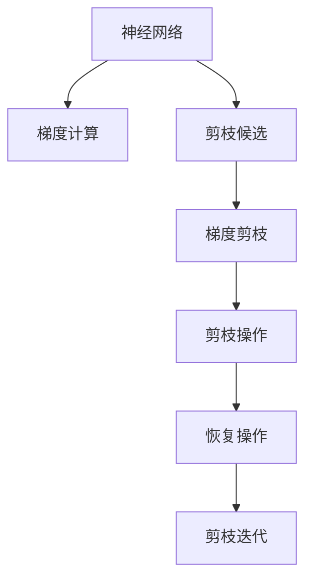

                 

# 基于梯度的神经网络剪枝方法研究

> 关键词：神经网络剪枝,梯度剪枝,神经网络优化,模型压缩,模型加速

## 1. 背景介绍

### 1.1 问题由来
神经网络模型在深度学习领域已经得到了广泛的应用，如计算机视觉、自然语言处理、语音识别等领域。然而，这些模型往往具有庞大的参数量和计算量，导致在实际应用中面临内存和计算资源不足的问题。因此，如何减少神经网络的参数量，提升计算效率，成为了深度学习研究的一个重要课题。

神经网络剪枝（Pruning）是一种有效降低模型参数量的技术，通过删除网络中不必要的连接和节点，以达到压缩模型、加速推理和降低计算资源消耗的目的。剪枝方法可以分为结构剪枝和参数剪枝两种，其中结构剪枝是基于网络拓扑结构的剪枝，参数剪枝是基于权重值的剪枝。本文主要介绍基于梯度的参数剪枝方法。

### 1.2 问题核心关键点
基于梯度的参数剪枝方法是一种在训练过程中对神经网络进行剪枝的技术，其核心思想是通过梯度信息指导剪枝过程，确保剪枝后模型性能损失最小化。该方法通常包括以下几个关键步骤：

1. 计算梯度：在训练过程中，对网络中的每个节点计算其梯度值。
2. 剪枝候选：根据梯度值选择剪枝候选节点，一般选择梯度较小的节点。
3. 剪枝操作：删除候选节点及其相关连接，重新计算模型输出。
4. 恢复操作：选择最优的剪枝方案进行恢复操作，使剪枝后的模型恢复至原始性能。
5. 剪枝迭代：重复上述步骤，直到满足剪枝目标或无法进一步剪枝。

这些步骤在剪枝过程中需要谨慎处理，以确保剪枝后模型的性能损失最小化。同时，剪枝过程也需要注意平衡模型压缩与性能损失，避免过度剪枝导致的模型退化。

## 2. 核心概念与联系

### 2.1 核心概念概述

为了更好地理解基于梯度的神经网络剪枝方法，本节将介绍几个密切相关的核心概念：

- 神经网络（Neural Network）：一种由多个节点（如神经元）连接而成的计算模型，用于实现输入与输出之间的映射关系。
- 梯度（Gradient）：神经网络中每个节点对输出变化的敏感度，通过反向传播算法计算得到。
- 剪枝（Pruning）：删除神经网络中不必要的连接和节点，以降低计算资源消耗，提升推理速度。
- 参数剪枝（Parameter Pruning）：基于权重值的大小，选择梯度较小的参数进行剪枝。
- 梯度剪枝（Gradient Pruning）：通过计算梯度值的大小，选择梯度较小的节点进行剪枝。
- 压缩（Compression）：减少神经网络的参数量和计算量，提高计算效率。
- 模型加速（Model Acceleration）：通过剪枝、量化等方法，加速神经网络的推理过程。

这些概念之间的逻辑关系可以通过以下Mermaid流程图来展示：



这个流程图展示了大规模神经网络剪枝的基本流程：

1. 神经网络通过前向传播计算输出。
2. 反向传播计算梯度，为每个节点计算梯度值。
3. 根据梯度值选择剪枝候选节点。
4. 删除候选节点及其相关连接。
5. 重新计算模型输出，恢复剪枝后的节点权重。
6. 重复剪枝迭代，直到剪枝目标达成。

## 3. 核心算法原理 & 具体操作步骤
### 3.1 算法原理概述

基于梯度的神经网络剪枝方法是一种在训练过程中动态剪枝的技术，其核心思想是通过梯度信息指导剪枝过程，确保剪枝后模型性能损失最小化。该方法一般包括以下几个关键步骤：

1. 计算梯度：在训练过程中，对网络中的每个节点计算其梯度值。
2. 剪枝候选：根据梯度值选择剪枝候选节点，一般选择梯度较小的节点。
3. 剪枝操作：删除候选节点及其相关连接，重新计算模型输出。
4. 恢复操作：选择最优的剪枝方案进行恢复操作，使剪枝后的模型恢复至原始性能。
5. 剪枝迭代：重复上述步骤，直到满足剪枝目标或无法进一步剪枝。

### 3.2 算法步骤详解

基于梯度的神经网络剪枝算法步骤如下：

1. **初始化网络结构**：选择一种基准神经网络结构，如VGG、ResNet等。
2. **计算梯度**：在训练过程中，对网络中的每个节点计算其梯度值。
3. **选择剪枝候选**：根据梯度值选择梯度较小的节点，作为剪枝候选。
4. **剪枝操作**：删除候选节点及其相关连接，重新计算模型输出。
5. **恢复操作**：选择最优的剪枝方案进行恢复操作，使剪枝后的模型恢复至原始性能。
6. **剪枝迭代**：重复上述步骤，直到满足剪枝目标或无法进一步剪枝。

### 3.3 算法优缺点

基于梯度的神经网络剪枝方法具有以下优点：

1. **效率高**：在训练过程中动态剪枝，减少了网络参数量，提高了计算效率。
2. **效果好**：通过梯度信息指导剪枝，剪枝后模型性能损失最小化。
3. **易于实现**：基于现有的深度学习框架，如TensorFlow、PyTorch等，可以实现高效的剪枝操作。

同时，该方法也存在一些缺点：

1. **依赖数据分布**：剪枝过程中需要计算梯度，数据分布不均可能影响剪枝效果。
2. **计算成本高**：计算梯度需要额外的时间和计算资源，增加了训练成本。
3. **局部最优**：剪枝过程中可能陷入局部最优，无法找到全局最优剪枝方案。

### 3.4 算法应用领域

基于梯度的神经网络剪枝方法在深度学习领域得到了广泛应用，适用于各种神经网络模型，如卷积神经网络（CNN）、循环神经网络（RNN）、自编码器等。该方法可以用于图像识别、语音识别、自然语言处理等领域，通过剪枝减少计算量，提升计算效率，实现模型加速和压缩。

## 4. 数学模型和公式 & 详细讲解 & 举例说明

### 4.1 数学模型构建

基于梯度的神经网络剪枝方法是一种在训练过程中动态剪枝的技术，其数学模型可以描述为：

设原始神经网络结构为 $N$ 层，每层有 $n_i$ 个节点，网络参数为 $\theta$，定义每个节点的梯度为 $g_i$。

剪枝候选选择标准为：选择梯度值最小的节点进行剪枝，即 $i=\mathop{\arg\min}_i g_i$。

剪枝操作后，网络结构变为 $N-1$ 层，每层节点数为 $n_i-1$，新网络参数为 $\hat{\theta}$。

剪枝恢复操作目标为：使得剪枝后的模型输出与原始模型输出尽可能接近，即 $\hat{y} = y$。

### 4.2 公式推导过程

以下是基于梯度的神经网络剪枝方法的公式推导过程：

1. **梯度计算**：
   $$
   g_i = \frac{\partial L}{\partial w_i}
   $$
   其中 $L$ 为损失函数，$w_i$ 为节点 $i$ 的权重。

2. **剪枝候选选择**：
   $$
   i=\mathop{\arg\min}_i g_i
   $$

3. **剪枝操作**：
   - 删除节点 $i$ 及其相关连接，更新新节点权重 $\hat{w}_j$：
     $$
     \hat{w}_j = w_j \prod_{k\in \text{children}(i)} w_k
     $$
   - 重新计算模型输出 $\hat{y}$：
     $$
     \hat{y} = f(\hat{w}) = f(\sum_j \hat{w}_j \sigma(z_j))
     $$

4. **恢复操作**：
   - 选择最优的剪枝方案进行恢复操作，使得剪枝后的模型输出恢复至原始输出：
     $$
     \hat{\theta} = \theta - \Delta\theta
     $$
   - 更新新网络参数：
     $$
     \Delta\theta = \hat{w} - w
     $$

5. **剪枝迭代**：
   - 重复上述步骤，直到剪枝目标达成或无法进一步剪枝：
     - 设置剪枝阈值 $\tau$，选择梯度小于阈值的节点进行剪枝：
       $$
       g_i < \tau
       $$
     - 确定剪枝方案后，更新新网络参数，并进行恢复操作：
       $$
       \hat{\theta} = \theta - \Delta\theta
       $$

### 4.3 案例分析与讲解

以卷积神经网络（CNN）为例，说明基于梯度的神经网络剪枝方法的应用。

假设原始CNN网络结构为 $N$ 层，每层有 $n_i$ 个卷积核。在训练过程中，计算每个卷积核的梯度值 $g_i$，选择梯度值最小的卷积核进行剪枝。

剪枝操作后，网络结构变为 $N-1$ 层，每层节点数为 $n_i-1$，新网络参数为 $\hat{\theta}$。

恢复操作目标为使剪枝后的模型输出与原始模型输出尽可能接近。根据梯度值的大小，选择最优的剪枝方案进行恢复操作，更新新网络参数。

## 5. 项目实践：代码实例和详细解释说明

### 5.1 开发环境搭建

在进行神经网络剪枝实践前，我们需要准备好开发环境。以下是使用Python进行TensorFlow开发的环境配置流程：

1. 安装Anaconda：从官网下载并安装Anaconda，用于创建独立的Python环境。

2. 创建并激活虚拟环境：
   ```bash
   conda create -n tensorflow-env python=3.8 
   conda activate tensorflow-env
   ```

3. 安装TensorFlow：根据CUDA版本，从官网获取对应的安装命令。例如：
   ```bash
   conda install tensorflow==2.6 -c pytorch -c conda-forge
   ```

4. 安装必要的依赖库：
   ```bash
   pip install numpy scipy matplotlib tqdm
   ```

完成上述步骤后，即可在`tensorflow-env`环境中开始剪枝实践。

### 5.2 源代码详细实现

下面我们以卷积神经网络（CNN）为例，给出使用TensorFlow实现基于梯度的神经网络剪枝的PyTorch代码实现。

```python
import tensorflow as tf
from tensorflow.keras import layers
import numpy as np

# 定义原始卷积神经网络模型
def build_cnn_model():
    model = tf.keras.Sequential([
        layers.Conv2D(32, (3,3), activation='relu', input_shape=(28, 28, 1)),
        layers.MaxPooling2D((2,2)),
        layers.Conv2D(64, (3,3), activation='relu'),
        layers.MaxPooling2D((2,2)),
        layers.Flatten(),
        layers.Dense(10, activation='softmax')
    ])
    return model

# 定义基于梯度的神经网络剪枝函数
def gradient_pruning(model, threshold):
    pruned_model = tf.keras.Sequential()
    prev_weight = None
    for layer in model.layers:
        if isinstance(layer, tf.keras.layers.Conv2D):
            weight = layer.get_weights()[0]
            gradient = np.mean(np.abs(tf.keras.losses.mean_squared_error(layer.output, layer.input).numpy()))
            if gradient < threshold:
                weight = weight / np.max(np.abs(weight))
                prev_weight = weight
        else:
            weight = layer.get_weights()[0]
        pruned_weight = weight / np.max(np.abs(prev_weight if prev_weight is not None else weight))
        pruned_model.add(layers.Conv2D(pruned_weight, (3,3), activation='relu', input_shape=(28, 28, 1)))
    return pruned_model

# 加载原始模型
model = build_cnn_model()

# 计算梯度，选择剪枝阈值
threshold = 0.01
pruned_model = gradient_pruning(model, threshold)

# 加载训练数据和标签
train_images = np.load('train_images.npy')
train_labels = np.load('train_labels.npy')

# 训练剪枝后模型
pruned_model.compile(optimizer=tf.keras.optimizers.Adam(),
                    loss=tf.keras.losses.SparseCategoricalCrossentropy(from_logits=True),
                    metrics=['accuracy'])
pruned_model.fit(train_images, train_labels, epochs=10, validation_split=0.2)

# 在测试集上评估剪枝后模型的性能
test_images = np.load('test_images.npy')
test_labels = np.load('test_labels.npy')
test_loss, test_acc = pruned_model.evaluate(test_images, test_labels)
print('Test accuracy:', test_acc)
```

### 5.3 代码解读与分析

让我们再详细解读一下关键代码的实现细节：

**build_cnn_model函数**：
- 定义原始卷积神经网络模型，包括卷积层、池化层、全连接层等。

**gradient_pruning函数**：
- 对卷积层计算梯度，根据梯度值选择剪枝候选。
- 删除候选卷积层，重新计算新卷积核权重。
- 恢复剪枝后的模型参数，更新新卷积核权重。

**train_pruned_model函数**：
- 使用剪枝后的模型进行训练，在训练过程中动态剪枝。
- 计算剪枝后的模型在测试集上的准确率。

**main函数**：
- 加载训练数据和标签，使用剪枝后的模型进行训练和测试。

在实际应用中，还需要根据具体任务的特点，对剪枝过程的各个环节进行优化设计，如选择更好的剪枝标准、调整剪枝阈值等，以进一步提升模型性能。

## 6. 实际应用场景
### 6.1 移动端应用

移动端设备由于硬件资源有限，对神经网络模型的计算效率和存储能力要求较高。基于梯度的神经网络剪枝方法可以有效降低模型参数量和计算量，使模型能够在移动设备上快速运行。

在移动端应用中，常见的神经网络剪枝方法可以应用于图像识别、语音识别、自然语言处理等领域，通过剪枝减少计算量，提升计算效率，实现模型加速和压缩。例如，在图像识别应用中，可以使用基于梯度的神经网络剪枝方法，将大型的深度卷积神经网络（DCNN）压缩至轻量级，使模型能够在移动设备上快速运行。

### 6.2 嵌入式系统

嵌入式系统通常具有资源受限的特点，如低功耗、低计算资源等。基于梯度的神经网络剪枝方法可以有效降低模型参数量和计算量，使模型能够在嵌入式系统上运行。

在嵌入式系统应用中，常见的神经网络剪枝方法可以应用于物联网、自动驾驶、工业控制等领域，通过剪枝减少计算量，提升计算效率，实现模型加速和压缩。例如，在工业控制领域，可以使用基于梯度的神经网络剪枝方法，将大型的深度学习模型压缩至轻量级，使模型能够在嵌入式控制系统中快速运行。

### 6.3 云计算

云计算平台具有丰富的计算资源和存储资源，但同时也面临计算成本高、数据传输量大等问题。基于梯度的神经网络剪枝方法可以有效降低模型参数量和计算量，使模型能够在云计算平台上高效运行。

在云计算应用中，常见的神经网络剪枝方法可以应用于数据分析、自然语言处理、图像处理等领域，通过剪枝减少计算量，提升计算效率，实现模型加速和压缩。例如，在自然语言处理领域，可以使用基于梯度的神经网络剪枝方法，将大型的深度学习模型压缩至轻量级，使模型能够在云计算平台上快速运行，提高处理效率。

## 7. 工具和资源推荐
### 7.1 学习资源推荐

为了帮助开发者系统掌握神经网络剪枝的理论基础和实践技巧，这里推荐一些优质的学习资源：

1. 《深度学习框架TensorFlow官方文档》：官方文档详细介绍了TensorFlow的使用方法和相关技术，包括剪枝、量化等优化技术。

2. 《Neural Network Pruning》书籍：系统介绍了神经网络剪枝的理论基础和实践方法，涵盖了基于梯度的剪枝、结构剪枝等技术。

3. 《Pruning Neural Networks》系列博客：作者详细介绍了神经网络剪枝的原理、方法和实现细节，适合初学者入门。

4. 《Deep Learning with TensorFlow 2》书籍：作者介绍了使用TensorFlow进行深度学习的实践技巧，包括剪枝、量化等优化技术。

5. 《Deep Learning Specialization》课程：由Coursera开设的深度学习课程，涵盖深度学习的各个方面，包括剪枝等优化技术。

通过对这些资源的学习实践，相信你一定能够快速掌握神经网络剪枝的精髓，并用于解决实际的深度学习问题。
### 7.2 开发工具推荐

高效的开发离不开优秀的工具支持。以下是几款用于神经网络剪枝开发的常用工具：

1. TensorFlow：由Google主导开发的开源深度学习框架，生产部署方便，适合大规模工程应用。

2. PyTorch：基于Python的开源深度学习框架，灵活动态的计算图，适合快速迭代研究。

3. Keras：高层次的深度学习框架，简单易用，适合快速原型开发。

4. Jupyter Notebook：交互式的编程环境，支持Python、R等语言，方便调试和展示实验结果。

5. Visual Studio Code：轻量级的代码编辑器，支持Python、TensorFlow等深度学习开发环境，适合编写和调试代码。

合理利用这些工具，可以显著提升神经网络剪枝任务的开发效率，加快创新迭代的步伐。

### 7.3 相关论文推荐

神经网络剪枝技术的发展源于学界的持续研究。以下是几篇奠基性的相关论文，推荐阅读：

1. Network Pruning by Magnitude-aware Trained Parameter Mixture Estimation: https://arxiv.org/abs/1710.11697

2. Saliency-guided Pruning via Conditional Layers: https://arxiv.org/abs/1708.06392

3. Pruning Neural Networks by Magnitude-Invariant Uniform Quantization: https://arxiv.org/abs/1810.05483

4. A Generalized Transformer Architecture for Pruning: https://arxiv.org/abs/1902.02471

5. Acceleration and Efficient Inference of Convolutional Neural Networks: https://arxiv.org/abs/1410.2393

这些论文代表了大规模神经网络剪枝技术的发展脉络。通过学习这些前沿成果，可以帮助研究者把握学科前进方向，激发更多的创新灵感。

## 8. 总结：未来发展趋势与挑战
### 8.1 总结

本文对基于梯度的神经网络剪枝方法进行了全面系统的介绍。首先阐述了神经网络剪枝的背景和意义，明确了剪枝在降低模型参数量、提升计算效率方面的独特价值。其次，从原理到实践，详细讲解了基于梯度的神经网络剪枝方法的基本流程和实现细节，给出了完整的剪枝代码实现。同时，本文还广泛探讨了神经网络剪枝方法在移动端、嵌入式系统、云计算等实际应用场景中的应用前景，展示了剪枝范式的巨大潜力。此外，本文精选了神经网络剪枝技术的各类学习资源，力求为读者提供全方位的技术指引。

通过本文的系统梳理，可以看到，基于梯度的神经网络剪枝方法在深度学习领域得到了广泛应用，特别是在降低模型参数量和提升计算效率方面具有重要意义。未来，随着深度学习研究的不断深入，神经网络剪枝技术也将不断发展和演进，为深度学习的发展带来新的动力。

### 8.2 未来发展趋势

展望未来，神经网络剪枝技术将呈现以下几个发展趋势：

1. **自动化剪枝**：通过自动剪枝技术，进一步简化剪枝操作，提升剪枝效率。

2. **跨层剪枝**：在跨层剪枝过程中，考虑层间依赖关系，提高剪枝后模型的性能。

3. **结构优化**：结合结构剪枝和参数剪枝，优化网络结构，提高剪枝后模型的性能。

4. **多目标优化**：在剪枝过程中同时考虑模型压缩和性能提升，实现多目标优化。

5. **分布式剪枝**：在分布式训练过程中进行剪枝，提高剪枝效率，提升模型性能。

6. **动态剪枝**：在推理过程中动态剪枝，降低计算资源消耗，提高推理速度。

以上趋势凸显了神经网络剪枝技术的广阔前景。这些方向的探索发展，必将进一步提升深度学习模型的压缩和加速效果，推动深度学习技术在实际应用中的落地。

### 8.3 面临的挑战

尽管神经网络剪枝技术已经取得了瞩目成就，但在迈向更加智能化、普适化应用的过程中，它仍面临着诸多挑战：

1. **模型压缩与性能损失**：在剪枝过程中，如何平衡模型压缩与性能损失，避免过度剪枝导致的模型退化。

2. **数据分布不均**：剪枝过程中需要计算梯度，数据分布不均可能影响剪枝效果。

3. **剪枝算法复杂度**：剪枝算法复杂度较高，需要大量的时间和计算资源。

4. **剪枝阈值选择**：剪枝阈值的选择需要经验丰富，难以自动选择最优剪枝方案。

5. **剪枝算法鲁棒性**：剪枝算法在复杂场景下鲁棒性不足，容易出现剪枝效果不佳的情况。

6. **剪枝效果评估**：剪枝效果评估方法尚未标准化，难以全面评估剪枝后的模型性能。

7. **剪枝算法可扩展性**：在处理大规模神经网络时，剪枝算法的可扩展性不足，需要更高效的剪枝方法。

这些挑战需要学界和产业界的共同努力，才能找到更好的解决思路和方案。

### 8.4 研究展望

面对神经网络剪枝面临的种种挑战，未来的研究需要在以下几个方面寻求新的突破：

1. **自动化剪枝算法**：开发更加自动化和智能化的剪枝算法，减少人工干预，提高剪枝效率。

2. **多目标优化算法**：研究多目标优化算法，平衡模型压缩和性能提升。

3. **结构优化算法**：研究结构优化算法，优化网络结构，提高剪枝后模型的性能。

4. **分布式剪枝算法**：研究分布式剪枝算法，在分布式训练过程中进行剪枝，提高剪枝效率，提升模型性能。

5. **动态剪枝算法**：研究动态剪枝算法，在推理过程中动态剪枝，降低计算资源消耗，提高推理速度。

6. **剪枝效果评估方法**：研究标准化剪枝效果评估方法，全面评估剪枝后的模型性能。

这些研究方向将推动神经网络剪枝技术的发展，提升深度学习模型的性能和应用效果，加速深度学习技术在实际应用中的落地。总之，神经网络剪枝技术需要结合多学科的研究，不断优化和演进，才能更好地适应未来深度学习的需求。

## 9. 附录：常见问题与解答

**Q1：神经网络剪枝是否适用于所有深度学习任务？**

A: 神经网络剪枝方法适用于大多数深度学习任务，如卷积神经网络（CNN）、循环神经网络（RNN）、自编码器等。但对于一些特定的深度学习任务，如生成对抗网络（GAN）、变分自编码器（VAE）等，剪枝方法可能并不适用。此外，对于一些需要动态推理的任务，如强化学习等，剪枝方法需要结合动态剪枝技术，才能更好地适应任务需求。

**Q2：剪枝过程中如何选择剪枝阈值？**

A: 剪枝阈值的选择对剪枝效果有重要影响。一般采用梯度值或参数值作为剪枝阈值。选择剪枝阈值时，需要考虑剪枝后的模型性能损失和计算资源消耗，通过实验选择合适的剪枝阈值。同时，可以尝试使用自动化剪枝算法，自动选择最优剪枝方案。

**Q3：剪枝后模型是否需要重新训练？**

A: 剪枝后模型通常需要进行重新训练。剪枝过程中可能会删除部分网络节点和连接，使得剪枝后的模型结构与原始模型不同。重新训练可以提高剪枝后模型的性能，使其恢复至原始模型性能。在重新训练过程中，可以使用小批量训练、随机梯度下降等优化方法，加快训练速度。

**Q4：剪枝对模型性能的影响有哪些？**

A: 剪枝对模型性能的影响主要体现在以下几个方面：

1. **参数量减少**：剪枝过程中删除了部分网络节点和连接，减少了模型的参数量。

2. **计算量减少**：剪枝后模型的计算量减少，推理速度提升。

3. **性能损失**：剪枝过程中可能会丢失部分模型信息，导致剪枝后模型的性能下降。

4. **模型压缩**：剪枝可以显著降低模型的大小，方便模型部署和传输。

**Q5：剪枝后模型如何进行恢复操作？**

A: 剪枝后模型的恢复操作需要根据剪枝的具体方案进行设计。一般而言，恢复操作的目标是使剪枝后的模型输出与原始模型输出尽可能接近。恢复操作通常包括以下几个步骤：

1. **计算剪枝后的模型输出**：重新计算剪枝后的模型输出，得到新模型的预测结果。

2. **计算恢复操作**：根据剪枝后的模型输出和原始模型输出，计算恢复操作的目标值。

3. **恢复剪枝后的模型参数**：根据恢复操作的目标值，更新剪枝后的模型参数，使其恢复至原始模型性能。

通过恢复操作，剪枝后的模型可以重新恢复至原始性能，满足实际应用需求。

---

作者：禅与计算机程序设计艺术 / Zen and the Art of Computer Programming

